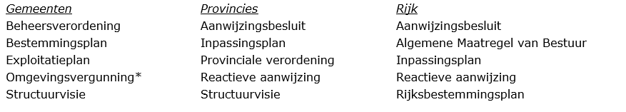

# Handreiking: archiveren ruimtelijke plannen organiseren

**In dit hoofdstuk wordt in drie stappen uiteengezet welke informatie verzameld
moet worden om ruimtelijke plannen digitaal te archiveren. De stappen worden
genomen door de bestuursorganen en betreft het vastleggen op organisatieniveau,
type plan en vervolgens het ruimtelijke plan zelf. Dit hoofdstuk is een
vertaling van de hoofdstukken drie en vier die de achtergrond van wet- en regelgeving
en andere belangrijke aspecten weergeven.**

## Algemeen

Het digitaal archiveren van de ruimtelijke plannen op grond van de Wro maakt nu
over het algemeen geen deel uit van het werkproces waarbij ruimtelijke plannen
worden gemaakt, vastgesteld en in werking treden. In wet- en regelgeving, zie
[hoofdstuk 3](#H03) en [hoofdstuk 4](#H04), is vastgelegd welke informatie tijdelijk of
permanent dient te worden bewaard, of er gebruik kan worden gemaakt van ‘zip’,
of dat archiveren alleen in bepaalde systemen is toegestaan. Zonder de
informatie uit deze hoofdstukken kan het lastig zijn dit hoofdstuk te
implementeren.

De focus van deze handreiking is erop gericht om een aanzet te geven het
werkproces zo in te richten dat ruimtelijke plannen worden gearchiveerd, conform
de voorgeschreven wet- en regelgeving. De handreiking richt zich op het
archiveren van de samenhangende set bronbestanden en de ondergrond van het
ruimtelijk plan. Daarvoor is in eerste instantie het verzamelen en borgen van
informatie nodig. Bij het digitaal archiveren van ruimtelijke plannen gaat het
om twee soorten informatie:  
1.  documentatie tijdens het werkproces;  
2.  de bronbestanden die samen het ruimtelijke plan vormen.

Welke bronbestanden samen het ruimtelijke plan vormen is mede bepaald door het
type ruimtelijke plan en wordt voorgeschreven vanuit de RO Standaarden
(zie paragraaf [3.1.2](#welke-ruimtelijke-plannen)). De verschillende bestuursorganen maken gebruik van beheer
software om deze verzameling (dataset) aan te leggen en beschikbaar te stellen.
In deze handreiking gaan we dan ook niet in op de wijze van verzamelen van de
samenhangende set van bronbestanden zelf, maar richten we ons op de
documentatie: welke informatie moet er worden gedocumenteerd met betrekking tot
het archiveren en waar ontstaat deze informatie in het proces van creatie en
vaststelling van het ruimtelijke plan? 
De metadata, slechts een van de vele vereisten van het archiveren, zijn hierbij het uitgangspunt. Metadata (ook wel
metagegevens genoemd) zijn gegevens die de karakteristieken van gegevens
beschrijven. Het zijn eigenlijk gegevens over de data. Voorbeelden van karakteristieken
zijn de creator, de datum van creatie, de gebruikte taal en het bestandsformaat.
Metadata beschrijven niet alleen de gegevens zelf, maar ook de context
waarbinnen de gegevens zijn ontstaan of ontvangen. En wat er vanaf het moment
van ontstaan of ontvangst met die gegevens is gebeurd.

De handreiking kan tevens worden gebruikt als leidraad bij het archiveren van de
overige digitale archiefbescheiden die in het werkproces ontstaan, zoals
zienswijzen en andere onderdelen dan de samenhangende set bronbestanden van het
ruimtelijk plan. Het gebruik van een (bepaald) archiefsysteem (paragraaf [4.5](#archiefsysteem))
komt niet aan de orde, omdat dit voor iedere organisatie weer anders kan zijn.
Dit heeft echter geen invloed op de het verzamelen van de informatie die
gearchiveerd moet worden.

Om te kunnen gaan archiveren moet dit worden georganiseerd voordat feitelijk
archiefbescheiden worden aangeboden. Het organiseren van dit archiveringsproces
valt uiteen in de volgende stappen:  
1.  inzicht krijgen in de organisatie van informatie in de organisatie;  
2.  indelen van ruimtelijke plannen per procedure;  
3.  vastleggen van informatie tijdens het werkproces.

De RO Standaarden maken gebruik van dossiers. Het ruimtelijke plan wordt met de
eventuele verschillende fasen vastgelegd in dat dossier en op die wijze
beschikbaar gesteld (paragraaf [3.2.1](#digitale-ruimtelijke-ordening). De term dossier sluit aan op de in deze
handreiking ook aangehaalde term ‘zaak’. Het zaakgericht werken is een manier,
hulpmiddel bij het archiveren, echter geen verplichting.

## Stap 1: inzicht in organisatie van informatie

Inzicht biedt organisaties duidelijkheid over:
- welke informatie binnen de organisatie aanwezig is;  
- waar die informatie zich bevindt (systemen);  
- wie er verantwoordelijk is voor welke informatie.

Voor het beschrijven van informatie(objecten), zoals de structuur en betekenis
daarvan, kan een informatiemodel gemaakt worden of gebruik gemaakt worden van
sectorspecifieke modellen. IMRO2012 is in dit geval een relevante
sectorstandaard. Het hebben van een informatiemodel is ook een eis uit
[DUTO](https://www.nationaalarchief.nl/archiveren/duto), het normenkader
voor duurzame toegankelijkheid van overheidsinformatie. De DUTO-eisen zijn een
programma van eisen voor duurzame toegankelijkheid van de informatie in de
informatiesystemen van overheidsorganisaties. De eisen zijn generiek van aard en
weerspiegelen de eisen die gebruikers stellen aan de toegankelijkheid van de
informatie. In dit geval betreft het informatie gerelateerd aan ruimtelijke
plannen.
Het Nationaal Archief heeft een overzicht van de [DUTO-eisen](https://www.nationaalarchief.nl/archiveren/kennisbank/overzicht-duto-eisen). Meer hierover in [bijlage 1](#B01).

De volgende ruimtelijke plannen worden door de verschillende bestuursorganen
gecreëerd:

*In bovenstaande lijst komt ook omgevingsvergunning voor. Hiermee wordt
kortweg aangegeven de omgevingsvergunning voor het afwijken van een
bestemmingsplan: de mededeling van een met artikel 2.12, eerste lid, onderdeel
a, onder 3 van de Wabo verleende omgevingsvergunning.*

Naast deze ruimtelijke plannen is de gerechtelijke uitspraak conform de RO
Standaarden ook een type ruimtelijk plan. De basis voor dit instrument is gelegd in het Bro artikel 1.2.1 lid 3 met
de daarbij behorende toelichting onderdeel L van Nota van Toelichting.
Wanneer bijvoorbeeld in de
procedure van het bestemmingsplan beroep volgt, heeft de uitspraak gevolgen voor
het vastgestelde plan. Dit is een nieuwe fase in de procedure en wordt bij
voorkeur als subdossier binnen het bestemmingsplan gearchiveerd. Zie paragraaf
[2.4.2](#subdossier).

Organisaties gebruiken meerdere systemen om informatie mee vast te leggen en te
beheren. Het archiveren van digitale ruimtelijke plannen kan in een of meerdere
van die informatiesystemen. Deze systemen kunnen specifiek voor archivering
bedoeld zijn, of vakapplicaties in het primaire proces die bepaalde
archiveringsfunctionaliteit hebben (zoals functionaliteit voor vernietiging) .  
Een organisatie zal daarin keuzes moeten maken, omdat het gevolgen heeft voor
werkprocessen en de inrichting van systemen. Systemen zullen, idealiter [by
design](https://www.nationaalarchief.nl/archiveren/kennisbank/archiveren-by-design),
in staat moeten zijn om informatie duurzaam toegankelijk te kunnen houden voor
zolang als nodig.  
Kaders voor de inrichting van systemen worden gegeven vanuit wet- en
regelgeving, maar ook vanuit normen en standaarden. Een overzicht hiervan is in
[hoofdstuk 3](#H03) te vinden.

Als duidelijk is welke informatie zich waar bevindt, is het belangrijk om te
bepalen wie verantwoordelijk is voor de creatie en het beheer van informatie
gerelateerd aan ruimtelijke plannen (de ‘actor’). De vastlegging hiervan kan
door middel van metadata. Zeker in het geval van keteninformatisering is het
belangrijk dat de betrokken organisaties hierover afspraken maken.

Informatie met betrekking tot identificatie van de eigenaar en maker van het
ruimtelijk plan wordt *eenmalig* in het gebruikte archiefsysteem van de
organisatie vastgelegd. In het kader van ruimtelijke plannen is onderstaande
informatie naar verwachting reeds vastgelegd en kan als eventuele controle
gebruikt worden.

De volgende metadata is of wordt verzameld:  
-   *Zorgdrager*  
Het bestuursorgaan dat conform de Archiefwet de verantwoordelijkheid heeft
voor het archiveren van het ruimtelijk plan wordt aangeduid als de
zorgdrager. Dit bestuursorgaan is conform de Wro de bronhouder van het
ruimtelijk plan.  
Bij de verschillende bestuursorganen zijn hiervoor aangewezen:
	- Gemeente: College van Burgemeester en Wethouders;  
	- Provincie: Gedeputeerde Staten of Provinciale Staten;

**Toelichting gemeente:** Conform artikel 3.1 van de Wet ruimtelijke ordening stelt de gemeenteraad
een ruimtelijk plan vast. Vanuit de Archiefwet is echter het college aangewezen
als zorgdrager. Verantwoordelijke voor het archiveren is daardoor niet
verantwoordelijke voor het vaststellen.  

**Toelichting provincie:** Afhankelijk van het type ruimtelijk plan/ zaaktype is Gedeputeerde Staten,
dan wel Provinciale Staten aangewezen als zorgdrager van het ruimtelijk plan.  
Rijk: Betrokken Minister(‘s)  

Voor het vastleggen van en verwijzen naar institutionele informatie over
bestuursorganen kan gebruik gemaakt worden van het [Actorenregister](https://actorenregister.nationaalarchief.nl/) van het
Nationaal Archief. Op deze manier is een verwijzing in de metadata voldoende
en kan worden voorkomen dat deze informatie redundant bij de informatie zelf
wordt opgeslagen. 

-   *Beheerder*  
De beheerder van het ruimtelijk plan wordt door het bestuur van de eigen
organisatie aangewezen. De beheerder legt bijvoorbeeld beheeractiviteiten
vast en deelt de activiteit in naar type plan en naar fase(n) van dat plan,
zie stap 2 in paragraaf [2.3.](#stap-2-zaaktypen-per-procedure)
Bijvoorbeeld: algemeen directeur bij een provincie of gemeente secretaris.  

-   *Archiefvormer*  
De archiefvormer is de organisatie of het organisatieonderdeel dat het
ruimtelijke plan creëert. Dit kan tegelijkertijd ook de zorgdrager zijn. In
de loop der tijd kan het zorgdragerschap overgaan naar een andere
organisatie. Door het vastleggen van de archiefvormer is echter wel altijd
na te gaan wie de stukken oorspronkelijk creëerde of ontving en daar in
eerste instantie voor verantwoordelijk was.  

-   *Mandaat*  
Het mandaat waaronder informatie wordt gevormd of ontvangen. In het
mandaatbesluit van het betreffende organisatieonderdeel is bepaald welk
ruimtelijk plan zij oplevert.

## Stap 2: zaaktypen per procedure

Als duidelijk is welk organisatieonderdeel archiefbescheiden oplevert, wordt
informatie met betrekking tot de type ruimtelijke plannen *eenmalig* in de
organisatie vastgelegd. Er kan daarbij gebruik worden gemaakt van zaaktypen,
of zaakomschrijvingen en deze vastleggen in de vorm van een zaaktypecatalogus.
Dit is niet verplicht en aan de betreffende overheid, dat organisatieonderdeel
te bepalen.

De VNG heeft een GEMMA zaaktypecatalogus (ZTC) ontwikkeld
voor het ontwerpen, beheren en uitwisselen van zaaktypen. De laatste versie is beschikbaar via het overzicht op [GEMMA online](https://www.gemmaonline.nl/index.php/GEMMA_Zaaktypecatalogus)

Welke ruimtelijke plannen conform Wro en Wabo (daarmee zaaktypen) per
bestuursorgaan worden vastgelegd, is in paragraaf [2.2](#stap-1-inzicht-in-organisatie-van-informatie) aangegeven. Er moet
daarnaast onder andere gebruik worden gemaakt worden van RO Standaarden en de
metadata standaarden uit het toepassingsprofiel (paragraaf [3.2](#normen-en-standaarden)).

Het bepalen van het type ruimtelijk plan geeft tevens inzicht in de fasen en
onderdelen: welke activiteiten vinden er plaats tijdens de procedure van het
ruimtelijk plan. Er wordt daarbij inzicht gegeven in de procedure van het
ruimtelijk plan; wanneer is een fase klaar en welke informatie is
archiefplichting. De selectielijst (paragraaf [4.2](#bewaartermijnen)) geeft inzicht in de
bewaartermijn van het betreffende ruimtelijk plan. Een selectielijst geeft aan
hoe lang de verschillende archiefbescheiden bewaard moeten of mogen worden.
Archiefbescheiden worden soms ook informatie-objecten, documenten of records
genoemd. Het [ontwerpen van een selectielijst](https://www.nationaalarchief.nl/archiveren/kennisbank/selectielijst-maken), is verplicht voor
overheidsorganisaties op basis van artikel 5 van de Archiefwet 1995. Dit artikel
blijft ook in de nieuwe archiefwet bestaan. Nieuwe selectielijsten worden door
de minister van Onderwijs, Cultuur en Wetenschap vastgesteld door middel van een
vaststellingsbesluit.

Per type plan wordt met betrekking tot de RO Standaarden vervolgens bepaald
welke documenttypen worden gearchiveerd: bijvoorbeeld plankaart, planregels en
welke bestandsformaten.

Het is aan te bevelen om van te voren een begrippenlijst vast te leggen zodat er
geen verwarring kan ontstaan over bijvoorbeeld procedure, zaak of dossier.
Een ruimtelijk plan volgt een Wro/ Awb procedure. Bij het archiveren wordt
vaak gesproken over een zaak. De zaak is gelijk aan het dossier conform de RO
Standaarden: verzameling van samenhangende set van bronbestanden van het
betreffende ruimtelijke plan.

De meest ideale situatie is als alle bestuursorganen dezelfde begrippen zouden
hanteren. Bij het toepassen hoeven dan alleen de variabelen te worden ingevuld.
Dit is in de praktijk mogelijk nog niet haalbaar. In bijlage 1 een eerste opzet
met begrippen toegevoegd.

## Stap 3: informatie vastleggen tijdens het werkproces

Per ruimtelijk plan wordt *eenmalig* per afzonderlijke procedure één
dossier/zaak in het informatiesysteem aangemaakt. Per fase in de procedure van
dit ruimtelijke plan wordt een nieuw subdossier aangemaakt. Er worden dus in het
geval van een bestemmingsplan *meermalig* subdossiers aangemaakt. Dit kan per
ruimtelijke plan verschillen en is bepaald via het zaaktype (paragraaf [2.3](#stap-2-zaaktypen-per-procedure)).

Bijvoorbeeld: bestemmingsplan Buitengebied is het dossier en het eerste
subdossier dat wordt aangemaakt is die van de fase ontwerp.

### Dossier
Dossier is een veelgebruikte naam voor een samenhangende aggregatie
van informatieobjecten (records) met een eigen identiteit. Een standaard als
TMLO schrijft geen aggregatieniveaus voor, maar biedt organisaties ruimte om
aggregaties (van records) een naam te geven die aansluit bij de eigen
ordening van informatie.

In het dossier/ zaak wordt de volgende metadata met betrekking tot het
ruimtelijke plan vastgelegd:

-   *Werkproces*  
De naam van het werkproces is gelijk aan het zaaktype zoals in paragraaf 2.3
is aangegeven. Bijvoorbeeld: bestemmingsplan. 

-   *Identificatie (ID)*  
Het ID van het archiefdossier is identiek aan het STRI2012 dossiernummer dat
bij de start van de creatie van het ruimtelijk plan door de betreffende
afdeling, dienst of team aan het ruimtelijk plan wordt toegekend.
Bijvoorbeeld: NL.IMRO.0034.BP2ABZ01  

-   *Beschrijving*  
Voor het element beschrijving kan de beschrijving van het ruimtelijke plan
uit de toelichting of de beleidstekst van het betreffende ruimtelijke plan
worden gehaald. Het is niet verplicht een beschrijving toe te voegen, maar
geeft wel beter inzicht: welk ruimtelijk plan, welk gebied is dit?  

-   *Titel*  
Voor het element titel wordt de naam van het plan gehanteerd zoals deze in
de GML en de plantekst is opgenomen. Het gaat in alle gevallen om het
attribuut “naam” van het respectievelijke plangebied in GML.
Bijvoorbeeld: Centrum Almere Stad  

-   *Externe relaties*  
Met dit element wordt de relatie met andere zaken in het interne archief
systeem of externe zaken aangegeven. Deze informatie kan direct in de GML
opgenomen zijn door middel van waarde bij het attribuut
“relatieExternPlaninfo”. Deze informatie kan ook beschikbaar zijn via de
betreffende regels/ toelichting van het ruimtelijk plan.  
Bijvoorbeeld: een verwijzing naar raadsbesluit, een exploitatieplan heeft
een relatie met het bestemmingsplan, een verwijzing naar de structuurvisie
van een provincie.  

-   *Uitvoerende*  
De naam van het organisatieonderdeel dat verantwoordelijk is voor het beheer
van de archiefstukken. Dit kan hetzelfde zijn als de archiefvormer (stap 1).  
Bijvoorbeeld: afdeling ruimtelijke ordening.  

-   *Activiteit*  
Dit element betreft de activiteit van de zaak door de zorgdrager: wat
gebeurt er met de archiefstukken? Vooraf is per zaaktype (stap 2) vastgelegd
welke activiteiten per zaaktype kunnen plaatsvinden.  
Bijvoorbeeld: ontvangst, creatie, overdracht, overbrenging, verplaatsing,
conversie, wijziging, autorisatie, vernietiging.  

-   *Planning*  
Planning is nauw verbonden met activiteit: met de planning van de
beheeractiviteit wordt aangegeven wat de planning van verschillende
activiteiten is en hoe lang deze activiteit duurt. De bewaartermijn worden
hier geconcretiseerd en gaan in op het moment dar de zaak wordt gesloten.
Bijvoorbeeld: vernietigingsjaar, overbrengingsjaar, jaar geplande conversie. 

-   *Aanwezigheid kopieversies*  
Indien van toepassing geldt hier aanduiding van de vindplaats van de
archiefstukken in andere beheeromgevingen.
Bijvoorbeeld: bij ketensamenwerking en in verband met het backupbeleid.

### Subdossier

Binnen het ruimtelijk planproces zijn diverse fasen te onderscheiden. Per
dossier kunnen deze fasen verschillen. Per fase wordt in het dossier van het
betreffende ruimtelijk plan (zaaktype) een subdossier aangemaakt. Wanneer meer
dan één fase per dossier/ zaak is te onderscheiden worden subdossiers
<u>meermalig</u> aangemaakt.

Naar voorbeeld van het bestemmingsplan of inpassingsplan kunnen de fasen en
daarmee de subdossiers concept, voorontwerp, ontwerp en vastgesteld worden
onderscheiden. Vervolgens kan nog een subdossier worden aangemaakt al naar
gelang het verloop van de bestemmingsplan procedure: geheel onherroepelijk in
werking, deels onherroepelijk in werking.
Per fase en daarmee subdossier wordt de volgende metadata verzameld.  

-   *Identificatie (ID)*  
Het ID van het subdossier is gelijk aan het IMRO2012 planidentificatienummer
dat aan deze versie van het ruimtelijk plan door de betreffende afdeling,
dienst of team aan het ruimtelijk plan wordt toegekend.
Bijvoorbeeld: NL.IMRO.0034.BP2ABZ01-ON01  

-   *Beschrijving*  
De beschrijving van dit stadium van het ruimtelijk planproces.
Bijvoorbeeld: ontwerp van het bestemmingsplan Centrum Almere Stad  

-   *Openbaarheid*  
Beperkingen in verband met privacy, vertrouwelijkheid ed. worden bij dit
element verklaard.
Bronbestanden van ruimtelijke instrumenten zijn verplicht openbaar vanaf de
fase ontwerp.  

-   *Classificatie*  
Niveau van informatiebeveiliging, bijvoorbeeld vertrouwelijk, geheim. Bij
bronbestanden van ruimtelijke instrumenten is dit niet van toepassing.  

-   *Rechten*  
Auteursrecht, gebruiksrecht, eigendomsrecht etc.. Bronbestanden van
ruimtelijke instrumenten worden als open data beschikbaar gesteld.  

-   *Integriteit*  
Informatie waaruit blijkt of een archiefstuk zijn integriteit heeft
behouden. In dit geval wordt informatie over het gebruikte PKI-Overheid
certificaat opgenomen waarmee de bronbestanden van een waarmerk zijn
voorzien. De versleuteling daarvan is opgeslagen in het bronbestand
geleideformulier.  

-   *Hogerliggend ordenings-niveau*  
Hier wordt aangegeven waar dit subdossier onderdeel van uit maakt. Er wordt verwezen naar het dossier.  

-   *Aanwezigheid kopieversies*  
Het bestuursorgaan stelt het betreffende ruimtelijke plan ook voor een ieder
beschikbaar via de weblocatie die is gemeld aan de
[Index](https://www.ruimtelijkeplannen.nl/web-roi/index/). De
publicatie datum van beschikbaarstelling wordt vastgelegd bij het archiveren
van de samenhangende set van bronbestanden.

Gemeenten, provincies en het Rijk zijn conform het Bro verplicht hun via
een vooraf opgegeven locatie aan een ieder beschikbaar, vindbaar en toegankelijk
te maken. De locatie wordt gemeld aan de index van de landelijk voorziening RO:
[https://www.ruimtelijkeplannen.nl/index](https://www.ruimtelijkeplannen.nl/index).

### Document

Binnen het subdossier worden de betreffende bestanden opgeslagen; de betreffende
documenten. Dit zijn bijvoorbeeld de bronbestanden, maar ook de ondergrond van
het ruimtelijk plan zelf:  
-   IMRO (plankaart)  
-   Planteksten  
    -   regels  
    -   beleids-/ besluitdocument  
    -   toelichting  
-   Vaststellingsbesluit  
-   Bijlage(n)  
-   Illustratie  
-   Geleidefomulier  
-   Ondergrond

Conform de Standaard Toegankelijkheid Ruimtelijke Instrumenten (STRI2012) kan de
samenstelling van de set bronbestanden per type ruimtelijke plan, maar ook per
fase van het plan, verschillen. Welke bestandsformaten moeten worden gebruikt is
tevens aangegeven in paragraaf 4.2 van de [Standaard Toegankelijkheid Ruimtelijke Instrumenten (STRI2012)](https://www.geonovum.nl/geo-standaarden/ro-standaarden-ruimtelijke-ordening/standaard-toegankelijkheid-ruimtelijke). De ondergrond maakt geen deel uit van
de set van bronbestanden die het ruimtelijke instrument vormen. Om die reden
bevat de STRI2012 geen voorschrift over de toegelaten bestandsformaten voor de
ondergrond. De [Praktijkrichtlijn Toegankelijkheid Ruimtelijke Instrumenten](https://www.geonovum.nl/geo-standaarden/ro-standaarden-ruimtelijke-ordening/praktijkrichtlijn-toegankelijkheid-ruimtelijke) geeft advies over het gebruik van het formaat.

-   *Type*
Met type en daaraan gekoppeld vorm, wordt concreet aangegeven welke
onderdelen (documenttypen) in dit subdossier vindbaar zijn. Bijvoorbeeld:
bronbestanden bestemmingsplan onderverdeeld naar kaart en regels met
toelichting en geleideformulier.
Binnen het dossier worden naast het ruimtelijk plan in bronbestanden ook
andere archiefstukken verzameld.
Bijvoorbeeld: collegevoorstel, startdocument of zienswijzen.  

-   *Bestandsnaam*  
De unieke bestandsnaam met bestandsformaat die aan ieder onderdeel van de
bronbestanden is meegegeven conform de RO Standaarden (STRI).  

-   *Vorm*  
Met vorm wordt aangegeven de verschijningsvorm, dan wel documentvorm. Bij
zienswijzen is dit bijvoorbeeld pdf, maar in het kader van het voorbeeld bij
*Type* is dit: bronbestanden.
In de RO Standaarden (STRI) is vastgelegd wat onder bronbestanden worden
verstaan en welke onderdelen dit zijn per ruimtelijk plan.  

-   *Benodigde hulpmiddelen*  
Naast *Vorm* wordt aangegeven hoe de bronbestanden kunnen worden
geraadpleegd, door middel van welke raadpleegsoftware. In het geval van
ruimtelijke plannen betreft het een viewer die de RO Standaarden
ondersteunt. Ook is het mogelijk, doordat gebruik is gemaakt van open
standaarden, in het kader van digitale duurzaamheid te verwijzen naar de RO
Standaarden. Door de beschikbaarheid van de open standaarden is op een later
tijdstip altijd de dataset van bronbestanden te interpreteren en te
verwerken voor het raadplegen.  

-   *Vindplaats*  
De fysieke of virtuele vindplaats(-en) van het archiefstuk. Dit is de
vindplaats binnen de eigen organisatie, en niet de openbare vindplaats zoals
aangegeven in het manifest van het desbetreffende bestuursorgaan. In het
geval de bronbestanden niet in een DMS zijn opgeslagen en de andere stukken
wel standaard in een DMS zijn opgeslagen, wordt aangegeven waar de
bronbestanden zijn opgeslagen.
