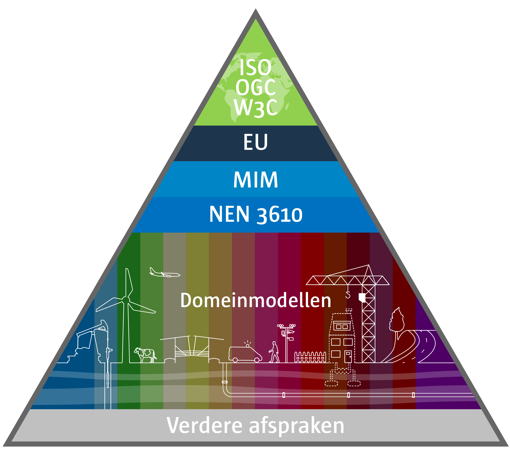

# Achtergrond: wetgeving en andere kaders

**De handreiking richt zich met het vorige hoofdstuk op het organiseren van het
archiveren van ruimtelijke plannen. Om duidelijk te krijgen waarom juist deze
informatie moet worden verzameld is aan de handreiking ook wetgeving toegevoegd
om de wettelijk verplichtingen en kaders te kunnen bepalen. Dit hoofdstuk richt
zich op de Wet ruimtelijke ordening en de Archiefwet.**

## Wetgeving

Wat betreft wetgeving hebben we primair te maken met de Wet ruimtelijke ordening
en de Archiefwet. Deze worden achtereenvolgens behandeld in deze paragraaf.

### Wet ruimtelijke ordening  
De [Wet ruimtelijke ordening (Wro)](http://wetten.overheid.nl/BWBR0020449) is op 1 juli 2008 in werking getreden. De
basis voor digitale ruimtelijke plannen is gelegd door voor verschillende
planprocedures aan te geven dat de betrokken overheid het betreffende plan,
visie of besluit tevens langs elektronische weg bekend maakt.

De uitwerking vindt plaats in het [Besluit ruimtelijke ordening (Bro)](http://wetten.overheid.nl/BWBR0023798) waar met
artikel 1.2.1 is bepaald welke instrumenten uit de Wro de betrokken
bestuursorganen aan eenieder elektronisch beschikbaar moeten stellen. De
betrokken bestuursorganen zijn gemeenten, provincies en het Rijk. Vervolgens
bepaalt artikel 1.2.1 Bro dat er een landelijke voorziening is, waar deze
visies, plannen en besluiten raadpleegbaar zijn. Verder is in de artikelen 1.2.3
en 1.2.4 Bro bepaald dat een ondergrond samen met de visie, het besluit of plan
digitaal wordt vastgesteld. 
Met de artikelen 1.2.5 en 1.2.6 Bro wordt de
ministeriële [Regeling standaarden ruimtelijke ordening](http://wetten.overheid.nl/BWBR0031829) geïntroduceerd waarin
nadere regels zijn opgenomen betreffende de geometrische plaatsbepaling en
elektronische beschikbaarstelling, vindbaarheid en toegankelijkheid van de
ruimtelijke plannen, visies en besluiten. De Regeling standaarden ruimtelijke
ordening geeft dan ook aan welke normen, aangeduid als de *RO Standaarden*, in
de praktijk moeten worden gebruikt.

Naast de beschikbaarstelling is in het Bro bepaalt met artikel 1.2.3 dat de
digitale vorm van het ruimtelijke plan de authentieke versie is. De papieren
vorm van de ruimtelijke plannen is daarvan een kopie.

### Welke ruimtelijke plannen  
In de vorige paragraaf is met artikel 1.2.1 Bro aangegeven welke ruimtelijke
plannen digitaal door de bevoegde gezagen conform de RO Standaarden beschikbaar
worden gesteld en vindbaar en toegankelijk worden gemaakt. Deze paragraaf geeft
een concreet overzicht. Dit is inclusief de omgevingsvergunning om af te wijken
van het bestemmingsplan op basis van de [Wabo](http://wetten.overheid.nl/BWBR0024779) en het [Besluit Omgevingsrecht (Bor)](https://wetten.overheid.nl/BWBR0027464). 

De wet- en regelgeving verplicht het bestuursorgaan om de mededeling
(kennisgeving in de Staatscourant) van een met artikel 2.12, eerste lid,
onderdeel a, onder 3 van de Wabo verleende omgevingsvergunning met behulp van de
RO Standaarden beschikbaar te stellen. In het Besluit Omgevingsrecht (Bor)
artikel 6.14 is aangegeven dat bij ministeriële regeling nadere regels worden
gesteld over de wijze waarop de mededeling elektronisch wordt gedaan en
beschikbaar gesteld. Dit betreft de ministeriële Regeling standaarden
ruimtelijke ordening 2012.  

Overzicht ruimtelijke plannen die door bevoegde gezagen conform de RO Standaarden beschikbaar
worden gesteld en vindbaar en toegankelijk worden gemaakt:
-   Voorbereidingsbesluit  
-   Bestemmingsplan  
-   Inpassingsplan  
-   Rijksbestemmingplan  
-   Wijzigingsplan  
-   Uitwerkingsplan  
-   Beheersverordening  
-   Exploitatieplan   
-   Gerechtelijke uitspraak  
-   Omgevingsvergunning om af te wijken van het bestemmingsplan  
-   Aanwijzingsbesluit  
-   Reactieve aanwijzing  
-   Gemeentelijke structuurvisie  
-   Provinciale structuurvisie  
-   Rijksstructuurvisie  
-   Provinciale verordening  
-   Algemene Maatregel van Bestuur
  
Daar waar gesproken wordt in deze handreiking over ruimtelijke plannen, worden
feitelijk bovenstaande plannen, visies en besluiten bedoeld. Digitaal geeft aan:
conform de RO Standaarden.

### Archiefwet  
Nederlandse overheidsorganen vallen onder de [Archiefwet 1995](https://wetten.overheid.nl/BWBR0007376). Specifieke
bepalingen uit de *Archiefwet* zijn uitgewerkt in het [Archiefbesluit](https://wetten.overheid.nl/BWBR0007748). En
gedetailleerde regels voor de informatiehuishouding en de archieven van de
overheid zijn geformuleerd in de *Archiefregeling*. Ieder overheidsorgaan moet
nadere regels vaststellen voor de organisatie van het archiefbeheer,
bijvoorbeeld in een Archiefverordening (specificatie van de wijze waarop de
zorgplicht zal worden uitgevoerd) en een besluit Informatiebeheer (specificatie
van de wijze waarop de beheerplicht zal worden uitgevoerd).

De Archiefwet en de regels die daaruit voortvloeien hebben betrekking op zowel
informatie die permanent bewaard moet blijven als op informatie die op termijn
vernietigd moet worden. De wet- en regelgeving op het gebied van archieven heeft als
belangrijkste doel de duurzaamheid, authenticiteit, betrouwbaarheid,
bruikbaarheid en integriteit van overheidsinformatie te borgen. Een belangrijk
basisconcept daarbij is dat vorm, inhoud en structuur van archiefstukken
behouden moeten blijven of tenminste reproduceerbaar moeten zijn.

## Normen en standaarden

### Digitale ruimtelijke ordening  
In het kader van de Wro zijn de RO Standaarden bepalend voor het uitwisselbaar,
beschikbaar, vindbaar en toegankelijk maken van de ruimtelijke plannen. De
Regeling standaarden ruimtelijke ordening 2012 geeft de volgende normen aan: 

1.  **IMRO**: Informatie Model Ruimtelijke Ordening  
De plankaart wordt in GML formaat conform het Informatie Model Ruimtelijke
Ordening opgeleverd. In deze GML is naast inhoudelijke planinformatie, ook
informatie over het plan opgenomen zoals gegevens over het bestuursorgaan en
status van het plan en de relatie naar de ondergrond die bij het plan wordt
vastgesteld. Deze ondergrond is geen onderdeel van de dataset maar moet wel
bewaard worden door het betreffende bestuursorgaan. Raad van State
bijvoorbeeld wil naast het plan zelf van een bepaald moment ook over de
daarbij vastgestelde ondergrond kunnen beschikken. Conform artikel 1.2.4 Bro moet bij het besluit tot vaststelling van het
ruimtelijk plan worden aangegeven welke ondergrond is gebruikt.

2.  **STRI**: Standaard Toegankelijkheid Ruimtelijke Instrumenten  
Bij het beschikbaar en toegankelijk maken van ruimtelijke plannen moet de
Standaard Toegankelijkheid Ruimtelijke Instrumenten verplicht worden
toegepast. In de STRI worden eisen gesteld aan de bestandsextensies,
formaten, bestandsnamen, te gebruiken identificatienummer, het digitaal
waarmerken (zie [STRI2012](https://www.geonovum.nl/geo-standaarden/ro-standaarden-ruimtelijke-ordening/standaard-toegankelijkheid-ruimtelijke)) en de beschikbaarstelling zelf. 

3.  **SVBP**: Standaard Vergelijkbare Bestemmingsplannen  
In de Standaard Vergelijkbare Bestemmingsplannen is voor bestemmingsplannen,
inpassingsplannen, rijksbestemmingsplannen, wijzigings- en
uitwerkingsplannen aangegeven hoe deze van een verbeelding (weergave) in een
viewer (software) moeten worden voorzien. Voor andere ruimtelijke plannen
dan deze plannen geldt dat zij conform de Wro vormvrij zijn: geen
verbeeldingsafspraken. 

4.  **IMROPT**: Informatie Model Ruimtelijke Ordening Planteksten  
De standaard voor planteksten moet door de bestuursorganen onder voorwaarde
verplicht worden gebruikt. Toepassing van IMROPT2012 is verplicht wanneer
het bestuursorgaan ervoor kiest de planteksten in objectgerichte vorm (XML)
beschikbaar te stellen. Het bestuursorgaan mag er ook voor kiezen de
planteksten in de vorm van HTML en PDF bestanden beschikbaar te stellen.
IMROPT is in dit geval dan niet van toepassing.

In deze standaarden is bepaald dat ieder ruimtelijk plan, visie of besluit is
opgebouwd uit een samenhangende set bronbestanden (dataset genoemd). Voor
verschillende typen instrumenten is dit een andere set; welke planonderdelen bij welk instrument van toepassing zijn, is
aangegeven in hoofdstuk 2 van de [STRI2012](https://www.geonovum.nl/geo-standaarden/ro-standaarden-ruimtelijke-ordening/standaard-toegankelijkheid-ruimtelijke)

De dataset omvat de verschillende onderdelen van het ruimtelijk plan:  
-   Plankaart;  
-   Regels;  
-   Toelichting;  
-   Bijlage bij regels;  
-   Bijlage bij toelichting;  
-   Besluitdocument;  
-   Beleidsdocument;  
-   Geleideformulier.  

Tot slot maken ook de [praktijkrichtlijnen](https://www.geonovum.nl/geo-standaarden/ro-standaarden-ruimtelijke-ordening) onderdeel uit van de RO Standaarden.
De praktijkrichtlijnen geven toelichting op de normen IMRO, STRI, SVBP en IMROPT
door voor de gebruiker van de standaard per type ruimtelijk plan aan te geven
hoe het ruimtelijk plan moet en kan worden gemaakt volgens de standaard.

### Archivering  
Vanuit het oogpunt van archivering is, naast de Archiefwet- en regelgeving, een
aantal normen en standaarden te benoemen die de duurzame toegankelijkheid van
informatie ondersteunen:  
1.  [DUTO](https://www.nationaalarchief.nl/archiveren/duto): Normenkader met
    eisen voor duurzame toegankelijkheid van overheidsinformatie in
    informatiesystemen, mede op basis van wet- en regelgeving en standaarden.  
2.  **NEN-ISO 30301**: Managementsystemen voor archivering.  
3.  **NEN-ISO 15489-1**: Informatie- en archiefmanagement – Deel 1: Concepten en uitgangspunten: standaard waarin principes en uitgangspunten voor het beheer van archiefstukken worden beschreven.  
4.  **NEN-ISO 23081**: metagegevens voor archiefstukken. De creatie van een metagegevensschema zoals bedoeld in deze standaard wordt ook voorgeschreven in de Archiefregeling.   
5.  **NEN-ISO 14721**: Open Archival Information System (OAIS) - standaard (referentiemodel) voor de functionaliteit van een e-depot.  
6.  **NEN-ISO 16175**: internationale standaard Functionele eisen en bijbehorende richtlijnen voor applicaties voor het beheren van digitale archiefstukken.  7.  **OWMS**: de Overheid.nl Web Metadata Standaard (OWMS) is de metagegevensstandaard voor informatie van de Nederlandse overheid op internet. Deze is/ wordt vervangen door [TOOI](https://tardis.overheid.nl/).   
8.  **NEN-ISO 27000**: Management systeem standaard voor informatiebeveiliging, in Nederland uitgewerkt in de Baseline Informatiebeveiliging Overheid (BIO).  9.  [**ISO 19165-1:2018**](https://www.iso.org/standard/67325.html) Geographic information -- Preservation of digital
    data and metadata -- Part 1: Fundamentals  
10. [**ISO 19115-1:2014**](https://www.iso.org/standard/53798.html) Geographic information -- Metadata -- Part 1:
    Fundamentals  
11. **[INSPIRE richtlijnen](https://www.geonovum.nl/geo-standaarden/inspire-europese-leefomgeving) en de [Nederlands metadataprofielen voor datasets en services](https://www.geonovum.nl/geo-standaarden/metadata)**  
12. [**Common Specification for Geospatial data**], onderdeel van [eArchiving building block](https://ec.europa.eu/isa2/library/inspire-common-geospatial-data-standards-more-informed-and-timely-decisions_en/).  

 ## Andere kaders

Naast wetgeving en standaarden zijn er een aantal andere kaders die een rol
spelen bij ruimtelijke plannen. Een belangrijk kader is de [Nederlandse Overheid
Referentie Architectuur (NORA)](https://www.noraonline.nl/wiki/NORA_online).

NORA bevat principes, beschrijvingen, modellen en standaarden voor het ontwerp
en de inrichting van de elektronische overheid. Het centrale begrip is
“interoperabiliteit”: het vermogen van organisaties en mensen om informatie uit
te wisselen en die informatie te begrijpen en te gebruiken. NORA kent meerdere ‘dochters’, zoals GEMMA voor gemeenten, PETRA voor
provincies, EAR voor het Rijk en WILMA voor waterschappen. Uit NORA
vloeien, naast andere dossiers, zowel het dossier Geo-informatie als het dossier
voor beleidskaders voort, zie onderstaande figuur.

<figure id="NORA_geo">
    
    <figcaption>NORA en de relatie met geo-informatie</figcaption>
</figure>

Het *dossier Geo-informatie* brengt ons waar de Wro ook naar toe leidt: via het Basismodel Geo-informatie (NEN3610) en het domeinmodel voor de ruimtelijke ordening: IMRO. Figuur 2 laat de NEN3610 pyramide zien hoe het basismodel met de onderliggende families van informatiemodellen is ingebed in internationale standaarden.
Op hetzelfde niveau als dat raamwerk voor geo-standaarden past de Baseline
Informatiehuishouding binnen het dossier Beleidskaders. Voor zowel het rijk als
gemeenten is er inmiddels een specifieke Baseline vastgesteld. Deze Baseline is
het normenkader waarmee de informatiehuishouding van de overheid ingericht
wordt. Daarbij is rekening gehouden met onder meer de eisen uit de Archiefwet en
de standaarden voor archief- en informatiehuishouding die hierna zullen worden
toegelicht.

<figure id="NEN3610_2022">
    
    <figcaption>Basismodel voor geo-informatie met sectorale standaard voor de ruimtelijke ordening</figcaption>
</figure>

## Digitaal waarmerken

In de RO Standaarden is bepaald dat het ruimtelijk plan van een digitaal
waarmerk moet worden voorzien. De dataset van het ruimtelijk plan wordt met
behulp van een PKI-Overheid certificaat van een waarmerk voorzien. Op deze wijze
wordt de authenticiteit van het plan gewaarborgd; dit wordt voorgeschreven vanuit de RO Standaarden, onderdeel Standaard
Toegankelijkheid Ruimtelijke Instrumenten, zie [hoofdstuk 6 van de
STRI2012](https://www.geonovum.nl/geo-standaarden/ro-standaarden-ruimtelijke-ordening/standaard-toegankelijkheid-ruimtelijke).. 

Pas wanneer dit waarmerk aan het plan is toegevoegd, is dit het digitale authentieke plan conform de RO
Standaarden dat beschikbaar, toegankelijk en vindbaar moet zijn. Artikel 24 van de Archiefregeling schrijft voor dat, wanneer er gebruik is
gemaakt van een digitale waarmerk of handtekening conform de [Wet elektronische handtekening](https://www.inspectie-oe.nl/toezichtvelden/overheidsinformatie/wet--en-regelgeving/overige-informatiewetgeving/wet-elektronische-handtekeningen) in de metagegevens wordt
vastgelegd wie de houder is van de digitale handtekening, wanneer de
handtekening is gevalideerd en wat daar het resultaat van was, welke
functionaris verantwoordelijk was voor de validatie en de identificatie van het
certificaat van de digitale handtekening. De handtekening zelf hoeft volgens de
*Archiefwet* niet permanent bewaard te worden. De handtekening is slechts belangrijk voor de validatie en dit is bij het gebruik van het PKI-Overheid certificaat voor het waarmerken van de digitale ruimtelijke plannen al geregeld. Voor archivering is alleen belangrijk dát er gevalideerd is en door de juiste persoon.  

## Samenvatting wet- en regelgeving met bijbehorende standaarden

-   **Wet ruimtelijke ordening**  
-   Besluit ruimtelijke ordening  
-   Regeling standaarden ruimtelijke ordening  
    -   RO Standaarden  
        -   [IMRO](https://ro-standaarden.geonovum.nl/2012/IMRO/1.2/IMRO2012-v1.2.pdf): Informatie Model Ruimtelijke Ordening;  
        -   [STRI](https://ro-standaarden.geonovum.nl/2012/STRI/1.1/STRI2012-v1.1.pdf): Standaard Toegankelijkheid Ruimtelijke Instrumenten;  
        -   [SVBP](https://ro-standaarden.geonovum.nl/2012/SVBP/1.2/SVBP2012-v1.2.pdf): Standaard Vergelijkbare Bestemmingsplannen;  
        -   [IMROPT](https://ro-standaarden.geonovum.nl/2012/IMROPT/1.1/IMROPT2012-v1.1.pdf): Informatie Model Ruimtelijke Ordening Planteksten.  
-   **Archiefwet**  
-   Archiefbesluit  
-   Archiefregeling  
    -   NEN-ISO 23081: Metagegevens voor archiefstukken, zie: https://www.nen.nl/nen-iso-23081-1-2017-nl-269387, https://www.nen.nl/nen-iso-23081-2-2021-nl-296581 en http://www.nen.nl/web/Normshop/Norm/NPRISOTR-2308132011-en.htm (leidraad voor self-assessment);  
    -   NEN-ISO 30301]: Managementsysteem standaard voor archivering, zie https://www.nen.nl/nen-iso-30301-2019-en-256359;  
    -   NEN-ISO 15489-1: Informatie- en archiefmanagement – Deel 1: Concepten en uitgangspunten, zie: https://www.nen.nl/nen-iso-15489-1-2016-en-218754  
    -   NEN-ISO 16175: Functionele eisen en bijbehorende richtlijnen voor applicaties voor het beheren van digitale archiefstukken, zie: https://www.nen.nl/nen-iso-16175-1-2020-nl-287549
    -   NEN-ISO 27000: Management systeem standaard voor informatiebeveiliging, zie https://www.nen.nl/nen-en-iso-iec-27000-2020-en-268561.
-   **Model Archiefverordening 2017**
-   Model Aanwijzings- en benoemingsbesluiten informatiebeheer  
-   Model Beheerregeling informatiebeheer  
-   Model Raadsbesluit Archiefverordening 2017 (word 2.0 versie)
