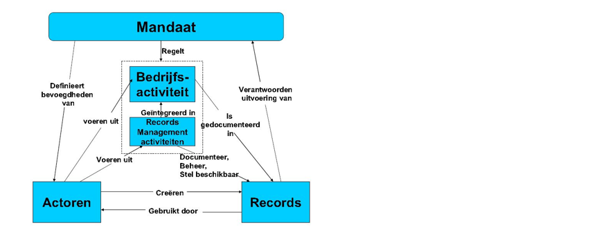

# Achtergrond: belangrijke aspecten bij het archiveren

**Nu de kaders van wet- en regelgeving zijn gegeven, wordt in dit hoofdstuk een
aantal randvoordwaarden op rij gezet. Randvoorwaarden die voortvloeien uit deze
kaders. We richten ons daarbij met name op de digitale aspecten van het
archiveren. Achtereenvolgens komen metadata, bewaartermijnen, toegestane
compressie en formaten en het bewaren van software aan de orde.**

## Metadata

Metadata zijn gegevens die de context, inhoud en structuur van archiefbescheiden
(records) beschrijven, evenals het beheer van die records door de tijd heen. Ze
zijn niet alleen onmisbaar om de terugvindbaarheid, bruikbaarheid,
authenticiteit, integriteit en betrouwbaarheid van de records te garanderen en
het beheer ervan op lange termijn mogelijk te maken, maar ook zijn ze van
essentieel belang voor interoperabiliteit. Om het uitwisselen van records tussen
systemen mogelijk te maken, moeten afspraken gemaakt worden over de manier
waarop dat gebeurt, in welke ‘taal’ deze systemen met elkaar spreken en hoe
metagegevens en records geïnterpreteerd moeten worden. Uitwisseling tussen
systemen is zowel aan de orde binnen de bestuursorganen als tussen de
verschillende organisaties[^34]. Als het gaat om metagegevens zijn zulke
afspraken vastgelegd in onder andere metagegevensschema’s. In een digitale
wereld zijn metadata zo mogelijk nog belangrijker dan vroeger. Dat is ook de
reden dat metadata worden gezien als onlosmakelijk onderdeel van de
archiefbescheiden zelf[^35].

[^34]: Jorien Weterings, *MeDuSa. XML-schema voor het e-Depot*, Od \#7/8 2012,
pp. 26-28.

**Figuur 3 Basismodel voor metagegevens van NEN ISO 23081**[^36]

[^36]: Afkomstig uit SPIRT project: Sue McKemmish, Glenda Acland and Barbara
Reed, Towards a Framework for Standardising Recordkeeping Metagegevens: [The
Australian Recordkeeping Metagegevens Schema](https://research.monash.edu/en/searchAll/index/?search=Glenda+Acland&pageSize=25&showAdvanced=false&allConcepts=true&inferConcepts=true&searchBy=PartOfNameOrTitle)  
Ook in NEN-ISO 23081-1:2017 Metagegevens voor records - Principes (paragraaf
9.1).

### Standaard  
De NEN-ISO 19115 metadata standaard voor geo-informatie is bij de meeste
overheden die met ruimtelijke plannen werken vermoedelijk wel bekend vanwege het
[toepassingsprofiel voor geo-informatie in Nederland](https://www.geonovum.nl/geo-standaarden/metadata). De [Europese
richtlichtlijn INSPIRE](https://www.geonovum.nl/geo-standaarden/inspire-europese-leefomgeving) verplicht het gebruik van het toepassingsprofiel.  
Er bestaat daarnaast een andere metadata standaard, de NEN-ISO 23081, die
specifiek betrekking heeft op metadata voor archiefbescheiden. Deze standaard
wordt ook genoemd in de Archiefregeling. Samengevat zegt de Archiefregeling het
volgende over metagegevens[^39]:

[^39]: De artikelen 17, 19, 20 en 24 van de Archiefregeling gaan specifiek over
metagegevens.

1.  Maak een metagegevensschema zoals bedoeld in NEN-ISO 23081;

2.  Leg metagegevens vast over:

	-   inhoud, vorm en structuur van de archiefbescheiden  
	-   de context waarbinnen de archiefbescheiden zijn gevormd (binnen welkproces,
    door welke actor)  
	-   relatie met andere archiefbescheiden  
	-   beheersactiviteiten die op de archiefbescheiden zijn uitgevoerd (denk aan
    conversie, migratie, selectie, openbaarmaking etc.)  
	-   software die gebruikt wordt om archiefbescheiden te beheren;  
3.  Zorg dat de koppeling tussen metagegevens en archiefbescheiden behouden
    blijft. Dat betekent bijvoorbeeld dat er voorzieningen getroffen moeten
    worden om die koppeling in stand te houden als de archiefbescheiden
    verplaatst worden vanuit het ene naar het andere systeem.

### Metagevensschema  
Een metagegevensschema zoals bedoeld in NEN-ISO 23081 is een logisch ontwerp dat
de relatie tussen metagegevenselementen beschrijft door regels te benoemen voor
het gebruik en beheer van metagegevens, vooral met betrekking tot:

-   semantiek - welke naam kies je voor een element;  
-   syntaxis - hoe wordt de inhoud van het element samengesteld, bijvoorbeeld
    yyyymmdd of ddmmyyyy;  
-   het verplichtingenregime - welke elementen zijn verplicht en welke
    optioneel.

Tezamen wordt dit ook wel een elementen set genoemd. TMLO is een voorbeeld van
een elementenset.[^40] De elementenset is hier gespecificeerd vanuit het oogpunt
van duurzame toegankelijkheid en wordt geacht generiek te zijn (dus van
toepassing op alle soorten informatie). Organisaties kunnen daarnaast andere
metagegevens vastleggen voor andere doeleinden (zoals het specifiek beschrijven
van geo-informatie), met behulp andere standaarden of bestaande ontologieën
(zoals NEN-ISO 19115)

[^40]: Op dit moment zijn er twee toepassingsprofielen, die beide gebaseerd zijn
op de Richtlijn: TMLO voor lokale overheden en het Toepassingsprofiel
Metagegevens Rijksoverheid. TMLO wordt op dit moment doorontwikkeld, waarbij het
de intentie is dat ook het Rijk TMLO gaat adopteren (en het TP Rijk komt te
vervallen).

Iedere overheidsorganisatie wordt geacht een eigen metagegevensschema vast te
stellen, Dit geldt voor alle blijvend te bewaren archiefbescheiden die in de
organisatie voorkomen. Van belang daarbij is dat in ieder geval elementen zoals
gespecificeerd in het toepassingsprofiel onderdeel zijn van dit schema. Met
behulp van dit schema kunnen organisaties nagaan in hoeverre informatiesystemen
voldoen aan de regels uit het schema en maatregelen nemen als dit nodig blijkt.

### Software  
In de metadata moet ook worden vastgelegd met welke applicatie de informatie is
gecreëerd, inclusief versienummer. Ook als er een nieuwe versie wordt
geïnstalleerd, moet dit worden vastgelegd. Dit is een voorbeeld van
‘event-history’ zoals in NEN-ISO 23081 en de Richtlijn/toepassingsprofiel verder
wordt toegelicht.

Doordat de ruimtelijke plannen worden gemaakt met open standaarden[^41] is er
tot op heden geen aanleiding voor het bewaren van software. Er wordt uitgegaan
van het principe dat software (viewers) om de plannen weer te geven deze open
standaard moet kunnen lezen. Om de ruimtelijke plannen vanuit het archief direct
te kunnen raadplegen is het echter wel van belang dat de zorgdrager over
geschikte software beschikt.

[^41]: De RO Standaarden zijn wettelijke open standaarden. Meer informatie via
http://www.forumstandaardisatie.nl/

## Bewaartermijnen

De Archiefwet schrijft voor dat ieder overheidsorgaan moet beschikken over een
selectielijst, die door de minister wordt vastgesteld. In de selectielijsten is
bepaald of, en zo ja wanneer, archiefbescheiden vernietigd moeten worden. De
[VNG](https://www.nationaalarchief.nl/archiveren/kennisbank/selectielijst-voor-de-archiefbescheiden-van-gemeentelijke-en) (bij mandaat van alle gemeenten), het [IPO](https://www.nationaalarchief.nl/archiveren/kennisbank/selectielijst-voor-archiefbescheiden-van-de-provinciale-organen-en-van-de) (bij mandaat van de
provincies) en het Rijk[^44] hebben ieder aparte selectielijsten opgesteld.

[^44] Zie BSD 120: http://www.handelingenbank.info/ib.php

Wanneer archiefbescheiden voor bewaring worden aangemerkt, moeten ze na maximaal
20 jaar[^45] (korter mag ook, langer niet -uitzonderingen daargelaten-) worden
overgebracht naar de archiefbewaarplaats die door de zorgdrager is aangewezen.
Voor de rijksoverheid bevindt die bewaarplaats zich bij het Nationaal Archief.
Gemeenten en provincies kunnen eigen archiefbewaarplaatsen hebben. Zij kunnen
ook daarin samenwerken, zoals bijvoorbeeld Regionale Archiefdiensten. Zolang de
plannen nog niet zijn overgebracht naar een archiefbewaarplaats is de beheerder
die is aangewezen door het bestuur, verantwoordelijk voor het in goede,
geordende en toegankelijke staat te houden van de archiefbescheiden.

[^45]: Het ministerie van OCW is voornemens om de overbrengingstermijn in de
nieuwe Archiefwet terug te brengen naar 10 jaar.

Op dit moment wordt er gewerkt aan een nieuwe archiefwet, deze zal naar
verwachting behalve vernietiging en overbrenging naar een archiefbewaarplaats
(van te bewaren materiaal) ook nog een derde keuze bieden. Namelijk “bewaren bij
de bron”, hiermee wordt het onder strenge vooraarden mogelijk dat een
archiefvormer/ zorgdrager zelf als archiefbewaarplaats wordt aangewezen. Dit is
van belang voor organisaties die veel eigen dossiers voor langere tijd willen
hergebruiken. Denk hier bij o.a aan het Kadaster. Bewaren bij de bron heeft geen
invloed op de bewaartermijnen zelf maar wel op de locatie en de manier van
opslag van archiefmateriaal.

Ook voor ruimtelijke plannen is bepaald of ze voor bewaring of vernietiging op
termijn in aanmerking komen. Uit de desbetreffende selectielijsten blijkt dat
deze plannen doorgaans voor permanente bewaring worden bestemd. Vaak is daarbij
gespecificeerd dat het de vastgestelde versie van het plan betreft.
Voorbereidende stukken moeten op termijn vernietigd worden (de
vernietigingstermijnen variëren tussen de 5 en 20 jaar). De bepalingen in de
selectielijsten gelden voor alle archiefbescheiden ongeacht de vorm.

Digitale ruimtelijke plannen vormen daarop geen uitzondering.

Het kan zijn dat per selectielijst de bewaarplicht van de verschillende
documenten, en stadia van documenten, verschillend is vastgesteld. Hieronder
volgt een korte opsomming.

### Gemeenten  
De stukken die behoren bij de voorbereiding van het ruimtelijke plan, visie of
besluit worden 20 jaar bewaard. Blijvend bewaard worden de stukken van het
ruimtelijk plan, visie of besluit dat door de gemeente is vastgesteld. Na 20
jaar brengt de zorgdrager (de gemeente) de archiefbescheiden over naar de
archiefbewaarplaats in het eigen archief, streekarchief of Nationaal Archief.

### Provincies  
Ruimtelijke plannen (zoals structuurvisies), ‘met inbegrip van voorstadia die om
inhoudelijke of procedurele redenen belangrijke wijzigingen van de tekst
bevatten’, worden gewaardeerd met bewaren. De waardering (bewaartermijn) van
overige conceptversies is niet specifiek geregeld. In de geactualiseerde
selectielijst, geldig voor provinciale archieven vanaf 2013, is
gespecificeerd dat bepaalde onderdelen (voorontwerpen, overleg, zienswijzen) na
10 jaar vernietigd moeten worden. Blijvend bewaard worden de stukken van het
ruimtelijk plan, visie of besluit dat door de provincie is vastgesteld. Na 20
jaar brengt de provincie de archiefbescheiden over naar de archiefbewaarplaats
in het eigen archief, streekarchief of Nationaal Archief

### Het rijk  
Voor de rijksoverheid zijn per beleidsterrein voor de verschillende
archiefvormers (departementen, uitvoeringsorganisaties etc.) selectielijsten
vastgesteld. Ruimtelijke plannen vallen onder het beleidsterrein Ruimtelijke
ordening en geo-informatie. Selectielijsten zijn verzameld in het bijbehorende
‘Basisselectiedocument’ (BSD 120).

Kaarten zijn als onderdeel van het vaststellen en evalueren van beleid
betreffende ruimtelijke ordening gewaardeerd met bewaren (handeling 1, actor
minister belast met ruimtelijke ordening). Hier is niet expliciet een
onderscheid gemaakt tussen het bewaren van eindproducten en het na enige tijd
vernietigen van voorbereidende stukken.

De handelingen gelden ook voor onder het zorgdragerschap van de minister
vallende diensten, als daar geen aparte waardering voor is vastgesteld. Niet
expliciet genoemde archiefvormers die niet onder de minister belast met
ruimtelijke ordening vallen maar onder Economische Zaken, zoals de Dienst
Landelijk Gebied, kunnen gebruikmaken van handeling ‘Het bijdragen aan de
totstandkoming van nota's, programma's, plannen en maatregelen betreffende de
ruimtelijke ordening op provinciaal of regionaal niveau’[^47].

[^47]: Uit het BSD Landinrichting, minister LNV, waardering Bewaren BSD 59: zie
http://www.handelingenbank.info/ib.php

## Toegestane compressie en bestandsformaten  
### Bestandsformaten  
Artikel 26 van de *Archiefregeling* schrijft voor dat digitale archiefbescheiden
opgeslagen worden in een open, en daarmee valideerbaar en gedocumenteerd
bestandsformaat. Dat betekent dat informatie over de eigenschappen van dat
formaat bekend en vrijelijk beschikbaar zijn. Het voorschrift dat een
bestandsformaat valideerbaar moet zijn, is in de eerste plaats bedoeld om vast
te kunnen stellen dat het bestandsformaat ook daadwerkelijk is wat het lijkt te
zijn. Validatie kan bijvoorbeeld via een register van bestandsformaten, zoals
PRONOM[^48]. In Nederland houdt het Forum Standaardisatie voor de overheid een
lijst bij van geadopteerde open standaarden. Het Nationaal Archief heeft mede op
basis hiervan de [Handreiking
Voorkeursformaten](https://www.nationaalarchief.nl/archiveren/kennisbank/handreiking-voorkeursformaten-nationaal-archief)
ontwikkeld. Hiermee worden organisaties handvatten geboden om bij de vorming van
digitaal archief rekening te houden met de voorkeur van het Nationaal Archief
(en in het kielzog daarvan ook andere archiefinstellingen). Let op de lijst
voorkeursformaten is niet limitatief, het is niet verboden om bestandsformaten
te gebruiken die niet op de lijst staan. Het zijn slechts de formaten waaraan
het NA de voorkeur geeft. Wanneer een organisatie bestandsformaten gebruikt die
niet op de lijst staan dan is er altijd ruimte om deze bestandsformaten en de
eventuele voor- en nadelen met het Nationaal Archief te bespreken.
Archiefinstellingen met een eigen archiefbewaarplaats maken hun eigen keuzes
omrend de geaccepteerde en bestandsformaten. Over het algemeen gaat de keuze
voor bestandsformaten uit naar formaten die open source zijn en/of voldoen aan
open standaarden. Specifieke bestandsformaten die in het geo-informatie werkveld
worden gebruikt zijn nog niet opgenomen in de lijst met voorkeursformaten.  

[^48]: Zie: http://www.nationalarchives.gov.uk/PRONOM/

### Compressie  
Compressie is alleen toegestaan als aangetoond wordt, dat geen informatieverlies
optreedt (artikel 26 Archiefregeling). Compressie wordt vaak toegepast om de
bestandsgrootte te reduceren. Veel compressiemethoden zijn gebaseerd op
patroonherkenning en herkenning van (ogenschijnlijk) overbodige gegevens. Door
het gebruik van compressie neemt ook de complexiteit van het te bewaren bestand
toe. Dit kan in de toekomst problemen veroorzaken als het bestand voor behoud
naar een ander formaat moet worden omgezet. Als er compressie gebruikt wordt is
het dus in ieder geval van belang dat vastgelegd wordt welk algoritme wordt
gebruikt. Er kunnen verschillende manieren van compressie gebruikt worden. Zo
kunnen er bijvoorbeeld compressies uitgevoerd worden die gebruik maken van een
compressie algoritme wat hetzelfde is als het JPEG compressie algoritme (je
gooit daadwerkelijk pixels/data weg). Op de LZW-compressie rusten bijvoorbeeld
commerciële licenties, waardoor het voordeel van een open formaat teniet wordt
gedaan.

Van de samenhangende set van bronbestanden van het ruimtelijk plan wordt in de
praktijk regelmatig een zip gemaakt. De Raad van State vraagt bijvoorbeeld om de
dataset, verpakt in een zip te uploaden. Zip is echter niet de aangewezen wijze
van archiveren; de afzonderlijke bestanden van de dataset zijn daarvoor niet
direct beschikbaar er kan informatieverlies optreden. In de samenhangende set
van bronbestanden zijn GML en XML bestanden opgenomen. Deze zouden in principe
een bedreiging kunnen vormen voor het archiefsysteem omdat in een XML
programma’s kunnen worden opgenomen. Hiervan is geen sprake bij ruimtelijk
plannen conform de RO Standaarden, echter wel een punt voor overleg tussen de
archiefvormer en de beheerder.

Een alternatief voor .zip bestanden kan bestaan uit de ‘Geodata Archival
Information Package’ (GEO-IP) zoals genoemd in de ‘Common Specification for
Geospatial data’ (zie pagina 17). Met de GEO-IP kan ook beschrijvende metadata
en documentatie van gebruikte XML en GML formaten meegeleverd worden. In 2020
wil het NA meer onderzoek naar het archiveren van geo-data en geo-informatie.

## Vervanging

Vervanging betekent dat archiefbescheiden worden vervangen door reproducties. De
originele bescheiden worden vervolgens vernietigd. De reproducties nemen dus
volledig de plaats in van de oorspronkelijke bescheiden. De nieuwe
informatiedragers moeten dan voldoen aan de eisen die worden gesteld in de
Archiefregeling.. Van de ruimtelijke plannen conform het Bro is de digitale
versie de authentieke versie. Bij vaststelling van het ruimtelijk plan wordt
tevens een papieren versie gemaakt. Vervanging is in dat geval geen optie, de
papieren zijn in dit geval een kopie en mogen gewoon vernietigd of verwijderd
worden. Echter, een overheid kan, zeker van particulieren, nog plannen of
reacties daarop in papieren vorm ontvangen en wensen deze digitaal toe te voegen
aan de overige bescheiden. Dan is vervanging een logische actie.

Organisaties die onder de werking van de Archiefwet 1995 vallen, mogen
vervanging toepassen, mits dat gebeurt met juiste en volledige weergave van de
in de bescheiden voorkomende gegevens (artikel 6, eerste lid van het
Archiefbesluit 1995). Gaat het om archiefbescheiden die ingevolge een
vastgestelde selectielijst niet voor vernietiging (op termijn) in aanmerking
komen, dan is artikel 26b van de Archiefregeling van toepassing.

Dit betekent dat de overheid die gaat vervangen, inzicht kan geven in een aantal
elementen van vervanging, waaronder de reikwijdte, de technische instellingen,
de gebruikte hard- en software en de kwaliteitsprocedures. Op grond van artikel
26b moet een zorgdrager deze elementen in het besluit tot vervanging van te
bewaren archiefbescheiden opnemen. In de praktijk gebeurt dit door het opstellen
van een handboek vervanging. Het Nationaal Archief biedt, hoewel zij geen
formele rol heeft bij het opstellen van een vervangingsbesluit, organisaties een
handvat in de vorm van de ‘[Handreiking vervanging
archiefbescheiden](https://www.nationaalarchief.nl/archiveren/kennisbank/handreiking-vervanging-archiefbescheiden)’.

## Archiefsysteem

In dit hoofdstuk zijn de belangrijkste voorwaarden aangegeven die een zorgdrager
moet organiseren voor het archiveren van digitale ruimtelijke plannen.

Het archiefsysteem waar de samenhangende set bronbestanden worden opgeslagen,
wordt door de zorgdrager onder andere geselecteerd op basis van deze voorwaarden
en de voorzieningen die binnen de organisatie aanwezig zijn. Zo kan het
aanwezige systeem voor de BAG, GBA, het e-depot of RO beheersysteem mogelijk
geschikt zijn. De zorgdrager is niet verplicht vanuit de wet- en regelgeving
voor archiveren te kiezen voor een bepaalde applicatie of database. De
zorgdrager kiest het systeem naar aanleiding van de eerder geschetste
randvoorwaarden (zoals de DUTO eisen, zie bijlage 1)en richt het systeem en de
organisatie op basis van die eisen daarvan in.