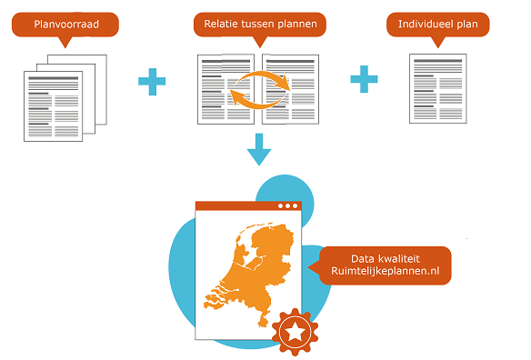

# Inleiding

**In dit eerste hoofdstuk van de handreiking over de gegevenskwaliteit van
ruimtelijke plannen wordt de context van het concept ‘Data op orde’ uitgelegd.**

##  Aanleiding
**De zolder opruimen voor de verbouwing**  
In de loop der jaren zijn er op Ruimtelijkeplannen.nl veel waardevolle gegevens
gepubliceerd. Maar net zoals een zolder die zo nu en dan opgeruimd moet worden
om goed bruikbaar te blijven, geldt dit ook voor de planvoorraad. Zeker als er
een grote verbouwing zoals de Omgevingswet op komst is. Alle gegevens in
Ruimtelijkeplannen.nl gaan mee naar de Omgevingswet, wanneer bestemmingsplannen
e.d.[^1] opgaan in het tijdelijk omgevingsplan. Na de inwerkingtreding van de
Omgevingswet (Ow) kunnen de geldige bestemmingsplannen niet meer aangepast
worden, uitgezonderd in procedure zijnde plannen. Deze ‘bevroren’ plannen
blijven geldig totdat zij worden vervangen door een nieuw omgevingsplan conform
de nieuwe standaard STOP/TPOD.

Het Informatiehuis Ruimte (IHR) werkt aan de overbruggingsfunctie om de gegevens
van Ruimtelijkeplannen.nl in de toekomst in het Digitale Stelsel Omgevingswet
(DSO) te ontsluiten. Zowel voor bronhouders als gebruikers van het DSO is het
belangrijk dit zo soepel mogelijk te laten verlopen. Daarom is het belangrijk
dat de gegevenskwaliteit van de ruimtelijke plannen in de landelijke
voorziening, maar ook bij de bronhouder zelf, zo hoog mogelijk is.

Bovendien is het voor alle bronhouders ook van belang ter voorbereiding op de
komst van de Omgevingswet. Ga nu vast aan de gang met het opruimen van de data
om de overgang naar de Omgevingswet zo soepel mogelijk te laten verlopen.

Om bronhouders te helpen bij het ordenen en opschonen van de digitale
planvoorraad is deze handreiking tot stand gekomen. Met deze handreiking geven
we aan welke punten belangrijk zijn bij de gegevenskwaliteit van deze (digitale)
planvoorraad en hoe deze kan worden verbeterd.

[^1]: Bij inwerkingtreding van de Omgevingswet ontstaat er een zgn. tijdelijk
omgevingsplan, dat bestaat uit de geldende bestemmingsplannen,
wijzigingsplannen, uitwerkingsplannen, beheersverordeningen en
inpassingsplannen, alsmede bepaalde algemene regels van het Rijk (de zogeheten bruidsschat).

**Achtergrond**  
Sinds 2010 zijn de digitale ruimtelijke plannen conform de Wet ruimtelijke
ordening (Wro) de authentieke, juridisch geldende plannen. Dit betekent dat een
ruimtelijke plan conform de RO Standaarden door gemeenten, provincies en het
Rijk geproduceerd, beschikbaar gesteld, vindbaar en toegankelijk gemaakt worden.
Vanaf 1 januari 2010 geldt de digitaliseringsplicht en sindsdien is er veel data
beschikbaar gesteld op Ruimtelijkeplannen.nl. Dit is waardevolle data, niet
alleen onder de huidige wetgeving maar ook van belang om de transitie naar de
Omgevingswet goed te laten verlopen.

De gelaagdheid in Ruimtelijkeplannen.nl, met het laatst geladen plan ‘bovenop’
komt de raadpleegbaarheid niet altijd ten goede. Door terug te gaan naar de
basis en bronhouders te attenderen op de mogelijkheden die er zijn binnen de
standaarden kan de gegevenskwaliteit verbeterd worden. Bijvoorbeeld door te
onderzoeken of het nodig is om alle versies van een plan beschikbaar te stellen.

## De transitie van huidige plannen in het Digitaal Stelsel Omgevingswet

De (digitale) informatie die nu beschikbaar is op Ruimtelijkeplannen.nl zal met
ingang van de Omgevingswet de basis vormen voor met name het tijdelijk
omgevingsplan. Om bronhouders zich hier op te laten voorbereiden is het goed om
te weten dat er nu al met de huidige standaarden veel gedaan kan worden om de
planvoorraad op orde te brengen. Hiermee wordt het niet alleen geschikt gemaakt
voor de Omgevingswet, maar helpt evengoed de huidige dienstverlening tot 2021 te
verbeteren.

Maar waarom is de kwaliteit van de planvoorraad zo van belang?

1.  Ten eerste wordt een aanzienlijk deel van de huidige planvoorraad onderdeel
    van het tijdelijk omgevingsplan. Het is daarom van groot belang dat daar
    niet teveel, maar ook niet te weinig in zit.

2.  Vanaf 2021 kunnen geen nieuwe planprocedures meer gestart worden via de
    huidige standaarden, alleen voor 2021 gestarte procedures kunnen afgemaakt
    worden. Dit betekent dat het naderhand aanpassen van het tijdelijk
    omgevingsplan niet mogelijk is. Het op orde brengen moet dus voor 2021
    gebeuren, daarna is die weg praktisch afgesloten.

3.  Het zorgt ervoor dat DSO functionaliteit om huidige plannen beter en
    gerichter te kunnen ontsluiten voor gebruikers, zoals de
    overbruggingsfunctie en bepalen leidend plan, beter werken. Hiervoor is
    vooral belangrijk dat metadata zoals plan- en dossierstatus, plantype en
    verwijzingen tussen plannen kloppen en actueel zijn.

4.  Een ‘schone’ planvoorraad creëert een goede uitgangspositie voor het maken
    van het eigenlijke omgevingsplan. De onderliggende gegevens (bijvoorbeeld
    planobjecten en achterliggende gegevens) zijn dan al beschikbaar.

5.  Last but not least helpt een betere gegevenskwaliteit ook de huidige
    dienstverlening, aan de balie, via Ruimtelijkeplannen.nl of eigen website te
    verbeteren.

***Figuur1: De transitie van Ruimtelijkeplannen.nl naar het DSO.***

Omdat de gegevens van Ruimtelijkeplannen.nl een andere opzet heeft dan de nieuwe
data dat in de landelijke voorziening van het DSO gaat ontstaan, ontwikkelt
Informatiehuis Ruimte de overbruggingsfunctie om beide informatiesporen te
kunnen raadplegen.

Informatiehuis Ruimte ondersteunt dit via vier sporen:

1.  Het ontsluiten van de huidige plannen in het DSO via de overbruggingsfunctie
    van Informatiehuis Ruimte.

2.  Het beter vindbaar en raadpleegbaar maken van plannen, door bepalen van
    leidende plannen.

3.  De overbruggingsfunctie die een geïntegreerd beeld geeft van huidige plannen
    en nieuwe omgevingsdocumenten.

4.  De transitie van de landelijke voorziening Ruimtelijkeplannen.nl naar de
    landelijke voorziening Digitaal Stelsel Omgevingswet (DSO-LV) in
    samenwerking met Geonovum en Kadaster.

Goede gegevenskwaliteit is randvoorwaardelijk voor al deze vier sporen.

Een belangrijke eerste stap in de transitie is het analyseren van de huidige
planvoorraad bij bronhouders zodat bronhouders deze vervolgens kunnen ordenen en
opschonen. Hierbij is het ook van belang om de onderlinge relaties tussen
verschillende plannen op peil te brengen en tevens per individueel plan te
bekijken welke plantypes waar thuis horen.

***Figuur 2: Overzicht planvoorraad***

De planvoorraad bestaat uit alle ruimtelijke plannen die het bevoegd gezag
(bronhouder) beschikbaar stelt in het manifest. De huidige planvoorraad
verschilt per organisatie en het kan gaan om enkele tientallen tot honderden
ruimtelijke plannen per bronhouder. Dit is het deel van de planvoorraad dat
conform de RO Standaarden[^2] digitaal beschikbaar is. Voor de overgang naar de
Omgevingswet is het van belang dat de data op Ruimtelijkeplannen.nl volledig
overeenkomt met de data op de weblocatie bij de bevoegde gezagen zelf.

[^2]: Dit zijn zowel de [verplichte als de facultatieve standaarden](
https://www.geonovum.nl/onderwerpen/ruimtelijke-ordening-standaarden/verplicht-en-optioneel-ro-standaarden).

Met deze handreiking geven we aan hoe de gegevenskwaliteit van deze (digitale)
planvoorraad door de bronhouder inzichtelijk en inhoudelijk meer op elkaar kan
worden afgestemd en verbeterd.

## Leeswijzer
In deze handreiking worden de verschillende onderwerpen toegelicht en worden
handige tips & tricks gegeven. De normen en praktijkrichtlijnen, alsook de
handreiking archiveren, zijn hiervoor altijd de basis[^3]. Ieder hoofdstuk start
met een samenvatting.

[^3]: De RO Standaarden inclusief praktijkrichtlijnen en werkafspraken zijn
beschikbaar via de [Geonovum website](
https://www.geonovum.nl/geo-standaarden/ro-standaarden-ruimtelijke-ordening).

In het hoofdstuk [Foutherstel in ruimtelijke plannen](#H02) geven we de kaders voor foutherstel in en archivering van
ruimtelijke plannen; wat mag je wel aan een plan wijzigen en wat niet en wat is
de werkwijze.

In het hoofdstuk [Planvoorraad](#H03) gaan we dieper in op de planvoorraad en hoe deze is opgebouwd. In
de RO Standaarden zijn de verplichtingen en mogelijkheden aangegeven over het
beschikbaar stellen van de planvoorraad en de opbouw ervan. In dit hoofdstuk
lichten we toe hoe de planvoorraad zo optimaal mogelijk opgeschoond kan worden.

In het hoofdstuk [Relaties onderling](#H04) komen de onderlinge relaties tussen verschillende plannen aan de
orde. In de RO Standaarden is voorgeschreven op welke manier de relaties tussen
de plannen kunnen worden gelegd. In dit hoofdstuk gaan we dieper in op de
problemen die kunnen ontstaan indien dit niet correct is gedaan en welke
problemen kunnen ontstaan als deze niet goed worden toegepast. Vervolgens wordt
ingegaan op de relatie tussen een planstatus en een dossierstatus alsmede het
gebruik van objectgerichte planteksten.

In het hoofdstuk [Gebruik van verschillende plantypes](#H05) komen de verschillende plantypes aan de orde, hoe deze worden
toegepast met de daarbij ontstane problemen. Ook hier worden
oplossingsrichtingen aangedragen.

## Samenvatting
Samengevat kan op de volgende punten het ruimtelijke plan worden gecontroleerd:

-   Beschikbaarheid manifest

-   Dossierstatus

-   Beschikbaarheid plannen / planonderdelen

-   Planidentificatienummer

-   Type plan/ verkeerd gebruik type plan

-   Naam van het plan

-   Planstatus info (datum en status)

-   Overheidscode / naam overheid

-   Verwijzingen naar externe plannen

-   Bijlage(n)

-   HTML planteksten naar XML planteksten

-   Voorbereidingsbesluiten ouder dan 1 jaar

-   Concept en voorontwerpplannen ouder dan 2 jaar (dit is niet fout, maar geeft
    wel een signaal dat er misschien wat data opgeschoond kan worden)

-   Wel 2006 plannen maar geen 2006 manifest

Al deze punten komen in deze handreiking aan de orde.