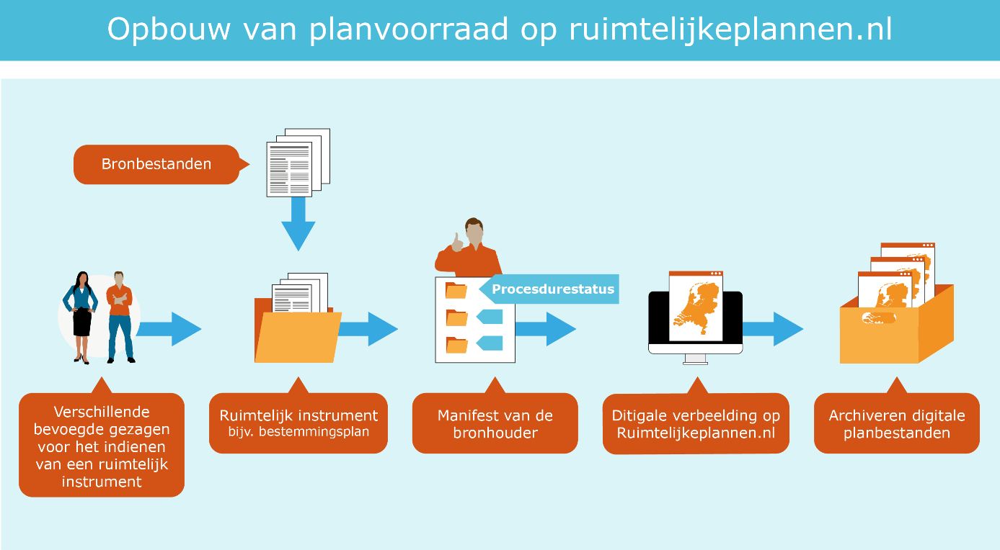

# Planvoorraad

**Gemeenten, provincies en het rijk maken met behulp van een manifest via de
index van Ruimtelijkeplannen.nl inzichtelijk welke ruimtelijke plannen
beschikbaar gesteld worden. In dit hoofdstuk gaan we in op de verschillende
manieren om de planvoorraad op te schonen.**

## Opschonen van de planvoorraad
Het opschonen van de planvoorraad is niet alleen van belang voor de gegevens op
Ruimtelijkeplannnen.nl, maar ook dat de planvoorraad op Ruimtelijkeplannen.nl
overeen komt met de planvoorraad bij de bronhouder. De huidige planvoorraad op
Ruimtelijkeplannen.nl is niet alleen veel data, het is ook een verzameling aan
actuele en vervallen planversies door elkaar. Let wel, het is een separate actie
van de bronhouder om alle versies van een plan te archiveren en beschikbaar te
hebben in een digitaal archief. Om deze data straks zo goed mogelijk te kunnen
ontsluiten via het Informatiehuis Ruimte naar het loket van het Digitaal Stelsel
Omgevingswet, adviseren wij om de planvoorraad op te schonen en alleen de meest
actuele planversie te laten staan. Bij inwerkingtreding van de Omgevingswet
ontstaat zo een beter (bevroren) beeld van de geldende plannen.

## Planvoorraad: de basis
**Achtergrond**  
De planvoorraad is opgebouwd uit ruimtelijke instrumenten van verschillende
bevoegde gezagen.  
Ieder ruimtelijk instrument is opgebouwd uit een samenhangende set
bronbestanden. Voor de verschillende typen instrumenten is dit een andere set.
Als er gebruik wordt gemaakt van objectgerichte planteksten ontstaat een andere
set bronbestanden dan wanneer de teksten zonder gebruikmaking van objectgerichte
planteksten beschikbaar worden gesteld.

Er zijn vier onderwerpen belangrijk bij de planvoorraad, die in volgende
paragrafen worden uitgewerkt:

-   [Opschonen planversies na onherroepelijk worden van een plan](#de-planvoorraad-opschonen-na-onherroepelijk-worden)

-   [Dossiers op goede manier opschonen](#dossiers-opschonen)

-   [Zorgen dat planvoorraad overeenkomt met Ruimtelijkeplannen.nl](#zorgen-dat-de-planvoorraad-overeenkomt-met-ruimtelijkeplannen-nl)

-   [Het intern archiveren van plannen die niet meer vigerend zijn](#archiveren)

## De planvoorraad opschonen na onherroepelijk worden

> **Actie: Verwijder versies die niet meer actueel zijn**  

Het altijd beschikbaar hebben van de bronbestanden is een wettelijke
verplichting. Het kan voorkomen dat een plan wel voorkomt in een manifest van
een bronhouder en op Ruimtelijkeplannen.nl, maar niet beschikbaar is op de
aangegeven serverlocatie. De officieel gewaarmerkte versie moet dan op de in het
manifest en geleideformulier aangegeven locatie geplaatst worden, zodat het plan
weer beschikbaar is. De bronbestanden van iedere beschikbaar gestelde versie van
een ruimtelijk instrument blijven toegankelijk totdat een instrument
onherroepelijk in werking is getreden of is vervallen. Dit is vastgelegd in het
Besluit ruimtelijke ordening (Bro).

**Wat te doen?**  
Wanneer het instrument eenmaal onherroepelijk is, mogen de oudere versies, zoals
(voor)ontwerp en vastgestelde versies, verwijderd worden uit het manifest en van
Ruimtelijkeplannen.nl. Wanneer het instrument vervallen is, mag het in zijn
geheel verwijderd worden. Vanuit de RO Standaarden geldt geen verplichting voor
het verwijderen van oudere versies of vervallen plannen. Om de gegevens straks
zo goed mogelijk te kunnen ontsluiten via het Informatiehuis Ruimte, adviseren
wij om de planvoorraad op te schonen en alleen het onherroepelijke (geldende)
versie te laten staan.

## Dossiers opschonen

>**Actie: het verwijderen van een dossier**  

Voor het verwijderen van een dossier kan het gaan om de volgende stukken:  
1.  Oudere versies, concepten, voorontwerpen, ontwerpen (die al lange tijd stil
    staan);  
2.  Voorbereidingsbesluiten ouder dan 1 jaar;  
3.  Vervallen plannen en dossiers;  
4.  Plancontour & PDF Plannen (PCP) en IMRO2006 plannen die inmiddels zijn
vervangen door nieuwere plannen.  

**Wat te doen?**  
Wanneer de bronhouder een dossier wil verwijderen uit de planvoorraad zijn er
binnen de RO Standaarden 2 opties.  
1.  **Het Dossier de status ‘vervallen’ geven**  
Door het dossier de status ‘vervallen’ te geven wordt deze niet verwijderd
van de database van Ruimtelijkeplannen.nl. De plannen die zich in dit
dossier bevinden zijn alleen niet meer zichtbaar in de viewer van
Ruimtelijkeplannen.nl. Wanneer een gebruiker op een andere wijze gebruik
maakt van de data van Ruimtelijkeplannen.nl, bijvoorbeeld via de services,
dan zijn deze plannen gewoon beschikbaar. Het dossier en de plannen die
daarin staan hebben alleen een label (markering) meegekregen. Aan
individuele planversies kan geen planstatus ‘vervallen’ meegegeven worden.  
Wanneer een dossier op vervallen wordt gezet blijft het in het manifest
aanwezig, inclusief de URL naar de weblocatie van de bronhouder waar het
plan beschikbaar is. Het is dan ook van belang dat het plan op de weblocatie
van de bronhouder beschikbaar blijft.  
2.  **Het Dossier daadwerkelijk verwijderen uit het manifest en van Ruimtelijkeplannen.nl**  
Bij deze werkwijze verwijdert de bronhouder de oude/vervallen plannen (en
het dossier) uit het manifest. Ruimtelijkeplannen.nl zal de plannen nu ook
daadwerkelijk uit de database verwijderen. De plannen zijn niet meer
raadpleegbaar via Ruimtelijkeplannen.nl en niet meer beschikbaar via de
index. De bronhouder kan het plan nu op een andere gewenst locatie
archiveren. De plannen zijn nu ook niet meer beschikbaar via de services van
Ruimtelijkeplannen.nl.

De huidige planvoorraad op Ruimtelijkeplannen.nl is een verzameling van actuele
en vervallen plannen door elkaar. Gelet op de huidige ontwikkelingen, de
voorbereiding op de Omgevingswet en de ontsluiting van de plannen via het
Informatiehuis Ruimte in het DSO, is het advies om de oude versies, en vervallen
plannen daadwerkelijk te verwijderen uit het manifest. Het is nooit de bedoeling
geweest om Ruimtelijkeplannen.nl als archief te gebruiken. Zorg daarbij wel dat
officiële planversies digitaal gearchiveerd worden in een gemeentelijk
archiefsysteem. Een bronhouder blijft altijd zelf verantwoordelijk voor het
archiveren van de data. Zie ook [paragraaf archieveren](#archiveren) van deze handreiking.

## Zorgen dat de planvoorraad overeenkomt met Ruimtelijkeplannen.nl
De planvoorraad op de weblocatie bij de bronhouder **moet exact** overeenkomen met
de planvoorraad bij Ruimtelijkeplannen.nl. Dit is een wettelijke verplichting en
de bronhouder is hiervoor verantwoordelijk. In de praktijk blijkt dit niet
altijd op orde. Er doen zich verschillende situaties voor, die we hierna verder
uitwerken:

1.  Een plan staat wel op Ruimtelijkeplannen.nl, maar het plan (of
    planonderdelen) zijn niet beschikbaar bij de bronhouder.

2.  Hetzelfde plan met een identiek planidentificatienummer en versie nummer
    komt meerdere malen voor in een dossier, maar staat 1 maal op
    Ruimtelijkeplannen.nl.

3.  Inhoudelijk verschillende plannen zitten in hetzelfde dossier.

4.  Plan staat wel in het manifest en bij de bronhouder maar niet op
    Ruimtelijkeplannen.nl.

5.  Er bevinden zich PCP-plannen en IMRO2006 plannen op Ruimtelijkeplannen.nl.
    maar de bronhouder heeft geen 2006 manifest (meer).

>**1: Een plan staat wel op Ruimtelijkeplannen.nl, maar het plan (of de planonderdelen zijn niet beschikbaar bij de bronhouder**

**Wat te doen?**  
In het manifest van de bronhouder staan de locaties van alle door de bronhouder
gepubliceerde plannen. Ruimtelijkeplannen.nl maakt van deze informatie gebruik.
Wanneer de bronhouder een plan publiceert, haalt Ruimtelijkeplannen.nl op deze
locatie het plan op en plaatst het in de landelijke voorziening. Het plan wordt
raadpleegbaar gemaakt via de viewer van de landelijke voorziening
Ruimtelijkeplannen.nl. Met de index[^6] wordt de URL naar de bronhouderlocatie
beschikbaar gesteld. Een ieder kan nu via de index over het plan beschikken. De bronhouder voldoet zo aan de wettelijke eisen.

[^6]: Zie de [Index van Ruimtelijkeplannen.nl](http://www.ruimtelijkeplannen.nl/web-roi/index/)

Wanneer, na het publiceren van het plan, de bronhouder het plan verwijdert of
verplaatst, verandert de URL naar de locatie van het plan. Wanneer dit niet in
het geleideformulier en het manifest wordt aangepast, blijft het plan wel
raadpleegbaar via Ruimtelijkeplannen.nl, maar is het niet meer via de index
beschikbaar. Hierdoor voldoet de bronhouder niet meer aan zijn verplichting van
raadpleegbaarheid en beschikbaarheid. Om er voor te zorgen dat het plan weer
raadpleegbaar en beschikbaar is, kunnen twee werkwijzen worden gevolgd.

1.  *Het plan opnieuw publiceren*  
Hiervoor moet eerst het plan uit het manifest worden verwijderd.
Ruimtelijkeplannen.nl zal het plan nu ook verwijderen. Het plan 24 uur later
opnieuw waarmerken, valideren en publiceren. Om een plan met hetzelfde
planidentificatienummer opnieuw te kunnen publiceren moet het minimaal 1 dag van
Ruimtelijkeplannen.nl verwijderd zijn.  
1.  *Terugplaatsen van de identieke gewaarmerkte versie*  
Hierbij wordt de identieke gewaarmerkte versie van het plan teruggeplaatst naar
de locatie zoals deze in het geleideformulier en het manifest is aangegeven.

>**2: Hetzelfde plan met een identiek plan identificatienummer en
versienummer komt meerdere malen voor in een dossier, maar staat één maal op
Ruimtelijkeplannen.nl**

In dit geval komt een plan met exact hetzelfde planidentificatienummer (idn)
twee (of meer) keer voor in hetzelfde dossier en dus in het manifest. Het is
belangrijk om te controleren of deze twee plannen wel of niet exact identiek
zijn, en welke van deze twee versies beschikbaar is via Ruimtelijkeplannen.nl.
Hierbij moet één van de twee versies uit het dossier verwijderd worden.

**Wat te doen?**  
Via Ruimtelijkeplannen.nl kun je het geleideformulier opvragen van het plan dat
beschikbaar is via Ruimtelijkeplannen.nl. In dit geleideformulier kun je de
exacte locatie bij de bronhouder achterhalen van het plan dat door
Ruimtelijkplannen.nl wordt getoond. Dit is het plan dat in het dossier en het
manifest moet blijven staan om er voor te zorgen dat Ruimtelijkeplannen.nl
identiek is aan de data bij de bronhouder.

Een andere optie is om alle plannen met deze identieke versie uit het manifest
te verwijderen. Ruimtelijkeplannen.nl zal het plan nu ook verwijderen. Na 24 uur
kan nu de juiste versie worden gewaarmerkt, gevalideerd en gepubliceerd. Om een
plan met hetzelfde planidentificatienummer opnieuw te kunnen publiceren moet het
minimaal één dag van Ruimtelijkeplannen.nl verwijderd zijn.

>**3: Inhoudelijk verschillende plannen zitten in hetzelfde dossier.**

Dit probleem komt zeer zelden voor, maar hier is sprake van een inhoudelijk
probleem. Er zijn twee inhoudelijk verschillende plannen met hetzelfde
dossiernummer vastgesteld en gepubliceerd. Het dossier bevat nu bijvoorbeeld
twee ontwerpplannen van verschillende locaties.

**Wat te doen?**  
Het beste advies hierbij is om te kijken welk plan van toepassing is. Eén van de
twee plannen zal er vervolgens uitgehaald moeten worden om deze in een nieuw
dossier te plaatsen zodat deze een eigen dossiernummer krijgt.

>**4: Plan staat wel in het manifest en bij de bronhouder, maar niet op
Ruimtelijkeplannen.nl.**

Dit komt voor wanneer Ruimtelijkeplannen.nl het plan niet correct kan ophalen.
De bronhouder ontvangt dan een bericht per mail van Ruimtelijkeplannen.nl. Het
betreft hier vaak een validatie probleem.

**Wat te doen?**  
Naar aanleiding van het bericht van Ruimtelijkeplannen.nl kan de bronhouder
achterhalen wat de fout in het plan is. De bronhouder moet het plan aanpassen en
opnieuw waarmerken, valideren en publiceren. Dit soort problemen kan ondervangen
worden door het plan vooraf aan te bieden aan de pilot omgeving. Het plan kan
dan gecontroleerd worden via de testomgeving van Ruimtelijkeplannen.nl.

Alle meldingen van Ruimtelijkeplannen.nl worden verstuurd naar het mailadres dat
de bronhouder via de index heeft aangemeld bij het Kadaster. Het is belangrijk
dat er regelmatig gecheckt wordt of dit mailadres nog actueel is en regelmatig
gelezen wordt. Eventuele wijzigingen kunnen worden doorgegeven aan het Kadaster
via het wijzigingsformulier op de website van Ruimtelijkeplannen.nl[^7].

[^7]: Zie de pagina voor [bronhouders op Ruimtelijkeplannen.nl](http://www.ruimtelijkeplannen.nl/web-roo/roo/bronhouders_p)

>**5: Er bevinden zich PRPCP-plannen en IMRO2006-plannen op
Ruimtelijkeplannen.nl, maar de bronhouder heeft geen 2006 manifest (meer).**

Met behulp van het STRI2006 manifest stelt de bronhouder plannen beschikbaar die
tot stand zijn gekomen onder de ‘oude’ Wro, dan wel plannen van de nieuwe Wro
die tussen 1 juli 2008 tot 1 januari 2010 in papieren vorm zijn vastgesteld en
als plancontour met pdf zijn gedigitaliseerd. Het komt voor dat bronhouders nog
wel Plancontour & PDF plannen (PCP) en/of IMRO2006 plannen op
Ruimtelijkeplannen.nl hebben staan, maar niet (meer) over een 2006-manifest
beschikken.

**Wat te doen?**  
Wanneer alle plancontour plannen en IMRO2006 plannen zijn vervangen door
nieuwere digitale plannen, kunnen deze plannen worden verwijderd. Het manifest
2006 kan dan ook verwijderd worden. Het is belangrijk om eerst alle plannen uit
het manifest te verwijderen, voordat het manifest zelf wordt verwijderd. Wanneer
alleen het manifest wordt verwijderd, zonder eerst de plannen te verwijderen,
dan zullen deze ook niet verwijderd worden uit de database van de landelijke
voorziening Ruimtelijkeplannen.nl.

Het laatste plan kan de bronhouder zelf niet uit het manifest verwijderen, een
manifest beschikt namelijk altijd over minimaal 1 plan. Het is daarom belangrijk
om hierover contact op te nemen met het de helpdesk van Ruimtelijkeplannen.nl
bij Kadaster[^8]. Zij zullen dan dit laatste plan handmatig uit
Ruimtelijkeplannen.nl verwijderen.

[^8]: Dit kan via de [helpdesk van Ruimtelijkeplannen.nl](mailto:ruimtelijkeplannen@kadaster.nl)