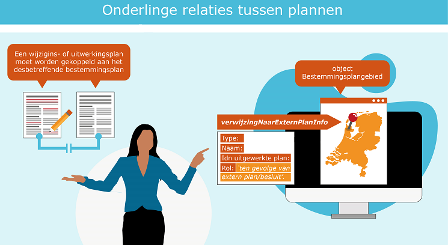
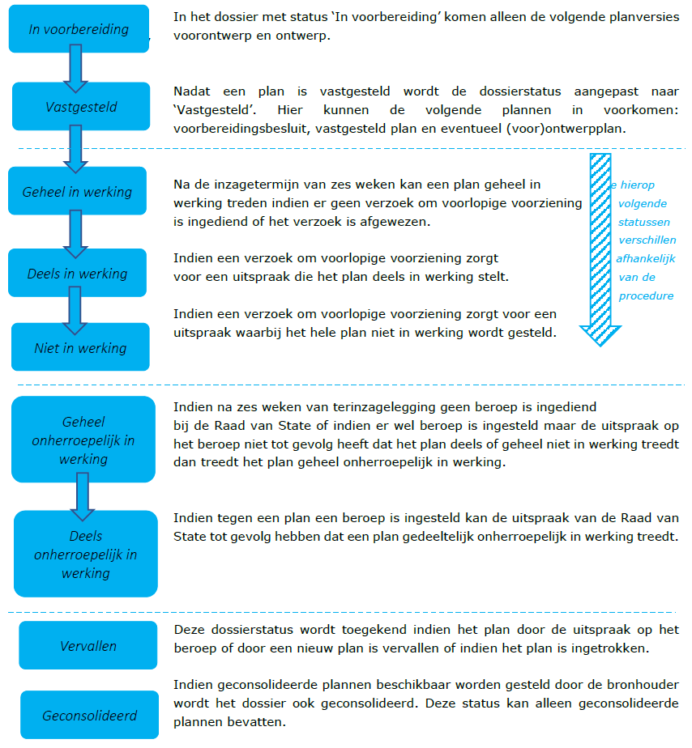

# Relaties onderling

**Relaties tussen plannen en relaties binnen plannen kunnen worden vastgelegd om
zo beter inzicht te krijgen in de geldende regels op een locatie. Dit hoofdstuk
gaat in op die verschillende relaties.**

## Inleiding
Het is mogelijk om relaties vast te leggen tussen de verschillende plannen,
visies en besluiten. Soms heeft dit een wettelijke grondslag, soms een
praktische reden. Het helpt de planmaker maar ook de raadpleger van het plan om
zo meer grip te krijgen op een geldige situatie op een locatie. Bij
gedeeltelijke herzieningen, uitwerkings- en wijzigingsplannen wordt deze relatie
gelegd bij het object ‘Bestemmingsplangebied’.  
Ook bestaat er een relatie tussen een dossierstatus en planstatus. Om een juist
beeld te krijgen van procedure status van een planversie moet de dossierstatus
van het planversie goed worden bijgehouden. Ook de gebiedsgerichte besluiten
hebben veelal een directe relatie met een ander plan. Al deze relaties
resulteren in een beter overzicht voor zowel de bronhouder als de gebruiker en
raadpleger van Ruimtelijkeplannen.nl.

**Achtergrond**  
Conform de STRI2012[^9] moet iedere bronhouder in Nederland een manifest
beschikbaar stellen. In het manifest zijn de ruimtelijke instrumenten
gerangschikt per dossier. Aan ieder dossier in het manifest wordt een
dossierstatus (procedurestatus) toegekend. De bronhouder houdt de status per
dossier bij iedere wijziging actueel. De aanpassing van de plan- en
dossierstatussen is beschreven in de Praktijkrichtlijn Toegankelijkheid
Ruimtelijke instrumenten (PRTRI2012)[^10].

[^9]: [Standaard Toegankelijkheid Ruimtelijke Instrumenten](https://www.geonovum.nl/geo-standaarden/ro-standaarden-ruimtelijke-ordening/standaard-toegankelijkheid-ruimtelijke)

[^10]: Zie paragrafen 5.6 en 5.7 en bijlage 2 van de [Praktijkrichtlijn Toegankelijkheid Ruimtelijke Instrumenten](https://www.geonovum.nl/geo-standaarden/ro-standaarden-ruimtelijke-ordening/praktijkrichtlijn-toegankelijkheid-ruimtelijke)

Voor de uitwerkings- en wijzigingsplannen die moeten worden ingericht en
vormgegeven conform de RO Standaarden 2012 dient een relatie worden gelegd met
het bestemmingsplan waarvan het uitwerkingsplan een uitwerking is, dan wel het
wijzigingsplan een wijziging is. Bij een gedeeltelijke herziening van een
bestemmingsplan wordt hetzelfde geadviseerd. Voor de werkwijze hiervoor zie
hoofdstuk 4 van de Praktijkrichtlijn Bestemmingsplannen 2012[^11]. Zorg bij het
publiceren van deze plannen dat deze relatie gelegd wordt.

[^11]: [Praktijkrichtlijn Bestemmingsplannen](https://www.geonovum.nl/geo-standaarden/ro-standaarden-ruimtelijke-ordening/praktijkrichtlijn-bestemmingsplannen-prbp2012)

***Figuur 4: Onderlinge relaties tussen plannen***

## Relaties tussen plannen
In de praktijk blijkt vaak dat er onvolledig een relatie wordt gelegd tussen
plannen terwijl dit wel wordt voorgeschreven in het Informatiemodel Ruimtelijke
Ordening (IMRO2012). In hoofdstuk 4 van de PRBP2012[^11] is toegelicht hoe om te
gaan met de verwijzing naar extern plan van uitwerkingsplan, wijzigingsplan,
gedeeltelijke herziening van 1 bestemmingsplan en gedeelte herziening van
meerdere bestemmingsplannen (parapluherziening).

In hoofdstuk 5 van de PRGB2012 [^13] is omschreven hoe om te gaan met de
verwijzing naar extern plan van aanwijzing, beheersverordening, exploitatieplan,
gerechtelijke uitspraak en omgevingsvergunning. In de tabellen is de rol van ‘extern plan’ beschreven.

[^13]: [Praktijkrichtlijn Gebiedsgerichte Besluiten](https://www.geonovum.nl/geo-standaarden/ro-standaarden-ruimtelijke-ordening/praktijkrichtlijn-gebiedsgerichte-besluiten)

Er volgt nu een overzicht van plannen waarbij onderlinge relaties gelegd kan
worden.

>**Leg een relatie met een uitwerkingsplan**

Een uitwerkingsplan is een uitwerking van een globale bestemming in een
(moeder)bestemmingsplan. Omdat deze twee plannen onlosmakelijk met elkaar te
maken hebben moet bij een uitwerkingsplan verwezen worden naar het
moederplan[^14].

[^14]: Volgens de wet: art. 3.6.3 Wro: Een wijziging of uitwerking als bedoeld
in het eerste lid, onder a of b, maakt deel uit van het plan en kan, zolang de
bestemming nog niet is verwezenlijkt, worden vervangen door een nieuwe wijziging
of uitwerking.

**Wat te doen?**  
Vul bij het object *‘Bestemmingsplangebied’* het attribuut
*‘verwijzingNaarExternPlanInfo’* in: het type, de naam en het idn van het plan
dat wordt uitgewerkt en als rol van het externe plan *'ten gevolge van extern
plan/besluit'.* Een uitwerkingsplan kent een eigen begrenzing en daarmee een
eigen plangebied.

>**Actie: Leg een relatie met een wijzigingsplan**

Een wijzigingsplan kan worden opgesteld indien er in het oorspronkelijke
bestemmingsplan een wijzigingsbevoegdheid is opgenomen. Hierbij wordt een
gedeelte van het oorspronkelijke bestemmingsplan gewijzigd door een nieuw plan.

**Wat te doen?**  
Vul bij het object *‘Bestemmingsplangebied’* het attribuut
*‘verwijzingNaarExternPlanInfo’* in: het type, de naam en het idn van het plan
dat wordt uitgewerkt en als rol van het externe plan *'ten gevolge van extern
plan/besluit'.* Een wijzigingsplan kent een eigen begrenzing en daarmee een
eigen plangebied. In de praktijk komt het voor dat een bestemming wordt
gewijzigd van bijvoorbeeld ‘Groen’ naar ‘Wonen’. Met de wijziging van de
bestemming vervalt de onderliggende bestemming uit het oorspronkelijke
bestemmingsplan.

>**Leg een relatie met een gedeeltelijke herziening van één plan**

Bij een gedeeltelijke herziening van 1 bestemmingsplan wordt een gedeelte van
een bestaand bestemmingsplan ‘herzien’ door een ander bestemmingsplan en dus
vervangen.

**Wat te doen?**  
Vul bij het object *‘Bestemmingsplangebied’* het attribuut
*‘verwijzingNaarExternPlanInfo’* in: het type, de naam en het idn van het plan
dat wordt uitgewerkt en als rol van het externe plan *'ter vervanging van
extern plan'*.

>**Leg een relatie met een gedeeltelijke herziening van meerdere plannen**

Een gedeeltelijke herziening van meerdere bestemmingsplannen (parapluherziening)
wordt ter aanvulling van een aantal plannen gemaakt. Niet zozeer ter vervanging
van de bestaande plannen. Parapluherziening kan een aanvulling geven voor
onderdelen die nog niet in de bestemmingsplannen zijn geregeld, maar ook een
onderdeel dat al wel is geregeld vervangen. Bijvoorbeeld een parapluherziening
archeologie waarmee de nieuwe archeologische beleidskaart wordt vastgelegd, als
vervanging van de oude bestemmingsplanregeling waarmee de oude beleidskaart was
verankerd.

**Wat te doen?**  
Vul bij het object ‘*Bestemmingsplangebied’* het attribuut
‘*verwijzingNaarExternPlanInfo’* in: het type, de naam en het idn van het plan
dat wordt herzien en als rol van het externe plan *'ter vervanging van extern
plan'*. Het attribuut ‘*verwijzingNaarExternPlanInfo’* moet meerdere malen
worden opgenomen, voor ieder plan dat wordt herzien. Bij het object
Bestemmingsplangebied wordt bij het attribuut typePlan de waarde
‘bestemmingsplan’ ingevuld.

>**Leg een relatie met een aanwijzingsbesluit**

Er zijn twee aanwijzingen: aanwijzingsbesluit en reactieve aanwijzing. Deze
worden beiden gedaan ten gevolge van een ander plan. Aanwijzingsbesluiten en
reactieve aanwijzingen kunnen en mogen alleen door provincies en rijk worden
gepubliceerd. *Een gemeentelijke bronhouder is hiertoe niet bevoegd*.

**Wat te doen?**  
Bij een aanwijzing dient het attribuut ‘*verwijzingNaarExternPlanInfo’*
verplicht te worden ingevuld en te verwijzen naar het plan of besluit waar de
aanwijzing betrekking op heeft. Als rol van het externe plan wordt *‘ten
gevolge van extern plan/besluit’* ingevuld.

>**Actie: Leg een relatie met een exploitatieplan**

Een exploitatieplan heeft betrekking op een bouwplan dat mogelijk gemaakt wordt
door de vaststelling van een bestemmingsplan dan wel een omgevingsvergunning.
Door een wettelijke bepaling maakt het exploitatie plan onderdeel uit van een
bestemmingsplan.

**Wat te doen?**  
Vul bij het object ‘*Exploitatieplan’* het attribuut
‘*verwijzingNaarExternPlanInfo’* in: het type, de naam en het idn van het
bestemmingsplan en als rol van het externe plan *‘ten gevolge van extern
plan'*.

>**Actie: Leg een relatie met een gerechtelijke uitspraak**

Een gerechtelijke uitspraak wordt gedaan na een beroepszaak bij de Raad van
State. Ten gevolge van een ruimtelijk plan wordt dit gedaan.

**Wat te doen?**  
Vul bij het object ‘*Gerechtelijke Uitspraak’* het attribuut
‘*verwijzingNaarExternPlanInfo’* in: het type, de naam en het
planidentificatienummer van het bestemmingsplan en als rol van het externe plan
*‘ten gevolge van extern plan/besluit'*.

In het geval dat het ‘traject na uitspraak’ een nieuwe versie van het
bestemmingsplan moet worden gemaakt met verwijzing naar de betreffende
Gerechtelijke uitspraak dan wordt de verwijzing precies andersom gedaan. In dat
geval:
Vul bij het object *‘Bestemmingsplan’* het attribuut
‘verwijzingNaarExternPlanInfo’ in: het type, de naam en het idn van de
Gerechtelijke Uitspraak en als rol van het externe plan *‘ten gevolge van
extern plan/besluit'*.

>**Leg een relatie met een omgevingsvergunning**

Een omgevingsvergunning wordt afgegeven indien men afwijkt van het
bestemmingsplan/ inpassingsplan dat ter plaatse geldig is. Het originele plan
wordt niet vervangen.

**Wat te doen?**  
Vul bij het object ‘*Omgevingsvergunning’* het attribuut
‘*verwijzingNaarExternPlanInfo’* in: het type, de naam en het idn van het
bestemmingsplan en als rol van het externe plan *‘ten gevolge van extern
plan/besluit'*.

## Consistent gebruik planstatus en dossierstatus

>**Probleem: Welke dossierstatus hoort bij welke planstatus**

Om te duiden welke officiële status een planversie heeft kennen we de
planstatussen.
Er zijn verschillende planstatussen aan een versie van een plan, visie en
besluit toe te kennen. We kennen de volgende planstatussen:

|   |   |
| - | -|
| **Concept**        | Deze status kan worden toegekend aan alle versies van een plan zonder wettelijke status. Vaak zal de allereerste versie van een plan een concept zijn, maar het is ook mogelijk dat er bij het verwerken van de zienswijzen op het ontwerp weer nieuwe concepten ontstaan, ter voorbereiding op een vastgesteld plan.                                                                                                                                                                      |
| **Voorontwerp**    | Deze status wordt desgewenst toegekend aan plannen die tijdens het vooroverleg worden gebruikt en/of in het kader van de inspraak ter inzage worden gelegd. Na de voorbereidingsfase worden er geen nieuwe voorontwerpen meer gemaakt.                                                                                                                                                                                                                                                     |
| **Ontwerp**        | Dit is een formele status. Deze status wordt toegekend aan de versie van een plan die formeel ter inzage wordt gelegd. Voor bestemmingsplannen gebeurt dit in het kader van artikel 3.8 Wro en artikel 3.11 Awb.                                                                                                                                                                                                                                                                           |
| **Vastgesteld**    | Deze status wordt toegekend aan de vastgestelde versie van het plan. Indien er een reactieve aanwijzing is gegeven, dan wordt deze aanwijzing niet verwerkt in het plan. De afnemer interpreteert zelf het plan en de reactieve aanwijzing.                                                                                                                                                                                                                                                |
| **Geconsolideerd** | Het staat de bronhouder vrij om, naast de afzonderlijke plannen, planinformatie in geïntegreerde vorm beschikbaar te stellen, op een manier dat steeds de op een bepaald moment geldende situatie wordt weergegeven voor een bepaald stuk grondgebied: de versie geconsolideerd. De status geconsolideerd is dus geen volgtijdelijke status na vastgesteld, maar is een op zichzelf staande planstatus die in een separaat dossier met de status geconsolideerd beschikbaar wordt gesteld. |
| ***Onherroepelijk***| *Met IMRO2008 was het mogelijk om een planstatus ‘Onherroepelijk’ te gebruiken bij het onherroepelijk worden van het plan. Deze planstatus is nog wel zichtbaar op Ruimtelijkeplannen.nl voor de IMRO2008 plannen.*                                                                                                                                                                                                                                                                          |

Met ingang van de RO Standaarden 2012 zijn er dossierstatussen ingevoerd. Met de
dossierstatus wordt de procedurestatus van een ruimtelijk plan aangeduid. Een
dossierstatus is daardoor dynamisch terwijl een planstatus onveranderlijk is. We
kennen de volgende dossierstatussen:

>In voorbereiding / Vastgesteld / Geheel in werking / Deels in werking / Niet in
werking / Geheel onherroepelijk in werking / Deels onherroepelijk in werking /
Vervallen / Geconsolideerd

In de Praktijkrichtlijn Toegankelijkheid Ruimtelijke Instrumenten (PRTRI2012)
[^15], paragraaf 5.7 zijn de dossierstatussen beschreven met de daarbij
behorende overgangen. Hieronder volgt een korte samenvatting.

[^15]: [Standaard Toegankelijkheid Ruimtelijke Instrumenten](https://www.geonovum.nl/geo-standaarden/ro-standaarden-ruimtelijke-ordening/praktijkrichtlijn-toegankelijkheid-ruimtelijke)>

**Dossierstatus**  

**Wat te doen?**
De bronhouder kan de inhoud van dossiers volledig en actueel houden in het
manifest door:
-   bij het plaatsen van een (nieuwe versie van een) ruimtelijk plan in het
    manifest, de planstatus van dit plan te laten corresponderen met de
    dossierstatus (conform tabel);
-   de dossierstatus aan te passen wanneer een ‘vastgesteld’ plan in het dossier
    in het manifest wordt geplaatst. Treedt het plan vervolgens ‘in werking’, of
    start een gerechtelijke procedure, ook dan past de bronhouder de
    dossierstatus aan. De planstatus vastgesteld wijzigt niet meer;
-   Ingeval het dossier een plan met geldende regels bevat (bijvoorbeeld
    planstatus ‘vastgesteld’, dossierstatus ‘geheel in werking’), dan kunnen de
    voorgaande versies van dit plan uit het dossier (manifest) en van het
    webadres worden verwijderd;
-   Zorg te dragen voor de archivering van de ruimtelijke plannen, ook van
    plannen die niet meer op de weblocatie staan en dus niet meer raadpleegbaar
    zijn via Ruimtelijkeplannen.nl.

## Objectgerichte planteksten

>Actie: Maak plannen met objectgerichte planteksten

Digitale plannen kunnen met of zonder objectgerichte planteksten worden
opgebouwd. Beide is toegestaan. Dit gaat veranderen met de komst van de
Omgevingswet en de verplichtingen rondom de digitalisering. Hierbij zullen enkel
objectgerichte planteksten worden toegestaan. Het publiceren in XML
(objectgericht) in plaats van HTML helpt bij overbruggingsfunctie omdat dit
uitwisselingsformaat veel beter geïnterpreteerd kan worden door Informatiehuis
Ruimte.

Objectgerichte teksten zijn gewone teksten, die op een slimme manier in stukken
(objecten) zijn verdeeld. Bij objectgerichte planteksten worden de digitale
planteksten opgeknipt in objecten zoals hoofdstukken, paragrafen en sub
paragrafen of artikelen, leden en subleden. Uitgangspunt is dat ieder object
(stuk) zelfstandig leesbaar is, een titel heeft, begint met een hoofdletter en
eindigt met een punt. Dit helpt de lezer, zeker als de plannen via het internet
worden ontsloten waarbij vaak fragmentarisch door de tekst kan worden
genavigeerd. Objectgericht schrijven betekent dat een tekst bestaat uit losse,
betekenisvolle onderdelen (objecten). Deze objecten zijn zo betekenisvol, dat
het bijvoorbeeld zinnig is om er naar te verwijzen, of om een object in zijn
geheel te vervangen. Een XML structuur leent zich heel goed voor het opslaan en
uitwisselen van zo'n tekst. De Praktijkrichtlijn Planteksten (PRPT2012)[^16]
wordt de achtergrond en de strekking van de standaard uitgelegd.

[^16]: [Praktijkrichtlijn Planteksten](https://www.geonovum.nl/geo-standaarden/ro-standaarden-ruimtelijke-ordening/praktijkrichtlijn-planteksten-prpt2012)

De objectgerichte planteksten worden met een standaard opmaak gepubliceerd op
Ruimtelijkeplannen.nl. Dit om de eenduidigheid en standaardisatie van de regels
te optimaliseren. De toepassing van de objectgerichte planteksten kan per
software pakket verschillen.  
In de praktijk worden deze planteksten steeds vaker toegepast. De voordelen voor
de huidige manier van opstellen van met name bestemmingsplannen is wellicht niet
groot maar naar de toekomst toe kan het voordelen bieden. Het opdelen van de
teksten in blokken kan mogelijk bruikbare delen opleveren voor het opstellen van
het toekomstige omgevingsplan. De XML teksten zijn voor de overbruggingsfunctie
makkelijker leesbaar. Bovendien is het een goede oefening voor de toekomst.

**Wat te doen?**
Het is niet mogelijk om met terugwerkende kracht planteksten om te zetten naar
objectgerichte planteksten zonder dat deze opnieuw gepubliceerd moeten worden.
Het advies hierbij is om de al gepubliceerde plannen te laten staan maar met
publiceren van een nieuw plan objectgerichte planteksten te gaan gebruiken. Met
daarbij het doel om vanaf dat moment alleen nog maar met objectgerichte
planteksten te gaan werken.  
Het opstellen van een (bestemmings)plan met objectgerichte planteksten hoeft
geen extra moeite te kosten omdat het in feite om een ander uitwisselingsformaat
gaat, namelijk XML in plaats van HTML. Dit wordt anders indien er meer
koppelingen in de gedachte van een omgevingsplan gemaakt gaan worden. Dan worden
teksten wellicht anders opgesteld. In de praktijk blijkt dat vooral provincies
anders omgaan met objectgericht planteksten vanwege het vormvrije karakter van
de provinciale plannen.

In de tussentijd is het mogelijk om in al gepubliceerde plannen HTML planteksten
om te zetten naar XML planteksten in het kader van [‘fout’-herstel](#H02). Dit is alleen mogelijk bij ruimtelijke plannen conform RO Standaarden 2012.
Het omzetten van 2008 plannen van HTML naar XML levert technische problemen op
en omzetting raden wij om die reden af.  
Bij het omzetten van planteksten van HTML naar XML in het kader van foutherstel
dient zeer nauwkeurig te worden gecontroleerd of de plantekst voldoet aan de
IMRO-tekstobjecten structuur. Sommige applicaties staan toe om willekeurige
tekstobjecten toe te voegen in de tekst structuur. Deze worden dan bij een
export naar HTML-plantekst wel meegenomen maar bij een export naar XML
planteksten niet. Daarbij wordt een waarschuwing gegeven maar als die wordt
genegeerd dan ontbreken uiteindelijk teksten in de XML-export.