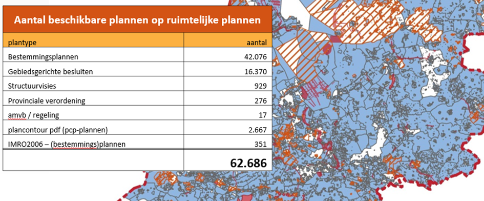
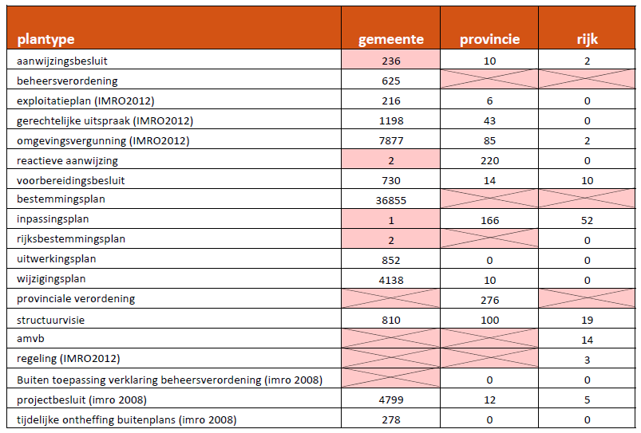

# Gebruik van verschillende plantypes

**De Wet ruimtelijke ordening kent verschillende ruimtelijke instrumenten voor
gemeenten, provincies en het rijk. Met dit hoofdstuk gaan we in op de toepassing
in de praktijk van deze verschillende plantypes.**

## Inleiding
Voor gemeenten, provincies en het rijk kent de Wro verschillende ruimtelijke
instrumenten. Welke dit zijn, is in het Besluit ruimtelijke ordening (Bro)
bepaald. Bestemmingsplannen worden door de gemeente gemaakt, inpassingsplannen
door provincies en het rijk. Een aanwijzingsbesluit kan niet door een gemeente
worden genomen. De RO Standaarden geven voor die ruimtelijke instrumenten aan
hoe ze geproduceerd, beschikbaar gesteld, vindbaar en toegankelijk gemaakt
worden.  
In de praktijk zien we op Ruimtelijkeplannen.nl echter wel plantypes die volgens
de wettelijk grondslag niet door dat bevoegd gezag gemaakt kunnen worden. Door
deze verkeerde plantypes eruit te halen wordt de data verbeterd.

Hierbij zijn vier onderwerpen belangrijk die wij vervolgens in dit hoofdstuk
verder willen uitleggen:  
-   Gebruik van verkeerde plantypes [5.3](#verkeerde-plantypes)
-   Wanneer kunnen verouderde versies van plannen verwijderd worden [5.4](#verouderde-plannen)
-   Toepassing van geconsolideerd plannen [5.5](#plannen-consolideren)
-   Bestemmingsplannen met verbrede reikwijdte [5.6](#bestemmingsplan-met-verbrede-reikwijdte)
-   Toepassing van plancontour & PDF [5.7](#toepassen-van-plancontour-pdf-plannen)

## Plantypes
Via Ruimtelijkeplannen.nl worden door bevoegde gezagen verschillende plantypes
gepubliceerd. Er zijn sinds 2010 ruim 65.000 plannen beschikbaar gesteld. Niet
alle bronhouders kunnen dezelfde plantypes publiceren.

***Figuur 3: Overzicht van de meest voorkomende plantypes op Ruimtelijkeplannen.nl
anno 2017***

## Verkeerde Plantypes
Wettelijk is vastgelegd welke plantypes welk bevoegd gezag kan en mag
publiceren. Toch kan het voorkomen dat er per ongeluk plantypes worden
gepubliceerd door een bevoegd gezag, die dit in feite niet mag. Dit komt omdat
dit (nog) niet wordt afgevangen door de Validator van Ruimtelijkeplannen.nl, en
vraagt dus extra aandacht. Zie hieronder een overzicht van plantypes waarbij de
met roze aangeduide vakken in feite niet voor zouden mogen komen.

***Figuur 4: Plantypes van gemeenten, provincies en het rijk***

### Aanwijzingsbesluit
>Actie: Gemeentelijke bronhouder: u kunt geen aanwijzingsbesluit publiceren

Een aanwijzingsbesluit is geen bevoegdheid van een gemeente. Dit is een door
Gedeputeerde Staten of door de verantwoordelijke minister voor het
desbetreffende beleidsterrein te geven aanwijzing voor het opstellen van een
bestemmingsplan aan de gemeenteraad, provinciale staten of Gedeputeerde Staten.
Toch publiceren gemeentelijke bronhouders aanwijzingsbesluiten. Waarschijnlijk
komt dit doordat een aanwijzingsbesluit een gebiedsgericht besluit is. Vaak
worden de lijstjes van plantypes op alfabetische volgorde in de software
aangeboden. Omdat aanwijzingsbesluit vaak boven aan de lijst staan kan het zijn
dat deze wordt gepakt in plaats van een ander besluit, wat de bedoeling was,
zoals een omgevingsvergunning.

**Wat te doen?**
Met het publiceren van een verkeerd plantype:

-   Plan uit het manifest te verwijderen;

-   Plantype aanpassen;

-   Opnieuw waarmerken, valideren en publiceren en een dag later weer aanbieden aan Ruimtelijkeplannen.nl.

Met de Praktijkrichtlijn Gebiedsgerichte Besluiten (PRGB2012)[^17] is conform
het informatiemodel Ruimtelijke ordening (IMRO) uitgelegd hoe in de praktijk
gewerkt moet worden met de verschillende gebiedsgerichte besluiten zoals een
aanwijzingsbesluit.

[^17]: Praktijkrichtlijn Gebiedsgerichte Besluiten:
https://www.geonovum.nl/wegwijzer/standaarden/praktijkrichtlijn-gebiedsgerichte-besluiten-prgb2012

## Verouderde plannen
>Actie: Zorg dat er alleen vigerend beleid- en regelgeving raadpleegbaar is

In paragraaf 3.3 is al een toelichting gegeven over de belangrijkheid van het
opschonen van de data die beschikbaar is op Ruimtelijkeplannen.nl en het wel of
niet beschikbaar blijven stellen van alle planbestanden.

**Wat te doen?**

Iedere bronhouder controleert en past de planvoorraad die hij beschikbaar heeft
gesteld op een webadres (URL), aan op de volgende onderdelen:  
-   bepalen welke plannen waar geldig zijn en verwijdert eventuele vervallen
    plannen van de weblocatie. Alleen geldige ruimtelijke plannen, visies en
    besluiten zijn in het manifest opgenomen;
-   de dossierstatus sluit aan op de planstatus van het meest recente plan in
    het dossier;  
-   de bronbestanden van een ruimtelijk plan zijn allemaal beschikbaar op de
    weblocatie;  
-   van de oude analoge ruimtelijke plannen (conform oude WRO) bekijkt de
    bronhouder in hoeverre deze geactualiseerd moet worden dan wel met behulp
    van Plancontour en PDF digitaal moet worden ontsloten;  
-   alle plannen archiveert de bronhouder intern in de eigen organisatie in het
    kader van de archiefplicht.

### Voorbereidingsbesluiten
>Actie: Verwijder voorbereidingsbesluiten die ouder zijn dan één jaar

Een voorbereidingsbesluit is een verklaring van de gemeenteraad dat een
bestemmingsplan voor het betreffende gebied wordt voorbereid. Met dit besluit
wordt een voorbereidingsbescherming beoogd, waarmee een aanhoudingsplicht geldt
voor bouw- en aanlegactiviteiten. Een voorbereidingsbesluit heeft een
geldigheidsduur van één jaar. Na dit jaar dient een ontwerp bestemmingsplan in
procedure te zijn gebracht.  
Er staat een aantal voorbereidingsbesluiten die
ouder zijn dan één jaar in de planvoorraad.

**Wat te doen?**

-   Opschonen door het voorbereidingsbesluit te verwijderen uit het manifest
    waarbij het tevens verwijderd moet worden van Ruimtelijkeplannen.nl.

-   De oudere versies moeten wel door de gemeente zelf bewaard worden
    (archiefplicht).

### Bestemmingsplannen
Om de planvoorraad goed opgeschoond te krijgen is het van belang dat goed
bekeken wordt welke plannen van belang zijn om deze op Ruimtelijkeplannen.nl te
laten staan. Het advies is dan ook om na beëindiging van de procedure van een
plan alleen het meest actuele plan beschikbaar te stellen waarbij oude versies
en vervallen plannen kunnen worden verwijderd uit het manifest en daarmee ook
uit de data van de website van Ruimtelijkeplannen.nl.

>Actie: Verwijder concept / voorontwerp plannen ouder dan 2 jaar

De bronbestanden van iedere beschikbaar gestelde versie van een ruimtelijk
instrument blijven toegankelijk totdat een instrument onherroepelijk in werking
is getreden of is vervallen. Dit is vastgelegd in het Besluit ruimtelijke
ordening (Bro).

Wanneer het instrument eenmaal onherroepelijk is, mogen de oudere versies geheel
verwijderd worden uit het manifest en van Ruimtelijkeplannen.nl. Alleen de meest
actuele versie moet beschikbaar en raadpleegbaar blijven. Vanuit de RO
Standaarden geldt geen verplichting voor het verwijderen van oudere versies of
vervallen plannen. In alle gevallen is de Archiefwet van toepassing op deze
stukken.

Concept en voorontwerp (bestemmings)plannen die ouder zijn dan 2 jaar zullen
naar alle waarschijnlijkheid niet verder in procedure worden gebracht. Om de
data verder op te schonen is het verstandig om deze plannen te verwijderen.

**Wat te doen?**

-   Planvoorraad opschonen door het verwijderen van oude planversies in het
    manifest en daarbij uit de data van Ruimtelijkeplannen.nl.

-   Oudere versies moeten wel door de gemeente zelf bewaard worden
    (archiefplicht).

Binnen twaalf weken dient te worden besloten of een ontwerp bestemmingsplan
wordt vastgesteld. Na vaststelling van een bestemmingsplan volgt een
beroepstermijn. Indien tegen een plan geen beroep is ingesteld waardoor het plan
daags na het beroepstermijn geheel onherroepelijk in werking treedt. De laatste
planstatus van dit plan is ‘vastgesteld’. Indien er geen veranderingen zijn
opgetreden in het plan kan het ontwerpplan verwijderd worden uit het manifest.

>Actie: Verwijder ontwerp plannen wanneer het plan onherroepelijk is

**Wat te doen?**

-   Planvoorraad opschonen door het verwijderen van oudere planversies in het
    manifest en daarbij uit de data van Ruimtelijkeplannen.nl.

-   Oudere versies moeten wel door de gemeente zelf bewaard worden
    (archiefplicht).

## Plannen consolideren
Door de huidige weergave van de plannen op Ruimtelijkeplannen.nl ontstaan
onduidelijke situaties door de stapeling van de plannen. Hierdoor is het lastig
om het leidend plan te bepalen. Om meer duidelijkheid te kunnen bieden over de
exacte status en werkingssfeer van de wijzigingen en herzieningen van een
bestemmingsplan en het actuele planologische regime ter plaatse, kan het gebruik
van een versie “geconsolideerd” de oplossing zijn. Let op: het gaat dus niet om
een herziening of een actualisering van een ruimtelijk plan, maar om het
samenvoegen van meerdere ruimtelijke plannen om zo een integrale versie, en
daardoor een beter leesbare versie, te tonen. In de versie geconsolideerd worden
geen nieuwe ontwikkelingen mogelijk gemaakt.

De versie ‘geconsolideerd’ van een bestemmingsplan kent geen wettelijke, dus
*geen juridische status* omdat deze versie niet door gemeenteraad wordt
vastgesteld. Het gebruik van een geconsolideerd plan is een keuze van het
bevoegde gezag. Bij vergunningverlening en handhaving moet altijd verwezen
worden naar de juridisch geldende plannen. Het consolideren van de
bestemmingsplannen gaat in eerste instantie altijd over het samenvoegen van twee
of meer verbeeldingen. Dit kan in combinatie met het consolideren van de regels
en toelichting. In de Praktijkrichtlijnen[^18] is per plantype meer informatie
te vinden over de toepassing van een versie geconsolideerd.

[^18]: De RO standaarden:
https://www.geonovum.nl/onderwerpen/ruimtelijke-ordening-standaarden?tab=standaarden

**Wat te doen?**  

Er zijn verschillende manier van consolideren. De twee belangrijkste zijn het
verschil in wel of niet opnieuw een geconsolideerd plan vast te laten stellen.
Met het opnieuw laten vaststellen van een versie geconsolideerd krijgt deze
versie wel een juridische status. Hierbij dient wel rekening gehouden te worden
met eventueel opnieuw te behandelen bezwaren en het vernieuwen van
onderzoeksrapporten.

-   Keuze: wel of niet consolideren.

-   Onderzoek doen naar het consolideren van zowel de verbeelding als de tekst.

-   Wel of niet op nieuw laten vaststellen.

-   Bij opnieuw vaststellen procedure openstellen voor bezwaar en evt.
    onderzoeken opnieuw uitvoeren.

## Bestemmingsplan met verbrede reikwijdte
Met het wijzigen van het Besluit Crisis- en herstelwet in mei 2014 (Stb. 2014,
nr. 168[^19]) is het voor een aantal gemeenten mogelijk bestemmingsplannen (met
verbrede reikwijdte) te maken waarmee kan worden afgeweken van een aantal met
name genoemde onderdelen van de geldende wet- en regelgeving. De betreffende
gemeenten experimenteren hiermee in het kader van de Crisis- en herstelwet (Chw)
en doen tevens ervaring op ter voorbereiding op de Omgevingswet.

[^19]: Besluit van 13 mei 2014 tot wijziging van het Besluit uitvoering Crisis-
en herstelwet en tot aanvulling van de bijlagen bij de Crisis- en herstelwet
(zevende tranche); https://zoek.officielebekendmakingen.nl/stb-2014-168.html

Een van de aspecten waar gemeenten onder voorwaarden van af mogen wijken zijn de
digitale aspecten met RO Standaarden en Ruimtelijkeplannen.nl[^20]. De
voorwaarde hierbij is dat het Chw bestemmingsplan wel elektronisch op een
algemeen toegankelijke wijze beschikbaar wordt gesteld en blijft op een door de
raad te bepalen internetadres (weblocatie). De landelijke voorziening
Ruimtelijkeplannen.nl bevat een verwijzing naar dit internetadres. Dit is
bepaald in artikel 7c, lid 9 van Besluit uitvoering Chw.

[^20]: In de huidige situatie dienen bestemmingsplannen te voldoen aan de op
basis van artikel 1.2.6 Bro opgestelde Regeling standaarden ruimtelijke ordening '2012. Deze regeling bevat vereisten met betrekking tot vormgeving, inrichting en
elektronische beschikbaarstelling van het plan: de RO Standaarden '2012.

Geonovum heeft voor dit onderwerp een werkafspraak opgesteld voor de toepassing
van een Chw bestemmingsplan omdat dit direct invloed heeft op de afspraken
rondom de RO Standaarden. In de werkafspraak ‘Chw bestemmingsplannen digitaal
beschikbaar stellen’[^21] wordt ingegaan op de toepassing van de
afwijkingsmogelijkheden voor de digitale aspecten van de RO Standaarden en
Ruimtelijkeplannen.nl.

[^21]: Werkafspraak Crisis- en herstel bestemmingsplannen:
https://www.geonovum.nl/geo-standaarden/ro-standaarden-ruimtelijke-ordening#Werkafspraken

**Wat te doen?**  
Met de werkafspraak voor de toepassing van een Chw bestemmingsplannen wordt
dringend geadviseerd om de naam te beginnen met ‘Chw bestemmingsplan’ om de
vindbaarheid van deze plantype te optimaliseren.

In de werkafspraak worden daarnaast twee opties voor de digitale ontsluiting van
dit bestemmingsplan gegeven waaruit de gemeente moet kiezen:

1.  **Uitvoering met behulp van een contour op Ruimtelijkeplannen.nl**

>   De gemeente stelt een contour met daaraan gekoppeld pdf bestanden van kaart,
>   toelichting en regels beschikbaar die via Ruimtelijkeplannen.nl
>   raadpleegbaar is; via een andere weblocatie stelt de gemeente het Chw
>   bestemmingsplan op een algemeen toegankelijke wijze beschikbaar.

2.  **Uitvoering met behulp van een interactief raadpleegbaar plan op
    Ruimtelijkeplannen.nl**

>   De gemeente stelt het Chw bestemmingsplan beschikbaar als authentiek plan
>   waarvan de volledige inhoud via Ruimtelijkeplannen.nl conform RO Standaarden
>   2012 interactief raadpleegbaar is.

Voor beide werkwijzen geldt dat het Chw bestemmingsplan via het tabblad
‘bestemmingsplannen’ van Ruimtelijkeplannen.nl raadpleegbaar zal zijn. Met
behulp van de zoekfunctie op Ruimtelijkeplannen.nl is het Chw bestemmingsplan
wel op naam en planidentificatienummer vindbaar. Het Chw bestemmingsplan zal
echter niet vindbaar zijn als afzonderlijk ‘plan type’; hiervoor zal gezocht
moeten worden met behulp van plan type ‘bestemmingsplan’ of
‘beheersverordening’.

Met de eerste optie wordt via de landelijke voorziening Ruimtelijkeplannen.nl de
contour van het Chw bestemmingsplan beschikbaar gesteld. Op een door de
gemeenteraad te bepalen internetadres stelt de gemeente de gehele integrale
versie van het Chw bestemmingsplan beschikbaar. De authenticiteit, integriteit,
volledigheid, beschikbaarheid en raadpleegbaarheid van het Chw bestemmingsplan
moet de gemeente met optie 1 *zelf* waarborgen. Het is nog onduidelijk of met
behulp van de overbruggingsfunctie deze vorm van het Chw bestemmingsplan
voldoende zal worden ontsloten in het Loket van het DSO-LV.

Met de tweede optie wordt het Chw bestemmingsplan volgens de vastgestelde RO
Standaarden beschikbaar gesteld, en wordt de authenticiteit, integriteit,
volledigheid, beschikbaarheid en raadpleegbaarheid van het Chw bestemmingsplan
door de landelijke voorziening Ruimtelijkeplannen.nl gewaarborgd.

## Toepassen van Plancontour & PDF plannen
Met het wetsvoorstel voor het vervallen van de actualiseringsplicht van
bestemmingsplannen, inpassingsplannen en beheersplannen wordt beoogd om extra
ruimte te scheppen voor gemeenten. De wetswijziging van de Wro zal alleen gaan
gelden voor die plannen die ‘elektronisch raadpleegbaar’ zijn via
Ruimtelijkeplannen.nl. Voor een plan dat niet op de website staat blijft
actualiseringsplicht dus nog van toepassing.

In de toelichting op het wetsvoorstel wordt aangegeven dat een papieren
(analoog) plan ook digitaal raadpleegbaar kan zijn als het als pdf bestand op de
website wordt gezet. Voor deze plannen geldt wel dat de analoge plannen de
juridisch leidende plannen zijn. Dit houdt in dat de actualiseringsplicht niet
alleen vervalt voor de wettelijke digitale plannen (op basis van IMRO2008 en
IMRO2012) maar ook voor plannen op basis van IMRO2006 (facultatieve standaard)
en analoge plannen die door middel van een Plancontour & PDF via de landelijke
voorziening Ruimtelijkeplannen.nl zijn ontsloten. Vooralsnog blijft het
verstandig om te blijven actualiseren en digitaliseren volgens de laatste
standaarden om zo de data op orde te blijven brengen richting de Omgevingswet.

Bij het plaatsen van een Plancontour & PDF plan wordt vaak de contour van het
hele analoge plan gepubliceerd op Ruimtelijkeplannen.nl. Dit is niet
noodzakelijk. Vaak zijn grote plannen in de loop der jaren gedeeltelijk
vervangen door digitaal raadpleegbare plannen op basis van de RO Standaarden. Om
de raadpleegbaarheid en leesbaarheid van de plannen zo optimaal mogelijk te
laten zijn is het verstandig om als bronhouder te bepalen voor welke locatie een
analoog plan nog geldig is. Bovendien geeft het voor de interne organisatie een
goed beeld van de plangebieden die nog niet geactualiseerd en gedigitaliseerd
zijn. Hou er rekening mee dat niet alleen het vigerend bestemmingsplan
gepubliceerd wordt als Plancontour & PDF plan, maar ook alle eventuele
wijzigings- en uitwerkingsplannen die op basis van dit plan zijn gemaakt.

**Wat te doen?**  
Bekijk per analoog plan welk gedeelte hiervan nog geldig is. *Zorg dat de
contour van het te publiceren plan als plancontour alleen dat gedeelte bevat dat
geldig is*. Dit kunnen meerdere contouren in één plangebied zijn. Zorg hierbij
tevens dat op de pdf plankaart door middel van een duidelijke lijn is aangegeven
om welk(e) gebied(en) het gaat.

Als tweede stap is het verstandig om bij kleine gebieden waarbij slechts nog één
of twee bestemmingen geldig zijn alleen die voorschriften te koppelen als pdf.
Hierbij wordt dus ook de tekst aangepast aan het deel dat nog geldig is. Het
gaat hier alleen om het publiceren van het PDF plan via de landelijke
voorziening Ruimtelijkeplannen.nl (www.ruimtelijkeplannen.nl). Een apart besluit
van college of gemeenteraad om de digitale plancontour met pdf‐bestand op de
website te zetten is niet nodig.

Bij het maken van een Plancontour & PDF plan moet daarnaast gelet worden op het
volgende. De opbouw van het planidentificatienummer is bij dit type plan anders
dan bij een IMRO2008/ IMRO2012 plan. Het is mogelijk verschillende teksten
(voorschriften/ regels, toelichting, bijlagen) te koppelen aan de plancontour.
Zaak is deze zoveel als mogelijk te bundelen waardoor er bijvoorbeeld één PDF
ontstaat met bijlagen bij de voorschriften/ regels en één PDF met bijlagen bij de
toelichting.