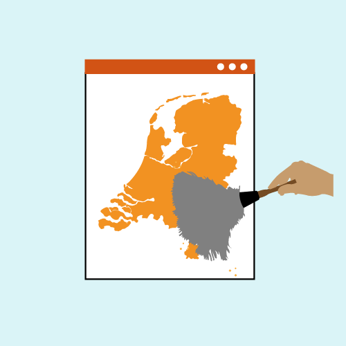

## Inleiding

<b>In dit eerste hoofdstuk van de handreiking over de gegevenskwaliteit van ruimtelijke plannen wordt de context van het concept ‘Data op orde’ uitgelegd.</b>

### Aanleiding

<b>De zolder opruimen voor de verbouwing</b>  
In de loop der jaren zijn er via de landelijke voorziening Ruimtelijkeplannen.nl veel waardevolle gegevens gepubliceerd; en een grote planvoorraad is toegankelijk gemaakt. Maar net zoals een zolder die zo nu en dan opgeruimd moet worden om goed bruikbaar te blijven, geldt dit ook voor de planvoorraad. Zeker als er een grote verbouwing zoals de Omgevingswet op komst is, die per 1 januari 2024 inwerking is getreden. Alle gegevens in Ruimtelijkeplannen.nl gaan mee naar het Omgevingsloket van de Omgevingswet. Zo ook bestemmingsplannen e.d. die onderdeel zijn van het tijdelijk omgevingsplan. Deze plannen blijven geldig totdat zij worden vervangen door een nieuw omgevingsplan conform de nieuwe standaard STOP/TPOD (uiterlijk in 2032).

Het Informatiehuis Ruimte (IHR) heeft de overbruggingsfunctie gerealiseerd. Deze overbruggingsfunctie zorgt ervoor, dat de gegevens van Ruimtelijkeplannen.nl in het Digitale Stelsel Omgevingswet (DSO) worden ontsloten en in samenhang met de Omgevingswet instrumenten kunnen worden getoond. Hiervoor hoeft de bronhouder (resp. gemeente, provincie of het Rijk) in principe niets te doen, dit gebeurt automatisch. 

Zowel voor bronhouders als gebruikers van het DSO is het belangrijk dit zo proces zo soepel mogelijk verloopt. Daarom is het belangrijk dat de gegevenskwaliteit van de ruimtelijke plannen in de landelijke voorziening, maar ook bij de bronhouder zelf, zo hoog mogelijk is.

### Doel: Verbeteren gegevenskwaliteit

Het doel voor data op orde is het verbeteren van de gegevenskwaliteit. Dit kunnen we grofweg verdelen in 2 onderdelen.

**1. Foutherstel**
Fouten in de planvoorraad kunnen ertoe leiden dat plannen niet, of niet goed ontsloten worden in het DSO. Deze fouten moeten hersteld worden.  

</img>

**2. Opschonen van de planvoorraad**
In de loop der jaren is de planvoorraad op Ruimtelijkeplannen.nl enorm uitgebreid. Vaak zijn wel plannen toegevoegd maar zijn er geen vervallen plannen en verouderde versies verwijderd.

</img>

Waarom is de kwaliteit van de planvoorraad zo van belang?

<ol><li>Ten eerste wordt een aanzienlijk deel van de huidige planvoorraad onderdeel van het tijdelijk omgevingsplan. Het is daarom van groot belang dat daar niet te veel, maar ook niet te weinig in zit.</li>
<li>Het zorgt ervoor dat DSO functionaliteit om huidige plannen beter en gerichter te kunnen ontsluiten voor gebruikers, zoals de overbruggingsfunctie en bepalen leidend plan, beter werken. Hiervoor is vooral belangrijk dat metadata zoals plan- en dossierstatus, plantype en verwijzingen tussen plannen kloppen en actueel zijn. </li>
<li>Een ‘schone’ planvoorraad creëert een goede uitgangspositie voor het maken van het eigenlijke omgevingsplan. De onderliggende gegevens (bijvoorbeeld planobjecten en achterliggende gegevens) zijn dan al beschikbaar.</li>
<li>Last but not least helpt een betere gegevenskwaliteit ook de huidige dienstverlening, aan de balie, via Ruimtelijkeplannen.nl of eigen website te verbeteren.</li>
</ol>

De huidige planvoorraad verschilt per organisatie; het kan gaan om enkele tientallen tot honderden ruimtelijke plannen per bronhouder. Om bronhouders te helpen bij het ordenen en opschonen van de digitale planvoorraad is deze handreiking tot stand gekomen. Met deze handreiking geven we aan welke punten belangrijk zijn bij de gegevenskwaliteit van deze (digitale) planvoorraad en hoe deze kan worden verbeterd.

### Leeswijzer

In deze handreiking worden de verschillende onderwerpen toegelicht en worden handige tips & tricks gegeven. De normen en praktijkrichtlijnen, alsook de handreiking archiveren, zijn hiervoor altijd de <a href='https://www.geonovum.nl/geo-standaarden/ro-standaarden-ruimtelijke-ordening' target='_blank'>basis</a>.

In [hoofdstuk 2 Algemene werkwijze bij foutherstel](#algemene-werkwijze-bij-foutherstel) geven we de kaders voor foutherstel van ruimtelijke plannen, wat mag je wel aan een plan wijzigen en wat niet en wat is de te volgen werkwijze.

In [hoofdstuk 3 Uitwerking foutherstel in de planvoorraad](#uitwerking-foutherstel-in-de-planvoorraad) gaan we inhoudelijk in op de meest voorkomende fouten in de planvoorraad. Welke fouten zijn dit, wat zijn consequenties hiervan en hoe kunnen deze fouten worden opgelost. 

In [hoofdstuk 4 De planvoorraad opschonen](#de-planvoorraad-opschonen) gaan we dieper in op de planvoorraad en lichten we toe hoe deze zo optimaal mogelijk opgeschoond kan worden.

