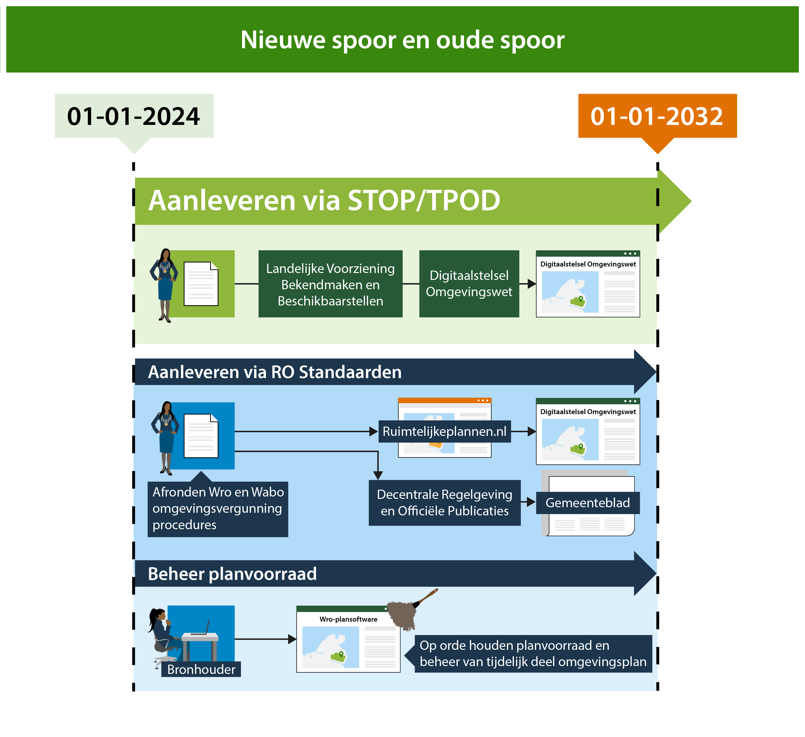

# Inleiding  {#3FC96725}
<b>De Wro planvoorraad van gemeenten, provincies en het Rijk in Ruimtelijkeplannen.nl wordt sinds het inwerkingtreden van de Omgevingswet automatisch getoond in het Omgevingsloket samen met de nieuwe regels uit de omgevingsdocumenten. Voor de gebruiker van het Omgevingsloket kan er verwarring ontstaan als er meerdere versies van de regels beschikbaar zijn: welke regels gelden dan? Alleen het bevoegd gezag kan hierover duidelijkheid geven. Dit kan onder meer door het op orde houden van de Wro planvoorraad, ook onder de Omgevingswet. Dit kan alleen als de bronhouder met de eigen Wro-plansoftware, het manifestbeheer en de certificaten voor ondertekening tot 2032 behoudt en beheert. Deze handreiking is opgesteld voor gemeenten, en de organisaties die hen ondersteunen, die in de transitieperiode moeten werken met zowel Omgevingswet-software als Wro-plansoftware.</b>

## Nieuwe spoor en oude spoor {#6A6A9823}
In de transitieperiode van 1 januari 2024 tot 1 januari 2032 hebben gemeenten de tijd om één omgevingsplan voor de gehele gemeente te vormen conform de TPOD-standaarden en de oude planvoorraad te verwijderen van Ruimtelijkeplannen.nl. 
In deze periode worden ook lopende Wro-planprocedures afgerond. Op grond van de tijdelijke alternatieve maatregelen (TAM) kunnen tot en met 2025 voorbereidingsbesluiten en wijzigingsbesluiten op het omgevingsplan worden gemaakt en beschikbaar gesteld via het <i>oude spoor</i>: het met de Wro-plansoftware via Ruimtelijkeplannen.nl beschikbaar stellen en bekend maken via de Decentrale Regelgeving en Officiële Publicaties (DROP). De planvoorraad van Ruimtelijkeplannen.nl wordt automatisch ontsloten in het <a href='https://omgevingswet.overheid.nl/home' target='_blank'>Omgevingsloket</a>. In het <a href='https://wetten.overheid.nl/BWBR0045037/2025-01-01' target='_blank'>Besluit elektronische publicaties, artikel 11 lid 1 onder 6</a> is geregeld dat uiterlijk tot 1 januari 2032 de landelijke voorziening Ruimtelijkeplannen.nl blijft functioneren.
 
 
Op grond van de Omgevingswet werken gemeenten steeds meer via het <i>nieuwe spoor</i>: met de Omgevingswet-software via de Landelijke Voorziening Bekendmaken en Beschikbaarstellen (LVBB) worden de regels ontsloten in het Omgevingsloket. Omgevingsvergunningen op basis van de <a href='#55A7BEB0'>Wabo</a> en regels van onder andere de WRO en Wro vervallen wanneer de gemeente de regels opneemt in het wijzigingsbesluit op het omgevingsplan. De oude regels vervallen niet alleen juridisch maar moeten ook technisch komen te vervallen. Dat is een onderdeel van het werkproces van de gemeente. Het actualiseren van het omgevingsplan leidt namelijk niet automatisch tot het verwijderen van het vervallen bestemmingsplan uit de planvoorraad van Ruimtelijkeplannen.nl. 
 
 
Alleen als gemeenten onder de Omgevingswet ook hun planvoorraad op Ruimtelijkeplannen.nl onderhouden zal het voor de gebruiker van het Omgevingsloket duidelijk kunnen worden welke regels geldend zijn. Een niet goed onderhouden planvoorraad op Ruimtelijkeplannen.nl zal zeker leiden tot onduidelijkheid over geldende regels bij de gebruiker van het Omgevingsloket.
 
 
<figure id='f75045'></img>
<figcaption>Gelijktijdig werken in het het nieuwe spoor en het oude spoor.</figcaption></figure>

## Leeswijzer  {#1CBF3ECC}
Er is veel documentatie te vinden op de websites van IPLO, Geonovum en de VNG. Naast de documentatie over de <a href='https://www.geonovum.nl/geo-standaarden/ro-standaarden-ruimtelijke-ordening/' target='_blank'>RO Standaarden</a>, <a href='https://www.geonovum.nl/omgevingswet' target='_blank'>TPOD-standaarden</a>, waaronder de <a href='https://www.wegwijzertpod.nl/' target='_blank'>wegwijzer</a> en <a href='https://iplo.nl/regelgeving/instrumenten/' target='_blank'>juridische toelichting</a>, is er ook <a href='https://omgevingswet.vng.nl/grip/' target='_blank'>Grip op de transitie van de planketen</a> van de VNG.
Deze handreiking richt zich op gemeenten en het gebruik van het oude spoor: <i>Ruimtelijke plannen op orde onder de Omgevingswet</i><b><i> </i></b><i>in de transitieperiode met behulp van de Wro-plansoftware.</i> 
 
 
Hoofdstuk 2 gaat in op het beheer van de planvoorraad in Ruimtelijkeplannen.nl. In de daaropvolgende hoofdstukken wordt per onderwerp een toelichting gegeven. Alle hoofdstukken sluiten af met korte samenvatting: waar moet op worden gelet? Er wordt zoveel mogelijk verwezen naar bestaande documentatie waarin een uitgebreidere toelichting op de werkwijze is beschreven.
 
 
<ul><li>Hoofdstuk 2 <a href='#1364DA20'>Beheer van de planvoorraad</a></li>
<li>Hoofdstuk 3 <a href='#324DBF6E'>Omgevingsvisies</a></li>
<li>Hoofdstuk 4 <a href='#62087022'>Tijdelijk deel omgevingsplan</a></li>
<li>Hoofdstuk 5 <a href='#55A7BEB0'>Omgevingsvergunningen</a></li>
<li>Hoofdstuk 6 <a href='#7D4FADDD'>TAM voorbereidingsbesluit</a></li>
<li>Hoofdstuk 7 <a href='#5221ABF7'>TAM omgevingsplan</a></li>
<li>Hoofdstuk 8 <a href='#1364DA20'>Archiveren ruimtelijke plannen</a></li>
</ul>