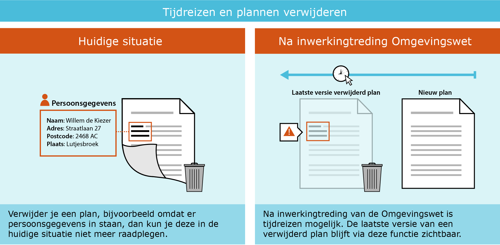

## Algemene Werkwijze bij Foutherstel 

<b>Ambtelijk foutherstel in een ruimtelijke plan of besluit door de bronhouder, zonder voorafgaand besluit, is het herstellen van de metadata c.q. de technische kenmerken van het ruimtelijk plan of besluit of het opheffen van inconsistenties in de planvoorraad tussen bronhouder en Ruimtelijkeplannen.nl.</b>

### Werkafspraak vs. Handreiking

Bij onduidelijkheden, tegenstrijdigheden of fouten in de RO Standaarden kan het werkveld de beheerders van de standaarden vragen hoe je de standaard nu moet gebruiken totdat een officiële wijziging van de standaard de onduidelijkheid recht zet. Deze tussentijdse adviezen over het gebruik van de RO Standaarden heten werkafspraken. 

De werkafspraak ‘<a href='https://docs.geostandaarden.nl/ro/def-wa-waSTRIIMRO-20180901/' target='_blank'>Wijzigen reeds eerder gepubliceerde plannen(STRI/IMRO)</a>’ betreft in dit geval geen wijziging van de Standaard Toegankelijkheid Ruimtelijke Instrumenten/ Informatiemodel Ruimtelijke ordening maar een nadere uitleg en dringend advies over de toepassing van de RO Standaarden bij vastgestelde plannen. De werkafspraak is de basis voor deze handreiking. De hiernavolgende paragrafen zijn aanvullend op deze werkafspraak.

### Aanpassing van vorm- of technische aspecten

De hoofdregel is dat foutherstel niet gaat over de inhoud van een plan of besluit, maar om vorm- of technische aspecten die van belang zijn voor blijvende raadpleegbaarheid, bruikbaarheid en toegankelijkheid van het plan. Foutherstel is alleen mogelijk:

- Als het gebrek niet gaat over de inhoud van het besluit, maar om bepaalde metadata of inconsistentie tussen bronhouder en Ruimtelijkeplannen.nl kan worden volstaan met een ambtelijk herstel zonder besluit. Voorbeelden van type aanpassingen zijn:
	- Foutherstel van de dossierstatus in het manifest
	- Foutherstel van metadata van de planset zoals, typeplan, datum en status info, overheidscode, identificatienummer, verwijzingen naar externe plannen.
	- Anonimiseren van documenten naar aanleiding van de AVG
- Randvoorwaarde is dat een goede verantwoording van uitgevoerd foutherstel is gewaarborgd bij de bronhouder. Hierdoor kan later door de bronhouder altijd gereconstrueerd worden wat de aanleiding van de hersteloperatie was en wie, wanneer, wat en hoe het herstel heeft uitgevoerd. Dat geldt nu binnen de context van de Wro, maar evengoed straks binnen de context van de Omgevingswet/ het DSO-LV.

Bij gebreken aan de inhoud van het plan of besluit zal het bevoegd gezag een nieuw besluit moeten nemen of een nieuwe procedure moeten volgen. Een nieuwe procedure starten conform Wro en op basis van de RO Standaarden kan tot inwerkingtreden Omgevingswet. 

### Uitvoeren foutherstel aan plan

De bronhouder verwijdert het ruimtelijke plan of besluit van de weblocatie en uit het manifest. Door het verwijderen van het plan uit het manifest, wordt door de landelijke voorziening Ruimtelijkeplannen.nl het plan ook van Ruimtelijkeplannen.nl gehaald. Het plan is niet meer beschikbaar en raadpleegbaar via Ruimtelijkeplannen.nl. De bronhouder past de betreffende metadata in dezelfde versie van het plan aan. Het planidentificatienummer van het plan blijft hetzelfde. Het volledige aangepaste plan zet de bronhouder binnen 24 uur weer op de weblocatie en in het manifest. Het plan wordt door de landelijke voorziening geladen en is weer raadpleegbaar via de viewer van Ruimtelijkeplannen.nl.

**Doorlooptijd van foutherstel**  
De gehele cyclus van foutherstel is mogelijk binnen 24 uur. Dit omdat Ruimtelijkeplannen.nl sinds voorjaar 2018 tweemaal per dag de plannen harvest (planwijzigingen ophaalt) bij de bronhouder. Het verwijderen kan ’s ochtends plaatsvinden, het plaatsen van een nieuwe versie ’s middags. De ‘offline’ tijd van een plan blijft zo minimaal.

### Relatie met tijdreizen

Op dit moment is ‘tijdreizen’ niet mogelijk in Ruimtelijkeplannen.nl. Het is dus niet mogelijk om te kijken naar een situatie uit het verleden. Vanaf het moment dat de Omgevingswet in werking treedt is tijdreizen alleen mogelijk met het Omgevingsloket (of met de bijbehorende DSO-LV API's) en niet met Ruimtelijkeplannen.nl. Tijdreizen is dan alleen mogelijk naar een versie van het plan dat als laatste is gepubliceerd. 

We onderscheiden dus de volgende 2 situaties.

<ul><li>Verwijderde plannen voor in werking treden Omgevingswet zijn middels tijdreizen <u>niet</u> raadpleegbaar in het DSO;</li>
<li>Verwijderde plannen na inwerkingtreden Omgevingswet, hiervan blijft via tijdreizen <u>de laatste versie</u> raadpleegbaar in het DSO. De laatste versie is het laatst geladen plan onder hetzelfde planidentificatienummer, zie ook [paragraaf 2.3](#uitvoeren-foutherstel-aan-plan).</li>
</ul>

Zeker bij foutherstel in het kader van de Algemene verordening gegevensbescherming (<a href='https://www.rijksoverheid.nl/onderwerpen/privacy-en-persoonsgegevens' target='_blank'>AVG</a>), moet hier rekening mee gehouden worden, zie paragraaf AVG-Proof in deze handreiking.  

</img>

### Verantwoording bij aanpassingen

Ook indien er geen juridische consequenties zijn verbonden aan het herstel van de metadata, vragen aanpassingen van het plan wel om verantwoording: de aanpassingen moeten gerechtvaardigd zijn en in ieder geval intern bij de verantwoordelijke bronhouder expliciet verantwoord kunnen worden. Een duidelijke werkwijze helpt hierbij. De aanbeveling is hierbij de volgende spelregels in acht te nemen:

<ol><li>Een kennelijke verschrijving wordt opgelost met een ambtelijke wijziging. Dit betekent altijd dat de wijziging van de metadata van het plan, hetzij in een nieuwe versie, hetzij in dezelfde versie moet kunnen worden verantwoord. Intern wordt deze ambtelijke wijziging vastgelegd in het zaak/proces/documentbeheer systeem dat wordt gehanteerd door de bronhouder tijdens de planprocedure.</li>
<li>Het is hierbij aan te bevelen om de gewijzigde versie van het ruimtelijke plan samen met de verantwoording van de wijziging door de bronhouder te archiveren. De oorspronkelijke versie (zonder aanpassingen in de metadata) hoort dan ook in het archief opgenomen te blijven.</li>
<li>De planvoorraad op de weblocatie, met manifest, moet na afronding van het foutherstel (weer) gelijk zijn aan de planvoorraad bij de landelijke voorziening Ruimtelijkeplannen.nl. Zie ook [paragraaf 2.3](#uitvoeren-foutherstel-aan-plan).</li>
</ol>

In [Hoofdstuk 5](#formulier-foutherstel-ruimtelijke-plannen) is een voorbeeld formulier opgenomen die de bronhouder kan gebruiken voor verantwoording en samen met de nieuwe versie van het ruimtelijke plan, intern archiveert. De handreiking Archiveren ruimtelijke plannen is beschikbaar via de [Geonovum website](https://www.geonovum.nl/geo-standaarden/ro-standaarden-ruimtelijke-ordening) onder het kopje [Handreikingen](https://www.geonovum.nl/geo-standaarden/ro-standaarden-ruimtelijke-ordening#handreikingen)

