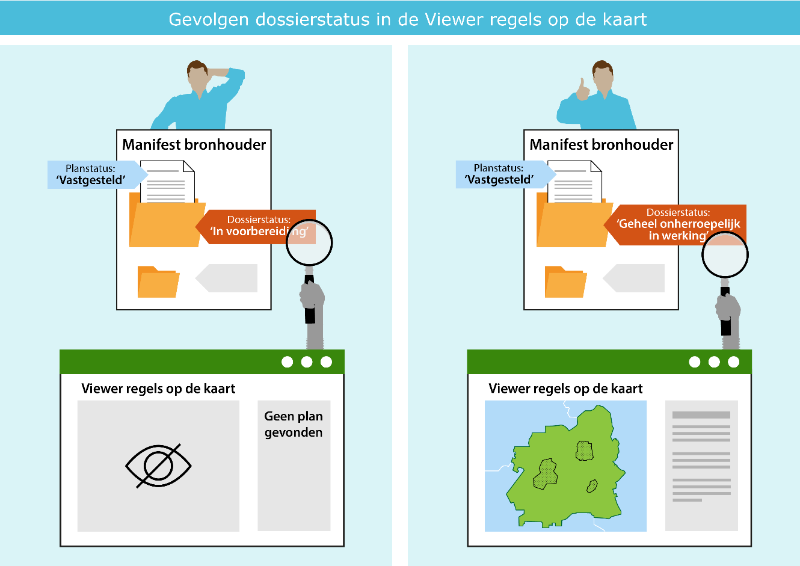

# Beheer van de planvoorraad  {#324DBF6E}
De planvoorraad van gemeenten die beschikbaar is via Ruimtelijkeplannen.nl is ook onder de Omgevingswet aan verandering onderhevig. Gemeenten ronden lopende Wro procedures af, stellen rechtelijke uitspraken en kennisgevingen van omgevingsvergunningen beschikbaar en plaatsen een wijzigingsbesluit op het omgevingsplan op basis van TAM op Ruimtelijkeplannen.nl. Deze planvoorraad wordt automatisch getoond in het Omgevingsloket in samenhang met de nieuwe regels uit de omgevingsdocumenten.
 
 
Voor de gebruiker van het Omgevingsloket kan er verwarring ontstaan als er meerdere versies van de regels beschikbaar zijn: welke regels gelden? Alleen het bevoegd gezag kan daar duidelijkheid over geven. Naast meerdere versies van de regels komt het ook voor dat plannen niet of onjuist worden weergegeven in het Omgevingsloket als gevolg van technische fouten in de planvoorraad. Ook hier geldt dat het bevoegd gezag daarover duidelijkheid kan geven. Dit kan zij doen door de datakwaliteit van de planvoorraad op orde te houden:
<ol><li>door het blijven actualiseren van de planstatus en dossierstatus en</li>
<li>het opschonen en afbouwen van de planvoorraad.</li>
</ol>
 
 
<figure id='d4e402'></img>
<figcaption>Figuur 1 Gevolgen bij een onjuiste dossierstatus/ planstatus</figcaption></figure>
 

De planstatus en dossierstatussen moeten worden aangepast door de gemeente. Voor geheel onherroepelijke bestemmingsplannen geldt dat concept-, voorontwerp- en ontwerpbestemmingsplan versies door de gemeente moeten worden verwijderd uit de planvoorraad. Dit proces van actualiseren en opruimen van de planvoorraad met behulp van de Wro-plansoftware doet de gemeente zolang zij nog plannen beschikbaar stelt op Ruimtelijkeplannen.nl. Uiterlijk eind 2031 dient de volledige gemeentelijke planvoorraad van Ruimtelijkeplannen.nl te zijn verwijderd. Het is dus van belang dat de gemeente blijft beschikken over Wro-plansoftware om de plannen te beheren en de daarbij behorende certificaten om de besluiten te ondertekenen.
 
 
<b>Consistent gebruik planstatus en dossierstatus</b>
Via het manifest van de bronhouder wordt de planvoorraad van de gemeente beschikbaar gesteld op <a href='https://www.ruimtelijkeplannen.nl/index' target='_blank'>Ruimtelijkeplannen.nl</a>. In het manifest is ordening aangebracht met behulp van <a href='https://docs.geostandaarden.nl/ro/tri2012/' target='_blank'>dossiers</a>. In een dossier zijn één of meerdere ruimtelijke plannen opgenomen behorende bij dezelfde procedure. Ieder plan heeft een ‘<a href='https://docs.geostandaarden.nl/ro/tri2012/' target='_blank'>planstatus</a>’, daarnaast heeft het dossier waarin het plan zich bevindt een zogenaamde ‘<a href='https://docs.geostandaarden.nl/ro/tri2012/' target='_blank'>dossierstatus</a>’. Op basis van deze dossierstatus wordt bepaald in welke fase van de procedure een plan zich bevindt zoals bijvoorbeeld: ‘in voorbereiding’, ‘vastgesteld’ of ‘geheel onherroepelijk in werking’.
De dossierstatus moet passend zijn met de <a href='https://docs.geostandaarden.nl/ro/tri2012/' target='_blank'>status van het plan</a> in het dossier. Voorbeeld: bevat een dossier uitsluitend een plan met de planstatus ‘concept’, ‘voorontwerp’ of ‘ontwerp’ dan is de dossierstatus ‘in voorbereiding’. Wijzigt de status van het plan in ‘vastgesteld’ dan zal door de bronhouder ook de status van het dossier moeten worden aangepast, eerst in ‘vastgesteld’, en vervolgens afhankelijk van het verloop van de procedure naar een volgende status. <a href='https://docs.geostandaarden.nl/ro/tri2012/' target='_blank'>Rechtelijk uitspraken</a> hebben ook invloed op de dossierstatus, maar dit <a href='https://docs.geostandaarden.nl/ro/tri2012/' target='_blank'>verschilt per type ruimtelijk plan</a>.
 
 
<b>Opschonen en afbouwen van de planvoorraad</b>
Op het moment dat een ruimtelijk plan ‘geheel onherroepelijk in werking’ treed, dient de dossierstatus voor dat plan in het manifest door de gemeente aangepast te worden naar ‘geheel onherroepelijk in werking’. Op dat moment worden bij voorkeur ook alle voorgaande versies van dat plan (concept, voorontwerp, ontwerp) uit het dossier verwijdert. Blijven deze versies in de planvoorraad staan, dan kan er bij de gebruiker van het Omgevingsloket verwarring ontstaan welke regels geldend zijn.
 
 
Plannen worden niet  automatisch uit de planvoorraad van Ruimtelijkeplannen.nl verwijderd: met de pons-functie in het Omgevingsloket worden plannen verborgen maar niet verwijderd. De gemeente moet zelf het betreffende plan met behulp van de Wro-plansoftware uit het manifest van Ruimtelijkeplanen.nl verwijderen. Verwijder het dossier en de onderliggende planversies en gebruik niet de dossierstatus ‘vervallen’. Een plan met de dossierstatus ‘vervallen’ is niet meer zichtbaar in de  viewer van Ruimtelijkeplannen.nl, maar het plan is nog wel zichtbaar in het Omgevingsloket. 
 
 
Bestemmingsplannen, omgevingsvergunningen, plancontour en PDF-plannen, maar ook Crisis- en herstelwet plannen maken onderdeel uit van de gemeentelijke planvoorraad die is aangemerkt als het <a href='#62087022'>tijdelijk deel van het omgevingsplan</a>. Gemeenten stellen deze plannen beschikbaar met behulp van de Wro-plansoftware via 2 soorten <a href='https://www.ruimtelijkeplannen.nl/index' target='_blank'>manifesten</a>:
<ul><li>een STRI2006 manifest en</li>
<li>een STRI2008/2012 manifest.</li>
</ul>
Alle gemeenten hebben een STRI2008/2012 manifest en een groot aantal heeft ook een STRI2006 manifest. In de transitieperiode tot 1 januari 2032 moeten gemeenten deze manifesten te beheren en actueel te houden.
 
 
<b>Samengevat: </b>
<ul><li>Verwarring, bij de gebruiker van het Omgevingsloket, over welke regels gelden kan worden voorkomen als de gemeente:<ul><li>de planstatus en dossierstatus van de planvoorraad consequent actualiseert en blijft actualiseren, en</li>
<li>de planvoorraad opschoont en afbouwt door oude regels te verwijderen uit het gemeentelijke <a href='https://www.ruimtelijkeplannen.nl/index' target='_blank'>manifest</a> en daardoor van Ruimtelijkeplannen.nl.</li>
</ul>
</li>
<li>Gebruik voor het aanpassen van de dossierstatus het overzicht van <a href='https://docs.geostandaarden.nl/ro/tri2012/' target='_blank'>dossierstatus met overgangen</a> voor de juiste status en houdt in de gaten welke dossierstatus moet worden toegepast bij de <a href='https://docs.geostandaarden.nl/ro/tri2012/' target='_blank'>rechterlijke uitspraak</a>.</li>
<li>Maak geen gebruik van de dossierstatus ‘vervallen’ maar verwijder het dossier en de onderliggende planversies in dat dossier uit het manifest met behulp van de Wro-plansoftware. Dossiers die al de dossierstatus ‘vervallen’ hebben kunnen meteen worden verwijderd.</li>
<li>Is onduidelijk of er een 2006 manifest is, of welke plannen nog via Ruimtelijkeplannen.nl beschikbaar zijn?<ul><li>Ga naar de <a href='https://www.ruimtelijkeplannen.nl/index' target='_blank'>index van Ruimtelijkeplannen.nl</a>,</li>
<li>zoek op gemeente en</li>
<li>klik op de link van de manifest locatie om te zien welke plannen in het manifest zijn opgenomen.</li>
</ul>
</li>
</ul>