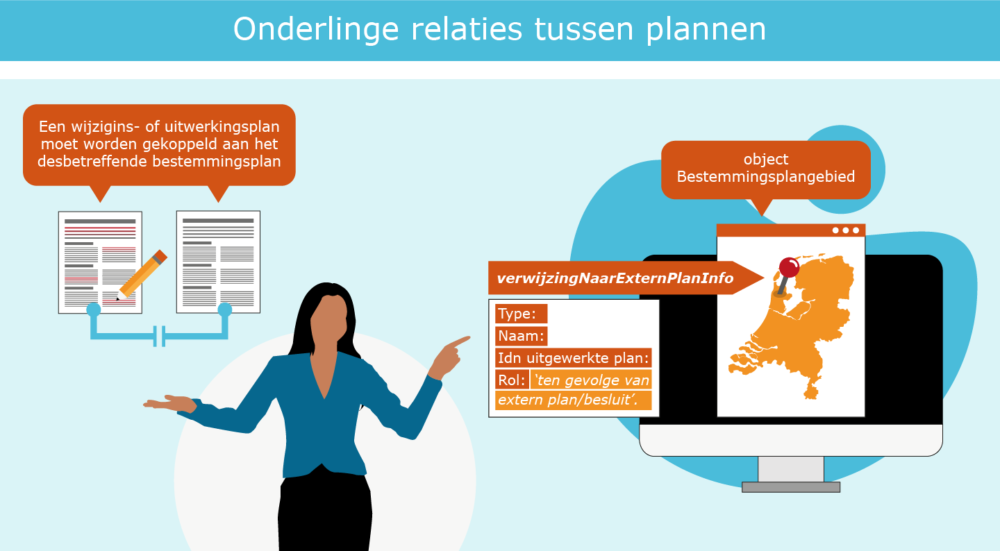

## Uitwerking foutherstel in de planvoorraad

**Het is belangrijk dat technische fouten in de planvoorraad door de bronhouder worden aangepast; technische fouten kunnen ertoe leiden dat plannen niet of onjuist worden weergegeven in de viewer van het Omgevingsloket.
Bronhouders kunnen via <i>‘Het kwaliteitsdashboard’</i> van het Kadaster hun planvoorraad zelf monitoren op de meest voorkomende fouten. Om toegang te krijgen tot het kwaliteitsdashboard dien je eerst in te loggen in het portaal van <a href='https://mijn.kadaster.nl/security/login?URL=https%3A%2F%2Fmijn.kadaster.nl%2Fdashboard&retry=no' target='_blank'>Mijn Kadaster</a>. Iedere bronhouder kent een zogenaamde “eerste beheerder” die deze toegang kan regelen.**

### Consistent gebruik planstatus en dossierstatus

Via het manifest van de bronhouder wordt de planvoorraad van het bevoegd gezag beschikbaar gesteld op Ruimtelijkeplannen.nl. In het manifest is ordening aangebracht met behulp van dossiers. In een dossier zijn één of meerdere ruimtelijke plannen opgenomen van dezelfde procedure. Ieder plan heeft een ‘planstatus’, daarnaast heeft het dossier waarin het plan zich bevindt een zogenaamde ‘dossierstatus’. Op basis van deze dossierstatus wordt bepaald in welke fase van de procedure een plan zich bevindt zoals bijvoorbeeld: ‘in voorbereiding’, ‘vastgesteld’ of ‘geheel onherroepelijk in werking’. 

De dossierstatus moet passend zijn met de status van het plan in het dossier. Voorbeeld: bevat een dossier uitsluitend een plan met de planstatus ‘concept’, ‘voorontwerp’ of ‘ontwerp’ dan is de dossierstatus ‘in voorbereiding’. Wijzigt de status van het plan in ‘vastgesteld’ dan zal door de bronhouder ook de status van het dossier moeten worden aangepast, eerst in ‘vastgesteld’, maar afhankelijk van het verloop van de procedure naar een volgende status. 

In bijlage 1 van de <a href='https://docs.geostandaarden.nl/ro/tri2012' target='_blank'>Praktijkrichtlijn Toegankelijkheid Ruimtelijke Instrumenten (PRTRI)</a> zijn de mogelijke dossierstatussen van ruimtelijke instrumenten beschreven. De verschillende dossierstatussen zijn omschreven in <a href='https://docs.geostandaarden.nl/ro/tri2012/#beschrijving-dossierstatussen-met-overgangen' target='_blank'>paragraaf 5.8</a> van de PRTRI2012, en de planstatussen in <a href='https://docs.geostandaarden.nl/ro/tri2012/#beschrijving-planstatussen' target='_blank'>paragraaf 5.7</a> van de PRTRI2012.
  
**Gevolgen in Viewer regels op de kaart van het DSO-LV**  
Onder meer op basis van de dossierstatus, wordt bepaald of het plan wel of niet op de juiste wijze zichtbaar is in de viewer van het DSO-LV. Bijvoorbeeld: wanneer een ‘vastgesteld’ plan in werkelijkheid ‘geheel onherroepelijk in werking’ is, maar de dossierstatus van dit plan staat nog op ‘in voorbereiding’, dan zal dit plan niet als ‘geldende regelgeving’ in het DSO worden getoond. Het is dus van groot belang dat de dossierstatus goed is. Uit monitoring blijkt echter dat met name dit type fout vaak voorkomt. Belangrijk dus om als bronhouder hier iets aan te doen.
  
</img>
  
Bovenstaande figuur maakt duidelijk wat de gevolgen zijn van een onjuiste dossierstatus/ planstatus is wanneer de gebruiker op Ruimtelijkeplannen.nl zoekt op adres, perceel of een geselecteerd gebied in de viewer.  
  
De meest voorkomende fouten zijn:  
<ol><li>Vastgestelde plannen (en/of onherroepelijk plannen IMRO2008) in een dossier dat op ‘in voorbereiding’ staat;</li>
<li>Vastgestelde plannen waarbij het dossier na de beroepstermijn op ‘vastgesteld’ blijft staan;</li>
<li>Plannen die geen beroep/bezwaartermijn kennen die dossierstatus 'vastgesteld' krijgen, waar dat 'geheel onherroepelijk in werking' moet zijn.</li>
</ol>  
  
<b>Wat te doen?</b>  
<ul><li>Pas de dossierstatus aan in het manifest. Let daarop dat de juiste dossierstatus gekozen wordt. </li>
<li>Het aanpassen van de dossierstatus is voor de bronhouder relatief eenvoudig. Aan het plan hoeft niets te worden gewijzigd. Uitsluitend het manifest wordt aangepast. </li>
<li>Let op bij de planstatus ‘vastgesteld’ wijzigt de plantstatus niet meer, maar alleen de dossierstatus. </li>
</ul>

### Beschikbaarheid van de planvoorraad

De planvoorraad op de weblocatie bij de bronhouder moet exact overeenkomen met de planvoorraad bij Ruimtelijkeplannen.nl. Dit is een wettelijke verplichting en de bronhouder is hiervoor verantwoordelijk. In de praktijk blijkt dit niet altijd op orde. Er doen zich verschillende situaties voor, die we hierna verder uitwerken:

<ol><li>Een plan staat wel in het manifest en daardoor ook op Ruimtelijkeplannen.nl, maar het plan (of planonderdelen) zijn niet beschikbaar bij de bronhouder.</li>
<li>Plan staat wel in het manifest en bij de bronhouder maar niet op Ruimtelijkeplannen.nl.</li>
<li>Er zitten inhoudelijk verschillende plannen in hetzelfde dossier.</li>
</ol>

#### Plan staat wel op Ruimtelijkeplannen.nl, maar is niet (of deels niet) beschikbaar bij de bronhouder
In het manifest van de bronhouder staan de locaties van alle door de bronhouder gepubliceerde plannen, in het geleideformulier bij het plan staan alle afzonderlijke planonderdelen. Ruimtelijkeplannen.nl maakt van dit manifest en deze geleideformulieren gebruik. Wanneer de bronhouder een plan publiceert, haalt Ruimtelijkeplannen.nl op deze locatie het plan op en plaatst het in de landelijke voorziening Ruimtelijkeplannen.nl en wordt het raadpleegbaar gemaakt via de viewer van de landelijke voorziening Ruimtelijkeplannen.nl. Met de <a href='https://www.ruimtelijkeplannen.nl/index' target='_blank'>index</a> wordt de URL naar de bronhouderlocatie beschikbaar gesteld. Eenieder kan nu via de index over het plan beschikken. De bronhouder voldoet zo aan de wettelijke eisen.

Wanneer, na het publiceren van het plan, de bronhouder het plan verwijdert of verplaatst, verandert de URL naar de locatie van het plan. Wanneer dit niet in het geleideformulier en het manifest wordt aangepast, blijft het plan wel raadpleegbaar via Ruimtelijkeplannen.nl, maar is het niet meer via de index beschikbaar. Hierdoor voldoet de bronhouder niet meer aan zijn verplichting van raadpleegbaarheid en beschikbaarheid. 
  
<b>Wat te doen?</b>  
Om er voor te zorgen dat het plan weer raadpleegbaar en beschikbaar is, kunnen twee werkwijzen worden gevolgd.

<ol><li><i>Het plan opnieuw publiceren</i> Hiervoor moet eerst het plan uit het manifest worden verwijderd. Ruimtelijkeplannen.nl zal het plan nu ook verwijderen. Het plan 24 uur later opnieuw waarmerken, valideren en publiceren. Om een plan met hetzelfde planidentificatienummer opnieuw te kunnen publiceren moet het minimaal 1 dag van Ruimtelijkeplannen.nl verwijderd zijn.</li>
<li><i>Terugplaatsen van de identieke gewaarmerkte versie</i> Hierbij wordt de identieke gewaarmerkte versie van het plan, waarvan de overige metadata zoals plandatum niet door de bronhouder wordt gewijzigd, teruggeplaatst naar de locatie zoals deze in het geleideformulier en het manifest is aangegeven.</li>
</ol>

#### Plan staat wel in het manifest en bij de bronhouder maar niet op Ruimtelijkeplannen.nl

Dit komt voor wanneer Ruimtelijkeplannen.nl het plan niet correct kan ophalen. De bronhouder ontvangt dan een bericht op het mailadres dat de bronhouder heeft opgegeven bij de index van Ruimtelijkeplannen.nl. Het betreft hier vaak een validatie probleem.
  
<b>Wat te doen?</b> Naar aanleiding van het bericht van Ruimtelijkeplannen.nl kan de bronhouder achterhalen wat de fout in het plan is. De bronhouder moet het plan aanpassen en opnieuw waarmerken, valideren en publiceren. Dit soort problemen kan ondervangen worden door het plan zelf eerst handmatig te valideren met de <a href='https://www.ruimtelijkeplannen.nl/validateplan' target='_blank'>validator van Ruimtelijkeplannen.nl</a>, en eventueel te publiceren in de pilot omgeving van Ruimtelijkeplannen.nl. 

Alle meldingen van Ruimtelijkeplannen.nl worden verstuurd naar het mailadres dat de bronhouder via de index heeft aangemeld bij het Kadaster. Het is belangrijk dat er regelmatig gecheckt wordt of dit mailadres nog actueel is en regelmatig gelezen wordt. Eventuele wijzigingen van contactpersonen bij de bronhouder, kunnen worden doorgegeven aan het Kadaster via het <a href='https://www.ruimtelijkeplannen.nl/web-roo/docs/bronhouders/Aanvraag_wijziging_Index.pdf' target='_blank'>wijzigingsformulier op de website van Ruimtelijkeplannen.nl.</a>

#### Inhoudelijk verschillende plannen zitten in hetzelfde dossier

Dit probleem komt zeer zelden voor, maar hier is sprake van een inhoudelijk probleem. Er zijn twee inhoudelijk verschillende plannen met hetzelfde dossiernummer vastgesteld en gepubliceerd. Het dossier bevat nu bijvoorbeeld twee ontwerpplannen van verschillende locaties.

<b>Wat te doen?</b> Het beste advies hierbij is om te kijken welk plan van toepassing is. Eén van de twee plannen zal er vervolgens uitgehaald moeten worden om deze in een nieuw dossier te plaatsen zodat deze een eigen dossiernummer krijgt.

### Foutief plantype

Wettelijk is vastgelegd welke plantypes welk bevoegd gezag kan en mag publiceren. Toch kan het voorkomen dat er per ongeluk plantypes worden gepubliceerd door een bevoegd gezag, die dit in feite niet mag. Dit komt omdat dit (nog) niet wordt afgevangen door de validator van Ruimtelijkeplannen.nl, en vraagt dus extra aandacht. Uit monitoring blijkt dat er een aantal gemeentelijke bronhouders zijn die per ongeluk een aanwijzingsbesluit hebben gepubliceerd terwijl dit een ander type besluit betreft. 
  
<b>Wat te doen?</b>

<ol><li>Verwijder het betreffende plan uit het manifest;</li>
<li>Controleer altijd, voordat een plan opnieuw wordt gepubliceerd, of het verwijderde plan ook daadwerkelijk van Ruimtelijkeplannen.nl verwijderd is;</li>
<li>Plantype aanpassen;</li>
<li>Opnieuw waarmerken, valideren en publiceren en een dag later weer aanbieden aan Ruimtelijkeplannen.nl, zie ook: [paragraaf 2.3](#uitvoeren-foutherstel).</li>
</ol>

### Relaties: Verwijzen naar extern plan

Relaties tussen plannen en relaties binnen plannen kunnen worden vastgelegd om zo beter inzicht te krijgen in de geldende regels op een locatie. Soms heeft dit een wettelijke grondslag, soms een praktische reden. Het helpt de planmaker maar ook de raadpleger van het plan om zo meer grip te krijgen op een geldige situatie op een locatie. Ook in de viewer van het DSO wordt gebruik gemaakt van deze relatie tussen plannen.

In de praktijk blijkt vaak dat er onvolledig een relatie wordt gelegd tussen plannen terwijl dit wel wordt voorgeschreven in het <a href='https://docs.geostandaarden.nl/ro/imro' target='_blank'>Informatiemodel Ruimtelijke Ordening Planteksten (IMRO2012)</a>. In hoofdstuk 4 van de <a href='https://docs.geostandaarden.nl/ro/bp2012/' target='_blank'>Praktijkrichtlijn Bestemmingsplannen 2012 (PRBP2012)</a> is toegelicht hoe om te gaan met de verwijzing naar extern plan van uitwerkingsplan, wijzigingsplan, gedeeltelijke herziening van 1 bestemmingsplan en gedeeltelijke herziening van meerdere bestemmingsplannen (parapluherziening).  
In hoofdstuk 5 van de <a href='https://docs.geostandaarden.nl/ro/gb2012/' target='_blank'>Praktijkrichtlijn Gebiedsgerichte Besluiten (PRGB2012)</a> is omschreven hoe om te gaan met de verwijzing naar extern plan van aanwijzing, beheersverordening, exploitatieplan, gerechtelijke uitspraak en omgevingsvergunning. 
  
<b>Wat te doen?</b>

<ol><li>Verwijder het betreffende plan uit het manifest;</li>
<li>Controleer altijd, voordat een plan opnieuw wordt gepubliceerd, of het verwijderde plan ook daadwerkelijk van Ruimtelijkeplannen.nl verwijderd is;</li>
<li>Pas het attribuut ‘verwijzingNaarExternPlanInfo’ aan;</li>
<li>Opnieuw waarmerken, valideren en publiceren en een dag later weer aanbieden aan Ruimtelijkeplannen.nl.</li>
</ol>
  

</img>  

### Naamgeving plannen (Chw en TAM)

<b>Crisis en herstelwet plannen (Chw)</b>  
Met het wijzigen van het Besluit Crisis- en herstelwet in mei 2014 (Stb. 2014, nr. 168) is het voor gemeenten mogelijk bestemmingsplannen (met verbrede reikwijdte) te maken waarmee onder andere kan worden afgeweken van een aantal met name genoemde onderdelen van de geldende wet- en regelgeving. Een van de aspecten waar gemeenten onder voorwaarden van af mogen wijken zijn de digitale aspecten met RO Standaarden en Ruimtelijkeplannen.nl. Om ervoor te zorgen dat deze plannen wel herkenbaar zijn is in de <a href='https://docs.geostandaarden.nl/ro/waCHWbp/' target='_blank'>werkafspraak Chw bestemmingsplannen digitaal beschikbaar stellen</a> onder andere vastgelegd dat de naamgeving van het plan moet beginnen met: <b>‘</b><b>Chw bestemmingsplan</b><b>’</b>. Wanneer u op dit moment een Chw bestemmingsplan heeft gepubliceerd zonder de juiste naamgeving, kunt u dit alsnog aanpassen. 
  
<b>Wat te doen?</b>  
<ol><li>Verwijder het betreffende plan uit het manifest;</li>
<li>Controleer altijd, voordat een plan opnieuw wordt gepubliceerd, of het verwijderde plan ook daadwerkelijk van Ruimtelijkeplannen.nl verwijderd is;</li>
<li>Pas de plannaam conform de werkafspraak aan;</li>
<li>Opnieuw waarmerken, valideren en publiceren en een dag later weer aanbieden aan Ruimtelijkeplannen.nl. </li></ol>  
 

<b>Tijdelijke Alternatieve Maatregel (TAM)</b>  
De tijdelijke alternatieve maatregelen (TAM) zijn sinds het in werking treden van de Omgevingswet een tijdelijk vangnet voor overheden en uitvoeringsorganisaties als zij nog niet via het hoofdspoor met de STOP/TPOD standaarden kunnen werken. De mogelijkheid tot inzet van de TAM zorgt er voor dat dringende trajecten in gebiedsontwikkeling ook na inwerkingtreding van de Omgevingswet kunnen doorgaan. Vaak zal een TAM nadelen of beperkingen hebben. Dat is onvermijdelijk en logisch. De reden om toch te werken met TAM is dat ze uiteindelijk bijdragen aan het werken met de Omgevingswet. 

Geonovum beheert de tijdelijke alternatieve maatregelen die worden aangeduid met TAM-IMRO voor zes type omgevingsdocumenten. Deze TAM's bieden overheden die dit nog niet kunnen doen met behulp van STOP/ TPOD de mogelijkheid om met TAM de omgevingsdocumenten alsnog te kunnen ontsluiten in het DSO. Deze TAM’s zijn voor het opstellen van omgevingsdocumenten op basis van de RO Standaarden 2012 (waar IMRO onder valt).

De volgende werkafspraken en andere documentatie zijn beschikbaar:  

<ul><li><a href='https://docs.geostandaarden.nl/ro/waTAMomplan/' target='_blank'>Werkafspraak TAM-omgevingsplan</a> en <a href='https://docs.geostandaarden.nl/ro/HRTAMomplan/' target='_blank'>bijbehorende technische handreiking</a> en de <a href='https://vng.nl/artikelen/bijsluiter-tam-imro-omgevingsplan-0' target='_blank'>VNG bijsluiter</a>;</li>
<li><a href='https://docs.geostandaarden.nl/ro/waTAMomver/' target='_blank'>Werkafspraak TAM-omgevingsverordening</a> en <a href='https://docs.geostandaarden.nl/ro/HRTAMomver/' target='_blank'>bijbehorende technische handreiking</a>;</li>
<li><a href='https://docs.geostandaarden.nl/ro/waTAMvbbesluit/' target='_blank'>Werkafspraak TAM-voorbereidingsbesluit</a> en voor gemeenten de <a href='https://vng.nl/artikelen/bijsluiter-tam-voorbereidingsbesluit' target='_blank'>VNG bijsluiter</a>;</li>
<li><a href='https://docs.geostandaarden.nl/ro/waTAMpbesluit/' target='_blank'>Werkafspraak TAM-projectbesluit</a> en <a href='https://docs.geostandaarden.nl/ro/HRTAMpbesluit' target='_blank'>bijbehorende technische handreiking</a>;</li>
<li><a href='https://docs.geostandaarden.nl/ro/waTAMreaint/' target='_blank'>Werkafspraak TAM-reactieve interventie</a>;</li>
<li><a href='https://docs.geostandaarden.nl/ro/waTAMinstr/' target='_blank'>Werkafspraak TAM-instructie</a>.</li>
</ul>

Meer informatie over de TAM leest u op de <a href='https://www.geonovum.nl/geo-standaarden/omgevingswet/tam/' target='_blank'>Geonovum website</a> en de <a href='https://aandeslagmetdeomgevingswet.nl/implementatie/digitaal-stelsel/tam/' target='_blank'>weer te geven tekst</a>website Aan de Slag met de Omgevingswet.

### AVG-Proof

Op grond van de Algemene verordening gegevensbescherming (<a href='https://www.rijksoverheid.nl/onderwerpen/privacy-en-persoonsgegevens' target='_blank'>AVG</a>) wordt het afgeraden persoonsgegevens elektronisch beschikbaar te stellen, i.e. op internet te publiceren. Inspraak- of zienswijzennota’s, raadsbesluiten of in de toelichting opgenomen persoonsgegevens moeten voor publicatie geanonimiseerd worden. Dat betekent dat naam-, adres- en woonplaatsgegevens van natuurlijke personen verwijderd of machinaal onleesbaar gemaakt moeten worden. Gegevens mogen niet worden verwerkt tenzij er ten minste één wettelijke basis is om dit te doen. De bronhouder is verantwoordelijk voor deze afweging. Mocht na publicatie van het plan blijken dat er op grond van de AVG onderdelen van het plan alsnog geanonimiseerd moeten worden, dan wordt dit als technische aanpassing beschouwd. 
  
<b>Wat te doen?</b>

<ul><li>Verwijder het betreffende plan uit het manifest;</li>
<li>Controleer altijd, voordat een plan opnieuw wordt gepubliceerd, of het verwijderde plan ook daadwerkelijk van Ruimtelijkeplannen.nl verwijderd is;</li>
<li>Anonimiseer het betreffende onderdeel van het plan;</li>
<li>Planversienummer niet aanpassen/ophogen;</li>
<li>Opnieuw waarmerken, valideren en publiceren en een dag later weer aanbieden aan Ruimtelijkeplannen.nl. </li>
</ul>  
  
We gaan er vanuit dat alle plannen op Ruimtelijkeplannen.nl voldoen aan de AVG, mocht dit niet zo zijn dan adviseren wij u om dit ruim voor inwerkingtreden Omgevingswet, alsnog aan te passen. Wanneer het toch noodzakelijk is om na in werking treden Omgevingswet foutherstel in het kader van de AVG door te voeren, houdt dan rekening met de relatie met tijdreizen, zie [paragraaf 2.3](#relatie-met-tijdreizen).  
  
***Voorbeeld***:  
De Omgevingswet is van kracht en tijdreizen in het DSO is mogelijk. U constateert dat er een Wro plan in de planvoorraad staat dat persoonsgegevens bevat. U kunt het plan dan aanpassen en onder hetzelfde versie nummer weer publiceren.  
Echter, stel dat dit plan niet meer actueel is en u wilt het plan in plaats van aan te passen liever verwijderen, dan adviseren wij toch om het plan eerst te anonimiseren en opnieuw te publiceren en pas daarna te verwijderen. Hiermee wordt voorkomen dat middels tijdreizen alsnog de persoonsgegevens vindbaar zijn. 
