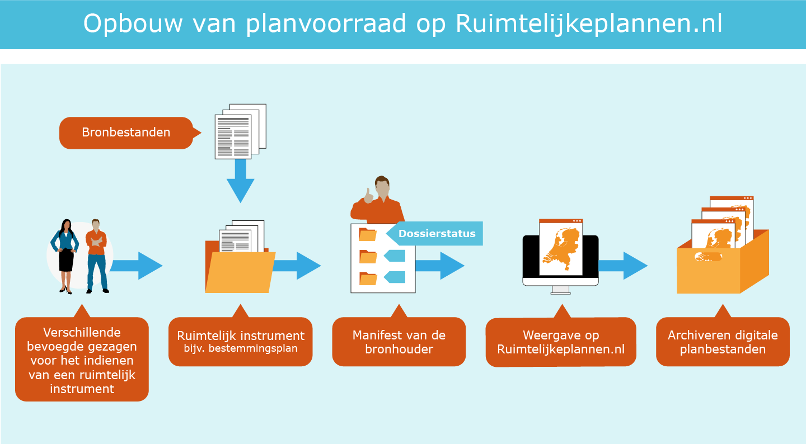

## De planvoorraad opschonen

**Gemeenten, provincies en het rijk maken met behulp van een manifest via de index van Ruimtelijkeplannen.nl inzichtelijk welke ruimtelijke plannen beschikbaar gesteld worden. In dit hoofdstuk gaan we in op de verschillende manieren om de planvoorraad op te schonen.**

### Opschonen van de planvoorraad

Ieder ruimtelijk instrument is opgebouwd uit een samenhangende set bronbestanden. Via het manifest van de bronhouder wordt de planvoorraad van het bevoegd gezag beschikbaar gesteld op Ruimtelijkeplannen.nl. De huidige planvoorraad op Ruimtelijkeplannen.nl is niet alleen veel data, het is ook een verzameling aan actuele en vervallen planversies door elkaar. Om deze data zo goed mogelijk te kunnen ontsluiten via het Informatiehuis Ruimte (IHR) met behulp van de overbruggingsfunctie naar het Omgevingsloket van het Digitaal Stelsel Omgevingswet, adviseren wij om de planvoorraad voor inwerkingtreden Omgevingswet op te schonen en alleen de meest actuele planversie te laten staan. Bij inwerkingtreding van de Omgevingswet ontstaat zo een beter beeld van de geldende plannen.  
In dit hoofdstuk lichten we toe hoe de Wro planvoorraad zo optimaal mogelijk opgeschoond kan worden. Zodat deze zo goed mogelijk ontsloten kan worden in het DSO.  
Let wel, het is een separate wettelijke verplichting van de bronhouder om alle versies van een plan te archiveren en beschikbaar te hebben in een digitaal archief van de bronhouder, de landelijke voorziening voorziet hier niet in. 

</img>  

### Opschonen planversies na onherroepelijk worden van een plan

De bronbestanden van iedere beschikbaar gestelde versie van een ruimtelijk instrument blijven toegankelijk totdat een instrument onherroepelijk in werking is getreden of is vervallen. Dit is vastgelegd in het <a href='http://wetten.overheid.nl/BWBR0023798' target='_blank'>Besluit ruimtelijke ordening (Bro)</a>. Wanneer het instrument eenmaal onherroepelijk is, mogen de oudere versies, zoals (voor)ontwerp en eventueel eerder vastgestelde versies, verwijderd worden uit het manifest en van Ruimtelijkeplannen.nl. Wanneer het instrument vervallen is, mag het in zijn geheel verwijderd worden. Vanuit de RO Standaarden geldt hiervoor geen verplichting maar om de gegevens straks zo goed mogelijk te kunnen ontsluiten via het Informatiehuis Ruimte, adviseren wij wel om de planvoorraad op te schonen en alleen de onherroepelijke (geldende) versie te laten staan.

Voor het verwijderen van plannen en/of volledige dossiers kan het gaan om de volgende stukken:

<ol><li>Oudere versies, concepten, voorontwerpen, ontwerpen van plannen waarvan de procedure inmiddels is afgerond of de procedure vroegtijdig is beëindigd;</li>
<li>Verouderde voorbereidingsbesluiten (ouder dan 1 jaar);</li>
<li>Vervallen plannen en dossiers, bijvoorbeeld het plan is inmiddels geactualiseerd of vergunningen die inmiddels verwerkt zijn in een bestemmingsplan;</li>
<li>Plancontour & PDF Plannen (PCP) en IMRO2006 plannen die inmiddels zijn vervangen door nieuwere plannen.</li>
</ol>  

**Wat te doen?**  
Bij het verwijderen van een plan, kan deze uit het 2006 manifest worden verwijderd, het betreffende plan zal dan ook verwijderd worden van Ruimtelijkplannen.nl. In het geval door de bronhouder het laatste plan en daarmee het gehele 2006 manifest wil verwijderen, moet dit in samenwerking met het Kadaster worden gedaan. Neem hiervoor contact op met het Kadaster via het <a href='https://www.ruimtelijkeplannen.nl/web-roo/docs/bronhouders/Aanvraag_wijziging_Index.pdf' target='_blank'>wijzigingsformulier op de website van Ruimtelijkeplannen.nl.</a>

Wanneer de bronhouder een dossier wil verwijderen uit de planvoorraad zijn er binnen de RO Standaarden 3 opties.

<ol><li><b>Het Dossier de status ‘vervallen’ geven</b> Door het dossier de status ‘vervallen’ te geven worden de plannen niet echt verwijderd uit de database van Ruimtelijkeplannen.nl. De plannen die zich in dit ‘vervallen’ dossier bevinden zijn alleen niet meer zichtbaar in de viewer van Ruimtelijkeplannen.nl. Wanneer een gebruiker op een andere wijze gebruik maakt van de data van Ruimtelijkeplannen.nl, bijvoorbeeld via de services, dan zijn deze plannen gewoon beschikbaar. Het dossier en de plannen die daarin staan hebben alleen een label ‘historisch’ meegekregen. Aan individuele planversies kan geen planstatus ‘vervallen’ meegegeven worden.  Wanneer een dossier op vervallen wordt gezet blijft het in het manifest aanwezig, inclusief de URL naar de weblocatie van de bronhouder waar het plan beschikbaar is. Het is dan ook van belang dat het plan op de weblocatie van de bronhouder beschikbaar blijft. Dit is een belangrijk verschil met het echt fysiek verwijderen van plannen. Deze plannen worden wel ontsloten in het DSO en zijn vindbaar op naam en op planidentificatienummer. Of dit wenselijk is, is aan de bronhouder.</li>
<li><b>Het Dossier daadwerkelijk verwijderen uit het manifest en van Ruimtelijkeplannen.nl</b> Bij deze werkwijze verwijdert de bronhouder de oude/vervallen plannen (en het dossier) uit het manifest. Ruimtelijkeplannen.nl zal de plannen nu ook daadwerkelijk uit de database verwijderen. De plannen zijn niet meer raadpleegbaar via Ruimtelijkeplannen.nl en niet meer beschikbaar via de index. De plannen zijn nu ook niet meer beschikbaar via de services van Ruimtelijkeplannen.nl. Voorwaarde is dat de bronhouder dit ruim en dus tijdig voor inwerkingtreden van de Omgevingswet uitvoert. </li>
<li><b>In het manifest het 2008 plan merkeren als historisch</b> Door het plan als historisch te markeren is dit vergelijkbaar met plannen in een 'vervallen’ dossier: het plan is wel opgenomen in de database van Ruimtelijkeplannen.nl maar niet zichtbaar in de viewer van Ruimtelijkeplannen.nl. Al deze plannen worden opgenomen in de planvoorraad van IHR en ontsloten via het Omgevingsloket van het DSO.</li> 
</ol>

Gelet op de huidige ontwikkelingen, de voorbereiding op de Omgevingswet en de ontsluiting van de plannen via het Informatiehuis Ruimte in het DSO, is het advies om de oude versies, en vervallen plannen daadwerkelijk te <i>verwijderen</i> uit het manifest. Het is onder de Wro nooit de bedoeling geweest om Ruimtelijkeplannen.nl als archief te gebruiken (zie <a href='https://docs.geostandaarden.nl/ro/arp/' target='_blank'>handreiking Archiveren ruimtelijke plannen</a>). Zorg daarbij wel dat officiële planversies digitaal gearchiveerd worden in een gemeentelijk archiefsysteem. Een bronhouder blijft altijd zelf verantwoordelijk voor het archiveren van de data. 

### Toepassen van Plancontour & PDF plannen

Met het <a href='https://zoek.officielebekendmakingen.nl/kst-34666-2.html?zoekcriteria=%3fzkt%3dUitgebreid%26pst%3dParlementaireDocumenten%26dpr%3dAlle%26spd%3d20170210%26epd%3d20170210%26dosnr%3d34666%26kmr%3dEersteKamerderStatenGeneraal%257cTweedeKamerderStatenGeneraal%257cVerenigdeVergaderingderStatenGeneraal%26sdt%3dKenmerkendeDatum%26par%3dAgenda%257cHandeling%257cKamerstuk%257cAanhangsel%2bvan%2bde%2bHandelingen%257cKamervragen%2bzonder%2bantwoord%257cNiet-dossierstuk%257cBijlage%26dst%3dOnopgemaakt%257cOpgemaakt%257cOpgemaakt%2bna%2bonopgemaakt%26isp%3dtrue%26pnr%3d1%26rpp%3d10&resultIndex=1&sorttype=1&sortorder=4' target='_blank'>wetsvoorstel voor het vervallen van de actualiseringsplicht van bestemmingsplannen, inpassingsplannen en beheersplannen</a> wordt beoogd om extra ruimte te scheppen voor gemeenten. De wetswijziging van de Wro geldt voor die plannen die ‘elektronisch raadpleegbaar’ zijn via Ruimtelijkeplannen.nl. Voor een plan dat niet op de website staat blijft actualiseringsplicht dus nog van toepassing.  
In de <a href='https://zoek.officielebekendmakingen.nl/kst-34666-3.html?zoekcriteria=%3fzkt%3dUitgebreid%26pst%3dParlementaireDocumenten%26dpr%3dAlle%26spd%3d20170210%26epd%3d20170210%26dosnr%3d34666%26kmr%3dEersteKamerderStatenGeneraal%257cTweedeKamerderStatenGeneraal%257cVerenigdeVergaderingderStatenGeneraal%26sdt%3dKenmerkendeDatum%26par%3dAgenda%257cHandeling%257cKamerstuk%257cAanhangsel%2bvan%2bde%2bHandelingen%257cKamervragen%2bzonder%2bantwoord%257cNiet-dossierstuk%257cBijlage%26dst%3dOnopgemaakt%257cOpgemaakt%257cOpgemaakt%2bna%2bonopgemaakt%26isp%3dtrue%26pnr%3d1%26rpp%3d10&resultIndex=0&sorttype=1&sortorder=4' target='_blank'>toelichting op het wetsvoorstel</a> wordt aangegeven dat een papieren (analoog) plan ook digitaal raadpleegbaar kan zijn als het als pdf-bestand op de website wordt gezet. Voor deze plannen geldt wel dat de analoge plannen de juridisch leidende plannen zijn.  
Dit houdt in dat de actualiseringsplicht niet alleen vervalt voor de wettelijke digitale plannen (op basis van IMRO2008 en IMRO2012) maar ook voor plannen op basis van IMRO2006 (facultatieve standaard) en analoge plannen die door middel van een Plancontour & PDF (PRPCP2008) via de landelijke voorziening Ruimtelijkeplannen.nl zijn ontsloten. Het blijft verstandig om te actualiseren en digitaliseren volgens de laatste standaarden om zo de data op orde te blijven brengen richting de Omgevingswet.

Bij het plaatsen van een Plancontour & PDF plan wordt vaak de contour van het hele analoge plan gepubliceerd op Ruimtelijkeplannen.nl. Dit is niet noodzakelijk. Vaak zijn grote plannen in de loop der jaren gedeeltelijk vervangen door digitaal raadpleegbare plannen op basis van de RO Standaarden 2012. Om de raadpleegbaarheid en leesbaarheid van de plannen zo optimaal mogelijk te laten zijn is het verstandig om als bronhouder te bepalen voor welke locatie een analoog plan nog geldig is. Bovendien geeft het voor de interne organisatie een goed beeld van de plangebieden die nog niet geactualiseerd en gedigitaliseerd zijn. Hou er rekening mee dat niet alleen het vigerend bestemmingsplan gepubliceerd wordt als Plancontour & PDF plan, maar ook alle eventuele wijzigings- en uitwerkingsplannen die op basis van dit plan zijn gemaakt.

<b>Wat te doen?</b> Bekijk per analoog plan welk gedeelte hiervan nog geldig is. <i>Zorg dat de contour van het te publiceren plan als plancontour alleen dat gedeelte bevat dat geldig is</i>. Dit kunnen meerdere contouren in één plangebied zijn. Zorg hierbij tevens dat op de pdf-plankaart door middel van een duidelijke lijn is aangegeven om welk(e) gebied(en) het gaat. Let bij het publiceren van een ‘oud’ plan dat de datum van dit plan de (oude) vaststellingsdatum is. 

