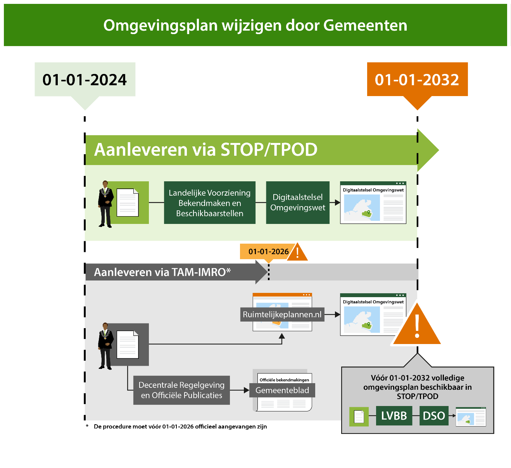

# TAM omgevingsplan  {#5221ABF7}
Sinds het inwerkingtreden van de Omgevingswet zijn door gemeente zijn ook wijzigingsbesluiten op het omgevingsplan genomen met behulp van de <a href='https://www.geonovum.nl/geo-standaarden/omgevingswet/tam' target='_blank'>tijdelijke alternatieve maatregelen</a>. Het omgevingsplan moet <a href='https://omgevingswet.vng.nl/grip/omgevingsplan/systematiek-en-structuur/' target='_blank'>juridisch</a> voldoen aan de Omgevingswet. Technisch gezien worden deze wijzigingsbesluiten op het omgevingsplan via het oude spoor in Ruimtelijkeplannen.nl beschikbaar gesteld en vervolgens automatisch ontsloten in het <a href='https://omgevingswet.overheid.nl/home' target='_blank'>Omgevingsloket</a>.
<figure id='d4e1745'></img>
<figcaption>Omgevingsplan conform TPOD-standaarden of TAM</figcaption></figure>
 

Het is tot 1 januari 2026 mogelijk om op basis van <a href='https://wetten.overheid.nl/BWBR0045037/2025-01-01' target='_blank'>artikel 11 lid 1 van het Besluit elektronische publicaties</a>, met behulp van de RO Standaarden, de landelijke voorziening Ruimtelijkplannen.nl en <a href='https://www.koopoverheid.nl/voor-overheden/gemeenten-provincies-en-waterschappen/drop' target='_blank'>DROP</a> een ontwerp omgevingsplan wijziging op basis van <a href='https://www.geonovum.nl/geo-standaarden/omgevingswet/tam' target='_blank'>TAM</a> te publiceren. Voor het maken van een dergelijk TAM-omgevingsplan wordt onder strikte voorwaarden gebruik gemaakt van de Wro planfiguur ‘bestemmingsplan’ conform de RO Standaarden 2012. De naam van het wijzigingsbesluit moet op de volgende manier zijn geschreven:  <b>TAM-omgevingsplan[spatie][plannaam]</b>
De werkwijze voor het maken van een TAM-omgevingsplan met behulp van de Wro-plansoftware is vastgelegd in een <a href='https://docs.geostandaarden.nl/ro/waTAMomplan/' target='_blank'><u>werkafspraak</u></a> en een <a href='https://docs.geostandaarden.nl/ro/HRTAMomplan/' target='_blank'><u>technische handreiking</u></a>.
 
 
Het TAM-omgevingsplan moet door de gemeente voor 1 januari 2032 technisch onderdeel worden van het omgevingsplan conform de TPOD-standaarden. Ook moet het TAM-omgevingsplan voor die datum zijn verwijderd van Ruimtelijkeplannen.nl.
 
 
<b>Samengevat: </b>
<ul><li>Heeft de gemeente TAM-omgevingsplannen op Ruimtelijkeplannen.nl staan?<ul><li>zoek in de viewer van <a href='https://www.ruimtelijkeplannen.nl/view' target='_blank'>Ruimtelijkeplannen.nl</a> onder ‘Zoek op plannaam of -nummer’ en type TAM in,</li>
<li>bij ‘Zoek op kenmerken’ op ‘eigenaar’ en</li>
<li>op ‘plantype’ bestemmingsplan om dit te controleren.</li>
</ul>
</li>
<li>Uiterlijk eind 2031 heeft de gemeente een omgevingsplan dat voldoet aan de vereisten van de Omgevingswet en dat is opgesteld en beschikbaar gesteld conform de <a href='https://docs.geostandaarden.nl/tpod/def-st-TPOD-OP-20231215/' target='_blank'>TPOD-standaarden</a>.</li>
<li>Alle TAM-omgevingsplannen die ontsloten zijn met behulp van de Wro-plansoftware zijn uiterlijk eind 2031:<ul><li>door de gemeente conform de <a href='https://docs.geostandaarden.nl/tpod/def-st-TPOD-OP-20231215/' target='_blank'>TPOD-standaarden</a> opgenomen in het niet-tijdelijk deel van het omgevingsplan;</li>
<li>door de gemeente uit het gemeentelijke <a href='https://www.ruimtelijkeplannen.nl/index' target='_blank'>manifest</a> en daardoor van Ruimtelijkeplannen.nl <a href='https://docs.geostandaarden.nl/ro/tri2012/' target='_blank'>verwijderd</a>.</li>
</ul>
</li>
</ul>