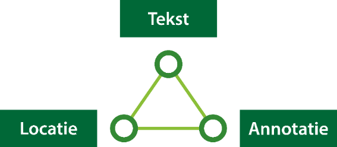

## Omgevingsplan

### Technische uitgangspunten

De kern van het gebruik van de TAM-omgevingsplan is, dat vanaf inwerkingtreding van de Omgevingswet, de bestaande Wro planketen gebruikt kan worden voor het beschibaarstellen van een wijziging van het omgevingsplan. De RO Standaarden 2012 worden niet aangepast. Ook wordt op geen enkele manier iets aangepast aan de Wro plansoftware die wordt gebruikt voor digitale ruimtelijke plannen. Ook aan de manier van publiceren naar Ruimtelijkeplannen.nl verandert niets. Wel wordt de validator voor Ruimtelijkeplannen.nl aangevuld en enigszins aangepast om het overgangsrecht van Wro naar Omgevingswet te faciliteren, en de TAM-omgevingsplan mogelijk te maken.

Het gebruik van de TAM-omgevingsplan ligt technisch in het verlengde van het overgangsrecht. Een Wro bestemmingsplan dat in ontwerp is gepubliceerd vóór inwerkingtreding van de Omgevingswet kan onder het oude recht en de oude standaarden worden afgerond onder de Omgevingswet. Dat betekent dat na inwerkingtreding van de Omgevingswet een bestemmingsplan met planstatus vastgesteld gepubliceerd kan worden via Ruimtelijkplannen.nl en onderdeel wordt van het tijdelijk deel omgevingsplan. Een bestemmingsplan met planstatus ontwerp wordt na inwerkingtreding van de Omgevingswet door Ruimtelijkeplannen.nl geweigerd. 

De validator moet een TAM-omgevingsplan kunnen herkennen om een ontwerpversie wel door te laten ná inwerkingtreding. Daarom is in de werkafspraak bepaald dat de plannaam begint met “TAM-omgevingsplan”, gevolgd door een spatie en de naam van het plan. Hiermee wordt het onderscheid gemaakt tussen een Wro bestemmingsplan onder het overgangsrecht, en een omgevingsdocument op basis van TAM-omgevingsplan.
Om een omgevingsdocument te kunnen opstellen met behulp van de TAM-omgevingsplan wordt uitsluitend gebruik gemaakt van de Wro planfiguur ‘bestemmingsplan’. Overige Wro planfiguren zullen geweigerd worden tenzij ze vallen onder het overgangsrecht.

Een TAM-omgevingsplan komt technisch terecht in het tijdelijk deel van het omgevingsplan, waar zich ook de digitale bestemmingsplannen bevinden die van rechtswege omgevingsplan zijn geworden na inwerkingtreding. Juridisch is een TAM-omgevingsplan een echt omgevingsdocument, want het besluit is genomen onder de Omgevingswet. Dat betekent dat de TAM-omgevingsplan uiteindelijk door de gemeente omgezet zal moeten worden naar STOP/TPOD, om ook technisch onderdeel te kunnen worden van het omgevingsplan. Het gebruik van TAM-omgevingsplan houdt dus altijd extra werk in de toekomst in. Dit gegeven moet mee worden genomen bij de afweging over het al dan niet gebruiken van de werkafspraak TAM-omgevingsplan.

### Gebruik IMRO

#### Objectkeuze 

Om een TAM-omgevingsplan te maken kan binnen het planfiguur ‘bestemmingsplan’ in principe gebruik worden gemaakt van alle objecten (enkelbestemming, dubbelbestemming, functieaanduiding, maatvoering, etc.) die beschikbaar zijn voor een bestemmingsplan. Belangrijk is te bedenken dat een TAM-omgevingsplan technisch moet voldoen aan IMRO2012 en de SVBP2012 om door de validator te kunnen komen. Concreet betekent dat ook dat er een object ‘plangebied’ moet zijn met de plangegevens van het besluit. 

In principe is een omgevingsplan vormvrij. De gemeente bepaalt binnen zekere grenzen hoe een omgevingsplan wordt opgebouwd. Toch is het niet in lijn met de Omgevingswetgedachte om te blijven werken met de Wro-objecten als enkelbestemming en dubbelbestemming, daar waar een TAM-omgevingsplan objecten als activiteiten, functies, andere gebiedsaanwijzingen en omgevingsnormen verwacht. Daarnaast gaat de STOP/TPOD standaard uit van een koppeling van een werkingsgebied (locatie) aan elke regeltekst. Om die reden wordt geadviseerd om binnen TAM-omgevingsplan gebruik te maken van die IMRO-objecten die een directe koppeling hebben met een regeltekst:

<ul><li>Enkelbestemming;</li>
<li>Dubbelbestemming;</li>
<li>Gebiedsaanduiding.</li>
</ul>

<figure> 
</img>
<figcaption>Koppeling tussen regeltekst en Locatie (werkingsgebied) zoals deze wordt gebruik in de STOP/ TPOD standaard</figcaption>
</figure>

Voor het object ‘omgevingsnorm’ uit STOP/TPOD kan gebruik worden gemaakt van het IMRO-object ‘maatvoering’. Deze heeft weliswaar geen koppeling met de tekst maar lijkt het meest op de omgevingsnorm. Let er op dat maatvoeringen maar beperkt kunnen worden uitgebreid.

#### TAM-omgevingsplan

In principe is het mogelijk een omgevingsplan zoveel mogelijk na te bootsen met behulp van IMRO2012. Het is uiteraard aan de gemeente om daar inhoudelijk vorm aan te geven. In deze paragraaf geven we een aantal suggesties hoe een TAM-omgevingsplan gemaakt zou kunnen worden met behulp van de bestemmingsplan-objecten uit het IMRO. We willen hier uitdrukkelijk aangeven dat het om <u>voorbeelden</u> gaat en dat het eenieder vrij staat om binnen de mogelijkheden van het IMRO hier op eigen wijze invulling aan te geven.

Aangeraden wordt om alleen IMRO-objecten met een directe koppeling met plantekst te gebruiken. Dat zorgt voor een directe relatie tussen juridische regel straks in het omgevingsplan, en het bijbehorende werkingsgebied op de kaart. 

De meeste Wro plansoftware werkt met een <a href='https://ro-standaarden.geonovum.nl/2012/IMRO/1.2/IMRO2012-v1.2.pdf' target='_blank'>IMRO2012</a> bibliotheek waarin standaard de <a href='https://ro-standaarden.geonovum.nl/2012/SVBP/1.3/SVBP2012-v1.3.1.pdf' target='_blank'>SVBP2012</a> is geïmplementeerd. Aangeraden wordt om deze bibliotheek te kopiëren, en in de kopie de wijzigingen aan te brengen waarmee een TAM-omgevingsplan gemaakt gaat worden. Dit omdat er nog enige tijd gewerkt moet kunnen worden aan Wro bestemmingsplannen, en mogelijk tegelijkertijd aan een TAM-omgevingsplan. 

<b><i>Plangebied</i></b>

Een omgevingsdocument kent geen object ‘plangebied’. Voor de validatie is het wel noodzakelijk om een plangebied op te nemen. De onderdelen van de wijziging van het omgevingsplan worden dan gekoppeld aan dit plangebied. Voor de motivering van het wijzigingsbesluit kan gebruik gemaakt worden van het object ‘toelichting’. De toelichting, regels en eventuele bijlagen worden gekoppeld aan het plangebied. Hiermee kan voldaan worden aan de noodzakelijk onderdelen van de wijziging van het omgevingsplan en tevens aan de randvoorwaarden ten behoeve van de validatie door Ruimtelijkeplannen.nl.

<b><i>Gebiedsaanwijzing van het type Functie</i></b>

Als de gemeente er voor kiest gebruik te maken van de gebiedsaanwijzing ‘functie’ onder de Omgevingswet dan kunnen die bijvoorbeeld middels ‘enkelbestemmingen’ worden gemodelleerd. De keuze is daarbij of de bestaande enkelbestemmingen worden gebruikt, bijvoorbeeld ‘Wonen’, of dat enkelbestemmingen worden toegevoegd: elke functiebenaming is toegestaan in het omgevingsplan. IMRO staat het uitbreiden van de enkelbestemmingen toe mits ze voldoen aan de vereisten van de SVBP2012. Een nieuw bestemming/functie wordt dan aangemaakt in de Wro plansoftware, waarbij een hoofdgroep moet worden gekozen, en de naam van de hoofdgroep moet terugkomen in de naam van de bestemming/functie. De naam na de hoofdgroep is geheel vrij te kiezen. De structuur voor de eigen benamingen is, conform de SVBP2012:

<i>Naam hoofdgroep [spatie] [-] [spatie] Specificatie van de bestemming</i>

De eigen benaming na de hoofdgroep en het koppelteken begint altijd met een hoofdletter. Voorbeelden van functiebenamingen kunnen zijn:
<ul><li>Detailhandel – Kernwinkelgebied;</li>
<li>Verkeer – Stroomgebied;</li>
<li>Water – Oppervlaktewater.</li>
</ul>
De benaming na het koppelteken is vrij te kiezen en zou ook het woord ‘Functie’ mogen bevatten voor de eigenlijke benaming: Verkeer – Functie stroomgebied.

Het gebruik van een hoofdgroep is verplicht en kan gebruikt worden om de kaartweergave te sturen. In de viewer Regels op de Kaart zal het TAM-omgevingsplan in dezelfde kleuren worden getoond als een bestemmingsplan. In de bovenstaande voorbeelden; donkerroze voor Kernwinkelgebied, donkergrijs voor Stroomgebied en blauw voor Oppervlaktewater.

Omdat het noodzakelijk is de naam van de hoofdgroep op te nemen in de naam van de functie, ligt het voor de hand inhoudelijke logische hoofdgroepen te kiezen, waardoor dan ook de kleur wordt bepaald. Als die logica er niet is (en dat zal voor een omgevingsplan vaak voorkomen) dan kan gebruik worden gemaakt van de hoofdgroep ‘Overig’. Dat biedt alle ruimte voor eigen toevoegingen. Alle functies die met ‘Overig' zijn gemodelleerd, worden dan wel in dezelfde lichtgrijze kleur getoond. Voor de hoofdgroep ‘Overig’ geldt dat de naam van de hoofdgroep niet hoeft te worden opgenomen in de nieuwe benaming, conform de SVBP2012:

<i>Specificatie van de bestemming</i>

Voorbeelden hiervan kunnen zijn:
<ul><li>Herstructureringsgebied</li>
<li>Transformatiegebied</li>
</ul>

Voor een TAM-omgevingsplan geldt dat locaties naar believen mogen worden gestapeld en/of overlappen, en ook niet verplicht het hele plangebied moeten afdekken. Het is immers geen bestemmingsplan maar een omgevingsplan. Hoewel dit bij enkelbestemmingen onder de Wro niet mag, staat de validator van Ruimtelijkplannen.nl dit wel toe. Het planobject ‘enkelbestemming’ kan dus gestapeld worden gebruikt ten behoeve van het modeleren van het TAM-omgevingsplan

<b><i>Andersoortige gebiedsaanwijzingen</i></b>

Als de gemeente er voor kiest ook andersoortige gebiedsaanwijzingen te gebruiken die mogelijk zijn in het omgevingsplan, dan kan daarvoor bij een TAM-omgevingsplan bijvoorbeeld gebruik worden gemaakt van het object ‘dubbelbestemming’. Dit werkt op identieke wijze als hiervoor beschreven bij functies, ook in de naamgeving. Dubbelbestemmingen kennen slechts drie hoofdgroepen, en er is geen hoofdgroep ‘Overig’.
Voorbeelden hiervan kunnen zijn:
<ul><li>Waarde – Gemeentelijk beschermd stadsgezicht;</li>
<li>Waarde – Historische kelders;</li>
<li>Waarde – Welstand.</li>
</ul>
Dubbelbestemmingen konden en mochten volgens IMRO2012 en SVBP2012 altijd al gestapeld, en/of overlappend gebruikt worden, en zijn daarmee ook prima inzetbaar om een TAM-omgevingsplan vorm te geven.

Meer sectoraal gerichte gebiedsaanwijzingen (geluid, geur, etc.) kunnen goed worden gemodelleerd met behulp van het object ‘gebiedsaanduiding’. Deze werden al gebruikt voor sectorale toepassingen in bestemmingsplannen en hebben daardoor hoofdgroepen waar gebiedsaanwijzingen onder te brengen zijn. De naamgeving moet voldoen aan de SVBP2012:

<i>Hoofdgroep [spatie] [-] [spatie] specificatie van de aanduiding</i>

(let op het gebruik van kleine letter in plaats van hoofdletter!)

Voorbeelden hiervan kunnen zijn:
<ul><li>geluidzone – geluidaandachtgebied centrum;</li>
<li>geurzone – geurbelastingsgebied Westervoortsedijk;</li>
<li>vrijwaringszone – spoorgebied Centraal Station Westzijde.</li>
</ul>
Ook voor gebiedsaanduidingen geldt dat deze altijd al gestapeld, en/of overlappend gebruikt konden en mochten worden volgens IMRO2012 en SVBP2012 Daarmee zijn prima inzetbaar om een TAM-omgevingsplan vorm te geven.

<b><i>Activiteiten</i></b>

Uit de Omgevingswet lijkt te volgen dat activiteiten wel als centraal onderdeel van een omgevingsplan moeten worden opgenomen. Dat geldt daarmee dan ook voor een TAM-omgevingsplan. Activiteiten zijn typisch objecten die we niet kennen in Wro bestemmingsplannen. In de basis gaat het weer over een regeltekst met een activiteit, die daarmee verplicht moet worden voorzien van een locatie (werkingsgebied). Omdat activiteiten wellicht moeilijk aan een hoofdgroep te koppelen zijn kan hiervoor de gebiedsaanduiding met de hoofdgroep ‘overige zone’ worden gebruikt. Er is in IMRO2012 geen beperking aan het aantal gebiedsaanduidingen dat kan worden toegevoegd. Bij het gebruik van de hoofdgroep ‘overige zone’ moet de hoofdgroep worden opgenomen in de benaming van de eigen gebiedsaanduiding, in dit geval activiteit voor het TAM-omgevingsplan, voldoet de naamgeving aan de SVBP2012: 

<i>Overige zone[spatie] [-] [spatie] specificatie van de aanduiding</i>

(let op het gebruik van kleine letters in plaats van hoofdletters!)

Het is bij gebiedsaanduidingen niet toegestaan om ‘overige zone’ weg te laten vóór de eigen gekozen benaming. 

Voorbeelden hiervan kunnen zijn:
<ul><li>overige zone – activiteit autohandel;</li>
<li>overige zone – activiteit bedrijf geschikt voor functiemenging begane grond;</li>
<li>overige zone – activiteit exploiteren kinderopvang.</li>
</ul>

Op deze wijze kunnen alle gewenste activiteiten voor een TAM-omgevingsplan met behulp van IMRO2012 worden gemodelleerd. Het is zeker niet verplicht het woord ‘activiteit’ op te nemen in de naam. Het kan wel handig zijn om later de locaties te kunnen onderscheiden bij inlezen in de plansoftware voor de Omgevingswet.

Op dezelfde manier kunnen ook overige gewenste objecttypen voor een TAM-omgevingsplan worden gemaakt. Denk bijvoorbeeld aan Bouwregels, Omgevingsplanactiviteiten (vergunningplicht), Algemene regels voor activiteiten, etc..

### Plantekst

In paragraaf [2.2.2](#tam-omgevingsplan) is aangegeven hoe de kaartobjecten voor een TAM-omgevingsplan kunnen worden gesimuleerd met behulp van IMRO2012 middels het planfiguur ‘bestemmingsplan’. Daarbij moeten ook de regels en de motivering worden meegeleverd in de publicatie. Voor de motivering kan gebruik gemaakt worden van het object toelichting.

Bij het meeleveren van planteksten zijn twee opties beschikbaar voor het publiceren van de planteksten; HTML-formaat of, middels de standaard IMROPT2012 XML-formaat. De standaard voor objectgerichte planteksten (IMROPT2012) is facultatief voor bestemmingsplannen en werd daardoor niet door alle gemeenten gebruikt. 

Voor het maken en aanleveren van een TAM-omgevingsplan adviseren wij gebruik te maken van de uitvoer in HTML-formaat. In de praktijk is namelijk gebleken dat er bij gebruik van de planteksten in IMROPT2012 XML-formaat tekstobjecten weg kunnen vallen bij het exporteren uit de Wro plansoftware. Dit gebeurt met name als de tekststructuur (hoofdstuk-indeling, tekstobject-benoeming) niet exact voldoet aan de SVBP2012. Juist voor omgevingsdocumenten zal vaker van de SVBP structuur worden afgeweken. 

Het risico bestaat dat de planteksten in IMROPT2012 XML-formaat niet gevalideerd kunnen worden, of dat er ongemerkt onderdelen niet worden meegenomen in de export naar XML-formaat. In dat geval is het besluit niet compleet. In deze handreiking adviseren we daarom gebruik te maken van de HTML-export mogelijkheid van de Wro plansoftware/ tekstsoftware voor bestemmingsplannen. 

Voor de validatie moeten in ieder geval de volgende tekst onderdelen aan het plangebied gekoppeld zijn:

<ul><li>Motivering van het wijzigingsbesluit (IMRO object ‘toelichting’);</li>
<li>Regeltekst (IMRO object ‘regels’);</li>
<li>Besluit (IMRO object ‘vaststellingsbesluit’ alleen togestaan en verplicht voor planstatus ‘vastgesteld’).</li>
</ul>

Van de opbouw van de regeltekst zoals beschreven in hoofdstuk 6 van de <a href='https://ro-standaarden.geonovum.nl/2012/SVBP/1.3/SVBP2012-v1.3.1.pdf' target='_blank'>SVBP2012</a> mag worden afgeweken. 

