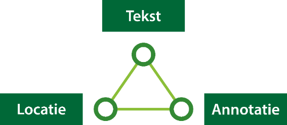

## Omgevingsverordening

De [omgevingsverordening](https://iplo.nl/regelgeving/instrumenten/omgevingsverordening/) bevat alle provinciale regels voor de fysieke leefomgeving. Per provincie is er 1 omgevingsverordening die de bestaande verordeningen vervangt. Zoals de milieuverordening, de planologische verordening, de ontgrondingenverordening, de landschapsverordening en de grondwaterverordening.

Er is geen overgangsrecht voor bestaande provinciale verordeningen die opgaan in de omgevingsverordening op basis van de Omgevingswet. De provincies hebben afgesproken dat de omgevingsverordeningen klaar moeten zijn wanneer de Omgevingswet ingaat. Bestaande provinciale verordeningen gelden dus niet meer vanaf de inwerkingtreding.
De werkafspraak TAM-omgevingsverordening betreft het opstellen van een initiële omgevingsverordening. Het is ook mogelijk in het geval van wijzigingsbesluiten de TAM-omgevingsverordening te gebruiken. Dit wordt in [paragraaf 2.3](#tam-omgevingsverordening) toegelicht. 

### Technische uitgangspunten

De kern van het gebruik van TAM-omgevingsverordening is, dat vanaf inwerkingtreding van de Omgevingswet, de bestaande Wro planketen gebruikt kan worden voor het opstellen en publiceren van de omgevingsverordening. De RO Standaarden 2012 worden niet aangepast. Ook wordt op geen enkele manier iets aangepast aan de Wro plansoftware die wordt gebruikt voor digitale ruimtelijke plannen. Ook aan de manier van publiceren naar Ruimtelijkeplannen.nl verandert niets. Wel wordt de [validator](https://www.ruimtelijkeplannen.nl/validator/validator) van Ruimtelijkeplannen.nl met validatieregels aangevuld en aangepast om het overgangsrecht van Wro naar Omgevingswet te faciliteren, en de TAM-omgevingsverordening mogelijk te maken.

De validator moet een TAM-omgevingsverordening kunnen herkennen om een ontwerpversie wel door te laten ná inwerkingtreding. Daarom is in de werkafspraak bepaald dat de plannaam begint met “TAM-omgevingsverordening”, gevolgd door de naam van het plan. Hiermee wordt het onderscheid gemaakt tussen een Wro provinciale verordening en een nieuw omgevingswetbesluit op basis van TAM-omgevingsverordening. Om een omgevingswetbesluit te kunnen nemen met behulp van TAM-omgevingsverordening wordt uitsluitend gebruik gemaakt van de planfiguur ‘provinciale verordening’. 

De TAM-omgevingsverordening moet uiteindelijk door de provincie omgezet worden naar STOP/TPOD. Het gebruik van TAM-omgevingsverordening houdt dus altijd extra werk in de toekomst in. Dit gegeven moet mee worden genomen bij de afweging over het al dan niet gebruiken van TAM-omgevingsverordening.

### Gebruik IMRO 

Om een TAM-omgevingsverordening te maken, kan binnen het planfiguur ‘provinciale verordening’ in principe gebruik worden gemaakt van alle objecten: besluitgebied, besluitvlak, besluitsubvlak. Belangrijk is te bedenken dat een TAM-omgevingsverordening technisch moet voldoen aan IMRO2012 om door de validator te kunnen komen. Concreet betekent dat ook dat er altijd een object ‘besluitgebied’ moet zijn met de gegevens van het besluit, ondanks dat de omgevingsverordening dit niet kent onder de Omgevingswet. 

In principe is een omgevingsverordening vormvrij. De provincie bepaalt binnen zekere grenzen hoe een omgevingsverordening wordt opgebouwd. Toch is het niet in lijn met de Omgevingswetgedachte om te blijven werken met de Wro-objecten besluitgebied, besluitvlak, besluitsubvlak, daar waar een TAM-omgevingsverordening objecten als activiteiten en gebiedsaanwijzingen. Daarnaast gaat de STOP/TPOD standaard uit van een koppeling van een werkingsgebied (locatie) aan elke regeltekst. Dit betekent dat conform IMRO2012 bij de objecten besluitgebied, besluitvlak, besluitsubvlak de verplicht het attribuut verwijzingNaarTekstInfo verplicht moet worden gebruikt. 

<figure> 
</img>
<figcaption>Koppeling tussen regeltekst en Locatie (werkingsgebied) zoals deze wordt gebruik in de STOP/ TPOD standaard</figcaption>
</figure>

### TAM omgevingsverordening

Een omgevingsverordening opgesteld met behulp van TAM in plaats van de STOP/TPOD standaarden, moet herkenbaar zijn. Dit is belangrijk voor een goede validatie en ten behoeve van de overbruggingsfunctie naar de landelijke voorziening Digitaal Stelsel Omgevingswet. De werkafspraak is als volgt: 

- het typePlan is provinciale verordening
- de naam van het plan is ‘TAM-omgevingsverordening[spatie][plannaam]’

Let er bij de naamgeving op dat:
- TAM wordt geschreven in hoofdletters;
- omgevingsverordening wordt geschreven in kleine letters;
- er geen gebruik wordt gemaakt van spaties tussen TAM en omgevingsverordening, maar alleen een koppelteken.

Er is altijd een besluitgebied dat de gehele provincie betreft. Bij het object besluitgebied moet het atribuut planStatusInfo worden ingevuld. Ten behoeve van de TAM-omgevingsverordening is de volgende planstatus toegestaan: ontwerp en vastgesteld. 
Gekoppeld met de dossierstatus in het manifest betekent dit:
- planstastus ontwerp met de dossierstatus in voorbereiding;
- planstastus vastgesteld met de dossierstatus vastgesteld dan wel geheel onroepelijk in werking. 

Er is minimaal 1 besluitvlak. Voor Gebiedsaanwijzingen en Activiteiten kan gebruik gemaakt worden van besluitvlakken. 
Voor wijzigingsbesluiten van de omgevingsverordening, waarbij in het wijzigingsbesluit wordt aangegeven welke regelteksten en locaties zijn toegevoegd of komen te vervallen, wordt het object besluitsubvlak gebruikt. De ontstane locatie na consolidatie van het besluit vormt het besluitvlak. Het besluitsubvlak geeft aan welk deel toegevoegd of verwijderd is.
De geconsolideerde versie van de omgevingsverordening is alleen mogelijk met behulp van de STOP/ TPOD standaarden.

Bij tekstwijzigingen bevat het besluit alleen de gewijzigde artikelen. Bij artikelen die op een specifieke locatie gericht zijn, kan er een besluitvlak worden aangemaakt met de duiding van de wijziging.

