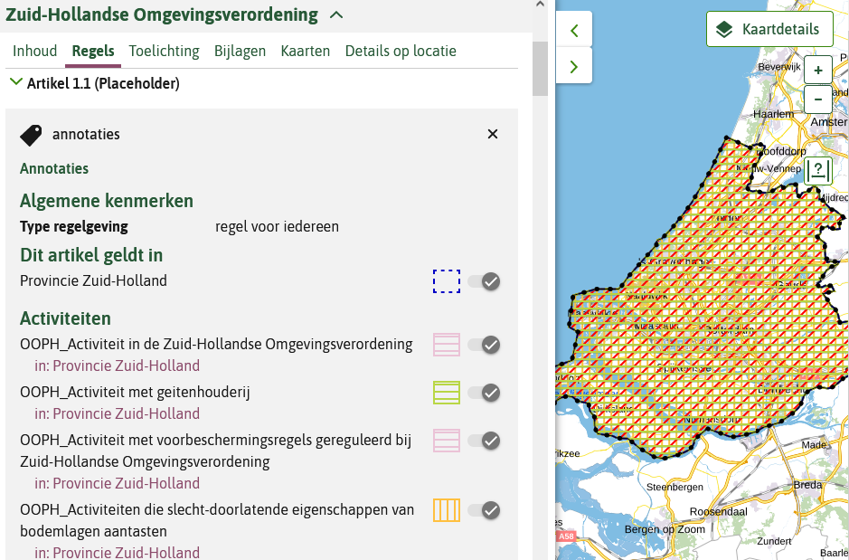
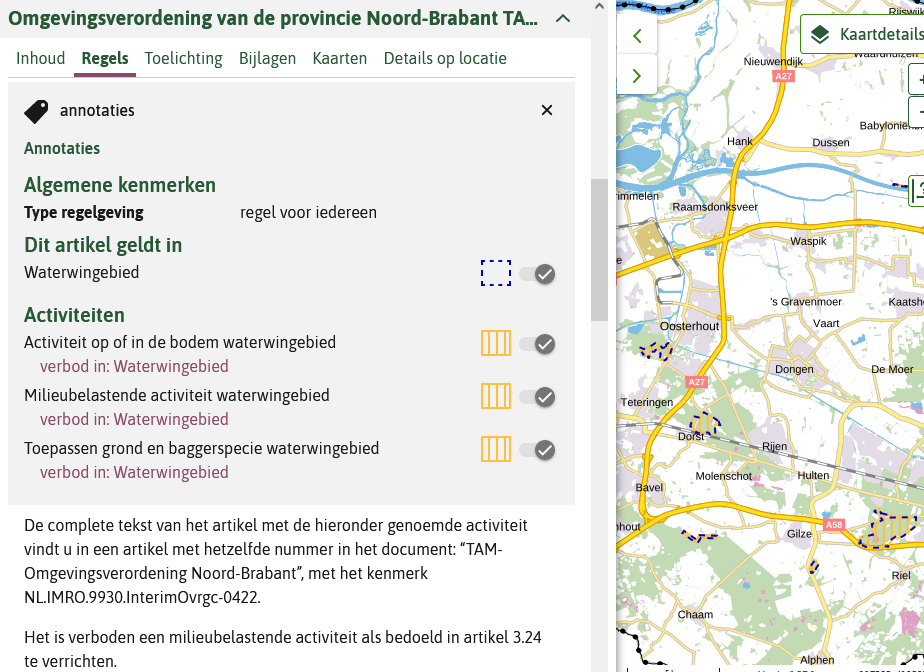
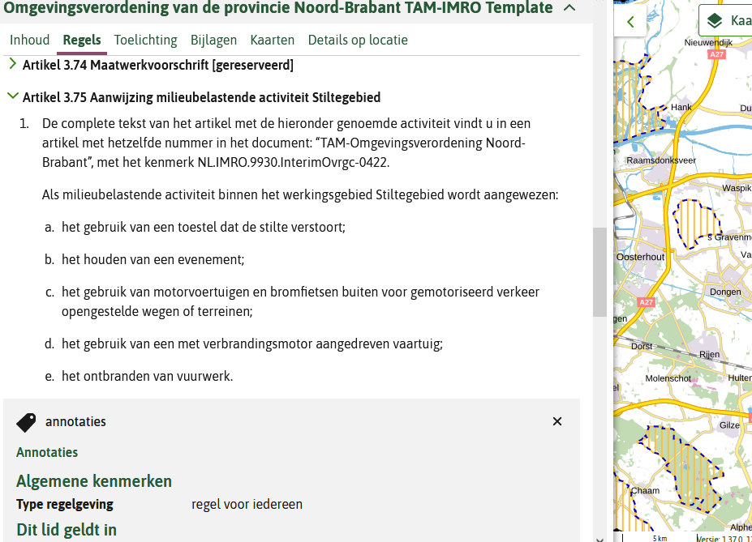
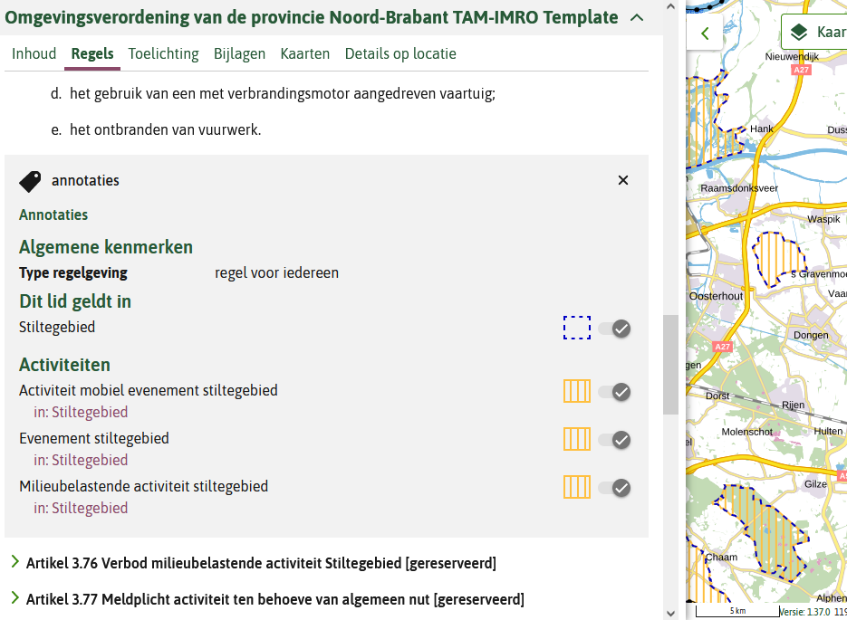

## Placeholder document

### Inleiding

De juridisch geldende versie is een op basis van de RO standaarden gemaakte en gepubliceerde provinciale verordening. Deze verordening wordt ook getoond in de viewer 'Regels op de Kaart' (het omgevingsloket). Omdat het IMRO niet op dezelfde manier van annoteren kent, kan met behulp van IMRO alleen de tekst en locaties getoond worden in de viewer. Voor het kunnen doen van meldingen en vergunningaanvragen via het DSO omgevingsloket is dat niet voldoende. Daarom moet er naast de TAM-omgevingsverordening, door de provincie separaat ook een vereenvoudigde versie van de verordening met geannoteerde activiteiten in het DSO gezet worden. Dit is het zgn. placeholder document. Deze wordt niet gepubliceerd in de landelijke voorziening bekendmaken en beschikbaarstellen (LVBB) omdat de TAM-omgevingsverordening (gepubliceerd op basis van de RO Standaarden via Ruimtelijkeplannen.nl) de juridisch geldende versie is.

### Keuzes

Bij het maken van een placeholder kunnen op een aantal vlakken keuzes worden gemaakt die kunnen leiden tot een heel simpele variant, of juist een versie met wat meer informatie en betere dienstverlening. Visuele voorbeelden van van de placeholders van Zuid-Holland en Noord-Brabant die dit illustreren zijn toegevoegd in paragraaf voorbeelden (#voorbeelden).

#### Reikwijdte 

De reikwijdte waarin de activiteiten naar voren komen bij de vergunning check en vergunning aanvragen of melding doen, zijn: 

<b>Geheel ambtsgebied</b>
Dit is het geval als alle activiteiten als <i>activiteitlocatieaanduiding</i> het ambtsgebied krijgen of als alle activiteiten, eventueel met specifiekere activiteitlocatieaanduidingen, worden opgenomen in een artikel met als werkingsgebied het ambtsgebied. Het gevolg van deze keuze is, is in de viewer opkomen van een grote hoeveelheid activiteiten, die mogelijk niet relevant zijn voor de betreffende locatie waarop de vergunning check of vergunning aanvraag wordt gedaan. 
Voorbeeld: placeholder Zuid-Holland.

<b>Specifiek in het van toepassing zijnde gebied</b>
Dit vraagt om een toepassing van de activiteiten in verschillende artikelen met specifieke werkingsgebieden en specifieke activiteitlocatieaanduidingen, en de opname van de OW-locaties en GIO's. 
Voorbeeld: placeholder Noord-Brabant.

#### Artikelstructuur

De mate waarin de structuur van de artikelen met de annotaties van de activiteiten zijn gerelateerd aan de structuur van de verordening:

<b>Geen gerelateerde structuur</b>
Eén artikel in de meest eenvoudig variant of opsomming van enkel de artikelen met geannoteerde activiteiten die daarmee een andere nummering hebben gekregen dan in de TAM-omgevingsverordening. Er is geen relatie te leggen met de TAM-omgevingsverordening. Filtering heeft geen of weinig inhoudelijke toegevoegde waarde in de viewer 'Regels op de Kaart'.

<b>Zelfde structuur</b> 
Dit betekent dat:
- hoofdstukken zonder activiteiten op gereserveerd kunnen worden gezet; 
- in de hoofdstukken met activiteiten, de artikelen zonder activiteit op gereserveerd kunnen worden gezet (worden leeggemaakt en worden gereserveerd);
- de artikelen met activiteiten worden geannoteerd. 
De gebruiker in de viewer 'Regels op de Kaart'kan makkelijker de relatie leggen naar de tekst van de TAM-omgevingsverordening. Ook werkt bij de viewer 'Regels op de Kaart' het filtermechanisme (als gevolg van de werkingsgebieden en met het filteren op activiteit) waardoor de relevante artikelen naar voren komen.

#### Detailniveau annoteren

Bij het hanteren van de structuur van de regels in de omgevingsverordening in het placeholder document kan er bij het annoteren ook nog een keuze gemaakt worden voor een wat globalere aanpak of een die meer de inhoudelijke artikelen volgt:

<b>Globale structuur</b>
De annotaties kunnen globaler gehouden worden, bijvoorbeeld gekoppeld aan de artikelen ‘toepassingsbereik’ en ‘aanwijzing van de activiteiten’. Dan is de activiteitregelkwalificatie ‘anders geduid’. 
In het voorbeeld placeholder Noord-Brabant is dit toegepast in de afdeling over het stiltegebied.

<b>Structuur confom inhoude artikelen</b> 
De annotaties van de activiteiten kunnen aan alle desbetreffende artikelen worden gekoppeld zoals dat in de STOP/TPOD versie van de verordening zou gebeuren. Hierbij kan daardoor de bijbehorende activiteitregelkwalificatie worden toegevoegd, bijvoorbeeld een verbod bij het verbodsartikel. Dit is toegepast in het voorbeeld placeholder Noord-Brabant, behalve in de Afdeling Stiltegebied.

#### Functionele structuur 

De inhoudelijke keuzes bij de opbouw van de functionele structuur zijn niet anders dan bij de reguliere verordening. De functionele structuur volgt aan de ene kant de opbouw van de juridische regels maar moet aan de andere kant rekening houden met de gewenste effecten bij de toepasbare regels.

#### Tekst van de artikelen 

Net als bij de artikelstructuur zijn er voor de tekst meerdere varianten mogelijk. Bij de eenvoudige versie zonder de structuur van de verordening zijn de varianten als volgt:
- Alleen een beschrijving van de status van de template, bij voorkeur met een verwijzing naar naam en identificatie van de TAM-omgevingsverordening;
- Een verwijzing naar de TAM-omgevingsverordening met enkel de benoeming van de activiteit en de locatie;
- Een verwijzing naar de TAM-omgevingsverordening met de hele artikeltekst waarin de activiteit en de locatie aan de orde komen om zo meer duiding te kunnen geven aan de activiteit.

### Aanleveren placeholder document
NB

### Voorbeelden 

#### Zuid-Holland
<u>Naam</u>: Zuid-Hollandse Omgevingsverordening

<u>Identificatie</u>: /akn/nl/act/pv28/2022/OOWPVZH8Reg

<b>Variant met  één artikel</b> 
Aan dit artikel zijn alle activiteiten gekoppeld met als gebied het hele ambtsgebied.

<figure> 
</img>
<figcaption>Activiteiten gekoppeld met als gebied het hele ambtsgebied</figcaption>
</figure>

<figure> 
</img>
<figcaption>Activiteiten gekoppeld met als gebied het hele ambtsgebied van provincie Zuid-Holland</figcaption>
</figure>

#### Noord-Brabant
<u>Naam</u>: Omgevingsverordening van de provincie Noord-Brabant TAM-IMRO Template

<u>Identificatie</u>: /akn/nl/act/pv30/2022/omgevingsverordeningGK

<b>Variant met volledige tekststructuur omgevingsverordening</b>

<figure> 
</img>
<figcaption>Niet-geannoteerde onderdelen staan op 'gereserveerd', geannoteerde artikelen zijn volledig opgenomen</figcaption>
</figure>

<b>Annotatie activiteit en gebied bij elk artikel waar dit relevant is</b>

<figure> 
</img>
<figcaption>Specifieke activiteitregelkwalificatie, bijvoorbeeld een verbod bij het verbodsartikel</figcaption>
</figure>

<b>Alternatief: globalere annotatie</b> 
Bij toepassingsbereik en aanwijzing milieubelastende activiteiten waardoor activiteitregelkwalificatie beperkt is tot “anders geduid”.

<figure> 
</img>
<figcaption>Globale annotatie in beeld</figcaption>
</figure>

<figure> 
</img>
<figcaption>Globale annotatie in tekst</figcaption>
</figure>

<figure> 
</img>
<figcaption>Globale annotatie in beeld en tekst</figcaption>
</figure>