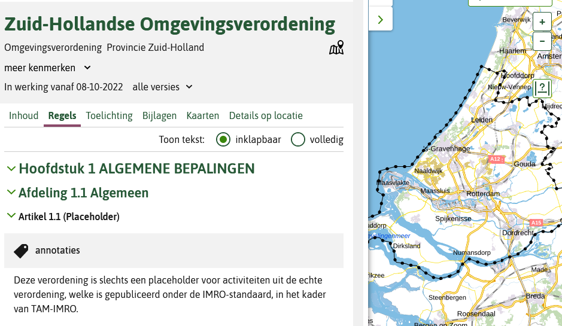
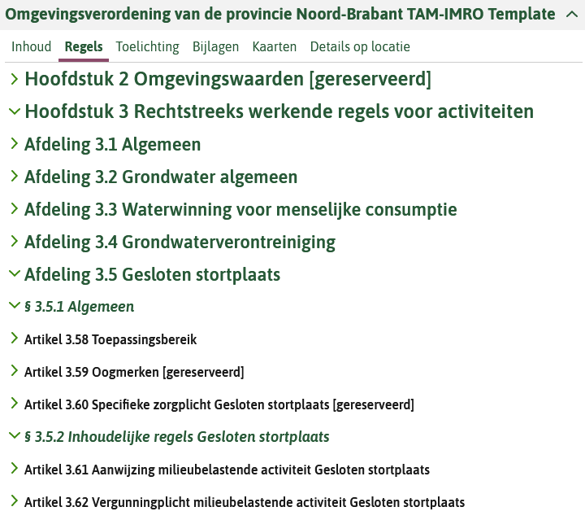
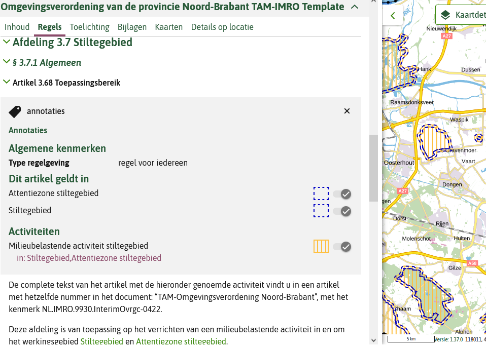

## Bijlage: placeholder

De juridisch geldende versie van de omgevingsverordening is een op basis van de RO Standaarden gemaakte en gepubliceerde provinciale verordening. De omgevingsverordening wordt ook getoond in de viewer 'Regels op de Kaart' (het omgevingsloket). Omdat het IMRO niet dezelfde manier van annoteren kent zoals in de STOP/ TPOD standaarden, kunnen alleen de tekst en locaties getoond worden in de viewer. Voor het kunnen doen van meldingen en vergunningaanvragen (waarbij indieningsvereisten een rol spelen) via het DSO omgevingsloket is dit niet voldoende. Daarom is het de bedoeling dat er naast de omgevingsverordening conform TAM, separaat ook een STOP/ TPOD document met geannoteerde activiteiten in het DSO worden geladen: het placeholder document. 

Bij het maken van een placeholder kunnen op een aantal vlakken keuzes worden gemaakt die kunnen leiden tot een heel simpele variant, of juist een versie met wat meer informatie en betere dienstverlening. Visuele voorbeelden van van testen van de placeholders van Zuid-Holland en Noord-Brabant die dit illustreren zijn toegevoegd in paragraaf [voorbeelden](#voorbeelden).

#### Reikwijdte 

Het al dan niet tevoorschijn komen van vergunningcheck of activiteiten waarvoor een vergunning aangevraagd kan worden of een melding kan worden gedaan, kan in het omgevingsloket afhankelijk zijn van de locatie waarvoor dit wordt gedaan. De geografische reikwijdte waarin de activiteiten naar voren komen zijn: 

<b>Geheel ambtsgebied</b>
Dit is het geval als alle activiteiten conform de TPOD standaarden als <i>activiteitlocatieaanduiding</i> het ambtsgebied krijgen of als alle activiteiten, eventueel met specifiekere activiteitlocatieaanduidingen, worden opgenomen in een artikel met als werkingsgebied het ambtsgebied. Het gevolg van deze keuze is dat in het loket een grote hoeveelheid activiteiten naar voren komen, die mogelijk niet relevant zijn voor de betreffende locatie waarop de vergunning check of een vergunning aanvraag wordt gedaan. 
Voorbeeld: placeholder Zuid-Holland.

<b>Specifiek in het van toepassing zijnde gebied</b>
Dit vraagt om een toepassing van de activiteiten in verschillende artikelen met specifieke werkingsgebieden en specifieke activiteitlocatieaanduidingen, en de opname van de OW-locaties en GIO's in het placeholder document. 
Voorbeeld: placeholder Noord-Brabant.

### Artikelstructuur

In een placeholder document kunnen activiteiten bij één artikel worden geannoteerd of kunnen er meerdere artikelen voor iedere activiteit afzonderlijk worden opgenomen. De mate waarin de structuur van de artikelen met de annotaties van de (juridisch geldende via TAM gepubliceerde) omgevingsverordening kan op twee manieren worden uitgewerkt:

<b>Geen gerelateerde structuur</b>
het placeholder document bevat één artikel in de meest eenvoudig variant of opsomming van enkel de artikelen met geannoteerde activiteiten. Afhankelijk van de gebruikte software krijgen die daarmee een andere nummering  dan in de omgevingsverordening conform TAM. Er is geen relatie te leggen met de omgevingsverordening. De weergave in de viewer 'Regels op de Kaart' heeft weinig inhoudelijke toegevoegde waarde.

<b>Zelfde structuur</b> 
Het placeholder document bevat alle artikelen die ook in de via TAM gepubliceerde omgevingsverordening voorkomen. Dit betekent dat:
- hoofdstukken zonder activiteiten op gereserveerd kunnen worden gezet; 
- in de hoofdstukken met activiteiten, de artikelen zonder activiteit op gereserveerd kunnen worden gezet (worden leeggemaakt en worden gereserveerd);
- de artikelen met activiteiten worden geannoteerd. 
De gebruiker in de viewer 'Regels op de Kaart' kan makkelijker de relatie leggen naar de tekst van de omgevingsverordening conform TAM. Ook werkt bij de viewer 'Regels op de Kaart' het filtermechanisme (als gevolg van de werkingsgebieden en met het filteren op activiteit) waardoor de relevante artikelen naar voren komen.

### Detailniveau annoteren

Bij het hanteren van dezelfde structuur van de regels in de omgevingsverordening als in het placeholder document kan er bij het annoteren ook nog een keuze gemaakt worden voor een wat globalere aanpak of een aanpak die meer de inhoudelijke artikelen volgt. 

<b>Globale structuur</b>
De annotaties kunnen globaler gehouden worden, bijvoorbeeld gekoppeld aan de artikelen ‘toepassingsbereik’ en ‘aanwijzing van de activiteiten’. Dan is de activiteitregelkwalificatie ‘anders geduid’. 
In het voorbeeld placeholder Noord-Brabant is dit toegepast in de afdeling over het stiltegebied.

<b>Structuur conform inhoudelijke artikelen</b> 
Volg hiervoor de werkwijze zoals deze is beschreven in de <a href='https://geonovum.github.io/TPOD/TPOD%20Omgevingsverordening/TPOD_omgevingsverordening_v2.0.1.pdf' target='_blank'>Toepassingsprofiel (TPOD) omgevingsverordening</a>. 

### Functionele structuur 

De inhoudelijke keuzes bij de opbouw van de functionele structuur van activiteiten zijn niet anders dan bij de reguliere verordening. De functionele structuur volgt aan de ene kant de opbouw van de juridische regels maar moet aan de andere kant rekening houden met de gewenste effecten bij de toepasbare regels.

### Tekst van de artikelen 

Net als bij de artikelstructuur zijn er voor het opnemen van tekst in het placeholder document meerdere varianten mogelijk. Bij de eenvoudige versie zonder de structuur van de verordening zijn de varianten als volgt:
- Alleen een beschrijving van de status van de placeholder, bij voorkeur met een verwijzing naar de naam en identificatie van de omgevingsverordening conform TAM;
- Een verwijzing naar de omgevingsverordening conform TAM met enkel de benoeming van de activiteit en de locatie;
- Een verwijzing naar de omgevingsverordening conform TAM met de hele artikeltekst waarin de activiteit en de locatie aan de orde komen om zo meer duiding te kunnen geven aan de activiteit.

### Voorbeelden 

#### Zuid-Holland
<u>Naam</u>: Zuid-Hollandse Omgevingsverordening

<u>Identificatie</u>: /akn/nl/act/pv28/2022/OOWPVZH8Reg

<b>Variant met  één artikel</b> 
Aan dit artikel zijn alle activiteiten gekoppeld met als werkingsgebied het hele ambtsgebied.

<figure> 
</img>
<figcaption>Activiteiten gekoppeld met als werkingsgebied het hele ambtsgebied</figcaption>
</figure>

<figure> 
</img>
<figcaption>Activiteiten gekoppeld met als werkingsgebied het hele ambtsgebied van provincie Zuid-Holland</figcaption>
</figure>

#### Noord-Brabant
<u>Naam</u>: Omgevingsverordening van de provincie Noord-Brabant TAM-IMRO Template

<u>Identificatie</u>: /akn/nl/act/pv30/2022/omgevingsverordeningGK

<b>Variant met volledige tekststructuur omgevingsverordening</b>

<figure> 
</img>
<figcaption>Niet-geannoteerde onderdelen staan op 'gereserveerd', geannoteerde artikelen zijn volledig opgenomen</figcaption>
</figure>

<b>Annotatie activiteit en werkingsgebied bij elk artikel waar dit relevant is</b>

<figure> 
</img>
<figcaption>Specifieke activiteitregelkwalificatie, bijvoorbeeld een verbod bij het verbodsartikel</figcaption>
</figure>

<b>Alternatief: globalere annotatie</b> 
Bij toepassingsbereik en aanwijzing milieubelastende activiteiten waardoor activiteitregelkwalificatie beperkt is tot “anders geduid”.

<figure> 
</img>
<figcaption>Globale annotatie in beeld</figcaption>
</figure>

<figure> 
</img>
<figcaption>Globale annotatie in tekst</figcaption>
</figure>

<figure> 
</img>
<figcaption>Globale annotatie in beeld en tekst</figcaption>
</figure>