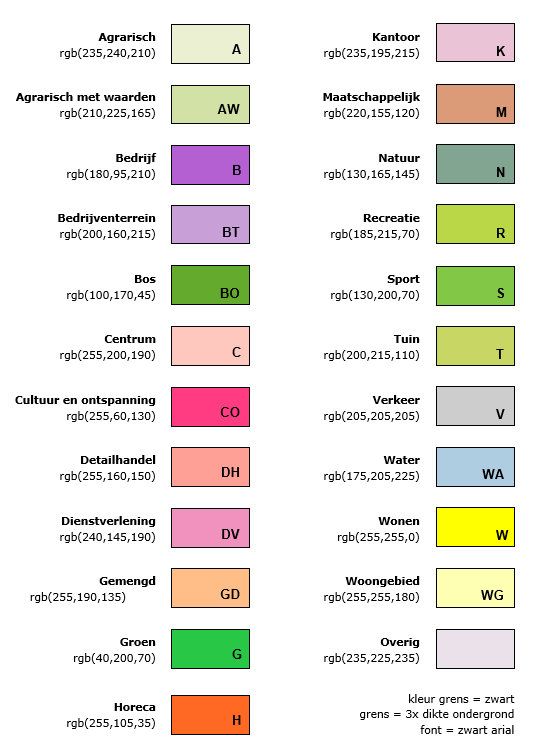

# Bestemmingen
**Dit hoofdstuk bevat de richtlijnen die van toepassing zijn op de vormgeving en
inrichting van de op de analoge bestemmingsplankaart voorkomende bestemmingen.**

## Algemeen
Dit hoofdstuk is van toepassing op de op de analoge bestemmingsplankaart
voorkomende bestemmingen die ingevolge artikel 3.1 Wro aan gronden worden
toegekend. Een bestemming heeft betrekking op een geometrisch bepaald vlak.
Bestemmingen in de vorm van een lijn of een punt komen niet voor.

## Hoofdgroepen van bestemmingen
In de SVBP2012 is een bindende lijst met hoofdgroepen van bestemmingen
opgesteld. Van iedere specifieke bestemming, voorlopige bestemming en uit te
werken bestemming is vastgelegd onder welke hoofdgroep deze valt. Op de analoge
bestemmingsplankaart krijgen alle geometrisch bepaalde vlakken waar de
bestemmingen, voorlopige bestemmingen en uit te werken bestemmingen betrekking
op hebben, de kleur van de hoofdgroep waar deze onder valt, conform de
specificatie in Figuur 2. 
  

De begrenzing van deze vlakken wordt weergegeven door
een ononderbroken lijn. Op de analoge bestemmingsplankaart wordt tevens gebruik
gemaakt van lettercodes. Deze lettercodes zijn uitsluitend zichtbaar op de
analoge bestemmingsplankaart en in de bijbehorende legenda; ze worden niet in de
planregels opgenomen en zijn ook niet zichtbaar in de digitale verbeelding

  
**Figuur 2 Weergave hoofdgroepen van bestemmingen op de analoge
bestemmingsplankaart**

## Lettercode van een bestemming
Iedere bestemming heeft een lettercode op de analoge bestemmingsplankaart. De
letters worden in zwarte hoofdletters weergegeven. Voor de lettercode van een
bestemming zijn vier varianten mogelijk:
  

**Variant 1 – lettercode van de hoofdgroep hanteren**  
Indien de naam van de bestemming gelijk is aan de naam van de hoofdgroep wordt
de lettercode op de analoge bestemmingsplankaart van de bestemming gelijk aan de
lettercode van de hoofdgroep. Dit komt overeen met variant 1 in de SVBP2012. De
lettercode van de bestemming wordt als volgt opgenomen:

`<<`LETTERCODE HOOFDGROEP`>>`  
*Voorbeeld: A*
  

**Variant 2 - specifieke lettercode gebruiken**  
Indien de naam van de bestemming nader gespecificeerd is conform variant 2 in de
SVBP2012, dan wordt de lettercode van de bestemming als volgt opgenomen:

`<<`LETTERCODE HOOFDGROEP`>>` [-] `<`LETTERCODE VAN DE BESTEMMING`>`  
*Voorbeeld: de bestemming Agrarisch – Viskwekerij wordt weergegeven als A-VK*
 
Voor bepaalde specifieke bestemmingen wordt een vaste lettercode gespecificeerd.
Hiertoe is een functielijst opgesteld die als separate bijlage naast de SVBP2012
van toepassing is. De functielijst is verdeeld in drie kolommen: functies,
hoofdgroepen en lettercodes. De lettercode genoemd bij de functie wordt
gebruikt. Indien er een bestemming wordt gespecificeerd waarvan de functie niet
voorkomt op de functielijst, dan kiest de bronhouder zelf een unieke lettercode
die het meest van toepassing is. De gekozen lettercode komt nog niet voor op de
functielijst en behoort niet toe aan andere enkel- en dubbelbestemming,
bouwaanduidingen en gebiedsaanduidingen.
  

**Variant 3 - Bestemming splitsen**  
Indien de naam van de bestemming nader gesplitst is conform variant 3 in de
SVBP2012, dan wordt de lettercode van de bestemming als volgt opgenomen:

`<<`LETTERCODE HOOFDGROEP`>>` [-] `<`cijfer`>`  
*Voorbeeld: de bestemming Gemengd - 1 wordt weergegeven als GD-1*
  

**Variant 4 – lettercode van een bestemming onder de hoofdgroep Overig**  
Indien de naam van de bestemming nader gespecificeerd is binnen de hoofdgroep
Overig conform variant 4 in de SVBP2012, dan kiest de bronhouder zelf een unieke
lettercode. De gekozen lettercode komt nog niet voor op de functielijst en
behoort niet toe aan andere enkel- en dubbelbestemming, bouwaanduidingen en
gebiedsaanduidingen. De lettercode van de bestemming wordt als volgt opgenomen:

`<`LETTERCODE VAN DE BESTEMMING`>`  
*Voorbeeld: de bestemming Enclave wordt weergegeven als E*

## Lettercode van een voorlopige bestemming
Iedere voorlopige bestemming heeft een lettercode. 
De lettercode van een voorlopige bestemming wordt als volgt opgenomen:

`<<`LETTERCODE HOOFDGROEP`>>` [-] [VRL]  
*Voorbeeld: de bestemming Agrarisch – Voorlopig wordt weergegeven als A-VRL*
  

In het geval een voorlopige bestemming wordt gespecificeerd, wordt de lettercode
van de bestemming als volgt opgenomen:

`<<`LETTERCODE HOOFDGROEP`>>` [-] `<`LETTERCODE VAN DE BESTEMMING`>`. [spatie] [VRL]  
*Voorbeeld: Agrarisch – Grondgebonden Voorlopig wordt weergegeven als A-GRG-VRL*
  

In het geval dat een voorlopige bestemming wordt gesplitst, wordt de lettercode
van de bestemming als volgt opgenomen:

`<<`LETTERCODE HOOFDGROEP`>>` [-] [VRL] `<`cijfer`>`  
*Voorbeeld: Agrarisch – Voorlopig 1 wordt weergegeven als A-VRL1*

## Lettercode van een uit te werken bestemming
Iedere uit te werken bestemming heeft een lettercode. 
 De lettercode van een uit te werken bestemming wordt als volgt opgenomen:

`<<`LETTERCODE HOOFDGROEP`>>` [-] [U]  
*Voorbeeld: de bestemming Agrarisch – Uit te werken wordt weergegeven als A-U*
  

In het geval dat een uit te werken bestemming wordt gesplitst, wordt de
lettercode van een uit te werken bestemming als volgt opgenomen:

`<<`LETTERCODE HOOFDGROEP`>>` [-] [U] `<`cijfer`>`  
*Voorbeeld: Agrarisch – Uit te werken 1 wordt weergegeven als A-U1*  

