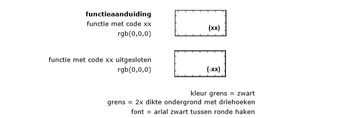
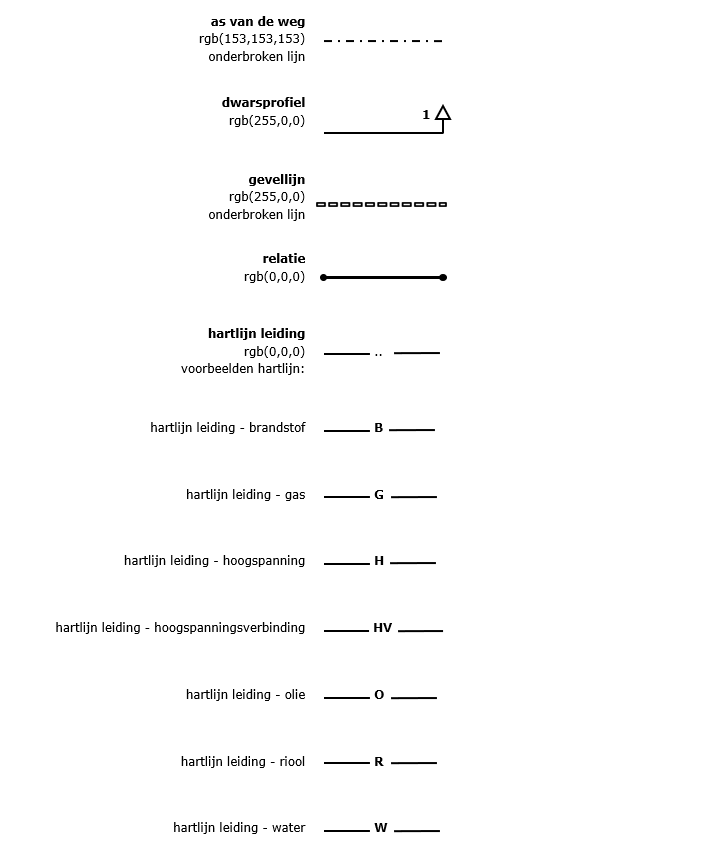

# Aanduidingen
**Dit hoofdstuk bevat de richtlijnen die van toepassing zijn op de vormgeving en
inrichting van de op de analoge bestemmingsplankaart voorkomende aanduidingen.**

## Algemeen
Behalve bestemmingen en dubbelbestemmingen zijn binnen het bestemmingsplan
aanduidingen te onderscheiden. Er zijn zes soorten aanduidingen te
onderscheiden:
-   bouwvlak;
-   functieaanduiding;
-   bouwaanduiding;
-   maatvoering;
-   figuur;
-   gebiedsaanduidingen.

Voor ieder type aanduiding is in dit hoofdstuk de weergave op de analoge
bestemmingsplankaart gegeven. Met uitzondering van de aanduiding figuur zijn de
hiervoor genoemde aanduidingen geometrisch begrensd en hebben zij betrekking op
een vlak. Een figuur bestaat uit lijnstukken.

## Bouwvlak
Een bouwvlak is een aanduiding waarvan er slechts 1 soort is. Een bouwvlak wordt
op de analoge bestemmingsplankaart weergegeven door dikke lijnen overeenkomstig
Figuur 4. Voor het bouwvlak wordt op de analoge bestemmingsplankaart geen
gebruik gemaakt van lettercodes.

Een bouwvlak wordt als volgt weergegeven op de analoge bestemmingsplan kaart:

  
**Figuur 4 Weergave bouwvlak op de analoge bestemmingsplankaart**

## Functieaanduiding
Functieaanduidingen worden op de analoge bestemmingsplankaart weergegeven met
een zwarte lettercode tussen ronde haken. In Figuur 5 is de wijze waarop de
begrenzing van een aanduidingvlak wordt weergegeven, evenals de lettercode van
de functieaanduiding.

Voor de lettercode van een functieaanduiding zijn twee varianten mogelijk:

**Variant 1 - lettercode uit de functielijst opnemen**  
Er is een functielijst opgesteld die als separate bijlage naast de SVBP2012 van
toepassing is. Indien er gebruik gemaakt wordt van een functie die voorkomt op
deze lijst, dan wordt de lettercode van de functieaanduiding als volgt
opgenomen:

[(] `<<`lettercode`>>` [)]  
*Voorbeeld: bedrijfswoning wordt opgenomen als (bw)*

In het geval dat een functie die voorkomt op de functielijst niet is toegestaan
op een locatie in het bestemmingsplan, wordt deze negatieve functieaanduiding
als volgt opgenomen:

[(] [-] `<<`lettercode`>>` [)]  
*Voorbeeld: bedrijfswoning uitgesloten wordt opgenomen als (-bw)*

**Variant 2 - specifieke lettercode opnemen**  
Naast het werken met functies van de functielijst mag er als dat nodig is voor
een goede ruimtelijke ordening, ook gewerkt worden met specifieke functies. Een
specifieke functie is een functie die niet voorkomt op de functielijst. De
lettercode van een specifieke functie wordt geheel met kleine letters
geschreven, cijfers worden als Arabische cijfers geschreven en de
functieaanduiding wordt als volgt opgenomen:

[(] [s] `<<`lettercode hoofdgroep`>>` [-] `<`specificatie`>` [)]  
*Voorbeeld 1: specifieke vorm van agrarisch* – *deels grondgebonden wordt opgenomen als (sa-dgg)*  
*Voorbeeld 2: specifieke vorm van maatschappelijk - 1 wordt opgenomen als(sm-1)*

Voor de `<<`lettercode hoofdgroep`>>` wordt gekozen uit een van de hoofdgroepen
die gehanteerd worden bij bestemmingen en dubbelbestemmingen, behalve de
hoofdgroep ‘Overig’. De gekozen waarde wordt met kleine letters opgenomen.

In het geval dat een specifieke functie niet is toegestaan op een locatie in het
bestemmingsplan, wordt deze uitgesloten functie als volgt opgenomen:

[(] [-] [s] `<<`lettercode hoofdgroep`>>` [-] `<`specificatie`>` [)]  
*Voorbeeld: specifieke vorm van recreatie uitgesloten - groepsverblijf wordt opgenomen als (-sr-grv)*

  
**Figuur 5 Weergave functieaanduidingen op de analoge bestemmingsplankaart**

## Bouwaanduiding
Bouwaanduidingen worden met kleine zwarte cursieve lettercodes tussen blokhaken
weergegeven. Deze gebruikte lettercodes worden niet opgenomen in de planregels.
De begrenzing van de bouwaanduiding is in Figuur 6 weergegeven. Voor de
lettercode van een bouwaanduiding zijn twee varianten mogelijk:

**Variant 1 – lettercode uit de functielijst opnemen**  
In de SVBP2012 is een bindende lijst met bouwaanduidingen opgesteld. In deze
variant wordt een aanduiding uit deze lijst cursief en tussen blokhaken op de
analoge bestemmingsplankaart opgenomen. Voor iedere aanduiding uit deze lijst is
een vaste lettercode van toepassing:

| aaneengebouwd  | *aeg*  |
|----------------|--------|
| antennemast    | *am*   |
| bijgebouwen    | *bg*   |
| gestapeld      | *gs*   |
| kap            | *kap*  |
| karakteristiek | *ka*   |
| nokrichting    | *nr*   |
| onderdoorgang  | *ond*  |
| plat dak       | *pd*   |
| twee-aaneen    | *tae*  |
| vrijstaand     | *vrij* |

Deze aanduidingen wordt als volgt opgenomen:

[[] `<<`bouwaanduidingcode`>>` []]  
*Voorbeeld: de bouwaanduiding aaneengebouwd wordt opgenomen als [aeg]*

In het geval dat een bepaalde bouwwijze of verschijningsvorm die voorkomt op de
vaste lijst niet is toegestaan op een locatie in het bestemmingsplan, wordt
gebruik gemaakt van een negatieve bouwaanduiding. Deze negatieve bouwaanduiding
wordt als volgt opgenomen:

[[] [-] `<<`bouwaanduidingcode`>>` []]  
*Voorbeeld: de bouwaanduiding aaneengebouwd uitgesloten wordt opgenomen als [-aeg]*

**Variant 2 - specifieke lettercode opnemen**  
Naast het werken met bouwaanduidingen uit de vaste lijst uit de SVBP2012 mag er
als dat nodig is voor een goede ruimtelijke ordening, ook gewerkt worden met
specifieke bouwaanduidingen. Een specifieke bouwaanduiding is een bouwaanduiding
die niet voorkomt op de genoemde lijst. De lettercode van de specifieke
bouwaanduiding wordt als volgt opgenomen:

[[] [sba] [-] `<`specifieke code`>` []]  
*Voorbeeld 1: specifieke bouwaanduiding - stolp wordt opgenomen als [sba-sto]*  
*Voorbeeld 2: specifieke bouwaanduiding - 1 wordt opgenomen als [sba-1]*

In het geval dat een bepaalde bouwwijze of verschijningsvorm niet is toegestaan
op een locatie in het bestemmingsplan, wordt gebruik gemaakt van een negatieve
specifieke aanduiding. De negatieve verzamelaanduiding wordt als volgt
opgenomen:

[[] [-] [sba] [-] `<`specifieke code`>` []]  
*Voorbeeld 1: specifieke bouwaanduiding uitgesloten - stolp wordt opgenomen als [-sba-sto]*  
*Voorbeeld 2: specifieke bouwaanduiding uitgesloten - 1 wordt opgenomen als [-sba-1]*  

In het geval het voor de leesbaarheid van de analoge bestemmingsplankaart
gewenst is dezelfde lettercode voor de bouw­aanduiding binnen één
bestemmingsvlak, bouwvlak of gebiedsaandui­ding een of meerdere keren te
herhalen, dan worden meerdere plaatsingspunten aangegeven.  

  
**Figuur 6 Weergave bouwaanduiding op de analoge bestemmingsplankaart**

## Maatvoering
Op de analoge bestemmingsplankaart worden de maatvoeringvlakken weergegeven op
de wijze, zoals in Figuur 8 aangegeven maatvoeringsymbolen. De maatvoering wordt
in het maatvoeringvlak door middel van een maatvoeringsymbool (ook wel matrix of
matrixsymbool genoemd) weergegeven. Er worden vaste symbolen en symboolcodes
gebruikt op de analoge bestemmingsplankaart. Bij het gebruik van een
maatvoeringsymbool op de analoge bestemmingsplankaart, is het conform IMRO
verplicht de code van het symbool op te nemen in het digitale bestemmingsplan.
Voor het plaatsen van een maatvoeringsymbool op de analoge bestemmingsplankaart
worden de volgende uitgangspunten gehanteerd:

-   plaatsingspunt van het symbool: coördinaten van het zwaartepunt (center,
    center) van de matrix;

-   aanpijlingspunt: coördinaten van het punt waar het symbool bij hoort (indien
    dit niet het plaatsingspunt is). De lijn tussen plaatsingspunt en
    aanpijlingspunt wordt niet opgenomen;

-   hoek: waaronder symbool geplaatst wordt. Eenheid: graden; ten opzichte van
    Noordpijl; rechtsom = positief.

  
**Figuur 7 Maatvoeringsymbolen**  

In de symbolen s128, s129 en s130 wordt op de plaats van de letter j de waarde
weergegeven die behoort bij de maatvoeringsaanduiding. Op de plaats van x wordt
de keuze uit Tabel 1 met maatvoeringsymbolen weergegeven. Daarbij wordt alleen
de specificatie na de algemene symboolcode s128, s129 en s130 opgenomen.

  

De volledige lijst met mogelijke maatvoeringsaanduiding met symboolcodes is
opgenomen in Tabel 1.

**Tabel 1 Maatvoering waarde met symboolcode**

| **Maatvoering**                                                                   | **SymboolCode**            |                                   |                                   |                                              |
|-----------------------------------------------------------------------------------|----------------------------|-----------------------------------|-----------------------------------|----------------------------------------------|
| waarde                                                                            | gebruik zonder voorvoegsel | gebruik met voorvoegsel [minimum] | gebruik met voorvoegsel [maximum] | gebruik met voorvoegsel [minimum en maximum] |
| aantal                                                                            | s128a                      |                                   |                                   |                                              |
| aantal aaneen te bouwen wooneenheden                                              | s128ab                     | s129x                             | s121                              |                                              |
| aantal bedrijven                                                                  | s128b                      | s129a                             | s130a                             |                                              |
| aantal bezoekers                                                                  | s128c                      | s129b                             | s130b                             |                                              |
| aantal bouwlagen                                                                  | s128d                      | s129c                             | s120                              |                                              |
| aantal gebouwen                                                                   | s128e                      | s129d                             | s130c                             |                                              |
| aantal parkeerplaatsen                                                            | s128f                      | s129e                             | s130d                             |                                              |
| aantal rijstroken                                                                 | s128g                      | s129f                             | s130e                             |                                              |
| aantal sporen                                                                     | s128h                      | s129g                             | s130f                             |                                              |
| aantal winkels                                                                    | s128i                      | s129h                             | s130g                             |                                              |
| aantal wooneenheden                                                               | s128j                      | s129i                             | s119                              |                                              |
| bebouwd oppervlak (m2)                                                            | s128l                      | s129j                             | s130h                             |                                              |
| bebouwingspercentage (%)                                                          | s128m                      | s129k                             | s109                              |                                              |
| bouwhoogte (m)                                                                    | s128r                      | s103                              | s104                              | s105                                         |
| breedte (m)                                                                       | s128n                      | s129l                             | s130i                             |                                              |
| dakhelling (graden)                                                               | s128o                      | s106                              | s107                              | s108                                         |
| diepte (m)                                                                        | s128p                      | s129m                             | s130s                             |                                              |
| goothoogte (m)                                                                    | s128s                      | s100                              | s101                              | s102                                         |
| hoogte (m)                                                                        | s128q                      | s129n                             | s130j                             |                                              |
| hoogteligging vlak (m)                                                            | s128t                      | s129o                             | s130k                             |                                              |
| lengte (m)                                                                        | s128u                      | s129p                             | s130l                             |                                              |
| maatvoering                                                                       | s128k                      |                                   |                                   |                                              |
| oppervlakte (m2)                                                                  | s128v                      | s129q                             | s130m                             |                                              |
| verticale bouwdiepte (m)                                                          | s122                       | s129y                             | s130t                             |                                              |
| vloeroppervlakte (m2)                                                             | s128ac                     | s129r                             | s130n                             |                                              |
| vloeroppervlakte; bruto (m2)                                                      | s128w                      | s129s                             | s130o                             |                                              |
| vloeroppervlakte; bvo (m2)                                                        | s128x                      | s129t                             | s127                              |                                              |
| vloeroppervlakte; netto (m2)                                                      | s128y                      | s129u                             | s130p                             |                                              |
| vloeroppervlakte; vvo (m2)                                                        | s128z                      | s129v                             | s130q                             |                                              |
| volume (m3)                                                                       | s128aa                     | s129w                             | s130r                             |                                              |
| goothoogte en bouwhoogte (m)                                                      |                            | s110                              | s111                              | s112                                         |
| goothoogte, bouwhoogte (m), dakhelling (graden)                                   |                            | s113                              | s114                              | s115                                         |
| goothoogte, bouwhoogte (m), dakhelling (graden), maximum bebouwingspercentage (%) |                            | s116                              | s117                              | s118                                         |
| bouwhoogte (m), maximum bebouwingspercentage (%)                                  |                            |                                   | s123                              | s125                                         |
| goothoogte, bouwhoogte (m), maximum bebouwingspercentage (%)                      |                            |                                   | s124                              |                                              |
| bouwhoogte (m), aantal bouwlagen, maximum bebouwingspercentage (%)                |                            |                                   | s126                              |                                              |
| `<`overige waarde 1`>`                                                            | s128ad                     | s129z                             | s130u                             |                                              |
| `<`overige waarde 2`>`                                                            | s128ae                     | s129aa                            | s130v                             |                                              |
| `<`overige waarde 3`>`                                                            | s128af                     | s129ab                            | s130w                             |                                              |

In het geval het voor de leesbaarheid gewenst is op de analoge
bestemmingsplankaart hetzelfde maatvoeringsymbool binnen één bestemmingsvlak,
bouwvlak of gebiedsaanduiding een of meerdere keren te herhalen, dan worden
meerdere plaatsingspunten in één object *Maatvoering* geplaatst.

  
**Figuur 8 Weergave maatvoering op de analoge bestemmingsplankaart**

## Figuur
Figuren worden op de analoge bestemmingsplankaart weergegeven conform de
aanduidingen in Figuur 9. Bij leidingen kan de hartlijn van de aanduiding worden
geplaatst in het vlak van de dubbelbestemming. In de hartlijn kan worden
aangegeven om welke leiding het gaat.

  
**Figuur 9 Weergave figuren op de analoge bestemmingsplankaart**

## Gebiedsaanduidingen
In de SVBP2012 is een bindende lijst met hoofdgroepen van gebiedsaanduidingen
opgesteld. Van iedere specifieke gebiedsaanduiding is vastgelegd onder welke
hoofdgroep deze valt.

In de legenda op de analoge bestemmingsplankaart wordt de volledige naam van de
aanduiding gegeven. Voor de weergave van een gebiedsaanduiding op de analoge
bestemmingsplankaart zijn twee varianten mogelijk:

**Variant 1 - naam van de hoofdgroep hanteren**  
De naam van de gebiedsaanduiding is gelijk aan de naam van de hoofdgroep. De
gebiedsaanduiding wordt weergegeven door de arceringen en kleuren zoals in
Figuur 10. De naam van de gebiedsaanduiding wordt als volgt opgenomen:  
*Voorbeeld: geluidzone*

**Variant 2 - specificieke gebiedsaanduiding gebruiken**  
In deze variant wordt de gebiedsaanduiding weergegeven door de arceringen in de
kleuren die in Figuur 10 zijn weergegeven.  
*Voorbeeld: wetgevingzone - afwijkingsgebied*

Als het voor een goede ruimtelijke ordening wenselijk is om meerdere varianten
van dezelfde specifieke gebiedsaanduiding te gebruiken, dan kunnen deze verder
gespecificeerd worden met een nadere tekstuele aanduiding in de vorm van een
woord of een Arabisch cijfer. Wordt onderscheid gemaakt tussen de verschillende
vlakken/soorten door aan de arcering in een zwart cursief weergegeven Arabisch
cijfer toe te voegen, dan is dit Arabisch cijfer ook in de naam van de
gebiedsaanduiding opgenomen.  
*Voorbeeld 1: wetgevingzone – wijzigingsgebied 1*  
*Voorbeeld 2: wetgevingzone - afwijkingsgebied milieu*  

Ook is het mogelijk onderscheid tussen deze gebiedsaanduidingen te maken door de
arcering dichter of opener weer te geven.

  
**Figuur 10 Weergave gebiedsaanduidingen op de analoge bestemmingsplankaart**
