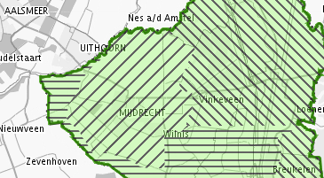

# Verbeelding van een vormvrij plan

**Met het gebruik van de symboolcodelijst voor vormvrije plannen is het mogelijk
verbeeldingsaspecten aan de objecten in de amvb of ministeriële regeling toe te
kennen. In dit hoofdstuk wordt nader ingegaan op de werkwijze.**

## Toelichting

Voor bestemmingsplannen geldt er een standaard voor verbeelding bij de officiële
publicatie door de bronhouder: de Standaard Vergelijkbare Bestemmingsplannen
(SVBP2012). Ontvangende partijen hanteren in de regel ook deze standaard. Er is
echter geen standaard vastgesteld voor verbeelden van amvb of andere vormvrije
plannen. In een amvb kan daarom sinds IMRO2012 informatie over de kleur, patroon
en de opbouw van de verbeelding (kaart) worden opgenomen. De ontvanger van de
digitale amvb kan daardoor uit het IMRO-gecodeerde ruimtelijke plan opmaken in
welke kleuren en/of patronen of in hoeveel kaarten de amvb moet worden
weergeven.

Het attribuut dat hiervoor door de bronhouder moeten worden gebruikt is
*cartografieInfo*. Dit is een samengesteld attribuut bestaande uit de attributen
*kaartnummer, kaartnaam* en *symboolcode*. In de volgende paragrafen volgt we
werkwijze voor het gebruik van de symboolcodelijst.

## CartografieInfo

Per object wordt de symboliek gecodeerd en gerelateerd aan het kaartbeeld waarin
het object moet voorkomen. Ieder object dat binnen een verbeelding moet worden
gesymboliseerd moet een *kaartnummer*, *kaartnaam* en *symboolcode* krijgen, de
onderdelen van et attribuut *cartografieInfo*. De structuur van de kaartopbouw
staat hiermee los van de planstructuur. Dit biedt volledige vrijheid van
kaartsamenstelling, maar kan ook inconsequente verbeeldingen opleveren. De
verantwoordelijkheid hiervoor ligt bij de bronhouder die dit ruimtelijke plan
maakt (of laat maken). Een foutieve symboolcode resulteert in een niet
gedefinieerde weergave in de interactieve raadpleegomgeving: het object in een
grijstint.

Bij de RO Standaarden 2012 is een symboolcodelijst beschikbaar als bijlage bij
IMRO2012. De symboolcode bepaalt alleen het uiterlijk van het symbool (kleur,
arcering, vorm, etc.) en zegt niets over de betekenis. Dit is een zogenaamde
enkelvoudige code, dat wil zeggen: geen aparte aanduiding voor vlakkleur,
vulling en lijnstructuur en lijnkleur, maar 1 code voor de complete symboliek.
Degene die het ruimtelijk plan codeert bepaalt zelf welk symbool voor een
bepaald beleid gebruikt wordt.

De verbeelding kent door het gebruik van symboolcodes (refereren naar kaarten)
een structuurweergave die gebruikt kan worden in de interactieve
raadpleegomgeving waardoor de verschillende kaarten binnen de het ruimtelijke
plan interactief worden.

## Gebruik van symboolcode

Ieder planobject in het ruimtelijk plan heeft ten behoeve van de juiste
verbeelding op de kaart een symboolcode nodig. Met behulp van het attribuut
*symboolcode* wordt een waarde uit de symboolcodelijst gebruikt.

In het geval *kaartnummer* en *kaartnaam* ontbreken bij een planobject in een
plan waar andere planobjecten wel van *kaartnummer* en *kaartnaam* zijn
voorzien, dan wordt het planobject zonder *kaartnummer* en *kaartnaam* in het
geheel niet weergegeven in de interactieve raadpleegomgeving.

In het geval *symboolcode* niet is opgegeven, dient het planobject wel
weergegeven te worden in de structuurweergave, maar niet in de kaart. De
*symboolcode* is daarom optioneel.

Bij het gebruik van een planobject met geometrieën van verschillende typen
(punt, lijn, vlak) moet voor ieder geometrietype een bijpassend symbool worden
opgenomen. In het geval van drie geometrietypen, komt het samengestelde
attribuut *cartografieInfo* driemaal voor.

De beginletter van de symboolcode specificeert het type geometrie waar het
symbool betrekking heeft. Dit bepaalt tevens welke volgorde het object getekend
moet worden. Om objecten in de juiste volgorde te kunnen tekenen is de prefix
van de symboolcode bepalend. Op de volgende wijze dient het type symbool
gepositioneerd te worden in de verbeelding van het plan, volgorde van onder naar
boven:

Dicht vlaksymbool: 											S\<nr\>

Semi-transparant vlaksymbool met 50% / zonder vulling: 		ES\<nr\>

Gearceerd vlaksymbool: 										AS\<nr\>

Lijnsymbool: 												L\<nr\>

Puntsymbool: 												P\<nr\>

De gebruikte objectenstructuur in het ruimtelijk plan dient de volgorde tussen
de elementen binnen een symboolprefix te bepalen: kindelementen liggen boven de
moederelementen. Binnen een kaartnummer/kaartnaam worden objecten in een
structuur geplaatst conform de relatie van de objecten binnen een plan.
Elementen op hetzelfde niveau worden gesorteerd op alfabet.

Planobjecten zonder geometrie maar met symboolcode worden wel in de weergegeven
structuur getoond.

Wanneer symboolcodes worden toegevoegd aan een bovenliggend complex dienen de
geometrieën van de onderliggende objecten binnen dit complex te worden verbeeld
conform deze symboliek. Hierdoor kan bijvoorbeeld een contourkleur aan alle
onderliggende objecten (gebieden of complexen) onder een complex worden gegeven.

Bij selectie van een onderliggend object moet deze niet verbeeld worden met de
symboolcode van het bovenliggende complex. Er vindt dus geen overerving van
symboolcode plaats. In

Figuur **3** een voorbeeld van de weergave in niveaus.

**Figuur 3 Weergave van een structuur met onderliggende objecten**

Deze volgorde heeft als resultaat dat de verbeelding verandert bij selectie van
bovenliggend (Figuur **4**) en onderliggend object (Figuur 5).

**Figuur 4 Weergave in de verbeelding bij selectie van bovenliggend object**

**Figuur 5 Weergave in de verbeelding bij selectie van een onderliggend object**

Planobjecten die niet zichtbaar, maar wel opvraagbaar moeten zijn in het
kaartbeeld (verborgen objecten) worden gecodeerd met een symboolcode met een
100% transparante vulling. Als er geen symboolcode aan toe wordt gevoegd komt
het object niet in de kaart (opvraagbaar) voor, maar alleen in de weergave van
de structuur. In het Tabel 6 is aangeduid hoe de objecten moeten worden
verbeeld.

Planobjecten zonder geometrie worden wel in de structuurboom getoond via welke
de detailinformatie is op te vragen. Wanneer er symboolcodes aan worden
toegevoegd gelden deze voor de onderliggende objecten. Hierdoor kan bijvoorbeeld
een contourkleur aan alle elementen van 1 complex worden gegeven.

**Tabel 6 Relatie objecten en verbeelding**

De plangrens van het ruimtelijke plan krijgt geen symboolcode, de plangrens
wordt standaard afgebeeld conform de plangrens in de SVBP2012.

Cartografische symbolen als grote pijlen moeten volgens de praktijkrichtlijn als
geometrisch object worden ingetekend en gecodeerd met behulp van de waarde
“cartografisch figuur” bij het attribuut *idealisatie*. Er komen in de
symboolcodelijst daarom geen figuratieve symbolen voor, maar alleen met
abstracte symbolen.

## Kaartnummer en kaartnaam

*Kaartnummer* en *kaartnaam* zijn vrij te kiezen. De kaarten dienen in oplopende
volgorde van *kaartnummer* te worden getoond in de structuurweergave. De kaart
met nummer 1 wordt als hoofdkaart gezien en moet altijd voorkomen. Het
kaartnummer moet een uniek nummer zijn gekoppeld aan een kaartnaam. Het
kaartnummer maakt geen deel uit van de verbeelding, maar alleen dient ten
behoeve van de presentatiestructuur en dient niet te worden getoond.

Een object kan in meerdere kaarten voorkomen met verschillende symboliek. Om
hetzelfde planobject op verschillende kaarten met een ander symbool weer te
geven moeten meerdere symboolcodes toegekend worden, voor iedere kaart een
betreffende *cartografieInfo*. De naam van het object kan niet verschillen per
kaart; dan zou er feitelijk ook sprake zijn van een ander object. Wanneer dit
wel gewenst is, zal het object meerdere keren moeten worden gecodeerd.  