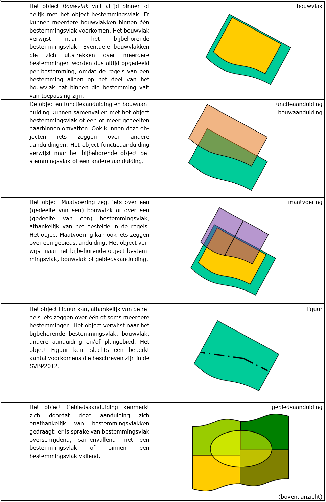

# Het informatiemodel toegelicht
**Het Informatiemodel Ruimtelijke Ordening verdeelt het bestemmingsplan in
objecten, klassen en subklassen. In dit hoofdstuk wordt het context van het
informatiemodel toegelicht.**

## De objectbenadering van een bestemmingsplan
Een bestemmingsplan bestaat uit drie typen objecten (klassen):
<ul><li>Bestemmingsplangebied;</li>
<li>Bestemmingsvlak;</li>
<li>Aanduiding.</li>
</ul> 

Het bestemmingsvlak is het gebied waarnaar de bijbehorende regels verwijzen en
is in samenhang daarmee te beschouwen als één geheel object. Aanduidingen
kunnen iets zeggen over het bestemmingsplangebied of een bestemmingsvlak.
IMRO2012 noemt deze objecttypen klassen. In Figuur 1 is de hoofd indeling
weergegeven.
  

**Figuur 1 Objectklassen bestemmingsplan**
  

De klasse *Aanduiding* kent objecten uit zes subklassen:  
<ul><li>Bouwvlak;</li>
<li>Functieaanduiding;</li>
<li>Bouwaanduiding;</li>
<li>Maatvoering;</li>
<li>Figuur;</li>
<li>Gebiedsaanduiding.</li>
</ul> 
In Figuur 2 is het complete schema weergegeven met alle onderscheiden objecten.
  

**Figuur 2 Objecten bestemmingsplan**
  

Elk object kent eigenschappen die als attribuut daaraan worden toegekend. In
IMRO2012 wordt in een zogenoemd UML-schema weergegeven hoe de objecten (klassen)
samenhangen en welke attributen mogelijk zijn. Voor diepgaandere informatie
wordt verwezen naar IMRO2012. Hier wordt volstaan met een algemeen beeld van het
model voor een goed begrip bij het coderen. In de volgende paragraaf wordt het
principe verder uitgewerkt.

## Structuur
De structuur van en tussen de objecten in het bestemmingsplan bestaat uit
verschillende lagen van geometrisch bepaalde objecten boven elkaar en
gerelateerd aan elkaar. Op een locatie is daardoor (mogelijk) een stapeling van
bestemming, dubbelbestemmingen en aanduidingen aanwezig. In de digitale
verbeelding wordt alle relevante bestemmingsplaninformatie in een interactieve
raadpleegomgeving getoond. Een raadpleger van het bestemmingsplan moet alle
relevante bestemmingsplaninformatie op eenvoudige wijze voor ogen kunnen
krijgen. Uit interactie met de digitale verbeelding blijkt welke bestemming
en/of aanduiding dat is en wat daarvan de inhoud is.

De basis wordt gevormd door het object *Bestemmingsvlak*. Veelal zal daaraan een
object *Bouwvlak* zijn gekoppeld. Vervolgens kunnen aanduidingen voorkomen die
een specificatie van het bestemmingsvlak of het bouwvlak geven voor het gebruik
of het bouwen. Iedere aanduiding moet ook in de regels voorkomen. Figuur 3 geeft
de laagsgewijze opbouw weer.
  

**Figuur 3 Opbouw objecten**
  

Naast deze direct bij een bestemmingsvlak behorende aanduidingen zijn er ook
aanduidingen die vanuit de regels gewenst zijn en betekenis geven aan een
onafhankelijke deel van het plangebied. Een voorbeeld is een
wijzigingsbevoegdheid voor een bepaald gedeelte van het plangebied. Voor een
dergelijke aanduiding wordt het object *Gebiedsaanduiding* gebruikt.
Hieronder wordt verder ingegaan op de onderscheiden objecten.
  

**Figuur 4 Onderscheid in objecten**
  

Voor een verdere beschrijving van de specifieke mogelijkheden die zijn
toegestaan om nadere invulling te geven aan de verschillende objecten wordt
verwezen naar de <a href='https://docs.geostandaarden.nl/ro/svbp' target='_blank'>Standaard Vergelijkbare Bestemmingsplannen (SVBP2012)</a>.

## Gemeente- en provinciegrensoverschrijdende bestemmingsplannen
Ingeval sprake is van een intergemeentelijk bestemmingsplan, een bestemmingsplan
dat door twee of meer gemeenten wordt opgesteld, stelt elk van de betreffende
gemeenten het bestemmingsplan vast voor zover het haar eigen grondgebied
betreft. Dit leidt ertoe dat er zelfstandige besluiten worden genomen met een
eigen planidentificatie. Het gevolg daarvan is dat in het kader van de
toepassing van deze praktijkrichtlijn twee afzonderlijke sets databestanden
ontstaan, elk voor het eigen gemeentelijk grondgebied en elk met een eigen
identiteit (attribuut *idn*).

Voor provinciegrens overschrijdende plannen geldt dat eveneens, voor zover deze
door meerdere provincies worden opgesteld. Voor door de provincie binnen haar
eigen grondgebied vallende inpassingsplannen en voor door het Rijk vast te
stellen inpassingsplannen geldt deze splitsing niet.

Om inzichtelijk te maken welke gemeenten (locatie) het betreft bij een
provinciaal of inpassingsplan van het rijk, moet het attribuut *locatienaam*
worden gebruikt om de betreffende gemeentenamen en in voorkomend geval
provincienamen te benoemen. Zie toelichting in Hoofdstuk 3: ["De planobjecten met
attributen"](#H03).

## Geometrie en/of tekst als ingang voor raadpleging
De voorliggende praktijkrichtlijn is gericht op de geometrie en opbouw van de
bestemmingsplannen. De geometrie (locatie) vormt hierbij de ingang voor het
raadplegen van het ruimtelijke plan.

Binnen de RO Standaarden 2012 is het gebruik van objectgerichte planteksten
(XML) onder voorwaarde verplicht. Bij het gebruik van objectgerichte planteksten
wordt het in de toekomst mogelijk om de tekst te laten fungeren als ingang voor
het raadplegen van het ruimtelijk plan binnen een interactieve
raadpleegomgeving.

In [Hoofdstuk 3](#H03) van deze praktijkrichtlijn worden de attributen voor planteksten
benoemd. Voor toelichting op het gebruik van de standaard voor planteksten
wordt verwezen naar de toelichting in de <a href='https://docs.geostandaarden.nl/ro/pt2012' target='_blank'>Praktijkrichtlijn voor
Planteksten (PRPT2012)</a>.

## Digitaal vs. analoog

De digitale verbeelding is de verbeelding van het bestemmingsplan in een
interactieve raadpleegomgeving, waarin alle relevante bestemmingsplaninformatie
wordt getoond: de combinatie van (plan)kaart en regels met de toelichting. Het
digitale bestemmingsplan is het juridisch authentieke bestemmingsplan. Volgens
het Bro wordt een bestemmingsplan met de daarbij behorende toelichting in een
samenhangende set geautoriseerde bronbestanden langs elektronische weg
vastgelegd.
  

De analoge bestemmingsplankaart van een bestemmingsplan is altijd een concreet
en afgerond product: een papieren (analoge) plankaart waarbij alle
bestemmingsplaninformatie volledig visueel tot de gebruiker moet komen. Naast de
analoge bestemmingsplankaart worden de planregels en plantoelichting ook in
analoge vorm opgeleverd. Van het bestemmingsplan bestaan dus 2 productvormen:
digitaal en analoog. Voor de wijze waarop de analoge bestemmingsplankaart wordt
opgesteld, is binnen de RO Standaarden 2012 een aparte, facultatief te
gebruiken; de <a href='https://docs.geostandaarden.nl/ro/abpk2012' target='_blank'>Praktijkrichtlijn Analoge Bestemmingsplan
Kaart (PRABPK2012)</a>.

## Metadata
In de voorgaande paragrafen is het IMRO met betrekking tot het bestemmingsplan
toegelicht. Wanneer het bestemmingsplan digitaal wordt vastgelegd bestaat deze
uit een set van verschillende bestanden: de dataset. STRI2012 geeft regels met
betrekking tot deze bestanden.

In het GML bestand is bepaalde informatie over het bestemmingsplan opgenomen.
Ook in het geleideformulier en manifest is bepaalde informatie over het
bestemmingsplan opgenomen. Gegevens over gegevens wordt metadata genoemd. In
IMRO2012 zijn bij de klasse *MetadataIMRObestand* regels opgenomen over de
in het GML bestand op te nemen metadata. In Tabel 1 wordt de klasse
*MetadataIMRObestand* toegelicht.

<table id="d4e36" style="width: 100%;"><caption> KlasseMetadataIMRObestand 1*</caption><colgroup><col id="col1" style="width: 28.57142857142857%;"></col><col id="col2" style="width: 38.775510204081634%;"></col><col id="col3" style="width: 4.081632653061225%;"></col><col id="col4" style="width: 28.57142857142857%;"></col></colgroup><thead valign="top"><tr><th align="left" style="border-top: 0.5pt solid #000000; border-left: 0.5pt solid #000000; border-bottom: 0.5pt solid #000000; border-right: 0.5pt solid #000000; background-color: none;">
Metadata attribuut
</th><th align="left" style="border-top: 0.5pt solid #000000; border-left: 0.5pt solid #000000; border-bottom: 0.5pt solid #000000; border-right: 0.5pt solid #000000; background-color: none;">
waarde
</th><th align="left" style="border-top: 0.5pt solid #000000; border-left: 0.5pt solid #000000; border-bottom: 0.5pt solid #000000; border-right: 0.5pt solid #000000; background-color: none;">
*
</th><th align="left" style="border-top: 0.5pt solid #000000; border-left: 0.5pt solid #000000; border-bottom: 0.5pt solid #000000; border-right: 0.5pt solid #000000; background-color: none;">
opmerking
</th></tr></thead><tbody valign="top"><tr><td align="left" style="border-top: 0.5pt solid #000000; border-left: 0.5pt solid #000000; border-bottom: 0.5pt solid #000000; border-right: 0.5pt solid #000000; background-color: none;">
datasetTitel
</td><td align="left" style="border-top: 0.5pt solid #000000; border-left: 0.5pt solid #000000; border-bottom: 0.5pt solid #000000; border-right: 0.5pt solid #000000; background-color: none;">
naam van de dataset of dataset serie
</td><td align="center" style="border-top: 0.5pt solid #000000; border-left: 0.5pt solid #000000; border-bottom: 0.5pt solid #000000; border-right: 0.5pt solid #000000; background-color: none;">
1
</td><td align="left" style="border-top: 0.5pt solid #000000; border-left: 0.5pt solid #000000; border-bottom: 0.5pt solid #000000; border-right: 0.5pt solid #000000; background-color: none;">
dit komt overeen met de naam van het plan/besluit
</td></tr><tr><td align="left" style="border-top: 0.5pt solid #000000; border-left: 0.5pt solid #000000; border-bottom: 0.5pt solid #000000; border-right: 0.5pt solid #000000; background-color: none;">
creatiedatum
</td><td align="left" style="border-top: 0.5pt solid #000000; border-left: 0.5pt solid #000000; border-bottom: 0.5pt solid #000000; border-right: 0.5pt solid #000000; background-color: none;">
datum waarop het bestand gemaakt is
</td><td align="center" style="border-top: 0.5pt solid #000000; border-left: 0.5pt solid #000000; border-bottom: 0.5pt solid #000000; border-right: 0.5pt solid #000000; background-color: none;">
1
</td><td align="left" style="border-top: 0.5pt solid #000000; border-left: 0.5pt solid #000000; border-bottom: 0.5pt solid #000000; border-right: 0.5pt solid #000000; background-color: none;">
in de vorm: jjjj-mm-dd
</td></tr><tr><td align="left" style="border-top: 0.5pt solid #000000; border-left: 0.5pt solid #000000; border-bottom: 0.5pt solid #000000; border-right: 0.5pt solid #000000; background-color: none;">
bronbeheerder
</td><td align="left" style="border-top: 0.5pt solid #000000; border-left: 0.5pt solid #000000; border-bottom: 0.5pt solid #000000; border-right: 0.5pt solid #000000; background-color: none;">
partij die verantwoordelijkheid heeft geaccepteerd en zorg draagt voor het beheer van de data
</td><td align="center" style="border-top: 0.5pt solid #000000; border-left: 0.5pt solid #000000; border-bottom: 0.5pt solid #000000; border-right: 0.5pt solid #000000; background-color: none;">
1
</td><td align="left" style="border-top: 0.5pt solid #000000; border-left: 0.5pt solid #000000; border-bottom: 0.5pt solid #000000; border-right: 0.5pt solid #000000; background-color: none;">
naam van gemeente,

provincie, of ministerie(s)
</td></tr><tr><td align="left" style="border-top: 0.5pt solid #000000; border-left: 0.5pt solid #000000; border-bottom: 0.5pt solid #000000; border-right: 0.5pt solid #000000; background-color: none;">
codeerVerantwoordelijke
</td><td align="left" style="border-top: 0.5pt solid #000000; border-left: 0.5pt solid #000000; border-bottom: 0.5pt solid #000000; border-right: 0.5pt solid #000000; background-color: none;">
diegene die verantwoordelijk is voor de IMRO-codering
</td><td align="center" style="border-top: 0.5pt solid #000000; border-left: 0.5pt solid #000000; border-bottom: 0.5pt solid #000000; border-right: 0.5pt solid #000000; background-color: none;">
1
</td><td align="left" style="border-top: 0.5pt solid #000000; border-left: 0.5pt solid #000000; border-bottom: 0.5pt solid #000000; border-right: 0.5pt solid #000000; background-color: none;">
naam van organisatie, afdeling, bedrijf
</td></tr><tr><td align="left" style="border-top: 0.5pt solid #000000; border-left: 0.5pt solid #000000; border-bottom: 0.5pt solid #000000; border-right: 0.5pt solid #000000; background-color: none;">
naamApplicatieschema
</td><td align="left" style="border-top: 0.5pt solid #000000; border-left: 0.5pt solid #000000; border-bottom: 0.5pt solid #000000; border-right: 0.5pt solid #000000; background-color: none;">
gebruikt applicatieschema / informatiemodel
</td><td align="center" style="border-top: 0.5pt solid #000000; border-left: 0.5pt solid #000000; border-bottom: 0.5pt solid #000000; border-right: 0.5pt solid #000000; background-color: none;">
1
</td><td align="left" style="border-top: 0.5pt solid #000000; border-left: 0.5pt solid #000000; border-bottom: 0.5pt solid #000000; border-right: 0.5pt solid #000000; background-color: none;">
in dit geval IMRO2012
</td></tr><tr><td align="left" style="border-top: 0.5pt solid #000000; border-left: 0.5pt solid #000000; border-bottom: 0.5pt solid #000000; border-right: 0.5pt solid #000000; background-color: none;">
codeReferentiesysteem
</td><td align="left" style="border-top: 0.5pt solid #000000; border-left: 0.5pt solid #000000; border-bottom: 0.5pt solid #000000; border-right: 0.5pt solid #000000; background-color: none;">
alfanumerieke waarde die het gebruikte referentiesysteem van de dataset aangeeft
</td><td align="center" style="border-top: 0.5pt solid #000000; border-left: 0.5pt solid #000000; border-bottom: 0.5pt solid #000000; border-right: 0.5pt solid #000000; background-color: none;">
1
</td><td align="left" style="border-top: 0.5pt solid #000000; border-left: 0.5pt solid #000000; border-bottom: 0.5pt solid #000000; border-right: 0.5pt solid #000000; background-color: none;">
hier wordt een code ingevuld afkomstig van de EPSG (European Petrol Survey Group): RD is het verplichte referentiesysteem met de code: 28992
</td></tr><tr><td align="left" style="border-top: 0.5pt solid #000000; border-left: 0.5pt solid #000000; border-bottom: 0.5pt solid #000000; border-right: 0.5pt solid #000000; background-color: none;">
toepassingsschaal
</td><td align="left" style="border-top: 0.5pt solid #000000; border-left: 0.5pt solid #000000; border-bottom: 0.5pt solid #000000; border-right: 0.5pt solid #000000; background-color: none;">
de beoogde maximale schaal waarop het bestand waarheidsgetrouw gebruikt mag worden; dit moet een positief numeriek getal zijn
</td><td align="center" style="border-top: 0.5pt solid #000000; border-left: 0.5pt solid #000000; border-bottom: 0.5pt solid #000000; border-right: 0.5pt solid #000000; background-color: none;">
1
</td><td align="left" style="border-top: 0.5pt solid #000000; border-left: 0.5pt solid #000000; border-bottom: 0.5pt solid #000000; border-right: 0.5pt solid #000000; background-color: none;">
bijvoorbeeld: 500 voor een bestand dat maximaal op schaal 1 : 500 gebruikt mag worden
</td></tr><tr><td align="left" style="border-top: 0.5pt solid #000000; border-left: 0.5pt solid #000000; border-bottom: 0.5pt solid #000000; border-right: 0.5pt solid #000000; background-color: none;">
applicatieIdentificatie
</td><td align="left" style="border-top: 0.5pt solid #000000; border-left: 0.5pt solid #000000; border-bottom: 0.5pt solid #000000; border-right: 0.5pt solid #000000; background-color: none;">
aanduiding van applicatie en versienummer
</td><td align="center" style="border-top: 0.5pt solid #000000; border-left: 0.5pt solid #000000; border-bottom: 0.5pt solid #000000; border-right: 0.5pt solid #000000; background-color: none;">
1
</td><td align="left" style="border-top: 0.5pt solid #000000; border-left: 0.5pt solid #000000; border-bottom: 0.5pt solid #000000; border-right: 0.5pt solid #000000; background-color: none;">
waarmee het bestand gecodeerd is
</td></tr><tr><td align="left" style="border-top: 0.5pt solid #000000; border-left: 0.5pt solid #000000; border-bottom: 0.5pt solid #000000; border-right: 0.5pt solid #000000; background-color: none;">
versieXMLschema
</td><td align="left" style="border-top: 0.5pt solid #000000; border-left: 0.5pt solid #000000; border-bottom: 0.5pt solid #000000; border-right: 0.5pt solid #000000; background-color: none;">
versie van het XML schema definitiebestand (XSD)
</td><td align="center" style="border-top: 0.5pt solid #000000; border-left: 0.5pt solid #000000; border-bottom: 0.5pt solid #000000; border-right: 0.5pt solid #000000; background-color: none;">
1
</td><td align="left" style="border-top: 0.5pt solid #000000; border-left: 0.5pt solid #000000; border-bottom: 0.5pt solid #000000; border-right: 0.5pt solid #000000; background-color: none;">
in het XSD vastgelegd als &lt;version="versiecode"&gt;
</td></tr><tr><td align="left" style="border-top: 0.5pt solid #000000; border-left: 0.5pt solid #000000; border-bottom: 0.5pt solid #000000; border-right: 0.5pt solid #000000; background-color: none;" colspan="4">
*  multipliciteit:

0:   komt niet voor    0..1:   komt 0 of 1 keer voor            0..n:   komt zo vaak voor als gewenst

1:   komt 1 keer voor        1..n:   komt tenminste 1 keer voor
</td></tr></tbody></table>

**toepassingsschaal**  
Bestemmingsplannen worden vastgelegd in bestemmingen en bijbehorende
aanduidingen die geometrisch zijn bepaald op basis van het Rijksdriehoekstelsel
(RD-coördinaten). Daarvoor is de schaal in principe niet van belang. Bij de
digitale en analoge verbeelding is de schaal waarop (gedeelten van) het plan
zinvol kunnen worden weergegeven wel van belang. Daarom wordt in de metagegevens
van de dataset de maximale schaal meegegeven waarop het plan zinvol ver­beeld
mag worden.
