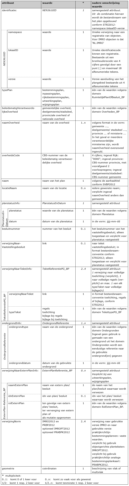
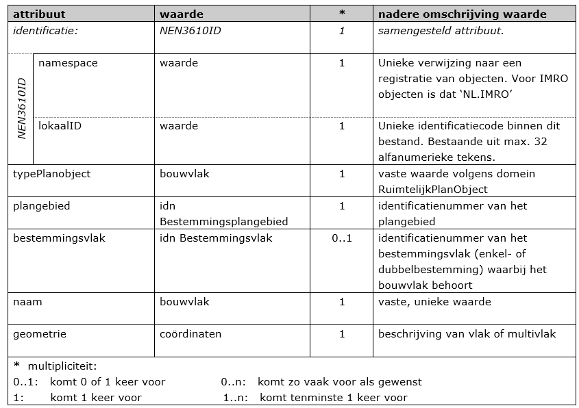
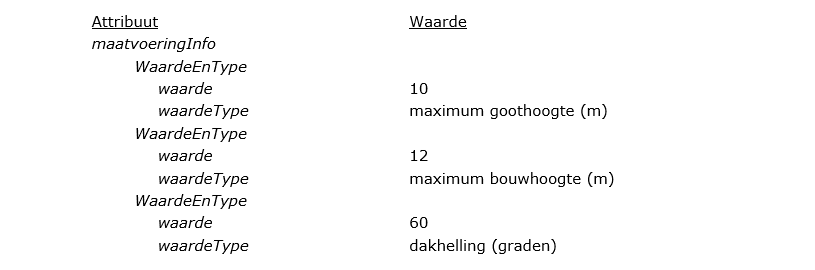
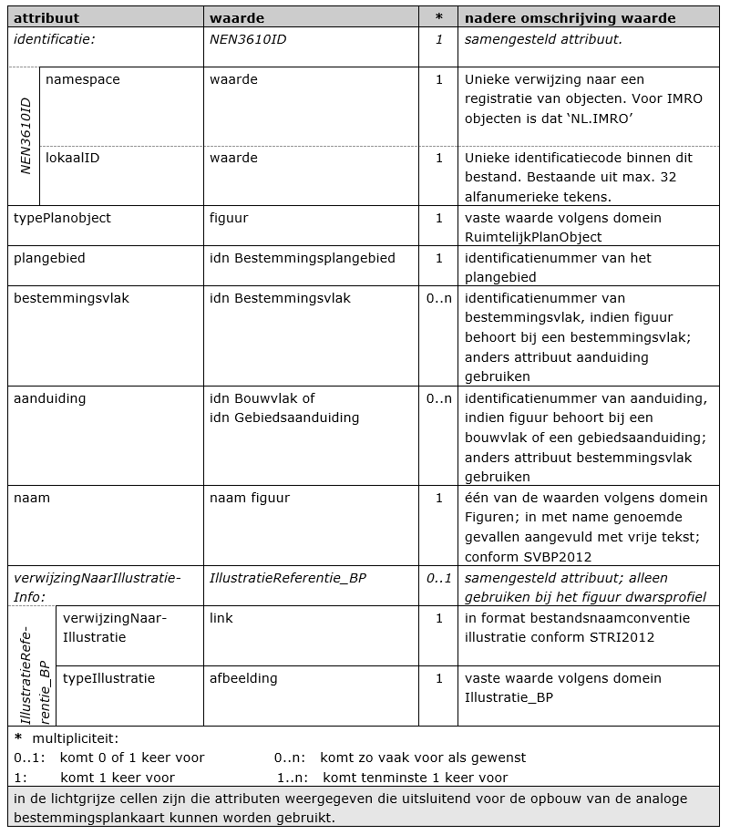

# De planobjecten met attributen

**Een klasse, te beschouwen als een objecttype, kent attributen die de
eigenschappen van dat objecttype geven. In dit hoofdstuk worden de
(sub)klassen (objecttypen) met bijbehorende attributen beschreven.**

## Klasse Bestemmingsplangebied

Het object (de klasse) *Bestemmingsplangebied* is het object dat het gebied, of
de gebieden, binnen de plangrenzen geometrisch representeert. Aan dit object
worden de algemene eigenschappen van het plangebied als attribuut gekoppeld.

In Tabel 2 zijn de attributen benoemd, de waarden aangegeven die deze attributen
kunnen bevatten en wordt aangegeven of het gebruik van het attribuut verplicht
is en of het attribuut meerdere malen mag worden gebruikt (multipliciteit). Ook
is aangegeven of het samengestelde attributen betreffen, dat wil zeggen altijd
in samenhang moeten worden gebruikt. Na de tabel is per attribuut een nadere
toelichting gegeven.

**Tabel 2 Klasse Bestemmingsplangebied 1\***

**identificatie** (verplicht):  
Ieder ruimtelijk instrument kent een eigen identificatienummer (idn). Deze
identificatie maakt het mogelijk dat op landelijk niveau een uniek onderscheid
voor ieder instrument aanwezig is. Voor het geval het werkingsgebied bestaat uit
meerdere ruimtelijk gescheiden gebieden kent het totaal van die gebieden één
identificatienummer. De geometrie van het object *Bestemmingsplangebied* is
hierbij een multipolygoon.
Het samengestelde attribuut verwijst naar het object NEN3610ID bestaande uit de
attributen *namespace, lokaalID* en *versie*.  
-	 **namespace:** (verplicht)  
Een unieke verwijzing naar een registratie van objecten. Voor IMRO objecten
is dat ‘NL.IMRO’.  
- 	**lokaalID:** (verplicht)  
Unieke identificatiecode binnen de registratie van ruimtelijke plannen.
Bestaande uit een bronhouderscode van 4 cijfers (voor het Rijk 0000, voor
gemeente het CBS-nummer) gevolgd door een punt (.) en maximaal door de
bronhouder te bepalen 18 alfanumerieke tekens. Er geldt de volgende
reguliere expressie: [0-9]{4}\\.[A-Za-z0-9]{1,18}  
-	**Versie:** (verplicht)
Versie-aanduiding van het plangebied bestaande uit 4 alfanumerieke tekens
door de bronhouder te bepalen. Er geldt de volgende reguliere expressie:
[A-Za-z0-9]{4}
Uit de waarden van de attributen *namespace, lokaalID* en *versie* wordt de
bestandsnaam van het plan opgebouwd conform STRI2012:
namespace.lokaalID-versie. De samengestelde reguliere expressie is:
NL\\.IMRO\\.[0-9]{4}\\.[A-Za-z0-9]{1,18}-[A-Za-z0-9]{4}

**typePlan** (verplicht):  
Voor het attribuut *typePlan* wordt het domein *RuimtelijkPlanOfBesluit_BP*
gebruikt. Voor de waarde zijn er vijf mogelijkheden waaruit er één moet worden
gekozen. De mogelijkheden zijn opgenomen in Tabel 3.

**Tabel 3 Type plan**

**beleidsmatigVerantwoordelijkeOverheid** (verplicht):  
Hier wordt de overheid die beleidsmatig verantwoordelijk is voor het opstellen
van het plan opgeno­men uit het domein *Overheden_BP.* In dit geval een van de
volgende vaste waarden:  
-   gemeentelijke overheid;
-   deelgemeente/stadsdeel;
-   provinciale overheid of
-   nationale overheid.

**naamOverheid** (verplicht):  
Hier wordt de naam van de beleidsmatig verantwoordelijke overheid opgenomen, in
de vorm van de tekst “gemeente …….”, “deelgemeente ……”, "stadsdeel ……",
“provincie …….” of “ministerie …….”. In het geval er meerdere verantwoordelijke
ministeries zijn, wordt naamOverheid evenzoveel ingevuld,

**overheidsCode** (verplicht):  
Om inzichtelijk te maken van welke beleidsmatig verantwoordelijke overheid het
bestemmingsplan is, wordt hier het viercijferige CBS-nummer van die overheid
opgenomen. Voor deelgemeenten/stadsdelen wordt het nummer gebruikt van de
gemeente waartoe zij behoren. Voor de provincies worden, voorafgaand aan het
CBS-nummer van de provincie, twee voorloopnegens geplaatst, zodat de totale
lengte 4 posities bedraagt. Voor het Rijk wordt het nummer "0000" gebruikt.

**naam** (verplicht):  
In het waardeveld van het attribuut *naam* dient de volledig naam van het
bestemmingsplan te worden opgenomen zoals deze in de Slotregel in de planregels
is opgenomen. De volledige naam is gelijk aan de aanhaaltitel in de planregels,
conform SVBP2012.

**locatieNaam** (indien gewenst / voorwaardelijk verplicht):  
Het kan gewenst zijn om de geografische naam van de locatie waarbinnen het
bestemmingsplan zich bevindt kenbaar te maken. De naam (namen) van die locatie
kan bij dit attribuut worden ingevuld. Bij een bestemmingsplan buitengebied zal
bijvoorbeeld veelal geen locatienaam behoren, bij een bestemmingsplan voor
stedelijk gebied mogelijk wel.  
Het is noodzakelijk (verplicht) het attribuut *locatieNaam* te gebruiken voor
zover het een inpassingsplan betreft dat door een provincie of door het Rijk
wordt opgesteld. In dat geval worden bij dit attribuut alle provincienamen en
gemeentenamen opgenomen waarbinnen het bestemmingsplan valt.

***planstatusInfo*** (verplicht):

Dit attribuut is noodzakelijk om de plangegevens te kunnen plaatsen naar tijd en
belang. Het samengesteld attribuut *planstatusInfo* verwijst naar het object
*PlanstatusEnDatum*, bestaande uit de attributen:  
-	**planstatus** (verplicht)  
Het domein *Planstatus* geeft de toegestane waarden voor het attribuut *planstatus* waaruit er één moet worden gekozen. De waarde van dit attribuut
geeft de planstatus weer.  
-	**datum** (verplicht)  
Het attribuut *datum* is bedoeld om de proceduredatum van het plan op te
nemen. De in het waardeveld op te nemen datum dient overeenkomstig het in
IMRO2012 afgesproken datumformaat te worden genoteerd: jjjj-mm-dd.

**besluitnummer** (onder voorwaarde verplicht):  
Nummer van het vaststellingsbesluit van het plan. Het besluitnummer is alleen
toegestaan en verplicht indien de planstatus *vastgesteld*.

**verwijzingNaarVaststellingsbesluit** (onder voorwaarde verplicht):  
Hierin wordt een link opgenomen naar de tekst van het vaststellingsbesluit. In
het format volgens de bestandsnaamconventie *vaststellingsbesluit* conform de
STRI2012. De link is alleen verplicht bij de planstatus *vastgesteld*. Bij een
andere (eerdere) planstatus is dit attribuut niet toegestaan. Aan het bestand
kunnen indien gewenst ook door de bronhouder andere relevant geachte stukken,
die voor een goed begrip nodig kunnen zijn, zoals het raadsvoorstel, worden
toegevoegd.

***verwijzingNaarTekstInfo*** (verplicht):  
Dit attribuut verwijst naar het samengestelde attribuut *TekstReferentiePG_BP*,
bestaande uit de attributen *verwijzingNaarTekst* en *typeTekst*.  
Het attribuut wordt met de volgende cardinaliteit opgenomen:  
- 1 verwijzing naar volledige toelichting.
- 1 verwijzing naar volledige regels.
- 0..2 verwijzing naar elk typeTekst volledige bijlagen.  
Teneinde een zo beperkt mogelijk aantal verwijzingen naar teksten te verkrijgen
is het aantal keren dat het attribuut *verwijzingNaarTekstInfo* mag worden
gebruikt beperkt. De raadpleger van de plannen heeft daar baat bij, omdat hij
dan niet direct geconfronteerd wordt met een mogelijk lange lijst van
verwijzingen. Daarom moet er maximaal één verwijzing zijn naar de volledige
toelichting en maximaal één naar de volledige regels. Daarnaast mag er maximaal
één verwijzing zijn naar alle eventuele bijlagen, gegroe­peerd naar bijlage(n)
bij toelichting en bijlage(n) bij regels. Er mag worden verwezen naar een
inhoudsop­gave of index, waardoor indirect meer mogelijkheden aanwezig zijn.
De bronhouder kiest voor het al dan niet gebruik van objectgerichte planteksten.
In beide gevallen wordt dit attribuut *verwijzingNaarTekstInfo* gebruikt. De
keuze voor XML of HTML/PDF planteksten geldt niet alleen voor het
bestemmingsplangebied, de keuze geldt ook voor de andere objecten (bestemmingen/
aanduidingen) binnen het bestemmingsplan. Daarnaast wordt de keuze vastgelegd
met behulp van het attribuut *verwijzingNorm* bij Bestemmingsplangebied van dit
bestemmingsplan. Het format dient overeenkomstig de afspraak over de
bestandsnaamconventies conform de STRI2012 te zijn.  
-	**verwijzingNaarTekst** (verplicht)  
De waarde van dit attribuut is een (hyper)link naar het soort document dat
is aangegeven bij het attribuut *typeTekst*. Er wordt in de waarde geen
elementen van een directory structuur/pad opgenomen.  
-	**typeTekst** (verplicht)  
Hiermee wordt aangegeven om wat voor type tekst het gaat. Per verwijzing
naar tekst dient gekozen te worden uit een van de volgende waarden van het
domein *TeksttypePG_BP*:  
	-	regels  
	-	toelichting  
	-	bijlage bij regels  
	-	bijlage bij toelichting

***ondergrondInfo*** (verplicht, zo vaak als gewenst):  
Dit attribuut verwijst naar het samengestelde attribuut *Ondergrondreferentie*,
bestaande uit de attributen *ondergrondtype* en *ondergronddatum.* Met dit
attribuut wordt, conform artikel 1.2.4 Bro, aangegeven welke ondergrond bij het
vaststellen van het bestemmingsplan is gebruikt.
Er zijn meerdere waarden mogelijk.

- **ondergrondtype** (verplicht)  
	-	Het type van de gebruikte ondergrond volgens het domein *Ondergronden*. Op
    grond van de Wet basisregistratie grootschalige topografie (BGT) is het per
    1 juli 2017 voor bestuursorganen verplicht om gebruik te maken van de **Basisregistratie Grootschalige Topografie (BGT).** Een bestuursorgaan kan
    daar indien nodig gemotiveerd van afwijken. Bij afwijking kan het
    bestuursorgaan gebruik maken van: basisregistratie topografie (BRT)  
	-	basisregistratie kadaster (BRK)  
Indien geen gebruik is gemaakt van een ondergrond uit het domein
Ondergronden, dan wordt de naam van het bestand van de gebruikte
ondergrond(en) als vrije tekst opgegeven. In de [PRTRI2012](https://www.geonovum.nl/geo-standaarden/ro-standaarden-ruimtelijke-ordening), hoofdstuk 7, is
toegelicht welke bestandformaten voor de ondergrond kunnen worden gebruikt.  
- **ondergronddatum** (verplicht)  
De datum van de gebruikte ondergrond.

***verwijzingNaarExternPlanInfo*** (onder voorwaarde verplicht):  
Dit attribuut betreft een verwijzing naar het externe plan waar het type plan
een gevolg van is. De verwijzing naar het externe plan wordt verplicht opgenomen
bij het *typePlan*:  
-   uitwerkingsplan;  
-   wijzigingsplan.

Bij de waarde van het typePlan bestemmingsplan, inpassingsplan en
rijksbestemmingsplan mag het attribuut *verwijzingNaarExternPlanInfo* worden
gebruikt. Een ander ruimtelijk plan of besluit, zoals een aanwijzingsbesluit,
kan juist de aanleiding zijn voor dit nieuwe bestemmingsplan, inpassingsplan of
rijksbestemmingsplan. In dat geval kan de bronhouder dit aan de informatie van
het plan toevoegen met behulp van het attribuut *verwijzingNaarExternPlanInfo*.  
Het attribuut verwijst naar het samengestelde attribuut *ExternPlanReferentie*,
bestaande uit de attributen *naamExternPlan*, *idnExternPlan* en *rolExternPlan.*  
- **naamExternPlan** (verplicht)  
Hier wordt de naam van het externe plan waarnaar verwezen wordt opgegeven.
In het geval een *typePlan* uitwerkingsplan of wijzigingsplan is, wordt de
naam van het bestemmingsplan opgenomen waarvan dit een uitwerking of
wijziging.  
- **idnExternPlan** (indien bekend)  
Met dit attribuut wordt de identificatie (idn) van het externe plan waarnaar
wordt verwezen opgenomen.  
- **rolExternPlan** (verplicht)  
Hierin wordt de betekenis van het externe plan ten opzichte van het hier
betreffende plan vastgelegd. Het betreft hier een van de volgende vaste
waarden uit het domein *RolExternPlan_BP*:  
	-	*ten gevolge van extern plan* in geval van bijvoorbeeld een uitwerkings- of
    wijzigingsplan, of in geval van een aanwijzingsbesluit, en dergelijke;  
	-	*ter vervanging van extern plan* voor het geval het een gedeeltelijke
    herziening van een bestemmingsplan betreft, als uiteengezet in [Hoofdstuk 4](#H04)
    van deze praktijkrichtlijn;  
	-	*als mutatie opgenomen* voor het geval er sprake is van een"geconsolideerd
    plan ", als uiteengezet in Hoofdstuk 4 van deze praktijkrichtlijn.

**verwijzingNorm** (verplicht):  
Teneinde de zekerheid te hebben welke technische status de data hebben, is het
noodzakelijk dat wordt aangegeven aan welke IMRO versie de gegevensset voldoet.
Tevens moet een verwijzing worden opgenomen naar de gebruikte versie van de
praktijkrichtlijn. In het geval objectgerichte planteksten (XML) onderdeel zijn
van het bestemmingsplan, dan wordt ook de verwijzing naar de standaard voor
planteksten opgenomen.

Het attribuut *verwijzingNorm* dient minimaal twee keer te worden opgenomen
met de verwijzing naar de betreffende versies in het waardeveld: IMRO2012 en
PRBP2012. Bij het gebruik van objectgerichte planteksten in dit ruimtelijk plan
moet ook worden opgenomen: IMROPT2012. Indien gebruik wordt gemaakt van een
vaste weergave voor de analoge bestemmingsplankaart wordt ook de verwijzing naar
de PRABPK2012 opgenomen bij het bestemmingsplangebied: PRABPK2012. In dat geval
geldt het gebruik van de opmaak van de analoge bestemmingsplan kaartconform
PRABPK2012 voor dit gehele bestemmingsplan.

**geometrie** (verplicht):  
Het object *Bestemmingsplangebied* kent uitsluitend de geometrie van een vlak of
multivlak (multipolygoon). Dit attribuut kent coördinaten in een vastgesteld
format (GML).

## Klasse Bestemmingsvlak

Het bestemmingsvlak is het belangrijkste object (klasse) binnen het
bestemmingsplangebied. De eigenschappen van dit object worden bepaald door een
aantal attributen dat aan dat object wordt gekoppeld.

In Tabel 4 zijn de attributen benoemd, waarbij per attribuut is aangege­ven
welke waarde gewenst is, welke dit moet zijn, of het gebruik van het attribuut
verplicht is, of het attribuut meerdere keren mag voorkomen en hoe de waarde,
al dan niet automatisch, wordt ingevoerd. Het object Bestemmingsvlak is niet
verplicht indien het *typePlan* een inpassingsplan of wijzigingsplan betreft.
Ook is aangegeven of attributen gekoppeld zijn, dat wil zeggen altijd in
samenhang moeten worden gebruikt. Na de tabel is per attribuut een toelichting
gegeven.

**Tabel 4 Klasse Bestemmingsvlak 1..n\***

**identificatie (idn)** (verplicht):  
Elk object *Bestemmingsvlak* krijgt een eigen unieke identificatie binnen het
bestemmingsplan. Het samengestelde attribuut *identificatie* verwijst naar het
object NEN3610ID bestaande uit de attributen *namespace* en *lokaalID*.  
- **namespace:** (verplicht)  
Een unieke verwijzing naar een registratie van objecten. Voor IMRO objecten
is dat ‘NL.IMRO’.  
- **lokaalID:** (verplicht)  
Door de bronhouder te bepalen unieke identificatiecode binnen de context van
het bestand bestaande uit maximaal 32 alfanumerieke tekens. Toegestane
tekens: {”A”…”Z”, “a”…”z”, ”0”…”9”, “_”, “- “, “,”, ”.”}.

**typePlanobject** (verplicht):  
Het attribuut *typePlanobject* maakt het via het bijbehorende domein
*RuimtelijkPlanobject* mogelijk aan te geven welk object het betreft. Dit
domein kent daarvoor twee waarden: enkelbestemming en dubbelbestemming. Daaruit
moet worden gekozen.
"Enkel"bestemmingen zijn te allen tijde tezamen vlakdekkend binnen het
plangebied. Bij inpassingsplannen, bestemmingsplanherzieningen die alleen iets
toevoegen aan of verwijderen uit de vigerende bestemmingen en/of bijbehorende
regels is de vereiste van een door enkelbestemming vlakdekkend plangebied niet
van toepassing. Ook bij een wijzigingsplan hoeft het plangebied niet volledig te
worden bedekt door enkelbestemmingen. Conform IMRO is het toegestaan in deze
situaties de bestemming achterwege te laten. Doorgaans heeft het de voorkeur wel
een bestemming op te nemen, die van toepassing wordt verklaard in de planregels,
waar vervolgens wordt verwezen (met identificatienummer) naar het oorspronkelijk
plan. De volledige regels hoeven daardoor niet te worden overgenomen. Of
bestemmingen met bijbehorende regels wel/ niet worden opgenomen is aan de
bronhouder te bepalen en in de planregels te verantwoorden.
Bestemmingen kunnen ook de vorm van een zogenoemde dubbelbestemming hebben.
Onder een dubbelbestemming wordt een aparte bestemming verstaan die (een)
andere bestemming(en) willekeurig overlapt. Een voorbeeld kan de bestemming
"Leiding - Gas” zijn, die andere bestemmingen overlapt. In geval van
bijvoorbeeld de bestemming "Gemengd" is evenwel geen sprake van een
dubbelbestemming maar van meerdere bestemmingsfuncties binnen één bestemming.
Uit overweging van herkenbaarheid van een dubbelbestemming ten opzichte van de
enkelbestemming is het gewenst om deze als apart object te kunnen onderscheiden.
Voor dubbelbestemmingen geldt dat deze op gelijke wijze worden gecodeerd als
een enkelbestemming.

**plangebied** (verplicht):  
Voor elk object is een verwijzing noodzakelijk naar het object
*Bestemmingsplangebied* waar het object deel van uitmaakt. Dit attribuut
verwijst daartoe naar het attribuut *identificatie* van het bijbehorende object
*Bestemmingsplan­gebied*.

**naam** (verplicht):  
Iedere bestemming heeft een naam. Aan het attribuut *naam* wordt als waarde de
volledige naam van de bestemming, zoals deze luidt in de bestemmingsregel die
ernaar verwijst, meegegeven. De wijze waarop de naam van een bestemming tot
stand komt, is bepaald in de SVBP2012. Voor de naam van een bestemming zijn vier
varianten mogelijk:  
1.  Naam van de hoofdgroep hanteren. *Voorbeeld: Agrarisch*  
2.  Specifieke bestemmingsbenaming gebruiken. *Voorbeeld: Agrarisch - Akkerbouw*  
3.  Bestemming splitsen. *Voorbeeld : Gemengd - 1*  
4.  Bestemming onder de hoofdgroep Overig. *Voorbeeld: Enclave*

De systematiek van hoofdgroepen van bestemmingen in de SVBP2012 laat het toe een
bestemming te specificeren en slechts één of enkele functies van een hoofdgroep
binnen een bestemming mogelijk te maken.
Indien een functie niet in de lijst van de SVBP2012 voorkomt, dan dient
aansluiting te worden gezocht bij de meest passende hoofdgroep. Selectiviteit
kan gewenst zijn, zeker in geval van hoofdgroepen waarbij een veelheid aan
uiteenlopende hoofdfuncties aan de orde is. Denk hierbij aan hoofdgroepen zoals
Cultuur en Ontspanning en Maatschappelijk.
In de hoofdgroep Leiding komt zowel hoogspanning als hoogspanningsverbinding
voor. Het verschil tussen deze dubbelbestemmingen is dat een Leiding –
Hoogspanning een ondergrondse leiding betreft. Een Leiding -
Hoogspanningsverbinding betreft een bovengronds leiding.
Tot slot komen binnen veel hoofdgroepen ondergeschikte functies voor, zoals
groen, wegen, paden en water. Deze zijn niet bepalend voor de keuze van de
hoofdgroep. Bepalend voor die keuze zijn de genoemde hoofdfunctie(s).
Ondergeschikte, bij de hoofdfunctie(s) behorende functies kunnen altijd, naar
gelang de behoefte, aan de bestemmingsomschrijving worden toegevoegd, ook als
zij niet bij de betrokken hoofdgroep worden vermeld. Hetzelfde geldt voor
functies die ten dienste staan van de functie op basis waarvan de bestemming is
gekozen. Hierbij kan worden gedacht aan de combinatie sport en daaraan
ondergeschikte horeca en de combinatie bedrijf en daaraan ondergeschikte
detailhandel (bijvoorbeeld in ter plaatse vervaardigde goederen).
Een (dubbel)bestemming geeft aan waarvoor de gronden mogen worden gebruikt. Het
zijn zaken die men aan kan raken, in de grond aanwezig zijn of zichtbaar zijn.

**bestemmingshoofdgroep** (verplicht):  
Bij de SVBP2012 is een functielijst opgenomen. Bij de functies zijn hoofdgroepen
vermeld waarmee functies worden ge­kop­peld aan een hoofdgroep waaronder deze
bestemming moet worden gerangschikt. Daarbij wordt on­derscheid gemaakt in
(enkel)bestemmingen en dubbelbestemmingen. Deze lijsten zijn tevens in het
IMRO2012 opgenomen als do­meinlijsten.
Het attribuut *bestemmingshoofdgroep* is bedoeld om de gebruikte bestemming te
relateren aan de betreffende hoofdgroep. Dit geschiedt door in het waardeveld de
naam van de betref­fende hoofd­groep op te nemen. Het domein *Bestemmingshoofdgroep_E* geeft de mogelijke waar­den weer voor
(enkel)bestemmingen waaruit moet worden gekozen. Het domein *Bestemmingshoofdgroep_D* geeft de mogelijke waar­den weer voor
dubbelbestemmingen waaruit moet worden gekozen. In het attribuut *typePlanobject* is opgenomen of het een enkelbestemming dan wel een
dubbelbestemming betreft.
Voor het geval de bestemming een voorlopige bestemming betreft, wordt alleen de
voorlopige bestemming gebruikt om de bijbehorende hoofdgroep te bepalen.

**artikelnummer** (verplicht):  
Het artikelnum­mer wordt als waarde bij het attri­buut *artikelnummer*
meegege­ven. Het format van het arti­kelnummer is voorgeschreven in de SVBP2012.

***verwijzingNaarTekstInfo*** (verplicht):  
Het attribuut is bedoeld voor het verwijzen naar het specifieke artikel dat
behoort bij het betreffende object *Bestemmingsvlak*. Het attribuut verwijst
naar het samengestelde attribuut *TekstReferentie_BP*, bestaande uit de
attributen *verwijzingNaarTekst* en *typeTekst*.
De bronhouder kiest voor dezelfde vorm van planteksten als bij het object *Bestemmingsplangebied*: objectgericht in XML of niet-objectgericht in HTML
formaat. Het format dient overeen­komstig de afspraak over de
bestandsnaamconventies conform de STRI2012 te zijn. De keuze van de bronhouder
wordt vastgelegd in de *verwijzingNorm* bij dit bestemmingsplan.  
- **verwijzingNaarTekst** (verplicht)  
Dit attribuut is bedoeld om (hyper)links te kunnen opnemen. Hier dient een
(hy­per)­link naar het soort document dat is aangegeven bij het attribuut*typeTekst* te worden opgeno­men.
Voor de waarde van het attribuut *verwijzingNaarTekst* geldt dat geen
elementen van een directory­structuur/pad mogen worden opgenomen. Wel moet
een nadere precisering naar de plaats binnen een document te worden
opgenomen met behulp van een fragmentidentifier. Het fragment in de
hyperlink is de locatie in de plantekst (XML of HTML) waar het van
toepassing zijnde attribuut *typeTekst* betrekking op heeft. Een hyperlink
krijgt dan de vorm: <u>bestandsnaam.xml­\#fragment</u> of <u>bestandsnaam.htm­\#fragment</u>.  
- **typeTekst** (verplicht)  
Hiermee wordt met de vaste waarde *regels* volgens het domein *Teksttype_BP*
aangegeven dat de tekst waarnaar verwezen wordt een regel betreft.

***labelInfo*** (facultatief):  
Dit attribuut, dat uitsluitend bedoeld is voor de analoge bestemmingsplankaart,
verwijst naar het samengestelde attri­buut *Label*, bestaande uit de attributen *tekst* en het samengestelde attribuut *positie.*  
- **tekst** (verplicht)  
In het waardeveld van dit attribuut wordt de lettercode
(letter-/tekencombinaties) van de gebruikte bestemmingsnaam opgenomen.
In de Praktijkrichtlijn Analoge Bestemmingsplan Kaart (PRABPK2012) is
aangegeven welke lettercodes in de waarde van dit attribuut worden opgenomen
die (de hoofd­groep van) de bestem­ming aangege­ven. Deze lettercode is een
verbeeldingsmiddel ten behoeve van de leesbaarheid van de analoge
bestemmingsplankaart. De lettercode bestaat uit hoofdletters. Bij de
digitale verbeelding worden deze lettercodes niet getoond, maar de waarde
van het attribuut *naam* wordt getoond na interactie met de digitale
verbeelding.  
- **positie** (verplicht, zo vaak als gewenst):  
Soms bestaat er aanleiding de letter-/tekencombinatie van het attribuut *tekst* meerdere keren binnen één bestemming op de analoge
bestemmingsplan­kaart te laten voorkomen. In dat geval worden meerdere
attributen *positie* meegegeven. Het attribuut *positie* verwijst naar het
samen­gestelde attri­buut *Labelpositie*, bestaande uit de attributen *plaatsingspunt, aanpijlingspunt* en *hoek*.  
- **plaatsingspunt** (verplicht)  
Het is nodig dat een plaatsingspunt voor de lettercode wordt opgenomen. Het
plaatsingspunt van het label staat links beneden ten opzichte van de
labeltekst.
In het geval het bij de analoge bestemmingsplankaart ge­wenst is meerdere
dezelfde letter-/tekencombinaties binnen één bestemmingsvlak te plaatsen,
dan worden meerdere plaatsingspunten opgenomen.  
- **aanpijlingspunt** (indien gewenst)  
Soms kan een lettercode niet binnen het bijbehorende vlak op de analoge
bestemmingsplankaart worden geplaatst omdat de schaal van de analoge
bestemmingsplankaart dat niet toelaat. In dat geval wordt de lettercode
buiten dat vlak geplaatst. Er is dan een aanpijling naar dat vlak
noodzakelijk zodat duidelijk is waar de lettercode bij behoort. Voor dit
doel is het aanpijlingspunt noodzakelijk.  
- **hoek** (indien gewenst)  
Soms is het gewenst dat een lettercode onder een bepaalde hoek wordt
geplaatst. Voor dit doel is invullen van de waarde van die hoek
noodzakelijk.

**geometrie** (verplicht):  
Het object *Bestemmingsvlak* kent uitsluitend de geometrie van een vlak. Dit
attribuut kent daarom coördinaten in een vastgesteld format (GML).

## Klasse Aanduiding

### Algemeen  
Naast bestemmingsvlakken komen aanduidingen voor waarnaar de regels verwijzen.
De SVBP2012 geeft een zestal te onderscheiden typen aanduidingen aan. Deze
aanduidingen worden gerepre­sen­teerd onder de Klasse *Aanduiding* in zes
(sub)klassen:  
-   *Bouw­vlak;*  
-   *Functieaanduiding;*  
-   *Bouwaanduiding;*  
-   *Maatvoering;*  
-   *Figuur;*  
-   *Gebiedsaanduiding.*

De objecten uit de zes (sub)klassen *Aanduiding* hebben alle een relatie met een
object *Bestemmingsplangebied*. Aanduidingen kunnen daarnaast ook een rela­tie
hebben met een ob­ject *Bestemmingsvlak* of met andere aanduidingen. Voor een
eenvoudig hanteerbaar model, maar ook om een begrijpelijk toepasbaar model te
hebben, zijn niet alle relaties zinvol. Uitge­sloten zijn daarom verwij­zingen
naar andere aanduidingen van hetzelfde type en naar aandui­dingen die zelf geen
gebied re­presenteren. Daarnaast geldt dat de klasse *Bouwvlak* alleen een
rela­tie heeft met het object *Bestem­mingsvlak* en de klasse *Gebiedsaanduiding* een relatie kan hebben met het object *Bestem­mingsvlak.*
Daardoor resteren uiteindelijk alleen de relaties die in Figuur 5 in groen zijn
aange­geven. Het attribuut *aanduiding* bij de klassen *Functieaandui­ding,
Bouwaanduiding, Maatvoering* en *Figuur* geeft deze mogelijke re­laties van het
betreffende ob­ject aan. In de volgende subparagrafen wordt hier nader op
ingegaan.

Voor het coderen dient eerst de vraag gesteld te worden welke van de zes
(sub)klas­sen het be­treft. In dat geval is het overzicht in Figuur 5 van
toepassing. Hierin wordt nader ingegaan op de onderscheiden (sub)klassen. De
(sub)klassen zelf worden ook object genoemd.

  

**Figuur 5 Relatiediagram aanduidingen**

### Klasse Bouwvlak  
Een bouwvlak is een gebied waarbinnen volgens de regels de mogelijkheden voor
bouwen nader worden benoemd. Bijna ieder bestemmingsplan kent bouwvlak­ken. Het
bouwvlak is meestal kleiner dan het bestemmingsvlak, maar kan ook even groot
zijn. Het bouw­vlak kent daarmee de geometrie van een vlak en wordt beschouwd
als een object. Het is mogelijk meerdere objecten *Bouwvlak* binnen het
bestemmingsplan toe te passen.

Bouwvlakken behoren altijd bij een bestemming, waardoor te allen tijde een
directe relatie aanwezig is tussen het object *Bouwvlak* en het object
*Bestemmingsvlak*. Wanneer een bouw­vlak, visueel be­schouwd, zich uitstrekt
over meerdere bestemmingen is des­ondanks sprake van meerdere bouwvlak­ken,
namelijk per onderscheiden bestemming op­ge­deeld in aparte objecten.

Sporadisch kan het voorkomen dat twee aparte bouwvlakken binnen één bestemming
in juridi­sche zin tezamen één bouwvlak moeten vormen. Bijvoorbeeld in geval van
twee bij elkaar be­horende agrari­sche bouw­percelen. In het geval beide
bouwvlakken binnen hetzelfde bijbehorende bestemmingsvlak liggen, zal de
geometrie van deze bouwvlakken een multivlak (multipoly­goon) zijn, waar­door
zij als één object worden beschouwd. In het andere geval zijn het twee aparte
objecten die elk behoren bij het bijbehorende bestemmingsvlak. In beide gevallen
zal (mogelijk) het object *Figuur*, nader aangewezen met de domeinwaarde *relatie* gebruikt worden om de relatie in de verbeelding zichtbaar te maken.

In Tabel 5 zijn de attributen benoemd, de waarden aangegeven die deze attributen
moeten bevatten en wordt aangegeven of het gebruik van het attribuut ver­plicht
is en of het attribuut meerdere malen mag worden gebruikt. Na de tabel is per
attri­buut een nadere toelichting gegeven.

**Tabel 5 Klasse Bouwvlak 0..n\***

**identificatie (idn)** (verplicht):  
Elk object *Bouwvlak* krijgt een eigen unieke identificatie binnen het
bestemmingsplan. Het samengestelde attribuut *identificatie* verwijst naar het
object NEN3610ID bestaande uit de attributen *namespace* en *lokaalID*.  
- **namespace:** (verplicht)  
Een unieke verwijzing naar een registratie van objecten. Voor IMRO objecten
is dat ‘NL.IMRO’.  
- **lokaalID:** (verplicht)  
Door de bronhouder te bepalen unieke identificatiecode binnen de context van
het bestand bestaande uit maximaal 32 alfanumerieke tekens. Toegestane
tekens: {”A”…”Z”, “a”…”z”, ”0”…”9”, “_”, “- “, “,”, ”.”}.

**typePlanobject** (verplicht):  
Een aanduiding is te beschouwen als een object waarvoor het domein
*RuimtelijkPlanobject* van toepassing is. Dit domein kent daarvoor de waarde
*bouwvlak* die als vaste waarde (au­tomatisch) wordt ingevuld.

**plangebied** (verplicht):  
Binnen elk object *Bouwvlak* is een verwijzing noodzakelijk naar het object *Bestem­mings­plan­gebied* waar dit object deel van uitmaakt. Dit attribuut
krijgt daartoe de waarde van het attri­buut *identificatie* van het bijbehorende
object *Bestemmingsplan­gebied*.

**bestemmingsvlak** (onder voorwaarde verplicht):    
Een bouwvlak heeft altijd een relatie met een bestemmingsvlak, behoudens enkele
uitzonderingen die hier onder worden toegelicht. De waarde van het attribuut
*identificatie* van het bijbehorende bestemmingsvlak wordt aan het bouwvlak
onder het attribuut *bestemmingsvlak* toegevoegd. Bij het plantype
inpassingsplan of wijzigingsplan, of indien bij het plangebied het attribuut de
waarde ‘ter vervanging van extern plan’ is opgenomen, is het mogelijk om geen
verwijzing van het bouwvlak naar de bestemming op te nemen. In deze situaties is
het namelijk toegestaan een bestemmingsplan te maken zonder bestemmingsvlakken.
Een nadere toelichting op de werkwijze is gegeven in Hoofdstuk 4 van deze
praktijkrichtlijn.

**naam** (verplicht):  
Aan het attribuut *naam* wordt als waarde de naam van de aanduiding, zoals deze
in de regels wordt gebruikt, meegegeven. Dit is hier de vaste waarde *bouwvlak*
aangezien slechts één type mogelijk is.

**geometrie** (verplicht):  
Het object *Bouwvlak* kent uitsluitend de geometrie van een vlak of multivlak.
Dit attribuut kent daarom coördinaten in een vastgesteld format (GML).

### Klasse Functieaanduiding  
De SVBP2012 geeft aan dat een functie­aan­duiding wordt gebruikt om de
gebruiksmogelijkheden binnen een bestemming of een ge­deelte daarvan nader te
specificeren. De SVBP2012 geeft tevens aan welke aanduidingen mogen worden
gebruikt en hoe daarmee in relatie tot de planregels moet worden omge­gaan.

De functieaanduiding slaat of op het gehele bestemmingsvlak of op een gedeelte
daar­van. De functieaanduiding wordt daarom gere­presenteerd door het gebied
waarop deze van toepas­sing is. Dit gebied heeft een eigen geometrie als vlak en
wordt daarmee beschouwd als het object *Functieaan­duiding*. Het is mogelijk
meerdere objecten *Functieaanduiding* binnen het bestemmingsplan toe te passen.

Het object *Functieaanduiding* heeft altijd een relatie met een onderliggend
object. Dit kan zijn een *Bestemmingsvlak* of een *Gebiedsaanduiding*.
Indien het object *Functieaanduiding* behoort bij een bestemmingsvlak, wordt met
het attribuut *bestemmingsvlak* naar de identificatie (idn) van het ob­ject *Bestemmingsvlak,* waarbij het be­hoort, verwezen.

Indien het object *Functieaanduiding* behoort bij een gebiedsaanduiding wordt
met het attribuut *aan­duiding* naar de idn van het object *Gebiedsaanduiding,*
waarbij het behoort, verwezen.
Het object *Functieaanduiding* verwijst met het attribuut *plangebied* altijd
naar de idn van het ob­ject *Bestemmingsplangebied*.

Het kan ook voorko­men dat meerdere, verschillende functieaanduidingen binnen
één be­stemming noodzakelijk zijn omdat de regels dat vereisen. In dat geval
komt het object *Functieaanduiding* meerdere keren voor.

In Tabel 6 zijn de attributen benoemd, de waarden aangegeven die deze
attri­buten moeten bevatten en is aangegeven of het gebruik van het attribuut
verplicht is en of het attribuut meerdere malen mag worden gebruikt. Ook is
aangegeven of attributen gekoppeld worden, dat wil zeggen altijd in samenhang
moeten worden gebruikt. Na de tabel is per attribuut een nadere toe­lichting
gegeven.

**Tabel 6 Klasse functieaanduiding 0..n\***

**identificatie (idn)** (verplicht):  
Elk object *Functieaanduiding* krijgt een eigen unieke identificatie binnen het
bestemmingsplan. Het samengestelde attribuut *identificatie* verwijst naar het
object NEN3610ID bestaande uit de attributen *namespace* en *lokaalID*.  
- **namespace:** (verplicht)  
Een unieke verwijzing naar een registratie van objecten. Voor IMRO objecten
is dat ‘NL.IMRO’.  
- **lokaalID:** (verplicht)  
Door de bronhouder te bepalen unieke identificatiecode binnen de context van
het bestand bestaande uit maximaal 32 alfanumerieke tekens. Toegestane
tekens: {”A”…”Z”, “a”…”z”, ”0”…”9”, “_”, “- “, “,”, ”.”}.

**typePlanobject** (verplicht):  
Een aanduiding is te beschouwen als een object waarvoor het domein
*RuimtelijkPlanobject* van toe­passing is. Dit domein kent daarvoor de waarde
*functieaanduiding* die als vaste waarde wordt ingevuld.

**plangebied** (verplicht):  
Binnen elk object *Functieaanduiding* is een verwijzing noodzakelijk naar het
object *Bestemmingsplangebied* waar dit object deel van uitmaakt. Dit attribuut
krijgt daartoe de waarde van het attri­buut *identificatie* van het bijbehorende
object *Bestemmingsplan­gebied*.

**bestemmingsvlak** (onder voorwaarde verplicht) **:**  
Aangezien er (meestal) een directe relatie aanwezig is tussen een
functieaanduiding en een onder­liggend bestemmingsvlak is dit attribuut hier
onder voorwaarde als verplicht opgenomen. Het attribuut kent als waarde de
inhoud van het attribuut *identificatie* van het bijbehorende be­stemmingsvlak.
In­dien de functieaanduiding evenwel behoort bij een gebiedsaanduiding dient dit
attribuut niet te worden gebruikt, maar het hierna volgende attribuut
*aanduiding*.
Bij het plantype inpassingsplan of wijzigingsplan, of indien bij het plangebied
het attribuut de waarde ‘ter vervanging van extern plan’ is opgenomen, is het
mogelijk om geen verwijzing van de functieaanduiding naar de bestemming op te
nemen. In deze situaties is het namelijk toegestaan een bestemmingsplan te maken
zonder bestemmingsvlakken. Een nadere toelichting op de werkwijze is gegeven in
Hoofdstuk 4 van deze praktijkrichtlijn.

**aanduiding** (onder voorwaarde verplicht):  
Indien de functieaanduiding behoort bij een gebiedsaanduiding dient als waarde
van dit attri­buut de identificatie (idn) van het bijbehorende attribuut
*gebiedsaanduiding* te worden opge­nomen.
Het attribuut is facultatief bij de plantypen inpassingsplan, wijzigingsplan of
bij het gedeeltelijk herzien van een bestemmingsplan.

**naam** (verplicht):  
De werkwijze om te komen tot de naam van een functieaanduiding is bepaald in de
SVBP2012. De waarde van het attribuut *naam* kan door de bronhouder gekozen
worden uit de lijst van functies die is opgenomen als bijlage van de SVBP2012.
In het geval de gewenste functie niet in de functielijst voorkomt, is de naam
van de gebruikte functieaanduiding door de bronhouder te bepalen conform
‘variant 2 – specifieke functie opnemen’ van de SVBP2012 onder
functieaanduidingen. Deze variant bepaalt dat er ook gewerkt kan worden met
specifieke functies. De naam van een specifieke functie wordt geheel met kleine
letters geschreven en wordt als volgt opgenomen:  
[specifieke vorm van] [spatie] \<\<hoofdgroep \>\> [spatie] [-] [spatie]
\<specificatie\>.  
In het geval dat een specifieke functie niet is toegestaan op een locatie in het
bestemmingsplan, wordt deze uitgesloten functie als volgt opgenomen:  
[specifieke vorm van] [spatie] \<\<hoofdgroep\>\> [spatie] [uitgesloten]
[spatie] [-] [spatie] \<specificatie\>  
Het attribuut *naam* is essentieel voor een juist juridisch gebruik van het
bestemmingsplan. Bij het raadplegen van een bestemmingsplan zal de waarde van
het attribuut *naam* getoond worden. De waarde van het attribuut *naam* moet
daartoe identiek zijn aan de functie die in de planregel wordt genoemd.

***labelInfo*** (facultatief):  
De waarde van dit attribuut is uitsluitend bedoeld voor de weergave op de
analoge bestemmingsplankaart volgens de PRABPK2012. Het kan zijn dat vanuit de
regels meer­dere verschillende functieaanduidingen binnen één bestemmingsvlak
moeten worden opgenomen. In dat geval komt het object *Functieaan­duiding*
meerdere keren voor. Het attri­buut *labelInfo* verwijst naar het samengestelde
attri­buut *Label*, bestaande uit de attributen *tekst* en *positie.*  
- **tekst** (verplicht)  
Het attribuut *tekst* bevat de exacte en complete weergave van de
functieaanduiding zoals die op de analoge bestemmingsplankaart moet worden
weergegeven. Voor het gewenste format van de weergave, bestaande uit een
letter-/tekencombinatie tussen haakjes "(…)", wordt verwezen naar de
PRABPK2012. Bij de digitale verbeelding wordt deze letter-/tekencombinatie
niet getoond, maar in plaats daarvan de waarde van het attri­buut *naam*.  
- **positie** (verplicht, zo vaak als gewenst):  
Soms bestaat er aanleiding de letter-/tekencombinatie van het attri­buut *tekst* meerdere keren binnen één bestemming op de analoge bestemmingsplan
kaart te laten voorkomen. In dat geval worden meerdere attributen *positie*
meegegeven. Het attribuut *positie* verwijst naar het samengestelde
attri­buut *Labelpositie*, bestaande uit de attributen *plaatsingspunt,
aanpijlingspunt* en *hoek*.  
- **plaatsingspunt** (verplicht)  
Het is nodig dat een plaatsingspunt voor de letter-/tekencombinatie wordt
opgenomen. Het plaatsingspunt van het label links beneden ten opzichte van
de labeltekst.
In het geval het bij de analoge bestemmingsplankaart ge­wenst is meerdere
dezelfde letter-/tekencombinaties binnen één bestemmingsvlak of
gebiedsaanduiding te plaatsen, dan worden meerdere plaatsingspunten
opgenomen.  
- **aanpijlingspunt** (indien gewenst)  
Soms kan de letter-/tekencombinatie niet binnen het bijbehorende vlak op de
analoge bestemmingsplankaart worden geplaatst omdat de schaal van de analoge
bestemmingsplankaart dat niet toelaat. In dat geval wordt de
letter-/tekencombinatie buiten dat vlak geplaatst. Er is dan een aanpijling
naar dat vlak noodzakelijk zodat duidelijk is waar de
letter-/tekencombinatie bij behoort.  
- **hoek** (indien gewenst)  
Soms is het gewenst dat de letter-/tekencombinatie onder een bepaalde hoek
op de analoge bestemmingsplankaart wordt geplaatst. Voor dit doel is de
waarde van die hoek noodzakelijk en dient te worden ingevuld.

***verwijzingNaarTekstInfo*** (facultatief):  
Het attribuut is bedoeld voor het verwijzen naar het specifieke artikel dat
behoort bij het bijbehorende object. Het attribuut verwijst naar het
samengestelde attribuut *TekstReferentie_BP*, bestaande uit de attributen
*verwijzingNaarTekst* en *typeTekst*.
De bronhouder kiest voor dezelfde vorm van planteksten als bij het object
*Bestemmingsplangebied*: objectgericht in XML of niet-objectgericht in HTML
formaat. Het format dient overeen­komstig de afspraak over de
bestandsnaamconventies conform de STRI2012 te zijn. De keuze van de bronhouder
wordt vastgelegd in de *verwijzingNorm* bij dit bestemmingsplan.  
- **verwijzingNaarTekst** (verplicht)  
Dit attribuut is bedoeld om (hyper)links te kunnen opnemen. Hier dient een
(hy­per)­link naar het soort document dat is aangegeven bij het attribuut *typeTekst* te worden opgeno­men.
Voor de waarde van het attribuut *verwijzingNaarTekst* geldt dat geen
elementen van een directory­structuur/pad mogen worden opgenomen. Wel moet
een nadere precisering naar de plaats binnen een document te worden
opgenomen met behulp van een fragmentidentifier. Het fragment in de
hyperlink is de locatie in de plantekst (XML of HTML) waar het van
toepassing zijnde attribuut *typeTekst* betrekking op heeft. Een hyperlink
krijgt dan de vorm: <u>bestandsnaam.xml­\#fragment</u> of ,<u>bestandsnaam.htm­\#fragment</u>.  
- **typeTekst** (verplicht)  
Hiermee wordt met de vaste waarde *regels* volgens het domein *Teksttype_BP*
aangegeven dat de tekst waarnaar verwezen wordt een regel betreft.

**geometrie** (verplicht):  
Het object *Functieaanduiding* kent uitsluitend de geometrie van een vlak. Dit
attribuut kent daarom coördinaten in een vastgesteld format (GML).

### Klasse Bouwaanduiding  
De SVBP2012 geeft aan dat een bouwaan­duiding wordt gebruikt als aanduiding met
betrekking tot de wijze van bouwen, dan wel de verschijningsvorm van bouwwerken.
De SVBP2012 geeft tevens aan welke aanduidingen mo­gen worden gebruikt en hoe
daarmee in relatie tot de regels moet worden omgegaan.
De bouwaanduiding slaat of op het gehele bestemmingsvlak of op een gedeelte
daar­van. De bouwaanduiding wordt daarom gere­presenteerd door het gebied waarop
deze van toepassing is. Dit gebied heeft een eigen geometrie als vlak en wordt
daarmee beschouwd als het object *Bouwaanduiding*.

Het object *Bouwaanduiding* heeft altijd een relatie met een onderliggend
object. Dit kan zijn een *Bestemmingsvlak*, *Bouwvlak* of een
*Gebiedsaanduiding* (zie Figuur 5 en Tabel 7).

Indien het object *Bouwaanduiding* behoort bij een bestemmingsvlak, wordt met
het attribuut *bestemmingsvlak* naar de identificatie (idn) van het ob­ject
*Bestemmingsvlak,* waarbij het be­hoort, verwezen.
Indien het object *Bouwaanduiding* behoort bij een gebiedsaanduiding wordt met
het attribuut *aandui­ding* naar de idn van het object *Gebiedsaanduiding,*
waarbij het behoort, verwezen.
Het object *Bouwaanduiding* verwijst met het attribuut *plangebied* altijd naar
de idn van het ob­ject *Bestemmingsplangebied*. Het is mogelijk meerdere
objecten *Bouwaanduiding* binnen het bestemmingsplan toe te passen.

Het kan ook voorko­men dat meerdere, verschillende bouwaanduidingen binnen één
be­stem­ming noodzakelijk zijn omdat de regels dat vereisen. In dat geval komt
het object *Bouwaanduiding* meerdere keren voor. In het geval het voor de
leesbaarheid van de analoge bestemmingsplankaart gewenst is dezelfde lettercode
voor de bouw­aanduiding binnen één bestemmingsvlak, bouwvlak of
gebiedsaandui­ding een of meerdere keren te herhalen, dan dient dit te
geschieden door meerdere plaatsingspunten aan te geven.

In Tabel 7 zijn de attributen benoemd, de waarden aangegeven die deze
attri­buten moeten bevatten en is aangegeven of het gebruik van het attribuut
verplicht is en of het attribuut meerdere malen mag worden gebruikt. Ook is
aangegeven of attributen gekoppeld worden, dat wil zeggen altijd in samenhang
moeten worden gebruikt. Na de tabel is per attribuut een nadere toelichting
gegeven.

**Tabel 7 Klasse Bouwaanduiding 0..n\***

***identificatie (idn)*** (verplicht):  
Elk object *Bouwaanduiding* krijgt een eigen unieke identificatie binnen het
bestemmingsplan. Het samengestelde attribuut *identificatie* verwijst naar het
object NEN3610ID bestaande uit de attributen *namespace* en *lokaalID*.  
- **namespace:** (verplicht)  
Een unieke verwijzing naar een registratie van objecten. Voor IMRO objecten
is dat ‘NL.IMRO’.  
- **lokaalID:** (verplicht)  
Door de bronhouder te bepalen unieke identificatiecode binnen de context van
het bestand bestaande uit maximaal 32 alfanumerieke tekens. Toegestane
tekens: {”A”…”Z”, “a”…”z”, ”0”…”9”, “_”, “- “, “,”, ”.”}.
 
**typePlanobject** (verplicht):  
Een aanduiding is te beschouwen als een object waarvoor het domein
*RuimtelijkPlanobject* van toe­passing is. Dit domein geeft daarvoor de waarde
*bouwaanduiding* die als vaste waarde wordt ingevuld.

**plangebied** (verplicht):  
Binnen elk object *Bouwaanduiding* is een verwijzing noodzakelijk naar het
object *Bestem­mings­plan­gebied* waar dit object deel van uitmaakt. Dit
attribuut krijgt daartoe de waarde van het attri­buut *identi­ficatie* van het
bijbehorende object *Bestemmingsplan­gebied*.

**bestemmingsvlak** (onder voorwaarde verplicht) **:**  
Aangezien er (meestal) een directe relatie aanwezig is tussen een bouwaanduiding
en een onder­liggend bestemmingsvlak is dit attribuut hier als verplicht
opgenomen. Het attribuut kent als waarde de inhoud van het attribuut
*identificatie* van het bijbehorende bestemmingsvlak. In­dien de bouwaandui­ding
evenwel behoort bij een gebiedsaanduiding dient dit attribuut niet te worden
gebruikt, maar het hierna volgende attribuut *aanduiding*.
Bij het plantype inpassingsplan of wijzigingsplan, of indien bij het plangebied
het attribuut de waarde ‘ter vervanging van extern plan’ is opgenomen, is het
mogelijk om geen verwijzing van de bouwaanduiding naar de bestemming op te
nemen. In deze situaties is het namelijk toegestaan een bestemmingsplan te maken
zonder bestemmingsvlakken. Een nadere toelichting op de werkwijze is gegeven in
Hoofdstuk 4 van deze praktijkrichtlijn.

**aanduiding** (onder voorwaarde verplicht):  
Indien de bouwaanduiding behoort bij een bouwvlak of een gebiedsaanduiding dient
als waarde van dit attri­buut de identificatie (idn) van het bijbehorende
attribuut *bouwvlak* respectievelijk *gebiedsaan­duiding* te worden opge­nomen.

Het attribuut is facultatief bij de plantypen inpassingsplan, wijzigingsplan of
bij het gedeeltelijk herzien van een bestemmingsplan.

**naam** (verplicht):  
De waarde van het attribuut *naam* is een van de vaste waarden uit de lijst van
bouwaanduidingen die wordt voorgeschreven door de SVBP2012 en die is opgenomen
in IMRO2012 als domein *Bouwaanduidin­gen.*
In het geval de gewenste bouwaanduiding niet voorkomt in de lijst van
bouwaanduidingen, kan er gewerkt worden met specifieke aanduidingen. Dit conform
‘variant 2- verzamelaanduiding opnemen’ onder bouwaanduidingen in de SVBP2012.
De naam van een specifieke aanduiding wordt met kleine letters geschreven en
wordt als volgt opgenomen:  
[specifieke bouwaanduiding] [spatie] [-] [spatie] \<specificatie\>  
Overeenkomstig de SVBP2012 kent het domein *Bouwaanduidingen* ook waarden die
kunnen worden uitgesloten. Er wordt dan gebruik gemaakt van een negatieve
specifieke aanduiding. De naam van de negatieve verzamelaanduiding wordt met
kleine letters geschreven en wordt als volgt opgenomen:  
[specifieke bouwaanduiding uitgesloten] [spatie] [-] [spatie] \<specificatie\>  
Het attribuut *naam* is essentieel voor een juist juridisch gebruik van het
bestemmingsplan. Bij de digi­tale raadpleging van een bestemmingsplan zal de
waarde van het attribuut *naam* getoond worden. De waarde van het attribuut
*naam* moet daartoe identiek zijn aan de bouwaanduiding die in de planregel
wordt genoemd.

***labelInfo*** (faculatief):  
De waarde van dit attribuut is uitsluitend bedoeld voor de weergave op de
analoge bestemmingsplankaart volgens de PRABPK2012. Het kan zijn dat vanuit de
regels meer­dere verschillende bouwaanduidingen binnen één bestemmingsvlak
moeten worden opgenomen. In dat geval komt het object *Bouwaan­duiding* meerdere
keren voor. Het attri­buut *labelInfo* verwijst naar het samengestelde
attri­buut *Label*, bestaande uit de attributen *tekst* en *positie.*  
- **tekst** (verplicht)  
Het attribuut *tekst* bevat de exacte en complete weergave van de
bouwaanduiding zoals die op de analoge bestemmingsplankaart moet worden
verbeeld. Voor het gewenste format van de weergave, bestaande uit een
letter-/tekencombinatie tussen cursieve blokhaken "*[…]*", wordt verwezen
naar de PRABPK2012. Bij de digitale verbeelding wordt deze
letter-/tekencombinatie niet getoond, maar in plaats daarvan de waarde van
het attri­buut *naam*.  
- **positie** (verplicht, zo vaak als gewenst): 
Soms bestaat er aanleiding de letter-/tekencombinatie van het attri­buut *tekst* meerdere keren binnen één bestemming op de analoge
bestemmingsplankaart te laten voorkomen. In dat geval worden meerdere
attributen *positie* meegegeven. Het attribuut *positie* verwijst naar het
samengestelde attri­buut *Labelpositie*, bestaande uit de attributen *plaatsingspunt, aanpijlingspunt* en *hoek*.  
- **plaatsingspunt** (verplicht)  
Het is nodig dat een plaatsingspunt voor de letter-/tekencombinatie wordt
opgenomen. Het plaatsingspunt van het label links beneden ten opzichte van
de labeltekst.
In het geval het bij de analoge bestemmingsplankaart ge­wenst is meerdere
dezelfde letter-/tekencombinaties binnen één bestemmingsvlak of
gebiedsaanduiding te plaatsen, dan worden meerdere plaatsingspunten
opgenomen.  
- **aanpijlingspunt** (indien gewenst)  
Soms kan de letter-/tekencombinatie niet binnen het bijbehorende vlak op de
analoge bestemmingsplankaart worden geplaatst omdat de schaal van de analoge
bestemmingsplankaart dat niet toelaat. In dat geval wordt de
letter-/tekencombinatie buiten dat vlak geplaatst. Er is dan een aanpijling
naar dat vlak noodzakelijk zodat duidelijk is waar de
letter-/tekencombinatie bij behoort.  
- **hoek** (indien gewenst)  
Soms is het gewenst dat de letter-/tekencombinatie onder een bepaalde hoek
op de analoge bestemmingsplankaart wordt geplaatst. Voor dit doel is de
waarde van die hoek noodzakelijk en dient te worden ingevuld.

***verwijzingNaarTekstInfo*** (facultatief):  
Het attribuut is bedoeld voor het verwijzen naar het specifieke artikel dat
behoort bij het bijbehorende object. Het attribuut verwijst naar het
samengestelde attribuut *TekstReferentie_BP*, bestaande uit de attributen *verwijzingNaarTekst* en *typeTekst*.
De bronhouder kiest voor dezelfde vorm van planteksten als bij het object
*Bestemmingsplangebied*: objectgericht in XML of niet-objectgericht in HTML
formaat. Het format dient overeen­komstig de afspraak over de
bestandsnaamconventies conform de STRI2012 te zijn. De keuze van de bronhouder
wordt vastgelegd in de *verwijzingNorm* bij dit bestemmingsplan.  
- **verwijzingNaarTekst** (verplicht)  
Dit attribuut is bedoeld om (hyper)links te kunnen opnemen. Hier dient een
(hy­per)­link naar het soort document dat is aangegeven bij het attribuut *typeTekst* te worden opgeno­men.
Voor de waarde van het attribuut *verwijzingNaarTekst* geldt dat geen
elementen van een directory­structuur/pad mogen worden opgenomen. Wel moet
een nadere precisering naar de plaats binnen een document te worden
opgenomen met behulp van een fragmentidentifier. Het fragment in de
hyperlink is de locatie in de plantekst (XML of HTML) waar het van
toepassing zijnde attribuut *typeTekst* betrekking op heeft. Een hyperlink
krijgt dan de vorm: <u>bestandsnaam.xml­\#fragment</U> of <u>bestandsnaam.htm­\#fragment</u>.  
- **typeTekst** (verplicht)  
Hiermee wordt met de vaste waarde *regels* volgens het domein *Teksttype_BP*
aangegeven dat de tekst waarnaar verwezen wordt een regel betreft.

**geometrie** (verplicht):  
Het object *Bouwaanduiding* kent uitsluitend de geometrie van een vlak. Dit
attribuut kent daarom coördinaten in een vastgesteld format (GML).

### Klasse Maatvoering  
De SVBP2012 geeft aan dat alle aandui­din­gen die betrekking hebben op de
afmetingen, percentages, oppervlakten, hellingshoeken en aantallen ten aanzien
van het bouwen en het gebruik maatvoeringsaanduidingen zijn. De SVBP2012 geeft
tevens aan welke aanduidingen mo­gen worden gebruikt en hoe daarmee in relatie
tot de regels moet worden omgegaan.

Het object *Maatvoering* heeft altijd een relatie met een onderliggend object.
Dit kan zijn een *Bestemmingsvlak*, een *Bouwvlak* of een *Gebiedsaanduiding*.
Indien het object *Maatvoering* behoort bij een bestemmingsvlak, wordt met het
attribuut *be­stem­mingsvlak* naar de identificatie (idn) van het ob­ject
*Bestemmingsvlak,* waarbij het behoort, verwezen.
Indien het object *Maatvoering* behoort bij een bouwvlak of bij een
gebiedsaanduiding wordt met het attribuut *aanduiding* naar respectievelijk de
idn van het object *Bouwvlak* of van het object *Gebiedsaanduiding,* waarbij het
behoort, verwezen.

Het object *Maatvoering* verwijst met het attribuut *plangebied* altijd naar de
idn van het ob­ject *Bestemmingsplangebied*.

Het object *Maatvoering* wordt gere­presenteerd door het gebied waarop deze van
toepassing is. Dit gebied heeft een eigen geometrie als vlak en wordt daarmee
beschouwd als het object *Maatvoering*.
Binnen het object *Maatvoering* kunnen meerdere waarden voorkomen die op de
analoge bestemmingsplankaart in de vorm van een maatvoeringsymbool (ook wel
matrix of matrixsymbool genoemd)worden weergegeven. Dit maatvoeringsymbool bevat
een of meerdere waarden waarnaar vanuit de regels wordt verwezen. Het kan ook
voorko­men dat meerdere, verschillende maatvoeringen binnen één be­stemming
nood­zakelijk zijn omdat de regels dat vereisen. In dat geval komt het object
*Maatvoering* meerdere keren voor.

In Tabel 8 zijn de attributen benoemd, de waarden aangegeven die deze attributen
moeten bevatten en is aangegeven of het gebruik van het attribuut verplicht is
en of het attribuut meerdere malen maal worden gebruikt. Ook is aangegeven of
attributen gekoppeld worden, dat wil zeggen altijd in samenhang moeten worden
gebruikt. Na de tabel is per attribuut een nadere toelichting gegeven.

**Tabel 8 Klasse Maatvoering 0..n\***

***identificatie (idn)*** (verplicht):
Elk object *Maatvoering* krijgt een eigen unieke identificatie binnen het
bestemmingsplan. Het samengestelde attribuut *identificatie* verwijst naar het
object NEN3610ID bestaande uit de attributen *namespace* en *lokaalID*.  
- **namespace:** (verplicht)  
Een unieke verwijzing naar een registratie van objecten. Voor IMRO objecten
is dat ‘NL.IMRO’.
- **lokaalID:** (verplicht)  
Door de bronhouder te bepalen unieke identificatiecode binnen de context van
het bestand bestaande uit maximaal 32 alfanumerieke tekens. Toegestane
tekens: {”A”…”Z”, “a”…”z”, ”0”…”9”, “_”, “- “, “,”, ”.”}.

**typePlanobject** (verplicht):  
Een aanduiding is te beschouwen als een object waarvoor het domein
*RuimtelijkPlanobject* van toe­passing is. Dit domein geeft daarvoor de waarde
*maatvoering* die als vaste waarde wordt ingevuld.

**plangebied** (verplicht):  
Binnen elk object *Maatvoering* is een verwijzing noodzakelijk naar het object
*Bestem­mings­plan­gebied* waar dit object deel van uitmaakt. Dit attribuut
krijgt daartoe de waarde van het at­tri­buut *identificatie* van het
bijbehorende object *Bestemmingsplan­gebied*.

**bestemmingsvlak** (onder voorwaarde verplicht) **:**  
Aangezien er (meestal) een directe relatie aanwezig is tussen een
maatvoeringaanduiding en een onderliggend bestemmingsvlak is dit attribuut hier
als verplicht opgenomen. Het attribuut kent als waarde de inhoud van het
attribuut *identificatie* van het bijbehorende bestemmings­vlak. Indien de
maatvoeringaanduiding evenwel behoort bij een bouwvlak of een gebiedsaan­duiding
dient dit attribuut niet te worden gebruikt, maar het hierna volgende attribuut
*aandui­ding*.
Bij het plantype inpassingsplan of wijzigingsplan, of indien bij het plangebied
het attribuut de waarde ‘ter vervanging van extern plan’ is opgenomen, is het
mogelijk om geen verwijzing van de maatvoering naar de bestemming op te nemen.
In deze situaties is het namelijk toegestaan een bestemmingsplan te maken zonder
bestemmingsvlakken. Een nadere toelichting op de werkwijze is gegeven in
Hoofdstuk 4 van deze praktijkrichtlijn.

**aanduiding** (onder voorwaarde verplicht):  
Indien de maatvoeringaanduiding behoort bij een gebiedsaanduiding of bouwvlak
dient als waarde van dit attribuut de identificatie (idn) van het bijbehorende
attribuut *gebiedsaanduiding* of *bouwvlak* te worden opgenomen.
Het attribuut is facultatief bij de plantypen inpassingsplan en wijzigingsplan,
of bij het gedeeltelijk herzien van een bestemmingsplan.

**naam** (verplicht):  
De waarde van het attribuut *naam* wordt bepaald door het attribuut
*maatvoeringInfo*. Met behulp van het samengestelde attribuut kunnen 1 of
meerdere *waardeType*(n) aan het object *Maatvoering* worden gekoppeld. De
waarden hiervan worden gekozen uit het domein OmvangWaarde conform IMRO2012.
De onder *waardeType* ingevulde waarden, worden vervolgens als waarde bij het
attribuut *naam* ingevuld, gescheiden door een komma en een spatie wanneer
sprake is van meerdere *waardeTypen*.
Hieronder wordt met behulp van een voorbeeld aangegeven hoe de naam van het
object *Maatvoering* tot stand komt. Doordat het object *Maatvoering* zowel een
maximum goothoogte (m) als een maximum bouwhoogte (m) kent, wordt de *naam* van
het object *Maatvoering*: maximum goothoogte (m), maximum bouwhoogte (m).

Het attribuut *naam* is essentieel voor een juist juridisch gebruik van het
bestemmingsplan. Bij de digi­tale raadpleging van een bestemmingsplan zal de
waarde van het attribuut *naam* getoond worden. De waarde van het attribuut
*naam* moet daartoe identiek zijn aan de maatvoeringsaanduiding die in de
planregel wordt genoemd.

***symboolInfo*** (facultatief):  
Dit attribuut is bedoeld voor het weergeven van maatvoeringsaanduidingen met
behulp van maatvoeringsymbolen op de analoge bestemmingsplankaart conform de
PRABPK2012. De lijst met maatvoeringsymbolen in de PRABPK2012 bestaat uit
ge­num­merde symbolen met een beschrijving van de daarin voorkomende
maatvoeringen. Een maatvoeringsymbool kan een of meer waarden bevatten. Naar
deze waarde(n) wordt vanuit de regels verwezen.
Bij het gebruik van een maatvoeringsymbool op de analoge bestemmingsplankaart is
het verplicht de code van het symbool op te nemen als waarde van het attribuut
*symboolCode*. De getallen ingevuld als waarde(n) van het attribuut *waarde*,
dat is gekoppeld aan het attribuut *waardeType,* wordt opgenomen in het
maatvoeringsymbool.
Het attribuut *symboolInfo* verwijst naar het samengestelde attri­buut
*SymboolEnPositie*, be­staande uit de attributen symboolCode en positie:  
- **symboolCode** (verplicht)  
Als waarde voor het attribuut *symboolCode* wordt een van de codes ingevuld
over­eenkomstig het domein *SymboolCodeMatrix* die overeenkomt met de
betreffende lijst uit de PRABPK2012. Bij de digitale verbeelding wordt de
code van het maatvoeringsymbool niet getoond, maar in plaats daarvan de
waarden van het attri­buut *naam* en attribuut *maatvoeringInfo*.  
- **positie** (verplicht, zo vaak als gewenst):  
Soms bestaat er aanleiding dezelfde maatvoeringsymbool meerdere keren binnen
één bestemming op de analoge bestemmingsplankaart te laten voorkomen. In dat
geval worden meerdere attributen *positie* meegegeven. Het attribuut *positie* verwijst naar het samengestelde attri­buut *Labelpositie*,
bestaande uit de attributen *plaatsingspunt, aanpijlingspunt* en *hoek*.  
- **plaatsingspunt** (verplicht)  
Het is nodig dat een plaatsingspunt van het maatvoeringsymbool wordt
opgenomen.
In het geval het bij de analoge bestemmingsplankaart ge­wenst is meerdere
dezelfde maatvoeringsymbolen binnen één bestemmingsvlak of gebiedsaanduiding
te plaatsen, dan worden meerdere plaatsingspunten opgenomen.  
- **aanpijlingspunt** (indien gewenst)  
Soms kan een maatvoeringsymbool niet binnen het bijbehorende vlak op de
analoge bestemmingsplankaart worden geplaatst omdat de schaal van de analoge
bestemmingsplankaart dat niet toelaat. In dat geval wordt het
maatvoeringsymbool buiten dat vlak geplaatst. Er is dan een aanpijling naar
dat vlak noodzakelijk zodat duidelijk is waar het maatvoeringsymbool bij
behoort.  
- **hoek** (indien gewenst)  
Soms is het gewenst dat het maatvoeringsymbool onder een bepaalde hoek op de
analoge bestemmingsplankaart wordt geplaatst. Voor dit doel is de waarde van
die hoek noodzakelijk en dient te worden ingevuld.  

**maatvoeringInfo** (verplicht zo vaak als gewenst):  
Met behulp van het attribuut *maatvoeringInfo* wordt de afmeting, percentage,
oppervlakte, hellingshoek of aantal van de maatvoeringaanduiding aangegeven.
Dit attribuut verwijst naar het samengestelde attri­buut *WaardeEnType_BP*,
bestaande uit de attributen *waarde* en *waardeType.*  
- **waarde** (verplicht)  
Het attribuut waarde bevat de feitelijke waarde als getal behorend bij het
attribuut *waarde­Type*. De waarde wordt als getal, dus zonder "m", "m2",
"%", etc., in het waar­develd opgenomen. Indien het niet-gehele getallen
be­treft dient een komma als decimaal scheidings­teken te worden gebruikt.
In geval een hel­lings­hoek wordt aangeduid, dient deze te worden uitgedrukt
in graden met een decimale nota­tie. Het is daarbij niet toege­staan de
centesimale verdeling (bijvoor­beeld niet 100o in plaats van 90o) te
gebrui­ken.  
- **waardeType** (verplicht)  
De waarde van het attribuut *waardeType* wordt ingevuld met behulp van
do­mein *OmvangWaarde* in IMRO2012. Het attribuut *waarde* is altijd
gekoppeld aan het attribuut *waardeType*. Het kan gewenst zijn meerdere
items uit het domein *OmvangWaarde* te kiezen, bijvoorbeeld maximum
goothoogte (m), maximum bouwhoogte (m) en dakhelling (graden). Deze worden
allen onder het samengestelde attribuut *maatvoeringInfo* geplaatst:

Indien gewenst kunnen van bovenstaande gegevens ook 3 apart objecten
*Maatvoering* worden gemaakt.

**verwijzingNaarSymboolcode** (facultatief)  
Met behulp van een of meer maatvoeringsymbolen wordt de waarde of worden de
waarden van het attribuut *waardeType* op de analoge bestemmingsplankaart
weergegeven. De waarde bij het attribuut *verwijzingNaarSymboolcode* is de code
van het gebruikte symbool op de analoge bestemmingsplankaart dat wordt gebruikt
om deze waarde weer te geven. De hier gespecificeerde code is een verwijzing
naar de *symboolCode* bij het attribuut *symboolInfo* en dient dus aanwezig te
zijn in dat attribuut.
Het attribuut *symboolInfo* wordt door de bronhouder gebruikt om de gebruikte
maatvoeringsymbool voor op de analoge bestemmingsplankaart in het digitale
bestemmingsplan op te nemen. Met behulp van het attribuut
*verwijzingNaarSymboolcode* wordt de relatie gelegd tussen het
maatvoeringsymbool bij *symboolInfo* en de waarde bij *waardeType.*
In het geval gebruik wordt gemaakt van de lijst met maatvoeringsymbolen uit de
PRABKP2012, wordt in bij *verwijzingNorm* bij *Bestemmingsplangebied* de waarde
PRABKP2012 opgenomen. In dat geval geldt het gebruik van de opmaak van de
analoge bestemmingsplankaart conform PRABPK2012 voor dit gehele bestemmingsplan.
Bovenstaand voorbeeld kan er nu als volgt uit zien:

***verwijzingNaarTekstInfo*** (facultatief):  
Het attribuut is bedoeld voor het verwijzen naar het specifieke artikel dat
behoort bij het bijbehorende object. Het attribuut verwijst naar het
samengestelde attribuut *TekstReferentie_BP*, bestaande uit de attributen
verwijzingNaarTekst en typeTekst.
De bronhouder kiest voor dezelfde vorm van planteksten als bij het object
*Bestemmingsplangebied*: objectgericht in XML of niet-objectgericht in HTML
formaat. Het format dient overeen­komstig de afspraak over de
bestandsnaamconventies conform de STRI2012 te zijn. De keuze van de bronhouder
wordt vastgelegd in de *verwijzingNorm* bij dit bestemmingsplan.  
- **verwijzingNaarTekst** (verplicht)  
Dit attribuut is bedoeld om (hyper)links te kunnen opnemen. Hier dient een
(hy­per)­link naar het soort document dat is aangegeven bij het attribuut *typeTekst* te worden opgeno­men.
Voor de waarde van het attribuut *verwijzingNaarTekst* geldt dat geen
elementen van een directory­structuur/pad mogen worden opgenomen. Wel moet
een nadere precisering naar de plaats binnen een document te worden
opgenomen met behulp van een fragmentidentifier. Het fragment in de
hyperlink is de locatie in de plantekst (XML of HTML) waar het van
toepassing zijnde attribuut *typeTekst* betrekking op heeft. Een hyperlink
krijgt dan de vorm: <u>bestandsnaam.xml­\#fragment</u> of
<u>bestandsnaam.htm­\#fragment</u>.  
- **typeTekst** (verplicht)  
Hiermee wordt met de vaste waarde *regels* volgens het domein *Teksttype_BP*
aangegeven dat de tekst waarnaar verwezen wordt een regel betreft.

**geometrie** (verplicht):  
Het object *Maatvoering* kent uitsluitend de geometrie van een vlak. Dit
attribuut kent daarom coördi­naten in een vastgesteld format (GML).

### Klasse Figuur  
De SVBP2012 geeft aan dat in de praktijk aandui­dingen worden gebruikt welke
niet zijn aan te merken als de overige voorkomende aanduidingen, welke toch
nodig zijn voor een goede planologische regeling. Dit zijn figuren. Hiervoor is
in de SVBP2012 een limitatieve lijst opgenomen.

Het object *Figuur* betreft zelfstandig getekende elementen met een eigen
geometrie als sa­menstel van vlakken, lijnen en punten. Deze aanduidingen in de
vorm van losse figuren staan op een speci­fieke plek op het kaartbeeld,
ge­relateerd aan de bestem­ming(en), doch niet noodzakelijkerwijs al­tijd
ge­rela­teerd aan één bestem­mingsvlak. De aanduidingen zijn es­sentieel om de
regels te kun­nen hanteren en dienen daarom als object digitaal te worden
vastgelegd. Teneinde aan te geven welke figuren uit de lijst het betreft is het
attribuut *naam* opgenomen.

Het object *Figuur* heeft altijd een relatie met een onderliggend object. Dit
kan zijn een *Be­stemmings­vlak*, een *Bouwvlak* of een *Gebiedsaanduiding*.
Indien het object *Figuur* behoort bij een bestemmingsvlak, wordt met het
attribuut *bestem­mingsvlak* naar de identificatie (idn) van het ob­ject
*Bestemmingsvlak,* waarbij het behoort, verwezen.
Indien het object *Figuur* behoort bij een bouwvlak of bij een gebiedsaanduiding
wordt met het attribuut *aanduiding* naar respectievelijk de idn van het object
*Bouwvlak* of van het object *Ge­biedsaanduiding,* waarbij het behoort,
verwezen.
Het object *Figuur* verwijst met het attribuut *plangebied* altijd naar de idn
van het ob­ject *Be­stemmings­plan­gebied*. Het is mogelijk meerdere objecten
*Figuur* binnen het bestemmingsplan toe te passen.

In Tabel 9 zijn de attributen benoemd, de waarden aangegeven die deze
attri­buten moeten bevatten en wordt aangegeven of het gebruik van het attribuut
verplicht is en of het attribuut meerdere malen mag worden gebruikt. Ook is
aangegeven of attributen ge­koppeld worden, dat wil zeggen altijd in samenhang
moeten worden gebruikt. Na de tabel is per attribuut een nadere toe­lichting
gegeven.

**Tabel 9 Klasse Figuur 0..n\***

***identificatie (idn)*** (verplicht):  
Elk object *Figuur* krijgt een eigen unieke identificatie binnen het
bestemmingsplan. Het samengestelde attribuut *identificatie* verwijst naar het
object NEN3610ID bestaande uit de attributen *namespace* en *lokaalID*.  
- **namespace:** (verplicht)  
Een unieke verwijzing naar een registratie van objecten. Voor IMRO objecten
is dat ‘NL.IMRO’.  
- **lokaalID:** (verplicht)  
Door de bronhouder te bepalen unieke identificatiecode binnen de context van
het bestand bestaande uit maximaal 32 alfanumerieke tekens. Toegestane
tekens: {”A”…”Z”, “a”…”z”, ”0”…”9”, “_”, “- “, “,”, ”.”}.

**typePlanobject** (verplicht):  
Een aanduiding is te beschouwen als een object waarvoor het domein
*RuimtelijkPlanobject* van toe­passing is. Dit domein geeft daarvoor de waarde
*figuur* die als vaste waarde wordt in­gevuld.

**plangebied** (verplicht):  
Binnen elk object *Figuur* is een verwijzing noodzakelijk naar het object
*Bestem­mings­plan­ge­bied* waar dit object deel van uitmaakt. Dit attribuut
krijgt daartoe de waarde van het attri­buut *identificatie* van het bijbehorende
object *Bestemmingsplan­gebied*.

**bestemmingsvlak** (onder voorwaarde verplicht) **:**  
Aangezien er (meestal) een directe relatie aanwezig is tussen een figuur en een
onder­liggend bestemmingsvlak is dit attribuut hier als verplicht opgenomen. Het
attribuut kent als waarde de inhoud van het attribuut *identificatie* van het
bijbehorende bestemmingsvlak. Wanneer een figuur een relatie heeft met meerdere
bestemmingsvlakken, dat is bijvoorbeeld het geval bij het figuur *relatie*, dan
dient het attribuut meerdere keren te worden ingevuld.
Indien het figuur be­hoort bij een bouwvlak of een gebiedsaanduiding dient dit
attribuut niet te worden gebruikt, maar het hierna volgende attribuut
*aanduiding*.
Bij het plantype inpassingsplan of wijzigingsplan, of indien bij het plangebied
het attribuut de waarde ‘ter vervanging van extern plan’ is opgenomen, is het
mogelijk om geen verwijzing van de figuur naar de bestemming op te nemen. In
deze situaties is het namelijk toegestaan een bestemmingsplan te maken zonder
bestemmingsvlakken. Een nadere toelichting op de werkwijze is gegeven in
Hoofdstuk 4 van deze praktijkrichtlijn.

**aanduiding** (onder voorwaarde verplicht):  
Indien de figuur behoort bij een gebiedsaanduiding of bouwvlak dient als waarde
van dit attribuut de identificatie (idn) van het bijbehorende attribuut
*gebiedsaanduiding* of *bouwvlak* te worden opgenomen. Wanneer een figuur een
relatie heeft met meerdere aanduidingen, dat is bijvoorbeeld het geval bij het
figuur *relatie*, dan dient het attribuut meerdere keren te worden ingevuld.
Het attribuut is facultatief bij de plantypen inpassingsplan en wijzigingsplan,
of bij het gedeeltelijk herzien van een bestemmingsplan.

**naam** (verplicht):  
De waarde van het attribuut *naam* wordt bepaald door de lijst van figuren die
wordt voorge­schreven door de SVBP2012 en die is opge­nomen als domein *Figuren*
van het IMRO2012. De waarde van het attribuut *naam* is der­halve een van de
vaste waarden uit de do­mein lijst *Figuren.*
Het attribuut *naam* is essentieel voor een juist juridisch gebruik van het
bestemmingsplan. Bij de digi­tale raadpleging van een bestemmingsplan zal de
waarde van het attribuut *naam* getoond worden. De waarde van het attribuut
*naam* moet daartoe identiek zijn aan de benaming van het figuur die in de
planregel wordt genoemd.

***verwijzingNaarIllustratieInfo*** (indien een dwarsprofiel voorkomt):  
Dit attribuut is bedoeld om de verbeelding van het feitelijke dwarsprofiel
waarnaar het figuur *dwars­profiel* verwijst, mogelijk te maken. Het attribuut
verwijst naar het samengestelde attri­buut *IllustratieReferentie_BP*, bestaande
uit de attributen:  
- **verwijzingNaarIllustratie** (verplicht)  
Dit attribuut is bedoeld om een (hy­per)­link naar de illustratie waarbij
het object behoort op te nemen. Het format dient over­een­komstig de
afspraak over de bestandsnaamconventie voor het bestandstype *Illustratie*
conform de STRI2012 te zijn.  
- **typeIllustratie** (verplicht)  
Hierin wordt het type van de illustratie vastgelegd: om wat voor soort
illustratie het gaat. Hier is uitsluitend de vaste waarde *afbeelding*
volgens het domein *Illustratie_BP* toegestaan.

***labelInfo*** (facultatief):  
De waarde van dit attribuut is uitsluitend bedoeld voor de weergave op de
analoge bestemmingsplankaart volgens de PRABPK2012. Het kan zijn dat vanuit de
regels meer­dere verschillende figuren binnen één bestemmingsvlak moeten worden
opgenomen. In dat geval komt het object *Figuur* meerdere keren voor. Het
attri­buut *labelInfo* verwijst naar het samengestelde attri­buut *Label*,
bestaande uit de attributen *tekst* en *positie.*  
- **tekst** (verplicht)  
Het attribuut *tekst* geeft de mogelijkheid om de voorkomende figuren op de
analoge bestemmingsplankaart te onderscheiden, zoals een nummering voor het
figuur "dwarsprofiel" en de letters die behoren bij het figuur "hartlijn
leiding". Bij de digitale verbeelding wordt deze letter-/tekencombinatie
niet getoond, maar in plaats daarvan wordt, in dit voorbeeld, het
bijbehorende figuur "dwars­pro­fiel", respectievelijk de waarde van het
attribuut *naam*, tezamen met het figuur "hartlijn leiding" getoond.  
- **positie** (verplicht, zo vaak als gewenst):  
Soms bestaat er aanleiding de letter-/tekencombinatie van het attri­buut *tekst* meerdere keren binnen één bestemming op de analoge
bestemmingsplan­kaart te laten voorkomen. In dat geval worden meerdere
attributen *positie* meegegeven. Het attribuut *positie* verwijst naar het
samengestelde attri­buut *Labelpositie*, bestaande uit de attributen *plaatsingspunt, aanpijlingspunt* en *hoek*.  
- **plaatsingspunt** (verplicht)  
Het is nodig dat een plaatsingspunt voor de letter-/tekencombinatie wordt
opgenomen. Het plaatsingspunt van het label links beneden ten opzichte van
de labeltekst.
In het geval het bij de analoge bestemmingsplankaart ge­wenst is meerdere
dezelfde letter-/tekencombinaties binnen één bestemmingsvlak of
gebiedsaanduiding te plaatsen, dan worden meerdere plaatsingspunten
opgenomen.  
- **aanpijlingspunt** (indien gewenst)  
Soms kan de letter-/tekencombinatie niet binnen het bijbehorende vlak op de
analoge bestemmingsplankaart worden geplaatst omdat de schaal van de analoge
bestemmingsplankaart dat niet toelaat. In dat geval wordt de
letter-/tekencombinatie buiten dat vlak geplaatst. Er is dan een aanpijling
naar dat vlak noodzakelijk zodat duidelijk is waar de
letter-/tekencombinatie bij behoort.  
- **hoek** (indien gewenst)  
Soms is het gewenst dat de letter-/tekencombinatie onder een bepaalde hoek
op de analoge bestemmingsplankaart wordt geplaatst. Voor dit doel is de
waarde van die hoek noodzakelijk en dient te worden ingevuld.

***verwijzingNaarTekstInfo*** (facultatief):  
Het attribuut is bedoeld voor het verwijzen naar het specifieke artikel dat
behoort bij het bijbehorende object. Het attribuut verwijst naar het
samengestelde attribuut *TekstReferentie_BP*, bestaande uit de attributen
verwijzingNaarTekst en typeTekst.
De bronhouder kiest voor dezelfde vorm van planteksten als bij het object
*Bestemmingsplangebied*: objectgericht in XML of niet-objectgericht in HTML
formaat. Het format dient overeen­komstig de afspraak de bestandsnaamconventies
conform de STRI2012 te zijn. De keuze van de bronhouder wordt ook vastgelegd in
de *verwijzingNorm* bij dit bestemmingsplan.  
- **verwijzingNaarTekst** (verplicht)  
Dit attribuut is bedoeld om (hyper)links te kunnen opnemen. Hier dient een
(hy­per)­link naar het soort document dat is aangegeven bij het attribuut *typeTekst* te worden opgeno­men.
Voor de waarde van het attribuut *verwijzingNaarTekst* geldt dat geen
elementen van een directory­structuur/pad mogen worden opgenomen. Wel moet
een nadere precisering naar de plaats binnen een document te worden
opgenomen met behulp van een fragmentidentifier. Het fragment in de
hyperlink is de locatie in de plantekst (XML of HTML) waar het van
toepassing zijnde attribuut *typeTekst* betrekking op heeft. Een hyperlink
krijgt dan de vorm: <u>bestandsnaam.xml­\#fragment</u> of
<u>bestandsnaam.htm­\#fragment</u>.  
- **typeTekst** (verplicht)  
Hiermee wordt met de vaste waarde *regels* volgens het domein *Teksttype_BP*
aangegeven dat de tekst waarnaar verwezen wordt een regel betreft.

**geometrie** (verplicht):  
Het object *Figuur* kent de geometrie van een lijn of multi-lijn. Dit attribuut
kent daarom coördinaten in een vastgesteld format (GML). De geometrie betreft
niet de verbeelding zoals deze in de SVBP2012 is opgenomen. De geometrie betreft
uitsluitend de lijn die de verbeelding representeert. In het geval van het
figuur *dwarsprofiel* betreft dit de lijn die het complete figuur *dwarsprofiel*
representeert, inclusief het pijltje.

### Klasse Gebiedsaanduiding  
Bij gebiedsaanduidingen gaat het veelal om zones en gebieden die aan sectorale
regelgeving zijn ontleend. Met een gebiedsaanduiding kan een bestemming van
bijzondere regels worden voorzien, hetzij ter beperking van de
gebruiksmogelijkheden hetzij ter verruiming daarvan. Met het oog hierop kunnen
aan een gebiedsaanduiding specifieke bouw- of gebruiksregels worden gekoppeld.
Om belangen nader te kunnen afwegen kan een gebiedsaanduiding ook vergezeld gaan
van afwijkingsbevoegdheden, regelingen voor de omgevingsvergunning voor het
uitvoeren van een werk, geen bouwwerk zijnde, of van werkzaamheden en de
omgevingsvergunning voor het slopen van een bouwwerk- en wijzigingsbevoegdheden.

Er is geen rangorde maar nevenschikking, regels van de gebiedsaanduiding gelden
naast, aanvullend op de regels van de enkelbestemming.
*Voorbeeld: bestemming Agrarisch laat agrarisch gebruik toe, geen
afwijkingsbevoegdheden. Over delen van het bestemmingsvlak Agrarisch ligt de
gebiedsaanduiding open landschap. Doel van de gebiedsaanduiding is
instandhouding open landschap. Daarvoor zijn afwijkingsbevoegdheden regelingen
voor de omgevingsvergunning voor het uitvoeren van een werk, geen bouwwerk
zijnde, of van werkzaamheden, en de omgevingsvergunning voor het slopen van een
bouwwerk- en wijzigingsbevoegdheden opgenomen.*

In de SVBP2012 zijn de gebiedsaanduidinggroepen in een bindende lijst benoemd,
die kunnen worden gespecificeerd. In de hoofdgroepen van gebiedsaanduidingen is
wetgevingzone opgenomen. Alle zones die in een bestemmingsplan moeten worden
opgenomen die gerelateerd zijn aan wetgeving worden met behulp van deze
hoofdgroep opgenomen. Wat betreft wetgeving kan worden gedacht aan de Wro, maar
ook aan de Wet geluidhinder of Waterwet. Een inrichting die valt onder het
Besluit externe veiligheid inrichtingen (bevi) echter, wordt de hoofdgroep
veiligheidszone geplaatst.
Indien een gebiedsaanduiding echt niet onder de nader genoemde hoofdgroepen van
gebiedsaanduidingen te plaatsen is, dient gebruik te worden gemaakt van de
gebiedsaanduiding overige zone.  
*Voorbeeld:*  
*overige zone - ecologische verbindingszone*

De gebiedsaan­duiding overlapt meestal meerdere bestemmingen. Het object
*Gebiedsaandui­ding* is meestal gerelateerd aan een gedeelte van het
plange­bied, soms uitsluitend aan een gedeelte binnen een bestemmingsvlak.
Daarom heeft het object *Gebiedsaanduiding* altijd een relatie met een
onderliggend object. Dit kan zijn het *Bestemmingsplangebied* of een
*Bestemmingsvlak*. Het is mogelijk meerdere objecten *Gebiedsaanduiding* binnen
het bestemmingsplan toe te passen.

In Tabel 10 zijn de attributen benoemd, de waarden aangegeven die deze
attributen moeten bevatten en is aangegeven of het gebruik van het attribuut
verplicht is en of het attribuut meerdere malen mag worden gebruikt. Ook is
aangegeven of attributen gekoppeld worden, dat wil zeggen altijd in samenhang
moeten worden gebruikt. Na de tabel is per attribuut een nadere toelichting
gegeven.

**Tabel 10 Klasse gebiedsaanduiding 0..n\***

***identificatie (idn)*** (verplicht):  
Elk object *Gebiedsaanduiding* krijgt een eigen unieke identificatie binnen het
bestemmingsplan. Het samengestelde attribuut *identificatie* verwijst naar het
object NEN3610ID bestaande uit de attributen *namespace* en *lokaalID*.  
- **namespace:** (verplicht)  
Een unieke verwijzing naar een registratie van objecten. Voor IMRO objecten
is dat ‘NL.IMRO’.  
- **lokaalID:** (verplicht)  
Door de bronhouder te bepalen unieke identificatiecode binnen de context van
het bestand bestaande uit maximaal 32 alfanumerieke tekens. Toegestane
tekens: {”A”…”Z”, “a”…”z”, ”0”…”9”, “_”, “- “, “,”, ”.”}.

**typePlanobject (verplicht):**  
Een gebiedsaanduiding is te beschouwen als een object waarvoor het domein
*RuimtelijkPlan­ob­ject* van toepassing is. Dit domein geeft daarvoor de waarde
*gebiedsaanduiding* die als vaste waarde wordt ingevuld.

**plangebied** (verplicht):  
Binnen elk object *Gebiedsaanduiding* is een verwijzing noodzakelijk naar het
object *Bestemmingsplangebied* waar dit object deel van uitmaakt. Dit attribuut
krijgt daartoe de waarde van het attri­buut *identificatie* van het bijbehorende
object *Bestemmingsplan­gebied*.

**bestemmingsvlak** (onder voorwaarde verplicht)**:**  
Aangezien er soms een directe relatie aanwezig is tussen een gebiedsaanduiding
en een on­der­lig­gend bestemmingsvlak doordat de gebiedsaanduiding alleen bij
die bestemming be­hoort, is dit attri­buut in dat geval als verplicht opgenomen.
Het attribuut kent als waarde de in­houd van het attribuut *identificatie* van
het bijbehorende bestemmingsvlak. Een voorbeeld hiervan is een
wijzigingsbevoegdheid die niet is opgenomen als een algemene aanduidingsregel,
maar als onderdeel van een bestemmingsartikel.

**naam** (verplicht):  
De waarde van het attribuut *naam* wordt bepaald door de lijst van
gebiedsaanduidingen die wordt voorgeschreven door de SVBP2012 en die is
opgenomen als domein *Gebiedsaandui­dingen* in IMRO2012. Deze waarde is derhalve
een van de waarden uit de domeinlijst *Gebiedsaan­duidingen.*
Het is mogelijk de gebiedsaanduiding verder te specificeren of een nadere
tekstuele aanduiding te geven. Dit is uitgelegd onder varianten 1 en 2 van
gebiedsaanduidingen in de SVBP2012.
Het attribuut *naam* is essentieel voor een juist juridisch gebruik van het
bestemmingsplan. Bij de digi­tale raadpleging van een bestemmingsplan zal de
waarde van het attribuut *naam* getoond worden. De waarde van het attribuut
*naam* moet daartoe identiek zijn aan de naam van de gebiedsaanduiding die in de
planregel wordt genoemd.

**gebiedsaanduidinggroep** (verplicht):  
In de SVBP2012 zijn de gebiedsaanduidingen in groepen gerangschikt. De
rangschikking is opgenomen in de naamgeving van de gebiedsaanduidingen. Het
attribuut gebiedsaanduidinggroep is bedoeld om de gebruikte gebiedsaanduiding
digitaal te verbeelden. Gekozen moet worden uit het domein
Gebiedsaanduidinggroep. De waarde "overige zone" is voor gebiedsaanduidingen
die, overeenkomstig de SVBP2012, niet met één van de andere groepen
gebiedsaanduidingen getypeerd kan worden.

**artikelnummer** (verplicht):  
Een wijzigingsbe­voegdheid is een voorbeeld van een gebiedsaanduiding die n de
regels is opgenomen.
Het artikelnummer waarin de verwijzing naar deze gebiedsaanduiding staat wordt
als waarde bij het attribuut *artikelnummer* meegegeven. Het format van het
artikelnummer is voorgeschreven in de SVBP2012.

***verwijzingNaarTekstInfo*** (verplicht):  
Het attribuut is bedoeld voor het verwijzen naar het specifieke artikel dat
behoort bij het betreffende object *Bestemmingsvlak* of naar het artikel in
hoofdstuk 3 van de planregels dat hoort bij de gebiedsaanduiding. Het attribuut
verwijst naar het samengestelde attribuut *TekstReferentie_BP*, bestaande uit de
attributen verwijzingNaarTekst en typeTekst.
De bronhouder kiest voor dezelfde vorm van planteksten als bij het object
*Bestemmingsplangebied*: objectgericht in XML of niet-objectgericht in HTML
formaat. Het format dient overeen­komstig de afspraak over de
bestandsnaamconventies conform de STRI2012 te zijn. De keuze van de bronhouder
wordt vastgelegd in de *verwijzingNorm* bij dit bestemmingsplan.

- **Links verwijzingNaarTekst** (verplicht)  
Dit attribuut is bedoeld om (hyper)links te kunnen opnemen. Hier dient een
(hy­per)­link naar het soort document dat is aangegeven bij het attribuut *typeTekst* te worden opgeno­men.
Voor de waarde van het attribuut *verwijzingNaarTekst* geldt dat geen
elementen van een directory­structuur/pad mogen worden opgenomen. Wel moet
een nadere precisering naar de plaats binnen een document te worden
opgenomen met behulp van een fragmentidentifier. Het fragment in de
hyperlink is de locatie in de plantekst (XML of HTML) waar het van
toepassing zijnde attribuut *typeTekst* betrekking op heeft. Een hyperlink
krijgt dan de vorm: <u>bestandsnaam.xml­\#fragment</u> of
<u>bestandsnaam.htm­\#fragment</u>.  
- **typeTekst** (verplicht)  
Hiermee wordt met de vaste waarde *regels* volgens het domein *Teksttype_BP*
aangegeven dat de tekst waarnaar verwezen wordt een regel betreft.

***labelInfo*** (facultatief):
De waarde van dit attribuut is uitsluitend bedoeld voor de weergave op de
analoge bestemmingsplankaart volgens de PRABPK2012. Het attri­buut *labelInfo*
verwijst naar het samengestelde attri­buut *Label*, bestaande uit de attributen
*tekst* en *positie.*  
- **tekst** (verplicht)  
Het attribuut *tekst* geeft de mogelijkheid om de voorkomende
gebiedsaanduidingen op de analoge bestemmingsplankaart te onderscheiden,
zoals een nummering voor verschillende gebieden met een
wijzigingsbe­voegdheid. Bij de digitale verbeelding wordt deze
letter-/tekencombinatie niet getoond, maar in plaats daarvan de waarde van
het attribuut *naam*.  
- **positie** (verplicht, zo vaak als gewenst):  
Soms bestaat er aanleiding de letter-/tekencombinatie van het attri­buut *tekst* meerdere keren binnen één bestemming op de analoge
bestemmingsplan­kaart te laten voorkomen. In dat geval worden meerdere
attributen *positie* meegegeven. Het attribuut *positie* verwijst naar het
samengestelde attri­buut *Labelpositie*, bestaande uit de attributen *plaatsingspunt, aanpijlingspunt* en *hoek*.  
- **plaatsingspunt** (verplicht)  
Het is nodig dat een plaatsingspunt voor de letter-/tekencombinatie wordt
opgenomen. Het plaatsingspunt van het label links beneden ten opzichte van
de labeltekst.
In het geval het bij de analoge bestemmingsplankaart ge­wenst is meerdere
dezelfde letter-/tekencombinaties binnen een gebiedsaanduiding te plaatsen,
dan worden meerdere plaatsingspunten opgenomen.  
- **aanpijlingspunt** (indien gewenst)  
Soms kan de letter-/tekencombinatie niet binnen het bijbehorende vlak op de
analoge bestemmingsplankaart worden geplaatst omdat de schaal van de analoge
bestemmingsplankaart dat niet toelaat. In dat geval wordt de
letter-/tekencombinatie buiten dat vlak geplaatst. Er is dan een aanpijling
naar dat vlak noodzakelijk zodat duidelijk is waar de
letter-/tekencombinatie bij behoort.  
- **hoek** (indien gewenst)  
Soms is het gewenst dat de letter-/tekencombinatie onder een bepaalde hoek
op de analoge bestemmingsplankaart wordt geplaatst. Voor dit doel is de
waarde van die hoek noodzakelijk en dient te worden ingevuld.

**geometrie** (verplicht):  
Het object *Gebiedsaanduiding* kent uitsluitend de geometrie van een vlak of
multivlak. Dit at­tribuut kent daarom coördinaten in een vastgesteld format
(GML).
