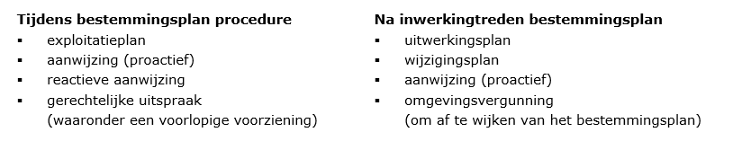

# Relaties

**In dit hoofdstuk wordt ingegaan op de relatie van het bestemmingsplan met
gebiedsgerichte besluiten. Daarnaast hebben andere vakgebieden en wet- en
regelgeving een mogelijke relatie met het digitaal bestemmingsplan. Tot slot
komt de versie ‘geconsolideerd’ aan de orde.**

## Bestemmingsplan

Met een bestemmingsplan wordt concreet aangegeven hoe de ruimtelijke ordening op
een bepaalde locatie is geregeld. Naast de functie die is bepaald, geven de
bijbehorende regels het gebruik van de grond en hetgeen daarop gebouwd is
(bouwwerken) aan. Omgevingsvergunningen moeten worden getoetst aan het
bestemmingsplan. Het bestemmingsplan bepaalt daardoor mede of ergens gebouwd mag
worden. Het bestemmingsplan is bindend voor zowel overheid als burgers.

Bij het opstellen van een bestemmingsplan dient rekening te worden gehouden met
verschillende wet- en regelgeving maar ook met andere ruimtelijke besluiten die
hun invloed op bestemmingsplan uitoefenen. Zo kan de vaststelling van een
ruimtelijk plan ertoe leiden dat een nieuw bestemmingsplan wordt opgesteld. Een
provinciale verordening bijvoorbeeld kan regels geven voor bestemmingsplannen
die binnen een jaar in een bestemmingsplan moeten worden opgenomen.

Tijdens de bestemmingsplan procedure kunnen er juist door dit bestemmingsplan
ook andere ruimtelijke plannen worden opgesteld. Zo volgt bijvoorbeeld het
exploitatieplan dezelfde procedure als het bestemmingsplan. Zij worden
gelijktijdig vastgesteld. Gerechtelijke uitspraken volgen echter nadat een
bestemmingsplan is vastgesteld en beroep is aangetekend. Het bestemmingsplan kan
daardoor bijvoorbeeld deels onherroepelijk in werking treden.

Bij het raadplegen van ruimtelijke plannen in een interactieve raadpleegomgeving
is het weergeven van de relaties tussen de ruimtelijke plannen van waarde: de
raadpleger kan de samenhang tussen de verschillende ruimtelijke plannen op een
locatie inzien en de status van dat plan. De status van een plan wordt
weergegeven door middel van een planstatus (opgenomen in het bestemmingsplan
zelf) en de dossierstatus (opgenomen in het manifest). De beide statussen vullen
elkaar aan. De dossierstatus geeft de actuele status van het plan. De waarde is
dynamisch, dit ten opzichte van statische planstatus. Daarnaast kunnen de
bronhouders voor die ruimtelijke plannen die conform artikel 1.2.1 van het Bro
de digitaliseringverplichting kennen, extra informatie aan het plan toevoegen
door middel van het attribuut *verwijzingNaarExternPlanInfo* bij het plangebied.
Naast het feit dat de bronhouder deze relatie in de tekst (regels, toelichting)
kan opnemen.

In onderstaand schema is aangegeven welke digitale ruimtelijke plannen (conform
Bro) tijdens en na de bestemmingsplan procedure een relatie hebben met het
bestemmingsplan.

In de Praktijkrichtlijn Gebiedsgerichte Besluiten (PRGB2012) wordt voor het
exploitatieplan, de aanwijzing (proactief en reactief) en de gerechtelijke
uitspraak aangegeven hoe en welke informatie aan het besluit met worden
gekoppeld.

In paragraaf 5.3 is dit aangegeven voor een geconsolideerd plan.

## Andere relaties

Het bestemmingsplan heeft vele relaties met andere vakgebieden. In deze
paragraaf wordt kort ingegaan op die wet- en regelgeving en/of vakgebieden die
van invloed zijn op het digitaal bestemmingsplan. Deze paragraaf is niet
uitputtend.

**Algemene verordening gegevensbescherming**  
De Algemene verordening gegevensbescherming (AVG) is een Europese verordening
die de regels voor de verwerking van persoonsgegevens door particuliere
bedrijven en overheidsinstanties in de hele Europese Unie standaardiseert. Het
doel is niet alleen om de bescherming van persoonsgegevens binnen de Europese
Unie te garanderen, maar ook om het vrije verkeer van gegevens binnen de
Europese interne markt te waarborgen. De verordening geldt wereldwijd voor alle
ondernemingen en organisaties die persoonsgegevens bijhouden en verwerken van
natuurlijke personen in de Europese Unie, onafhankelijk of er al dan niet
betaald wordt voor diensten of producten.

Op grond van de Algemene verordening gegevensbescherming wordt het afgeraden
persoonsgegevens elektronisch beschikbaar te stellen, i.e. op internet te
publiceren. Inspraak- of zienswijzennota’s, raadsbesluiten of in de toelichting
opgenomen persoonsgegevens moeten voor publicatie geanonimiseerd worden. Dat
betekent dat naam-, adres- en woonplaatsgegevens van natuurlijke personen
verwijderd moeten worden. Deze gegevens mogen wel in de papieren versie van het
bestemmingsplan opgenomen worden indien deze niet openbaar gemaakt worden.
Gegevens mogen niet worden verwerkt tenzij er ten minste één wettelijke basis is
om dit te doen. De AVG kent 6 grondslagen voor het verwerken van
persoonsgegevens:  
1.  Toestemming van de betrokken persoon.
2.  De gegevensverwerking is noodzakelijk voor de uitvoering van een
    overeenkomst.
3.  De gegevensverwerking is noodzakelijk voor het nakomen van een wettelijke
    verplichting.
4.  De gegevensverwerking is noodzakelijk ter bescherming van de vitale
    belangen.
5.  De gegevensverwerking is noodzakelijk voor de vervulling van een taak van
    algemeen belang of uitoefening van openbaar gezag.
6.  De gegevensverwerking is noodzakelijk voor de behartiging van de
    gerechtvaardigde belangen.

U bent zelf verantwoordelijk om te beoordelen of u zich voor een verwerking van
persoonsgegevens kunt baseren op één van de 6 grondslagen.

**Digitaal ter inzage leggen**  
Voor een correcte beschikbaarstelling langs elektronische weg als bedoeld in
artikel 3.8 lid 1 Wro moeten, naast de dataset die conform de STRI beschikbaar
moet worden gesteld, ook de bijlagen die zijn opgenomen bij de planregels en de
bijlagen die zijn opgenomen bij de plantoelichting langs elektronische weg
beschikbaar worden gesteld.

**Verwijzing naar jurisprudentie**  
Voor verwijzing naar jurisprudentie in de toelichting of in andere stukken kan
het volgende format worden gebruikt: afkorting rechtsprekend orgaan, datum
uitspraak, nummer uitspraak en eventueel de vindplaats. Bijvoorbeeld: ABRvS, 3
januari 2010, nr. 2009005678/1/R3, AB 2010/45.

## Geldende situatie: de versie ‘geconsolideerd’.

Om de raadpleger van [ruimtelijkeplannen.nl](http://www.ruimtelijkeplannen.nl/)
meer duidelijkheid te kunnen bieden over de exacte status en werkingssfeer van
de wijzigingen en herzieningen van een bestemmingsplan en het actuele
planologische regime ter plaatse kan het gebruik van een versie “geconsolideerd”
de oplossing zijn. Op die manier is in één oogopslag duidelijk wat de juridische
status van de desbetreffende plannen is en wat de overige gevolgen ervan zijn,
zoals het geldende planologische regime ter plaatse. Ook de data van het bevoegd
gezag kan hiermee op orde worden gebracht. Hierdoor is het niet (meer) nodig via
andere, vaak omslachtige, wegen te zoeken naar de geldende regels. Dat geeft
duidelijkheid, kost minder tijd en is dus klantvriendelijk naar de raadpleger.

<u>Let op</u>: het gaat dus niet om een herziening of een actualisering van een
ruimtelijk plan maar om het samenvoegen van meerder ruimtelijke plannen om zo
een integrale versie, en daardoor een beter leesbare versie, te tonen. In de
versie geconsolideerd worden geen nieuwe ontwikkelingen mogelijk gemaakt.

De versie ‘geconsolideerd’ van een bestemmingsplan kent geen wettelijke, dus
geen juridische status omdat deze versie niet door gemeenteraad wordt
vastgesteld. Het gebruik van een geconsolideerd plan is een keuze van het
bevoegd gezag.

Bij vergunningverlening en handhaving moet altijd verwezen worden naar de
juridisch geldende plannen. Het consolideren van de bestemmingsplannen gaat in
eerste instantie altijd over het samenvoegen van twee of meer plankaarten, waar
nodig. Dit kan in combinatie met het consolideren van de regels en toelichting.

Een eerste stap bij het consolideren van een ruimtelijk plan is om te
inventariseren welke verschillende plankaarten zijn onstaan door de
herzieningen, wijzigingen etc. Op Ruimtelijkeplannen.nl komen deze als het ware
op elkaar te liggen waardoor de raadpleging wordt bemoeilijkt.

Afhankelijk van welke aspecten moeten worden geconsolideerd zijn er twee
mogelijkheden. De eerste is dat er een nieuwe plankaart wordt gemaakt van de
plannen waarbij de wijzigingen in het oorspronkelijke plan verwerkt worden. Door
de wijzigingen in het originele plan te verwerken, ontstaat er één duidelijk
beeld. De andere werkwijze is het ´knippen´ van delen uit de oorspronkelijke
plankaart, delen waarin de wijzigingen als het ware de gaten ´opvullen´ in de
verbeelding. In dat geval moet de consolidatie geen aspecten bevatten die het
overige deel van het plan betreffen. Vervolgens laat ruimtelijkeplannen.nl door
de ‘gaten’ de juiste informatie zien.

In het geval van de eerste mogelijkheid bundelt de bronhouder vervolgens de
regels van de herzieningen/wijzigingen die geconsolideerd worden. Hierbij
verwerkt de bronhouder in de regels van het oorspronkelijke plan de wijzigingen
die daarin door de herzieningen, uitspraken, wijzigingsplannen en /of
uitwerkingsplannen zijn aangebracht zodat één complete set van geldende regels
ontstaat. Alle regels worden als het ware in elkaar geschoven. Het is daardoor
niet nodig meerdere plannen te raadplegen en ontstaat er meer duidelijkheid voor
de raadpleger over wat waar geldig is. Omdat deze versie geen geldige juridische
status heeft is het aan te bevelen om een verwijzing te maken naar de juridisch
geldende bestemmingsplannen met een deeplink in de geconsolideerde tekst naar de
brontekst.

Een volgende stap die nog gedaan kan worden is het consolideren van de
toelichting behorende bij een bestemmingsplan. Een bronhouder kan hierbij kiezen
voor het maken van een algemene toelichting waarin de essentie van het
consolideren wordt uitgelegd met daarbij de koppeling van de toelichtingen van
de plannen die geconsolideerd worden Dit kan een koppeling zijn naar een pdf dan
wel html van de toelichtingen of een koppeling naar de xml bestanden van de
toelichtingen in geval van objectgerichte planteksten.

Aangezien de versie geconsolideerd niet door de gemeenteraad wordt vastgesteld
is het voor de hand liggend om voor de datum van dit plan aan te sluiten bij het
in werking treden / onherroepelijk worden van het meest recente bestemmingsplan.
Met dit laatste zijn dan ook eventuele gerechtelijke uitspraken meegenomen.
Tevens is het aan te raden om te verwijzen naar de geldige plannen dan wel
besluiten.

Bij de waarde van het attribuut *verwijzingNaarExternPlanInfo* worden alle
plannen/besluiten opgenomen die in deze versie geconsolideerd zijn verwerkt. De
waarde van het attribuut *rolExternPlan* is in dit geval: ‘als mutatie
opgenomen’. Het ruimtelijke plan met de plan status ‘geconsolideerd’ wordt in
het manifest met behulp van de dossierstatus ‘geconsolideerd’ geplaatst.