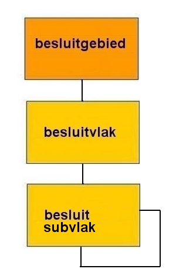

# Het informatiemodel toegelicht

**In een gebiedsgericht besluit zijn naast het werkingsgebied van het besluit alle
onderdelen door middel van een geometrie met een verwijzing naar de bijbehorende
tekst vastgelegd. In dit hoofdstuk wordt aangegeven welke gebiedsgerichte
besluiten er zijn. Verder wordt ook de structuur van een gebiedsgericht besluit
toegelicht.**

## De objectbenadering van een gebiedsgericht besluit

Conform IMRO2012 is een object altijd een ruimtelijke object dat een ruimtelijke
eenheid representeert waar tekst (besluittekst, toelichting, regels, etc.)
betrekking op heeft. In een gebiedsgericht besluit kunnen deze ruimtelijke
eenheden geometrisch worden vastgelegd of worden aangeduid. In Tabel 1 zijn alle
gebiedsgerichte besluittypen die van toepassing zijn in deze praktijkrichtlijn
samengevat.

**Tabel 1 Gebiedsgerichte besluiten volgens de Wro en Wabo**

<table id="d4e32" style="width: 100%;"><caption>Gebiedsgerichte besluiten volgens de Wro en Wabo</caption><colgroup><col id="col1" style="width: 41.95435927442949%;"></col><col id="col2" style="width: 35.880631948507904%;"></col><col id="col3" style="width: 22.16500877706261%;"></col></colgroup><thead valign="top"><tr><th align="left" style="border-top: 0.5pt solid #000000; border-left: 0.5pt solid #000000; border-bottom: 0.5pt solid #000000; border-right: 0.5pt solid #000000; background-color: none;">
naam gebiedsgericht besluit
</th><th align="left" style="border-top: 0.5pt solid #000000; border-left: 0.5pt solid #000000; border-bottom: 0.5pt solid #000000; border-right: 0.5pt solid #000000; background-color: none;">
wetsartikel 
</th><th align="left" style="border-top: 0.5pt solid #000000; border-left: 0.5pt solid #000000; border-bottom: 0.5pt solid #000000; border-right: 0.5pt solid #000000; background-color: none;">
Overheid
</th></tr></thead><tbody valign="top"><tr><td align="left" style="border-top: 0.5pt solid #000000; border-left: 0.5pt solid #000000; border-bottom: 0.5pt solid #000000; border-right: 0.5pt solid #000000; background-color: none;">
 aanwijzingsbesluit (proactieve aanwijzing)
</td><td align="left" style="border-top: 0.5pt solid #000000; border-left: 0.5pt solid #000000; border-bottom: 0.5pt solid #000000; border-right: 0.5pt solid #000000; background-color: none;">
Wro art. 4.2

Wro art. 4.4
</td><td align="left" style="border-top: 0.5pt solid #000000; border-left: 0.5pt solid #000000; border-bottom: 0.5pt solid #000000; border-right: 0.5pt solid #000000; background-color: none;">
provincie

Rijk
</td></tr><tr><td align="left" style="border-top: 0.5pt solid #000000; border-left: 0.5pt solid #000000; border-bottom: 0.5pt solid #000000; border-right: 0.5pt solid #000000; background-color: none;">
beheersverordening
</td><td align="left" style="border-top: 0.5pt solid #000000; border-left: 0.5pt solid #000000; border-bottom: 0.5pt solid #000000; border-right: 0.5pt solid #000000; background-color: none;">
Wro art. 3.38
</td><td align="left" style="border-top: 0.5pt solid #000000; border-left: 0.5pt solid #000000; border-bottom: 0.5pt solid #000000; border-right: 0.5pt solid #000000; background-color: none;">
gemeente
</td></tr><tr><td align="left" style="border-top: 0.5pt solid #000000; border-left: 0.5pt solid #000000; border-bottom: 0.5pt solid #000000; border-right: 0.5pt solid #000000; background-color: none;">
exploitatieplan
</td><td align="left" style="border-top: 0.5pt solid #000000; border-left: 0.5pt solid #000000; border-bottom: 0.5pt solid #000000; border-right: 0.5pt solid #000000; background-color: none;">
Wro art. 6.1
</td><td align="left" style="border-top: 0.5pt solid #000000; border-left: 0.5pt solid #000000; border-bottom: 0.5pt solid #000000; border-right: 0.5pt solid #000000; background-color: none;">
gemeente
</td></tr><tr><td align="left" style="border-top: 0.5pt solid #000000; border-left: 0.5pt solid #000000; border-bottom: 0.5pt solid #000000; border-right: 0.5pt solid #000000; background-color: none;">
gerechtelijke uitspraak
</td><td align="left" style="border-top: 0.5pt solid #000000; border-left: 0.5pt solid #000000; border-bottom: 0.5pt solid #000000; border-right: 0.5pt solid #000000; background-color: none;">
-
</td><td align="left" style="border-top: 0.5pt solid #000000; border-left: 0.5pt solid #000000; border-bottom: 0.5pt solid #000000; border-right: 0.5pt solid #000000; background-color: none;">
rechtbanken/ABRS
</td></tr><tr><td align="left" style="border-top: 0.5pt solid #000000; border-left: 0.5pt solid #000000; border-bottom: 0.5pt solid #000000; border-right: 0.5pt solid #000000; background-color: none;">
omgevingsvergunning (voormalig Wro projectbesluit)
</td><td align="left" style="border-top: 0.5pt solid #000000; border-left: 0.5pt solid #000000; border-bottom: 0.5pt solid #000000; border-right: 0.5pt solid #000000; background-color: none;">
Wabo art. 2.12, lid 1, onderdeel a, sub 3e
</td><td align="left" style="border-top: 0.5pt solid #000000; border-left: 0.5pt solid #000000; border-bottom: 0.5pt solid #000000; border-right: 0.5pt solid #000000; background-color: none;">
gemeente

provincie

Rijk
</td></tr><tr><td align="left" style="border-top: 0.5pt solid #000000; border-left: 0.5pt solid #000000; border-bottom: 0.5pt solid #000000; border-right: 0.5pt solid #000000; background-color: none;">
reactieve aanwijzing
</td><td align="left" style="border-top: 0.5pt solid #000000; border-left: 0.5pt solid #000000; border-bottom: 0.5pt solid #000000; border-right: 0.5pt solid #000000; background-color: none;">
Wro art. 3.8, lid 6
</td><td align="left" style="border-top: 0.5pt solid #000000; border-left: 0.5pt solid #000000; border-bottom: 0.5pt solid #000000; border-right: 0.5pt solid #000000; background-color: none;">
provincie, Rijk
</td></tr><tr><td align="left" style="border-top: 0.5pt solid #000000; border-left: 0.5pt solid #000000; border-bottom: 0.5pt solid #000000; border-right: 0.5pt solid #000000; background-color: none;">
voorbereidingsbesluit
</td><td align="left" style="border-top: 0.5pt solid #000000; border-left: 0.5pt solid #000000; border-bottom: 0.5pt solid #000000; border-right: 0.5pt solid #000000; background-color: none;">
Wro art. 3.7

Wro art. 3.26, lid 2

Wro art. 3.28, lid 2

Wro art. 4.1, lid 5

Wro art. 4.2, lid 3

Wro art. 4.3, lid 4

Wro art. 4.4, lid 3

Wro art. 10.3, lid 2
</td><td align="left" style="border-top: 0.5pt solid #000000; border-left: 0.5pt solid #000000; border-bottom: 0.5pt solid #000000; border-right: 0.5pt solid #000000; background-color: none;">
gemeente

provincie

Rijk

provincie

provincie

Rijk

Rijk

Rijk
</td></tr></tbody></table>  

Een gebiedsgericht besluit bestaat uit drie typen objecten (klassen):  
-   Besluitgebied;
-   Besluitvlak;
-   Besluitsubvlak.

In Figuur 1 is het complete schema weergegeven met alle onderscheiden objecten.

**Figuur 1 Objectenstructuur**

**Besluitgebied**  
Het object *Besluitgebied* is het werkingsgebied van een gebiedsgericht besluit.
Het object komt altijd één keer voor (n=1).

**Besluitvlak**  
Het object *Besluitvlak* is een gebied, geometrisch vastgelegd binnen een object
*Besluitgebied*, dat zelfstandige eigenschappen heeft (bijvoorbeeld een daaraan
gekoppeld(e) voorschrift/regel). In het geval het gebiedsgericht besluit
uitsluitend inhoudelijke bepalingen kent die betrekking hebben op het hele
werkingsgebied van het gebiedsgericht besluit wordt het werkingsgebied altijd
tevens aangeduid als object *Besluitvlak*. Er is dus altijd tenminste één
besluitvlak dat in dat geval dezelfde geometrie kent als het object
*Besluitgebied.* Meerdere objecten *Besluitvlak* dekken tezamen het gehele
object *Besluitgebied* af en kunnen elkaar overlappen. Het object komt altijd
tenminste één keer voor (1..n).

**Besluitsubvlak**  
Het object *Besluitsubvlak* is een gebied, geometrisch vast­gelegd binnen een
object *Besluitgebied*, met een inhoude­lijke relatie met een of meer
bovenliggende geometrisch vastgelegde objecten *Besluitvlak* of andere objecten
*Besluitsubvlak* en heeft geen directe in­houdelijke relatie met het hele
werkingsgebied van het gebiedsgericht besluit (het object *Besluitgebied*). Een
object *Besluitsubvlak* kan een object *Besluitvlak* of een ander object
*Besluitsubvlak* willekeurig overlappen. Het object komt zo vaak voor als
gewenst (0..n).

## Structuur

Op de beheersverordening na zullen alle besluiten, objectgericht bezien,
eenvoudig van aard zijn en uit weinig objecten bestaan. Bij de
beheersverordening gaan we er van uit dat het instrument, bedoeld als eenvoudig
instrument, ook weinig gedetailleerd zal zijn. Een specifieke indeling, zoals
bij bestemmingsplannen met onder andere een groot aantal verschillende typen
aanduidingen, is daarom op voorhand als niet voor de hand liggend beschouwd. Er
moet volstaan kunnen worden met de voorgestelde besluitvlakken en
besluitsubvlakken. Deze kunnen mogelijk wel vaak voorkomen binnen een
beheersverordening.

Nadrukkelijk wordt hier vermeld dat er bij de genoemde gebiedsgerichte
besluiten, waaronder de beheersverordening ook geen sprake is van een
traditionele verbeelding op papier, maar van een volledig digitaal product als
uitgangspunt. Dit stelt daarom ook geen traditionele kaartgerichte (analoge)
verbeeldingsvereisten waarvoor meerdere type aanduidingen zullen ontstaan. De
volgende paragraaf gaat ook nader in op de verbeelding.

## Besluit en digitale verbeelding

In tegenstelling tot bestemmingsplannen bestaat er voor gebiedsgerichte
besluiten geen afspraak over de digitale verbeelding. De vormgeving van de
digitale verbeelding in kleuren, rasters, lettertypen e.d., wordt niet opgenomen
in het besluit. Desondanks is er in deze praktijkrichtlijn de mogelijkheid
opgenomen (facultatief) een kaart als plaatje aan het besluit toe te voegen. Dit
"plaatje" heeft echter geen geometrie en is derhalve louter illustratief. De
ontvanger van het bestand bouwt zelf vanuit het GML-bestand de door hem gewenste
verbeelding op. De digitale verbeelding kan derhalve een andere presentatie
zijn van dezelfde gegevens. Een interactieve raadpleegomgeving zal er echter
zorg voor moeten dragen dat het gebiedsgerichte besluit correct en volledig
wordt weergegeven, waarmee raadpleging van de gebiedsgerichte besluiten
verzekerd is.

## Gemeente- en provinciegrensoverschrijdende besluiten

Bij een besluit waarvan het onderwerp de grens van de betreffende overheid wordt
overschreden, wordt dit besluit voor elk van de betreffende overheden, apart
vastgesteld voor zover het haar eigen grondgebied betreft. Dit leidt ertoe dat
er zelfstandige besluiten worden genomen met een eigen planidentificatie. Het
gevolg daarvan is dat in het kader van de toepassing van deze praktijkrichtlijn
twee afzonderlijke sets databestanden ontstaan, elk voor het eigen gemeentelijk
grondgebied en elk met een eigen identiteit (attribuut *idn*).

Teneinde kenbaar te kunnen maken welke gemeenten het betreft in geval van een
provinciaal of Rijksbesluit dient het attribuut *locatieNaam* te worden gebruikt
om de betreffende gemeentenamen en in voorkomend geval provincienamen te
benoemen. Daarvoor wordt verwezen naar het [volgende hoofdstuk](#H03).

## Geometrie of tekst als ingang voor beleid

De voorliggende praktijkrichtlijn is gericht op de geometrie en opbouw van het
gebiedsgerichte besluit. De geometrie (locatie) vormt hierbij de ingang voor het
raadplegen van het ruimtelijke plan.

Binnen de RO Standaarden 2012 is het gebruik van objectgerichte planteksten
(XML) facultatief. De bronhouder mag er ook voor kiezen de planteksten in de
vorm van HTML en/of PDF bestanden (ofwel niet-objectgericht) beschikbaar te
stellen. Bij het gebruik van objectgerichte planteksten wordt het in de toekomst
mogelijk om de tekst te laten fungeren als ingang voor het raadplegen van het
ruimtelijk plan binnen een interactieve raadpleegomgeving.

Voor toelichting op het gebruik van de standaard voor planteksten (IMROPT2012)
wordt verwezen naar de toelichting Praktijkrichtlijn voor Planteksten
(PRPT2012).

## Metadata

In de voorgaande paragrafen is het IMRO met betrekking tot het gebiedsgerichte
besluit toegelicht. Wanneer het gebiedsgerichte besluit digitaal wordt
vastgelegd bestaat deze uit een set van verschillende bestanden: de dataset.
STRI2012 geeft regels met betrekking tot deze bestanden.

In het GML bestand is ook bepaalde informatie over het gebiedsgerichte besluit
opgenomen. Ook in het geleideformulier en manifest is bepaalde informatie over
het gebiedsgerichte besluit opgenomen. Gegevens over gegevens wordt metadata
genoemd. In IMRO2012 zijn bij de klasse *MetadataIMRObestand* regels
opgenomen over de in het GML bestand op te nemen metadata. In Tabel 2 wordt
klasse *MetadataIMRObestand* toegelicht.

**Tabel 2 KlasseMetadataIMRObestand 1\***

<table id="d4e378" style="width: 100%;"><caption>KlasseMetadataIMRObestand 1*</caption><colgroup><col id="col1" style="width: 28.57142857142857%;"></col><col id="col2" style="width: 38.775510204081634%;"></col><col id="col3" style="width: 4.081632653061225%;"></col><col id="col4" style="width: 28.57142857142857%;"></col></colgroup><thead valign="top"><tr><th align="left" style="border-top: 0.5pt solid #000000; border-left: 0.5pt solid #000000; border-bottom: 0.5pt solid #000000; border-right: 0.5pt solid #000000; background-color: none;">
Metadata attribuut
</th><th align="left" style="border-top: 0.5pt solid #000000; border-left: 0.5pt solid #000000; border-bottom: 0.5pt solid #000000; border-right: 0.5pt solid #000000; background-color: none;">
waarde
</th><th align="left" style="border-top: 0.5pt solid #000000; border-left: 0.5pt solid #000000; border-bottom: 0.5pt solid #000000; border-right: 0.5pt solid #000000; background-color: none;">
*
</th><th align="left" style="border-top: 0.5pt solid #000000; border-left: 0.5pt solid #000000; border-bottom: 0.5pt solid #000000; border-right: 0.5pt solid #000000; background-color: none;">
opmerking
</th></tr></thead><tbody valign="top"><tr><td align="left" style="border-top: 0.5pt solid #000000; border-left: 0.5pt solid #000000; border-bottom: 0.5pt solid #000000; border-right: 0.5pt solid #000000; background-color: none;">
datasetTitel
</td><td align="left" style="border-top: 0.5pt solid #000000; border-left: 0.5pt solid #000000; border-bottom: 0.5pt solid #000000; border-right: 0.5pt solid #000000; background-color: none;">
naam van de dataset of dataset serie
</td><td align="left" style="border-top: 0.5pt solid #000000; border-left: 0.5pt solid #000000; border-bottom: 0.5pt solid #000000; border-right: 0.5pt solid #000000; background-color: none;">
1
</td><td align="left" style="border-top: 0.5pt solid #000000; border-left: 0.5pt solid #000000; border-bottom: 0.5pt solid #000000; border-right: 0.5pt solid #000000; background-color: none;">
dit komt overeen met de naam van het plan/besluit
</td></tr><tr><td align="left" style="border-top: 0.5pt solid #000000; border-left: 0.5pt solid #000000; border-bottom: 0.5pt solid #000000; border-right: 0.5pt solid #000000; background-color: none;">
creatiedatum
</td><td align="left" style="border-top: 0.5pt solid #000000; border-left: 0.5pt solid #000000; border-bottom: 0.5pt solid #000000; border-right: 0.5pt solid #000000; background-color: none;">
datum waarop het bestand gemaakt is
</td><td align="left" style="border-top: 0.5pt solid #000000; border-left: 0.5pt solid #000000; border-bottom: 0.5pt solid #000000; border-right: 0.5pt solid #000000; background-color: none;">
1
</td><td align="left" style="border-top: 0.5pt solid #000000; border-left: 0.5pt solid #000000; border-bottom: 0.5pt solid #000000; border-right: 0.5pt solid #000000; background-color: none;">
in de vorm: jjjj-mm-dd
</td></tr><tr><td align="left" style="border-top: 0.5pt solid #000000; border-left: 0.5pt solid #000000; border-bottom: 0.5pt solid #000000; border-right: 0.5pt solid #000000; background-color: none;">
bronbeheerder
</td><td align="left" style="border-top: 0.5pt solid #000000; border-left: 0.5pt solid #000000; border-bottom: 0.5pt solid #000000; border-right: 0.5pt solid #000000; background-color: none;">
partij die verantwoordelijkheid heeft geaccepteerd en zorg draagt voor het beheer van de data
</td><td align="left" style="border-top: 0.5pt solid #000000; border-left: 0.5pt solid #000000; border-bottom: 0.5pt solid #000000; border-right: 0.5pt solid #000000; background-color: none;">
1
</td><td align="left" style="border-top: 0.5pt solid #000000; border-left: 0.5pt solid #000000; border-bottom: 0.5pt solid #000000; border-right: 0.5pt solid #000000; background-color: none;">
naam van gemeente, provincie, of ministerie(s)
</td></tr><tr><td align="left" style="border-top: 0.5pt solid #000000; border-left: 0.5pt solid #000000; border-bottom: 0.5pt solid #000000; border-right: 0.5pt solid #000000; background-color: none;">
codeerVerantwoordelijke
</td><td align="left" style="border-top: 0.5pt solid #000000; border-left: 0.5pt solid #000000; border-bottom: 0.5pt solid #000000; border-right: 0.5pt solid #000000; background-color: none;">
diegene die verantwoordelijk is voor de IMRO-codering
</td><td align="left" style="border-top: 0.5pt solid #000000; border-left: 0.5pt solid #000000; border-bottom: 0.5pt solid #000000; border-right: 0.5pt solid #000000; background-color: none;">
1
</td><td align="left" style="border-top: 0.5pt solid #000000; border-left: 0.5pt solid #000000; border-bottom: 0.5pt solid #000000; border-right: 0.5pt solid #000000; background-color: none;">
naam van organisatie, afdeling, bedrijf
</td></tr><tr><td align="left" style="border-top: 0.5pt solid #000000; border-left: 0.5pt solid #000000; border-bottom: 0.5pt solid #000000; border-right: 0.5pt solid #000000; background-color: none;">
naamApplicatieschema
</td><td align="left" style="border-top: 0.5pt solid #000000; border-left: 0.5pt solid #000000; border-bottom: 0.5pt solid #000000; border-right: 0.5pt solid #000000; background-color: none;">
gebruikt applicatieschema / informatiemodel
</td><td align="left" style="border-top: 0.5pt solid #000000; border-left: 0.5pt solid #000000; border-bottom: 0.5pt solid #000000; border-right: 0.5pt solid #000000; background-color: none;">
1
</td><td align="left" style="border-top: 0.5pt solid #000000; border-left: 0.5pt solid #000000; border-bottom: 0.5pt solid #000000; border-right: 0.5pt solid #000000; background-color: none;">
in dit geval IMRO2012
</td></tr><tr><td align="left" style="border-top: 0.5pt solid #000000; border-left: 0.5pt solid #000000; border-bottom: 0.5pt solid #000000; border-right: 0.5pt solid #000000; background-color: none;">
codeReferentiesysteem
</td><td align="left" style="border-top: 0.5pt solid #000000; border-left: 0.5pt solid #000000; border-bottom: 0.5pt solid #000000; border-right: 0.5pt solid #000000; background-color: none;">
alfanumerieke waarde die het gebruikte referentiesysteem van de dataset aangeeft
</td><td align="left" style="border-top: 0.5pt solid #000000; border-left: 0.5pt solid #000000; border-bottom: 0.5pt solid #000000; border-right: 0.5pt solid #000000; background-color: none;">
1
</td><td align="left" style="border-top: 0.5pt solid #000000; border-left: 0.5pt solid #000000; border-bottom: 0.5pt solid #000000; border-right: 0.5pt solid #000000; background-color: none;">
hier wordt een code ingevuld afkomstig van de EPSG (European Petrol Survey Group): RD is het verplichte referentiesysteem met de code: 28992
</td></tr><tr><td align="left" style="border-top: 0.5pt solid #000000; border-left: 0.5pt solid #000000; border-bottom: 0.5pt solid #000000; border-right: 0.5pt solid #000000; background-color: none;">
toepassingsschaal
</td><td align="left" style="border-top: 0.5pt solid #000000; border-left: 0.5pt solid #000000; border-bottom: 0.5pt solid #000000; border-right: 0.5pt solid #000000; background-color: none;">
de beoogde maximale schaal waarop het bestand waarheidsgetrouw gebruikt mag worden; dit moet een positief numeriek getal zijn
</td><td align="left" style="border-top: 0.5pt solid #000000; border-left: 0.5pt solid #000000; border-bottom: 0.5pt solid #000000; border-right: 0.5pt solid #000000; background-color: none;">
1
</td><td align="left" style="border-top: 0.5pt solid #000000; border-left: 0.5pt solid #000000; border-bottom: 0.5pt solid #000000; border-right: 0.5pt solid #000000; background-color: none;">
bijvoorbeeld: 500 voor een bestand dat maximaal op schaal 1 : 500 gebruikt mag worden
</td></tr><tr><td align="left" style="border-top: 0.5pt solid #000000; border-left: 0.5pt solid #000000; border-bottom: 0.5pt solid #000000; border-right: 0.5pt solid #000000; background-color: none;">
applicatieIdentificatie
</td><td align="left" style="border-top: 0.5pt solid #000000; border-left: 0.5pt solid #000000; border-bottom: 0.5pt solid #000000; border-right: 0.5pt solid #000000; background-color: none;">
aanduiding van applicatie en versienummer
</td><td align="left" style="border-top: 0.5pt solid #000000; border-left: 0.5pt solid #000000; border-bottom: 0.5pt solid #000000; border-right: 0.5pt solid #000000; background-color: none;">
1
</td><td align="left" style="border-top: 0.5pt solid #000000; border-left: 0.5pt solid #000000; border-bottom: 0.5pt solid #000000; border-right: 0.5pt solid #000000; background-color: none;">
waarmee het bestand gecodeerd is
</td></tr><tr><td align="left" style="border-top: 0.5pt solid #000000; border-left: 0.5pt solid #000000; border-bottom: 0.5pt solid #000000; border-right: 0.5pt solid #000000; background-color: none;">
versieXMLschema
</td><td align="left" style="border-top: 0.5pt solid #000000; border-left: 0.5pt solid #000000; border-bottom: 0.5pt solid #000000; border-right: 0.5pt solid #000000; background-color: none;">
versie van het XML schema definitiebestand (XSD)
</td><td align="left" style="border-top: 0.5pt solid #000000; border-left: 0.5pt solid #000000; border-bottom: 0.5pt solid #000000; border-right: 0.5pt solid #000000; background-color: none;">
1
</td><td align="left" style="border-top: 0.5pt solid #000000; border-left: 0.5pt solid #000000; border-bottom: 0.5pt solid #000000; border-right: 0.5pt solid #000000; background-color: none;">
in het XSD vastgelegd als &lt;version="versiecode"&gt;
</td></tr><tr><td align="left" style="border-top: 0.5pt solid #000000; border-left: 0.5pt solid #000000; border-bottom: 0.5pt solid #000000; border-right: 0.5pt solid #000000; background-color: none;" colspan="4">
*  multipliciteit:

0:   komt niet voor     0..1:   komt 0 of 1 keer voor            0..n:   komt zo vaak voor als gewenst

1:   komt 1 keer voor        1..n:   komt tenminste 1 keer voor
</td></tr></tbody></table>

**toepassingsschaal**  
Gebiedsgerichte besluiten worden vastgelegd in besluitvlakken en
besluitsubvlakken die geometrisch zijn bepaald op basis van het
Rijksdriehoekstelsel (RD-coördinaten). Daarvoor is de schaal in principe niet
van belang. Bij de digitale en analoge verbeelding is de schaal waarop
(gedeelten van) het gebiedsgerichte besluit zinvol kunnen worden weergegeven wel
van belang. Daarom wordt in de metadata van de dataset de maximale schaal
meegegeven waarop het plan zinvol verbeeld mag worden.
