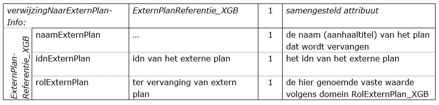

# Herzieningen

**In dit hoofdstuk wordt ingegaan op de wijze waarop gedeeltelijke herzieningen
gecodeerd moeten worden en hoe beschikt kan worden over een versie
"geconsolideerd".**

## Gedeeltelijke herziening

Hetgeen in Hoofdstuk 4 van deze praktijkrichtlijn is vermeld, is zowel in het
eenmalige geval als in geval van een herzien besluit volledig van toepassing.
Op deze wijze wordt al hetgeen een nieuwe gebiedsgericht besluit betreft
gecodeerd en wordt voldaan aan de wettelijke plicht te beschikken over een
objectgericht besluit.

Als verplicht onderdeel moet het object *Besluitgebied_X* worden gebruikt. De
begrenzing van het plangebied heeft betrekking op de te herziene locatie. Dit
kan afwijken van de begrenzing van het oorspronkelijk plangebied waarop de
herziening betrekking heeft. Verder wordt dezelfde multipliciteit van de
attributen in acht genomen, met dat verschil dat het attribuut
*verwijzingNaarExternPlanInfo* verplicht moet worden ingevuld.
Daartoe worden bij het object *Besluitgebied_X* bij het attribuut
*verwijzingNaarExternPlanInfo* bij de samenstellende at­tributen respectievelijk
de naam (type) van het plan dat wordt herzien, het idn van het plan dat wordt
herzien en de waarde "ter vervanging van extern plan" ingevuld. Daarmee wordt de
relatie vastgelegd met het gebiedsgerichte besluit dat gedeeltelijk wordt
herzien.

**Tabel 6 Relatie naar extern plan**

Bij het attribuut *verwijzingNaarTekstInfo* worden alle relevante teksten
gevoegd. Daartoe wordt ge­bruik gemaakt van de domeinwaarden van het domein
*TeksttypeBG_XGB*. De overige attributen spre­ken voor zich.

Daarnaast kunnen vervolgens alle herziene objecten van de klasse *Besluitvlak_X*
en/of *Besluitsubvlak_X*, met alle (nieuwe of aanpassingen van de) regels, voor
zover dit de herziening betreft, worden toegevoegd aan dit type besluit. Welke
objecten (besluitvlakken, dan wel besluitsubvlakken) worden toegevoegd, is
afhankelijk van de concrete situatie. Nadere regels zijn moeilijk te geven
gezien de vele mogelijkheden die aard, omvang en onderlinge samenhang van de te
herziene gedeelten van een gebiedsgericht besluit met zich meebrengen. Ook de
keuze voor het hergebruik van structuur/ hiërarchie van objecten en regels uit
het oorspronkelijk plan/ besluit heeft invloed op de mogelijkheden.
Het kan praktisch zijn om de objecten die behoren bij de herziening zodanig te
kiezen en te coderen dat er een voordeel ontstaat bij het opstellen van het
"geconsolideerd besluit " die verderop aan de orde komt. Uiteraard is het
juridische doel van de herziening maatgevend, maar kan van de ruimte binnen dat
doel gebruik worden gemaakt om te komen tot een ook voor de codering en de
verwerking daarvan in een geconsolideerd besluit praktische oplossing.

Op deze wijze wordt al hetgeen een gebiedsgericht besluit of een herziening
daarvan betreft gecodeerd en wordt voldaan aan de wettelijke plicht te
beschikken over een objectgericht plan, maar ontstaat *geen* compleet overzicht
van de nieuwe geldende situatie. Een oplossing daarvoor is om gebruik te maken
van een "geconsolideerd besluit " waarin de gevolgen van de herziening zijn
verwerkt. Daarop wordt hierna onder 4.2. nader ingegaan.

## Geldende situatie: de versie ‘geconsolideerd’.

Om de raadpleger van [ruimtelijkeplannen.nl](http://www.ruimtelijkeplannen.nl/)
meer duidelijkheid te kunnen bieden over de exacte status en werkingssfeer van
de wijzigingen van een gebiedsgericht besluit en het actuele planologische
regime ter plaatse kan het gebruik van een versie “geconsolideerd” de oplossing
zijn. Op die manier is in één oogopslag duidelijk wat de juridische status van
de desbetreffende plannen en besluiten is, en wat de overige gevolgen ervan
zijn, zoals het vigerende planologische regime ter plaatse. Ook de data van het
bevoegd gezag kan hiermee op orde worden gesteld. Hierdoor is het niet (meer)
nodig via andere, vaak omslachtige, wegen te zoeken naar de geldende regels. Dat
geeft duidelijkheid, kost minder tijd en is dus klantvriendelijk naar de
raadpleger.

<u>Let op</u>: het gaat dus niet om een herziening of een actualisering van een
ruimtelijk plan maar om het samenvoegen van meerder ruimtelijke plannen om zo
een integrale versie, en daardoor een beter leesbare versie, te tonen. Er vinden
dus geen nieuwe ontwikkelingen plaats. De versie ‘geconsolideerd’ van een
gebiedsgericht besluit kent geen wettelijke, dus geen juridische status omdat
deze versie niet door gemeenteraad wordt vastgesteld. Het gebruik van een
geconsolideerd plan is een keuze van het bevoegd gezag.

Bij vergunningverlening en handhaving moet altijd verwezen worden naar de
juridisch geldende plannen. Het consolideren van gebiedsgerichte besluiten gaat
in eerste instantie altijd over het samenvoegen van twee of meer plankaarten,
waar nodig. Dit kan in combinatie met het consolideren van de regels en
toelichting.

De versie geconsolideerd is van toepassing op de inhoudelijke gebiedsgerichte
besluiten; beheersverordening en exploitatieplan.
Een eerste stap bij het consolideren van een ruimtelijk plan is om te
inventariseren welke verschillende plankaarten zijn ontstaan door de
herzieningen, wijzigingen etc. Een beheersverordening wordt op
Ruimetlijkeplannen.nl weergegeven in een cyaan blauwe kleur met kruisjes. Dit is
anders dan bij bijvoorbeeld bestemmingsplannen. Het consolideren van plankaarten
beheersverordeningen resulteert in een plangebied met dezelfde kleur en
opvulling, waarbij optisch weinig verschil te zien is. In het geval van een
beheersverordening betreft het vastleggen van de bestaande situatie waarbij geen
nieuwe ruimtelijke ontwikkelingen mogelijk zijn. Een herziening van een
beheersverordening wordt sporadisch toegepast. Bijvoorbeeld in het geval dat
bepaalde bouwregels abusievelijk niet zijn opgenomen. Wat ook voorkomt is dat
binnen een gemeente meerdere beheersverordeningen worden vastgesteld. Het is
voor te stellen dat deze samen geconsolideerd worden. Exploitatieplannen dienen
volgens de wet jaarlijks herzien te worden. Een herziening van een
exploitatieplan komt daardoor vaker voor.

Vervolgens bundelt de bronouder de regels van de herzieningen die geconsolideerd
worden. Hierbij verwerkt de bronhouder in de regels van het oorspronkelijke plan
de wijzigingen die daarin door de herzieningen zijn aangebracht zodat één
complete set van geldende regels ontstaat. Alle regels worden als het ware in
elkaar geschoven.
Het is daardoor niet nodig meerdere plannen te raadplegen en ontstaat er meer
duidelijkheid voor de raadpleger over wat waar geldig is. Omdat deze versie geen
geldige juridische status heeft is het aan te bevelen om een verwijzing te maken
naar de juridisch geldende beheersverordeningen dan wel exploitatieplannen met
een deeplink in de geconsolideerde tekst naar de brontekst.

Een volgende stap die nog gedaan kan worden, is het consolideren van de
toelichting behorende bij een beheersverordening of exploitatieplan. Een
bronhouder kan hierbij kiezen voor het maken van een algemene toelichting waarin
de essentie van het consolideren wordt uitgelegd met daarbij de koppeling van de
toelichtingen van de plannen die geconsolideerd worden. Dit kan een koppeling
zijn naar een pdf dan wel html van de toelichtingen of een koppeling naar de xml
bestanden van de toelichtingen in geval van objectgerichte planteksten.

Aangezien de versie geconsolideerd niet door de gemeenteraad wordt vastgesteld
is het voor de hand liggend om voor de datum van dit plan aan te sluiten bij het
in werking treden / onherroepelijk worden van het meest recente
beheersverordening of exploitatieplan. Met dit laatste zijn dan ook eventuele
gerechtelijke uitspraken meegenomen. Tevens is het aan te raden om te verwijzen
naar de geldige plannen dan wel besluiten.
Bij de waarde van het attribuut *verwijzingNaarExternPlanInfo* worden alle
plannen/besluiten opgenomen die in deze versie geconsolideerd zijn verwerkt. De
waarde van het attribuut *rolExternPlan* is in dit geval: ‘als mutatie
opgenomen’. Het ruimtelijke plan met de plan status ‘geconsolideerd’ wordt in
het manifest met behulp van de dossierstatus ‘geconsolideerd’ geplaatst.