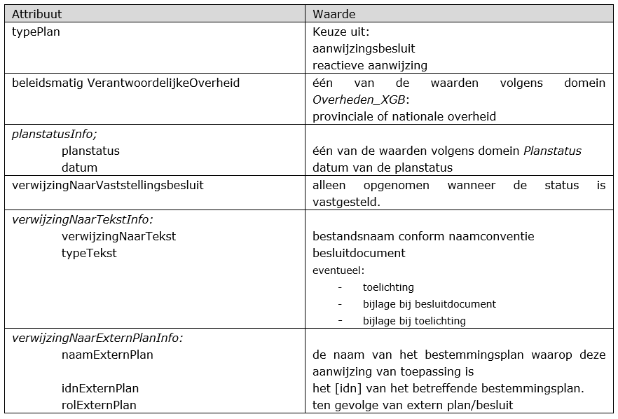
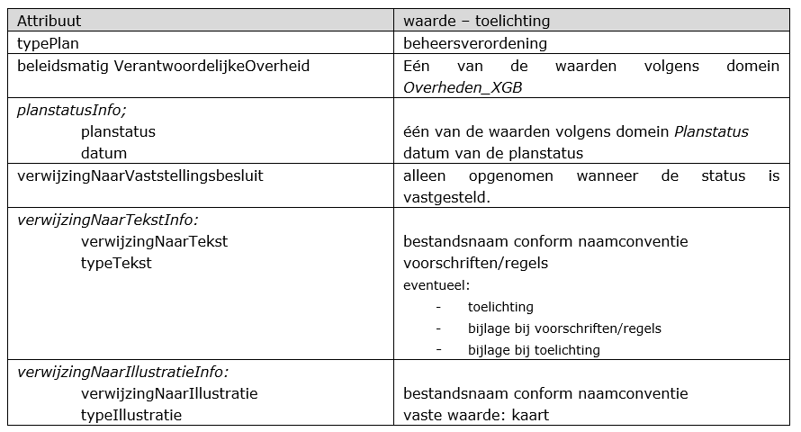
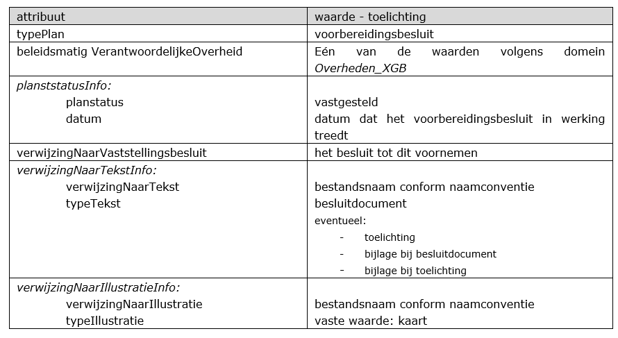

# Verschillende typen gebiedsgerichte besluiten

**In deze praktijkrichtlijn is in het algemeen aangegeven hoe voor de
verschillende gebiedsgerichte besluiten het informatiemodel voor de ruimtelijke
ordening moet worden toegepast. De gebiedsgerichte besluiten kunnen worden
verdeeld in 2 categorieën: een type besluiten waarvan de volledige inhoud in het
instrument zit en een type besluiten waarvan alleen een kennisgeving
gepubliceerd dient te worden met behulp van de RO Standaarden. De
verbijzondering van ieder type gebiedsgericht besluit met betrekking tot het
informatiemodel wordt in dit hoofdstuk toegelicht.**

## Algemeen

Met behulp van IMRO is een zestal gebiedsgerichte besluiten te maken (coderen)
die allemaal op dezelfde manier te maken zijn. Deze gebiedsgerichte besluiten
verschillen echter onderling. De verschillen zorgen er bijvoorbeeld voor dat de
waarden van bepaalde attributen anders worden ingevuld, of dat er andere
informatie nodig is. Algemeen geldt dat [Hoofdstuk 3](#H03) van deze praktijkrichtlijn
moet worden gebruikt bij het maken van het instrument.

In dit hoofdstuk worden de attributen toegelicht die zijn gekoppeld aan het
plangebied van een bepaald gebiedsgericht besluit en die zorgen voor de
onderlinge verschillen tussen deze gebiedsgerichte besluiten. Attributen die in
dit hoofdstuk niet zijn genoemd maar conform IMRO wel verplicht zijn, moeten
evenwel van waarden worden voorzien. Dit hoofdstuk voorziet in een richtlijn de
gebiedsgerichte besluiten met deze attributen op deze wijze te maken (coderen).
Per gebiedsgericht besluit is aangegeven of de tekst bij dat instrument een
beleids-/besluitdocument betreft of dat de type tekst voorschriften/regels zijn.
Dit type tekst is aangeven in dit hoofdstuk voor *Besluitgebied_X*[^1]. Bij de
besluitvlakken en besluitsubvlakken wordt vervolgens verwezen naar delen van
deze tekst. In het geval regels zijn gekoppeld aan het *Besluitgebied_X,* dan
worden wordt bij de besluit(sub)vlakken alleen naar delen van deze type tekst
(regels)verwezen.

[^1]: De voorwaarden hiervoor zijn opgenomen in [IMRO2012](https://ro-standaarden.geonovum.nl/2012/IMRO/1.2/IMRO2012-v1.2.pdf) hoofdstuk 8 OCL Model
Contraints

## Gebiedsgerichte besluiten: inhoud

De gebiedsgerichte besluiten in deze paragraaf zijn besluiten die naast een
contour van het plangebied verschillende planobjecten kennen. De planobjecten
zijn besluitvlakken en besluitsubvlakken in verschillende grootten en
hoeveelheden, verschillend per besluit. Juist deze planobjecten geven de
ruimtelijke inhoud van dit type besluit weer in geometrie en tekst.  
Deze inhoudelijke gebiedsgerichte besluiten zijn:  
-   Aanwijzing;
-   Beheersverordening;
-   Exploitatieplan.  
De besluiten worden achtereenvolgens in de paragraaf behandeld.

### Aanwijzing  
Er zijn twee besluittypen binnen de aanwijzingen: een aanwijzingsbesluit
(proactieve aanwijzing) en reactieve aanwijzing. Een aanwijzing wordt als
gebiedsgericht besluit beschikbaar gesteld door de bronhouder: provincie of het
rijk.

**Aanwijzingsbesluit (proactieve aanwijzing)**  
Gedeputeerde staten of de Minister van IenM kunnen een aanwijzing geven aan een
gemeente respectievelijk gemeente of provincie, tot aanpassing van een
bestemmingsplan, inpassingsplan of verordening, of kunnen een aanwijzing geven
in het kader van concrete situaties.

**Reactieve aanwijzing**  
Wanneer de ingediende zienswijze van gedeputeerde staten of de Minister niet
volledig is overgenomen, of indien de gemeenteraad bij de vaststelling van het
bestemmingsplan wijzigingen heeft aangebracht ten aanzien van het
ontwerpbestemmingsplan anders dan naar aanleiding van een zienswijze van
gedeputeerde staten of de Minister, kan de Minister of Gedeputeerde Staten een
reactieve aanwijzing geven. De reactieve aanwijzing heeft als doel dat het
onderdeel waar de reactieve aanwijzing betrekking op heeft, geen deel blijft
uitmaken van het bestemmingsplan zoals het is vastgesteld.

Attributen en waarden  
Van het *typeTekst* attribuut wordt het besluitdocument bij een aanwijzing
gekoppeld. Eventueel kunnen ook worden gekoppeld: toelichting, bijlage bij
besluitdocument en/of bijlage bij toelichting.
Het besluitdocument wordt gekoppeld aan het object *Besluitgebied_X*. Bij een
besluitvlak en besluitsubvlak wordt verwezen naar (een deel van) het
besluitdocument: de besluittekst.
Bij een aanwijzing dient het attribuut *verwijzingNaarExternPlanInfo* verplicht
te worden ingevuld en te verwijzen naar het plan of besluit waar de aanwijzing
betrekking op heeft.
In Tabel 7 is een samenvatting van de attributen die een bepaalde waarde hebben
bij een aanwijzing weergegeven.

**Tabel 7 Specifieke waarden Besluitgebied_X bij een aanwijzing**

### Beheersverordening  
De beheersverordening is een instrument dat in plaats van een bestemmings­plan
door gemeenten kan worden ingezet. In tegenstelling tot het bestemmingsplan is
de verbeelding van beheersverordening vormvrij. Dit betekent dat er geen
afspraken zijn gemaakt voor de benaming en kleuren van objecten, en de op te
stellen regels zoals in de Standaard Vergelijkbare Bestemmingsplannen
(SVBP2012). De bronhouder bepaalt hoe de verbeelding in kleuren en symboliek
wordt weergegeven.
Er is bij de ontwikkeling van de RO Standaarden 2012 bewust gekozen om de
beheersverordening vormvrij te houden en geen regels voor verbeelding te
hanteren.
De Vereniging Nederlandse Gemeenten (VNG) heeft in 2011 de handreiking
Beheersverordening Wro geactualiseerd. Voor een inhoudelijke toelichting op de
beheersverordening verwijzen we naar deze handreiking[^2].

[^2] : Zie: [http://www.vng.nl/Documenten/actueel/beleidsvelden/recht/2011/20110901_Beheersverordening_Wro.pdf](https://vng.nl/files/vng/vng/Documenten/actueel/beleidsvelden/recht/2011/20110901_Beheersverordening_Wro.pdf)

Attributen en waarden  
Een van de waarden van *typeTekst* is regels. De regels worden gekoppeld aan het
object *Besluitgebied_X*. Bij een besluitvlak en besluitsubvlak wordt verwezen
naar (een deel van) de regels. Eventueel kunnen ook worden gekoppeld:
toelichting, bijlage bij regels en/of bijlage bij toelichting.
Beheersverordeningen kennen geen standaard voor vergelijkbaarheid of afgesproken
kleuren voor de verbeelding. Hierdoor zal de ontvanger zelf moeten bepalen hoe
de beheersverordening wordt weergegeven. Ruimtelijkeplannen.nl geeft dit
gebiedsgerichte besluit in grijstinten weer. De bronhouder kan de plankaart als
PDF koppelen aan het plangebied met behulp van het attribuut
*verwijzingNaarIllustratieInfo.* Het ‘gekleurde plaatje’ is daardoor alleen te
bekijken via de gekoppelde PDF en niet interactief zoals een bestemmingsplan. De
objecten zijn wel raadpleegbaar in de interactieve raadpleegomgeving.
In het geval een bronhouder in een beheersverordening wel gebruik wil maken van
afspraken over vergelijkbaarheid en kleuren conform de SVBP2012 en/of
PRABPBK2012 dan is dit mogelijk door middel van een gekoppelde PDF (gebruik van
het attribuut *verwijzingNaarIllustratieInfo*). De verbeelding kan grofweg op
dezelfde manier worden opgebouwd als bij bestemmingsplan waarbij de
besluitvlakken vergelijkbaar zijn met bestemmingen, besluitsubvlakken met
aanduidingen.

In Tabel 8 is een samenvatting van de attributen die een bepaalde waarde hebben
bij een beheersverordening weggegeven.

**Tabel 8 Specifieke waarden Besluitgebied_X bij een beheersverordening**

### Exploitatieplan  
Het exploitatieplan kent pas sinds de wijziging van het Bro[^3] en RO
Standaarden 2012 een verplichte elektronische beschikbaarstelling. Dit wil
zeggen dat tot de inwerkingtreding van de RO Standaarden 2012 het
exploitatieplan niet was opgenomen in de lijst van instrumenten in artikel 1.2.1
Bro die elektronisch beschikbaar gesteld moeten worden. Vanaf 1 oktober 2012 kan
het exploitatieplan alleen met behulp van de RO Standaarden 2012 beschikbaar
gesteld worden. Aangezien er een overgangsperiode is tot 1 juli 2013, betekent
dit dat het exploitatieplan verplicht conform de RO Standaarden 2012 vanaf 1
juli 2013 beschikbaar moet worden gesteld. Een exploitatieplan kan alleen in een
2012 manifest beschikbaar gesteld worden door de bronhouder.

[^3]: Wijziging van het Bro per 1 oktober 2012, zie toelichting wettelijke
bepalingen op de Geonovum website:
https://www.geonovum.nl/geo-standaarden/ro-standaarden-ruimtelijke-ordening

De Vereniging Nederlandse Gemeenten (VNG) heeft eind 2010 een handleiding voor
het exploitatieplan opgesteld[^4]. Op basis hiervan zijn de specifieke waarden
voor het besluitgebied in Tabel 9 opgesteld. In deze uitwerking is voor het
overzicht niet gebruik gemaakt van objectgerichte planteksten, maar dit is
natuurlijk wel mogelijk.

[^4]: Zie: https://vng.nl/files/vng/vng/Documenten/Extranet/Ruimte/2010/20101122_Handreikingexploitatieplan.pdf

Attributen en waarden  
Een van de waarden van *typeTekst* is regels. De regels worden gekoppeld aan het
object *Besluitgebied_X*. Bij een besluitvlak en besluitsubvlak wordt verwezen
naar (een deel van) de regels. Eventueel kunnen ook worden gekoppeld:
toelichting, bijlage bij regels en/of bijlage bij toelichting.
Het exploitatieplan moet jaarlijks worden herzien. In dat geval zal het
exploitatieplan los van het bestemmingsplan waar het oorspronkelijk samen mee is
vastgesteld, opnieuw worden vastgesteld. De *planstatusInfo* zal dan afwijken
van de *planstatusInfo* van het bestemmingsplan waar het exploitatieplan bij
hoort. Er wordt in dit besluit met behulp van het attribuut
*verwijzingNaarExternPlanInfo* dan nog steeds verwezen naar het betreffende
bestemmingsplan. Ook kan het voorgaande exploitatieplan als verwijzing worden
opgenomen.
Het kaartmateriaal (zie attribuut *verwijzingNaarIllustratieInfo*) dat bij dit
gebiedsgerichte besluit wordt opgenomen is ter illustratie. Het ‘gekleurde
plaatje’ is alleen te bekijken via de gekoppelde PDF en niet interactief zoals
bijvoorbeeld een bestemmingsplan. Hiermee geeft de bronhouder aan hoe het
besluit met de objecten besluitgebied, besluitvlakken en besluitsubvlakken door
de bronhouder is bedoeld.
Gebiedsgerichte besluiten kennen geen standaard voor vergelijkbaarheid of
afgesproken kleuren voor de verbeelding. Hierdoor zal de ontvanger, waaronder
ruimtelijkeplannen.nl dit gebiedsgerichte besluit in grijstinten weergeven.

In Tabel 9 is een samenvatting van de attributen die een bepaalde waarde hebben
bij een exploitatieplan weergegeven.

**Tabel 9 Specifieke waarden Besluitgebied_X bij een exploitatieplan**

## Gebiedsgerichte besluiten: kennisgeving

De gebiedsgerichte besluiten in deze paragraaf zijn besluiten die slechts met de
contour van het besluitgebied worden weergegeven. Het betreft een mededeling
c.q. kennisgeving van de bronhouder gebonden aan een bepaalde locatie.

Deze kennisgeving gebiedsgerichte besluiten zijn:  
-   Gerechtelijke uitspraak
-   Omgevingsvergunning;
-   Voorbereidingsbesluit.

De besluiten worden achtereenvolgens in de paragraaf behandeld.

### Gerechtelijke uitspraak  
In de PRTRI is een uitbreide toelichting op de werkwijze van gerechtelijke
uitspraken opgenomen. In deze paragraaf is toegelicht hoe dit gebiedsgericht
wordt gemaakt en welke informatie erin wordt opgenomen.
Met het inwerkingtreden van de wijziging van het Bro en de RO Standaarden
2012[^5] is de gerechtelijke uitspraak als zelfstandig instrument opgenomen.

[^5]: De basis hiervoor is gelegd in het Bro artikel 1.2.1 lid 3 met de daarbij
behorende toelichting op de pagina 6 en 9 van Nota van Toelichting.

Wanneer zich een van de volgende situaties voordoet, beïnvloedt dit de
inwerkingtreding van een ruimtelijk plan:  
-   Een verzoek om een voorlopige voorziening;
-   Een uitspraak van de rechter daaromtrent;
-   Een uitspraak in beroep tegen een bestemmingsplan;
-   Een aanwijzing van GS of de minister.  
Uitspraak wordt gedaan door de Afdeling bestuursrechtspraak van de Raad van
State (AbRS) of bestuursrechter. Een verzoek om voorlopige voorziening schort de
werking van het besluit mogelijk geheel of gedeeltelijk op, op grond van artikel 8.4 van de Wro. Dit moet dan net als de andere punten zichtbaar gemaakt worden
in combinatie met het betreffende ruimtelijke plan.
De bronhouder van het ruimtelijke plan stelt de gerechtelijke uitspraak (als
kopie van de authentieke informatie van de rechter) als gebiedsgericht besluit
beschikbaar. Op deze wijze kan het in samenhang met, maar tegelijk los van, het
plan worden ontsloten. Het resultaat van de uitspraak zelf is dat het
betreffende ruimtelijke plan niet, deels of geheel onherroepelijk in werking
treedt. Deze informatie wordt als dossierstatus in het manifest opgenomen[^6].

[^6]: Zie hiervoor de toelichting in paragraaf 5.7 van de Praktijkrichtlijn
Toegankelijkheid Ruimtelijke Instrumenten (PRTRI2012), zie
https://www.geonovum.nl/geo-standaarden/ro-standaarden-ruimtelijke-ordening/praktijkrichtlijn-toegankelijkheid-ruimtelijke.

Attributen en waarden  
De *typeTekst* bij een gerechtelijke uitspraak is het besluitdocument. Het
besluitdocument wordt gekoppeld aan het object *Besluitgebied_X*. Eventueel
kunnen ook worden gekoppeld: toelichting, bijlage bij besluitdocument en/of
bijlage bij toelichting.
De status van het gebiedsgerichte besluit *gerechtelijk uitspraak* heeft altijd
de status vastgesteld. De gerechtelijke uitspraak is een document waarin het
besluit en onderbouwing, motivering met betrekking tot deze uitspraak(dictum) is
opgenomen. De tekst die bronhouder opstelt voor de kennisgeving via lokale
bekendmaking en via de Staatscourant kan hiervoor worden gebruikt.
Met behulp van het attribuut *verwijzingNaarExternPlanInfo* kan de relatie met
het bijbehorende plan worden gelegd. Bij een gerechtelijk uitspraak worden 2
verwijzingen opgenomen:  
-   Verwijzing naar het ruimtelijk plan of besluit waar de uitspraak betrekking
    op heeft;
-   Verwijzing naar de uitspraak zelf.

De verwijzing naar de uitspraak kan op verschillende wijzen worden opgenomen.
Dit kan met behulp van het ECLI (European Case Law Identifier)[^7] dat het AbRS
gebruikt. Wanneer de AbRS uitspraak doet, staat dit dezelfde dag op website van
AbRS onder vermelding van het nummer.

[^7]: Het ECLI (European Case Law Identifier is per eind juni 2013 de opvolger
van LJN nummer: het nummer waaronder de uitspraak op rechtspraak.nl is
opgenomen. Per juli 2013 worden geen LJN-nummers meer uitgegeven en alle al
uitgegeven LJN nummers zijn vanaf dan omgezet naar de ECLI.

In Tabel 10 is een samenvatting van de attributen die een bepaalde waarde hebben
bij een gerechtelijke uitspraak weergegeven.

De planstatus van het betreffende ruimtelijke plan is en blijft vastgesteld. De
inhoud van de uitspraak bepaalt de dossierstatus van het dossier waarin het
betreffende plan en de gerechtelijke uitspraak in het manifest zijn geplaatst.

**Tabel 10 Specifieke waarden Besluitgebied_X bij een gerechtelijk uitspraak**

### Omgevingsvergunning  
De bronhouder is verplicht om de mededeling (kennisgeving in de Staatscourant)
van een met artikel 2.12, eerste lid, onderdeel a, onder 3 van de Wabo verleende
omgevingsvergunning met behulp van de RO Standaarden beschikbaar te stellen. In
het Besluit Omgevingsrecht (Bor) artikel 6.14 is aangegeven dat bij ministeriële
regeling nadere regels worden gesteld over de wijze waarop de mededeling
elektronisch wordt gedaan en beschikbaar gesteld. Dit betreft de ministeriële
Regeling standaarden ruimtelijke ordening 2012. In IMRO2012 en STRI2012 is de
dit type omgevingsvergunning daarom opgenomen. In deze paragraaf van de
toelichting op de RO Standaarden (deze praktijkrichtlijn) lichten we de
werkwijze toe[^8].

[^8]: In het Besluit Omgevingsrecht (Bor) artikel 6.14 is aangegeven dat bij
ministeriële regeling nadere regels worden gesteld over de wijze waarop de
mededeling van een met artikel 2.12, eerste lid, onderdeel a, onder 3 van de
Wabo *verleende* omgevingsvergunning elektronisch wordt gedaan en beschikbaar
gesteld. De nadere regels zijn gegeven in de ministeriële Regeling standaarden
ruimtelijke ordening 2012: het gebruik van het Informatiemodel Ruimtelijke
Ordening (IMRO) en Standaard Toegankelijkheid Ruimtelijke Instrumenten (STRI) is
daardoor verplicht. Deze praktijkrichtlijn (PRGB2012) is een toelichting op het
IMRO2010 voor de toepassing in de praktijk.
De kennisgeving van de omgevingsvergunning is de tekst die de bronhouder opstelt
en bekendmaakt via de Staatscourant. De bronhouder koppelt de kennisgeving aan
een contour van de betreffende locatie. Het is geheel vrijblijvend en aan de
bronhouder te bepalen of meer informatie dan de kennisgeving, zoals de
ruimtelijke onderbouwing, aan dit gebiedsgericht besluit wordt gekoppeld. In de
praktijk wordt de ruimtelijke onderbouwing vaak aan de kennisgeving toegevoegd.
De omgevingsvergunning om af te wijken van een bestemmingsplan wordt als een
gebiedsgericht besluit beschikbaar gesteld door de bronhouder. Doordat de
bronhouder de kennisgeving conform de RO Standaarden beschikbaar stelt op haar
weblocatie, wordt deze opgehaald door de landelijke voorziening[^9] en is te
raadplegen via https://www.ruimtelijkeplannen.nl/ [^10]. Voor andere onderdelen dan het
hier genoemde type omgevingsvergunning kent de Wabo geen verplichting tot
elektronische beschikbaarstelling van een omgevingsvergunning.

[^9]: Landelijke voorziening: Ruimtleijkeplannen.nl. De bronhouder heeft aan de
index van de landelijke voorziening bekend gemaakt wat de weblocatie is van de
bronhouder. Op deze weblocatie wordt met behulp van een manifest inzicht gegeven
in de door de bronhouder beschikbaar gestelde data. RO-Online haalt iedere nacht
nieuwe en gewijzigde data op. Zo ook de kennisgeving van een omgevingsvergunning
om af te wijken van het bestemmingsplan. Op ruimtelijkeplannen.nl is vervolgens
de kennisgeving in combinatie met de contour te raadplegen.

[^10]: Voor inwerking treden van de Wabo was deze vorm van de
omgevingsvergunning in de Wro opgenomen als projectbesluit. Vanaf 1 oktober 2010
was het al verplicht de kennisgeving digitaal beschikbaar te stellen conform de
RO Standaarden 2008. Dit is toegelicht in de werkafspraak *Elektronisch
publiceren kennisgeving omgevingsvergunning*. Met het in gebruik nemen van de RO
Standaarden 2012 komt deze werkafspraak te vervallen.

Attributen en waarden  
De kennisgeving betreft de mededeling dat de omgevingsvergunning is verleend.
Deze tekst wordt opgenomen als *besluitdocument*. Het besluitdocument wordt
gekoppeld aan het object *Besluitgebied_X*. De tekst van de kennisgeving wordt
eveneens opgenomen als *vaststellingsbesluit*. In het geval de bronhouder
redenen heeft om de ruimtelijke onderbouwing aan het besluit toe te voegen, dan
kan deze worden opgenomen als toelichting of als onderdeel van het
besluitdocument. Eventueel kunnen ook worden gekoppeld: toelichting, bijlage bij
besluitdocument en/of bijlage bij toelichting. Het vaststellingsbesluit is
verplicht bij de planstatus *vastgesteld*.
De kennisgeving van de omgevingsvergunning is het type gebiedsgerichte besluit
dat door de bronhouder met de planstatus *vastgesteld* beschikbaar wordt
gesteld. De reden hiervoor is dat de kennisgeving pas beschikbaar wordt gesteld
(conform wet- en regelgeving) als de omgevingsvergunning *is verleend*. De
bronhouder kan er voor kiezen om een concept of ontwerp omgevingsvergunning te
publiceren, dit is niet verplicht en wijkt daarmee af van de voorgeschreven wet-
en regelgeving.

In Tabel 11 is een samenvatting weergegeven van de attributen die een bepaalde
waarde hebben bij een omgevingsvergunning. In de werkafspraak RO Standaarden vs.
Wabo is aangegeven dat de naam dient te beginnen met ‘omgevingsvergunning’. Bij
het gebruik van de RO Standaarden 2012 is dit niet meer nodig omdat dit nu met
het *typePlan* is aan te geven.

**Tabel 11 Specifieke waarden Besluitgebied_X bij een omgevingsvergunning**

### Voorbereidingsbesluit  
Met dit instrument geeft een bronhouder aan voornemens te zijn een ruimtelijk
plan als een bestemmingsplan, inpassingsplan, provinciale verordening of AMvB op
te stellen. Om inzicht te geven voor welk deel van het grondgebied dit voornemen
geldt, volgt het besluitgebied de grens van het gebied waarop dit
voorbereidingsbesluit betrekking heeft. Het voorbereidingsbesluit kent een eigen
begrenzing die niet dezelfde hoeft te zijn als de begrenzing van het te zijner
tijd op te stellen ruimtelijk plan. Het besluit tot dit voornemen wordt
opgenomen in het vaststellingsbesluit.

Attributen en waarden  
Nadere regels met betrekking tot het voorbereidingsbesluit worden opgenomen in
de regels bij een voorbereidingsbesluit. De regels worden gekoppeld aan het
object *Besluitgebied_X*. Eventueel kunnen ook worden gekoppeld: toelichting,
bijlage bij besluitdocument en/of bijlage bij toelichting.
De regels kunnen echter een deel van het gebied bestrijken waarover het
voorbereidingsbesluit zich uitstrekt. Zowel gebruiksregels als regels ten
aanzien van werken, geen bouwwerken zijnde, kunnen worden toegevoegd aan
besluitvlak(ken). Elk zo nodig met een eigen werkingsgebied binnen het
besluitgebied.

In Tabel 12 is een samenvatting van de attributen die een bepaalde waarde hebben
bij een voorbereidingsbesluit weergegeven.

**Tabel 12 Specifieke waarden Besluitgebied_X bij een voorbereidingsbesluit**

