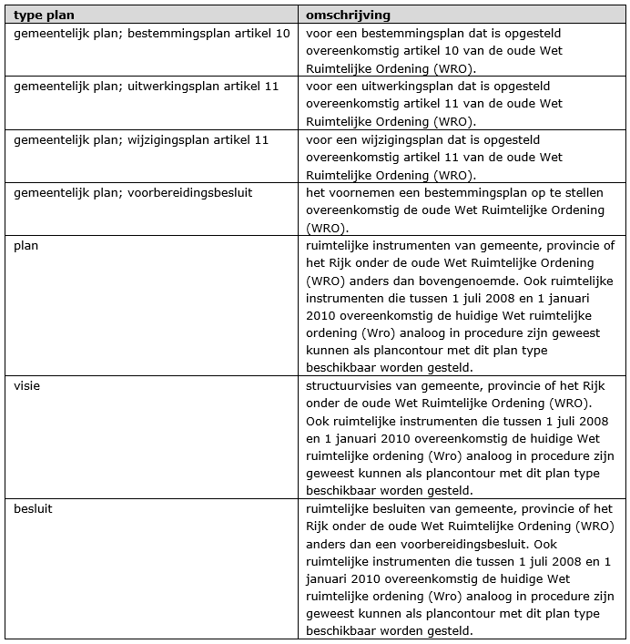

## Planobject en attributen

**Er is maar één object, namelijk ‘plangebied’. Dit object heeft informatie over het ruimtelijk plan en de plancontour en de tekst(en) zijn gekoppeld.**

### Codering plangebied plancontour & PDF

Elk ruimtelijk plan, visie en besluit van gemeente, provincie of het Rijk onder de oude Wet Ruimtelijke Ordening (WRO) wordt apart als contour beschikbaar gesteld. Ook ruimtelijke plannen, visies en besluiten die tussen 1 juli 2008 en 1 januari 2010 overeenkomstig de huidige Wet ruimtelijke ordeningen (Wro) analoog in procedure zijn geweest kunnen als plancontour met dit plan type beschikbaar worden gesteld.

De planonderdelen van dat ruimtelijk plan, visie of besluit worden als PDF ‘toegevoegd’ aan het plangebied. Onder planonderdelen wordt verstaan:

<ul><li>plankaart;</li>
<li>voorschriften/regels;</li>
<li>toelichting; </li>
<li>bijlage bij voorschriften/regels; </li>
<li>bijlage bij toelichting;</li>
<li>besluitdocument;</li>
<li>beleidsdocument.</li>
</ul>

Voor de vereisten van beschikbaarstelling van een plancontour & PDF wordt verwezen naar STRI2006.

In <a href='#_Ref300579421'>Tabel 1 worden de attributen behorend bij de plancontour benoemd, de waarden aangegeven die deze attributen moeten bevatten en wordt aangegeven of het gebruik van attribuut verplicht is en of het attribuut meerdere malen mag worden gebruikt. Na de tabel wordt per attribuut een nadere toelichting gegeven. 
  
 

Hierna wordt per attribuut een nadere toelichting gegeven. 

<b>identificatie</b> (verplicht)

De identificatie van de plancontour wordt opgebouwd conform IMRO2006:

"NL.IMRO.", vervolgens wordt het CBS-nummer van de bronhouder opgenomen en aansluitend een uniek plannummer, door de bronhouder te bepalen.

De identificatiecode heeft daardoor de volgende opbouw: NL.IMRO.,CBSnummer van de bronhouder (4 cijfers), in het geval een gemeente facultatief aangevuld met het CBS-nummer voor buurt en wijk of anders aangevuld met 4 nullen; totaal derhalve altijd 8 posities lang. Het daarop volgende plannummer heeft een maximale lengte van 15 posities en mag ook bestaan uit letters. Het laatste teken is altijd een koppelstreepje, ascii 45 (-). De totale lengte bedraagt dan maximaal 32 tekens. De identificatie wordt daardoor: NL.IMRO.xxxxxxxxyyy….- Voorbeeld: NL.IMRO.1282000026B-. 

<b>typePlan</b> (verplicht)

voor het attribuut <i>typePlan</i> wordt het domein <i>RuimtelijkPlanOfBesluit_PCP</i> gebruikt. Voor de waarde zijn er verschillende mogelijkheden zoals genoemd in <a href='#_Ref300562362'>Tabel 2. 

Voor alle ruimtelijke instrumenten die overeenkomstig de oude Wet Ruimtelijke Ordening (WRO) in procedure zijn geweest kunnen met behulp van plancontour & PDF door de bronhouder beschikbaar worden gesteld. 

Dit geldt voor gemeenten, provincies en het rijk. Plannen die eveneens door deze overheden beschikbaar kunnen worden gesteld met van plancontour & PDF zijn die plannen die 1 juli 2008 en 1 januari 2010 overeenkomstig de huidige Wet ruimtelijke ordeningen (Wro) analoog in procedure zijn geweest. Wanneer een dergelijk plan conform IMRO2008 is opgesteld, is/ wordt deze met behulp van RO Standaarden 2008 door de bronhouder beschikbaar gesteld, indien gewenst. In het geval van dit analoge plan geen digitale versie is gemaakt kan dit plan met behulp van PRPCP2008/ STRI2006 alsnog door de bronhouder beschikbaar worden gesteld. 

Voor het digitaal beschikbaar stellen van een voorbereidingsbesluit conform de huidige Wet ruimtelijke ordeningen (Wro) dient de huidig geldende RO Standaarden (2008 of later) te worden gebruikt. Dit geldt ook voor de ruimtelijke instrumenten die vanaf 1 januari 2010 in procedure zijn gegaan/ nu nog gaan. 

**Tabel 2 Type ruimtelijke instrumenten als plancontour**

</img>
<b>beleidsmatigVerantwoordelijkeOverheid</b> (verplicht)

Hier wordt de overheid die beleidsmatig verantwoordelijk is voor het opstellen van het plan opgenomen uit het domein <i>Overheden_BP.</i> In dit geval een van de volgende vaste waarden: 

<ul><li>gemeentelijke overheid;</li>
<li>deelgemeente/stadsdeel; </li>
<li>provinciale overheid of</li>
<li>nationale overheid. </li>
</ul>

<b>naamOverheid</b> (verplicht)

Hier wordt de naam van de beleidsmatig verantwoordelijke overheid opgenomen, in de vorm van de tekst “gemeente …….”, “deelgemeente ……”, "stadsdeel ……", “provincie …….” of “ministerie …….”.

<b>overheidsCode</b> (verplicht)

Teneinde kenbaar te maken van welke beleidsmatig verantwoordelijke overheid het gebiedsgerichte besluit is, wordt hier het viercijferige CBS-nummer van die overheid opgenomen. Voor deelgemeenten/stadsdelen wordt het nummer gebruikt van de gemeente waartoe zij behoren. Voor de provincies worden, voorafgaand aan het CBS-nummer van de provincie, twee voorloopnegens geplaatst, zodat de totale lengte 4 posities bedraagt. Voor het Rijk wordt het nummer "0000" gebruikt.

<b>naam</b> (verplicht)

In het waardeveld van het attribuut <i>naam</i> dient de naam van het ruimtelijke instrument te worden opgenomen zoals deze volgens de aanhaaltitel in het plan, visie besluit wordt genoemd. De volledige naam wordt gebruikt, inclusief het eventuele voorafgaande woord "bestemmingsplan", "inpassingsplan", "Rijksbestemmingsplan" enz.

<b><i>planstatusInfo</i></b> (verplicht)

Dit attribuut is noodzakelijk om de plangegevens te kunnen plaatsen naar tijd en belang. Het samengesteld attribuut <i>planstatus</i> verwijst naar het object <i>Planstatus</i><i>En</i><i>Datum</i>, bestaande uit de attributen:

<b>planstatus</b> (verplicht)

Het domein <i>Planstatus_</i><i>PCP</i> geeft de toegestane waarden voor het attribuut <i>planstatus</i> waaruit er één moet worden gekozen. De waarde van dit attribuut geeft de planstatus weer.

<b>datum</b> (verplicht)

Het attribuut <i>datum</i> is bedoeld om de proceduredatum van het plan op te nemen. De in het waardeveld op te nemen datum dient overeenkomstig het binnen het IMRO afgesproken datumformaat te worden genoteerd: jjjj-mm-dd. 

<b><i>verwijzingNaarTekstInfo</i></b> (verplicht)

Het samengestelde attribuut <i>verwijzingNaarTekstInfo</i> bestaat uit de attributen <i>verwijzingNaarTekst</i> en <i>typeTekst</i>. Teneinde een zo beperkt mogelijk aantal verwijzingen naar teksten te verkrijgen is het aantal keren dat het attribuut <i>verwijzingNaarTekstInfo</i> mag worden gebruikt beperkt. De raadpleger van de plannen heeft daar baat bij, omdat hij dan niet direct geconfronteerd wordt met een mogelijk lange lijst van verwijzingen. Daarom moet er maximaal één verwijzing zijn naar de plankaart en maximaal één naar de bijbehorende tekst uit het domein <i>Teksttype_PCP</i>. Daarnaast mag er maximaal één verwijzing zijn naar alle eventuele bijlagen. 

<b>verwijzingNaarTekst</b> (verplicht)    

Dit attribuut is bedoeld om (hyper)links te kunnen opnemen. Hier dient een (hyper)link naar het soort document dat is aangegeven bij het attribuut <i>typeTekst</i> te worden opgenomen. Het format dient overeenkomstig de afspraak over de bestandsnaamconventies conform de STRI2006 te zijn.

<b>typeTekst</b> (verplicht)

Hiermee wordt aangegeven om wat voor type tekst het gaat of het de plankaart betreft. Per verwijzing naar tekst (kaart) dient gekozen te worden uit een van de volgende waarden van het domein <i>TeksttypePG_PCP</i>:

<ul><li>plankaart;</li>
<li>voorschriften/regels;</li>
<li>toelichting;</li>
<li>bijlage bij regels;</li>
<li>bijlage bij toelichting;</li>
<li>besluitdocument; </li>
<li>beleidsdocument.</li>
</ul>

<b>verwijzingNorm</b> (verplicht)

Teneinde de zekerheid te hebben welke technische status de data hebben, is het noodzakelijk dat wordt aangegeven aan welke IMRO versie de gegevensset voldoet. Tevens moet een verwijzing worden opgenomen naar de gebruikte versie van de praktijkrichtlijn. Het attribuut <i>verwijzingNorm</i> dient dus twee keer te worden opgenomen met de verwijzing naar de betreffende versies in het waardeveld. Dit zijn de vaste waarden IMROPCP2008 en PRPCP2008.

<b>geometrie</b> (verplicht)

Een plancontour kent uitsluitend de geometrie van een vlak of multivlak (multipolygoon). Dit attribuut kent daarom coördinaten in een vastgesteld format (gml) en kan door een applicatie automatisch worden gegenereerd.

