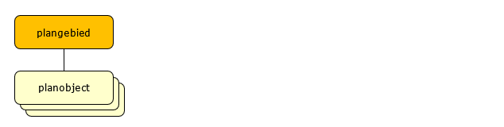

# Modelmatige opbouw
**In dit hoofdstuk wordt de algemene modelmatige opbouw van objectgerichte teksten
geschetst inclusief de relatie met IMRO objecten.**

## De objectbenadering van IMRO2012 en objectgerichte planteksten
Het IMRO2012 definieert de objectgerichte benadering binnen de ruimtelijke
ordening. De digitale verbeelding wordt ontleed tot haar samenstellende
(geometrisch bepaalde) delen. Het IMRO2012 kent hierbij plangebieden en
planobjecten. De planobjecten bevinden zich altijd binnen een plangebied.

  
**Figuur 1 Algemene modelopbouw IMRO2012**

Planteksten kunnen ook gezien worden als een verzameling objecten. In het
onderliggende model bestaat het plantekstenbestand uit twee soorten objecten:
TekstMetadata en TekstObject. Daarbij worden alle onderdelen met een nummer
en/of een titel als TekstObject beschouwd. TekstMetadata bevat de kenmerken die
horen bij alle TekstObjecten samen. Omdat het om ruimtelijke plannen gaat zijn
TekstMetadata en alle TekstObjecten altijd met een plangebied verbonden.

  
**Figuur 2 Relatie tussen plangebied en tekstobjecten**

IMRO2012 noemt deze objectsoorten (TekstMetadata en TekstObject) **Klassen**.  
Elke klasse kent eigenschappen die als attributen worden toegekend. Voor
objectgerichte planteksten is een uitbreiding op IMRO2012 gemaakt.

In het IMRO2012 zijn voor de verschillende soorten instrumenten specifieke
versies van plangebieden en planobjecten gemaakt. Zo heet de klasse plangebied
voor bestemmingsplannen ‘bestemmingsplangebied’ en is een ‘bestemmingsvlak’ een
voorbeeld van een klasse planobject. Bij objectgerichte planteksten wordt dit
onderscheid niet gemaakt. Voor ieder ruimtelijk instrument zijn alleen de
klassen TekstMetadata en TekstObject in gebruik. Voor de verschillende
instrumenten zijn er mogelijk wel verschillen in de mogelijke waardes van de
attributen.  

Voor bestemmingsplannen ontstaat zo het totaalbeeld van een geometrie en tekst
in één mode als weergegeven in Figuur 3.  

  
**Figuur 3 Modelopbouw Bestemmingsplan IMRO2012 inclusief tekstobjecten**

## De basisindeling van objectgerichte teksten
Dit is aangegeven in Hoofdstuk 3 van IMROPT2012.  

Ieder TekstObject is een zelfstandig leesbaar stuk, heeft een titel, begint met
een hoofdletter en eindigt met een punt. Een TekstObject kan bijvoorbeeld zijn
een hoofdstuk, paragraaf, of een sublid. Verschillende TekstObjecten vormen
samen een ander TekstObject: verschillende paragrafen vormen samen 1 hoofdstuk.
De identificatie van ieder TekstObject is uniek en daardoor traceerbaar, maar
vooral: koppelbaar.  

Ieder ruimtelijk instrument kent wat betreft planteksten een eigen
basisindeling. In Hoofdstuk 3 van IMROPT2012 is voor drie verschillende groepen
ruimtelijke instrumenten de opbouw van de planteksten vastgelegd.

## Verbeelding van geometrie en tekst
In ruimtelijke plannen zijn geometrie en tekst sterk met elkaar verbonden. In
het IMRO2012-model is om die reden een verwijzingNaarTekst voorzien. Dit
attribuut vormt het “bruggenhoofd” naar zowel niet-objectgerichte planteksten
(HTML en/of PDF) als objectgerichte planteksten (XML). Met objectgerichte
teksten zijn mogelijkheden uitgebreider:

**Precies verwijzen**  
Elk onderdeel van een objectgerichte tekst kent een eigen identificatie,
waardoor preciezer kan worden verwezen.

**Enkelzijdig verwijzen**  
Verwijzen van geometrie naar tekst en omgekeerd is in principe mogelijk omdat
beide kanten gebruik maken van de XLink verwijzingstechniek. In IMRO2012 is
vanwege de eenduidigheid echter gekozen voor een enkelzijdige verwijzing: van
kaart naar tekst.

**Presentatie versus representatie**  
Objectgerichte teksten hebben als doel het uitwisselen van de inhoud van
ruimtelijke planteksten mogelijk te maken. De verbeelding (de opmaak) moet los
hiervan worden geregeld. In zeer beperkte mate kan opmaak/verbeelding worden
uitgewisseld Het gaat dan om zaken als *nadruk* of **sterke nadruk**. Echte
opmaak zoals lettertype en tekstgrootte wordt niet mee uitgewisseld. De
ontvanger van het bestand kan met de inhoud van het bestand weer een volledige
tekst opbouwen en een eigen weergave kiezen.  

## Uitgangspunt uit te wisselen gegevens
Uitgangspunt voor deze praktijkrichtlijn is dat alle teksten die onderdeel zijn
van ieder mogelijk type ruimtelijk instrument zoals genoemd in paragraaf 1.2
toegankelijk zijn. Dat betekent dat het bestand met het plantekstenbestand
compleet is. Op basis van deze praktijkrichtlijn wordt dus altijd de gehele
inhoud van het instrument gereconstrueerd.  
Hiermee is het plantekstenbestand een aanvulling op de geometrisch georiënteerde
bepalingen van IMRO2012 en de bijbehorende praktijkrichtlijnen en kan uit de
twee bestanden (voor geometrie, resp. tekst) dus altijd een volledig plan worden
gereconstrueerd, afgezien van mogelijke bijlagen.
