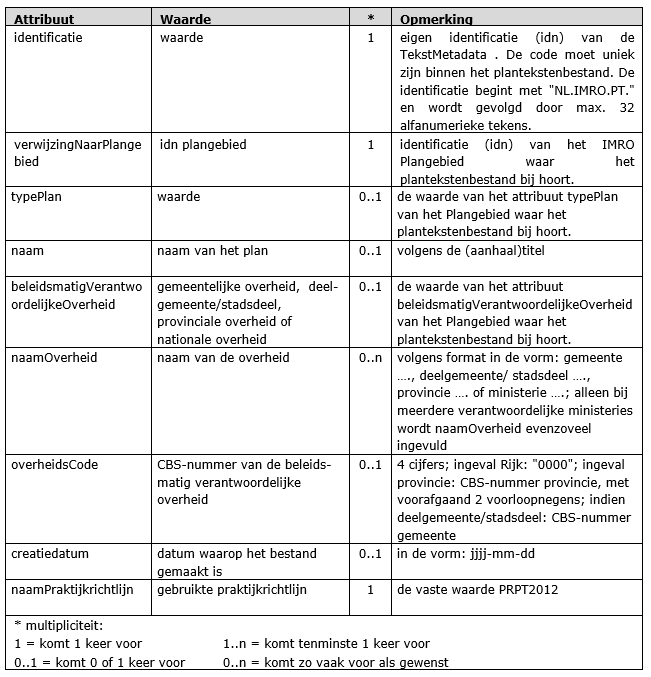

# De planobjecten met attributen
**Een klasse, te beschouwen als een objecttype, kent attributen die de
eigen­schappen van dat object­type geven. In dit hoofdstuk worden de klassen
(objec­ttypen) met bijbe­horende attributen be­schreven.**

## Klasse TekstObject
Het object (de klasse) *TekstObject* is het object dat een individueel
tekstonderdeel represen­teert. Ieder TekstObject is een zelfstandig leesbaar
stuk, heeft een titel, begint met een hoofdletter en eindigt met een punt. Een
TekstObject kan bijvoorbeeld zijn een hoofdstuk, paragraaf, of een sublid. Aan
dit object worden de algemene ei­gen­schappen van het tekstonderdeel als
attribuut ge­koppeld.

In Tabel 1 zijn de attributen benoemd, de waarden aangegeven die deze attributen
kunnen bevatten en wordt aangegeven of het gebruik van het attribuut ver­plicht
is en of het attribuut meerdere malen mag worden gebruikt (multipliciteit). Ook
is aangege­ven of het sa­mengestelde attributen betreffen, dat wil zeggen altijd
in samenhang moeten worden gebruikt. Na de tabel is per attribuut een nadere
toelichting gegeven.

**Tabel 1 Klasse TekstObject 1..n\***  
  

**identificatie** (verplicht)  
Ieder TekstObject behoeft een eigen identificatie. Deze identificatie bestaat
uit een binnen het plantekstenbestand uniek nummer per object. Dit nummer begint
met “NL.IMRO.PT.” gevolgd door maximaal 32 vrij te gebruiken alfanumerieke
tekens. De lengte van de identificatie is daardoor maximaal 43 alfanumerieke
tekens. Samen met het attribuut verwijzingNaarPlangebied levert dit een unieke
identificatie op.

**verwijzingNaarPlangebied** (verplicht)  
Voor elk object is een verwijzing noodzakelijk naar het IMRO Plangebied waar het
object bij hoort. Dit attribuut verwijst daarom naar het attribuut identificatie
van het bijbehorende IMRO Plangebied object.

**volgnummer** (verplicht)  
Het volgnummer geeft de volgorde binnen de tekst aan. Het eerste TekstObject
krijgt volgnummer 1, het tweede TekstObject krijgt volgnummer 2, enzovoort tot
aan het laatste TekstObject. Dit nummer mag niet verward worden met de
identificatie of het nummer.

**niveau** (verplicht)  
Alle TekstObjecten krijgen een niveau aanduiding mee. Hiermee is het mogelijk
een tekst netjes op te bouwen en opmaakkenmerken voor een hele tekst in één keer
te regelen. Er is slechts één TekstObject met niveau nul. Verder mogen er geen
tussenliggende niveaus ontbreken. Dit betekent dat het niveau van het
bovenliggend TekstObject waar via het ouderId attribuut naar wordt verwezen
altijd precies één niveau hoger is (numerieke waarde 1 lager) dan het niveau van
het actuele TekstObject, met uitzondering van het TekstObject met niveau nul,
dat naar zichzelf verwijst.

**ouderId** (verplicht)  
Elk TekstObject verwijst naar het TekstObject waar het bij hoort (een paragraaf
is onderdeel van een hoofdstuk bijvoorbeeld). Bij een TekstObject met niveau nul
wordt de identificatie (idn) van het actuele TekstObject ingevuld, waarmee het
naar zichzelf verwijst. Het ligt voor de hand dat deze attribuutwaarde
automatisch wordt gegenereerd. Uiteraard moet de ingevulde waarde bestaan binnen
het plantekstenbestand.

**type** (verplicht)  
Bepaalde onderdelen van het plantekstenbestand hebben een vaste functie. Denk
hierbij aan de hoofdstukindeling en de vaste onderdelen van het
bestemmingsartikel zoals in de SVBP is geregeld. De lijst die daarin is
opgenomen is voor het domein ObjecttypePlan gebruikt. Voor andere plantypen zijn
meer algemene termen als “hoofdstuk” en “paragraaf” beschikbaar in
ObjecttypePlan, ObjecttypeVisie en ObjecttypeBesluit. De toepassing hiervan is
beschreven in Hoofdstuk 3 van IMROPT. Met het gebruik van dit attribuut wordt
duidelijk wat het doel is van een bepaald stuk tekst.

**typeTekst** (facultatief)  
Hiermee wordt aangegeven om wat voor type tekst het gaat. Per verwijzing naar
tekst dient gekozen te worden uit een van de volgende waarden van het domein
Teksttype.

***titelInfo*** (verplicht)  
Dit attribuut bepaalt de aanhef van een TekstObject. Het samengesteld attribuut
*titelInfo* verwijst naar het object *TitelInfo*. De TitelInfo bestaat uit drie
onderliggende attributen die allemaal afzonderlijk leeg gelaten mogen worden,
maar waarvoor verder geldt dat tenminste één van de drie met een niet-lege
waarde moet zijn gevuld, zodat er nooit een lege titel ontstaat. Verder kunnen
er vanuit de SVBP eisen worden gesteld aan de waarden voor dit attribuut. De
titel is opgebouwd uit de volgende attributen:  
**label** (facultatief)  
De tekstobjecten worden voorzien van een soortnaam van het object. Dit kan
bijvoorbeeld zijn "hoofdstuk"of "artikel". Deze labels kunnen in een koptekst
worden opgenomen. Vaak zal het label overeen komen met het type. Het label is
echter gericht op de verschijningsvorm/verbeelding van de tekst, terwijl het
type naar de functie van een tekst verwijst.  
**nummer** (facultatief)  
Een nummer is meestal een opvolgende reeks. (1,2,3 of A,B,C). In principe wordt
er een doornummerende reeks opgebouwd. Het kan nodig zijn hiervan af te wijken
en een nummering zoals "2a" toe te passen.  
**naam** (facultatief)  
Elk tekstobject heeft een titel. Deze werkwijze maakt leesbare teksten en
transparante verwijzingsmechanismes mogelijk.  

**interneVerwijzing** (facultatief)  
Een interne verwijzing kan objecten binnen de tekst met elkaar verbinden. In een
vieweromgeving kan dit bijvoorbeeld opleveren dat de specifieke toelichting bij
een bepaalde regel direct bij de regel benaderbaar is. Interne verwijzingen
worden gelegd vanuit het object waar ze bij horen. De toelichting bij het
bestemmingsartikel wonen wordt dus gekoppeld vanuit de regel. Het is wel
toegestaan ook in de toelichting een verwijzing te maken. Dan is er ook vanuit
de toelichting een rechtstreekse toegang tot het artikel te realiseren.  
De interneVerwijzing kan als attribuut bij een object worden opgenomen of in de
tekst worden opgenomen. Een verwijzing in de tekst werkt als een hyperlink. Een
verwijzing als attribuut kan door viewers worden geïnterpreteerd om categorieën
als “zie ook” of “zie verder” te vullen.

**externeVerwijzing** (facultatief)  
Vanuit de planteksten kan worden verwezen naar andere bronbestanden waaruit het
instrument is opgebouwd. Dit wordt gedaan door de bestandsnaam van het
gerefereerde bronbestand op te nemen. Zo kan er vanuit de planteksten eenvoudig
worden verwezen naar bijlagen en illustraties. Er kan niet worden verwezen naar
bronnen die geen onderdeel zijn van het instrument. De waarde van dit attribuut
moet voldoen aan de vereisten die in paragraaf 4.2 van de STRI2012 worden
gesteld aan de bestandsnaam van een bronbestand, eventueel gevolgd door een
“fragment identifier” \#. In paragraaf 2.3 van IMROPT wordt dit nader
gespecificeerd.  
De externeVerwijzing kan als attribuut bij een object worden opgenomen of in de
tekst worden opgenomen. Een verwijzing in de tekst werkt als een hyperlink. Een
verwijzing als attribuut kan door viewers worden geïnterpreteerd om categorieën
als “zie ook” of “zie verder” te vullen.  

*Voorbeeld: In de toelichting van een bestemmingsplan kan bijvoorbeeld worden
verwezen naar een Notitie van uitgangspunten, die als bijlage bronbestand in PDF
formaat is toegevoegd aan het plan. Op de plek in de toelichting waar dit
relevant is, kan een hyperlink worden opgenomen zodat in een vieweromgeving
direct naar dit stuk kan worden verwezen.*

**tekstMetadata** (conditioneel)  
Verwijzing naar de metadata van dit bestand. Hiermee is een link opgenomen naar
de algemene gegevens die van toepassing zijn op de hele tekst. Deze verwijzing
mag maar 1 keer opgenomen worden en komt daarom alleen, verplicht, voor bij de
teksttypen document en besluitdocument

**tekst** (facultatief)  
dit attribuut bevat de daadwerkelijke tekstinhoud. Hier vinden de cijfer- en
lettertekens die samen een tekst vormen hun plek.  
Deze tekst mag worden opgemaakt met een beperkte set van XHTML coderingen,
aangevuld met enkele specifieke codes. Wat er in de tekst mag worden opgenomen
staat beschreven in paragraaf 2.3 van IMROPT.

## Klasse TekstMetaData
Gegevens over gegevens worden metadata genoemd. In IMROPT2012 zijn bij de klasse
*TekstMetadata* regels opgenomen over de in het tekstbestand op te nemen
metadata. In Tabel 2 wordt klasse *TekstMetadata* toegelicht.

**Tabel 2 Klasse TekstMetadata 1\***

**identificatie** (verplicht)  
Elke object binnen het plantekstenbestand behoeft een eigen identificatie. Deze
identificatie bestaat uit een binnen het plantekstenbestand uniek nummer per
object. Dit nummer begint met “NL.IMRO.PT.” en wordt gevolgd door maximaal 32
vrij te gebruiken alfanumerieke tekens. De lengte van de identificatie is
daardoor maximaal 43 alfanumerieke tekens. Samen met het attribuut
verwijzingNaarPlangebied levert dit een unieke identificatie op.

**verwijzingNaarPlangebied** (verplicht)  
Voor elk object is een verwijzing noodzakelijk naar het IMRO Plangebied waar het
object bij hoort. Dit attribuut verwijst daarom naar het attribuut identificatie
van het bijbehorende IMRO Plangebied object.

**typePlan** (facultatief)  
Voor dit attribuut wordt de waarde van typePlan behorende bij het IMRO
plangebied gespecificeerd.

**naam** (facultatief)  
In het waardeveld van het attribuut *naam* dient de naam van het ruimtelijk
instrument te worden op­genomen. Het gaat daarbij om de volledige naam. Indien
er sprake is van een aanhaaltitel dan wordt deze gebruikt.

**beleidsmatigVerantwoordelijkeOverheid** (facultatief)  
Hier wordt de overheid die beleidsmatig verantwoordelijk is voor het opstellen
van het plan opgeno­men*.* In dit geval een van de volgende vaste waarden:  
-   gemeentelijke overheid
-   deelgemeente/stadsdeel
-   provinciale overheid
-   nationale overheid.

**naamOverheid** (facultatief)  
Hier wordt de naam van de beleidsmatig verantwoordelijke overheid opgenomen, in
de vorm van de tekst “gemeente …….”, “deelgemeente ……”, "stadsdeel ……",
“provincie …….” of “ministerie …….”. In het geval er meerdere verantwoordelijke
ministeries zijn, wordt naamOverheid evenzoveel ingevuld,

**overheidsCode** (facultatief)  
Teneinde kenbaar te maken van welke beleidsmatig verantwoordelijke overheid het
ruimtelijk instrument is, wordt hier het viercijferige CBS-nummer van die
overheid opgenomen. Voor deelgemeen­ten/­stadsdelen wordt het nummer gebruikt
van de gemeente waartoe zij behoren. Voor de provincies worden, voorafgaand aan
het CBS-nummer van de provincie, twee voorloop negens geplaatst, zodat de totale
lengte 4 posities bedraagt. Voor het Rijk wordt het nummer "0000" gebruikt.

**creatiedatum** (facultatief)  
Datum waarop de plantekst is gemaakt. Formaat in de in de vorm: jjjj-mm-dd.

**naamPraktijkrichtlijn** (verplicht)  
Om de ontvanger duidelijk te maken welke gegevens hij ontvangt en welke status
aan deze gegevens mag worden toegekend is het noodzakelijk om aan te geven dat
de gegevensset voldoet aan de betreffende praktijkrichtlijn, inclusief de versie
daarvan, in dit geval PRPT2012.
