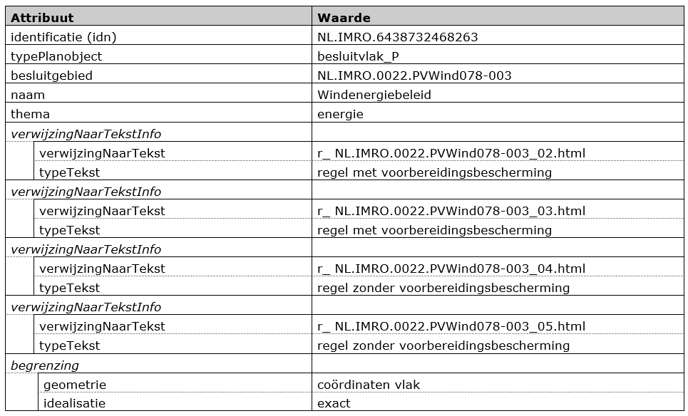

# Bijlage 2: Voorbeeldverordening gecodeerd  
De voorbeeldverordening kent, zoals alle verordeningen, een geometrisch
vastgelegd werkingsgebied. Dit gebied wordt gecodeerd als een Besluitgebied.  
In de voorbeeldverordening komen inhoudelijke bepalingen voor die betrekking
hebben op het hele werkingsgebied van de verordening. Het werkingsgebied wordt
daarom tevens gecodeerd als Besluitvlak.  
Daarnaast zijn er in de verordening uitsluitingsgebieden vastgelegd die
verwijzen naar het onderliggende Besluitvlak. Deze uitsluitingsgebieden worden
gecodeerd als Besluitsubvlak.

Deze objecten worden als volgt gecodeerd:

**Tabel 7 Besluitgebied**

**Tabel 8 Besluitvlak**

**Tabel 9 Besluitsubvlak**

