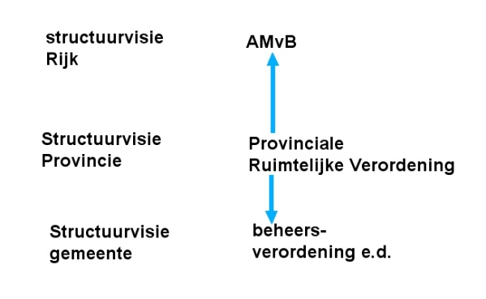

Het informatiemodel toegelicht
==============================

**In de een provinciale verordening zijn naast het werkingsgebied van de
verordening, alle eenheden die in de verordening geometrisch vastgelegd, met een
verwijzing naar de bijbehorende regeling. Objecten die niet geometrisch zijn
vastgelegd in de verordening, worden niet gecodeerd. In dit hoofdstuk zijn de
objecten toegelicht.**

De objectbenadering van een provinciale verordening
---------------------------------------------------

In de IMRO-systematiek wordt voor objecten met gelijke eigenschappen de term
“klasse” gebruikt. Voor een Provinciale Verordening worden de volgende klassen
onderscheiden:

-   Besluitgebied;

-   Besluitvlak;

-   Besluitsubvlak.

In Figuur 1 is dit schematisch weergegeven:

**Figuur 1 Objectstructuur**

Een Provinciale Verordening bestaat altijd uit:

-   één besluitgebied;

-   één of meer besluitvlakken die elkaar (deels) kunnen overlappen.

Daarnaast kan een Verordening één of meerdere besluitsubvlakken bevatten. Zo’n
besluitsubvlak heeft altijd een inhoudelijke relatie met één of meerdere
onderliggende besluitvlakken of met één of meerdere andere onderliggende
besluitsubvlakken.

**Besluitgebied**  
Het Besluitgebied is het werkingsgebied van de Provinciale Verordening. Veelal
zal dit de gehele provincie zijn, maar dat hoeft niet. Wanneer het besluitgebied
de vorm heeft van meerdere niet aan elkaar grenzende vlakken, dan wordt dit ook
beschouwd als één besluitgebied. Het object komt altijd één keer voor.

**Besluitvlak**  
Het object Besluitvlak is een gebied, geometrisch vastgelegd binnen een object
Besluitgebied, dat zelfstandige eigenschappen heeft (bijvoorbeeld een daaraan
gekoppeld voorschrift). In het geval de verordening uitsluitend inhoudelijke
bepalingen kent die betrekking hebben op het hele werkingsgebied van de
verordening wordt het werkingsgebied altijd tevens aangeduid als object
Besluitvlak. Er is dus altijd tenminste één besluitvlak die in dat geval
dezelfde geometrie kent als het object Besluitgebied. Meerdere objecten
Besluitvlak dekken tezamen het gehele object Besluitgebied af en kunnen elkaar
overlappen. Het object komt altijd tenminste één keer voor (1..n).

**Besluitsubvlak**  
Het object Besluitsubvlak is een gebied, geometrisch vastgelegd binnen een
object Besluitgebied, met een inhoudelijke relatie met een of meer bovenliggende
geometrisch vastgelegde objecten Besluitvlak of andere objecten Besluitsubvlak
en heeft geen directe inhoudelijke relatie met het hele werkingsgebied van de
verordening (het object Besluitgebied). Een object Besluitsubvlak kan een object
Besluitvlak of een ander object Besluitsubvlak willekeurig overlappen. Het
object komt zo vaak voor als gewenst (0..n).

Structuur
---------

Wanneer een Provinciale Verordening deel uitmaakt van een geïntegreerde
verordening dan dient deze als volgt te worden opgebouwd:

-   als Besluitgebied geldt het werkingsgebied van de geïntegreerde verordening;

-   het is verder verplicht om Besluit(Sub)vlakken te gebruiken voor het coderen
    van die delen uit het besluit die voortkomen uit de Wro.

-   het is niet toegestaan om Besluit(Sub)vlakken te gebruiken voor het coderen
    van die gebiedsgerichte delen uit het besluit die niet voortkomen uit de
    Wro.

Het planologisch besluit Provinciale Verordening vertoont gelijkenissen met de
Algemene maatregel van bestuur (AMvB) op Rijksniveau en met een aantal
gebiedsgerichte besluiten (o.a. de beheersverordening) op gemeentelijk niveau
(zie Figuur 2). Ook voor deze planologische besluiten zijn Praktijkrichtlijnen
opgesteld. Bij het opstellen van deze Praktijkrichtlijn Provinciale Verordening
is geprobeerd waar mogelijk aan te sluiten bij de Praktijkrichtlijnen voor
AMvB’s ([PRAMvB2012](https://docs.geostandaarden.nl/ro/amvb2012/)) en voor gebiedsgerichte besluiten ([PRGB2012](https://docs.geostandaarden.nl/ro/gb2012/)).

**Figuur 2 Verticale afstemming**

Vaak zal een Provinciale Verordening gebaseerd zijn op beleid dat is verwoord in
een Provinciale Structuurvisie. Ook voor dit planologisch besluit is een
praktijkrichtlijn opgesteld. Bij het opstellen van deze Praktijkrichtlijn
Provinciale Verordening is geprobeerd waar mogelijk aan te sluiten bij de
Praktijkrichtlijn Structuurvisies 2012 ([PRSV2012](https://docs.geostandaarden.nl/ro/sv2012/)).

**Figuur 3 Horizontale afstemming**

Digitale verbeelding van het besluit
------------------------------------

De provinciale verordening wordt opgebouwd uit planobjecten. Deze planobjecten
dienen zo gekozen te worden dat een ontvanger een heldere representatie van het
plan krijgt met een duidelijke structuur die het plan onderverdeelt in
consistente onderdelen.

Afbeeldingen van kaarten kunnen in het besluit worden opgenomen, maar kennen de
status van illustratie. De geometrie die in het besluit wordt opgenomen in de
vorm van GML-geometrie elementen is leidend of bindend voor de locatie van de
objecten.

De bronhouder dient een digitale verbeelding van het besluit ter beschikking te
stellen. Met behulp van een symboolcodelijst die bij de RO Standaarden 2012
beschikbaar is[^1], kan de bronhouder aangeven hoe de provinciale verordening
kan worden weergegeven in een interactieve raadpleegomgeving.

[^1]: Zie Geonovum website onder het kopje:
['Implementatiebestanden’](https://www.geonovum.nl/geo-standaarden/ro-standaarden-ruimtelijke-ordening/informatiemodel-ruimtelijke-ordening-imro2012)

De symboolcodelijst beschrijft de vormgeving van de symbolen, kleuren en
patronen. Bij het opstellen van een provinciale verordening kan de bronhouder
aan een object een symboolcode toekennen. Deze wordt met de rest van de
informatie in de dataset van de provinciale verordening opgeslagen. De ontvanger
van de dataset leest de gegevens, waaronder de symboolcodes, uit en kan daardoor
de verordening weergeven zoals de bronhouder dit bedoeld heeft. In Figuur 4 is
een detail van de symboolcodelijst voor vormvrije plannen opgenomen die
onderdeel is van de RO Standaarden 2012.

**Figuur 4 Detail van de symboolcodelijst voor vormvrije plannen**

In [Hoofdstuk 3](#H03) wordt per object uitgelegd hoe een symboolcode aan een object
wordt toegevoegd. 0 gaat dieper in op het gebruik van de symboolcodelijst voor
vormvrije plannen.

Geometrie en/of tekst als ingang voor beleid
--------------------------------------------

De voorliggende praktijkrichtlijn is gericht op de geometrie en opbouw van de
provinciale verordeningen. De geometrie (locatie) vormt hierbij de ingang voor
het raadplegen van het ruimtelijke plan.

Binnen de RO Standaarden 2012 is het gebruik van objectgerichte planteksten
(XML) facultatief. De bronhouder mag er ook voor kiezen de planteksten in de
vorm van HTML en/of PDF bestanden (ofwel niet-objectgericht) beschikbaar te
stellen. Bij het gebruik van objectgerichte planteksten wordt het in de toekomst
mogelijk om de tekst te laten fungeren als ingang voor het raadplegen van het
ruimtelijk plan binnen een interactieve raadpleegomgeving.

Voor toelichting op het gebruik van de standaard voor planteksten (IMROPT2012)
wordt verwezen naar de toelichting Praktijkrichtlijn voor Planteksten
([PRPT2012](https://docs.geostandaarden.nl/ro/pt2012/)).

Metadata
--------

In de voorgaande paragrafen is het IMRO met betrekking tot de provinciale
verordening toegelicht. Wanneer de verordening digitaal wordt vastgelegd bestaat
deze uit een set van verschillende bestanden: de dataset. STRI2012 geeft regels
met betrekking tot deze bestanden.

In het GML bestand is ook bepaalde informatie over de verordening opgenomen. Ook
in het geleideformulier en manifest is bepaalde informatie over de verordening
opgenomen. Gegevens over gegevens wordt metadata genoemd. In IMRO2012 zijn bij
de klasse *MetadataIMRObestand* regels opgenomen over de in het GML bestand
op te nemen metadata. In Tabel 1 wordt klasse *MetadataIMRObestand*
toegelicht.

**Tabel 1 KlasseMetadataIMRObestand 1\***

<table id="d4e41" style="width: 100%;"><caption>KlasseMetadataIMRObestand 1*</caption><colgroup><col id="col1" style="width: 28.57142857142857%;"></col><col id="col2" style="width: 38.775510204081634%;"></col><col id="col3" style="width: 4.081632653061225%;"></col><col id="col4" style="width: 28.57142857142857%;"></col></colgroup><thead valign="top"><tr><th align="left" style="border-top: 0.5pt solid #000000; border-left: 0.5pt solid #000000; border-bottom: 0.5pt solid #000000; border-right: 0.5pt solid #000000; background-color: none;">
Metadata attribuut
</th><th align="left" style="border-top: 0.5pt solid #000000; border-left: 0.5pt solid #000000; border-bottom: 0.5pt solid #000000; border-right: 0.5pt solid #000000; background-color: none;">
waarde
</th><th align="left" style="border-top: 0.5pt solid #000000; border-left: 0.5pt solid #000000; border-bottom: 0.5pt solid #000000; border-right: 0.5pt solid #000000; background-color: none;">
*
</th><th align="left" style="border-top: 0.5pt solid #000000; border-left: 0.5pt solid #000000; border-bottom: 0.5pt solid #000000; border-right: 0.5pt solid #000000; background-color: none;">
opmerking
</th></tr></thead><tbody valign="top"><tr><td align="left" style="border-top: 0.5pt solid #000000; border-left: 0.5pt solid #000000; border-bottom: 0.5pt solid #000000; border-right: 0.5pt solid #000000; background-color: none;">
datasetTitel
</td><td align="left" style="border-top: 0.5pt solid #000000; border-left: 0.5pt solid #000000; border-bottom: 0.5pt solid #000000; border-right: 0.5pt solid #000000; background-color: none;">
naam van de dataset of dataset serie
</td><td align="left" style="border-top: 0.5pt solid #000000; border-left: 0.5pt solid #000000; border-bottom: 0.5pt solid #000000; border-right: 0.5pt solid #000000; background-color: none;">
1
</td><td align="left" style="border-top: 0.5pt solid #000000; border-left: 0.5pt solid #000000; border-bottom: 0.5pt solid #000000; border-right: 0.5pt solid #000000; background-color: none;">
dit komt overeen met de naam van het plan/besluit
</td></tr><tr><td align="left" style="border-top: 0.5pt solid #000000; border-left: 0.5pt solid #000000; border-bottom: 0.5pt solid #000000; border-right: 0.5pt solid #000000; background-color: none;">
creatiedatum
</td><td align="left" style="border-top: 0.5pt solid #000000; border-left: 0.5pt solid #000000; border-bottom: 0.5pt solid #000000; border-right: 0.5pt solid #000000; background-color: none;">
datum waarop het bestand gemaakt is
</td><td align="left" style="border-top: 0.5pt solid #000000; border-left: 0.5pt solid #000000; border-bottom: 0.5pt solid #000000; border-right: 0.5pt solid #000000; background-color: none;">
1
</td><td align="left" style="border-top: 0.5pt solid #000000; border-left: 0.5pt solid #000000; border-bottom: 0.5pt solid #000000; border-right: 0.5pt solid #000000; background-color: none;">
in de vorm: jjjj-mm-dd
</td></tr><tr><td align="left" style="border-top: 0.5pt solid #000000; border-left: 0.5pt solid #000000; border-bottom: 0.5pt solid #000000; border-right: 0.5pt solid #000000; background-color: none;">
bronbeheerder
</td><td align="left" style="border-top: 0.5pt solid #000000; border-left: 0.5pt solid #000000; border-bottom: 0.5pt solid #000000; border-right: 0.5pt solid #000000; background-color: none;">
partij die verantwoordelijkheid heeft geaccepteerd en zorg draagt voor het beheer van de data
</td><td align="left" style="border-top: 0.5pt solid #000000; border-left: 0.5pt solid #000000; border-bottom: 0.5pt solid #000000; border-right: 0.5pt solid #000000; background-color: none;">
1
</td><td align="left" style="border-top: 0.5pt solid #000000; border-left: 0.5pt solid #000000; border-bottom: 0.5pt solid #000000; border-right: 0.5pt solid #000000; background-color: none;">
naam van provincie
</td></tr><tr><td align="left" style="border-top: 0.5pt solid #000000; border-left: 0.5pt solid #000000; border-bottom: 0.5pt solid #000000; border-right: 0.5pt solid #000000; background-color: none;">
codeerVerantwoordelijke
</td><td align="left" style="border-top: 0.5pt solid #000000; border-left: 0.5pt solid #000000; border-bottom: 0.5pt solid #000000; border-right: 0.5pt solid #000000; background-color: none;">
diegene die verantwoordelijk is voor de IMRO-codering
</td><td align="left" style="border-top: 0.5pt solid #000000; border-left: 0.5pt solid #000000; border-bottom: 0.5pt solid #000000; border-right: 0.5pt solid #000000; background-color: none;">
1
</td><td align="left" style="border-top: 0.5pt solid #000000; border-left: 0.5pt solid #000000; border-bottom: 0.5pt solid #000000; border-right: 0.5pt solid #000000; background-color: none;">
naam van organisatie, afdeling, bedrijf
</td></tr><tr><td align="left" style="border-top: 0.5pt solid #000000; border-left: 0.5pt solid #000000; border-bottom: 0.5pt solid #000000; border-right: 0.5pt solid #000000; background-color: none;">
naamApplicatieschema
</td><td align="left" style="border-top: 0.5pt solid #000000; border-left: 0.5pt solid #000000; border-bottom: 0.5pt solid #000000; border-right: 0.5pt solid #000000; background-color: none;">
gebruikt applicatieschema / informatiemodel
</td><td align="left" style="border-top: 0.5pt solid #000000; border-left: 0.5pt solid #000000; border-bottom: 0.5pt solid #000000; border-right: 0.5pt solid #000000; background-color: none;">
1
</td><td align="left" style="border-top: 0.5pt solid #000000; border-left: 0.5pt solid #000000; border-bottom: 0.5pt solid #000000; border-right: 0.5pt solid #000000; background-color: none;">
in dit geval IMRO2012
</td></tr><tr><td align="left" style="border-top: 0.5pt solid #000000; border-left: 0.5pt solid #000000; border-bottom: 0.5pt solid #000000; border-right: 0.5pt solid #000000; background-color: none;">
codeReferentiesysteem
</td><td align="left" style="border-top: 0.5pt solid #000000; border-left: 0.5pt solid #000000; border-bottom: 0.5pt solid #000000; border-right: 0.5pt solid #000000; background-color: none;">
alfanumerieke waarde die het gebruikte referentiesysteem van de dataset aangeeft
</td><td align="left" style="border-top: 0.5pt solid #000000; border-left: 0.5pt solid #000000; border-bottom: 0.5pt solid #000000; border-right: 0.5pt solid #000000; background-color: none;">
1
</td><td align="left" style="border-top: 0.5pt solid #000000; border-left: 0.5pt solid #000000; border-bottom: 0.5pt solid #000000; border-right: 0.5pt solid #000000; background-color: none;">
hier wordt een code ingevuld afkomstig van de EPSG (European Petrol Survey Group): RD is het verplichte referentiesysteem met de code: 28992
</td></tr><tr><td align="left" style="border-top: 0.5pt solid #000000; border-left: 0.5pt solid #000000; border-bottom: 0.5pt solid #000000; border-right: 0.5pt solid #000000; background-color: none;">
toepassingsschaal
</td><td align="left" style="border-top: 0.5pt solid #000000; border-left: 0.5pt solid #000000; border-bottom: 0.5pt solid #000000; border-right: 0.5pt solid #000000; background-color: none;">
de beoogde maximale schaal waarop het bestand waarheidsgetrouw gebruikt mag worden; dit moet een positief numeriek getal zijn
</td><td align="left" style="border-top: 0.5pt solid #000000; border-left: 0.5pt solid #000000; border-bottom: 0.5pt solid #000000; border-right: 0.5pt solid #000000; background-color: none;">
1
</td><td align="left" style="border-top: 0.5pt solid #000000; border-left: 0.5pt solid #000000; border-bottom: 0.5pt solid #000000; border-right: 0.5pt solid #000000; background-color: none;">
bijvoorbeeld: 500 voor een bestand dat maximaal op schaal 1 : 500 gebruikt mag worden
</td></tr><tr><td align="left" style="border-top: 0.5pt solid #000000; border-left: 0.5pt solid #000000; border-bottom: 0.5pt solid #000000; border-right: 0.5pt solid #000000; background-color: none;">
applicatieIdentificatie
</td><td align="left" style="border-top: 0.5pt solid #000000; border-left: 0.5pt solid #000000; border-bottom: 0.5pt solid #000000; border-right: 0.5pt solid #000000; background-color: none;">
aanduiding van applicatie en versienummer
</td><td align="left" style="border-top: 0.5pt solid #000000; border-left: 0.5pt solid #000000; border-bottom: 0.5pt solid #000000; border-right: 0.5pt solid #000000; background-color: none;">
1
</td><td align="left" style="border-top: 0.5pt solid #000000; border-left: 0.5pt solid #000000; border-bottom: 0.5pt solid #000000; border-right: 0.5pt solid #000000; background-color: none;">
waarmee het bestand gecodeerd is
</td></tr><tr><td align="left" style="border-top: 0.5pt solid #000000; border-left: 0.5pt solid #000000; border-bottom: 0.5pt solid #000000; border-right: 0.5pt solid #000000; background-color: none;">
versieXMLschema
</td><td align="left" style="border-top: 0.5pt solid #000000; border-left: 0.5pt solid #000000; border-bottom: 0.5pt solid #000000; border-right: 0.5pt solid #000000; background-color: none;">
versie van het XML schema definitiebestand (XSD)
</td><td align="left" style="border-top: 0.5pt solid #000000; border-left: 0.5pt solid #000000; border-bottom: 0.5pt solid #000000; border-right: 0.5pt solid #000000; background-color: none;">
1
</td><td align="left" style="border-top: 0.5pt solid #000000; border-left: 0.5pt solid #000000; border-bottom: 0.5pt solid #000000; border-right: 0.5pt solid #000000; background-color: none;">
in het XSD vastgelegd als &lt;version="versiecode"&gt;
</td></tr><tr><td align="left" style="border-top: 0.5pt solid #000000; border-left: 0.5pt solid #000000; border-bottom: 0.5pt solid #000000; border-right: 0.5pt solid #000000; background-color: none;" colspan="4">
*  multipliciteit:

0:   komt niet voor     0..1:   komt 0 of 1 keer voor            0..n:   komt zo vaak voor als gewenst

1:   komt 1 keer voor        1..n:   komt tenminste 1 keer voor    
</td></tr></tbody></table>

**toepassingsschaal**

Verordeningen worden vastgelegd in besluitvlakken en besluitsubvlakken die
geometrisch zijn bepaald op basis van het Rijksdriehoekstelsel (RD-coördinaten).
Daarvoor is de schaal in principe niet van belang. Bij de digitale en analoge
verbeelding is de schaal waarop (gedeelten van) de verordening zinvol kunnen
worden weergegeven wel van belang. Daarom wordt in de metadata van de dataset de
maximale schaal meegegeven waarop het plan zinvol verbeeld mag worden.
