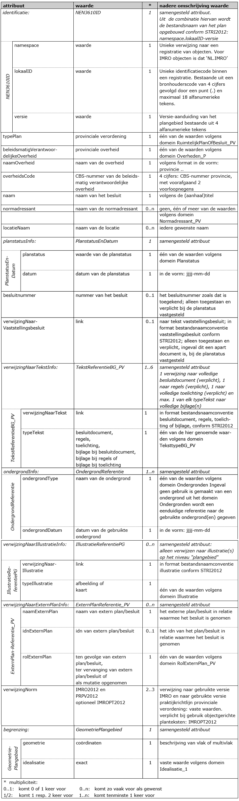
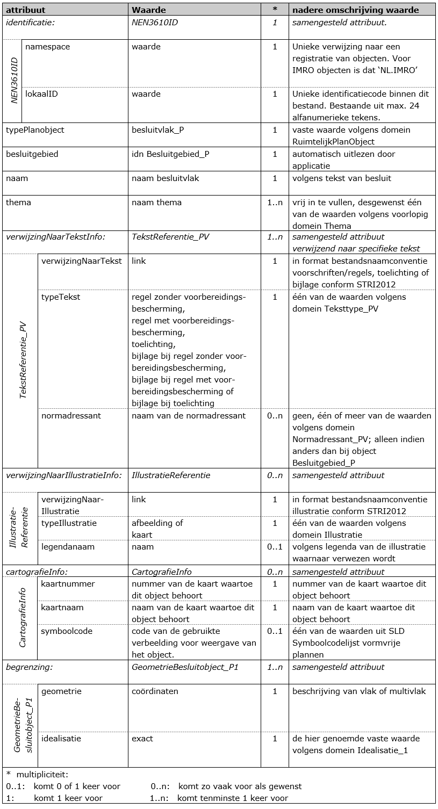

# De planobjecten met attributen

**In dit hoofdstuk worden de klassen (objecttypen) met bijbehorende attributen
beschreven. Elk object binnen een klasse kent eigenschappen die als attribuut
daaraan worden toegekend. In IMRO2012 wordt in een zogenoemd UML-schema
weergegeven hoe de objecten (klassen) samenhangen en welke attributen mogelijk
zijn. Dit UML-schema is opgenomen in de bijlage.**

## Klasse Besluitgebied_P

Een verordening stelt regels die gemeenten moeten verwerken in
bestemmingsplannen, projectbesluiten en beheersverordeningen. In principe moet
dat binnen 1 jaar, tenzij in de verordening een andere termijn is gegeven.

Het gaat om regels voor de inhoud van bestemmingsplannen, maar ook van
omgevingsvergunningen waarbij met toepassing van artikel 2.12, eerste lid, onderdeel a, onder 30, van de <a href='http://wetten.overheid.nl/BWBR0024779' target='_blank'>Wet algemene bepalingen omgevingsrecht</a>
 (Wabo) van het
bestemmingsplan of de beheersverordening wordt afgeweken en
beheersverordeningen. Om te voorkomen dat gronden minder geschikt worden voor de
beoogde bestemmingen, kan de provincie in de verordening ook regelen dat, zolang
een gemeente een en ander nog niet heeft vertaald in een bestemmingsplan, een
omgevingsvergunning voor bijvoorbeeld bouwen rechtstreeks aan de verordening
moeten worden getoetst. Dit moet dan expliciet in de verordening worden
aangegeven. In de voorbeeldverordening in Bijlage 1 van deze praktijkrichtlijn
is dit opgenomen in artikel 2, lid 3 en artikel 3, lid 2. In Bijlage 2 is nader
uitgelegd op welke wijze dit gecodeerd dient te worden.
Deze beschermende regels hebben dan dus een algemene bindende werking, óók naar
burgers.

Omdat een verordening binnen een bepaalde termijn in een bestemmingsplanregeling
moet worden vertaald, moet hetgeen in de verordening wordt opgenomen een zekere
mate van concreetheid hebben.

**Figuur 5 Doorwerking**

In essentie bestaat de verordening uit een set regels (de eigenlijke
verordening) met eventueel daarbij behorende illustraties. De verordening gaat
vergezeld van een toelichting.

Binnen een verordening kunnen ook mogelijkheden worden opgenomen om af te wijken
van de algemene regels. Hiertoe kunnen ontheffingen in de verordening worden
opgenomen.

In een verordening kan worden bepaald dat een regel slechts geldt voor een
daarbij aangegeven gedeelte van het grondgebied van de provincie. Bepaalde
regels in de verordening kunnen dus gelden voor de hele provincie, andere voor
slechts een deelgebied binnen de provincie.

Bij de verordening kunnen in beginsel ook regels gesteld worden aan de
toelichting op een bestemmingsplan. Die mogelijkheid wordt gecreëerd door middel
van een expliciete bepaling in het Bro ter zake.

In Tabel 2 zijn de attributen behorend bij de klasse *Besluitgebied_P* benoemd,
de waarden aangegeven die deze attributen moeten bevatten en is aangegeven of
het gebruik van het attribuut verplicht is en of het attribuut meerdere malen
mag worden gebruikt. Ook is aangegeven of attributen in samenhang moeten worden
gebruikt. Na de tabel is per attribuut een nadere toelichting gegeven.

**Tabel 2 Klasse Besluitgebied_P 1\***

***identificatie*** (verplicht):  
Ieder ruimtelijk instrument kent een eigen identificatienummer (idn). Deze
identificatie maakt het mogelijk dat op landelijk niveau een uniek onderscheid
voor ieder instrument aanwezig is. Voor het geval het werkingsgebied bestaat uit
meerdere ruimtelijk gescheiden gebieden kent het totaal van die gebieden één
identificatienummer. De geometrie van het object *Besluitgebied_P* is hierbij
een multipolygoon.
Het samengestelde attribuut verwijst naar het object NEN3610ID bestaande uit de
attributen *namespace, lokaalID* en *versie*.

- **namespace:** (verplicht)  
Een unieke verwijzing naar een registratie van objecten. Voor IMRO objecten
is dat ‘NL.IMRO’.

- **lokaalID:** (verplicht)  
Unieke identificatiecode binnen de registratie van ruimtelijke plannen.
Bestaande uit een bronhouderscode van 4 cijfers (voor het Rijk 0000, voor
gemeente het CBS-nummer) gevolgd door een punt (.) en maximaal door de
bronhouder te bepalen 18 alfanumerieke tekens. Er geldt de volgende
reguliere expressie: [0-9]{4}\\.[A-Za-z0-9]{1,18}

- **Versie:** (verplicht)  
Versie-aanduiding van het plangebied bestaande uit 4 alfanumerieke tekens
door de bronhouder te bepalen. Er geldt de volgende reguliere expressie:
[A-Za-z0-9]{4}
Uit de waarden van de attributen *namespace, lokaalID* en *versie* wordt de
bestandsnaam van het plan opgebouwd conform STRI2012:
namespace.lokaalID-versie. De samengestelde reguliere expressie is:
NL\\.IMRO\\.[0-9]{4}\\.[A-Za-z0-9]{1,18}-[A-Za-z0-9]{4}

**typePlan** (verplicht):  
Voor het attribuut *typePlan* wordt het domein *RuimtelijkPlanOfBesluit_PV*
gebruikt. Hier wordt de vaste waarde *provinciale verordening* ingevuld.

**beleidsmatigVerantwoordelijkeOverheid** (verplicht):  
Hier wordt de overheid die beleidsmatig verantwoordelijk is voor het opstellen
van het plan opgenomen uit het domein Overheden_P. In dit geval de vaste
waarden: provinciale overheid.

**naamOverheid** (verplicht):  
Hier wordt de naam van de beleidsmatig verantwoordelijke overheid opgenomen, in
de vorm van de tekst “provincie …….”.

**overheidscode** (verplicht):  
Teneinde kenbaar te maken van welke beleidsmatig verantwoordelijke overheid de
provinciale verordening is, wordt hier het CBS-nummer van die overheid
opgenomen. Hier worden, voorafgaand aan het CBS-nummer van de provincie, twee
voorloopnegens geplaatst, zodat de totale lengte 4 posities bedraagt.

**naam** (verplicht):  
In het waardeveld van het attribuut naam dient de naam van de provinciale
verordening te worden op­genomen. Het gaat daarbij om de volledige naam. Indien
er sprake is van een aanhaaltitel in het plan dan wordt deze gebruikt.

**normadressant** (zo vaak als gewenst):  
Dit attribuut geeft aan op welke organen of rechtspersonen de regeling zich
richt. Het domein *Normadressant_PV* geeft de toegestane waarden aan waaruit
eventueel meerdere kunnen worden gekozen.

**locatieNaam** (zo vaak als gewenst):  
Indien gewenst kan de naam van de locatie waarop de verordening betrekking heeft
hier worden opgenomen.

***planstatusInfo*** (verplicht):  
Dit attribuut is noodzakelijk om de plangegevens te kunnen plaatsen naar tijd en
belang. Het samengesteld attribuut planstatusInfo verwijst naar het object
*PlanstatusEnDatum*, bestaande uit de attributen *planstatus* en *datum*.
- **planstatus** (verplicht)  
Het domein *Planstatus* geeft de toegestane waarden voor het attribuut
planstatus waaruit er één moet worden gekozen. De waarde van dit attribuut
geeft de planstatus weer.
- **datum** (verplicht)  
Het attribuut datum is bedoeld om de proceduredatum van het plan op te
nemen. De in het waardeveld op te nemen datum dient overeenkomstig het
binnen het IMRO afgesproken datumformaat te worden genoteerd: jjjj-mm-dd.

**besluitnummer** (onder voorwaarde verplicht):  
Nummer van het vaststellingsbesluit van de verordening. Het besluitnummer is
alleen toegestaan en dan verplicht indien de planstatus vastgesteld is. Bij
een andere planstatus is dit attribuut niet toegestaan.

**verwijzingNaarVaststellingsbesluit** (onder voorwaarde verplicht):  
Hierin wordt een link opgenomen naar de tekst van het vaststellingsbesluit. In
het format conform de bestandsnaamconventie *vaststellingsbesluit* volgens de
STRI2012. De link is alleen verplicht indien de planstatus vastgesteld is. Bij
een andere planstatus is dit attribuut niet toegestaan. Aan het bestand kunnen
ook eventueel bij het vaststellingsbesluit behorende bijlagen worden toegevoegd.

***verwijzingNaarTekstInfo*** (onder voorwaarde verplicht):  
Dit attribuut verwijst naar het samengestelde attribuut *TekstReferentieBG_PV*,
bestaande uit de attributen *verwijzingNaarTekst* en *typeTekst*.  
Attribuut wordt met de volgende cardinaliteit opgenomen:
- 1 verwijzing naar het volledige besluitdocument (de volledige provinciale
verordening), en/of  
 1 verwijzing naar volledige toelichting.  
- 1 verwijzing naar eventuele volledige regels.  
- 0..1 verwijzing naar elk typeTekst volledige bijlagen.

Het aantal verwijzingen naar teksten is beperkt. De raadpleger van de plannen
heeft daar baat bij, omdat hij dan niet direct geconfronteerd wordt met een
mogelijk lange lijst van verwijzingen. Daarom moet er maximaal één verwijzing
zijn naar het volledige besluitdocument, maximaal één verwijzing naar de
volledige toelichting en maximaal één naar de volledige regels. Daarnaast mag er
maximaal één verwijzing zijn naar alle eventuele bijlagen, gegroe­peerd naar
bijlage bij besluitdocument, toelichting en/of regels. Er mag worden verwezen
naar een inhoudsop­gave of index, waardoor indirect meer mogelijkheden aanwezig
zijn.  
De bronhouder kiest voor het al dan niet gebruik van objectgerichte planteksten.
In beide gevallen wordt dit attribuut *verwijzingNaarTekstInfo* gebruikt. De
keuze voor XML of HTML/PDF planteksten geldt niet alleen voor het plangebied, de
keuze geldt ook voor de andere objecten (besluitvlakken/ besluitsubvlakken)
binnen de provinciale verordening. Daarnaast wordt de keuze vastgelegd met
behulp van het attribuut *verwijzingNorm* bij BesluitGebied_P van deze
verordening. Het format dient overeen­komstig de afspraak over de
bestandsnaamconventies conform de STRI2012 te zijn.
- **verwijzingNaarTekst** (verplicht)  
Dit attribuut is bedoeld om (hyper)links te kunnen opnemen. Hier dient een
(hyper)link naar het soort document dat is aangegeven bij het attribuut *typeTekst* te worden opgenomen. Het format dient overeenkomstig de afspraak
over de bestandsnaamconventies voor het bestandstype *besluitdocument*, *toelichting*, *regels* of *bijlagen* conform de STRI2012 te zijn.
- **typeTekst** (verplicht)  
Hiermee wordt aangegeven om wat voor type tekst het gaat. Per verwijzing
naar tekst dient gekozen te worden uit een van de volgende waarden van het
domein *TeksttypeBG_PV*:  
	-   besluitdocument;
	-   regels;
	-   toelichting;
	-   bijlage bij besluitdocument;
	-   bijlage bij regels;
	-   bijlage bij toelichting.

***ondergrondInfo*** (verplicht, zo vaak als gewenst):  
Dit attribuut verwijst naar het samengestelde attribuut *Ondergrondreferentie*,
bestaande uit de attributen *ondergrondType* en *ondergrondDatum.* Met dit
attribuut wordt, conform artikel 1.2.4 Bro, aangegeven welke ondergrond bij het
vaststellen van de provinciale verordening is gebruikt.
Er zijn meerdere waarden mogelijk.

- **ondergrondType** (verplicht)  
Het type van de gebruikte ondergrond volgens het domein Ondergronden. Op
grond van de Wet basisregistratie grootschalige topografie (BGT) is het per
1 juli 2017 voor bestuursorganen verplicht om gebruik te maken van de **Basisregistratie Grootschalige Topografie (BGT).** Een bestuursorgaan kan
daar indien nodig gemotiveerd van afwijken. Bij afwijking kan het bestuursorgaan gebruik maken van:  
	-   basisregistratie topografie (BRT)  
	-   basisregistratie kadaster (BRK)  

Indien geen gebruik is gemaakt van een ondergrond uit het domein
Ondergronden wordt de naam van het bestand van de gebruikte ondergrond(en)
als vrije tekst opgegeven. In de PRTRI2012, hoofdstuk 7, is toegelicht welke
bestandformaten voor de ondergrond kunnen worden gebruikt.

- **ondergrondDatum** (verplicht)  
De datum van de gebruikte ondergrond.

***verwijzingNaarIllustratieInfo*** (zo vaak als gewenst):  
Dit attribuut is bedoeld om de verbeelding van de verordening (het kaartbeeld of
de kaartbeelden ingeval dit er meer zijn, op te nemen. Het betreft
kaarten/afbeeldingen op het niveau van het "plangebied" en niet op het niveau
van onderliggende objecten; illustraties die bij onderliggende objecten behoren
worden bij die objecten opgenomen. Het attribuut verwijst naar het samengestelde
attribuut *IllustratieReferentiePG*, bestaande uit de attributen *verwijzingNaarIllustratie* en *typeIllustratie*.  
- **verwijzingNaarIllustratie** (verplicht) 
Dit attribuut is exclusief bedoeld om hyperlinks te kunnen opnemen. Hier
dient een hyperlink naar de illustratie waarbij het object behoort te worden
opgenomen. Het format dient overeenkomstig de afspraak over de
bestandsnaamconventie voor het bestandstype *illustraties* conform de
STRI2012 te zijn.  
- **typeIllustratie** (verplicht)  
Hierin wordt het type van de illustratie vastgelegd: om wat voor soort
illustratie het gaat. Er dient gekozen te worden uit één van de waarden
(afbeelding of kaart) volgens het domein *Illustratie*.

***verwijzingNaarExternPlanInfo*** (zo vaak als gewenst):  
Een verordening zal meestal gebaseerd zijn op een Provinciale Structuurvisie,
maar kan ook gebaseerd zijn op een ander beleidsdocument. Ook kan er sprake zijn
van het doorwerken van een AMvB naar een provinciale verordening. In Hoofdstuk 4
is dit met betrekking tot herzieningen toegelicht. Daarnaast kan een extern plan
ook relevante informatie bevatten. Het attribuut verwijst naar het samengestelde
attribuut *ExternPlanReferentie_PV*, bestaande uit de volgende attributen *naamExternPlan*, *idnExternPlan* en *rolExternPlan*.  
- **naamExternPlan** (verplicht)  
Hier wordt de naam van het externe plan of in voorkomend geval besluit
waarnaar verwezen wordt opgegeven. Dit kan een specifieke naam zijn indien
deze bekend is, maar ook een algemene benaming.  
- **idnExternPlan** (indien gewenst)  
In het geval een identificatie (idn) van het externe plan waarnaar verwezen
wordt, bekend is, kan deze idn hier worden opgenomen.  
- **rolExternPlan** (verplicht)  
Hierin wordt de betekenis van het externe plan/besluit ten opzichte van de
provinciale verordening vastgelegd. Het betreft hier een van de volgende
vaste waarden uit het domein *RolExternPlan_PV*:  
	-   *ten gevolge van extern plan/besluit* in geval de verordening een gevolg is van een ander plan of besluit;  
	-   *ter vervanging van extern plan* ingeval daarvan sprake is, een en ander als uiteengezet in hoofdstuk 4.1 van deze praktijkrichtlijn;  
	-   *als mutatie opgenomen* voor het geval er sprake is van een mutatieplan, een en ander als uiteengezet in hoofdstuk 4.1 van deze praktijkrichtlijn.

**verwijzingNorm** (verplicht):  
Teneinde de zekerheid te hebben welke technische status de data hebben, is het
noodzakelijk dat wordt aangegeven aan welke IMRO versie de gegevensset voldoet.
Tevens moet een verwijzing worden opgenomen naar de gebruikte versie van de
praktijkrichtlijn. In het geval objectgerichte planteksten (XML) onderdeel zijn
van de provinciale verordening, dan wordt ook de verwijzing naar de standaard
voor planteksten opgenomen.  
Het attribuut *verwijzingNorm* dient minimaal twee keer te worden opgenomen
met de verwijzing naar de betreffende versies in het waardeveld: IMRO2012 en
PRPV2012. Bij het gebruik van objectgerichte planteksten in dit ruimtelijk plan
moet ook worden opgenomen: IMROPT2012.

***begrenzing*** (verplicht):  
Dit attribuut verwijst naar het samengestelde attribuut *GeometriePlangebied*, bestaande uit de attributen *geometrie* en *idealisatie*.  
- **geometrie** (verplicht)  
Het object *Besluitgebied_P* kent uitsluitend de geometrie van een vlak of
multivlak (multipolygoon). Dit attribuut legt de coördinaten in een
vastgesteld format (gml) vast. De coördinaten worden door de applicatie
automatisch gegenereerd.  
- **idealisatie** (verplicht)  
Met het attribuut *idealisatie* kan de nauwkeurigheid van de begrenzing van
een object worden aangegeven. Dit attribuut heeft de vaste waarde exact
volgens het domein *Idealisatie_1*. De vaste waarde exact geeft aan dat de
geometrie van het object opgenomen is met de nauwkeurigheid die behoort bij
de dataset.

## Klasse Besluitvlak_P

In Tabel 3 zijn de attributen behorend bij de klasse *Besluitvlak_P* benoemd, de
waarden aangegeven die deze attributen moeten bevatten en is aangegeven of het
gebruik van het attribuut verplicht is en of het attribuut meerdere malen mag
worden gebruikt. Ook is aangegeven of attributen in samenhang moeten worden
gebruikt. Na de tabel is per attribuut een nadere toelichting gegeven.

**Tabel 3 Klasse besluitvlak_P 1..n\***

***identificatie (idn)*** (verplicht):  
Elk object *Besluitvlak_P* krijgt een eigen unieke identificatie binnen de
provinciale verordening. Het samengestelde attribuut *identificatie* verwijst
naar het object NEN3610ID bestaande uit de attributen *namespace* en *lokaalID*.  
- **namespace:** (verplicht)  
Een unieke verwijzing naar een registratie van objecten. Voor IMRO objecten
is dat ‘NL.IMRO’.  
- **lokaalID:** (verplicht)  
Door de bronhouder te bepalen unieke identificatiecode binnen de context van
het bestand bestaande uit maximaal 32 alfanumerieke tekens. Toegestane
tekens: {”A”…”Z”, “a”…”z”, ”0”…”9”, “_”, “- “, “,”, ”.”}.

**typePlanobject** (verplicht):  
Het attribuut *typePlanobject* maakt het via het bijbehorende domein
*RuimtelijkPlanobject* mogelijk aan te geven welk object het betreft. Hier wordt
de vaste waarde *besluitvlak_P* ingevuld.

**besluitgebied** (verplicht):  
Voor elk object is een verwijzing noodzakelijk naar het object *Besluitgebied_P*
waar het object deel van uitmaakt. Dit attribuut verwijst daartoe naar het
attribuut *identificatie* van het bijbehorende object *Besluitgebied_P*. Dit zal
automatisch binnen een applicatie gestalte kunnen krijgen.

**naam** (verplicht):  
Aan het attribuut *naam* wordt als waarde een representerende naam van het
object meegegeven, mogelijk zoals deze in de tekst die ernaar verwijst is
opgenomen. Niet altijd zal dit het geval zijn. In dat geval zal een zinvolle
onderscheidende naam moeten worden ingevuld, zodat het object voor gebruikers
herkenbaar is en de gebruiker hierop desgewenst kan classificeren.

**thema** (verplicht, zo vaak als gewenst):  
Met dit attribuut wordt het thema van het object opgenomen. Het thema wordt
gekozen uit de waarden volgens het voorlopige domein *Thema*. Indien geen
bruikbare waarde wordt gevonden kan een vrije tekst worden opgenomen. Dit
attribuut kan meerdere keren worden opgenomen.

***verwijzingNaarTekstInfo*** (onder voorwaarde verplicht):  
Het attribuut is bedoeld voor het verwijzen naar het specifieke artikel dat
behoort bij het betreffende object *Besluitvlak_P*. Het attribuut verwijst naar
het samengestelde attribuut *TekstReferentie_PV*, bestaande uit de attributen *verwijzingNaarTekst, typeTekst* en *normadressant*.  
De bronhouder kiest voor dezelfde vorm van planteksten als bij het object *Besluitgebied_P*: objectgericht in XML of niet-objectgericht in HTML formaat.
Het format dient overeen­komstig de afspraak over de bestandsnaamconventies
conform de STRI2012 te zijn. De keuze van de bronhouder wordt vastgelegd in de *verwijzingNorm* bij deze provinciale verordening.  
- **verwijzingNaarTekst** (verplicht)  
Dit attribuut is bedoeld om (hyper)links te kunnen opnemen. Hier dient een
(hy­per)­link naar het soort document dat is aangegeven bij het attribuut *typeTekst* te worden opgenomen.  
Voor de waarde van het attribuut *verwijzingNaarTekst* geldt dat geen
elementen van een directorystructuur/pad mogen worden opgenomen. Wel moet
een nadere precisering naar de plaats binnen een document te worden
opgenomen met behulp van een fragmentidentifier. Het fragment in de
hyperlink is de locatie in de plantekst (XML of HTML) waar het van
toepassing zijnde attribuut *typeTekst* betrekking op heeft. Een hyperlink
krijgt dan de vorm: *bestandsnaam.xml­\#fragment* of *bestandsnaam.htm­\#fragment*.  
- **typeTekst** (verplicht)  
Hiermee wordt aangegeven om wat voor type tekst het gaat. Per verwijzing
naar tekst dient gekozen te worden uit een van de volgende waarden van het
domein *Teksttype_PV*:  
	-   regel zonder voorbereidingsbescherming;  
	-   regel met voorbereidingsbescherming;  
	-   toelichting;  
	-   bijlage bij regel zonder voorbereidingsbescherming;  
	-   bijlage bij regel met voorbereidingsbescherming;  
	-   bijlage bij toelichting.

**normadressant** (zo vaak als gewenst)  
Dit attribuut geeft aan op welke organen of rechtspersonen de regeling zich
richt. Het domein *Normadressant_PV* geeft de toegestane waarden aan waaruit één
of meerdere kunnen worden gekozen. Indien deze waarde hier wordt opgegeven
treedt deze waarde in de plaats van de waarde die bij het object *Besluitgebied_P* is opgegeven.

***verwijzingNaarIllustratieInfo*** (zo vaak als gewenst):  
Dit attribuut is bedoeld om een specifieke afbeelding of illustratie behorende
bij het object op te nemen. Het attribuut verwijst naar het samengestelde
attribuut *IllustratieReferentie*, bestaande uit de attributen *verwijzingNaarIllustratie, typeIllustratie* en *legendanaam*.  
- **verwijzingNaarIllustratie** (verplicht)  
Dit attribuut is exclusief bedoeld om links te kunnen opnemen. Hier dient
een link naar de illustratie waarbij het object behoort te worden opgenomen.
Het format dient overeenkomstig de afspraak over de bestandsnaamconventie
voor het bestandstype *illustratie* conform de STRI2012 te zijn.  
- **typeIllustratie** (verplicht)  
Hierin wordt het type van de illustratie vastgelegd: om wat voor soort
illustratie het gaat. Er dient gekozen te worden uit één van de waarden *afbeelding* of *kaart* volgens het domein *Illustratie*.  
- **legendanaam** (indien gewenst)  
De op te nemen / opgenomen naam voor de legenda van het kaartbeeld waarnaar
verwezen wordt.

***cartografieInfo*** (zo vaak als gewenst):  
Het attribuut *cartografieInfo* wordt gebruikt om verschillende kaarten in de
structuurvisie zichtbaar en presenteerbaar te maken. De structuur van de
kaartopbouw staat echter los van de planstructuur. Geen of foutief gebruik van
het attribuut *cartografieInfo* resulteert in een grijze of andere
objectweergave in een interactieve raadpleegomgeving. Een object kan in meerdere
kaarten voorkomen. Er moeten meerdere attributen *cartografieInfo* met waarden
toegevoegd worden om dit te realiseren.  
Het attribuut verwijst naar het samengestelde attribuut *cartografieInfo*
bestaande uit de attributen *kaartnummer, kaartnaam en symboolcode.*  
- **kaartnummer** (verplicht) 
Het nummer van de kaart van de provinciale verordening waartoe dit object
behoort. Het kaartnummer is door de bronhouder te bepalen. Kaarten kunnen in
een interactieve raadpleegomgeving worden geprioriteerd op basis van
kaartnummer. De kaart met nummer 1 wordt als hoofdkaart gezien en moet
altijd voorkomen, kaartnummer 0 niet mag voorkomen. Voorloopnullen worden
genegeerd (001 wordt bijvoorbeeld 1). Het kaartnummer is een uniek nummer
gekoppeld aan een kaartnaam.  
- **kaartnaam** (verplicht)  
De naam van de kaart van de provinciale verordening waartoe dit object
behoort. De kaartnaam is door de bronhouder te bepalen.  
- **symboolcode** (zo vaak als gewenst)  
De symboolcode uit de symboolcodelijst voor vormvrije plannen (onderdeel van
de RO Standaarden 2012). De symboolcode geeft de kleur en patroon aan voor
de wijze waarop het object *Besluitgebied_P* in de interactieve
raadpleegomgeving wordt weergegeven.  
Een symboolcode die aan een object wordt toegevoegd geldt deze alleen voor
dit object zelf en niet voor de onderliggende objecten. Er vindt dus geen
overerving van symboolcode plaats.

***begrenzing*** (verplicht, zo vaak als gewenst):  
Het attribuut verwijst naar het samengestelde attribuut *GeometrieBesluitObject_P1*, bestaande uit de attributen:  
- **geometrie** (verplicht)  
Het object *Besluitvlak_P* kent uitsluitend de geometrie van een vlak of
multivlak (multipolygoon). Dit attribuut legt de coördinaten in een
vastgesteld format (gml) vast. De coördinaten kunnen door een applicatie
automatisch worden gegenereerd.  
- **idealisatie** (verplicht)  
De waarde van dit attribuut is voor het object *Besluitvlak_P* altijd exact.
Hiermee wordt bedoeld dat de geometrie van het object opgenomen is met de
nauwkeurigheid die behoort bij de dataset, waarmee de begrenzing als exact
wordt beschouwd.

## Klasse Besluitsubvlak_P

In Tabel 4 zijn de attributen behorend bij de klasse *Besluitsubvlak_P* benoemd,
de waarden aangegeven die deze attributen moeten bevatten en is aangegeven of
het gebruik van het attribuut verplicht is en of het attribuut meerdere malen
mag worden gebruikt. Ook is aangegeven of attributen gekoppeld worden, dat wil
zeggen altijd in samenhang moeten worden gebruikt. Na de tabel is per attribuut
een nadere toelichting gegeven.

**Tabel 4 Klasse Besluitsubvlak_P 0..n\***

***identificatie (idn)*** (verplicht):  
Elk object *Besluitsubvlak_P* krijgt een eigen unieke identificatie binnen deze
provinciale verordening. Het samengestelde attribuut *identificatie* verwijst
naar het object NEN3610ID bestaande uit de attributen *namespace* en *lokaalID*.  
- **namespace:** (verplicht)  
Een unieke verwijzing naar een registratie van objecten. Voor IMRO objecten
is dat ‘NL.IMRO’.  
- **lokaalID:** (verplicht)  
Door de bronhouder te bepalen unieke identificatiecode binnen de context van
het bestand bestaande uit maximaal 32 alfanumerieke tekens. Toegestane
tekens: {”A”…”Z”, “a”…”z”, ”0”…”9”, “_”, “- “, “,”, ”.”}.

**typePlanobject** (verplicht):  
Het attribuut *typePlanobject* maakt het via het bijbehorende domein
*RuimtelijkPlanobject* mogelijk aan te geven welk object het betreft. Hier wordt
de vaste waarde *besluitsubvlak_P* ingevuld.

**besluitgebied** (verplicht):  
Voor elk object is een verwijzing noodzakelijk naar het object *Besluitgebied_P*
waar het object deel van uitmaakt. Dit attribuut verwijst daartoe naar het
attribuut *identificatie* van het bijbehorende object *Besluitgebied_P*. Dit zal
automatisch binnen een applicatie gestalte kunnen krijgen.

**besluitvlak** (onder voorwaarde verplicht):  
Een object *Besluitsubvlak_P* heeft op grond van een inhoudelijke relatie altijd
betrekking op minimaal één object Besluitvlak_P of op minimaal één ander object *Besluitsubvlak_P*. Indien dit object *Besluitsubvlak_P* geen betrekking heeft
op een ander object Besluitsubvlak_P, dan dient met dit attribuut het idn van
het onderliggende object *Besluitvlak_P* waar dit object *Besluitsubvlak_P*
betrekking op heeft, te worden ingevuld. Dit attribuut moet meerdere keren
worden gebruikt als het object betrekking heeft op meerdere onderliggende
objecten *Besluitvlak_P*.

**besluitsubvlak** (onder voorwaarde verplicht):  
Objecten van het type *Besluitsubvlak_P* kunnen op grond van een inhoudelijke
relatie betrekking hebben op andere onderliggende objecten *Besluitsubvlak_P*.
Indien dat het geval is, dient met dit attribuut het idn van deze onderliggende
objecten *Besluitsubvlak_P* te worden opgenomen.

**naam** (verplicht):  
Aan het attribuut *naam* wordt als waarde een representerende naam van het
object meegegeven, mogelijk zoals deze in de tekst die ernaar verwijst is
opgenomen. Niet altijd zal dit het geval zijn. In dat geval zal een zinvolle
onderscheidende naam moeten worden ingevuld, zodat het object voor gebruikers
herkenbaar is en de gebruiker hierop desgewenst kan classificeren.

**thema** (verplicht, zo vaak als gewenst):  
Met dit attribuut wordt het thema van het object opgenomen. Het thema wordt
gekozen uit de waarden volgens het voorlopige domein *Thema*. Indien geen
bruikbare waarde wordt gevonden kan een vrije tekst worden opgenomen. Dit
attribuut kan meerdere keren worden opgenomen.

***verwijzingNaarTekstInfo*** (onder voorwaarde verplicht):  
Het attribuut is bedoeld voor het verwijzen naar het specifieke artikel dat
behoort bij het betreffende object *Besluitsubvlak_P*. Het attribuut verwijst
naar het samengestelde attribuut *TekstReferentie_PV*, bestaande uit de
attributen *verwijzingNaarTekst, typeTekst* en *normadressant*.  
De bronhouder kiest voor dezelfde vorm van planteksten als bij het object
*Besluitgebied_P*: objectgericht in XML of niet-objectgericht in HTML formaat.
Het format dient overeen­komstig de afspraak over de bestandsnaamconventies
conform de STRI2012 te zijn. De keuze van de bronhouder wordt vastgelegd in de
*verwijzingNorm* bij deze provinciale verordening.

- **verwijzingNaarTekst** (verplicht)  
Dit attribuut is bedoeld om (hyper)links te kunnen opnemen. Hier dient een
(hy­per)­link naar het soort document dat is aangegeven bij het attribuut *typeTekst* te worden opgeno­men.  
Voor de waarde van het attribuut *verwijzingNaarTekst* geldt dat geen
elementen van een directorystructuur/pad mogen worden opgenomen. Wel moet
een nadere precisering naar de plaats binnen een document te worden
opgenomen met behulp van een fragmentidentifier. Het fragment in de
hyperlink is de locatie in de plantekst (XML of HTML) waar het van
toepassing zijnde attribuut *typeTekst* betrekking op heeft. Een hyperlink
krijgt dan de vorm: *bestandsnaam.xml­\#fragment,* of *bestandsnaam.htm­\#fragment*.  
- **typeTekst** (verplicht)  
Hiermee wordt aangegeven om wat voor type tekst het gaat. Per verwijzing
naar tekst dient gekozen te worden uit een van de volgende waarden van het
domein *Teksttype_PV*:  
	-   regel zonder voorbereidingsbescherming;  
	-   regel met voorbereidingsbescherming;  
	-   toelichting;  
	-   bijlage bij regel zonder voorbereidingsbescherming;  
	-   bijlage bij regel met voorbereidingsbescherming;  
	-   bijlage bij toelichting.  
- **normadressant** (zo vaak als gewenst)  
Dit attribuut geeft aan op welke organen of rechtspersonen de regeling zich
richt. Het domein *Normadressant_PV* geeft de toegestane waarden aan waaruit één
of meerdere kunnen worden gekozen. Indien deze waarde hier wordt opgegeven
treedt deze waarde in de plaats van de waarde die bij het object *Besluitgebied_P* is opgegeven.

***verwijzingNaarIllustratieInfo*** (optioneel):  
Dit attribuut is bedoeld om een specifieke verbeelding of illustratie behorende
bij het object op te nemen. Het attribuut verwijst naar het samengestelde
attribuut *IllustratieReferentie*, bestaande uit de attributen *verwijzingNaarIllustratie, typeIllustratie* en *legendanaam*.  
- **verwijzingNaarIllustratie** (verplicht)  
Dit attribuut is exclusief bedoeld om links te kunnen opnemen. Hier dient
een link naar de illustratie waarbij het object behoort te worden opgenomen.
Het format dient overeenkomstig de afspraak over de bestandsnaamconventie
voor het bestandstype *illustratie* conform de STRI2012 te zijn.  
- **typeIllustratie** (verplicht)  
Hierin wordt het type van de illustratie vastgelegd: om wat voor soort
illustratie het gaat. Er dient gekozen te worden uit één van de waarden *afbeelding* of *kaart* volgens het domein *Illustratie*.  
- **legendanaam** (indien gewenst)  
De op te nemen / opgenomen naam voor de legenda van het kaartbeeld waarnaar
verwezen wordt.

***cartografieInfo*** (zo vaak als gewenst):  
Het attribuut *cartografieInfo* wordt gebruikt om verschillende kaarten in de
structuurvisie zichtbaar en presenteerbaar te maken. De structuur van de
kaartopbouw staat echter los van de planstructuur. Geen of foutief gebruik van
het attribuut *cartografieInfo* resulteert in een grijze of andere
objectweergave in een interactieve raadpleegomgeving. Een object kan in meerdere
kaarten voorkomen. Er moeten meerdere attributen *cartografieInfo* met waarden
toegevoegd worden om dit te realiseren.  
Het attribuut verwijst naar het samengestelde attribuut *cartografieInfo*
bestaande uit de attributen *kaartnummer, kaartnaam en symboolcode.*  
- **kaartnummer** (verplicht)  
Het nummer van de kaart van de provinciale verordening waartoe dit object
behoort. Het kaartnummer is door de bronhouder te bepalen. Kaarten kunnen in
een interactieve raadpleegomgeving worden geprioriteerd op basis van
kaartnummer. De kaart met nummer 1 wordt als hoofdkaart gezien en moet
altijd voorkomen, kaartnummer 0 niet mag voorkomen. Voorloopnullen worden
genegeerd (001 wordt bijvoorbeeld 1). Het kaartnummer is een uniek nummer
gekoppeld aan een kaartnaam.  
- **kaartnaam** (verplicht)  
De naam van de kaart van de provinciale verordening waartoe dit object
behoort. De kaartnaam is door de bronhouder te bepalen.  
- **symboolcode** (zo vaak als gewenst)  
De symboolcode uit de symboolcodelijst voor vormvrije plannen (onderdeel van
de RO Standaarden 2012). De symboolcode geeft de kleur en patroon aan voor
de wijze waarop het object *Besluitgebied_P* in de interactieve
raadpleegomgeving wordt weergegeven.  
Een symboolcode die aan een object wordt toegevoegd geldt deze alleen voor
dit object zelf en niet voor de onderliggende objecten. Er vindt dus geen
overerving van symboolcode plaats.

***begrenzing*** (verplicht, zo vaak als gewenst):  
Dit attribuut verwijst naar het samengestelde attribuut *GeometrieBesluitobject_P3*, bestaande uit de attributen *geometrie* en *idealisatie*.  
- **geometrie** (verplicht)  
De geometrie van het object *Besluitsubvlak_P* kan een beschrijving van
punt, lijn, vlak of meervoudige versies daarvan (multipunt, multilijn,
multivlak) zijn, tezamen de geometrie van het object vormend. Dit attribuut
legt de coördinaten in een vastgesteld format (gml) vast. De coördinaten
kunnen door een applicatie automatisch worden gegenereerd.  
- **idealisatie** (verplicht)  
Met het attribuut idealisatie kan de nauwkeurigheid van de begrenzing van
een object worden aangegeven. Er dient een keuze gemaakt te worden volgens
het domein *Idealisatie_3*. De nauwkeurigheid van de begrenzing van een
object neemt af in de keuzes, van *exact*, via *indicatief* naar *cartografisch figuur*:  
	-   *Exact* geeft aan dat de geometrie van het object opgenomen is met de
nauwkeurigheid die behoort bij de dataset, waarmee de begrenzing als exact
wordt beschouwd;  
	-   *Indicatief* betekent dat de geometrie indicatief geïnterpreteerd moet
worden; waarmee de begrenzing niet is vastgelegd;  
	-   *Cartografisch figuur* betekent dat de geometrie (het figuur) als symbool
geïnterpreteerd moet worden en geen relatie heeft met de begrenzing van het
object in de werkelijkheid; waardoor slechts de locatie zonder een
aangegeven begrenzing is vastgelegd.
