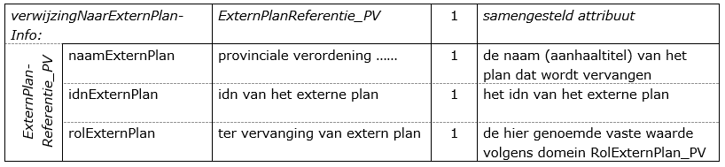

# Herzieningen

**In dit hoofdstuk wordt ingegaan op de wijze waarop gedeeltelijke herzieningen
gecodeerd moeten worden en hoe beschikt kan worden over een versie
"geconsolideerd".**

## Gedeeltelijke herziening

Bij een provinciale verordening kan onderscheid worden gemaakt in een besluit
dat eenmalig is genomen c.q. wordt herzien waarbij zij integraal in de plaats
komen van een voorgaand besluit en in een reeds vastgesteld besluit waarvan een
gedeelte wordt herzien.

Hetgeen in Hoofdstuk 4 van deze praktijkrichtlijn is vermeld, is zowel in het
eenmalige geval als in geval van een integraal herzien besluit volledig van
toepassing.  
Op deze wijze wordt al hetgeen een nieuwe provinciale verordening besluit
betreft gecodeerd en wordt voldaan aan de wettelijke plicht te beschikken over
een objectgericht besluit.

In het andere geval wordt een gedeelte van de geldende provinciale verordening
herzien, waarna de geldende provinciale verordening, inclusief hetgeen daarvan
herzien is, de nieuwe geldende provinciale verordening wordt. In dit geval
worden alleen die aspecten die de aanpassing betreffen gecodeerd. Onderstaand
wordt aangegeven op welke wijze de objecten en attributen uit Hoofdstuk 3 voor
een gedeeltelijke herziening dienen te worden gebruikt. Het resultaat is een
aparte dataset die behoort bij de gedeeltelijke herziening.

Als verplicht onderdeel moet het object *Besluitgebied_P* worden gebruikt. De
begrenzing van het plangebied heeft betrekking op de te herziene locatie. Dit
kan afwijken van de begrenzing van het oorspronkelijk plangebied waarop de
herziening betrekking heeft. Verder wordt dezelfde multipliciteit van de
attributen in acht genomen, met dat verschil dat het attribuut
*verwijzingNaarExternPlanInfo* verplicht moet worden ingevuld.  
Daartoe worden bij het object *Besluitgebied_P* bij het attribuut *verwijzingNaarExternPlanInfo* bij de samenstellende at¬tributen respectievelijk
de naam (type) van het plan dat wordt herzien, het idn van het plan dat wordt
herzien en de waarde "ter vervanging van extern plan" ingevuld. Daarmee wordt de
relatie met het plan dat gedeeltelijk wordt herzien vastgelegd.

**Tabel 5 Relatie naar extern plan**

Bij het attribuut *verwijzingNaarTekstInfo* worden alle relevante teksten
gevoegd. Daartoe wordt gebruik gemaakt van de domeinwaarden van het domein
*TeksttypeBG_PV*. De overige attributen spreken voor zich.

Daarnaast kunnen vervolgens alle herziene objecten van de klasse *Besluitvlak_P*
en/of *Besluitsubvlak_P*, met alle (nieuwe of aanpassingen van de) regels, voor
zover dit de herziening betreft, worden gecodeerd. De codering, zoals hier
bedoeld, dient afhankelijk van de concrete situatie te worden aangebracht.
Nadere regels zijn moeilijk te geven gezien de vele mogelijkheden die aard,
omvang en onderlinge samenhang van de te herziene gedeelten van een provinciale
verordening met zich meebrengen. Dit betreft uiteraard geen ideale situatie. Zo
daar behoefte aan is kan getracht worden hierover afspraken te maken en een
aparte richtlijn te schrijven.  
Het kan praktisch zijn om de objecten die behoren bij de herziening zodanig te
kiezen en te coderen dat er een voordeel ontstaat bij het opstellen van de
versie "geconsolideerd" die verderop aan de orde komt. Uiteraard is het
juridische doel van de herziening maatgevend, maar kan van de ruimte binnen dat
doel gebruik worden gemaakt om te komen tot een ook voor de codering en de
verwerking daarvan in een versie “geconsolideerd” versie praktische oplossing.

Op deze wijze wordt al hetgeen een herziening van een provinciale verordening
betreft gecodeerd en wordt voldaan aan de wettelijke plicht te beschikken over
een objectgericht plan, maar ontstaat *geen* compleet overzicht van de nieuwe
geldende situatie. Een oplossing daarvoor is om gebruik te maken van een versie
"geconsolideerd" waarin de gevolgen van de herziening zijn verwerkt. Daarop
wordt hierna onder 4.2 nader ingegaan.

## Geldende situatie: de versie “geconsolideerd”

Om de raadpleger van [ruimtelijkeplannen.nl](http://www.ruimtelijkeplannen.nl/)
meer duidelijkheid te kunnen bieden over de exacte status en werkingssfeer van
wijzigingen in de provinciale verordening en het actuele planologische regime
ter plaatse kan het gebruik van een versie “geconsolideerd” de oplossing zijn.
Op die manier is in één oogopslag duidelijk wat de juridische status van de
desbetreffende verordeningen is en wat de overige gevolgen ervan zijn. Hierdoor
is het niet (meer) nodig via andere, vaak omslachtige, wegen te zoeken naar de
geldende regels. Dat geeft duidelijkheid, kost minder tijd en is dus
klantvriendelijk naar de raadpleger. Ook de complete data die op
Ruimtelijkeplannen.nl is gepubliceerd door een bevoegd gezag kan hiermee op orde
worden gesteld.  
*Let op*: het gaat dus niet om een herziening of een actualisering van een
provinciale verordening maar om het samenvoegen van meerder ruimtelijke plannen
om zo een integrale versie, en daardoor een beter leesbare versie van de
verordening, te tonen. Er vinden dus geen nieuwe ontwikkelingen plaats. De
versie ‘geconsolideerd’ van een provinciale verordening kent geen wettelijke,
dus geen juridische status omdat deze versie niet door de Provinciale Staten
wordt vastgesteld. Het gebruik van een geconsolideerd plan is een keuze van het
bevoegd gezag.

De provincie is het bevoegde gezag voor de provinciale bedrijven die vallen
onder de Richtlijn Industriële Emissies (voorheen de IPPC-richtlijn) en die
vallen onder het Besluit risico’s zware ongevallen (Brzo). Dit geldt ook voor
zaken als bouwen, slopen, kappen van bomen en  plaatsen van reclameborden. De
aanvrager dient hierbij een omgevingsvergunning aan te vragen bij de provincie.
Bij vergunningverlening moet altijd verwezen worden naar de juridisch geldende
verordeningen en wijzigingsbesluiten.

Het consolideren van provinciale verordening met de wijzigingsbesluiten gaat in
eerste instantie altijd over het samenvoegen van twee of meer plankaarten, waar
nodig. Dit kan in combinatie met het consolideren van de regels en toelichting.

Een eerste stap bij het consolideren van een verordening is de consolidatie van
de verschillende plankaarten die zijn ontstaan door wijzigingen. Op
Ruimtelijkeplannen.nl komen deze als het ware op elkaar te liggen waardoor de
raadpleging wordt bemoeilijkt. Bij een provinciale verordening worden vaak
meerdere kaarten per thema gemaakt. Deze kaarten worden per thema geraadpleegd
en niet in één geconsolideerde versie gemaakt. Het consolideren van de kaarten
bij een provinciale verordening gaat om het consolideren per thema of onderwerp.

Afhankelijk welke aspecten moeten worden geconsolideerd zijn er twee
mogelijkheden. De eerste is dat er een nieuwe plankaart wordt gemaakt van de
plannen waarbij de wijzigingen in het oorspronkelijke plan verwerkt worden. Door
de wijzigingen in het originele plan te verwerken, ontstaat er één duidelijk
beeld. De andere werkwijze is het ´knippen´ van delen uit de oorspronkelijke
plankaart, delen waarin de wijzigingen als het ware de gaten ´opvullen´ in de
verbeelding. In dat geval moet de consolidatie geen aspecten bevatten die het
overige deel van het plan betreffen. Vervolgens laat ruimtelijkeplannen.nl door
de ‘gaten’ de juiste informatie zien.

In het geval van de eerste mogelijkheid bundelt de bronhouder vervolgens de
regels van de wijzigingen die geconsolideerd worden. Hierbij verwerkt de
bronhouder in de regels van het oorspronkelijke plan de wijzigingen die daarin
door de wijzigingsplannen zijn aangebracht zodat één complete set van geldende
regels ontstaat. Het is daardoor niet nodig meerdere plannen te raadplegen en
ontstaat er meer duidelijkheid voor de raadpleger over wat waar geldig is. Omdat
deze versie geen geldige juridische status heeft is het aan te bevelen om een
verwijzing te maken naar de juridisch geldende provinciale verordeningen met een
deeplink in de geconsolideerde tekst naar de brontekst.

Een volgende stap die nog gedaan kan worden, is het consolideren van de
toelichting behorende bij een verordening. Een bronhouder kan hierbij kiezen
voor het maken van een algemene toelichting waarin de essentie van het
consolideren wordt uitgelegd met daarbij de koppeling van de toelichtingen van
de plannen die geconsolideerd worden. Dit kan een koppeling zijn naar een pdf
dan wel html van de toelichtingen of een koppeling naar de xml bestanden van de
toelichtingen in geval van objectgerichte planteksten.

Aangezien de versie geconsolideerd niet door Provinciale Staten wordt
vastgesteld, is het voor de hand liggend om voor de datum van deze verordening
aan te sluiten bij het in werking treden / onherroepelijk worden van de meest
recente verordening. Tevens is het aan te raden om te verwijzen naar de geldige
plannen dan wel besluiten. Bij de waarde van het attribuut
*verwijzingNaarExternPlanInfo* worden alle plannen/besluiten opgenomen die in
deze versie geconsolideerd zijn verwerkt. De waarde bij het attribuut
*rolExternPlan* is in dit geval: ‘als mutatie opgenomen’. Het ruimtelijke plan
met de plan status ‘geconsolideerd’ wordt in het manifest met behulp van de
dossierstatus ‘geconsolideerd’ geplaatst.
