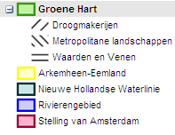

# Verbeelding van een vormvrij plan
**Met het gebruik van de symboolcodelijst voor vormvrije plannen is het mogelijk
verbeeldingsaspecten aan de objecten in de structuurvisie toe te kennen. In dit
hoofdstuk wordt nader ingegaan op de werkwijze.**

## Toelichting
Voor bestemmingsplannen geldt er een standaard voor verbeelding bij de officiële
publicatie door de bronhouder: de Standaard Vergelijkbare Bestemmingsplannen
(SVBP2012). Ontvangende partijen hanteren in de regel ook deze standaard. Er is
echter geen standaard vastgesteld voor verbeelden van een provinciale
verordening of andere vormvrije plannen. In een provinciale verordening kan
daarom sinds IMRO2012 informatie over de kleur, patroon en de opbouw van de
verbeelding (kaart) worden opgenomen. De ontvanger van de digitale provinciale
verordening kan daardoor uit het IMRO-gecodeerde ruimtelijke plan opmaken in
welke kleuren en/of patronen of in hoeveel kaarten de provinciale verordening
moet worden weergeven.  
Het attribuut dat hiervoor door de bronhouder moeten worden gebruikt is
*cartografieInfo*. Dit is een samengesteld attribuut bestaande uit de attributen
*kaartnummer, kaartnaam* en *symboolcode*. In de volgende paragrafen volgt de
werkwijze voor het gebruik van de symboolcodelijst.

## cartografieInfo
Per object wordt de symboliek gecodeerd en gerelateerd aan het kaartbeeld waarin
het object moet voorkomen. Ieder object dat binnen een verbeelding moet worden
gesymboliseerd moet een *kaartnummer*, *kaartnaam* en *symboolcode* krijgen, de
onderdelen van et attribuut *cartografieInfo*. De structuur van de kaartopbouw
staat hiermee los van de planstructuur. Dit biedt volledige vrijheid van
kaartsamenstelling, maar kan ook inconsequente verbeeldingen opleveren. De
verantwoordelijkheid hiervoor ligt bij de bronhouder die dit ruimtelijke plan
maakt (of laat maken). Een foutieve symboolcode resulteert in een niet
gedefinieerde weergave in de interactieve raadpleegomgeving: het object in een
grijstint.
  

Bij de RO Standaarden 2012 is een symboolcodelijst beschikbaar als bijlage bij
<a href='https://www.geonovum.nl/geo-standaarden/ro-standaarden-ruimtelijke-ordening/informatiemodel-ruimtelijke-ordening-imro2012' target='_blank'>IMRO2012</a>). De symboolcode bepaalt alleen het uiterlijk van het symbool (kleur,
arcering, vorm, etc.) en zegt niets over de betekenis. Dit is een zogenaamde
enkelvoudige code, dat wil zeggen: geen aparte aanduiding voor vlakkleur,
vulling en lijnstructuur en lijnkleur, maar 1 code voor de complete symboliek.
Degene die het ruimtelijk plan codeert bepaalt zelf welk symbool voor een
bepaald beleid gebruikt wordt.
  

De verbeelding kent door het gebruik van symboolcodes (refereren naar kaarten)
een structuurweergave die gebruikt kan worden in de interactieve
raadpleegomgeving waardoor de verschillende kaarten binnen het ruimtelijke plan
interactief worden.

## Gebruik van symboolcode
Ieder planobject in het ruimtelijk plan heeft ten behoeve van de juiste
verbeelding op de kaart een symboolcode nodig. Met behulp van het attribuut
*symboolcode* wordt een waarde uit de symboolcodelijst gebruikt. Het attribuut
*symboolcode* is samengesteld uit de attributen *kaartnummer*, *kaartnaam* en
*symboolcode*. De waarden van *kaartnummer* en *kaartnaam* zorgen voor een
structuurweergave van het kaartbeeld. De waarde van *symboolcode* zorgt voor de
daadwerkelijke verbeelding. De *symboolcode* is optioneel: in het geval
*symboolcode* niet is opgegeven, wordt het planobject wel weergegeven in de
structuurweergave, maar niet in het kaartbeeld zelf.

Bij het gebruik van een planobject met geometrieën van verschillende typen
(punt, lijn, vlak) moet voor ieder geometrietype een bijpassend symbool worden
opgenomen. In het geval van drie geometrietypen, komt het samengestelde
attribuut *cartografieInfo* driemaal voor.
  

De beginletter van de symboolcode specificeert het type geometrie waar het
symbool betrekking heeft. Dit bepaalt tevens welke volgorde het object getekend
moet worden. Om objecten in de juiste volgorde te kunnen tekenen is de prefix
van de symboolcode bepalend. Op de volgende wijze dient het type symbool
gepositioneerd te worden in de verbeelding van het plan, volgorde van boven naar
onder:

|   |   |
| - | - |
|Puntsymbool:|P`<`nr`>`|
|Lijnsymbool:|L`<`nr`>`|
|Gearceerd vlaksymbool:| AS`<`nr`>`|
|Semi-transparant vlaksymbool met 50% / zonder vulling:| ES`<`nr`>`|
|Dicht vlaksymbool:| S`<`nr`>`|

De gebruikte objectenstructuur in het ruimtelijk plan dient de volgorde tussen
de elementen binnen een symboolprefix te bepalen: kindelementen liggen boven de
moederelementen. Binnen een kaartnummer/kaartnaam worden objecten in een
structuur geplaatst conform de relatie van de objecten binnen een plan.
Elementen op hetzelfde niveau worden gesorteerd op alfabet.

Planobjecten zonder geometrie kunnen wel in de legenda worden opgenomen wanneer
gebruik wordt gemaakt van het attribuut cartografieInfo. Met dit attribuut kan
een kaartnaam en kaartnummer worden toegekend. In Figuur 6 wordt een voorbeeld
van de weergave in structuur getoond.
  

**Figuur 6 Weergave van een structuur met onderliggende objecten**
  

Deze volgorde heeft als resultaat dat de verbeelding verandert bij selectie van
bovenliggend (Figuur 7) en onderliggend object (Figuur 8).
  

**Figuur 7 Weergave in de verbeelding bij selectie van bovenliggend object**
  

**Figuur 8 Weergave in de verbeelding bij selectie van een onderliggend object**
  

Planobjecten die niet zichtbaar, maar wel opvraagbaar moeten zijn in het
kaartbeeld (verborgen objecten) worden gecodeerd met een symboolcode met een
100% transparante vulling. Als er geen symboolcode aan toe wordt gevoegd komt
het object niet in de kaart (opvraagbaar) voor, maar alleen in de weergave van
de structuur. Planobjecten zonder geometrie worden wel in de structuurboom
getoond via welke de detailinformatie is op te vragen. Consequentie hiervan is
wel dat objecten voor de raadpleger moeilijk of zelfs niet vindbaar zijn in het
kaartbeeld. De maker van de verordening kan zich afvragen of dat wel de
bedoeling is.
In het Tabel 6 is aangeduid hoe de objecten moeten worden verbeeld.

<table id="d4e5346" style="width: 100%;"><caption>Relatie objecten en verbeelding</caption><colgroup><col id="col1" style="width: 24.991326471608648%;"></col><col id="col2" style="width: 25.002891176130447%;"></col><col id="col3" style="width: 25.002891176130447%;"></col><col id="col4" style="width: 25.002891176130447%;"></col></colgroup><thead valign="top"><tr><th align="left" style="border-top: 0.5pt solid #000000; border-left: 0.5pt solid #000000; border-bottom: 0.5pt solid #000000; border-right: 0.5pt solid #000000; background-color: none;">
Geometrie aanwezig
</th><th align="left" style="border-top: 0.5pt solid #000000; border-left: 0.5pt solid #000000; border-bottom: 0.5pt solid #000000; border-right: 0.5pt solid #000000; background-color: none;">
Symboolcode aanwezig
</th><th align="left" style="border-top: 0.5pt solid #000000; border-left: 0.5pt solid #000000; border-bottom: 0.5pt solid #000000; border-right: 0.5pt solid #000000; background-color: none;">
Weergave in kaart
</th><th align="left" style="border-top: 0.5pt solid #000000; border-left: 0.5pt solid #000000; border-bottom: 0.5pt solid #000000; border-right: 0.5pt solid #000000; background-color: none;">
In structuurweergave
</th></tr></thead><tbody valign="top"><tr><td align="left" style="border-top: 0.5pt solid #000000; border-left: 0.5pt solid #000000; border-bottom: 0.5pt solid #000000; border-right: 0.5pt solid #000000; background-color: none;">
Ja
</td><td align="left" style="border-top: 0.5pt solid #000000; border-left: 0.5pt solid #000000; border-bottom: 0.5pt solid #000000; border-right: 0.5pt solid #000000; background-color: none;">
Ja
</td><td align="left" style="border-top: 0.5pt solid #000000; border-left: 0.5pt solid #000000; border-bottom: 0.5pt solid #000000; border-right: 0.5pt solid #000000; background-color: none;">
Ja
</td><td align="left" style="border-top: 0.5pt solid #000000; border-left: 0.5pt solid #000000; border-bottom: 0.5pt solid #000000; border-right: 0.5pt solid #000000; background-color: none;">
Ja
</td></tr><tr><td align="left" style="border-top: 0.5pt solid #000000; border-left: 0.5pt solid #000000; border-bottom: 0.5pt solid #000000; border-right: 0.5pt solid #000000; background-color: none;">
Ja
</td><td align="left" style="border-top: 0.5pt solid #000000; border-left: 0.5pt solid #000000; border-bottom: 0.5pt solid #000000; border-right: 0.5pt solid #000000; background-color: none;">
Nee
</td><td align="left" style="border-top: 0.5pt solid #000000; border-left: 0.5pt solid #000000; border-bottom: 0.5pt solid #000000; border-right: 0.5pt solid #000000; background-color: none;">
Nee
</td><td align="left" style="border-top: 0.5pt solid #000000; border-left: 0.5pt solid #000000; border-bottom: 0.5pt solid #000000; border-right: 0.5pt solid #000000; background-color: none;">
Ja
</td></tr><tr><td align="left" style="border-top: 0.5pt solid #000000; border-left: 0.5pt solid #000000; border-bottom: 0.5pt solid #000000; border-right: 0.5pt solid #000000; background-color: none;">
Nee
</td><td align="left" style="border-top: 0.5pt solid #000000; border-left: 0.5pt solid #000000; border-bottom: 0.5pt solid #000000; border-right: 0.5pt solid #000000; background-color: none;">
Ja
</td><td align="left" style="border-top: 0.5pt solid #000000; border-left: 0.5pt solid #000000; border-bottom: 0.5pt solid #000000; border-right: 0.5pt solid #000000; background-color: none;">
Ja
</td><td align="left" style="border-top: 0.5pt solid #000000; border-left: 0.5pt solid #000000; border-bottom: 0.5pt solid #000000; border-right: 0.5pt solid #000000; background-color: none;">
Ja
</td></tr><tr><td align="left" style="border-top: 0.5pt solid #000000; border-left: 0.5pt solid #000000; border-bottom: 0.5pt solid #000000; border-right: 0.5pt solid #000000; background-color: none;">
Nee
</td><td align="left" style="border-top: 0.5pt solid #000000; border-left: 0.5pt solid #000000; border-bottom: 0.5pt solid #000000; border-right: 0.5pt solid #000000; background-color: none;">
Nee
</td><td align="left" style="border-top: 0.5pt solid #000000; border-left: 0.5pt solid #000000; border-bottom: 0.5pt solid #000000; border-right: 0.5pt solid #000000; background-color: none;">
Nee
</td><td align="left" style="border-top: 0.5pt solid #000000; border-left: 0.5pt solid #000000; border-bottom: 0.5pt solid #000000; border-right: 0.5pt solid #000000; background-color: none;">
Ja
</td></tr></tbody></table>

De plangrens van het ruimtelijke plan krijgt geen symboolcode, de plangrens
wordt standaard afgebeeld conform de plangrens in de SVBP2012.  
Cartografische symbolen als grote pijlen moeten volgens de praktijkrichtlijn als
geometrisch object worden ingetekend en gecodeerd met behulp van de waarde
“cartografisch figuur” bij het attribuut *idealisatie*. Er komen in de
symboolcodelijst daarom geen figuratieve symbolen voor, maar alleen met
abstracte symbolen.

## Kaartnummer en kaartnaam

*Kaartnummer* en *kaartnaam* zijn vrij te kiezen. De kaarten dienen in oplopende
volgorde van *kaartnummer* te worden getoond in de structuurweergave. De kaart
met nummer 1 wordt als hoofdkaart gezien en moet altijd voorkomen. Het
kaartnummer moet een uniek nummer zijn gekoppeld aan een kaartnaam. Het ophogen
van het kaartnummer met ‘1’ligt voor de hand (wat resulteert in 1,2,3 etc.). Het
kaartnummer maakt geen deel uit van de verbeelding, maar alleen dient ten
behoeve van de presentatiestructuur en dient niet te worden getoond.  
In het geval van herzieningen kan het wenselijk zijn de oorspronkelijke
kaartnummers aan te houden en dus niet steeds met 1 op te hogen.
  

Een object kan in meerdere kaarten voorkomen met verschillende symboliek. Om
hetzelfde planobject op verschillende kaarten met een ander symbool weer te
geven moeten meerdere symboolcodes toegekend worden, voor iedere kaart een
betreffende *cartografieInfo*. De naam van het object kan niet verschillen per
kaart; dan zou er feitelijk ook sprake zijn van een ander object. Wanneer dit
wel gewenst is, zal het object meerdere keren moeten worden gecodeerd.