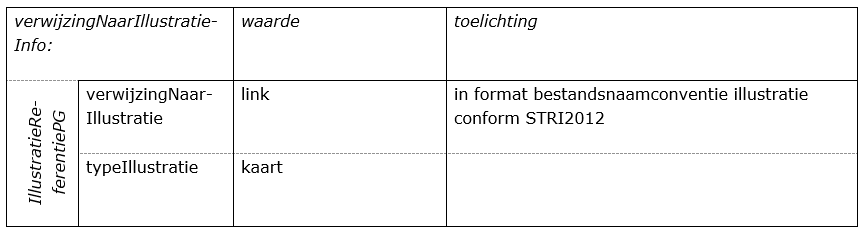

# Bijlage 1 - Veel gestelde vragen

Op de website van Geonovum[^10] zijn antwoorden te vinden op de meest gestelde
vragen. In deze bijlage wordt ingegaan op een aantal veel gestelde vragen bij
het opstellen van een digitale structuurvisie.

[^10] ( https://www.geonovum.nl/geo-standaarden/ruimtelijke-ordening/veelgestelde-vragen-ro-standaarden )

## Algemene vragen

1.  *Wat is het verschil tussen deze versie van de praktijkrichtlijn en de
    PRrSV2012, de PRpSV2012 en de PRgSV2012?*  
    Deze praktijkrichtlijn (PRPV2012) geeft een toelichting voor het opstellen
    van structuurvisies door het rijk, de provincies als de gemeenten en
    vervangt daarmee de Praktijkrichtlijn voor rijksstructuurvisies (PRrSV2012),
    de Praktijkrichtlijn voor provinciale structuurvisies (PRpSV2012) en de
    Praktijkrichtlijn voor gemeentelijke structuurvisies (PRgSV2012).

2.  *Moeten eerst de teksten worden geschreven of eerst de kaart worden
    opgesteld?*  
    Dit maakt in principe niet zoveel uit. Belangrijker is dat het maken van de
    tekst en de kaart goed op elkaar wordt afgestemd.

3.  *Hoe neem ik het vaststellingsbesluit mee?*  
     Alleen bij de vastgestelde versie van de structuurvisie kan en moet het
     ondertekende vaststellingsbesluit in HTML-, XHTML of PDF-formaat worden
     meegenomen. Deze moet niet als bijlage bij de tekst worden opgenomen, maar
     als los bestand met als verplichte naamgeving:  
     vb_IDN.pdf (of .xhtml of .html). Voor meer informatie zie de STRI2012[^11].

[^11] (https://ro-standaarden.geonovum.nl/2012/STRI/2.0/STRI2012-v2.0.pdf)

4.  *Hoe ga ik om met herzieningen?*  
Dit is nader toegelicht in [Bijlage 3](#B03).

5.  *Hoe maak ik een versie “geconsolideerd”?*  
Dit is nader toegelicht in [Bijlage 4](#B04).

## Vragen over de tekst

1.  *Gaan tekstonderdelen zoals ‘voorwoord’ en ‘inleiding’ wel mee als ik ze
    niet opneem op een kaart?*  
    Omdat de gehele plantekst aan het planobject Structuurvisieplangebied is
    gekoppeld, zijn alle tekstonderdelen via dit planobject ook via de kaart te
    openen (zie rood omcirkeld in Figuur 21).

**Figuur 21 Raadpleegbare tekst**

## Vragen over de verbeelding

1.  *Moet een planobject dat op meerdere kaarten voorkomt, ook meerdere keren in
    de objectenstructuur worden opgenomen?*  
Nee, voor het planobject waarvan de opsteller van de structuurvisie wil dat
deze bijvoorbeeld op kaart 1en kaart 3 wordt getoond, wordt het attribuut *cartografieInfo* tweemaal opgenomen (zie Tabel 3 in paragraaf 4.1.2).

2.  *Kleurcodes zijn te beperkend, daarom wil ik een eigen illustratie opnemen.
    Hoe doe ik dit?*  
    Het is mogelijk om naast de digitale kaart ook een verwijzing vanuit het
    planobject StructuurvisiePlangebied een verwijzing op te nemen naar een
    illustratie (zie Tabel 10).

**Tabel 10 Verwijzen naar een illustratie**

