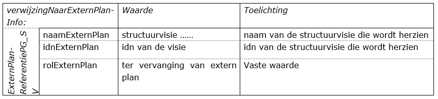

# Bijlage 3 - Gedeeltelijke herziening

**Het herzien van een structuurvisie is in deze bijlage kort toegelicht.**

Bij de herziening van een structuurvisie kan worden gekozen uit twee methoden:  
1.  er kan een geheel nieuwe structuurvisie worden opgesteld, al dan niet
    samenvallend met de begrenzing van een of meer voorgaande structuurvisies
    of;  
2.  er kan worden volstaan met de herziening van een bepaald aspect in tekst of
    de geometrie van een object van een eerder vastgestelde structuurvisie.

In het eerste geval is sprake van een nieuwe structuurvisie die in de plaats
treedt van het (de) bestaande structuurvisie(s). De werkwijze zoals beschreven
in deze praktijkrichtlijn is op deze situatie volledig van toepassing.  
In het tweede geval is uitsluitend voor de betreffende aspecten sprake van
aanpassing van de structuurvisie. In dit geval worden alleen die aspecten die de
aanpassing betreffen gecodeerd. Dit wordt echter wel ter beschikking gesteld als
een nieuwe structuurvisie. Een gedeeltelijke herziening betekent dus niet dat de
codes van de reeds vastgestelde structuurvisie moeten worden aangepast!  
Als verplicht onderdeel moet het planobject *Structuurvisieplangebied* worden
gebruikt (zie Tabel 12). De begrenzing van het plangebied heeft betrekking op de
te herziene locatie. Dit kan afwijken van de begrenzing van het oorspronkelijk
plangebied waarop de herziening betrekking heeft. Enige verschil is dat bij een
gedeeltelijke herziening het attribuut *verwijzingNaarExternPlanInfo* verplicht
moet worden ingevuld, zodat de relatie met het plan dat gedeeltelijk wordt
herzien, is vastgelegd.  
De oorspronkelijke structuurvisie blijft in zijn geheel beschikbaar.

**Tabel 12 Attribuut verwijzingExternPlanInfo bij het planobject
Structuurvisieplangebied**

Daarnaast kunnen vervolgens alle herziene planobjecten van de klasse
*Structuurvisiegebied*, *Structuurvisiecomplex* en/of
*Structuurvisieverklaring*, met alle (nieuwe of aanpassingen van de) teksten,
voor zover dit de herziening betreft, worden gecodeerd.  
Op deze wijze wordt al hetgeen de herziening betreft gecodeerd en wordt voldaan
aan de wettelijke plicht te beschikken over een digitale structuurvisie, maar
ontstaat geen compleet overzicht van de nieuwe geldende situatie. Een oplossing
daarvoor is om gebruik te maken van een versie "geconsolideerd" waarin de
gevolgen van de herziening zijn verwerkt. Daarop wordt in [Bijlage 4](#B04) nader
ingegaan.
