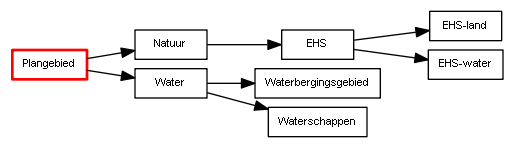

# Bijlage 5 – Invulhulp voor het bepalen van het type planobject

**Deze bijlage kan worden gebruikt bij het maken van een objectgericht
structuurvisie, maar is *niet* verplicht. De voor ingevulde varianten van
klassen die in deze bijlage worden beschreven, zijn niets meer dan mogelijke
manieren waarop de klassen uit het IMRO2012, zoals beschreven in Hoofdstuk 5,
kunnen worden ingevuld en dienen ook als zodanig te worden beschouwd. De
volgende attributen worden niet genoemd in deze bijlage omdat ervan uitgegaan is
dat de software dit automatisch invult: identificatie, plangebied, planobject.**

## Bepalen van het type planobject (klasse)

Het eerste planobject in de objectenstructuur is altijd het plangebied. Dit
planobject heeft als naam de aanhaaltitel van de structuurvisie, als tekst de
gehele plantekst en als geografische aanduiding de buitenste grens van het
gebied waar de structuurvisie over gaat. Dit planobject behoort tot de klasse
‘Structuurvisieplangebied’. In paragraaf 5.2 wordt voor deze klasse nader
toegelicht welke eigenschappen moeten/mogen worden ingevuld.  
Voor de overige planobjecten in de objectenstructuur dient eerst nader te worden
bepaald tot welke klasse deze behoren voordat de bijbehorende eigenschappen
kunnen worden ingevuld. In deze paragraaf is een vragenlijst opgenomen, waarmee
per planobject kan worden bepaald tot welk type deze behoort. Aan het eind van
deze paragraaf is een voorbeeld opgenomen ter verduidelijking.

*Vraag 1. Is er beleid gekoppeld aan dit planobject?*  
JA: ga naar vraag 2  
NEE: ga naar vraag 7

*Vraag 2. Wordt dit planobject verder onderverdeeld?*  
JA: ga naar vraag 3  
NEE: ga naar vraag 5

*Vraag 3. Wordt dit planobject geografisch aangeduid?*  
JA: [Structuurvisiecomplex, invulvariant A](#structuurvisiecomplex-invulvariant-a)  
NEE: ga naar vraag 4

*Vraag 4. Dient dit planobject als kopje in de legenda te worden opgenomen?*  
JA: [Structuurvisiecomplex, invulvariant B](#structuurvisiecomplex-invulvariant-b)  
NEE: [Structuurvisiecomplex, invulvariant C](#structuurvisiecomplex-invulvariant-c)

*Vraag 5. Wordt dit planobject geografisch aangeduid?*  
JA: [Structuurvisiegebied, invulvariant A](#structuurvisiegebied-invulvariant-a)  
NEE: ga naar vraag 6

*Vraag 6. Betreft het een Structuurvisie van het Rijk?*  
JA: [Structuurvisiegebied, invulvariant B](#structuurvisiegebied-invulvariant-b)  
NEE: het planobject is niet te coderen

*Vraag 7. Wordt dit planobject verder onderverdeeld?*  
JA: ga naar vraag 8  
NEE: ga naar vraag 10

*Vraag 8. Wordt dit planobject geografisch aangeduid?*  
JA: [Structuurvisiecomplex, invulvariant D](#structuurvisiecomplex-invulvariant-d)  
NEE: ga naar vraag 9

*Vraag 9. Dient dit planobject als kopje in de legenda te worden opgenomen?*  
JA: [Structuurvisiecomplex, invulvariant E](#structuurvisiecomplex-invulvariant-e)  
NEE: [Structuurvisiecomplex, invulvariant F](#structuurvisiecomplex-invulvariant-f)*

*Vraag 10. Betreft het een Structuurvisie van het Rijk?*  
JA: het planobject is niet te coderen  
NEE: ga naar vraag 11

*Vraag 11. Betreft het een Structuurvisie van de provincie?*  
JA: [Structuurvisieverklaring, invulvariant A](#structuurvisieverklaring-invulvariant-a)  
NEE: [Structuurvisiegebied, invulvariant C](#structuurvisiegebied-invulvariant-c)

**Figuur 22 Voorbeeld planstructuur**

**Tabel 13 Vragenlijst toegepast op voorbeeld uit Figuur 22**

<table id="d4e11469" style="width: 100%;"><caption>Vragenlijst toegepast op voorbeeld uit Figuur 22</caption><colgroup><col id="col1" style="width: 22.462941847206388%;"></col><col id="col2" style="width: 27.65108323831243%;"></col><col id="col3" style="width: 22.063854047890537%;"></col><col id="col4" style="width: 27.822120866590648%;"></col></colgroup><thead valign="top"><tr><th align="left" style="border-top: 0.5pt solid #000000; border-left: 0.5pt solid #000000; border-bottom: 0.5pt solid #000000; border-right: 0.5pt solid #000000;">
Planobject
</th><th align="left" style="border-top: 0.5pt solid #000000; border-left: 0.5pt solid #000000; border-bottom: 0.5pt solid #000000; border-right: 0.5pt solid #000000;">
Toelichting
</th><th align="left" style="border-top: 0.5pt solid #000000; border-left: 0.5pt solid #000000; border-bottom: 0.5pt solid #000000; border-right: 0.5pt solid #000000;">
Vragenlijst
</th><th align="left" style="border-top: 0.5pt solid #000000; border-left: 0.5pt solid #000000; border-bottom: 0.5pt solid #000000; border-right: 0.5pt solid #000000;">
Type (klasse)
</th></tr></thead><tbody valign="top"><tr><td align="left" style="border-top: 0.5pt solid #000000; border-left: 0.5pt solid #000000; border-bottom: 0.5pt solid #000000; border-right: 0.5pt solid #000000; background-color: none;">
Natuur
</td><td align="left" style="border-top: 0.5pt solid #000000; border-left: 0.5pt solid #000000; border-bottom: 0.5pt solid #000000; border-right: 0.5pt solid #000000; background-color: none;">
Betreft beleidstekst. Het planobject wordt niet geografisch aangeduid, maar wel als kopje in de legenda opgenomen.
</td><td align="left" style="border-top: 0.5pt solid #000000; border-left: 0.5pt solid #000000; border-bottom: 0.5pt solid #000000; border-right: 0.5pt solid #000000; background-color: none;">
vraag 1: JA

vraag 2: JA

vraag 3: NEE

vraag 3: JA
</td><td align="left" style="border-top: 0.5pt solid #000000; border-left: 0.5pt solid #000000; border-bottom: 0.5pt solid #000000; border-right: 0.5pt solid #000000; background-color: none;">
Structuurvisiecomplex. invulariant B

<i>(zie bijlage <a href="#">5.6</a></i><i>)</i>
</td></tr><tr><td align="left" style="border-top: 0.5pt solid #000000; border-left: 0.5pt solid #000000; border-bottom: 0.5pt solid #000000; border-right: 0.5pt solid #000000; background-color: none;">
Water
</td><td align="left" style="border-top: 0.5pt solid #000000; border-left: 0.5pt solid #000000; border-bottom: 0.5pt solid #000000; border-right: 0.5pt solid #000000; background-color: none;">
Betreft beleidstekst.  Het planobject wordt niet geografisch aangeduid en ook niet als kopje in de legenda opgenomen.
</td><td align="left" style="border-top: 0.5pt solid #000000; border-left: 0.5pt solid #000000; border-bottom: 0.5pt solid #000000; border-right: 0.5pt solid #000000; background-color: none;">
vraag 1: JA

vraag 2: JA

vraag 3: NEE

vraag 4: NEE
</td><td align="left" style="border-top: 0.5pt solid #000000; border-left: 0.5pt solid #000000; border-bottom: 0.5pt solid #000000; border-right: 0.5pt solid #000000; background-color: none;">
Structuurvisiecomplex, invulvariant C

<i>(zie bijlage <a href="#">5.7</a></i><i>)</i>
</td></tr><tr><td align="left" style="border-top: 0.5pt solid #000000; border-left: 0.5pt solid #000000; border-bottom: 0.5pt solid #000000; border-right: 0.5pt solid #000000; background-color: none;">
EHS
</td><td align="left" style="border-top: 0.5pt solid #000000; border-left: 0.5pt solid #000000; border-bottom: 0.5pt solid #000000; border-right: 0.5pt solid #000000; background-color: none;">
Betreft beleidstekst. Het planobject wordt geografisch aangeduid.
</td><td align="left" style="border-top: 0.5pt solid #000000; border-left: 0.5pt solid #000000; border-bottom: 0.5pt solid #000000; border-right: 0.5pt solid #000000; background-color: none;">
vraag 1: JA

vraag 2: JA

vraag 3: JA
</td><td align="left" style="border-top: 0.5pt solid #000000; border-left: 0.5pt solid #000000; border-bottom: 0.5pt solid #000000; border-right: 0.5pt solid #000000; background-color: none;">
Structuurvisiecomplex, invulvariant A

<i>(zie bijlage <a href="#">5.5</a></i><i>)</i>
</td></tr><tr><td align="left" style="border-top: 0.5pt solid #000000; border-left: 0.5pt solid #000000; border-bottom: 0.5pt solid #000000; border-right: 0.5pt solid #000000; background-color: none;">
Waterbergingsgebied
</td><td align="left" style="border-top: 0.5pt solid #000000; border-left: 0.5pt solid #000000; border-bottom: 0.5pt solid #000000; border-right: 0.5pt solid #000000; background-color: none;">
Betreft beleidstekst. Het planobject wordt geografisch aangeduid.
</td><td align="left" style="border-top: 0.5pt solid #000000; border-left: 0.5pt solid #000000; border-bottom: 0.5pt solid #000000; border-right: 0.5pt solid #000000; background-color: none;">
vraag 1: JA

vraag 2: NEE

vraag 5: JA
</td><td align="left" style="border-top: 0.5pt solid #000000; border-left: 0.5pt solid #000000; border-bottom: 0.5pt solid #000000; border-right: 0.5pt solid #000000; background-color: none;">
Structuurvisiegebied, invulvariant A

<i>(zie bijlage <a href="#">5.2</a></i><i>)</i>
</td></tr><tr><td align="left" style="border-top: 0.5pt solid #000000; border-left: 0.5pt solid #000000; border-bottom: 0.5pt solid #000000; border-right: 0.5pt solid #000000; background-color: none;">
Waterschappen
</td><td align="left" style="border-top: 0.5pt solid #000000; border-left: 0.5pt solid #000000; border-bottom: 0.5pt solid #000000; border-right: 0.5pt solid #000000; background-color: none;">
Betreft een toelichtende tekst. Het planobject wordt geografisch aangeduid.
</td><td align="left" style="border-top: 0.5pt solid #000000; border-left: 0.5pt solid #000000; border-bottom: 0.5pt solid #000000; border-right: 0.5pt solid #000000; background-color: none;">
vraag 1: NEE

vraag 7: NEE

vraag 10: NEE

vraag 11: JA
</td><td align="left" style="border-top: 0.5pt solid #000000; border-left: 0.5pt solid #000000; border-bottom: 0.5pt solid #000000; border-right: 0.5pt solid #000000; background-color: none;">
Structuurvisieverklaring, invulvariant A

<i>(zie bijlage <a href="#">5.11</a></i><i>)</i>
</td></tr><tr><td align="left" style="border-top: 0.5pt solid #000000; border-left: 0.5pt solid #000000; border-bottom: 0.5pt solid #000000; border-right: 0.5pt solid #000000; background-color: none;">
EHS-land
</td><td align="left" style="border-top: 0.5pt solid #000000; border-left: 0.5pt solid #000000; border-bottom: 0.5pt solid #000000; border-right: 0.5pt solid #000000; background-color: none;">
Betreft beleidstekst. Het planobject wordt geografisch aangeduid.
</td><td align="left" style="border-top: 0.5pt solid #000000; border-left: 0.5pt solid #000000; border-bottom: 0.5pt solid #000000; border-right: 0.5pt solid #000000; background-color: none;">
vraag 1: JA

vraag 2: NEE

vraag 5: JA
</td><td align="left" style="border-top: 0.5pt solid #000000; border-left: 0.5pt solid #000000; border-bottom: 0.5pt solid #000000; border-right: 0.5pt solid #000000; background-color: none;">
Structuurvisiegebied, invulvariant A

<i>(zie bijlage <a href="#">5.2</a></i><i>)</i>
</td></tr><tr><td align="left" style="border-top: 0.5pt solid #000000; border-left: 0.5pt solid #000000; border-bottom: 0.5pt solid #000000; border-right: 0.5pt solid #000000; background-color: none;">
EHS-water
</td><td align="left" style="border-top: 0.5pt solid #000000; border-left: 0.5pt solid #000000; border-bottom: 0.5pt solid #000000; border-right: 0.5pt solid #000000; background-color: none;">
Betreft beleidstekst. Het planobject wordt geografisch aangeduid.
</td><td align="left" style="border-top: 0.5pt solid #000000; border-left: 0.5pt solid #000000; border-bottom: 0.5pt solid #000000; border-right: 0.5pt solid #000000; background-color: none;">
vraag 1: JA

vraag 2: NEE

vraag 5: JA
</td><td align="left" style="border-top: 0.5pt solid #000000; border-left: 0.5pt solid #000000; border-bottom: 0.5pt solid #000000; border-right: 0.5pt solid #000000; background-color: none;">
Structuurvisiegebied, invulvariant A

<i>(zie bijlage <a href="#">5.2</a></i><i>)</i>
</td></tr></tbody></table>

## Structuurvisiegebied, invulvariant A

*Beleid, geografisch aangeduid*  
Als een planobject behoort tot de klasse Structuurvisiegebied met verwijzingen
naar één of meerdere beleidsteksten en verwijzingen naar één of meerdere
kaarten, dan kan volstaan met het invullen van de in Tabel 14 aangegeven
attributen. Voor een toelichting op alle attributen zie [paragraaf 5.2](#klasse-structuurvisiegebied).

**Tabel 14 Klasse Structuurvisiegebied, invulvariant A**

<table id="d4e11867" style="width: 100%;"><caption>Klasse Structuurvisiegebied, invulvariant A</caption><colgroup><col id="col1" style="width: 9.682557742632838%;"></col><col id="col2" style="width: 19.37649334395267%;"></col><col id="col3" style="width: 70.94094891341449%;"></col></colgroup><thead valign="top"><tr><th align="left" style="border-top: 0.5pt solid #000000; border-left: 0.5pt solid #000000; border-bottom: 0.5pt solid #000000; border-right: 0.5pt solid #000000;" colspan="2">
Attribuut
</th><th align="left" style="border-top: 0.5pt solid #000000; border-left: 0.5pt solid #000000; border-bottom: 0.5pt solid #000000; border-right: 0.5pt solid #000000;">
waarde
</th></tr></thead><tbody valign="top"><tr><td align="left" style="border-top: 0.5pt solid #000000; border-left: 0.5pt solid #000000; border-bottom: 0.5pt solid #000000; border-right: 0.5pt solid #000000; background-color: none;" colspan="2">
typePlanobject
</td><td align="left" style="border-top: 0.5pt solid #000000; border-left: 0.5pt solid #000000; border-bottom: 0.5pt solid #000000; border-right: 0.5pt solid #000000; background-color: none;">
structuurvisiegebied 
</td></tr><tr><td align="left" style="border-top: 0.5pt solid #000000; border-left: 0.5pt solid #000000; border-bottom: 0.5pt solid #000000; border-right: 0.5pt solid #000000; background-color: none;" colspan="2">
naam
</td><td align="left" style="border-top: 0.5pt solid #000000; border-left: 0.5pt solid #000000; border-bottom: 0.5pt solid #000000; border-right: 0.5pt solid #000000; background-color: none;">
naam van het planobject (moet uniek zijn)
</td></tr><tr><td align="left" style="border-top: 0.5pt solid #000000; border-left: 0.5pt solid #000000; border-bottom: 0.5pt solid #000000; border-right: 0.5pt solid #000000; background-color: none;" colspan="2">
thema
</td><td align="left" style="border-top: 0.5pt solid #000000; border-left: 0.5pt solid #000000; border-bottom: 0.5pt solid #000000; border-right: 0.5pt solid #000000; background-color: none;">
naam thema

(moet minimaal 1 keer voorkomen, mag vaker)
</td></tr><tr><td align="left" style="border-top: 0.5pt solid #000000; border-left: 0.5pt solid #000000; border-bottom: 0pt none #; border-right: 0.5pt solid #000000; background-color: none;" colspan="2">
<i>beleidInfo:</i>
</td><td align="left" style="border-top: 0.5pt solid #000000; border-left: 0.5pt solid #000000; border-bottom: 0.5pt solid #000000; border-right: 0.5pt solid #000000; background-color: none;">
Moet minimaal 1 keer voorkomen, mag vaker. Bestaat uit de volgende onderdelen:
</td></tr><tr><td align="left" style="padding-top: 0.5em; border-top: 0pt none #; border-left: 0.5pt solid #000000; border-bottom: 0pt none #000000; border-right: 0.5pt solid #000000; background-color: none;" rowspan="2">
<i>BeleidInfo_RSV</i>
</td><td align="left" style="border-top: 0.5pt solid #000000; border-left: 0.5pt solid #000000; border-bottom: 0pt none #; border-right: 0.5pt solid #000000; background-color: none;">
belang
</td><td align="left" style="border-top: 0.5pt solid #000000; border-left: 0.5pt solid #000000; border-bottom: 0pt none #; border-right: 0.5pt solid #000000; background-color: #auto;">
korte omschrijving belang (vrije tekst)
</td></tr><tr><td align="left" style="border-top: 0pt none #; border-left: 0.5pt solid #000000; border-bottom: 0pt none #; border-right: 0.5pt solid #000000; background-color: none;">
rol    
</td><td align="left" style="border-top: 0pt none #; border-left: 0.5pt solid #000000; border-bottom: 0pt none #; border-right: 0.5pt solid #000000; background-color: #auto;">
korte omschrijving rol (vrije tekst)
</td></tr><tr><td align="left" style="border-top: 0.5pt solid #000000; border-left: 0.5pt solid #000000; border-bottom: 0pt none #; border-right: 0.5pt solid #000000; background-color: none;" colspan="2">
<i>verwijzingNaarTekstInfo:</i>
</td><td align="left" style="border-top: 0.5pt solid #000000; border-left: 0.5pt solid #000000; border-bottom: 0.5pt solid #000000; border-right: 0.5pt solid #000000; background-color: none;">
Moet minimaal 1 keer voorkomen, mag vaker. Bestaat uit de volgende onderdelen:
</td></tr><tr><td align="left" style="padding-top: 0.5em; border-top: 0pt none #; border-left: 0.5pt solid #000000; border-bottom: 0pt none #000000; border-right: 0.5pt solid #000000; background-color: none;" rowspan="2">
<i>TekstReferentie_SV</i>
</td><td align="left" style="border-top: 0.5pt solid #000000; border-left: 0.5pt solid #000000; border-bottom: 0pt none #; border-right: 0.5pt solid #000000; background-color: none;">
verwijzingNaarTekst    
</td><td align="left" style="border-top: 0.5pt solid #000000; border-left: 0.5pt solid #000000; border-bottom: 0pt none #; border-right: 0.5pt solid #000000; background-color: #auto;">
Link naar bijbehorende tekst
</td></tr><tr><td align="left" style="border-top: 0pt none #; border-left: 0.5pt solid #000000; border-bottom: 0.5pt solid #000000; border-right: 0.5pt solid #000000; background-color: none;">
typeTekst
</td><td align="left" style="border-top: 0pt none #; border-left: 0.5pt solid #000000; border-bottom: 0.5pt solid #000000; border-right: 0.5pt solid #000000; background-color: #auto;">
Kiezen tussen ‘beleid’ of ‘toelichting’
</td></tr><tr><td align="left" style="border-top: 0.5pt solid #000000; border-left: 0.5pt solid #000000; border-bottom: 0pt none #; border-right: 0.5pt solid #000000; background-color: #auto;" colspan="2">
<i>cartografieInfo:</i>
</td><td align="left" style="border-top: 0.5pt solid #000000; border-left: 0.5pt solid #000000; border-bottom: 0pt none #; border-right: 0.5pt solid #000000; background-color: #auto;">
Moet minimaal 1 keer voorkomen, mag vaker. Bestaat uit de volgende onderdelen:
</td></tr><tr><td align="left" style="padding-top: 0.5em; border-top: 0pt none #; border-left: 0.5pt solid #000000; border-bottom: 0pt none #000000; border-right: 0pt none #; background-color: #auto;" rowspan="3">
<i>CartografieInfo</i>
</td><td align="left" style="border-top: 0.5pt solid #000000; border-left: 0.5pt solid #000000; border-bottom: 0pt none #; border-right: 0.5pt solid #000000; background-color: #auto;">
kaartnummer
</td><td align="left" style="border-top: 0.5pt solid #000000; border-left: 0.5pt solid #000000; border-bottom: 0pt none #; border-right: 0.5pt solid #000000; background-color: #auto;">
nummer van de kaart waartoe dit object behoort
</td></tr><tr><td align="left" style="border-top: 0pt none #; border-left: 0.5pt solid #000000; border-bottom: 0pt none #; border-right: 0.5pt solid #000000; background-color: #auto;">
kaartnaam
</td><td align="left" style="border-top: 0pt none #; border-left: 0.5pt solid #000000; border-bottom: 0pt none #; border-right: 0.5pt solid #000000; background-color: #auto;">
naam van de kaart waartoe dit object behoort
</td></tr><tr><td align="left" style="border-top: 0pt none #; border-left: 0.5pt solid #000000; border-bottom: 0.5pt solid #000000; border-right: 0.5pt solid #000000; background-color: #auto;">
symboolcode    
</td><td align="left" style="border-top: 0pt none #; border-left: 0.5pt solid #000000; border-bottom: 0.5pt solid #000000; border-right: 0.5pt solid #000000; background-color: #auto;">
code van de gebruikte verbeelding voor weergave van het object.
</td></tr><tr><td align="left" style="border-top: 0.5pt solid #000000; border-left: 0.5pt solid #000000; border-bottom: 0pt none #; border-right: 0.5pt solid #000000; background-color: none;" colspan="2">
<i>begrenzing:</i>
</td><td align="left" style="border-top: 0.5pt solid #000000; border-left: 0.5pt solid #000000; border-bottom: 0.5pt solid #000000; border-right: 0.5pt solid #000000; background-color: none;">
Moet minimaal 1 keer voorkomen, mag vaker. Bestaat uit de volgende onderdelen:
</td></tr><tr><td align="left" style="padding-top: 0.5em; border-top: 0pt none #; border-left: 0.5pt solid #000000; border-bottom: 0pt none #000000; border-right: 0.5pt solid #000000; background-color: none;" rowspan="2">
<i>GeometrieStructuurvisieObject</i>
</td><td align="left" style="border-top: 0.5pt solid #000000; border-left: 0.5pt solid #000000; border-bottom: 0pt none #; border-right: 0.5pt solid #000000; background-color: none;">
Geometrie
</td><td align="left" style="border-top: 0.5pt solid #000000; border-left: 0.5pt solid #000000; border-bottom: 0pt none #; border-right: 0.5pt solid #000000; background-color: #auto;">
coördinaten
</td></tr><tr><td align="left" style="border-top: 0pt none #; border-left: 0.5pt solid #000000; border-bottom: 0.5pt solid #000000; border-right: 0.5pt solid #000000; background-color: none;">
idealisatie
</td><td align="left" style="border-top: 0pt none #; border-left: 0.5pt solid #000000; border-bottom: 0.5pt solid #000000; border-right: 0.5pt solid #000000; background-color: #auto;">
te kiezen tussen ‘exact’, ‘indicatief’ of ‘cartografisch figuur’

(verplicht)
</td></tr></tbody></table>

## Structuurvisiegebied, invulvariant B

*Beleid, niet geografisch aangeduid*  
Als een planobject behoort tot de klasse Structuurvisiegebied met verwijzingen
naar één of meerdere beleidsteksten maar zonder verwijzing naar een kaart, dan
kan volstaan met het invullen van de in Tabel 15 aangegeven attributen. Voor een
toelichting op alle attributen zie [paragraaf 5.2](#klasse-structuurvisiegebied).

**Tabel 15 Klasse Structuurvisiegebied, invulvariant B**

<table id="d4e12565" style="width: 100%;"><caption>Klasse Structuurvisiegebied, invulvariant B</caption><colgroup><col id="col1" style="width: 9.682557742632838%;"></col><col id="col2" style="width: 19.37649334395267%;"></col><col id="col3" style="width: 70.94094891341449%;"></col></colgroup><thead valign="top"><tr><th align="left" style="border-top: 0.5pt solid #000000; border-left: 0.5pt solid #000000; border-bottom: 0.5pt solid #000000; border-right: 0.5pt solid #000000;" colspan="2">
Attribuut
</th><th align="left" style="border-top: 0.5pt solid #000000; border-left: 0.5pt solid #000000; border-bottom: 0.5pt solid #000000; border-right: 0.5pt solid #000000;">
waarde
</th></tr></thead><tbody valign="top"><tr><td align="left" style="border-top: 0.5pt solid #000000; border-left: 0.5pt solid #000000; border-bottom: 0.5pt solid #000000; border-right: 0.5pt solid #000000; background-color: none;" colspan="2">
typePlanobject
</td><td align="left" style="border-top: 0.5pt solid #000000; border-left: 0.5pt solid #000000; border-bottom: 0.5pt solid #000000; border-right: 0.5pt solid #000000; background-color: none;">
structuurvisiegebied _R
</td></tr><tr><td align="left" style="border-top: 0.5pt solid #000000; border-left: 0.5pt solid #000000; border-bottom: 0.5pt solid #000000; border-right: 0.5pt solid #000000; background-color: none;" colspan="2">
naam
</td><td align="left" style="border-top: 0.5pt solid #000000; border-left: 0.5pt solid #000000; border-bottom: 0.5pt solid #000000; border-right: 0.5pt solid #000000; background-color: none;">
naam van het planobject (moet uniek zijn)
</td></tr><tr><td align="left" style="border-top: 0.5pt solid #000000; border-left: 0.5pt solid #000000; border-bottom: 0.5pt solid #000000; border-right: 0.5pt solid #000000; background-color: none;" colspan="2">
thema
</td><td align="left" style="border-top: 0.5pt solid #000000; border-left: 0.5pt solid #000000; border-bottom: 0.5pt solid #000000; border-right: 0.5pt solid #000000; background-color: none;">
naam thema

(moet minimaal 1 keer voorkomen, mag vaker)
</td></tr><tr><td align="left" style="border-top: 0.5pt solid #000000; border-left: 0.5pt solid #000000; border-bottom: 0pt none #; border-right: 0.5pt solid #000000; background-color: none;" colspan="2">
<i>beleidInfo:</i>
</td><td align="left" style="border-top: 0.5pt solid #000000; border-left: 0.5pt solid #000000; border-bottom: 0.5pt solid #000000; border-right: 0.5pt solid #000000; background-color: none;">
Moet minimaal 1 keer voorkomen, mag vaker. Bestaat uit de volgende onderdelen:
</td></tr><tr><td align="left" style="padding-top: 0.5em; border-top: 0pt none #; border-left: 0.5pt solid #000000; border-bottom: 0pt none #000000; border-right: 0.5pt solid #000000; background-color: none;" rowspan="2">
<i>BeleidInfo_RSV</i>
</td><td align="left" style="border-top: 0.5pt solid #000000; border-left: 0.5pt solid #000000; border-bottom: 0pt none #; border-right: 0.5pt solid #000000; background-color: none;">
belang
</td><td align="left" style="border-top: 0.5pt solid #000000; border-left: 0.5pt solid #000000; border-bottom: 0pt none #; border-right: 0.5pt solid #000000; background-color: #auto;">
korte omschrijving belang (verplicht, vrije tekst)
</td></tr><tr><td align="left" style="border-top: 0pt none #; border-left: 0.5pt solid #000000; border-bottom: 0pt none #; border-right: 0.5pt solid #000000; background-color: none;">
rol    
</td><td align="left" style="border-top: 0pt none #; border-left: 0.5pt solid #000000; border-bottom: 0pt none #; border-right: 0.5pt solid #000000; background-color: #auto;">
korte omschrijving rol (verplicht, vrije tekst)
</td></tr><tr><td align="left" style="border-top: 0.5pt solid #000000; border-left: 0.5pt solid #000000; border-bottom: 0pt none #; border-right: 0.5pt solid #000000; background-color: none;" colspan="2">
<i>verwijzingNaarTekstInfo:</i>
</td><td align="left" style="border-top: 0.5pt solid #000000; border-left: 0.5pt solid #000000; border-bottom: 0.5pt solid #000000; border-right: 0.5pt solid #000000; background-color: none;">
Moet minimaal 1 keer voorkomen, mag vaker. Bestaat uit de volgende onderdelen:
</td></tr><tr><td align="left" style="padding-top: 0.5em; border-top: 0pt none #; border-left: 0.5pt solid #000000; border-bottom: 0pt none #000000; border-right: 0.5pt solid #000000; background-color: none;" rowspan="2">
<i>TekstReferentie_SV</i>
</td><td align="left" style="border-top: 0.5pt solid #000000; border-left: 0.5pt solid #000000; border-bottom: 0pt none #; border-right: 0.5pt solid #000000; background-color: none;">
verwijzingNaarTekst    
</td><td align="left" style="border-top: 0.5pt solid #000000; border-left: 0.5pt solid #000000; border-bottom: 0pt none #; border-right: 0.5pt solid #000000; background-color: #auto;">
Link naar bijbehorende tekst
</td></tr><tr><td align="left" style="border-top: 0pt none #; border-left: 0.5pt solid #000000; border-bottom: 0.5pt solid #000000; border-right: 0.5pt solid #000000; background-color: none;">
typeTekst
</td><td align="left" style="border-top: 0pt none #; border-left: 0.5pt solid #000000; border-bottom: 0.5pt solid #000000; border-right: 0.5pt solid #000000; background-color: #auto;">
Kiezen tussen ‘beleid’ of ‘toelichting’
</td></tr></tbody></table>

## Structuurvisiegebied, invulvariant C

*Geen beleid, geografisch aangeduid*  
Als een planobject behoort tot de klasse Structuurvisiegebied met verwijzingen
naar uitsluitend toelichtende teksten en verwijzingen naar één of meerdere
kaarten, dan kan volstaan met het invullen van de in Tabel 16 aangegeven
attributen. Voor een toelichting op alle attributen zie [paragraaf 5.2](#klasse-structuurvisiegebied).

**Tabel 16 Klasse Structuurvisiegebied, invulvariant C**

<table id="d4e12963" style="width: 100%;"><caption>Klasse Structuurvisiegebied, invulvariant C</caption><colgroup><col id="col1" style="width: 9.682557742632838%;"></col><col id="col2" style="width: 0.5575150756627603%;"></col><col id="col3" style="width: 18.818978268289907%;"></col><col id="col4" style="width: 70.94094891341449%;"></col></colgroup><thead valign="top"><tr><th align="left" style="border-top: 0.5pt solid #000000; border-left: 0.5pt solid #000000; border-bottom: 0.5pt solid #000000; border-right: 0.5pt solid #000000;" colspan="3">
Attribuut
</th><th align="left" style="border-top: 0.5pt solid #000000; border-left: 0.5pt solid #000000; border-bottom: 0.5pt solid #000000; border-right: 0.5pt solid #000000;">
waarde
</th></tr></thead><tbody valign="top"><tr><td align="left" style="border-top: 0.5pt solid #000000; border-left: 0.5pt solid #000000; border-bottom: 0.5pt solid #000000; border-right: 0.5pt solid #000000; background-color: none;" colspan="3">
typePlanobject
</td><td align="left" style="border-top: 0.5pt solid #000000; border-left: 0.5pt solid #000000; border-bottom: 0.5pt solid #000000; border-right: 0.5pt solid #000000; background-color: none;">
structuurvisiegebied 
</td></tr><tr><td align="left" style="border-top: 0.5pt solid #000000; border-left: 0.5pt solid #000000; border-bottom: 0.5pt solid #000000; border-right: 0.5pt solid #000000; background-color: none;" colspan="3">
naam
</td><td align="left" style="border-top: 0.5pt solid #000000; border-left: 0.5pt solid #000000; border-bottom: 0.5pt solid #000000; border-right: 0.5pt solid #000000; background-color: none;">
naam van het planobject (moet uniek zijn)
</td></tr><tr><td align="left" style="border-top: 0.5pt solid #000000; border-left: 0.5pt solid #000000; border-bottom: 0.5pt solid #000000; border-right: 0.5pt solid #000000; background-color: none;" colspan="3">
thema
</td><td align="left" style="border-top: 0.5pt solid #000000; border-left: 0.5pt solid #000000; border-bottom: 0.5pt solid #000000; border-right: 0.5pt solid #000000; background-color: none;">
naam thema

(moet minimaal 1 keer voorkomen, mag vaker)
</td></tr><tr><td align="left" style="border-top: 0.5pt solid #000000; border-left: 0.5pt solid #000000; border-bottom: 0pt none #; border-right: 0.5pt solid #000000; background-color: none;" colspan="3">
<i>verwijzingNaarTekstInfo:</i>
</td><td align="left" style="border-top: 0.5pt solid #000000; border-left: 0.5pt solid #000000; border-bottom: 0.5pt solid #000000; border-right: 0.5pt solid #000000; background-color: none;">
Moet minimaal 1 keer voorkomen, mag vaker. Bestaat uit de volgende onderdelen:
</td></tr><tr><td align="left" style="padding-top: 0.5em; border-top: 0pt none #; border-left: 0.5pt solid #000000; border-bottom: 0pt none #000000; border-right: 0.5pt solid #000000; background-color: none;" rowspan="2">
<i>TekstReferentie_SV</i>
</td><td align="left" style="border-top: 0.5pt solid #000000; border-left: 0.5pt solid #000000; border-bottom: 0pt none #; border-right: 0.5pt solid #000000; background-color: none;" colspan="2">
verwijzingNaarTekst    
</td><td align="left" style="border-top: 0.5pt solid #000000; border-left: 0.5pt solid #000000; border-bottom: 0pt none #; border-right: 0.5pt solid #000000; background-color: #auto;">
Link naar bijbehorende tekst
</td></tr><tr><td align="left" style="border-top: 0pt none #; border-left: 0.5pt solid #000000; border-bottom: 0.5pt solid #000000; border-right: 0.5pt solid #000000; background-color: none;" colspan="2">
typeTekst
</td><td align="left" style="border-top: 0pt none #; border-left: 0.5pt solid #000000; border-bottom: 0.5pt solid #000000; border-right: 0.5pt solid #000000; background-color: #auto;">
 ‘toelichting’
</td></tr><tr><td align="left" style="border-top: 0.5pt solid #000000; border-left: 0.5pt solid #000000; border-bottom: 0pt none #; border-right: 0.5pt solid #000000; background-color: #auto;" colspan="3">
<i>cartografieInfo:</i>
</td><td align="left" style="border-top: 0.5pt solid #000000; border-left: 0.5pt solid #000000; border-bottom: 0pt none #; border-right: 0.5pt solid #000000; background-color: #auto;">
Moet minimaal 1 keer voorkomen, mag vaker. Bestaat uit de volgende onderdelen:
</td></tr><tr><td align="left" style="padding-top: 0.5em; border-top: 0pt none #; border-left: 0.5pt solid #000000; border-bottom: 0pt none #000000; border-right: 0pt none #; background-color: #auto;" rowspan="3">
<i>CartografieInfo</i>
</td><td align="left" style="border-top: 0.5pt solid #000000; border-left: 0.5pt solid #000000; border-bottom: 0pt none #; border-right: 0.5pt solid #000000; background-color: #auto;" colspan="2">
kaartnummer
</td><td align="left" style="border-top: 0.5pt solid #000000; border-left: 0.5pt solid #000000; border-bottom: 0pt none #; border-right: 0.5pt solid #000000; background-color: #auto;">
nummer van de kaart waartoe dit object behoort
</td></tr><tr><td align="left" style="border-top: 0pt none #; border-left: 0.5pt solid #000000; border-bottom: 0pt none #; border-right: 0.5pt solid #000000; background-color: #auto;" colspan="2">
kaartnaam
</td><td align="left" style="border-top: 0pt none #; border-left: 0.5pt solid #000000; border-bottom: 0pt none #; border-right: 0.5pt solid #000000; background-color: #auto;">
naam van de kaart waartoe dit object behoort
</td></tr><tr><td align="left" style="border-top: 0pt none #; border-left: 0.5pt solid #000000; border-bottom: 0.5pt solid #000000; border-right: 0.5pt solid #000000; background-color: #auto;" colspan="2">
symboolcode    
</td><td align="left" style="border-top: 0pt none #; border-left: 0.5pt solid #000000; border-bottom: 0.5pt solid #000000; border-right: 0.5pt solid #000000; background-color: #auto;">
code van de gebruikte verbeelding voor weergave van het object.
</td></tr><tr><td align="left" style="border-top: 0.5pt solid #000000; border-left: 0.5pt solid #000000; border-bottom: 0pt none #; border-right: 0.5pt solid #000000; background-color: none;" colspan="3">
<i>begrenzing:</i>
</td><td align="left" style="border-top: 0.5pt solid #000000; border-left: 0.5pt solid #000000; border-bottom: 0.5pt solid #000000; border-right: 0.5pt solid #000000; background-color: none;">
Moet minimaal 1 keer voorkomen, mag vaker. Bestaat uit de volgende onderdelen:
</td></tr><tr><td align="left" style="padding-top: 0.5em; border-top: 0pt none #; border-left: 0.5pt solid #000000; border-bottom: 0pt none #000000; border-right: 0.5pt solid #000000; background-color: none;" colspan="2" rowspan="2">
<i>GeometrieStructuurvisieObject</i>
</td><td align="left" style="border-top: 0.5pt solid #000000; border-left: 0.5pt solid #000000; border-bottom: 0pt none #; border-right: 0.5pt solid #000000; background-color: none;">
Geometrie
</td><td align="left" style="border-top: 0.5pt solid #000000; border-left: 0.5pt solid #000000; border-bottom: 0pt none #; border-right: 0.5pt solid #000000; background-color: #auto;">
coördinaten
</td></tr><tr><td align="left" style="border-top: 0pt none #; border-left: 0.5pt solid #000000; border-bottom: 0.5pt solid #000000; border-right: 0.5pt solid #000000; background-color: none;">
idealisatie
</td><td align="left" style="border-top: 0pt none #; border-left: 0.5pt solid #000000; border-bottom: 0.5pt solid #000000; border-right: 0.5pt solid #000000; background-color: #auto;">
te kiezen tussen ‘exact’, ‘indicatief’ of ‘cartografisch figuur’

(verplicht)
</td></tr></tbody></table>

## Structuurvisiecomplex, invulvariant A

*Beleid, geografisch aangeduid*  
Als een planobject behoort tot de klasse Structuurvisiecomplex met verwijzingen
naar één of meerdere beleidsteksten en verwijzingen naar één of meerdere
kaarten, dan kan volstaan met het invullen van de in Tabel 17 aangegeven
attributen. Indien gewenst, mogen de grijs gemarkeerde attributen worden
overgeslagen. Voor een toelichting op alle attributen zie [paragraaf 5.3](#klasse-structuurvisiecomplex).

**Tabel 17 Klasse Structuurvisiecomplex, invulvariant A**

<table id="d4e13539" style="width: 100%;"><caption>Klasse Structuurvisiecomplex, invulvariant A</caption><colgroup><col id="col1" style="width: 9.682557742632838%;"></col><col id="col2" style="width: 0.5575150756627603%;"></col><col id="col3" style="width: 18.818978268289907%;"></col><col id="col4" style="width: 70.94094891341449%;"></col></colgroup><thead valign="top"><tr><th align="left" style="border-top: 0.5pt solid #000000; border-left: 0.5pt solid #000000; border-bottom: 0.5pt solid #000000; border-right: 0.5pt solid #000000;" colspan="3">
Attribuut
</th><th align="left" style="border-top: 0.5pt solid #000000; border-left: 0.5pt solid #000000; border-bottom: 0.5pt solid #000000; border-right: 0.5pt solid #000000;">
waarde
</th></tr></thead><tbody valign="top"><tr><td align="left" style="border-top: 0.5pt solid #000000; border-left: 0.5pt solid #000000; border-bottom: 0.5pt solid #000000; border-right: 0.5pt solid #000000; background-color: none;" colspan="3">
typePlanobject
</td><td align="left" style="border-top: 0.5pt solid #000000; border-left: 0.5pt solid #000000; border-bottom: 0.5pt solid #000000; border-right: 0.5pt solid #000000; background-color: none;">
structuurvisiecomplex 
</td></tr><tr><td align="left" style="border-top: 0.5pt solid #000000; border-left: 0.5pt solid #000000; border-bottom: 0.5pt solid #000000; border-right: 0.5pt solid #000000; background-color: none;" colspan="3">
naam
</td><td align="left" style="border-top: 0.5pt solid #000000; border-left: 0.5pt solid #000000; border-bottom: 0.5pt solid #000000; border-right: 0.5pt solid #000000; background-color: none;">
naam van het planobject (moet uniek zijn)
</td></tr><tr><td align="left" style="border-top: 0.5pt solid #000000; border-left: 0.5pt solid #000000; border-bottom: 0.5pt solid #000000; border-right: 0.5pt solid #000000; background-color: #D9D9D9;" colspan="3">
thema
</td><td align="left" style="border-top: 0.5pt solid #000000; border-left: 0.5pt solid #000000; border-bottom: 0.5pt solid #000000; border-right: 0.5pt solid #000000; background-color: #D9D9D9;">
naam thema

(moet minimaal 1 keer voorkomen, mag vaker)
</td></tr><tr><td align="left" style="border-top: 0.5pt solid #000000; border-left: 0.5pt solid #000000; border-bottom: 0pt none #; border-right: 0.5pt solid #000000; background-color: #D9D9D9;" colspan="3">
<i>beleidInfo:</i>
</td><td align="left" style="border-top: 0.5pt solid #000000; border-left: 0.5pt solid #000000; border-bottom: 0.5pt solid #000000; border-right: 0.5pt solid #000000; background-color: #D9D9D9;">
Moet minimaal 1 keer voorkomen, mag vaker. Bestaat uit de volgende onderdelen:
</td></tr><tr><td align="left" style="padding-top: 0.5em; border-top: 0pt none #; border-left: 0.5pt solid #000000; border-bottom: 0.5pt solid #000000; border-right: 0.5pt solid #000000; background-color: #D9D9D9;" rowspan="2">
<i>BeleidInfo_RSV</i>
</td><td align="left" style="border-top: 0.5pt solid #000000; border-left: 0.5pt solid #000000; border-bottom: 0.5pt solid #000000; border-right: 0.5pt solid #000000; background-color: #D9D9D9;" colspan="2">
belang
</td><td align="left" style="border-top: 0.5pt solid #000000; border-left: 0.5pt solid #000000; border-bottom: 0.5pt solid #000000; border-right: 0.5pt solid #000000; background-color: #D9D9D9;">
korte omschrijving belang (vrije tekst)
</td></tr><tr><td align="left" style="border-top: 0.5pt solid #000000; border-left: 0.5pt solid #000000; border-bottom: 0.5pt solid #000000; border-right: 0.5pt solid #000000; background-color: #D9D9D9;" colspan="2">
rol    
</td><td align="left" style="border-top: 0.5pt solid #000000; border-left: 0.5pt solid #000000; border-bottom: 0.5pt solid #000000; border-right: 0.5pt solid #000000; background-color: #D9D9D9;">
korte omschrijving rol (vrije tekst)
</td></tr><tr><td align="left" style="border-top: 0.5pt solid #000000; border-left: 0.5pt solid #000000; border-bottom: 0pt none #; border-right: 0.5pt solid #000000; background-color: none;" colspan="3">
<i>verwijzingNaarTekstInfo:</i>
</td><td align="left" style="border-top: 0.5pt solid #000000; border-left: 0.5pt solid #000000; border-bottom: 0.5pt solid #000000; border-right: 0.5pt solid #000000; background-color: none;">
Moet minimaal 1 keer voorkomen, mag vaker. Bestaat uit de volgende onderdelen:
</td></tr><tr><td align="left" style="padding-top: 0.5em; border-top: 0pt none #; border-left: 0.5pt solid #000000; border-bottom: 0pt none #000000; border-right: 0.5pt solid #000000; background-color: none;" rowspan="2">
<i>TekstReferentie_SV</i>
</td><td align="left" style="border-top: 0.5pt solid #000000; border-left: 0.5pt solid #000000; border-bottom: 0pt none #; border-right: 0.5pt solid #000000; background-color: none;" colspan="2">
verwijzingNaarTekst    
</td><td align="left" style="border-top: 0.5pt solid #000000; border-left: 0.5pt solid #000000; border-bottom: 0pt none #; border-right: 0.5pt solid #000000; background-color: #auto;">
Link naar bijbehorende tekst
</td></tr><tr><td align="left" style="border-top: 0pt none #; border-left: 0.5pt solid #000000; border-bottom: 0.5pt solid #000000; border-right: 0.5pt solid #000000; background-color: none;" colspan="2">
typeTekst
</td><td align="left" style="border-top: 0pt none #; border-left: 0.5pt solid #000000; border-bottom: 0.5pt solid #000000; border-right: 0.5pt solid #000000; background-color: #auto;">
Kiezen tussen ‘beleid’ of ‘toelichting’
</td></tr><tr><td align="left" style="border-top: 0.5pt solid #000000; border-left: 0.5pt solid #000000; border-bottom: 0pt none #; border-right: 0.5pt solid #000000; background-color: #auto;" colspan="3">
<i>cartografieInfo:</i>
</td><td align="left" style="border-top: 0.5pt solid #000000; border-left: 0.5pt solid #000000; border-bottom: 0pt none #; border-right: 0.5pt solid #000000; background-color: #auto;">
komt minimaal 1 keer voor, mag vaker. Bestaat uit de volgende onderdelen:
</td></tr><tr><td align="left" style="padding-top: 0.5em; border-top: 0pt none #; border-left: 0.5pt solid #000000; border-bottom: 0pt none #000000; border-right: 0pt none #; background-color: #auto;" rowspan="3">
<i>CartografieInfo</i>
</td><td align="left" style="border-top: 0.5pt solid #000000; border-left: 0.5pt solid #000000; border-bottom: 0pt none #; border-right: 0.5pt solid #000000; background-color: #auto;" colspan="2">
kaartnummer
</td><td align="left" style="border-top: 0.5pt solid #000000; border-left: 0.5pt solid #000000; border-bottom: 0pt none #; border-right: 0.5pt solid #000000; background-color: #auto;">
nummer van de kaart waartoe dit object behoort
</td></tr><tr><td align="left" style="border-top: 0pt none #; border-left: 0.5pt solid #000000; border-bottom: 0pt none #; border-right: 0.5pt solid #000000; background-color: #auto;" colspan="2">
kaartnaam
</td><td align="left" style="border-top: 0pt none #; border-left: 0.5pt solid #000000; border-bottom: 0pt none #; border-right: 0.5pt solid #000000; background-color: #auto;">
naam van de kaart waartoe dit object behoort
</td></tr><tr><td align="left" style="border-top: 0pt none #; border-left: 0.5pt solid #000000; border-bottom: 0.5pt solid #000000; border-right: 0.5pt solid #000000; background-color: #auto;" colspan="2">
symboolcode    
</td><td align="left" style="border-top: 0pt none #; border-left: 0.5pt solid #000000; border-bottom: 0.5pt solid #000000; border-right: 0.5pt solid #000000; background-color: #auto;">
code van de gebruikte verbeelding voor weergave van het object.
</td></tr><tr><td align="left" style="border-top: 0.5pt solid #000000; border-left: 0.5pt solid #000000; border-bottom: 0pt none #; border-right: 0.5pt solid #000000; background-color: none;" colspan="3">
<i>begrenzing:</i>
</td><td align="left" style="border-top: 0.5pt solid #000000; border-left: 0.5pt solid #000000; border-bottom: 0.5pt solid #000000; border-right: 0.5pt solid #000000; background-color: none;">
Komt minimaal 1 keer voor, mag vaker. Bestaat uit de volgende onderdelen:
</td></tr><tr><td align="left" style="padding-top: 0.5em; border-top: 0pt none #; border-left: 0.5pt solid #000000; border-bottom: 0pt none #000000; border-right: 0.5pt solid #000000; background-color: none;" colspan="2" rowspan="2">
<i>GeometrieStructuurvisieObject</i>
</td><td align="left" style="border-top: 0.5pt solid #000000; border-left: 0.5pt solid #000000; border-bottom: 0pt none #; border-right: 0.5pt solid #000000; background-color: none;">
Geometrie
</td><td align="left" style="border-top: 0.5pt solid #000000; border-left: 0.5pt solid #000000; border-bottom: 0pt none #; border-right: 0.5pt solid #000000; background-color: #auto;">
Coördinaten
</td></tr><tr><td align="left" style="border-top: 0pt none #; border-left: 0.5pt solid #000000; border-bottom: 0.5pt solid #000000; border-right: 0.5pt solid #000000; background-color: none;">
idealisatie
</td><td align="left" style="border-top: 0pt none #; border-left: 0.5pt solid #000000; border-bottom: 0.5pt solid #000000; border-right: 0.5pt solid #000000; background-color: #auto;">
te kiezen tussen ‘exact’, ‘indicatief’ of ‘cartografisch figuur’

(verplicht)
</td></tr></tbody></table>

## Structuurvisiecomplex, invulvariant B

*Beleid, niet geografisch aangeduid, als kopje in legenda*  
Als een planobject behoort tot de klasse Structuurvisiecomplex met verwijzingen
naar één of meerdere beleidsteksten en als legenda-kopje is opgenomen maar niet
op de kaart zelf, dan kan volstaan met het invullen van de in Tabel 18
aangegeven attributen. Indien gewenst, mogen de grijs gemarkeerde attributen
worden overgeslagen. Voor een toelichting op alle attributen zie [paragraaf 5.3](#klasse-structuurvisiecomplex).

**Tabel 18 Klasse Structuurvisiecomplex, invulvariant B**

<table id="d4e14257" style="width: 100%;"><caption>Klasse Structuurvisiecomplex, invulvariant B</caption><colgroup><col id="col1" style="width: 9.682557742632838%;"></col><col id="col2" style="width: 19.37649334395267%;"></col><col id="col3" style="width: 70.94094891341449%;"></col></colgroup><thead valign="top"><tr><th align="left" style="border-top: 0.5pt solid #000000; border-left: 0.5pt solid #000000; border-bottom: 0.5pt solid #000000; border-right: 0.5pt solid #000000;" colspan="2">
Attribuut
</th><th align="left" style="border-top: 0.5pt solid #000000; border-left: 0.5pt solid #000000; border-bottom: 0.5pt solid #000000; border-right: 0.5pt solid #000000;">
waarde
</th></tr></thead><tbody valign="top"><tr><td align="left" style="border-top: 0.5pt solid #000000; border-left: 0.5pt solid #000000; border-bottom: 0.5pt solid #000000; border-right: 0.5pt solid #000000; background-color: none;" colspan="2">
typePlanobject
</td><td align="left" style="border-top: 0.5pt solid #000000; border-left: 0.5pt solid #000000; border-bottom: 0.5pt solid #000000; border-right: 0.5pt solid #000000; background-color: none;">
structuurvisiecomplex
</td></tr><tr><td align="left" style="border-top: 0.5pt solid #000000; border-left: 0.5pt solid #000000; border-bottom: 0.5pt solid #000000; border-right: 0.5pt solid #000000; background-color: none;" colspan="2">
naam
</td><td align="left" style="border-top: 0.5pt solid #000000; border-left: 0.5pt solid #000000; border-bottom: 0.5pt solid #000000; border-right: 0.5pt solid #000000; background-color: none;">
naam van het planobject (moet uniek zijn)
</td></tr><tr><td align="left" style="border-top: 0.5pt solid #000000; border-left: 0.5pt solid #000000; border-bottom: 0.5pt solid #000000; border-right: 0.5pt solid #000000; background-color: #D9D9D9;" colspan="2">
thema
</td><td align="left" style="border-top: 0.5pt solid #000000; border-left: 0.5pt solid #000000; border-bottom: 0.5pt solid #000000; border-right: 0.5pt solid #000000; background-color: #D9D9D9;">
naam thema

(moet minimaal 1 keer voorkomen, mag vaker)
</td></tr><tr><td align="left" style="border-top: 0.5pt solid #000000; border-left: 0.5pt solid #000000; border-bottom: 0pt none #; border-right: 0.5pt solid #000000; background-color: #D9D9D9;" colspan="2">
<i>beleidInfo:</i>
</td><td align="left" style="border-top: 0.5pt solid #000000; border-left: 0.5pt solid #000000; border-bottom: 0.5pt solid #000000; border-right: 0.5pt solid #000000; background-color: #D9D9D9;">
Moet minimaal 1 keer voorkomen, mag vaker. Bestaat uit de volgende onderdelen:
</td></tr><tr><td align="left" style="padding-top: 0.5em; border-top: 0pt none #; border-left: 0.5pt solid #000000; border-bottom: 0pt none #000000; border-right: 0.5pt solid #000000; background-color: #D9D9D9;" rowspan="2">
<i>BeleidInfo_RSV</i>
</td><td align="left" style="border-top: 0.5pt solid #000000; border-left: 0.5pt solid #000000; border-bottom: 0pt none #; border-right: 0.5pt solid #000000; background-color: #D9D9D9;">
belang
</td><td align="left" style="border-top: 0.5pt solid #000000; border-left: 0.5pt solid #000000; border-bottom: 0pt none #; border-right: 0.5pt solid #000000; background-color: #D9D9D9;">
korte omschrijving belang (vrije tekst)
</td></tr><tr><td align="left" style="border-top: 0pt none #; border-left: 0.5pt solid #000000; border-bottom: 0.5pt solid #000000; border-right: 0.5pt solid #000000; background-color: #D9D9D9;">
rol    
</td><td align="left" style="border-top: 0pt none #; border-left: 0.5pt solid #000000; border-bottom: 0.5pt solid #000000; border-right: 0.5pt solid #000000; background-color: #D9D9D9;">
korte omschrijving rol (vrije tekst)
</td></tr><tr><td align="left" style="border-top: 0.5pt solid #000000; border-left: 0.5pt solid #000000; border-bottom: 0pt none #; border-right: 0.5pt solid #000000; background-color: none;" colspan="2">
<i>verwijzingNaarTekstInfo:</i>
</td><td align="left" style="border-top: 0.5pt solid #000000; border-left: 0.5pt solid #000000; border-bottom: 0.5pt solid #000000; border-right: 0.5pt solid #000000; background-color: none;">
Moet minimaal 1 keer voorkomen, mag vaker. Bestaat uit de volgende onderdelen:
</td></tr><tr><td align="left" style="padding-top: 0.5em; border-top: 0pt none #; border-left: 0.5pt solid #000000; border-bottom: 0pt none #000000; border-right: 0.5pt solid #000000; background-color: none;" rowspan="2">
<i>TekstReferentie_SV</i>
</td><td align="left" style="border-top: 0.5pt solid #000000; border-left: 0.5pt solid #000000; border-bottom: 0pt none #; border-right: 0.5pt solid #000000; background-color: none;">
verwijzingNaarTekst    
</td><td align="left" style="border-top: 0.5pt solid #000000; border-left: 0.5pt solid #000000; border-bottom: 0pt none #; border-right: 0.5pt solid #000000; background-color: #auto;">
Link naar bijbehorende tekst
</td></tr><tr><td align="left" style="border-top: 0pt none #; border-left: 0.5pt solid #000000; border-bottom: 0.5pt solid #000000; border-right: 0.5pt solid #000000; background-color: none;">
typeTekst
</td><td align="left" style="border-top: 0pt none #; border-left: 0.5pt solid #000000; border-bottom: 0.5pt solid #000000; border-right: 0.5pt solid #000000; background-color: #auto;">
Kiezen tussen ‘beleid’ of ‘toelichting’
</td></tr><tr><td align="left" style="border-top: 0.5pt solid #000000; border-left: 0.5pt solid #000000; border-bottom: 0pt none #; border-right: 0.5pt solid #000000; background-color: #auto;" colspan="2">
<i>cartografieInfo:</i>
</td><td align="left" style="border-top: 0.5pt solid #000000; border-left: 0.5pt solid #000000; border-bottom: 0pt none #; border-right: 0.5pt solid #000000; background-color: #auto;">
komt minimaal 1 keer voor, mag vaker. Bestaat uit de volgende onderdelen:
</td></tr><tr><td align="left" style="padding-top: 0.5em; border-top: 0pt none #; border-left: 0.5pt solid #000000; border-bottom: 0pt none #000000; border-right: 0pt none #; background-color: #auto;" rowspan="2">
<i>CartografieInfo</i>
</td><td align="left" style="border-top: 0.5pt solid #000000; border-left: 0.5pt solid #000000; border-bottom: 0pt none #; border-right: 0.5pt solid #000000; background-color: #auto;">
kaartnummer
</td><td align="left" style="border-top: 0.5pt solid #000000; border-left: 0.5pt solid #000000; border-bottom: 0pt none #; border-right: 0.5pt solid #000000; background-color: #auto;">
nummer van de kaart waartoe dit object behoort
</td></tr><tr><td align="left" style="border-top: 0pt none #; border-left: 0.5pt solid #000000; border-bottom: 0.5pt solid #000000; border-right: 0.5pt solid #000000; background-color: #auto;">
kaartnaam
</td><td align="left" style="border-top: 0pt none #; border-left: 0.5pt solid #000000; border-bottom: 0.5pt solid #000000; border-right: 0.5pt solid #000000; background-color: #auto;">
naam van de kaart waartoe dit object behoort
</td></tr></tbody></table>

## Structuurvisiecomplex, invulvariant C

*Beleid, niet geografisch aangeduid, niet als kopje in legenda*  
Als een planobject behoort tot de klasse Structuurvisiecomplex met verwijzingen
naar één of meerdere beleidsteksten en geen verwijzing naar een kaart, dan kan
volstaan met het invullen van de in Tabel 19 aangegeven attributen. Indien
gewenst, mogen de grijs gemarkeerde attributen worden overgeslagen. Voor een
toelichting op alle attributen zie [paragraaf 5.3](#klasse-structuurvisiecomplex).

**Tabel 19 Klasse Structuurvisiecomplex, invulvariant C**

<table id="d4e14797" style="width: 100%;"><caption>Klasse Structuurvisiecomplex, invulvariant C</caption><colgroup><col id="col1" style="width: 9.682557742632838%;"></col><col id="col2" style="width: 19.37649334395267%;"></col><col id="col3" style="width: 70.94094891341449%;"></col></colgroup><thead valign="top"><tr><th align="left" style="border-top: 0.5pt solid #000000; border-left: 0.5pt solid #000000; border-bottom: 0.5pt solid #000000; border-right: 0.5pt solid #000000;" colspan="2">
Attribuut
</th><th align="left" style="border-top: 0.5pt solid #000000; border-left: 0.5pt solid #000000; border-bottom: 0.5pt solid #000000; border-right: 0.5pt solid #000000;">
waarde
</th></tr></thead><tbody valign="top"><tr><td align="left" style="border-top: 0.5pt solid #000000; border-left: 0.5pt solid #000000; border-bottom: 0.5pt solid #000000; border-right: 0.5pt solid #000000; background-color: none;" colspan="2">
typePlanobject
</td><td align="left" style="border-top: 0.5pt solid #000000; border-left: 0.5pt solid #000000; border-bottom: 0.5pt solid #000000; border-right: 0.5pt solid #000000; background-color: none;">
structuurvisiecomplex 
</td></tr><tr><td align="left" style="border-top: 0.5pt solid #000000; border-left: 0.5pt solid #000000; border-bottom: 0.5pt solid #000000; border-right: 0.5pt solid #000000; background-color: none;" colspan="2">
naam
</td><td align="left" style="border-top: 0.5pt solid #000000; border-left: 0.5pt solid #000000; border-bottom: 0.5pt solid #000000; border-right: 0.5pt solid #000000; background-color: none;">
naam van het planobject (moet uniek zijn)
</td></tr><tr><td align="left" style="border-top: 0.5pt solid #000000; border-left: 0.5pt solid #000000; border-bottom: 0.5pt solid #000000; border-right: 0.5pt solid #000000; background-color: #D9D9D9;" colspan="2">
thema
</td><td align="left" style="border-top: 0.5pt solid #000000; border-left: 0.5pt solid #000000; border-bottom: 0.5pt solid #000000; border-right: 0.5pt solid #000000; background-color: #D9D9D9;">
naam thema

(moet minimaal 1 keer voorkomen, mag vaker)
</td></tr><tr><td align="left" style="border-top: 0.5pt solid #000000; border-left: 0.5pt solid #000000; border-bottom: 0pt none #; border-right: 0.5pt solid #000000; background-color: #D9D9D9;" colspan="2">
<i>beleidInfo:</i>
</td><td align="left" style="border-top: 0.5pt solid #000000; border-left: 0.5pt solid #000000; border-bottom: 0.5pt solid #000000; border-right: 0.5pt solid #000000; background-color: #D9D9D9;">
Moet minimaal 1 keer voorkomen, mag vaker. Bestaat uit de volgende onderdelen:
</td></tr><tr><td align="left" style="padding-top: 0.5em; border-top: 0pt none #; border-left: 0.5pt solid #000000; border-bottom: 0pt none #000000; border-right: 0.5pt solid #000000; background-color: #D9D9D9;" rowspan="2">
<i>BeleidInfo_RSV</i>
</td><td align="left" style="border-top: 0.5pt solid #000000; border-left: 0.5pt solid #000000; border-bottom: 0pt none #; border-right: 0.5pt solid #000000; background-color: #D9D9D9;">
belang
</td><td align="left" style="border-top: 0.5pt solid #000000; border-left: 0.5pt solid #000000; border-bottom: 0pt none #; border-right: 0.5pt solid #000000; background-color: #D9D9D9;">
korte omschrijving belang (vrije tekst)
</td></tr><tr><td align="left" style="border-top: 0pt none #; border-left: 0.5pt solid #000000; border-bottom: 0.5pt solid #000000; border-right: 0.5pt solid #000000; background-color: #D9D9D9;">
rol    
</td><td align="left" style="border-top: 0pt none #; border-left: 0.5pt solid #000000; border-bottom: 0.5pt solid #000000; border-right: 0.5pt solid #000000; background-color: #D9D9D9;">
korte omschrijving rol (vrije tekst)
</td></tr><tr><td align="left" style="border-top: 0.5pt solid #000000; border-left: 0.5pt solid #000000; border-bottom: 0pt none #; border-right: 0.5pt solid #000000; background-color: none;" colspan="2">
<i>verwijzingNaarTekstInfo:</i>
</td><td align="left" style="border-top: 0.5pt solid #000000; border-left: 0.5pt solid #000000; border-bottom: 0.5pt solid #000000; border-right: 0.5pt solid #000000; background-color: none;">
Moet minimaal 1 keer voorkomen, mag vaker. Bestaat uit de volgende onderdelen:
</td></tr><tr><td align="left" style="padding-top: 0.5em; border-top: 0pt none #; border-left: 0.5pt solid #000000; border-bottom: 0pt none #000000; border-right: 0.5pt solid #000000; background-color: none;" rowspan="2">
<i>TekstReferentie_SV</i>
</td><td align="left" style="border-top: 0.5pt solid #000000; border-left: 0.5pt solid #000000; border-bottom: 0pt none #; border-right: 0.5pt solid #000000; background-color: none;">
verwijzingNaarTekst    
</td><td align="left" style="border-top: 0.5pt solid #000000; border-left: 0.5pt solid #000000; border-bottom: 0pt none #; border-right: 0.5pt solid #000000; background-color: #auto;">
Link naar bijbehorende tekst
</td></tr><tr><td align="left" style="border-top: 0pt none #; border-left: 0.5pt solid #000000; border-bottom: 0.5pt solid #000000; border-right: 0.5pt solid #000000; background-color: none;">
typeTekst
</td><td align="left" style="border-top: 0pt none #; border-left: 0.5pt solid #000000; border-bottom: 0.5pt solid #000000; border-right: 0.5pt solid #000000; background-color: #auto;">
Kiezen tussen ‘beleid’ of ‘toelichting’
</td></tr></tbody></table>

## Structuurvisiecomplex, invulvariant D

*Geen beleid, geografisch aangeduid*  
Als een planobject behoort tot de klasse Structuurvisiecomplex met verwijzingen
naar uitsluitend toelichtende teksten en verwijzingen naar één of meerdere
kaarten, dan kan volstaan met het invullen van de in Tabel 20 aangegeven
attributen. Indien gewenst, mag het grijs gemarkeerde attribuut worden
overgeslagen. Voor een toelichting op alle attributen zie [paragraaf 5.3](#klasse-structuurvisiecomplex).

**Tabel 20 Klasse Structuurvisiecomplex, invulvariant D**

<table id="d4e15205" style="width: 100%;"><caption>Klasse Structuurvisiecomplex, invulvariant D</caption><colgroup><col id="col1" style="width: 9.682557742632838%;"></col><col id="col2" style="width: 0.5575150756627603%;"></col><col id="col3" style="width: 18.818978268289907%;"></col><col id="col4" style="width: 70.94094891341449%;"></col></colgroup><thead valign="top"><tr><th align="left" style="border-top: 0.5pt solid #000000; border-left: 0.5pt solid #000000; border-bottom: 0.5pt solid #000000; border-right: 0.5pt solid #000000;" colspan="3">
Attribuut
</th><th align="left" style="border-top: 0.5pt solid #000000; border-left: 0.5pt solid #000000; border-bottom: 0.5pt solid #000000; border-right: 0.5pt solid #000000;">
waarde
</th></tr></thead><tbody valign="top"><tr><td align="left" style="border-top: 0.5pt solid #000000; border-left: 0.5pt solid #000000; border-bottom: 0.5pt solid #000000; border-right: 0.5pt solid #000000; background-color: none;" colspan="3">
typePlanobject
</td><td align="left" style="border-top: 0.5pt solid #000000; border-left: 0.5pt solid #000000; border-bottom: 0.5pt solid #000000; border-right: 0.5pt solid #000000; background-color: none;">
structuurvisiecomplex 
</td></tr><tr><td align="left" style="border-top: 0.5pt solid #000000; border-left: 0.5pt solid #000000; border-bottom: 0.5pt solid #000000; border-right: 0.5pt solid #000000; background-color: none;" colspan="3">
naam
</td><td align="left" style="border-top: 0.5pt solid #000000; border-left: 0.5pt solid #000000; border-bottom: 0.5pt solid #000000; border-right: 0.5pt solid #000000; background-color: none;">
naam van het planobject (moet uniek zijn)
</td></tr><tr><td align="left" style="border-top: 0.5pt solid #000000; border-left: 0.5pt solid #000000; border-bottom: 0.5pt solid #000000; border-right: 0.5pt solid #000000; background-color: #D9D9D9;" colspan="3">
thema
</td><td align="left" style="border-top: 0.5pt solid #000000; border-left: 0.5pt solid #000000; border-bottom: 0.5pt solid #000000; border-right: 0.5pt solid #000000; background-color: #D9D9D9;">
naam thema

(moet minimaal 1 keer voorkomen, mag vaker)
</td></tr><tr><td align="left" style="border-top: 0pt none #; border-left: 0.5pt solid #000000; border-bottom: 0pt none #; border-right: 0.5pt solid #000000; background-color: none;" colspan="3">
<i>verwijzingNaarTekstInfo:</i>
</td><td align="left" style="border-top: 0pt none #; border-left: 0.5pt solid #000000; border-bottom: 0.5pt solid #000000; border-right: 0.5pt solid #000000; background-color: none;">
Moet minimaal 1 keer voorkomen, mag vaker. Bestaat uit de volgende onderdelen:
</td></tr><tr><td align="left" style="padding-top: 0.5em; border-top: 0pt none #; border-left: 0.5pt solid #000000; border-bottom: 0pt none #000000; border-right: 0.5pt solid #000000; background-color: none;" rowspan="2">
<i>TekstReferentie_SV</i>
</td><td align="left" style="border-top: 0.5pt solid #000000; border-left: 0.5pt solid #000000; border-bottom: 0pt none #; border-right: 0.5pt solid #000000; background-color: none;" colspan="2">
verwijzingNaarTekst    
</td><td align="left" style="border-top: 0.5pt solid #000000; border-left: 0.5pt solid #000000; border-bottom: 0pt none #; border-right: 0.5pt solid #000000; background-color: #auto;">
Link naar bijbehorende tekst
</td></tr><tr><td align="left" style="border-top: 0pt none #; border-left: 0.5pt solid #000000; border-bottom: 0.5pt solid #000000; border-right: 0.5pt solid #000000; background-color: none;" colspan="2">
typeTekst
</td><td align="left" style="border-top: 0pt none #; border-left: 0.5pt solid #000000; border-bottom: 0.5pt solid #000000; border-right: 0.5pt solid #000000; background-color: #auto;">
‘toelichting’
</td></tr><tr><td align="left" style="border-top: 0.5pt solid #000000; border-left: 0.5pt solid #000000; border-bottom: 0pt none #; border-right: 0.5pt solid #000000; background-color: #auto;" colspan="3">
<i>cartografieInfo:</i>
</td><td align="left" style="border-top: 0.5pt solid #000000; border-left: 0.5pt solid #000000; border-bottom: 0pt none #; border-right: 0.5pt solid #000000; background-color: #auto;">
komt minimaal 1 keer voor, mag vaker. Bestaat uit de volgende onderdelen:
</td></tr><tr><td align="left" style="padding-top: 0.5em; border-top: 0pt none #; border-left: 0.5pt solid #000000; border-bottom: 0pt none #000000; border-right: 0pt none #; background-color: #auto;" rowspan="3">
<i>CartografieInfo</i>
</td><td align="left" style="border-top: 0.5pt solid #000000; border-left: 0.5pt solid #000000; border-bottom: 0pt none #; border-right: 0.5pt solid #000000; background-color: #auto;" colspan="2">
kaartnummer
</td><td align="left" style="border-top: 0.5pt solid #000000; border-left: 0.5pt solid #000000; border-bottom: 0pt none #; border-right: 0.5pt solid #000000; background-color: #auto;">
nummer van de kaart waartoe dit object behoort
</td></tr><tr><td align="left" style="border-top: 0pt none #; border-left: 0.5pt solid #000000; border-bottom: 0pt none #; border-right: 0.5pt solid #000000; background-color: #auto;" colspan="2">
kaartnaam
</td><td align="left" style="border-top: 0pt none #; border-left: 0.5pt solid #000000; border-bottom: 0pt none #; border-right: 0.5pt solid #000000; background-color: #auto;">
naam van de kaart waartoe dit object behoort
</td></tr><tr><td align="left" style="border-top: 0pt none #; border-left: 0.5pt solid #000000; border-bottom: 0.5pt solid #000000; border-right: 0.5pt solid #000000; background-color: #auto;" colspan="2">
symboolcode    
</td><td align="left" style="border-top: 0pt none #; border-left: 0.5pt solid #000000; border-bottom: 0.5pt solid #000000; border-right: 0.5pt solid #000000; background-color: #auto;">
code van de gebruikte verbeelding voor weergave van het object.
</td></tr><tr><td align="left" style="border-top: 0.5pt solid #000000; border-left: 0.5pt solid #000000; border-bottom: 0pt none #; border-right: 0.5pt solid #000000; background-color: none;" colspan="3">
<i>begrenzing:</i>
</td><td align="left" style="border-top: 0.5pt solid #000000; border-left: 0.5pt solid #000000; border-bottom: 0.5pt solid #000000; border-right: 0.5pt solid #000000; background-color: none;">
Komt minimaal 1 keer voor, mag vaker. Bestaat uit de volgende onderdelen:
</td></tr><tr><td align="left" style="padding-top: 0.5em; border-top: 0pt none #; border-left: 0.5pt solid #000000; border-bottom: 0pt none #000000; border-right: 0.5pt solid #000000; background-color: none;" colspan="2" rowspan="2">
<i>GeometrieStructuurvisieObject</i>
</td><td align="left" style="border-top: 0.5pt solid #000000; border-left: 0.5pt solid #000000; border-bottom: 0pt none #; border-right: 0.5pt solid #000000; background-color: none;">
Geometrie
</td><td align="left" style="border-top: 0.5pt solid #000000; border-left: 0.5pt solid #000000; border-bottom: 0pt none #; border-right: 0.5pt solid #000000; background-color: #auto;">
Coördinaten
</td></tr><tr><td align="left" style="border-top: 0pt none #; border-left: 0.5pt solid #000000; border-bottom: 0.5pt solid #000000; border-right: 0.5pt solid #000000; background-color: none;">
idealisatie
</td><td align="left" style="border-top: 0pt none #; border-left: 0.5pt solid #000000; border-bottom: 0.5pt solid #000000; border-right: 0.5pt solid #000000; background-color: #auto;">
te kiezen tussen ‘exact’, ‘indicatief’ of ‘cartografisch figuur’

(verplicht)
</td></tr></tbody></table>

## Structuurvisiecomplex, invulvariant E

*Geen beleid, niet geografisch aangeduid, als kopje in de legenda*  
Als een planobject behoort tot de klasse Structuurvisiecomplex met verwijzingen
naar uitsluitend toelichtende teksten en als legenda-kopje is opgenomen maar
niet op de kaart zelf, dan kan volstaan met het invullen van de in Tabel 21
aangegeven attributen. Indien gewenst, het grijs gemarkeerde attribuut worden
overgeslagen. Voor een toelichting op alle attributen zie [paragraaf 5.3](#klasse-structuurvisiecomplex).

**Tabel 21 Klasse Structuurvisiecomplex, invulvariant E**

<table id="d4e15785" style="width: 100%;"><caption>Klasse Structuurvisiecomplex, invulvariant E</caption><colgroup><col id="col1" style="width: 9.682557742632838%;"></col><col id="col2" style="width: 19.37649334395267%;"></col><col id="col3" style="width: 70.94094891341449%;"></col></colgroup><thead valign="top"><tr><th align="left" style="border-top: 0.5pt solid #000000; border-left: 0.5pt solid #000000; border-bottom: 0.5pt solid #000000; border-right: 0.5pt solid #000000;" colspan="2">
Attribuut
</th><th align="left" style="border-top: 0.5pt solid #000000; border-left: 0.5pt solid #000000; border-bottom: 0.5pt solid #000000; border-right: 0.5pt solid #000000;">
waarde
</th></tr></thead><tbody valign="top"><tr><td align="left" style="border-top: 0.5pt solid #000000; border-left: 0.5pt solid #000000; border-bottom: 0.5pt solid #000000; border-right: 0.5pt solid #000000; background-color: none;" colspan="2">
typePlanobject
</td><td align="left" style="border-top: 0.5pt solid #000000; border-left: 0.5pt solid #000000; border-bottom: 0.5pt solid #000000; border-right: 0.5pt solid #000000; background-color: none;">
structuurvisiecomplex 
</td></tr><tr><td align="left" style="border-top: 0.5pt solid #000000; border-left: 0.5pt solid #000000; border-bottom: 0.5pt solid #000000; border-right: 0.5pt solid #000000; background-color: none;" colspan="2">
naam
</td><td align="left" style="border-top: 0.5pt solid #000000; border-left: 0.5pt solid #000000; border-bottom: 0.5pt solid #000000; border-right: 0.5pt solid #000000; background-color: none;">
naam van het planobject (moet uniek zijn)
</td></tr><tr><td align="left" style="border-top: 0.5pt solid #000000; border-left: 0.5pt solid #000000; border-bottom: 0.5pt solid #000000; border-right: 0.5pt solid #000000; background-color: #D9D9D9;" colspan="2">
thema
</td><td align="left" style="border-top: 0.5pt solid #000000; border-left: 0.5pt solid #000000; border-bottom: 0.5pt solid #000000; border-right: 0.5pt solid #000000; background-color: #D9D9D9;">
naam thema

(moet minimaal 1 keer voorkomen, mag vaker)
</td></tr><tr><td align="left" style="border-top: 0pt none #; border-left: 0.5pt solid #000000; border-bottom: 0pt none #; border-right: 0.5pt solid #000000; background-color: none;" colspan="2">
<i>verwijzingNaarTekstInfo:</i>
</td><td align="left" style="border-top: 0pt none #; border-left: 0.5pt solid #000000; border-bottom: 0.5pt solid #000000; border-right: 0.5pt solid #000000; background-color: none;">
Moet minimaal 1 keer voorkomen, mag vaker. Bestaat uit de volgende onderdelen:
</td></tr><tr><td align="left" style="padding-top: 0.5em; border-top: 0pt none #; border-left: 0.5pt solid #000000; border-bottom: 0pt none #000000; border-right: 0.5pt solid #000000; background-color: none;" rowspan="2">
<i>TekstReferentie_SV</i>
</td><td align="left" style="border-top: 0.5pt solid #000000; border-left: 0.5pt solid #000000; border-bottom: 0pt none #; border-right: 0.5pt solid #000000; background-color: none;">
verwijzingNaarTekst    
</td><td align="left" style="border-top: 0.5pt solid #000000; border-left: 0.5pt solid #000000; border-bottom: 0pt none #; border-right: 0.5pt solid #000000; background-color: #auto;">
Link naar bijbehorende tekst
</td></tr><tr><td align="left" style="border-top: 0pt none #; border-left: 0.5pt solid #000000; border-bottom: 0.5pt solid #000000; border-right: 0.5pt solid #000000; background-color: none;">
typeTekst
</td><td align="left" style="border-top: 0pt none #; border-left: 0.5pt solid #000000; border-bottom: 0.5pt solid #000000; border-right: 0.5pt solid #000000; background-color: #auto;">
‘toelichting’
</td></tr><tr><td align="left" style="border-top: 0.5pt solid #000000; border-left: 0.5pt solid #000000; border-bottom: 0pt none #; border-right: 0.5pt solid #000000; background-color: #auto;" colspan="2">
<i>cartografieInfo:</i>
</td><td align="left" style="border-top: 0.5pt solid #000000; border-left: 0.5pt solid #000000; border-bottom: 0pt none #; border-right: 0.5pt solid #000000; background-color: #auto;">
komt minimaal 1 keer voor, mag vaker. Bestaat uit de volgende onderdelen:
</td></tr><tr><td align="left" style="padding-top: 0.5em; border-top: 0pt none #; border-left: 0.5pt solid #000000; border-bottom: 0pt none #000000; border-right: 0pt none #; background-color: #auto;" rowspan="2">
<i>CartografieInfo</i>
</td><td align="left" style="border-top: 0.5pt solid #000000; border-left: 0.5pt solid #000000; border-bottom: 0pt none #; border-right: 0.5pt solid #000000; background-color: #auto;">
kaartnummer
</td><td align="left" style="border-top: 0.5pt solid #000000; border-left: 0.5pt solid #000000; border-bottom: 0pt none #; border-right: 0.5pt solid #000000; background-color: #auto;">
nummer van de kaart waartoe dit object behoort
</td></tr><tr><td align="left" style="border-top: 0pt none #; border-left: 0.5pt solid #000000; border-bottom: 0.5pt solid #000000; border-right: 0.5pt solid #000000; background-color: #auto;">
kaartnaam
</td><td align="left" style="border-top: 0pt none #; border-left: 0.5pt solid #000000; border-bottom: 0.5pt solid #000000; border-right: 0.5pt solid #000000; background-color: #auto;">
naam van de kaart waartoe dit object behoort
</td></tr></tbody></table>

## Structuurvisiecomplex, invulvariant F

*Geen beleid, niet geografisch aangeduid, niet als kopje in de legenda*  
Als een planobject behoort tot de klasse Structuurvisiecomplex met verwijzingen
naar uitsluitend toelichtende teksten en geen verwijzing naar een kaart, dan kan
volstaan met het invullen van de in Tabel 22 aangegeven attributen. Indien
gewenst, het grijs gemarkeerde attribuut worden overgeslagen. Voor een
toelichting op alle attributen zie [paragraaf 5.3](#klasse-structuurvisiecomplex).

**Tabel 22 Klasse Structuurvisiecomplex, invulvariant F**

<table id="d4e16189" style="width: 100%;"><caption>Klasse Structuurvisiecomplex, invulvariant F</caption><colgroup><col id="col1" style="width: 9.682557742632838%;"></col><col id="col2" style="width: 19.37649334395267%;"></col><col id="col3" style="width: 70.94094891341449%;"></col></colgroup><thead valign="top"><tr><th align="left" style="border-top: 0.5pt solid #000000; border-left: 0.5pt solid #000000; border-bottom: 0.5pt solid #000000; border-right: 0.5pt solid #000000;" colspan="2">
Attribuut
</th><th align="left" style="border-top: 0.5pt solid #000000; border-left: 0.5pt solid #000000; border-bottom: 0.5pt solid #000000; border-right: 0.5pt solid #000000;">
waarde
</th></tr></thead><tbody valign="top"><tr><td align="left" style="border-top: 0.5pt solid #000000; border-left: 0.5pt solid #000000; border-bottom: 0.5pt solid #000000; border-right: 0.5pt solid #000000; background-color: none;" colspan="2">
typePlanobject
</td><td align="left" style="border-top: 0.5pt solid #000000; border-left: 0.5pt solid #000000; border-bottom: 0.5pt solid #000000; border-right: 0.5pt solid #000000; background-color: none;">
structuurvisiecomplex 
</td></tr><tr><td align="left" style="border-top: 0.5pt solid #000000; border-left: 0.5pt solid #000000; border-bottom: 0.5pt solid #000000; border-right: 0.5pt solid #000000; background-color: none;" colspan="2">
naam
</td><td align="left" style="border-top: 0.5pt solid #000000; border-left: 0.5pt solid #000000; border-bottom: 0.5pt solid #000000; border-right: 0.5pt solid #000000; background-color: none;">
naam van het planobject (moet uniek zijn)
</td></tr><tr><td align="left" style="border-top: 0.5pt solid #000000; border-left: 0.5pt solid #000000; border-bottom: 0.5pt solid #000000; border-right: 0.5pt solid #000000; background-color: #D9D9D9;" colspan="2">
thema
</td><td align="left" style="border-top: 0.5pt solid #000000; border-left: 0.5pt solid #000000; border-bottom: 0.5pt solid #000000; border-right: 0.5pt solid #000000; background-color: #D9D9D9;">
naam thema

(moet minimaal 1 keer voorkomen, mag vaker)
</td></tr><tr><td align="left" style="border-top: 0pt none #; border-left: 0.5pt solid #000000; border-bottom: 0pt none #; border-right: 0.5pt solid #000000; background-color: none;" colspan="2">
<i>verwijzingNaarTekstInfo:</i>
</td><td align="left" style="border-top: 0pt none #; border-left: 0.5pt solid #000000; border-bottom: 0.5pt solid #000000; border-right: 0.5pt solid #000000; background-color: none;">
Moet minimaal 1 keer voorkomen, mag vaker. Bestaat uit de volgende onderdelen:
</td></tr><tr><td align="left" style="padding-top: 0.5em; border-top: 0pt none #; border-left: 0.5pt solid #000000; border-bottom: 0pt none #000000; border-right: 0.5pt solid #000000; background-color: none;" rowspan="2">
<i>TekstReferentie_SV</i>
</td><td align="left" style="border-top: 0.5pt solid #000000; border-left: 0.5pt solid #000000; border-bottom: 0pt none #; border-right: 0.5pt solid #000000; background-color: none;">
verwijzingNaarTekst    
</td><td align="left" style="border-top: 0.5pt solid #000000; border-left: 0.5pt solid #000000; border-bottom: 0pt none #; border-right: 0.5pt solid #000000; background-color: #auto;">
Link naar bijbehorende tekst
</td></tr><tr><td align="left" style="border-top: 0pt none #; border-left: 0.5pt solid #000000; border-bottom: 0.5pt solid #000000; border-right: 0.5pt solid #000000; background-color: none;">
typeTekst
</td><td align="left" style="border-top: 0pt none #; border-left: 0.5pt solid #000000; border-bottom: 0.5pt solid #000000; border-right: 0.5pt solid #000000; background-color: #auto;">
‘toelichting’
</td></tr></tbody></table>

## Structuurvisieverklaring, invulvariant A

*Geen beleid, geografisch aangeduid*  
Als een planobject behoort tot de klasse Structuurvisieverklaring dan kan
volstaan met het invullen van de in Tabel 23 aangegeven attributen. Indien
gewenst, mogen de grijs gemarkeerde attributen worden overgeslagen. Voor een
toelichting op alle attributen zie [paragraaf 5.4](#klasse-structuurvisieverklaring-alleen-voor-provincies).

**Tabel 23 Klasse Structuurvisieverklaring invulvariant A**

<table id="d4e16462" style="width: 100%;"><caption>Klasse Structuurvisieverklaring invulvariant A</caption><colgroup><col id="col1" style="width: 9.682557742632838%;"></col><col id="col2" style="width: 0.5575150756627603%;"></col><col id="col3" style="width: 18.818978268289907%;"></col><col id="col4" style="width: 70.94094891341449%;"></col></colgroup><thead valign="top"><tr><th align="left" style="border-top: 0.5pt solid #000000; border-left: 0.5pt solid #000000; border-bottom: 0.5pt solid #000000; border-right: 0.5pt solid #000000;" colspan="3">
Attribuut
</th><th align="left" style="border-top: 0.5pt solid #000000; border-left: 0.5pt solid #000000; border-bottom: 0.5pt solid #000000; border-right: 0.5pt solid #000000;">
waarde
</th></tr></thead><tbody valign="top"><tr><td align="left" style="border-top: 0.5pt solid #000000; border-left: 0.5pt solid #000000; border-bottom: 0.5pt solid #000000; border-right: 0.5pt solid #000000; background-color: none;" colspan="3">
typePlanobject
</td><td align="left" style="border-top: 0.5pt solid #000000; border-left: 0.5pt solid #000000; border-bottom: 0.5pt solid #000000; border-right: 0.5pt solid #000000; background-color: none;">
structuurvisieverklaring 
</td></tr><tr><td align="left" style="border-top: 0.5pt solid #000000; border-left: 0.5pt solid #000000; border-bottom: 0.5pt solid #000000; border-right: 0.5pt solid #000000; background-color: none;" colspan="3">
naam
</td><td align="left" style="border-top: 0.5pt solid #000000; border-left: 0.5pt solid #000000; border-bottom: 0.5pt solid #000000; border-right: 0.5pt solid #000000; background-color: none;">
naam van het planobject (moet uniek zijn)
</td></tr><tr><td align="left" style="border-top: 0.5pt solid #000000; border-left: 0.5pt solid #000000; border-bottom: 0.5pt solid #000000; border-right: 0.5pt solid #000000; background-color: #D9D9D9;" colspan="3">
thema
</td><td align="left" style="border-top: 0.5pt solid #000000; border-left: 0.5pt solid #000000; border-bottom: 0.5pt solid #000000; border-right: 0.5pt solid #000000; background-color: #D9D9D9;">
naam thema

(komt minimaal 1 keer voor, mag vaker)
</td></tr><tr><td align="left" style="border-top: 0.5pt solid #000000; border-left: 0.5pt solid #000000; border-bottom: 0pt none #; border-right: 0.5pt solid #000000; background-color: #D9D9D9;" colspan="3">
<i>verwijzingNaarTekstInfo:</i>
</td><td align="left" style="border-top: 0.5pt solid #000000; border-left: 0.5pt solid #000000; border-bottom: 0.5pt solid #000000; border-right: 0.5pt solid #000000; background-color: #D9D9D9;">
komt minimaal 1 keer voor, mag vaker. Bestaat uit de volgende onderdelen:
</td></tr><tr><td align="left" style="padding-top: 0.5em; border-top: 0pt none #; border-left: 0.5pt solid #000000; border-bottom: 0pt none #; border-right: 0.5pt solid #000000; background-color: #D9D9D9;" rowspan="2">
<i>TekstReferentie_SV</i>
</td><td align="left" style="border-top: 0.5pt solid #000000; border-left: 0.5pt solid #000000; border-bottom: 0pt none #; border-right: 0.5pt solid #000000; background-color: #D9D9D9;" colspan="2">
verwijzingNaarTekst    
</td><td align="left" style="border-top: 0.5pt solid #000000; border-left: 0.5pt solid #000000; border-bottom: 0pt none #; border-right: 0.5pt solid #000000; background-color: #D9D9D9;">
Link naar bijbehorende tekst
</td></tr><tr><td align="left" style="border-top: 0pt none #; border-left: 0.5pt solid #000000; border-bottom: 0.5pt solid #000000; border-right: 0.5pt solid #000000; background-color: #D9D9D9;" colspan="2">
typeTekst
</td><td align="left" style="border-top: 0pt none #; border-left: 0.5pt solid #000000; border-bottom: 0.5pt solid #000000; border-right: 0.5pt solid #000000; background-color: #D9D9D9;">
Kiezen tussen ‘beleid’ of ‘toelichting’
</td></tr><tr><td align="left" style="border-top: 0.5pt solid #000000; border-left: 0.5pt solid #000000; border-bottom: 0pt none #; border-right: 0.5pt solid #000000; background-color: #auto;" colspan="3">
<i>cartografieInfo:</i>
</td><td align="left" style="border-top: 0.5pt solid #000000; border-left: 0.5pt solid #000000; border-bottom: 0pt none #; border-right: 0.5pt solid #000000; background-color: #auto;">
Komt minimaal 1 keer voor, mag vaker. Bestaat uit de volgende onderdelen:
</td></tr><tr><td align="left" style="padding-top: 0.5em; border-top: 0pt none #; border-left: 0.5pt solid #000000; border-bottom: 0pt none #000000; border-right: 0pt none #; background-color: #auto;" rowspan="3">
<i>CartografieInfo</i>
</td><td align="left" style="border-top: 0.5pt solid #000000; border-left: 0.5pt solid #000000; border-bottom: 0pt none #; border-right: 0.5pt solid #000000; background-color: #auto;" colspan="2">
kaartnummer
</td><td align="left" style="border-top: 0.5pt solid #000000; border-left: 0.5pt solid #000000; border-bottom: 0pt none #; border-right: 0.5pt solid #000000; background-color: #auto;">
nummer van de kaart waartoe dit object behoort
</td></tr><tr><td align="left" style="border-top: 0pt none #; border-left: 0.5pt solid #000000; border-bottom: 0pt none #; border-right: 0.5pt solid #000000; background-color: #auto;" colspan="2">
kaartnaam
</td><td align="left" style="border-top: 0pt none #; border-left: 0.5pt solid #000000; border-bottom: 0pt none #; border-right: 0.5pt solid #000000; background-color: #auto;">
naam van de kaart waartoe dit object behoort
</td></tr><tr><td align="left" style="border-top: 0pt none #; border-left: 0.5pt solid #000000; border-bottom: 0.5pt solid #000000; border-right: 0.5pt solid #000000; background-color: #auto;" colspan="2">
symboolcode    
</td><td align="left" style="border-top: 0pt none #; border-left: 0.5pt solid #000000; border-bottom: 0.5pt solid #000000; border-right: 0.5pt solid #000000; background-color: #auto;">
code van de gebruikte verbeelding voor weergave van het object.
</td></tr><tr><td align="left" style="border-top: 0.5pt solid #000000; border-left: 0.5pt solid #000000; border-bottom: 0pt none #; border-right: 0.5pt solid #000000; background-color: none;" colspan="3">
<i>begrenzing:</i>
</td><td align="left" style="border-top: 0.5pt solid #000000; border-left: 0.5pt solid #000000; border-bottom: 0.5pt solid #000000; border-right: 0.5pt solid #000000; background-color: none;">
Moet minimaal 1 keer voorkomen, mag vaker. Bestaat uit de volgende onderdelen:
</td></tr><tr><td align="left" style="padding-top: 0.5em; border-top: 0pt none #; border-left: 0.5pt solid #000000; border-bottom: 0pt none #000000; border-right: 0.5pt solid #000000; background-color: none;" colspan="2" rowspan="2">
<i>GeometrieStructuurvisieObject</i>
</td><td align="left" style="border-top: 0.5pt solid #000000; border-left: 0.5pt solid #000000; border-bottom: 0pt none #; border-right: 0.5pt solid #000000; background-color: none;">
Geometrie
</td><td align="left" style="border-top: 0.5pt solid #000000; border-left: 0.5pt solid #000000; border-bottom: 0pt none #; border-right: 0.5pt solid #000000; background-color: #auto;">
coördinaten
</td></tr><tr><td align="left" style="border-top: 0pt none #; border-left: 0.5pt solid #000000; border-bottom: 0.5pt solid #000000; border-right: 0.5pt solid #000000; background-color: none;">
idealisatie
</td><td align="left" style="border-top: 0pt none #; border-left: 0.5pt solid #000000; border-bottom: 0.5pt solid #000000; border-right: 0.5pt solid #000000; background-color: #auto;">
te kiezen tussen ‘exact’, ‘indicatief’ of ‘cartografisch figuur’

(verplicht)
</td></tr></tbody></table>

