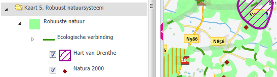
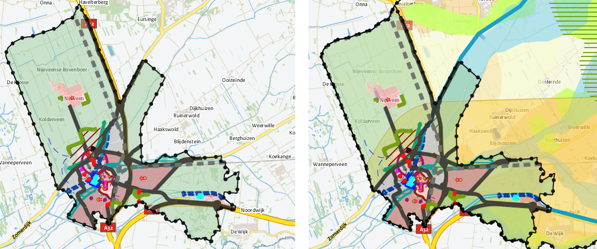

# Een digitale structuurvisie?

**In dit hoofdstuk gaan we in op de digitale structuurvisie. De mate van
‘digitaal’ heeft effect op de leesbaarheid en bruikbaarheid van de
structuurvisie. Eerst wordt ingegaan op de relatie van deze praktijkrichtlijn
met de andere onderdelen van de RO Standaarden en de Wet ruimtelijke ordening.
Tot slot is in de leeswijzer aangegeven hoe deze praktijkrichtlijn is ingedeeld.**

## Context van deze praktijkrichtlijn 

In deze praktijkrichtlijn wordt de methode van digitalisering van het
ruimtelijke instrument ‘Structuurvisie’ beschreven. Hiermee wordt zowel de
gemeentelijke, provinciale als Rijksstructuurvisie bedoeld.  
Deze praktijkrichtlijn is net als de andere praktijkrichtlijnen onder de RO
Standaarden een toelichting op de verplicht te gebruiken normen Informatiemodel
Ruimtelijke Ordening <a href='https://docs.geostandaarden.nl/ro/imro' target='_blank'>IMRO2012</a> en Standaard Toegankelijkheid Ruimtelijke
Instrumenten <a href='https://docs.geostandaarden.nl/ro/svbp' target='_blank'>SVBP2012</a>.

Het verschil met de andere praktijkrichtlijnen is dat deze praktijkrichtlijn de
maker van de structuurvisie meer bij de hand neemt daar waar de andere
praktijkrichtlijnen gericht zijn op de uitleg van de techniek. Dit komt tot
uiting door bijvoorbeeld een stappenplan en meer context voor het objectgericht
werken met een structuurvisie. Deze werkwijze kan zorgen voor een verhoogde
leesbaarheid en bruikbaarheid van de structuurvisie.
  

**Wettelijk kader**  
Sinds 1 januari 2010 kent de <a href='http://wetten.overheid.nl/BWBR0020449' target='_blank'>Wet ruimtelijke ordening</a> (Wro) voor structuurvisies
de digitaliseringsverplichting. In het <a href='http://wetten.overheid.nl/BWBR0023798' target='_blank'>Besluit ruimtelijke ordening</a> (Bro)
zijn de uitgangspunten van digitalisering nader uitgewerkt. Via de <a href='http://wetten.overheid.nl/BWBR0031829' target='_blank'>Regeling
standaarden ruimtelijke ordening</a> wordt bepaald dat bij de
digitalisering van ruimtelijke instrumenten zoals de structuurvisie gebruik moet
worden gemaakt van IMRO2012. Dit informatiemodel is de standaard voor de
beschrijving en codering van ruimtelijke instrumenten.

## Kan het ook anders? 
De objectgerichte werkwijze bij het maken van een structuurvisie, die in deze
praktijkrichtlijn wordt uitgelegd, is gelet op de vele voordelen de meest
wenselijke, maar is niet de enige manier om een structuurvisie te maken. De norm
IMRO2012 laat technisch gezien ook andere werkwijzen toe. Een voorbeeld van zo’n
alternatieve werkwijze is een Structuurvisie die bestaat uit de volgende twee
objecten:  
- het object StructuurvisiePlangebied die het gebied aangeeft waarvoor de structuurvisie geldt, met daaraan gekoppeld de gehele plantekst in pdf-formaat;  
- het object StructuurvisieGebied. IMRO2012 schrijft voor dat behalve het
    object StructuurvisiePlangebied ook het object StructuurvisieGebied minimaal
    eenmaal voorkomt in het plan. Het meest eenvoudige is om dit object qua
    begrenzing gelijk te houden aan het object StructuurvisiePlangebied en ook
    hieraan dezelfde gehele plantekst als pdf te koppelen.

Deze praktijkrichtlijn richt zich op de objectgerichte structuurvisie die in de
volgende paragraaf verder wordt toegelicht.

## Wat is een objectgerichte structuurvisie? 

*Het instrument Structuurvisie*  
Ten behoeve van een goede ruimtelijke ordening worden voor het gehele
grondgebied van de gemeente, provincie of het Rijk één of meer structuurvisies
vastgesteld waarin de hoofdzaken van het te voeren ruimtelijk beleid zijn
vastgelegd.
  

**Objectgerichte structuurvisie**  
Een structuurvisie bestaat uit tekst en geografische aanduidingen. Per
geografische aanduiding kan worden aangegeven welke kleur deze moet krijgen.
Door één of meerdere verzamelingen van geografische aanduidingen in de visie
samen af te beelden, ontstaan één of meerdere digitale kaarten.  
Door de teksten in zelfstandige onderdelen op te knippen en te koppelen aan
bijbehorende geografische aanduidingen, ontstaat interactie tussen de tekst en
de kaart. We spreken dan van een objectgerichte structuurvisie. In paragraaf 2.2
wordt ingegaan op deze zelfstandige onderdelen die de interactie tussen tekst en
kaart mogelijk maken. De onderlinge samenhang tussen deze zelfstandige
onderdelen vormt als het ware het ‘cement’ van de structuurvisie en wordt
objectenstructuur genoemd. Dit wordt nader toegelicht in paragraaf 2.3.
  

Kortom een objectgerichte structuurvisie bestaat uit de volgende drie
onderdelen:

- tekst, geordend door een inhoudsopgave (zie Figuur 1);
- geometrie (meestal door de opsteller gegroepeerd in een of meerdere kaarten, geordend door een legenda per kaart (zie Figuur 2);
- de zelfstandige onderdelen van de objectgerichte structuurvisie, geordend in een objectenstructuur die dit alles bij elkaar houdt (zie Figuur 3).
  

**Figuur 1 Inhoudsopgave**
  

**Figuur 2 Legenda**
  

**Figuur 3 Objectenstructuur**
  

## Waarom een objectgerichte structuurvisie? 
Een objectgerichte structuurvisie kenmerkt zich door integratie tussen tekst en
kaart. Dit leidt tot:
- betere leesbaarheid van de structuurvisie;
- betere bruikbaarheid van de structuurvisie in het werkproces;
- betere kwaliteitscontrole tijdens het opstellen.
  

**Betere leesbaarheid**  
Doordat in een objectgerichte structuurvisie tekst waar mogelijk aan thema’s
en/of gebieden is gekoppeld, is het voor de gebruiker makkelijk te achterhalen
waar welk beleid over welk thema geldt. De gebruiker hoeft niet de integrale
tekst door te lezen om tot voor hem of haar relevante beleid te komen. Hierbij
biedt vervolgens de aangebrachte indeling houvast bij het lezen. De visie wordt
hiermee toegankelijker.
  

**Betere bruikbaarheid**  
De bruikbaarheid van de informatie heeft betrekking op de wijze waarop
informatie uit de structuurvisie makkelijk opgenomen kan worden in
informatiesystemen, en daarmee combineerbaar en vergelijkbaar is met andere
informatie, zoals andere structuurvisies, bestemmingsplannen, provinciale
verordeningen en AMvB's. Daarnaast kan in zo'n geografisch informatiesysteem ook
een combinatie worden gemaakt met andere relevante geografische gegevens zoals
allerlei sociaal-economische kenmerken van de bevolking of
bereikbaarheidsgegevens. Hiermee kan de consistentie van het ruimtelijk beleid
tussen de verschillende bestuurslagen, maar ook de consistentie tussen de
verschillende instrumenten ingezet binnen een bestuurslaag, eenvoudiger worden
gecontroleerd en bewaakt.
  

**Figuur 4 Structuurvisie Meppel zonder (links) en met (rechts) de
Structuurvisie provincie Drenthe**
  

Een objectgerichte structuurvisie vergemakkelijkt het samenwerken, bijvoorbeeld
in de RO-keten, doordat de bestuurlijke partners of samenwerkingsorganisaties de
structuurvisie kunnen inlezen in hun geografische informatie systemen. Dit komt
doorwerking van het ruimtelijk beleid ten goede.

Tenslotte maakt een objectgerichte structuurvisie het makkelijk om onderdelen
opnieuw te gebruiken of te gebruiken als referentie bij het opstellen van andere
RO-instrumenten zoals verordeningen en bestemmingsplannen. Dit komt de
beleidsconsistentie en doorwerking van het ruimtelijk beleid ten goede.
  

**Betere kwaliteitscontrole**  
De objecten in een structuurvisie zijn een ideaal hulpmiddel om bij het
opstellen van de structuurvisie de taken te verdelen over een schrijversteam uit
verschillende disciplines zoals natuur, water en cultuurhistorie. Doordat vanaf
het begin al wordt nagedacht over de verschillende onderdelen in de tekst en op
de kaart en hun onderlinge samenhang, worden eventuele strijdigheden sneller
opgespoord.  
De ervaring leert dat structuurvisies door dit extra vangnet duidelijker worden.
  

**Gebruik van PDF-bestanden**  
Indien er PDF-bestanden worden gebruikt in een planset dan is het beter om PDF-
bestanden te gebruiken die geen flashcomponenten bevatten. Bestanden met
flashcomponenten kunnen om veiligheidsredenen niet meer in een webbrowser worden
geopend waardoor de PDF-bestanden bij raadpleging van Ruimtelijkeplannen.nl geen
inhoud bevatten.  
Controleer daarom vóór publicatie dat uw PDF-documenten geen Flashcomponenten
bevatten.

## Leeswijzer 

De opbouw van deze praktijkrichtlijn is anders dan de andere praktijkrichtlijnen
onder de RO Standaarden. In deze praktijkrichtlijn is de toelichting op de norm
IMRO gegeven in [Hoofdstuk 5](#H05). In dit [hoofdstuk 1](#H01) is aangegeven welke informatie
verplicht is op te nemen in de digitale structuurvisie.  
Verder kent deze praktijkrichtlijn de opbouw die maken van een structuurvisie
volgt. In [Hoofdstuk 2](#H02) wordt de structuur van objecten toegelicht en wordt
ingegaan op de eigenschappen en mogelijkheden van de objecten. Vervolgens is het
maken van de plantekst in [Hoofdstuk 3](#H03) toegelicht en [Hoofdstuk 4](#H04) gewijd aan het
maken van de kaarten. De technische toelichting op de norm is in [Hoofdstuk 5](#H05)
opgenomen.  
Er is een vijftal bijlagen opgenomen bij deze praktijkrichtlijn:  
- In [Bijlage 1](#B01) zijn een aantal veel gestelde vragen rondom deze praktijk en
    structuurvisies algemeen opgenomen;  
- In [Bijlage 2](#B02) zijn voor de weergave in de kaart een aantal voorbeelden van
    vlakken. Dit is op basis van de symbool codelijst;  
- [Bijlage 3](#B03) licht toe de werkwijze toe van een gedeeltelijke herziening van
    een structuurvisie;  
- [Bijlage 4](#B04) is gewijd aan de versie “geconsolideerd” ;  
- Tot slot is in [Bijlage 5](#B05) een invulhulp opgenomen.
  

Deze praktijkrichtlijn en alle andere onderdelen van de RO Standaarden zijn vindbaar en raadpleegbaar via de <a href='https://www.geonovum.nl/geo-standaarden/ro-standaarden-ruimtelijke-ordening' target='_blank'>Geonovum website, dossier RO Standaarden</a>. 
