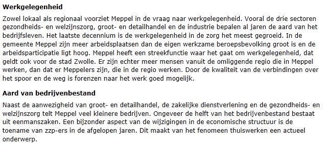
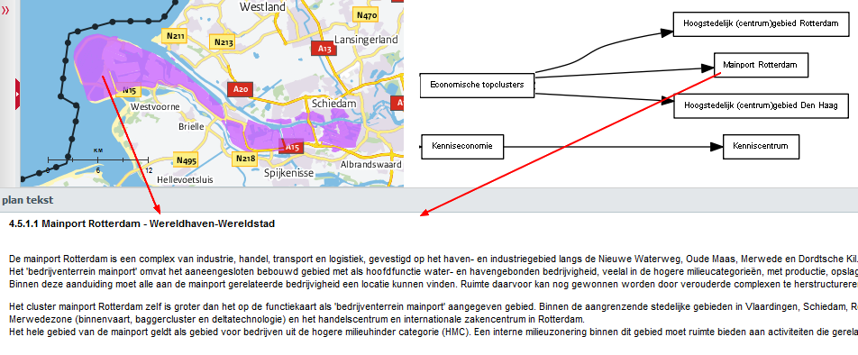
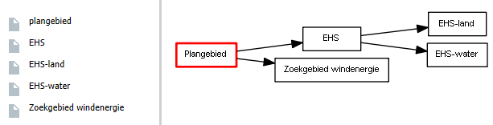
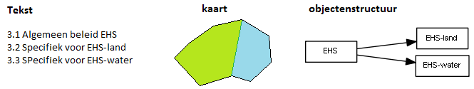
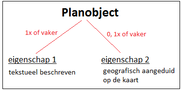
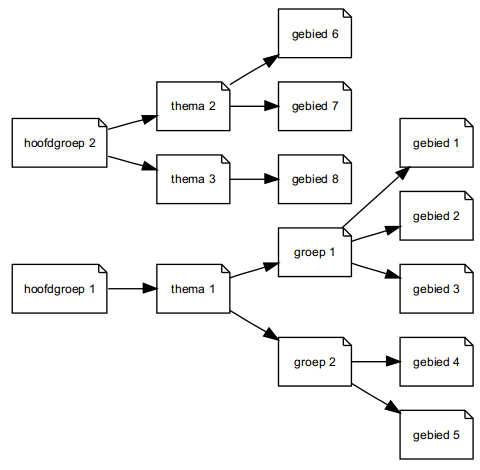
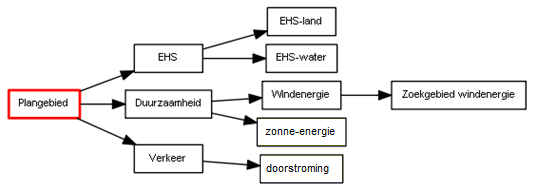
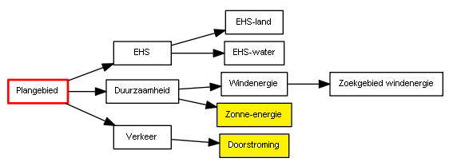
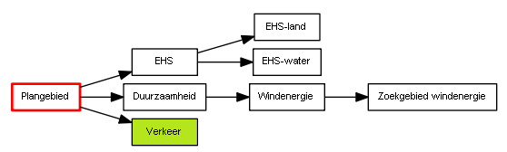

# De planobjecten en hun onderlinge relaties

**Om de praktijkrichtlijnen van de RO Standaarden onderling vergelijkbaar te
houden, wordt de term ‘planobject’ behalve voor plannen ook voor besluiten en
visies gehanteerd. In dit hoofdstuk de structuur die wordt aangebracht in de
structuurvisie toegelicht.**

## Wat zijn planobjecten?

In deze praktijkrichtlijn wordt gebruikt gemaakt van de term planobject:  
>*Een planobject is een zelfstandig, logisch onderdeel in het plan waarvan de
planopsteller wil dat deze via verschillende ingangen toegankelijk is voor de
gebruiker.*

Het desbetreffende planobject is dus niet alleen via de tekstuele ingang
toegankelijk, maar kan ook via de kaart of via andere ingang (bijvoorbeeld via
de objectenstructuur) gevonden worden. De termen ‘zelfstandig logisch onderdeel
in de tekst’ en ‘via verschillende ingangen toegankelijk’ worden respectievelijk
in paragraaf 2.1.1 en 2.1.2 nader toegelicht.

### Zelfstandig, logisch onderdeel in de tekst  
In Figuur 5 is een voorbeeld van een plantekst opgenomen, bestaande uit twee
zelfstandige, logische onderdelen (werkgelegenheid en aard van
bedrijvenbestand).

**Figuur 5 Zelfstandig, logisch onderdeel in de tekst**

### Via verschillende ingangen toegankelijk

Het is aan de opsteller van de structuurvisie om te bepalen welke onderdelen van
de tekst van de structuurvisie zowel via de tekstuele ingang als via andere
ingangen toegankelijk dienen te zijn. Het ligt voor de hand dat de planopsteller
bijvoorbeeld het tekstuele onderdeel ‘Voorwoord’ alleen via de tekstuele ingang
en niet via de kaart toegankelijk maakt. Dit wil niet zeggen dat deze tekst dan
verdwijnt. Via de tekstuele ingang is het voorwoord altijd weer terug te vinden.

De praktijk leert dat met name onderdelen uit het thematische en uit het
gebiedsgerichte deel van de plantekst via meerdere ingangen worden ontsloten en
dus worden bestempeld als planobjecten. Voorbeelden van andere ingangen zijn via
de kaart of via een objectenstructuur. In Figuur 6 is een voorbeeld opgenomen
waarbij de plantekst zowel via de kaart als via een objectenstructuur wordt
opgeroepen.

**Figuur 6 Tekst via verschillende ingangen toegankelijk**

## Objectenstructuur

### Wat is een objectenstructuur?

Een structuurvisie kan uit een groot aantal planobjecten bestaan en deze staan
niet op zich zelf. Sommige groepjes planobjecten hebben een inhoudelijke relatie
met elkaar. Het ligt het voor de hand deze objecten te groeperen in grotere
logische eenheden. Zo ontstaat een structuur in de planobjecten: een
objectenstructuur (zie Figuur 7).

**Figuur 7 Planobjecten ongeordend (links) en geordend in een objectenstructuur
(rechts)**

Het enige planobject op het hoogste niveau in de objectenstructuur is altijd het
plangebied. Dit planobject heeft als naam de aanhaaltitel van de structuurvisie,
als tekst de gehele plantekst en als geografische aanduiding het gebied waar de
structuurvisie over gaat.

<u>Let op</u>: dit gebied kan nooit groter zijn dan het gebied waar de opsteller van
de structuurvisie bevoegd gezag is.

### Wat betekent een verbinding in de objectenstructuur?

Voor alle planobjecten die onder een ander planobject hangen in de
objectenstructuur geldt dat de teksten die van toepassing zijn op het
bovenliggende planobject ook van toepassing zijn op het onderliggende
planobject. Op deze wijze kunnen de teksten die bij onderliggende planobjecten
horen, beter in de context worden geplaatst. Dit wordt geïllustreerd aan de hand
van het voorbeeld in Figuur 8.  
In dit voorbeeld bestaat de tekst uit drie zelfstandige logische onderdelen,
namelijk paragraaf 3.1 (EHS), 3.2 (EHS-land) en 3.3 (EHS-water). De
planopsteller wil deze 3 onderdelen zowel via de tekstuele ingang als via de
kaart ontsluiten en ze worden daarom beschouwd als planobjecten.  
Twee planobjecten (EHS-land en EHS-water) worden geografisch aangeduid
(respectievelijk met groen en blauw). In de objectenstructuur is aangegeven dat
het planobject EHS als onderliggende objecten EHS-land en EHS-water kent.

**Figuur 8 Overerving**

Als op het groene deel van de kaart wordt geklikt, wordt het planobject
‘EHS-land’ gevonden met daarbij de volgende verwijzingen naar tekst:

-   3.1 algemeen beleid EHS

-   3.2 Specifiek voor EHS-land

Als op het blauwe deel van de kaart wordt geklikt, wordt het planobject
‘EHS-water’ gevonden met daarbij de volgende verwijzingen naar tekst:

-   3.1 algemeen beleid EHS

-   3.3 Specifiek voor EHS-water

Uit dit voorbeeld komt het principe van overerving naar voren. Zowel het
planobject EHS-land als EHS-water erven de verwijzing naar tekst van het
bovenliggende object (EHS) over, namelijk paragraaf ‘3.1 Algemeen beleid EHS’.  
De kind-planobjecten kennen meestal eigen geografische aanduiding. Meestal zal
dit geografisch gebied vallen binnen het geografisch gebied van het
bovenliggende (moeder-)planobject. Dit hoeft echter niet.  
Indien een kind-planobject geen duidelijke geografische aanduiding kent, dan kan
een gebruiker aannemen dat de geografische aanduiding van het moeder-planobject
van toepassing is. Het heeft echter de voorkeur om waar mogelijk een duidelijke
geografische aanduiding op te nemen.

## Objectenstructuur versus inhoudsopgave en kaartlegenda

De objectenstructuur vormt het cement van een structuurvisie en groepeert de
planobjecten die op hun beurt zorgen voor de integratie tussen de teksten en
kaarten. De tekst en kaart(en) kennen ook hun eigen indeling, namelijk de
inhoudsopgave en kaartlegenda.

Het staat de opstellers van de structuurvisie vrij om de indeling van de
planobjecten (objectenstructuur), de indeling van de tekst (inhoudsopgave) en de
indeling van de kaarten (legenda) naar eigen inzicht op te stellen. Deze drie
indelingen zullen nooit exact gelijk zijn, alleen al vanwege het feit dat alle
planobjecten wel in de tekst, maar niet op de kaart hoeven voor te komen.

Wel is het zo dat hoe meer deze indelingen op elkaar lijken, des te beter
raadpleegbaar de structuurvisie wordt. Immers het integreren van tekst en kaart
zal bij een structuurvisie waarbij de inhoudsopgave gelijkenis vertoont met de
indeling van de legenda van de kaarten, gemakkelijker gaan dan bij een
structuurvisie waarin de inhoudsopgave sterk verschilt van de kaartlegenda. Voor
elke nieuwe structuurvisie kan een nieuwe, logische indeling gekozen worden.
Wanneer een structuurvisie een partiële herziening of een uitwerking is van een
eerdere structuurvisie is het handig een indeling te kiezen die past bij de
oorspronkelijke structuurvisie.

## De eigenschappen van planobjecten

Voor veel planobjecten zal gelden dat deze betrekking hebben op een bepaald
gebied en dus op een kaart zullen voorkomen. Ook is het mogelijk dat een
planobject op meerdere kaarten voorkomt (bijvoorbeeld op de visiekaart en op een
thematische kaart). Of anders verwoord: het planobject heeft als eigenschap
meerdere verwijzingen naar kaarten.

Er zijn echter ook planobjecten die wel in de tekst maar niet op de kaart
voorkomen. Deze hebben dus als eigenschap een verwijzing naar de tekst, maar
kennen geen verwijzing naar de kaart[^5]. Teksten van deze planobjecten kunnen
op de volgende manieren worden opgeroepen:

[^5]: *Objecten zonder verwijzing naar de kaart, ofwel objecten zonder geometrie,
zijn alleen mogelijk bij rijksstructuurvisies.*

-   via de tekstuele ingang;

-   via de objectenstructuur (zie Figuur 7);

-   indirect via een onderliggend planobject dat wel op de kaart staat. Via
    overerving erft het onderliggende planobject de teksten over van dit
    planobject (zie paragraaf 2.2.2).

Meestal zal een planobject op meerdere plekken in de tekst worden beschreven
(bijvoorbeeld in het thematische deel en in het gebiedsgerichte deel). Het
planobject heeft dan als eigenschap meerdere verwijzingen naar de tekst.

Samenvattend: een planobject bevat *altijd* een verwijzing naar één of meerdere
teksten en *kan* (hoeft niet) een verwijzing naar één of meerdere kaarten
bevatten (zie Figuur 9).

**Figuur 9 Eigenschappen van planobjecten**

Naast een verwijzing naar de tekst of naar één of meerdere kaarten,
kunnen/moeten er voor een planobject nog meer eigenschappen worden vastgelegd,
zoals thema, belang, rol en instrument. Door het invullen van deze
eigenschappen, wordt de bruikbaarheid van de structuurvisie vergroot. De
gebruiker kan dan bijvoorbeeld alle planobjecten selecteren die behoren tot het
thema ‘natuur’.

## Werkwijze opstellen objectgerichte structuurvisie

In deze paragraaf wordt een eenduidige werkwijze beschreven om een
objectgerichte structuurvisie inhoudelijk goed op te zetten. Er zijn echter meer
manieren mogelijk.

### Stap 1: Opstellen concept objectenstructuur

Stap 1A en 1B kunnen ook in omgekeerde volgorde worden uitgevoerd.

*Stap 1A - Thema’s*  
Benoem de thema’s die in de structuurvisie aan de orde komen (geef ze namen) en
beschrijf de inhoud met enkele steekwoorden. Maak hierbij gebruik van de
themalijst. Dit resulteert in de eerste planobjecten van de structuurvisie.

*Stap 1B - Gebieden*  
Geef alle gebieden waarvoor beleid wordt gemaakt (of die ter toelichting dienen
op het beleid) aan op de kaart. Geef die gebieden namen en beschrijf het beleid
met enkele steekwoorden.

*Stap 1C - Koppelen gebieden aan thema’s*  
Deel de gebieden uit stap 1B toe aan de thema’s uit stap 1A. Een gebied kan bij
meer thema's horen. Hierdoor ontstaat een eerste versie van de
objectenstructuur.

*Stap 1D - Groeperen van planobjecten*  
Verzamel planobjecten in groepen die beleid met elkaar gemeen hebben zodat
algemenere beleidsuitspraken in die groepen ook kunnen gelden voor de
onderliggende objecten. Beschouw deze groepen ook weer als planobjecten en geef
deze unieke namen. De objectenstructuur is nu nog verder gegroeid.  
Benoem het beleid in enkele steekwoorden (eventueel via verwijzingen naar al
geschreven teksten) en bepaal of er sprake is van een begrenzing door middel van
een omschrijving of een weergave op kaart.  
Vaak is het handig om in stap 1C en 1D te werken met een schematische weergave
in blokjes zoals in Figuur 10 (gebruik daarbij sprekende namen in plaats van
“thema 2” of gebied 4”).

**Figuur 10 Groeperen in planobjecten**

Op deze wijze ontstaat de eerste globale versie van de objectenstructuur die als
startpunt wordt gebruikt voor zowel het opstellen van de eerste teksten als het
maken van de eerste kaart(en). Het spreekt voor zich dat er een wisselwerking is
tussen het schrijven van teksten, het opstellen van de kaarten en het opstellen
van de objectenstructuur.

### Stap 2: Opstellen concept inhoudsopgave en de eerste teksten

Schrijf vervolgens alle teksten die horen bij de planobjecten, en zet vervolgens
die teksten op een logische volgorde zodat er een lopende tekst ontstaat: de
tekst van de digitale structuurvisie.  
Vaak verandert gedurende het schrijfproces de inhoud van een structuurvisie en
daarmee ook de bij de planobjecten horende teksten. Dit komt mede doordat
tijdens het schrijven het beleid wordt aangescherpt. Vaak is het bij zo'n
wijzigende tekst nodig om de objectenstructuur aan te passen en/ of de
geografische duiding van de objecten. Voor meer informatie over het opstellen
van de teksten, zie Hoofdstuk 3.

### Stap 3: Opstellen concept kaart(en)
Groepeer de planobjecten met een geografische aanduiding in één of meerdere
\`kaarten\` en kies de gebruikte symbolen en kleuren.
>Wat is een kaart?  
>In een digitale structuurvisie wordt met de term ‘kaart’ bedoeld de verzameling planobjecten waarvan de planopsteller wil dat deze samen worden getoond.

<u>Let op</u>: de verbeeldingsmogelijkheden (kaartkleuren en symbolen) van digitale
structuurvisies zijn relatief beperkt. Wel is het mogelijk om een geheel
transparante kleur mee te geven. Hierdoor wordt het planobject wel gevonden als
op de kaart wordt geklikt, maar is het niet zichtbaar. Dit is met name handig
voor planobjecten waarvan de begrenzing zeer gevoelig ligt, maar die men toch
wil opnemen op de kaart.

<u>Let wel</u>: een gebruiker die de structuurvisie inleest in een geografisch
informatiesysteem ziet de begrenzing natuurlijk zoals hij of zij dat zelf wil.
Voor meer informatie over het opstellen van de kaarten, zie Hoofdstuk 4.

### Stap 4: Bepalen type van ieder planobject

Omdat planobjecten heel verschillend kunnen zijn, dient eerst te worden bepaald
tot welk type (ook wel klasse genoemd) een bepaald planobject behoort. Per type
(klasse) is aangegeven welke eigenschappen moeten/mogen worden ingevuld. Het
gaat hierbij om eigenschappen zoals thema, belang, rol en instrument.  
In Bijlage 5 is een vragenlijst opgenomen waarmee kan worden bepaald tot welk
type (klasse) een bepaald planobject uit de objectenstructuur behoort. Om de
werking van deze vragenlijst toe te lichten, is deze toegepast op het voorbeeld
in Figuur 11. Het voorbeeld betreft een provinciale structuurvisie.

**Figuur 11 Voorbeeld objectenstructuur**

In Tabel 1 zijn voor ieder object alle vragen uit de vragenlijst van de
invulhulp van Bijlage 5 opgenomen.

**Tabel 1 Toepassing vragenlijst uit Bijlage 5**

<table id="d4e41" style="width: 100%;"><caption>Toepassing vragenlijst uit Bijlage 5</caption><colgroup><col id="col1" style="width: 21.584948688711517%;"></col><col id="col2" style="width: 30.136830102622575%;"></col><col id="col3" style="width: 20.433295324971493%;"></col><col id="col4" style="width: 27.844925883694412%;"></col></colgroup><thead valign="top"><tr><th align="left" style="border-top: 0.5pt solid #000000; border-left: 0.5pt solid #000000; border-bottom: 0.5pt solid #000000; border-right: 0.5pt solid #000000;">
<b>Planobject</b>
</th><th align="left" style="border-top: 0.5pt solid #000000; border-left: 0.5pt solid #000000; border-bottom: 0.5pt solid #000000; border-right: 0.5pt solid #000000;">
<b>Toelichting</b>
</th><th align="left" style="border-top: 0.5pt solid #000000; border-left: 0.5pt solid #000000; border-bottom: 0.5pt solid #000000; border-right: 0.5pt solid #000000;">
<b>Vragenlijst</b>
</th><th align="left" style="border-top: 0.5pt solid #000000; border-left: 0.5pt solid #000000; border-bottom: 0.5pt solid #000000; border-right: 0.5pt solid #000000;">
<b>Type (klasse)</b>
</th></tr></thead><tbody valign="top"><tr><td align="left" style="border-top: 0.5pt solid #000000; border-left: 0.5pt solid #000000; border-bottom: 0.5pt solid #000000; border-right: 0.5pt solid #000000; background-color: none;">
EHS
</td><td align="left" style="border-top: 0.5pt solid #000000; border-left: 0.5pt solid #000000; border-bottom: 0.5pt solid #000000; border-right: 0.5pt solid #000000; background-color: none;">
Betreft beleidstekst. Het planobject wordt geografisch aangeduid.
</td><td align="left" style="border-top: 0.5pt solid #000000; border-left: 0.5pt solid #000000; border-bottom: 0.5pt solid #000000; border-right: 0.5pt solid #000000; background-color: none;">
vraag 1: JA

vraag 2: JA

vraag 3: JA
</td><td align="left" style="border-top: 0.5pt solid #000000; border-left: 0.5pt solid #000000; border-bottom: 0.5pt solid #000000; border-right: 0.5pt solid #000000; background-color: none;">
Structuurvisiecomplex. invulariant A
</td></tr><tr><td align="left" style="border-top: 0.5pt solid #000000; border-left: 0.5pt solid #000000; border-bottom: 0.5pt solid #000000; border-right: 0.5pt solid #000000; background-color: none;">
Duurzaamheid
</td><td align="left" style="border-top: 0.5pt solid #000000; border-left: 0.5pt solid #000000; border-bottom: 0.5pt solid #000000; border-right: 0.5pt solid #000000; background-color: none;">
Betreft beleidstekst.  Het planobject wordt niet geografisch aangeduid en ook niet als kopje in de legenda opgenomen.
</td><td align="left" style="border-top: 0.5pt solid #000000; border-left: 0.5pt solid #000000; border-bottom: 0.5pt solid #000000; border-right: 0.5pt solid #000000; background-color: none;">
vraag 1: JA

vraag 2: JA

vraag 3: NEE

vraag 4: NEE
</td><td align="left" style="border-top: 0.5pt solid #000000; border-left: 0.5pt solid #000000; border-bottom: 0.5pt solid #000000; border-right: 0.5pt solid #000000; background-color: none;">
Structuurvisiecomplex, invulvariant C
</td></tr><tr><td align="left" style="border-top: 0.5pt solid #000000; border-left: 0.5pt solid #000000; border-bottom: 0.5pt solid #000000; border-right: 0.5pt solid #000000; background-color: none;">
Verkeer
</td><td align="left" style="border-top: 0.5pt solid #000000; border-left: 0.5pt solid #000000; border-bottom: 0.5pt solid #000000; border-right: 0.5pt solid #000000; background-color: none;">
Betreft beleidstekst.  Het planobject wordt niet geografisch aangeduid en ook niet als kopje in de legenda opgenomen.
</td><td align="left" style="border-top: 0.5pt solid #000000; border-left: 0.5pt solid #000000; border-bottom: 0.5pt solid #000000; border-right: 0.5pt solid #000000; background-color: none;">
vraag 1: JA

vraag 2: JA

vraag 3: NEE

vraag 4: NEE
</td><td align="left" style="border-top: 0.5pt solid #000000; border-left: 0.5pt solid #000000; border-bottom: 0.5pt solid #000000; border-right: 0.5pt solid #000000; background-color: none;">
Structuurvisiecomplex, invulvariant C
</td></tr><tr><td align="left" style="border-top: 0.5pt solid #000000; border-left: 0.5pt solid #000000; border-bottom: 0.5pt solid #000000; border-right: 0.5pt solid #000000; background-color: none;">
EHS-land
</td><td align="left" style="border-top: 0.5pt solid #000000; border-left: 0.5pt solid #000000; border-bottom: 0.5pt solid #000000; border-right: 0.5pt solid #000000; background-color: none;">
Betreft beleidstekst. Het planobject wordt geografisch aangeduid.
</td><td align="left" style="border-top: 0.5pt solid #000000; border-left: 0.5pt solid #000000; border-bottom: 0.5pt solid #000000; border-right: 0.5pt solid #000000; background-color: none;">
vraag 1: JA

vraag 2: NEE

vraag 5: JA
</td><td align="left" style="border-top: 0.5pt solid #000000; border-left: 0.5pt solid #000000; border-bottom: 0.5pt solid #000000; border-right: 0.5pt solid #000000; background-color: none;">
Structuurvisiegebied, invulvariant A
</td></tr><tr><td align="left" style="border-top: 0.5pt solid #000000; border-left: 0.5pt solid #000000; border-bottom: 0.5pt solid #000000; border-right: 0.5pt solid #000000; background-color: none;">
EHS-water
</td><td align="left" style="border-top: 0.5pt solid #000000; border-left: 0.5pt solid #000000; border-bottom: 0.5pt solid #000000; border-right: 0.5pt solid #000000; background-color: none;">
Betreft beleidstekst. Het planobject wordt geografisch aangeduid.
</td><td align="left" style="border-top: 0.5pt solid #000000; border-left: 0.5pt solid #000000; border-bottom: 0.5pt solid #000000; border-right: 0.5pt solid #000000; background-color: none;">
vraag 1: JA

vraag 2: NEE

vraag 5: JA
</td><td align="left" style="border-top: 0.5pt solid #000000; border-left: 0.5pt solid #000000; border-bottom: 0.5pt solid #000000; border-right: 0.5pt solid #000000; background-color: none;">
Structuurvisiegebied, invulvariant A
</td></tr><tr><td align="left" style="border-top: 0.5pt solid #000000; border-left: 0.5pt solid #000000; border-bottom: 0.5pt solid #000000; border-right: 0.5pt solid #000000; background-color: none;">
Windenergie
</td><td align="left" style="border-top: 0.5pt solid #000000; border-left: 0.5pt solid #000000; border-bottom: 0.5pt solid #000000; border-right: 0.5pt solid #000000; background-color: none;">
Betreft beleidstekst.  Het planobject wordt niet geografisch aangeduid en ook niet als kopje in de legenda opgenomen.
</td><td align="left" style="border-top: 0.5pt solid #000000; border-left: 0.5pt solid #000000; border-bottom: 0.5pt solid #000000; border-right: 0.5pt solid #000000; background-color: none;">
vraag 1: JA

vraag 2: JA

vraag 3: NEE

vraag 4: NEE
</td><td align="left" style="border-top: 0.5pt solid #000000; border-left: 0.5pt solid #000000; border-bottom: 0.5pt solid #000000; border-right: 0.5pt solid #000000; background-color: none;">
Structuurvisiecomplex, invulvariant C
</td></tr><tr><td align="left" style="border-top: 0.5pt solid #000000; border-left: 0.5pt solid #000000; border-bottom: 0.5pt solid #000000; border-right: 0.5pt solid #000000; background-color: none;">
Zonne-energie
</td><td align="left" style="border-top: 0.5pt solid #000000; border-left: 0.5pt solid #000000; border-bottom: 0.5pt solid #000000; border-right: 0.5pt solid #000000; background-color: none;">
Betreft beleidstekst.  Het planobject wordt niet geografisch aangeduid en ook niet als kopje in de legenda opgenomen.
</td><td align="left" style="border-top: 0.5pt solid #000000; border-left: 0.5pt solid #000000; border-bottom: 0.5pt solid #000000; border-right: 0.5pt solid #000000; background-color: none;">
vraag 1: JA

vraag 2: NEE

vraag 5: NEE

vraag 6: NEE
</td><td align="left" style="border-top: 0.5pt solid #000000; border-left: 0.5pt solid #000000; border-bottom: 0.5pt solid #000000; border-right: 0.5pt solid #000000; background-color: none;">
Niet te coderen
</td></tr><tr><td align="left" style="border-top: 0.5pt solid #000000; border-left: 0.5pt solid #000000; border-bottom: 0.5pt solid #000000; border-right: 0.5pt solid #000000; background-color: none;">
Doorstroming
</td><td align="left" style="border-top: 0.5pt solid #000000; border-left: 0.5pt solid #000000; border-bottom: 0.5pt solid #000000; border-right: 0.5pt solid #000000; background-color: none;">
Betreft beleidstekst.  Het planobject wordt niet geografisch aangeduid en ook niet als kopje in de legenda opgenomen.
</td><td align="left" style="border-top: 0.5pt solid #000000; border-left: 0.5pt solid #000000; border-bottom: 0.5pt solid #000000; border-right: 0.5pt solid #000000; background-color: none;">
vraag 1: JA

vraag 2: NEE

vraag 5: NEE

vraag 6: NEE
</td><td align="left" style="border-top: 0.5pt solid #000000; border-left: 0.5pt solid #000000; border-bottom: 0.5pt solid #000000; border-right: 0.5pt solid #000000; background-color: none;">
Niet te coderen
</td></tr><tr><td align="left" style="border-top: 0.5pt solid #000000; border-left: 0.5pt solid #000000; border-bottom: 0.5pt solid #000000; border-right: 0.5pt solid #000000; background-color: none;">
Zoekgebied windenergie
</td><td align="left" style="border-top: 0.5pt solid #000000; border-left: 0.5pt solid #000000; border-bottom: 0.5pt solid #000000; border-right: 0.5pt solid #000000; background-color: none;">
Betreft beleidstekst. Het planobject wordt geografisch aangeduid.
</td><td align="left" style="border-top: 0.5pt solid #000000; border-left: 0.5pt solid #000000; border-bottom: 0.5pt solid #000000; border-right: 0.5pt solid #000000; background-color: none;">
vraag 1: JA

vraag 2: NEE

vraag 5: JA
</td><td align="left" style="border-top: 0.5pt solid #000000; border-left: 0.5pt solid #000000; border-bottom: 0.5pt solid #000000; border-right: 0.5pt solid #000000; background-color: none;">
Structuurvisiegebied, invulvariant A
</td></tr></tbody></table>

### Stap 5: Afronden van de tekst

Voeg overige teksten toe als voorwoord, begrippenlijst, etc. Deze teksten hoeven
niet aan een van de objecten uit voorgaande stappen te worden toegevoegd. Ze
horen 'vanzelf' bij het plan. Pas wel op dat er geen beleid staat in een van die
teksten, want dan hoort zo'n tekst wel bij een van de objecten. Neem ook nog
alle plaatjes op. Benoem de relaties met overige plannen.

### Stap 6: Controle

Uit stap 4 kan volgen dat sommige planobjecten niet kunnen worden gecodeerd. In
het voorbeeld in Figuur 12 zijn deze geel weergegeven.

**Figuur 12 Planobjecten die niet kunnen worden gecodeerd**

Verwijder deze planobjecten uit de objectenstructuur. Zorg er wel voor dat de
teksten van de verwijderde objecten bij een ander (meestal bovenliggend) object
terecht komen.

Bekijk vervolgens of er planobjecten voorkomen die behoren tot het type
Structuurvisiecomplex A, B, C, D, E of F (zie bijlage voor uitleg) en geen
onderliggende planobjecten hebben. In het voorbeeld gaat het om het object
‘verkeer’ (in Figuur 13 in groen weergegeven). Omdat alle onderliggende objecten
onder dit object zijn verwijderd, dient voor dit object opnieuw te worden
bepaald tot welk type deze behoort (zie Tabel 2).

**Figuur 13 Planobjecten van het type Structuurvisiecomplex zonder onderliggende
planobjecten**

In Tabel 2 zijn voor ieder object alle vragen uit de vragenlijst van de
invulhulp van Bijlage 5 opgenomen.

**Tabel 2 Doorlopen stappen in het stappenplan uit Bijlage 5**

<table id="d4e416" style="width: 100%;"><caption>Doorlopen stappen in het stappenplan uit Bijlage 5</caption><colgroup><col id="col1" style="width: 21.76738882554162%;"></col><col id="col2" style="width: 28.346636259977192%;"></col><col id="col3" style="width: 22.91904218928164%;"></col><col id="col4" style="width: 26.966932725199545%;"></col></colgroup><thead valign="top"><tr><th align="left" style="border-top: 0.5pt solid #000000; border-left: 0.5pt solid #000000; border-bottom: 0.5pt solid #000000; border-right: 0.5pt solid #000000;">
Planobject
</th><th align="left" style="border-top: 0.5pt solid #000000; border-left: 0.5pt solid #000000; border-bottom: 0.5pt solid #000000; border-right: 0.5pt solid #000000;">
Toelichting
</th><th align="left" style="border-top: 0.5pt solid #000000; border-left: 0.5pt solid #000000; border-bottom: 0.5pt solid #000000; border-right: 0.5pt solid #000000;">
Vragenlijst
</th><th align="left" style="border-top: 0.5pt solid #000000; border-left: 0.5pt solid #000000; border-bottom: 0.5pt solid #000000; border-right: 0.5pt solid #000000;">
Type (klasse)
</th></tr></thead><tbody valign="top"><tr><td align="left" style="border-top: 0.5pt solid #000000; border-left: 0.5pt solid #000000; border-bottom: 0.5pt solid #000000; border-right: 0.5pt solid #000000; background-color: none;">
Verkeer
</td><td align="left" style="border-top: 0.5pt solid #000000; border-left: 0.5pt solid #000000; border-bottom: 0.5pt solid #000000; border-right: 0.5pt solid #000000; background-color: none;">
Betreft beleidstekst.  Het planobject wordt niet geografisch aangeduid en ook niet als kopje in de legenda opgenomen
</td><td align="left" style="border-top: 0.5pt solid #000000; border-left: 0.5pt solid #000000; border-bottom: 0.5pt solid #000000; border-right: 0.5pt solid #000000; background-color: none;">
vraag 1: JA

vraag 2: NEE

vraag 5: NEE

vraag 6: NEE
</td><td align="left" style="border-top: 0.5pt solid #000000; border-left: 0.5pt solid #000000; border-bottom: 0.5pt solid #000000; border-right: 0.5pt solid #000000; background-color: none;">
Niet te coderen
</td></tr></tbody></table>

Omdat het object ‘verkeer’ niet te coderen is, wordt deze ook verwijderd. Kijk
wederom of er planobjecten voorkomen van het type Structuurvisiecomplex A, B, C,
D, E of F zonder onderliggende planobjecten. Herhaal dit totdat deze niet meer
voorkomen.

Daarnaast is het aan te bevelen om de uiteindelijke structuur van het plan goed
te controleren. Een van de hulpmiddelen daarbij is om een planobject te nemen,
en dan alle tekst te lezen van dat object en alle bovenliggende planobjecten.
Dan moet, vanwege het principe van overerving (zie paragraaf 2.2.2) alle voor
dat van planobject van toepassing zijnde beleid (en eventuele toelichting op dit
beleid) zijn gelezen. Is dat niet het geval, dan klopt de structuur niet.
Herhaal deze test een aantal malen voor verschillende planobjecten.

## Resultaat

Zoals aangegeven in paragraaf 1.3 bestaat een objectgerichte structuurvisie uit
drie onderdelen:  
-   tekst, geordend door een inhoudsopgave;
-   geometrie (meestal door de opsteller gegroepeerd in een of meerdere kaarten,
    geordend door een legenda per kaart);
-   de zelfstandige onderdelen van de objectgerichte structuurvisie, geordend in
    een objectenstructuur die dit alles bij elkaar houdt.
Volgens de <a href='https://docs.geostandaarden.nl/ro/stri' target='_blank'>Standaard Toegankelijkheid Ruimtelijke Instrumenten (STRI2012)</a>
dient de geometrie en de objectenstructuur samen in één bestand in gml-formaat
ter beschikking te worden gesteld. Voor het beschikbaar stellen van de teksten
biedt de STRI2012 de volgende twee opties toegestaan:

*Mogelijkheid 1: xml-formaat*  
In deze optie wordt de tekst beschikbaar gesteld conform het <li><a href='https://docs.geostandaarden.nl/ro/imropt/' target='_blank'>Informatiemodel Ruimtelijke Ordening Planteksten 2012 (IMROPT2012)</a>. Dit betekent dat in
ieder geval de regels, de toelichting en/of het beleids-/besluitdocument
beschikbaar worden gesteld in XML formaat. Bijlagen kunnen ofwel in dit zelfde
XML formaat beschikbaar worden gesteld, ofwel in separate bronbestanden in
HTML-, XHTML- of PDF-formaat.

*Mogelijkheid 2: html-formaat*  
In deze optie wordt de tekst in HTML-, XHTML- of PDF-formaat beschikbaar
gesteld.

Voordeel van de eerste optie (xml-formaat) is dat ‘de computer’ van ieder
tekstobject weet waar deze begint en eindigt. Het is hierdoor mogelijk om in
viewers bepaalde tekstobjecten te selecteren of ‘highlighten’ (te markeren met
een bepaalde kleur). Dit is met planteksten in html-formaat niet mogelijk.

Het resultaat vormt een set van bestanden (zie hoofdstuk 2 van de STRI2012) die
langs elektronische weg beschikbaar dienen te worden gesteld (zie hoofdstuk 5
van de STRI2012).
