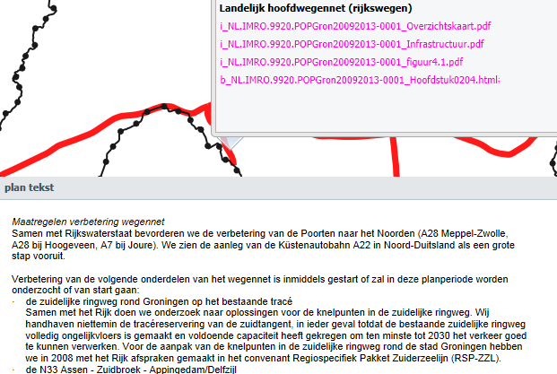

# Tekstueel aanduiden van planobjecten

**Vanuit de RO Standaarden worden er geen eisen gesteld aan de inhoud of de
structuur van structuurvisieteksten. Wel worden er eisen gesteld aan het
bestandsformaat waarin de tekst beschikbaar wordt gesteld. Zo is het niet
toegestaan om bijvoorbeeld de tekst als een MSWord document aan te bieden. Welke
formaten wel zijn toegestaan conform de STRI2012 is in [paragraaf 2.6](#resultaat) toegelicht.**

## Objectgericht schrijven

### Waarom objectgericht schrijven?  
Het feit dat er geen eisen worden gesteld aan de structuur van de teksten, kan
leiden tot digitaal slecht raadpleegbare plannen. Zo kan de tekst over een
bepaald planobject versnipperd zijn op vele plekken in de tekst. Dit heeft als
gevolg dat als de gebruiker op een kaart op dit object klikt, hij of zij moet
kiezen uit vele verwijzingen naar de tekst.

Ook kan een stuk tekst gaan over twee planobjecten. Het is voor de gebruiker dan
niet meteen duidelijk wat er geldt voor het planobject waar hij of zij op heeft
geklikt; zie voorbeeld in Figuur 14.
  

**Figuur 14 De snelweg A28 aangeklikt, teksten over allerlei snelwegen**
  

Objectgericht schrijven is:  
- werken met een heldere structuur;
- de teksten opknippen in stukken zoals hoofdstukken, paragrafen e.d..

Uitgangspunt is dat ieder stuk tekst zelfstandig leesbaar is, een titel heeft,
begint met een hoofdletter en eindigt met een punt. Dit helpt de lezer, zeker
als de plannen via het internet worden ontsloten waarbij vaak fragmentarisch
door de tekst kan worden genavigeerd.

### Overerving  
Zoals in [paragraaf 2.2.2](#wat-betekent-een-verbinding-in-de-objectenstructuur) is uitgelegd, geldt voor alle planobjecten die onder
een ander planobject hangen in de objectenstructuur dat de teksten die van
toepassing zijn op het bovenliggende planobject ook van toepassing zijn op het
onderliggende planobject. Op deze wijze kunnen de teksten die bij onderliggende
planobjecten horen, beter in de context worden geplaatst.

## Schrijven voor het web  
Uit onderzoek het van Jakob Nielsen, How People Read on the Web: The Eyetracking Evidence,  is gebleken dat gebruikers bij het lezen van teksten op een
beeldscherm meestal links bovenaan het scherm beginnen. Iedere volgende regel
wordt steeds eerder afgebroken en uiteindelijk scant de lezer de linkerkant van
de tekst naar beneden. Dit leidt tot een soort F-patroon (zie Figuur 15):
  

**Figuur 15 F-patroon bij lezen vanaf het beeldscherm**
  

Omdat de digitale structuurvisie ook vanaf het beeldscherm zal worden gelezen,
heeft dit onderzoek ook gevolgen voor het opstellen van structuurvisieteksten.
Belangrijk is als opsteller van de tekst te realiseren dat de gebruiker hooguit
de eerste twee alinea’s van een hoofdstuk of paragraaf zullen lezen, waarbij ze
waarschijnlijk meer zullen lezen van de eerste dan van de tweede alinea. In deze
alinea’s moet de belangrijkste boodschap staan.
