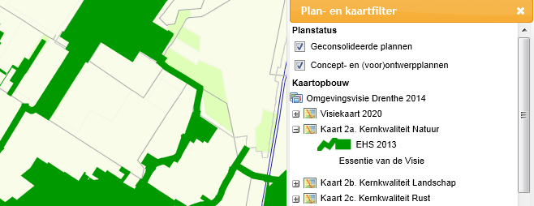
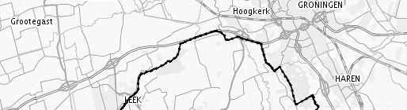
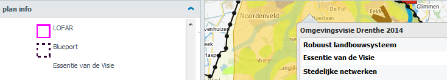
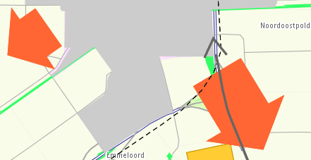
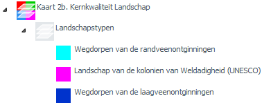

# Geografisch aanduiden van planobjecten: kaarten

**De verbeelding van de structuurvisie is een belangrijk onderdeel. Het gaat bij
structuurvisies niet alleen om de inhoud, maar ook om een bepaalde visie over te
brengen. De verbeelding, in één of meerdere kaarten, is hierbij een handig
instrument. Het is van belang hierbij in het oog te houden dat de wijze waarop
een kaart wordt getoond qua kleur en volgorde van de planobjecten per viewer kan
verschillen.**

## Kaart(en)

### Kaartnaam en volgorde  
Een structuurvisie kan één of meerdere kaarten bevatten. Via het attribuut
*cartografieInfo* dat bij een planobject kan worden ingevuld, kan de kaartnaam
en het kaartnummer worden aangegeven.  
Op basis van de ingevulde kaartnamen en kaartnummers bij ieder planobject kan
een viewer bepalen welke kaarten en in welke volgorde moeten worden getoond.  
Iedere kaart bevat dus minimaal:  
- één planobject waarmee de kaartnaam en kaartnummer van de kaart kan worden
    bepaald;
- het plangebied van de structuurvisie.
Voor het plangebied geldt dat niet hoeft te worden aangegeven op welke kaart
deze voorkomt.
  

Als kaartnaam dient voor iedere kaart een unieke naam te worden ingevuld. Het
kaartnummer is een oplopend nummer waarmee de opsteller van de structuurvisie de
volgorde waarin hij of zij de kaarten in een viewer wil laten tonen, aangeeft.
Het kaartnummer is een heel getal beginnend met 1 en oplopend. Kaartnummer 1
wordt in de viewer als hoofdkaart beschouwd. Als de structuurvisie een
visiekaart bevat, dan is het gebruikelijk om deze als hoofdkaart in te stellen
en dus kaartnummer 1 mee te geven.

### Planobjecten op één of meerdere kaarten  
Een planobject kan op één of meerdere kaarten voorkomen. Als een planobject op
meerdere kaarten wordt getoond, wil dit niet zeggen dat dit planobject ook in de
objectenstructuur meerdere keren moet voorkomen. Het attribuut *cartografieInfo*
kan per planobject meerdere keren worden gebruikt. In het voorbeeld in Tabel 3
is aangegeven hoe het planobject ‘EHS 2013’ op zowel kaart 2a als kaart 5 kan
worden opgenomen. Indien gewenst kan de kleur van het planobject per kaart
verschillen, alhoewel dit verwarrend kan werken voor de gebruiker en om die
reden beter kan worden vermeden.

<table id="d4e507" style="width: 100%;"><caption>Attribuut cartografieInfo bij een planobject dat op twee kaarten voorkomt</caption><colgroup><col id="col1" style="width: 8.222504914999423%;"></col><col id="col2" style="width: 21.31375043367642%;"></col><col id="col3" style="width: 70.46374465132416%;"></col></colgroup><tbody valign="top"><tr><td align="left" style="border-top: 0.5pt solid #000000; border-left: 0.5pt solid #000000; border-bottom: 0pt none #; border-right: 0.5pt solid #000000; background-color: #auto;" colspan="3">
<i>Attribuut ‘cartografieInfo’ behorende bij het planobject ‘EHS 2013’</i>
</td></tr><tr><td align="left" style="border-top: 0pt none #; border-left: 0.5pt solid #000000; border-bottom: 0pt none #000000; border-right: 0pt none #; background-color: #auto;" rowspan="2"></td><td align="left" style="border-top: 0.5pt solid #000000; border-left: 0.5pt solid #000000; border-bottom: 0.5pt solid #000000; border-right: 0.5pt solid #000000; background-color: #auto;">
Kaartnummer

kaartnaam

symboolcode
</td><td align="left" style="border-top: 0.5pt solid #000000; border-left: 0.5pt solid #000000; border-bottom: 0.5pt solid #000000; border-right: 0.5pt solid #000000; background-color: #auto;">
2

Kaart 2a. Kernkwaliteit Natuur

S210
</td></tr><tr><td align="left" style="border-top: 0.5pt solid #000000; border-left: 0.5pt solid #000000; border-bottom: 0.5pt solid #000000; border-right: 0.5pt solid #000000; background-color: #auto;">
Kaartnummer

kaartnaam

symboolcode
</td><td align="left" style="border-top: 0.5pt solid #000000; border-left: 0.5pt solid #000000; border-bottom: 0.5pt solid #000000; border-right: 0.5pt solid #000000; background-color: #auto;">
10

Kaart 5. Robuust natuursysteem

S211
</td></tr></tbody></table>

## Weergave van planobjecten op de kaart  
In deze paragraaf wordt ingegaan op:  
-   de vorm waarin het planobject wordt weergegeven op de kaart (zie [paragraaf 4.2.1](#vorm-van-de-planobjecten));
-   de volgorde waarin de planobjecten worden getoond op de kaart (zie [paragraaf 4.2.2](#volgorde-van-de-planobjecten-op-de-kaart));
-   de opbouw van de legenda van iedere kaart (zie [paragraaf 4.3.1](#volgorde-planobjecten-in-de-legenda)).

### Vorm van de planobjecten  
Het plangebied wordt altijd weergegeven met een contour. Voor de andere
planobjecten geldt dat ze:  
-   geen geometrie kunnen bevatten;
-   als vlak op de kaart worden weergegeven;
-   als lijn op de kaart worden weergegeven;
-   als punt op de kaart worden weergegeven;
-   als een combinatie van vlakken, lijnen en/of punten worden weergegeven. Een
    voorbeeld van een combinatie van vlakken en lijnen is opgenomen in Figuur
    16, waar het planobject ‘EHS 2013’ is weergegeven met zowel vlakken als
    lijnen.
  

**Figuur 16 Een planobject weergegeven met een combinatie van een vlak en een
lijn**
  

Het wordt aangeraden om waar mogelijk punten en lijnen te vermijden en zoveel
mogelijk met vlakken te werken.
  

**Kleur/patroon van vlakken**  
Het plangebied wordt op iedere kaart op dezelfde wijze (conform de plangrens in
de SVBP2012) weergegeven (zie Figuur 17).
  

**Figuur 17 Verbeelding van het plangebied**
  

Voor alle andere planobjecten die als vlak zijn weergegeven, kan de opsteller
van de structuurvisie zelf bepalen hoe deze wordt weergegeven. Wel moet worden
gekozen uit een vaste lijst met symboolcodes.

Vlakken kunnen op verschillende manieren worden weergegeven. In Bijlage 2 zijn
deze weergave mogelijkheden voor vlakken beschreven. Per mogelijkheid zijn
meerdere kleuren mogelijk.
  

*Verborgen objecten*  
Planobjecten die niet zichtbaar, maar wel opvraagbaar moeten zijn in het
kaartbeeld (zogenaamde verborgen objecten) worden gecodeerd met een symboolcode
met een 100% transparante vulling (code ES133).
  

<u>Let op</u>: dit planobject wordt wel getoond in de legenda (zie planobject
‘Essentie van de Visie’ in Figuur 18).  
<u>Let op</u>: een ontvanger van het bestand is vrij om een eigen verbeelding in zijn eigen omgeving toe te passen, waardoor
het object daar wel getoond kan worden.
  

**Figuur 18 Verborgen objecten**
  

**Vorm en kleur/patroon van lijnen**  
Als een planobject (deels) als lijn is ingetekend, dan dient te worden
aangegeven door welk type lijn, met welke lijndikte en met welke lijnkleur de
lijn moet worden verbeeld.  
Qua lijntype kan worden gekozen tussen: 

Per mogelijkheid zijn meerdere lijndiktes en kleuren mogelijk.
  

**Vorm en kleur/patroon van punten**  
Als een planobject (deels) als punt is ingetekend, dan dient te worden
aangegeven door welk symbool, met welke grootte en met welke kleur het punt moet
worden verbeeld.  
Qua typering kan worden gekozen uit abstracte symbolen: 

  

Bij het plaatsen van het puntsymbool kan de grootte worden meegegeven. Dit heeft
als consequentie dat iedere meegegeven grootte van het puntsymbool mee schaalt
bij het inzoomen als de structuurvisie wordt geraadpleegd in een viewer.   
Er is ook de mogelijkheid om als opsteller zelf een figuratief symbool te
tekenen als vlak. Dit betekent dat het vlak als symbool geïnterpreteerd moet
worden en geen relatie heeft met de begrenzing van het planobject in de
werkelijkheid. Het vlak wordt gebruikt om een figuur af te beelden.
  
  
Bij de weergave van dit getekende figuur kan dan worden gekozen uit de
weergavemogelijkheden van vlakken. Bij de nauwkeurigheid dient dan
‘cartografisch figuur’ te worden aangegeven. De gebruiker weet dan dat het
getoonde vlak als figuur moet worden geïnterpreteerd.  
<u>Let wel</u>: deze werkwijze is alleen bedoeld voor het verbeelden van planobjecten
die met een lijn of punt zijn weergegeven.

Een voorbeeld waarbij het gebruik van ‘cartografisch figuur’ handig kan zijn, is
om bijvoorbeeld uitbreidingsrichtingen weer te geven (zie Figuur 19).
  

**Figuur 19 Voorbeelden verbeelding van een planobject via cartografisch
figuur**
  

**Nauwkeurigheid**  
Voor ieder planobject geldt dat de nauwkeurigheid van de begrenzing moet worden
aangegeven. Dit gebeurt via het attribuut ‘idealisatie’ en is voor de
verschillende objecttypen uitgelegd in Hoofdstuk 5. Voor het planobject
‘plangebied’ geldt dat de idealisatie altijd ‘exact’ is en voor planobjecten die
als cartografisch figuur zijn weergegeven, is de waarde voor het attribuut
idealisatie altijd ‘cartografisch figuur’.  
Voor alle overige planobjecten kan worden gekozen tussen:  
>*‘Exact’*  

*Exact* geeft aan dat de geometrie van het object opgenomen is met de nauwkeurigheid die behoort bij de dataset, waarmee de begrenzing als exact wordt beschouwd.
>*‘Indicatief’* 

*Indicatief* betekent dat de geometrie indicatief geïnterpreteerd moet
worden; waarmee de begrenzing niet is vastgelegd.  
Het ligt voor de hand om de verbeelding van het planobject af te stemmen op de
mate van nauwkeurigheid. Zo lenen arceringen zonder rand zich beter voor
planobjecten die indicatief zijn begrensd. Planobjecten die exact zijn begrensd,
kunnen beter met een duidelijke rand worden verbeeld.

### Volgorde van de planobjecten op de kaart  
De volgorde waarop de planobjecten in de kaart worden getoond (met 1 onder en 5
boven), is:
1.  gevuld vlakken (S-nummers);
2.  semi-transparant gevulde vlakken of vlakken zonder vulling (ES-nummers);
3.  gearceerde vlakken (AS-nummers);
4.  lijnen (L-nummers);
5.  punten (P-nummers).
    Indien twee vlakken op dezelfde wijze worden verbeeld (bijvoorbeeld beide
    als gevuld vlak), dan wordt
    gekeken naar de positie van het planobject in de objectenstructuur.
    Planobjecten die lager in de objectenstructuur zijn geplaatst, worden
    bovenaan getoond.
 

## Legenda

### Volgorde planobjecten in de legenda  
Bij het bepalen van de volgorde waarop de planobjecten in de legenda worden
getoond, wordt eerst gekeken naar de positie van het planobject in de
objectenstructuur. Planobjecten die hoger in de objectenstructuur zijn
geplaatst, worden eerst getoond. Planobjecten die binnen de objectenstructuur
op hetzelfde niveau voorkomen, worden alfabetisch gesorteerd op naam van het
planobject.

### Kopjes in de legenda opnemen  
Ook is het mogelijk om een planobject alleen als kopje in de legenda op te
nemen. Dit werkt als volgt:  
Vul bij het planobject wel het kaartnummer en de kaartnaam in, maar niet de
symboolcode (zie Tabel 4).

<table id="d4e670" style="width: 100%;"><caption>cartografieInfo bij een planobject als kopje in de legenda</caption><colgroup><col id="col1" style="width: 8.222504914999423%;"></col><col id="col2" style="width: 21.31375043367642%;"></col><col id="col3" style="width: 70.46374465132416%;"></col></colgroup><tbody valign="top"><tr><td align="left" style="border-top: 0.5pt solid #000000; border-left: 0.5pt solid #000000; border-bottom: 0pt none #; border-right: 0.5pt solid #000000; background-color: #auto;" colspan="3">
<i>Attribuut ‘cartografieInfo’ behorende bij het planobject ‘Landschapstypen’</i>
</td></tr><tr><td align="left" style="border-top: 0pt none #; border-left: 0.5pt solid #000000; border-bottom: 0pt none #000000; border-right: 0pt none #; background-color: #auto;"></td><td align="left" style="border-top: 0.5pt solid #000000; border-left: 0.5pt solid #000000; border-bottom: 0.5pt solid #000000; border-right: 0.5pt solid #000000; background-color: #auto;">
Kaartnummer

kaartnaam

symboolcode
</td><td align="left" style="border-top: 0.5pt solid #000000; border-left: 0.5pt solid #000000; border-bottom: 0.5pt solid #000000; border-right: 0.5pt solid #000000; background-color: #auto;">
3

Kaart 2b. Kernkwaliteit Landschap
</td></tr></tbody></table>

Het planobject is dan niet klikbaar via de kaart, maar het is opgenomen als
kopje in de legenda boven één of meerdere onderliggende planobjecten (zie
planobject ‘Landschapstypen’ in Figuur 20).
  

**Figuur 20 Planobject als kopje in de legenda**
  
