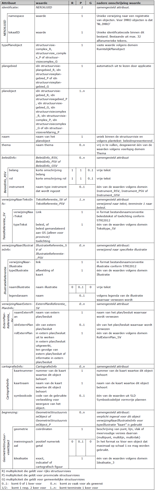
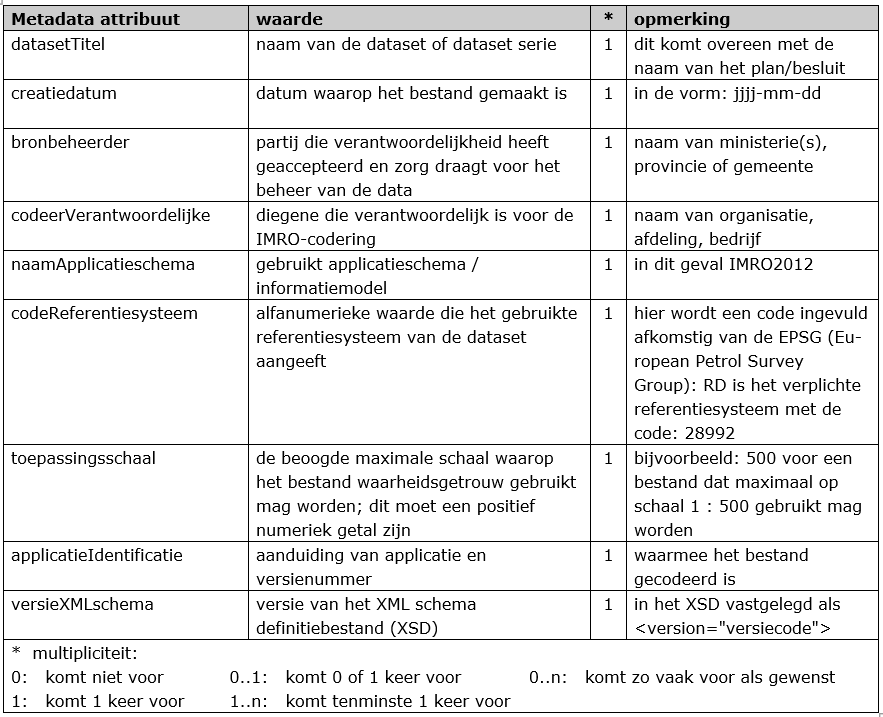

# De planobjecten en hun eigenschappen

**In dit hoofdstuk worden de klassen (objecttypen) met bijbehorende attributen
beschreven. Elk object binnen een klasse kent eigenschappen die als attribuut
daaraan worden toegekend. In IMRO2012 is in het UML-schema weergegeven hoe de
objecten (klassen) samenhangen en welke attributen mogelijk zijn. In Bijlage 5
is een stappenplan opgenomen aan de hand waarvan u kunt bepalen welke klasse en
welke attributen u dient in te vullen. Waar mogelijk zijn een aantal attributen
al ingevuld of juist weggelaten.**

De objecttypen van de structuurvisie worden per paragraaf beschreven:  
-   Structuurvisieplangebied in [paragraaf 5.1](#klasse-structuurvisieplangebied);
-   Structuurvisiegebied in [paragraaf 5.2](#klasse-structuurvisiegebied);
-   Structuurvisiecomplex in [paragraaf 5.3](#klasse-structuurvisiecomplex);
-   Structuurvisieverklaring in [paragraaf 5.4](#klasse-structuurvisieverklaring-alleen-voor-provincies).

Tot slot wordt in [paragraaf 5.5](#metadata) metadata toegelicht.

## Klasse Structuurvisieplangebied

Het enige planobject op het hoogste niveau in de objectenstructuur behoort
altijd tot de klasse ‘Structuurvisieplangebied’. In Tabel 5 zijn voor deze
klasse de attributen benoemd, de waarden aangegeven die deze attributen moeten
bevatten en is aangegeven of het gebruik van het attribuut verplicht is en of
het attribuut meerdere malen mag worden gebruikt.

<u>Let op</u>: dit kan verschillen tussen Rijk, provincie en gemeente. Daarom is,
waar dit van toepassing is, voor het Rijk (zie kolom R), de provincie (zie kolom
P) en de gemeente (zie kolom G) afzonderlijk weergegeven. Ook is aangegeven of
attributen in samenhang moeten worden gebruikt (samengesteld attribuut). Na de
tabel is per attribuut een nadere beschrijving gegeven.

**Tabel 5 Klasse Structuurvisieplangebied**

***identificatie*** (verplicht):  
Ieder ruimtelijk instrument kent een eigen identificatienummer (idn). Deze
identificatie maakt het mogelijk dat op landelijk niveau een uniek onderscheid
voor ieder instrument aanwezig is. Voor het geval het werkingsgebied bestaat uit
meerdere ruimtelijk gescheiden gebieden kent het totaal van die gebieden één
identificatienummer. De geometrie van het object *Structuurvisieplangebied* is
hierbij een multipolygoon.  
Het samengestelde attribuut verwijst naar het object NEN3610ID bestaande uit de
attributen *namespace, lokaalID* en *versie*.  
- **namespace:** (verplicht)  
Een unieke verwijzing naar een registratie van objecten. Voor IMRO objecten is
dat ‘NL.IMRO’.  
- **lokaalID:** (verplicht)  
Unieke identificatiecode binnen de registratie van ruimtelijke plannen.
Bestaande uit een bronhouderscode van 4 cijfers (voor het Rijk 0000, voor
provincies 99xx waarbij xx staat voor het provincienummer en voor gemeente
het CBS-nummer) gevolgd door een punt (.) en maximaal door de bronhouder te
bepalen 18 alfanumerieke tekens. Er geldt de volgende reguliere expressie:
[0-9]{4}\\.[A-Za-z0-9]{1,18}  
- **Versie:** (verplicht)  
Versie-aanduiding van het plangebied bestaande uit 4 alfanumerieke tekens
door de bronhouder te bepalen. Er geldt de volgende reguliere expressie:
[A-Za-z0-9]{4}
Uit de waarden van de attributen *namespace, lokaalID* en *versie* wordt de
bestandsnaam van het plan opgebouwd conform STRI2012:
namespace.lokaalID-versie. De samengestelde reguliere expressie is:
NL\\.IMRO\\.[0-9]{4}\\.[A-Za-z0-9]{1,18}-[A-Za-z0-9]{4}

**typePlan** (verplicht):  
Voor het attribuut *typePlan* wordt het domein *RuimtelijkPlanOfBesluit_SV*
gebruikt. Hier wordt de vaste waarde *structuurvisie* ingevuld.

**beleidsmatigVerantwoordelijkeOverheid** (verplicht):  
Hier wordt de overheid die beleidsmatig verantwoordelijk is voor het opstellen
van het plan opgenomen uit een van domeinen *Overheden_R (voor het Rijk)*,
*Overheden_P (voor provincies) of Overheden_G* (voor gemeenten).

**naamOverheid** (verplicht, zo vaak als nodig):  
Hier wordt de naam van de beleidsmatig verantwoordelijke overheid opgenomen.
Voor het Rijk is dit in de vorm van de tekst “ministerie …….”. In het geval er
meerdere verantwoordelijke ministeries zijn, wordt naamOverheid evenzoveel
ingevuld.  
Voor de provincie is dit in de vorm van de tekst “provincie …….” En voor
gemeenten is dit in de vorm van de tekst “gemeente …….” of
“deelgemeente/stadsdeel …….”..

**overheidsCode** (verplicht):  
Teneinde kenbaar te maken van welke beleidsmatig verantwoordelijke overheid de
structuurvisie is, wordt hier het viercijferige CBS-nummer van die overheid
opgenomen. Hier wordt voor het Rijk 0000, voor provincies 99xx waarbij xx staat
voor het provincienummer en voor gemeente het CBS-nummer ingevuld.

**naam** (verplicht):  
In het waardeveld van het attribuut *naam* dient de naam van de structuurvisie
te worden op­genomen. Het gaat daarbij om de volledige naam. Indien er sprake is
van een aanhaaltitel in het plan dan wordt deze gebruikt.

**locatieNaam** (zo vaak als gewenst):  
Het kan gewenst zijn om de naam van de locatie(s) waarover de structuurvisie
gaat kenbaar te maken. De naam van die locatie(s) worden hier ingevuld.

***planstatusInfo*** (verplicht):  
Dit attribuut is noodzakelijk om de plangegevens te kunnen plaatsen naar tijd en
belang. Het samengesteld attribuut *planstatus* verwijst naar het object
*PlanstatusEnDatum*, bestaande uit de attributen *planstatus* en *datum*.  
- **planstatus** (verplicht)  
Het domein *Planstatus* geeft de toegestane waarden voor het attribuut *planstatus* waaruit er één moet worden gekozen. De waarde van dit attribuut
geeft de planstatus weer.  
- **datum** (verplicht)  
Het attribuut *datum* is bedoeld om de proceduredatum van het plan op te
nemen. De in het waardeveld op te nemen datum dient overeenkomstig het
binnen het IMRO afgesproken datumformaat te worden genoteerd: jjjj-mm-dd.

**besluitnummer** (onder voorwaarde verplicht):  
Nummer van het vaststellingsbesluit van de structuurvisie. Het besluitnummer is
alleen toegestaan en dan ook verplicht indien de planstatus *vastgesteld* is.

**verwijzingNaarVaststellingsbesluit** (onder voorwaarde verplicht):  
Hierin wordt een link opgenomen naar de tekst van het vaststellingsbesluit. In
het format conform de bestandsnaamconventie *vaststellingsbesluit* volgens de
STRI2012. Alleen toegestaan en dan ook verplicht indien de planstatus
*vastgesteld* is. Aan het bestand kunnen ook eventueel bij het
vaststellingsbesluit behorende bijlagen worden toegevoegd.

***verwijzingNaarIllustratieInfo*** (zo vaak als gewenst):  
Dit attribuut is bedoeld om illustraties bij de structuurvisie op te nemen. Het
betreft afbeeldingen op het niveau van het plangebied en niet op het niveau van
onderliggende objecten.  
Het attribuut verwijst naar het samengestelde attribuut
*IllustratieReferentiePG*, bestaande uit de attributen
*verwijzingNaarIllustratie* en *typeIllustratie*.  
- **verwijzingNaarIllustratie** (verplicht)  
Dit attribuut is exclusief bedoeld om (hyper)links te kunnen opnemen. Hier
dient een (hyper)link naar de illustratie die bij het object behoort te
worden opgenomen. Het format dient overeenkomstig de afspraak over de
bestandsnaamconventie voor het bestandstype *illustratie* conform de
STRI2012 te zijn.  
- **typeIllustratie** (verplicht)  
Hierin wordt het type van de illustratie vastgelegd: om wat voor soort
illustratie het gaat. Er dient te worden gekozen uit één van de waarden
(*afbeelding* of *kaart*) volgens het domein *Illustratie*.

***verwijzingNaarTekstInfo*** (verplicht):  
Dit attribuut dat verwijst naar het samengestelde attribuut
TekstReferentiePG_SV, bestaande uit de attributen *verwijzingNaarTekst* en
*typeTekst*.  
Het attribuut wordt met de volgende cardinaliteit opgenomen:  
-   1 verwijzing naar volledige beleidsdocument;
-   0..1 verwijzing naar volledige toelichting;
-   0..1 verwijzing naar volledige bijlagen.  

Teneinde een zo beperkt mogelijk aantal verwijzingen naar teksten te verkrijgen
is het aantal keren dat het attribuut *verwijzingNaarTekstInfo* mag worden
gebruikt beperkt. De raadpleger van de structuurvisie heeft daar baat bij, omdat
hij dan niet direct geconfronteerd wordt met een mogelijk lange lijst van
verwijzingen. Daarom moet er maximaal één verwijzing zijn naar het volledige
beleidsdocument en mag er maximaal één verwijzing zijn naar de volledige
toelichting en maximaal één naar de volledige bijlagen. Er mag worden verwezen
naar een inhoudsop­gave of index, waardoor indirect meer mogelijkheden aanwezig
zijn.  
De bronhouder kiest voor het al dan niet gebruik van objectgerichte planteksten.
In beide gevallen wordt dit attribuut *verwijzingNaarTekstInfo* gebruikt. De
keuze voor XML of HTML/PDF planteksten geldt niet alleen voor het plangebied, de
keuze geldt ook voor de andere objecten (structuurvisiegebieden/
structuurvisiecomplexen) binnen de structuurvisie. Daarnaast wordt de keuze
vastgelegd met behulp van het attribuut *verwijzingNorm* bij
Structuurvisieplangebied_R van deze structuurvisie. Het format dient
overeen­komstig de afspraak over de bestandsnaamconventies conform de STRI2012
te zijn.  
- **verwijzingNaarTekst** (verplicht)  
De waarde van dit attribuut is een (hy­per)­link naar het soort document dat
is aangegeven bij het attribuut *typeTekst*. Er wordt in de waarde geen
elementen van een directory­structuur/pad opgenomen.  
- **typeTekst** (verplicht)  
Aanduiding van het type tekst waarnaar verwezen wordt. Domein: *TeksttypePG_SV*:  
	-   document
	-   toelichting
	-   bijlage

***ondergrondInfo*** (verplicht, zo vaak als gewenst):  
Dit attribuut verwijst naar het samengestelde attribuut *Ondergrondreferentie*,
bestaande uit de attributen *ondergrondtype* en *ondergronddatum.* Met dit
attribuut wordt, conform artikel 1.2.4 Bro, aangegeven welke ondergrond bij het
vaststellen van de structuurvisie is gebruikt.  
Er zijn meerdere waarden mogelijk.  
- **ondergrondtype** (verplicht)  
Het type van de gebruikte ondergrond volgens het domein Ondergronden. Op
grond van de Wet basisregistratie grootschalige topografie (BGT) is het per
1 juli 2017 voor bestuursorganen verplicht om gebruik te maken van de **Basisregistratie Grootschalige Topografie (BGT).** Een bestuursorgaan kan
daar indien nodig gemotiveerd van afwijken. Bij afwijking kan het
bestuursorgaan gebruik maken van:  
	-   basisregistratie topografie (BRT)
	-   basisregistratie kadaster (BRK)  
Indien geen gebruik is gemaakt van een ondergrond uit het domein
Ondergronden, dan wordt de naam van het bestand van de gebruikte
ondergrond(en) als vrije tekst opgegeven. In de PRTRI2012, hoofdstuk 7, is
toegelicht welke bestandformaten voor de ondergrond kunnen worden gebruikt.  
- **ondergronddatum** (verplicht)  
De datum van de gebruikte ondergrond.

****verwijzingNaarExternPlanInfo*** (zo vaak als gewenst):  
Dit attribuut wordt gebruikt om de relatie met een ander instrument vast te
leggen. In bijlage 3 is dit met betrekking tot herzieningen toegelicht. Een
structuurvisie staat niet altijd op zichzelf, maar kan een relatie hebben met
een ander plan van dezelfde of een andere overheidsorganisatie. Voorbeelden:  
-   de structuurvisie is een uitwerking van een overkoepelend plan;
-   de structuurvisie wordt nader uitgewerkt in bijvoorbeeld een uitvoeringsplan.

Het attribuut verwijst naar het samengestelde attribuut *ExternPlanReferentie_PG_SV*, bestaande uit de attributen *naamExternPlan,
idnExternPlan* en *rolExternPlan.*  
- **naamExternPlan** (verplicht)  
Hier wordt de naam van het externe plan of in voorkomend geval besluit
waarnaar verwezen wordt opgegeven. Dit kan een specifieke naam zijn indien
deze bekend is, maar ook een algemene benaming ingeval het bijvoorbeeld een
plan betreft dat nog niet bestaat.  
- **idnExternPlan** (indien gewenst)  
In het geval een identificatie (idn) van het externe plan waarnaar verwezen
wordt, bekend is, kan deze idn hier worden opgenomen. 
- **rolExternPlan** (verplicht)  
Hierin wordt de betekenis van het externe plan/besluit ten opzichte van het
hier betreffende plan vastgelegd. Het betreft hier een van de volgende vaste
waarden uit het domein *RolExternPlanPG_SV*:  
	-   *in extern plan/besluit uit te werken* in geval het plan dat als gevolg
    dient te hebben;
	-   *in extern plan/besluit uitgewerkt* ingeval dat het geval is;
	-   *ten gevolge van extern plan/besluit* in geval het plan een gevolg is van
    een ander plan of besluit;
	-   *informatie in extern plan/besluit* in geval (nadere) informatie in een
    extern plan of besluit staat;
	-   *ter vervanging van extern plan* ingeval daarvan sprake is, een en ander als
    uiteengezet in bijlage 3 van deze praktijkrichtlijn.
	-   *als mutatie opgenomen* voor het geval er sprake is van een mutatieplan, een
    en ander als uiteengezet in bijlage 3 van deze praktijkrichtlijn.

**verwijzingNorm** (verplicht):  
Teneinde de zekerheid te hebben welke technische status de data hebben, is het
noodzakelijk dat wordt aangegeven aan welke IMRO versie de gegevensset voldoet.
Tevens moet een verwijzing worden opgenomen naar de gebruikte versie van de
praktijkrichtlijn. In het geval objectgerichte planteksten (XML) onderdeel zijn
van de Rijksstructuurvisie, dan wordt ook de verwijzing naar de standaard voor
planteksten opgenomen.  
Het attribuut *verwijzingNorm* dient minimaal twee keer te wor­den opgeno­men
met de verwijzing naar de betreffende versies in het waardeveld: IMRO2012 en
PRrSV2012 voor rijksstructuurvisies, PRpSV voor provinciale structuurvisies of
PRgSV voor het gemeentelijke structuurvisies[^9].

[^9]: Dit terwijl de huidige praktijkrichtlijn de toelichting op IMRO2012 bevat
voor het maken van structuurvisies op alle overheidslagen. IMRO is bij het maken
van deze praktijkrichtlijn niet aangepast. Hiervoor is een melding opgenomen in
de meldingen lijst van de RO Standaarden:
https://www.geonovum.nl/documents/meldingenrospdf,
melding 4498.

Bij het gebruik van objectgerichte planteksten in dit ruimtelijk plan moet ook
worden opgenomen: IMROPT2012.

***begrenzing*** (verplicht):  
Dit attribuut verwijst naar het samengestelde attribuut *GeometriePlangebied
(voor Rijk en gemeente) of GeometriePlangebied_P (voor provincie)*, bestaande
uit de attributen *geometrie, inwinningsschaal* en *idealisatie*.  
- **geometrie** (verplicht)  
Het object *Structuurvisieplangebied* kent uitsluitend de geometrie van een
vlak of multivlak (multipolygoon). Dit attribuut legt de coördinaten in een
vastgesteld format (gml) vast. De coördinaten worden door de applicatie
automatisch gegenereerd.  
- **inwinningsschaal** (alleen voor provincie, indien gewenst)  
De inwinningsschaal is de schaal waarop het object is ingewonnen. Het schaal
aspect kan bij individuele objecten een rol spelen in relatie tot de
verbeelding daarvan of de interpretatie die aan het object kan worden
gegeven. Deze schaal kan hier worden opgegeven.  
- **idealisatie** (verplicht)  
Met het attribuut *idealisatie* kan de nauwkeurigheid van de begrenzing van
een object worden aangegeven. Dit attribuut heeft de vaste waarde exact
volgens het domein *Idealisatie_1*. De vaste waarde *exact* geeft aan dat de
geometrie van het object opgenomen is met de nauwkeurigheid die behoort bij
de dataset.

## Klasse Structuurvisiegebied

In Tabel 6 zijn de attributen behorend bij de klasse *Structuurvisiegebied*
benoemd, de waarden aangegeven die deze attributen moeten bevatten en is
aangegeven of het gebruik van het attribuut verplicht is en of het attribuut
meerdere malen mag worden gebruikt. Ook is aangegeven of attributen in samenhang
moeten worden gebruikt. Na de tabel is per attribuut een nadere toelichting
gegeven.

**Tabel 6 Klasse Structuurvisiegebied**

***identificatie (idn)*** (verplicht):  
Elk object *Structuurvisiegebied* krijgt een eigen unieke identificatie binnen
deze structuurvisie. Het samengestelde attribuut *identificatie* verwijst naar
het object NEN3610ID bestaande uit de attributen *namespace* en *lokaalID*.  
- **namespace:** (verplicht)  
Een unieke verwijzing naar een registratie van objecten. Voor IMRO objecten is
dat ‘NL.IMRO’.  
- **lokaalID:** (verplicht)  
Door de bronhouder te bepalen unieke identificatiecode binnen de context van
het bestand bestaande uit maximaal 32 alfanumerieke tekens. Toegestane
tekens: {”A”…”Z”, “a”…”z”, ”0”…”9”, “_”, “- “, “,”, ”.”}.

**typePlanobject** (verplicht):  
Het attribuut *typePlanobject* maakt het via het bijbehorende domein
*RuimtelijkPlanobject* mogelijk aan te geven welk object het betreft. Hier wordt
de vaste waarde *structuurvisiegebied_R (voor het Rijk), structuurvisiegebied_P
(voor provincie) of structuurvisiegebied_G (voor gemeente)* ingevuld.

**plangebied** (verplicht):  
Voor elk object is een verwijzing noodzakelijk naar het object
*Structuurvisieplangebied* waar het object deel van uitmaakt. Dit attribuut
verwijst daartoe naar het attribuut *identificatie* van het bijbehorende object
*Structuurvisieplangebied*. Dit zal automatisch binnen een applicatie, gebruikt
om het plan op te stellen, gestalte kunnen krijgen.

**naam** (verplicht):  
Aan het attribuut *naam* wordt als waarde een binnen het plan unieke
(beleids)representerende naam van het object meegegeven, mogelijk zoals deze in
de tekst die ernaar verwijst is opgenomen. Niet altijd zal dit het geval zijn.
In dat geval zal een zinvolle onderscheidende naam moeten worden ingevuld, zodat
het object voor gebruikers herkenbaar is en de gebruiker hierop desgewenst kan
classificeren.

**thema** (verplicht, zo vaak als gewenst):  
Met dit attribuut wordt het thema van het object opgenomen. Het thema wordt
gekozen uit de waarden volgens het domein *Thema*. Indien geen bruikbare waarde
wordt gevonden kan een vrije tekst worden opgenomen. Dit attribuut kan meerdere
keren worden opgenomen.

***beleidinfo*** (verplicht voor Rijk en provincie, optioneel voor gemeente. Zo vaak
als gewenst):  
De Wro stelt dat een structuurvisie de hoofdlijnen bevat van de voorgenomen
ontwikkeling van dat gebied. De structuurvisie gaat tevens in op de wijze waarop
men zich voorstelt die voorgenomen ontwikkeling te doen verwezenlijken. Voor dit
doel biedt het attribuut beleidinfo mogelijkheden om aspecten daarvan kenbaar te
maken. Het attribuut *beleidinfo* verwijst naar het samengestelde attribuut *Beleidinfo_RSV (voor het Rijk), Beleidinfo_PSV (voor provincie) of
Beleidinfo_GSV (voor gemeente)* dat bestaat uit de attributen *belang*, *rol* en
*instrument.*  
- **belang** (verplicht voor Rijk en provincie, optioneel voor gemeente)  
Hier kan het belang worden aangegeven dat door het bestuursorgaan met het
object wordt beoogd. Het belang dient in (enkele) trefwoorden te worden
benoemd.  
- **rol** (verplicht voor Rijk en provincie, optioneel voor gemeente.)  
Hier wordt aangegeven hoe het belang wordt verwezenlijkt. De rol dient in
(enkele) trefwoorden te worden benoemd.  
- **instrument** (indien gewenst, maximaal 1 keer)  
Hier wordt het instrument genoemd dat wordt ingezet om het belang te
verwezenlijken. Voor deze instrumenten moet worden gekozen uit een lijst die
is opgenomen in de domeinen *Instrument_RSV (voor het Rijk), Instrument_PSV
(voor de provincies) of Instrument_GSV (voor de gemeenten)*. Het huidig
juridisch instrumentarium is opgenomen in de lijst. Voor toekomstig
juridisch instrumentarium en/of andere instrumenten kan de mogelijkheid tot
het invullen van een vrije waarde worden gebruikt.

***verwijzingNaarTekstInfo*** (verplicht, zo vaak als gewenst):  
Het attribuut is bedoeld voor het verwijzen naar specifieke tekst die behoort
bij het betreffende object *Structuurvisiegebied*. Het attribuut verwijst naar
het samengestelde attribuut *Tekstreferentie_SV (voor Rijk en gemeente) of
Tekstreferentie_PSV (voor provincie)*, bestaande uit de attributen *verwijzingNaarTekst* en *typeTekst*.  
De bronhouder kiest voor dezelfde vorm van planteksten als bij het object *Structuurvisieplangebied*: objectgericht in XML of niet-objectgericht in HTML
formaat. Het formaat dient overeen­komstig de afspraak over de
bestandsnaamconventies conform de STRI2012 te zijn. De keuze van de bronhouder
wordt vastgelegd in de *verwijzingNorm* bij deze structuurvisie.  
- **verwijzingNaarTekst** (verplicht)  
Dit attribuut is bedoeld om (hyper)links te kunnen opnemen. Hier dient een
(hy­per)­link naar het soort document dat is aangegeven bij het attribuut *typeTekst* te worden opgenomen.  
Voor de waarde van het attribuut *verwijzingNaarTekst* geldt dat geen
elementen van een directorystructuur/pad mogen worden opgenomen. Wel moet
een nadere precisering naar de plaats binnen een document te worden
opgenomen met behulp van een fragmentidentifier. Het fragment in de
hyperlink is de locatie in de plantekst (XML of HTML) waar het van
toepassing zijnde attribuut *typeTekst* betrekking op heeft. Een hyperlink
krijgt dan de vorm: *bestandsnaam.xml­\#fragment* of *bestandsnaam.htm­\#fragment*.  
- **typeTekst** (verplicht)  
Hiermee wordt aangegeven om wat voor type tekst het gaat. Per verwijzing
naar tekst dient gekozen te worden uit een van de waarden van het domein *Teksttype_SV (voor Rijk en gemeente) of Teksttype_PSV (voor provincie).*

***verwijzingNaarIllustratieInfo*** (zo vaak als gewenst):  
Dit attribuut is bedoeld om een specifieke afbeelding of illustratie behorende
bij het object op te nemen. Het attribuut verwijst naar het samengestelde
attribuut *IllustratieReferentie_SV (voor rijk en gemeente) of
IllustratieReferentie_PSV (voor provincie)*, bestaande uit de attributen *verwijzingNaarIllustratie, typeIllustratie* en *legendanaam*.:  
- **verwijzingNaarIllustratie** (verplicht)  
Dit attribuut is exclusief bedoeld om links te kunnen opnemen. Hier dient
een link naar de illustratie die bij het object behoort te worden opgenomen.
Het format dient overeenkomstig de afspraak over de bestandsnaamconventie
voor het bestandstype *illustratie* conform de STRI2012 te zijn.  
- **typeIllustratie** (verplicht)  
Hierin wordt het type van de illustratie vastgelegd: om wat voor soort
illustratie het gaat. Er dient te worden gekozen uit één van de waarden *afbeelding* of *kaart* volgens het domein *Illustratie*.  
- **naamIllustratie** (alleen voor provincie, indien gewenst)  
Met dit attribuut kan de naam van de illustratie worden opgegeven.  
- **legendanaam** (indien gewenst)  
Indien het object in de legenda van de illustratie is opgenomen kan hier de
naam van de legenda-eenheid worden opgenomen teneinde duidelijk te maken
welk deel van de illustratie bij het object behoort.

***verwijzingNaarExternPlanInfo*** (zo vaak als gewenst):  
Dit attribuut verwijst naar het samengestelde attribuut *ExternPlanReferentie_SV*, bestaande uit de attributen *naamExternPlan*, *idnExternPlan* en *rolExternPlan*. De verwijzing naar het externe plan moet ook
voorkomen bij het plangebied.  
- **naamExternPlan** (verplicht)  
Dit attribuut verwijst naar een ander plan/besluit waarin het beleid
waarnaar het object verwijst is uitgewerkt/opgenomen. In het waardeveld
staat in dat geval de naam van dat plan/besluit. Dit kan een specifieke naam
zijn indien deze bekend is, maar ook een algemene benaming ingeval het
bijvoorbeeld een plan betreft dat nog niet bestaat.  
- **idnExternPlan** (indien gewenst)  
In het geval een identificatie (idn) van het externe plan/besluit waarnaar
verwezen wordt, bekend is, kan deze idn hier worden opgenomen.  
- **rolExternPlan** (verplicht)  
Hierin wordt de betekenis van het externe plan/besluit ten opzichte van het
object *Structuurvisiegebied* vastgesteld. Het betreft hier een van de
volgende vaste waarden uit het domein *RolExternPlan_SV*:  
	-   *in extern plan/besluit uit te werken* in geval het beleid achter het object
    dat als gevolg dient te hebben;  
	-   *in extern plan/besluit uitgewerkt* ingeval dat het geval is in relatie tot
    dit object;  
	-   *ten gevolge van extern plan/besluit* in geval het object een gevolg is van
    een ander plan of besluit;  
	-   *informatie in extern plan/besluit* in geval (nadere) informatie in een
    extern plan of besluit over dit object staat.

***cartografieInfo*** (zo vaak als gewenst):  
Het attribuut *cartografieInfo* wordt gebruikt om verschillende kaarten in de
structuurvisie zichtbaar en presenteerbaar te maken. De structuur van de
kaartopbouw staat echter los van de planstructuur. Geen of foutief gebruik van
het attribuut *cartografieInfo* resulteert in een grijze of andere
objectweergave in een interactieve raadpleegomgeving. Een object kan in meerdere
kaarten voorkomen. Er moeten meerdere attributen *cartografieInfo* met waarden
toegevoegd worden om dit te realiseren.  
Het attribuut verwijst naar het samengestelde attribuut *cartografieInfo*
bestaande uit de attributen *kaartnummer, kaartnaam en symboolcode.*  
- **kaartnummer** (verplicht)  
Het nummer van de kaart van de structuurvisie waartoe dit object behoort.
Het kaartnummer is door de bronhouder te bepalen. Kaarten kunnen in een
interactieve raadpleegomgeving worden geprioriteerd op basis van
kaartnummer. De kaart met nummer 1 wordt als hoofdkaart gezien en moet
altijd voorkomen, kaartnummer 0 niet mag voorkomen. Voorloopnullen worden
genegeerd (001 wordt bijvoorbeeld 1). Het kaartnummer is een uniek nummer
gekoppeld aan een kaartnaam.  
- **kaartnaam** (verplicht)  
De naam van de kaart van de structuurvisie waartoe dit object behoort. De
kaartnaam is door de bronhouder te bepalen.  
- **symboolcode** (zo vaak als gewenst)  
De symboolcode uit de symboolcodelijst voor vormvrije plannen (onderdeel van
de RO Standaarden 2012). De symboolcode geeft de kleur en patroon aan voor
de wijze waarop het object *Structuurvisiegebied_G* in de interactieve
raadpleegomgeving wordt weergegeven.  
Een symboolcode die aan een object wordt toegevoegd geldt deze alleen voor
dit object zelf en niet voor de onderliggende objecten. Er vindt dus geen
overerving van symboolcode plaats.

***begrenzing*** (Voor het Rijk conditioneel, voor provincie en gemeente verplicht.
Zo vaak als gewenst):  
Voor provincie en gemeente is dit attribuut verplicht. Voor het Rijk geldt dat
wanneer voor het object een illustratie met een kaartbeeld van het object is
opgenomen, dit attribuut verplicht is. Het attribuut verwijst naar het
samengestelde attribuut *GeometrieStructuurvisieObject (voor Rijk en gemeente)
of GeometrieStructuurvisieObject_P (voor provincie)*, bestaande uit de
attributen:  
- **geometrie** (verplicht)  
De geometrie van het object *Structuurvisiegebied* kan een beschrijving van
punt, lijn, vlak of meervoudige versies daarvan (multipunt, multilijn,
multivlak) zijn, tezamen de geometrie van het object vormend. Dit attribuut
legt de coördinaten in een vastgesteld format (gml) vast. De coördinaten
kunnen door een applicatie automatisch worden gegenereerd.  
- **inwinningsschaal** (alleen voor provincie, indien gewenst)  
De inwinningsschaal is de schaal waarop het object is ingewonnen. Het schaal
aspect kan bij individuele objecten een rol spelen in relatie tot de
verbeelding daarvan of de interpretatie die aan het object kan worden
gegeven. Deze schaal kan hier worden opgegeven. Indien deze waarde hier
wordt opgegeven treedt deze waarde in de plaats van de waarde die bij het
object *Structuurvisieplangebied* is opgegeven.  
- **idealisatie** (verplicht)  
Met het attribuut *idealisatie* kan de nauwkeurigheid van de begrenzing van
een object worden aangegeven. Er dient een keuze gemaakt te worden volgens
het domein *Idealisatie_3*. De nauwkeurigheid van de begrenzing van een
object neemt af in de keuzes, van *exact*, via *indicatief* naar *cartografisch* figuur:  
	-   *Exact* geeft aan dat de geometrie van het object opgenomen is met de
    nauwkeurigheid die be-hoort bij de dataset, waarmee de begrenzing als exact
    wordt beschouwd.  
	-   *Indicatief* betekent dat de geometrie indicatief geïnterpreteerd moet
    worden; waarmee de be-grenzing niet is vastgelegd.  
	-   *Cartografisch figuur* betekent dat de geometrie (het figuur) als symbool
    geïnterpreteerd moet worden en geen relatie heeft met de begrenzing van het
    object in de werkelijkheid; waardoor slechts de locatie zonder een
    aangegeven begrenzing is vastgelegd.

## Klasse Structuurvisiecomplex

In Tabel 7 zijn de attributen behorend bij de klasse *Structuurvisiecomplex*
benoemd, de waarden aangegeven die deze attributen moeten bevatten en is
aangegeven of het gebruik van het attribuut verplicht is en of het attribuut
meerdere malen mag worden gebruikt. Ook is aangegeven of attributen in samenhang
moeten worden gebruikt. Na de tabel is per attribuut een nadere toelichting
gegeven.

**Tabel 7 Klasse Structuurvisiecomplex**

***identificatie (idn)*** (verplicht):  
Elk object Structuurvisiecomplex krijgt een eigen unieke identificatie binnen
deze structuurvisie. Het samengestelde attribuut identificatie verwijst naar het object NEN3610ID
bestaande uit de attributen namespace en lokaalID.  
- **namespace:** (verplicht)  
Een unieke verwijzing naar een registratie van objecten. Voor IMRO objecten is
dat „NL.IMRO‟.  
- **lokaalID:** (verplicht)  
Door de bronhouder te bepalen unieke identificatiecode binnen de context van
het bestand bestaande uit maximaal 32 alfanumerieke tekens. Toegestane
tekens: {”A”…”Z”, “a”…”z”, 0”…”9”, “_”, “- “, “,”, ”.”}.

**typePlanobject** (verplicht):  
Het attribuut typePlanobject maakt het via het bijbehorende domein
RuimtelijkPlanobject mogelijk aan te
geven welk object het betreft. Hier wordt de vaste waarde *structuurvisiecomplex_R (voor het Rijk), structuurvisiecomplex_P (voor
provincie) of structuurvisiecomplex_G (voor gemeente)* ingevuld.

**plangebied** (verplicht):  
Voor elk object is een verwijzing noodzakelijk naar het object
Structuurvisieplangebied waar het object
deel van uitmaakt. Dit attribuut verwijst daartoe naar het attribuut
identificatie van het bijbehorende
object Structuurvisieplangebied. Dit zal automatisch binnen een applicatie
gestalte kunnen krijgen.

**planobject** (verplicht, zo vaak als gewenst):  
Verwijzing naar alle objecten waaruit het complex bestaat: dit kunnen zowel
gebieden als (andere) complexen, als verklaringen zijn. Als waarde worden de identificaties van alle
objecten Structuurvisiegebied, Structuurvisiecomplex en Structuurvisieverklaring
opgenomen.

**naam** (verplicht):  
Aan het attribuut naam wordt als waarde een (beleids)representerende naam van
het object meegegeven,
mogelijk zoals deze in de tekst die ernaar verwijst is opgenomen. Niet altijd
zal dit het geval zijn. In dat
geval zal een zinvolle onderscheidende naam moeten worden ingevuld, zodat het
object voor gebruikers
herkenbaar is en de gebruiker hierop desgewenst kan classificeren.

**thema** (zo vaak als gewenst):  
Met dit attribuut wordt het thema van het object opgenomen. Het thema wordt
gekozen uit de waarden
volgens het domein Thema. Indien geen bruikbare waarde wordt gevonden kan een
vrije tekst worden
opgenomen. Dit attribuut kan meerdere keren worden opgenomen.

***beleidInfo*** (zo vaak als gewenst):  
De Wro stelt dat een structuurvisie de hoofdlijnen bevat van de voorgenomen
ontwikkeling van dat gebied,
alsmede de hoofdzaken van het door het bestuursorgaan te voeren ruimtelijk
beleid. De structuurvisie gaat tevens in op de wijze waarop het bestuursorgaan
zich voorstelt die voorgenomen ontwikkeling te doen verwezenlijken. Voor dit
doel biedt het attribuut beleidinfo mogelijkheden om aspecten daarvan kenbaar te
maken. Het attribuut beleidinfo verwijst naar het samengestelde attribuut *Beleidinfo_RSV (voor het Rijk), Beleidinfo_PSV (voor provincie) of
Beleidinfo_GSV (voor gemeente)*, dat bestaat uit de attributen belang, rol en instrument.  
- **belang** (verplicht voor Rijk en provincies, indien gewenst voor gemeenten,
maximaal 1 keer)  
Met dit attribuut moet in enkele trefwoorden het belang of de belangen die
betrekking hebben op dit object in de vorm van vrije tekst worden
aangegeven.  
- **rol** (verplicht voor Rijk en provincies, indien gewenst voor gemeenten,
maximaal 1 keer)  
Met dit attribuut moet per belang in de vorm van vrije tekst worden
aangegeven hoe de overheid haar rol hierin ziet (in een paar trefwoorden).  
- **instrument** (indien gewenst, maximaal 1 keer)  
Hier wordt het instrument genoemd dat door de overheid wordt ingezet om het
belang te verwezenlijken. Voor deze instrumenten moet worden gekozen uit een
lijst die is opgenomen in de domeinen *Instrument_RSV (voor het Rijk),
Instrument_PSV (voor de provincies) of Instrument_GSV (voor de gemeenten).*
Het huidig juridisch instrumentarium is opgenomen in de lijst. Voor
toekomstig juridisch instrumentarium en/of andere instrumenten kan de
mogelijkheid tot het invullen van een vrij waarde worden gebruikt.

***verwijzingNaarTekstInfo*** (zo vaak als gewenst):  
Het attribuut is bedoeld voor het verwijzen naar specifieke tekst die behoort
bij het betreffende object
Structuurvisiecomplex. Het attribuut verwijst naar het samengestelde attribuut *TekstReferentie_SV (voor het Rijk en de gemeente) of TekstReferentie_PSV (voor
de provincie)*, bestaande uit de attributen verwijzingNaarTekst en typeTekst.  
Het bestuursorgaan kiest voor dezelfde vorm van planteksten als bij het object
Structuurvisieplangebied: objectgericht in XML of niet-objectgericht in HTML
formaat. Het format dient overeenkomstig de afspraak
over de bestandsnaamconventies conform de STRI2012 te zijn. De keuze van de
bronhouder wordt vastgelegd in de *verwijzingNorm* bij deze structuurvisie.  
- **verwijzingNaarTekst** (verplicht)  
Dit attribuut is bedoeld om (hyper)links te kunnen opnemen. Hier dient een
(hyper)link naar het soort document dat is aangegeven bij het attribuut
typeTekst te worden opgenomen.
Voor de waarde van het attribuut verwijzingNaarTekst geldt dat geen elementen
van een
directorystructuur/pad mogen worden opgenomen. Wel moet een nadere
precisering naar de plaats binnen een document te worden opgenomen met
behulp van een fragmentidentifier. Het fragment in de hyperlink is de
locatie in de plantekst (XML of HTML) waar het van toepassing zijnde
attribuut typeTekst betrekking op heeft. Een hyperlink krijgt dan de vorm:
bestandsnaam.xml\#fragment of bestandsnaam.htm\#fragment.  
- **typeTekst** (verplicht)  
Hiermee wordt aangegeven om wat voor type tekst het gaat. Per verwijzing
naar tekst dient gekozen te worden uit een van de waarden van de domein
Teksttype_SV (voor Rijk en gemeente) of Teksttype_PSV (voor provincie).

***verwijzingNaarIllustratieInfo*** (zo vaak als gewenst):  
Dit attribuut is bedoeld om een specifieke afbeelding of illustratie behorende
bij het object op te nemen.
Het attribuut verwijst naar het samengestelde attribuut
*IllustratieReferentie_SV (voor Rijk en gemeente) of IllustratieReferentie_PSV
(voor provincie)*, bestaande uit de
attributen verwijzingNaarIllustratie, typeIllustratie, naamIllustratie en
legendanaam.  
- **verwijzingNaarIllustratie** (verplicht)  
Dit attribuut is exclusief bedoeld om links te kunnen opnemen. Hier dient
een link naar de illustratie die bij het object behoort te worden opgenomen.
Het format dient overeenkomstig de afspraak over de bestandsnaamconventie
voor het bestandstype illustratie conform de STRI2012 te zijn.  
- **typeIllustratie** (verplicht)  
Hierin wordt het type van de illustratie vastgelegd: om wat voor soort
illustratie het gaat. Er dient gekozen te worden uit één van de waarden
afbeelding of kaart volgens het domein Illustratie.  
- **naamIllustratie** (indien gewenst)  
Met dit attribuut kan de naam van de illustratie worden opgegeven.
legendanaam (indien gewenst)
Indien het object in de legenda van de illustratie is opgenomen kan hier de
naam van de legenda-eenheid worden opgenomen teneinde duidelijk te maken
welk deel van de illustratie bij het object behoort.

***verwijzingNaarExternPlanInfo*** (zo vaak als gewenst):  
een attribuut dat verwijst naar het samengestelde attribuut
ExternPlanReferentie_SV, bestaande uit de
attributen naamExternPlan, idnExternPlan en rolExternPlan.  
- **naamExternPlan** (verplicht)  
Dit attribuut verwijst naar een ander plan/besluit waarin het beleid waarnaar
het object verwijst is
uitgewerkt/opgenomen. In het waardeveld staat in dat geval de naam van dat
plan/besluit. Dit kan een specifieke naam zijn indien deze bekend is, maar
ook een algemene benaming ingeval het bijvoorbeeld een plan betreft dat nog
niet bestaat.  
- **idnExternPlan** (indien gewenst)  
In het geval een identificatie (idn) van het externe plan/besluit waarnaar
verwezen wordt, bekend is, kan deze idn hier worden opgenomen.  
- **rolExternPlan** (verplicht)  
Hierin wordt de betekenis van het externe plan/besluit ten opzichte van het
object
Structuurvisiecomplex vastgesteld. Het betreft hier een van de volgende
vaste waarden uit het domein RolExternPlan_SV:  
	-   in extern plan/besluit uit te werken in geval het beleid achter het object
    dat als gevolg dient te hebben;  
	-   in extern plan/besluit uitgewerkt ingeval dat het geval is in relatie tot
    dit object;  
	-   ten gevolge van extern plan/besluit in geval het object een gevolg is van
    een ander plan of besluit;  
	-   informatie in extern plan/besluit in geval (nadere) informatie in een extern
    plan of besluit over dit object staat.

***cartografieInfo*** (zo vaak als gewenst):  
Het attribuut cartografieInfo wordt gebruikt om verschillende kaarten in de
structuurvisie zichtbaar en presenteerbaar te maken. De structuur van de
kaartopbouw staat echter los van de planstructuur. Geen of foutief gebruik van
het attribuut cartografieInfo resulteert in een grijze of andere objectweergave
in een interactieve raadpleegomgeving. Een object kan in meerdere kaarten
voorkomen. Er moeten dan meerdere attributen cartografieInfo met waarden
toegevoegd worden om dit te realiseren.
Het attribuut verwijst naar het samengestelde attribuut cartografieInfo
bestaande uit de attributen kaartnummer, kaartnaam en symboolcode.  
- **kaartnummer** (verplicht)  
Het nummer van de kaart van de structuurvisie waartoe dit object behoort.
Het kaartnummer is door de bronhouder te bepalen. Kaarten kunnen in een
interactieve raadpleegomgeving worden geprioriteerd op basis van
kaartnummer. De kaart met nummer 1 wordt als hoofdkaart gezien en moet
altijd voorkomen, kaartnummer 0 niet mag voorkomen. Voorloopnullen worden
genegeerd (001 wordt bijvoorbeeld 1). Het kaartnummer is een uniek nummer
gekoppeld aan een kaartnaam.  
- **kaartnaam** (verplicht)  
De naam van de kaart van de structuurvisie waartoe dit object behoort. De
kaartnaam is door de bronhouder te bepalen.  
- **symboolcode** (zo vaak als gewenst)  
De symboolcode uit de symboolcodelijst voor vormvrije plannen (onderdeel van
de RO Standaarden 2012).  
De symboolcode geeft de kleur en patroon aan voor de wijze waarop het object
Structuurvisiegebied_G in de interactieve raadpleegomgeving wordt
weergegeven. Een symboolcode die aan een object wordt toegevoegd geldt
alleen voor dit object zelf en niet voor de onderliggende objecten. Er vindt
dus geen overerving van symboolcode plaats.

***begrenzing*** (zo vaak als gewenst):  
Het kan voorkomen dat een object Structuurvisiecomplex geen geometrie kent omdat
deze uitsluitend als beleidsobject wordt beschreven. Wanneer geen begrenzing is opgenomen neemt
het complex de
begrenzing van de samenstellende objecten ook niet over. Het attribuut verwijst
naar het samengestelde attribuut *GeometrieStructuurvisieObject (voor Rijk en gemeente) of
GeometrieStructuurvisieObject_P (voor provincie)*, bestaande uit de attributen
geometrie, inwinningsschaal en idealisatie.  
- **geometrie** (verplicht)  
De geometrie van het object Structuurvisiecomplex kan een beschrijving van punt,
lijn, vlak of
meervoudige versies daarvan (multipunt, multilijn, multivlak)zijn, tezamen
de geometrie van het object vormend. Dit attribuut legt de coördinaten in
een vastgesteld format (gml) vast. De coördinaten kunnen door een applicatie
automatisch worden gegenereerd.  
- **inwinningsschaal** (alleen voor provincies, indien gewenst, maximaal 1 keer)  
De inwinningsschaal is de schaal waarop het object is ingewonnen. Het schaal
aspect kan bij individueel objecten een rol spelen in relatie tot de
verbeelding daarvan of de interpretatie die aan het object kan worden
gegeven. Deze schaal kan hier worden opgegeven. Deze schaal kan hier worden
opgegeven. Indien deze waarde hier wordt opgegeven treedt deze waarde in de
plaats van de waarde die bij het object Structuurvisieplangebied is
opgegeven.  
- **idealisatie** (verplicht)  
Met het attribuut idealisatie kan de nauwkeurigheid van de begrenzing van een
object worden
aangegeven. Er dient een keuze gemaakt te worden volgens het domein
Idealisatie_3. De nauwkeurigheid van de begrenzing van een object neemt af
in de keuzes, van exact, via indicatief naar cartografisch figuur:  
	-   Exact geeft aan dat de geometrie van het object opgenomen is met de
    nauwkeurigheid die behoort bij de dataset, waarmee de begrenzing als exact
    wordt beschouwd;  
	-   Indicatief betekent dat de geometrie indicatief geïnterpreteerd moet worden;
    waarmee de begrenzing niet is vastgelegd;  
	-   Cartografisch figuur betekent dat de geometrie (het figuur) als symbool
    geïnterpreteerd moet worden en geen relatie heeft met de begrenzing van het
    object in de werkelijkheid; waardoor slechts de locatie zonder een
    aangegeven begrenzing is vastgelegd.

## Klasse Structuurvisieverklaring (alleen voor provincies)

In provinciale structuurvisies kan gebruik worden gemaakt van de klasse
*Structuurvisieverklaring*. In Tabel 8 zijn de attributen behorend bij de klasse
*Structuurvisieverklaring* benoemd, de waarden aangegeven die deze attributen
moeten bevatten en is aangegeven of het gebruik van het attribuut verplicht is
en of het attribuut meerdere malen mag worden gebruikt. Ook is aangegeven of
attributen in samenhang moeten worden gebruikt. Na de tabel is per attribuut een
nadere toelichting gegeven.

**Tabel 8 Klasse Structuurvisieverklaring**

***identificatie (idn)*** (verplicht):  
Elk object Structuurvisieverklaring krijgt een eigen unieke identificatie binnen
deze structuurvisie. Het samengestelde attribuut identificatie verwijst naar het object NEN3610ID
bestaande uit de attributen namespace en lokaalID.  
- **namespace:** (verplicht)  
Een unieke verwijzing naar een registratie van objecten. Voor IMRO objecten is
dat „NL.IMRO‟.  
- **lokaalID:** (verplicht)  
Door de bronhouder te bepalen unieke identificatiecode binnen de context van
het bestand bestaande uit maximaal 32 alfanumerieke tekens. Toegestane
tekens: {”A”…”Z”, “a”…”z”, ”0”…”9”, “_”, “- “, “,”, ”.”}.

**typePlanobject** (verplicht):  
Het attribuut typePlanobject maakt het via het bijbehorende domein
RuimtelijkPlanobject mogelijk aan te geven welk object het betreft. Hier wordt de vaste waarde
structuurvisieverklaring_P ingevuld.

**plangebied** (verplicht):  
Voor elk object is een verwijzing noodzakelijk naar het object
Structuurvisieplangebied_P waar het object
deel van uitmaakt. Dit attribuut verwijst daartoe naar het attribuut
identificatie van het bijbehorende
object Structuurvisieplangebied_P. Dit zal automatisch binnen een applicatie
gestalte kunnen krijgen.

**naam** (verplicht):  
Aan het attribuut naam wordt als waarde een representerende naam van het object
meegegeven, mogelijk
zoals deze in de tekst die ernaar verwijst is opgenomen. Niet altijd zal dit het
geval zijn. In dat geval zal
een zinvolle onderscheidende naam moeten worden ingevuld, zodat het object voor
gebruikers herkenbaar
is en de gebruiker hierop desgewenst kan classificeren.

**thema** (zo vaak als gewenst):  
Met dit attribuut wordt het thema van het object opgenomen. Het thema wordt
gekozen uit de waarden
volgens het domein Thema. Indien geen bruikbare waarde wordt gevonden kan een
vrije tekst worden
opgenomen. Dit attribuut kan meerdere keren worden opgenomen.

***verwijzingNaarTekstInfo*** (zo vaak als gewenst):  
Het attribuut is bedoeld voor het verwijzen naar specifieke tekst die behoort
bij het betreffende object
Structuurvisieverklaring_P. Het attribuut verwijst naar het samengestelde
attribuut TekstReferentie_PSV,
bestaande uit de attributen verwijzingNaarTekst en typeTekst.
De bronhouder kiest voor dezelfde vorm van planteksten als bij het object
Structuurvisieplangebied_P:
objectgericht in XML of niet-objectgericht in HTML formaat. Het format dient
overeenkomstig de afspraak
over de bestandsnaamconventies conform de STRI2012 te zijn. De keuze van de
bronhouder wordt
vastgelegd in de verwijzingNorm bij deze structuurvisie.  
- **verwijzingNaarTekst** (verplicht)  
Dit attribuut is bedoeld om (hyper)links te kunnen opnemen. Hier dient een
(hyper)link naar het soort document dat is aangegeven bij het attribuut
typeTekst te worden opgenomen.
Voor de waarde van het attribuut verwijzingNaarTekst geldt dat geen elementen
van een directorystructuur/pad mogen worden opgenomen. Wel moet een nadere
precisering naar de plaats binnen een document te worden opgenomen met
behulp van een fragmentidentifier. Het fragment in de hyperlink is de
locatie in de plantekst (XML of HTML) waar het van toepassing zijnde
attribuut typeTekst betrekking op heeft. Een hyperlink krijgt dan de vorm:
bestandsnaam.xml\#fragment of bestandsnaam.htm\#fragment.  
-  **typeTekst** (verplicht)  
Hiermee wordt aangegeven om wat voor type tekst het gaat. Per verwijzing
naar tekst dient de vaste waarde toelichting volgens het domein
TeksttypeV_PSV opgenomen te worden.

***verwijzingNaarIllustratieInfo*** (zo vaak als gewenst):  
Dit attribuut is bedoeld om een specifieke afbeelding of illustratie behorende
bij het object op te nemen.
Het attribuut verwijst naar het samengestelde attribuut
IllustratieReferentie_PSV, bestaande uit de
attributen verwijzingNaarIllustratie, typeIllustratie, naamIllustratie en
legendanaam.  
- **verwijzingNaarIllustratie** (verplicht)  
Dit attribuut is exclusief bedoeld om links te kunnen opnemen. Hier dient
een link naar de illustratie die bij het object behoort te worden opgenomen.
Het format dient overeenkomstig de afspraak over de bestandsnaamconventie
voor het bestandstype illustratie conform de STRI2012 te zijn.  
- **typeIllustratie** (verplicht)  
Hierin wordt het type van de illustratie vastgelegd: om wat voor soort
illustratie het gaat. Er dient gekozen te worden uit één van de waarden
afbeelding of kaart volgens het domein Illustratie.  
- **naamIllustratie** (indien gewenst)  
Met dit attribuut kan de naam van de illustratie worden opgegeven.  
- **legendanaam** (indien gewenst)  
Indien het object in de legenda van de illustratie is opgenomen kan hier de
naam van de legenda-eenheid worden opgenomen teneinde duidelijk te maken
welk deel van de illustratie bij het object behoort.

***cartografieInfo*** (zo vaak als gewenst)  
Het attribuut cartografieInfo wordt gebruikt om verschillende kaarten in de
structuurvisie zichtbaar en presenteerbaar te maken. De structuur van de
kaartopbouw staat echter los van de planstructuur. Geen of foutief gebruik van
het attribuut *cartografieInfo* resulteert in een grijze of andere
objectweergave in een interactieve raadpleegomgeving. Een object kan in meerdere
kaarten voorkomen. Er moeten dan meerdere attributen *cartografieInfo* met
waarden toegevoegd worden om dit te realiseren.
Het attribuut verwijst naar het samengestelde attribuut *cartografieInfo*
bestaande uit de attributen kaartnummer, kaartnaam en symboolcode.  
- **kaartnummer** (verplicht)  
Het nummer van de kaart van de structuurvisie waartoe dit object behoort.
Het kaartnummer is door de bronhouder te bepalen. Kaarten kunnen in een
interactieve raadpleegomgeving worden geprioriteerd op basis van
kaartnummer. De kaart met nummer 1 wordt als hoofdkaart gezien en moet
altijd voorkomen, kaartnummer 0 niet mag voorkomen. Voorloopnullen worden
genegeerd (001 wordt bijvoorbeeld 1). Het kaartnummer is een uniek nummer
gekoppeld aan een kaartnaam.  
- **kaartnaam** (verplicht)  
De naam van de kaart van de structuurvisie waartoe dit object behoort. De
kaartnaam is door de bronhouder te bepalen.  
- **symboolcode** (zo vaak als gewenst)  
De symboolcode uit de symboolcodelijst voor vormvrije plannen (onderdeel van
de RO Standaarden 2012).  
De symboolcode geeft de kleur en patroon aan voor de wijze waarop het object
Structuurvisiegebied_P in de interactieve raadpleegomgeving wordt
weergegeven. Een symboolcode die aan een object wordt toegevoegd geldt
alleen voor dit object zelf en niet voor de onderliggende objecten. Er vindt
dus geen overerving van symboolcode plaats.

***begrenzing*** (zo vaak als gewenst):  
Het attribuut verwijst naar het samengestelde attribuut
GeometrieStructuurvisieObject, bestaande uit de attributen geometrie,
inwinningsschaal en idealisatie.  
- **geometrie** (verplicht)  
De geometrie van het object Structuurvisieverklaring kan een beschrijving
van punt, lijn, vlak of meervoudige versies daarvan (multipunt, multilijn,
multivlak) zijn, tezamen de geometrie van het object vormend. Dit attribuut
legt de coördinaten in een vastgesteld format (gml) vast. De coördinaten
kunnen door een applicatie automatisch worden gegenereerd.  
- **inwinningsschaal** (indien gewenst)  
De inwinningsschaal is de schaal waarop het object is ingewonnen. Het schaal
aspect kan bij individueel objecten een rol spelen in relatie tot de
verbeelding daarvan of de interpretatie die aan het object kan worden
gegeven. Deze schaal kan hier worden opgegeven. Indien deze waarde hier
wordt opgegeven treedt deze waarde in de plaats van de waarde die bij het
object Structuurvisieplangebied_P is opgegeven.  
- **idealisatie** (verplicht)  
Met het attribuut idealisatie kan de nauwkeurigheid van de begrenzing van een
object worden
aangegeven. Er dient een keuze gemaakt te worden volgens het domein
Idealisatie_3. De nauwkeurigheid van de begrenzing van een object neemt af
in de keuzes, van exact, via indicatief naar cartografisch figuur:  
	-   Exact geeft aan dat de geometrie van het object opgenomen is met de
    nauwkeurigheid die behoort bij de dataset, waarmee de begrenzing als exact
    wordt beschouwd.  
	-   Indicatief betekent dat de geometrie indicatief geïnterpreteerd moet worden;
    waarmee de begrenzing niet is vastgelegd.  
	-   Cartografisch figuur betekent dat de geometrie (het figuur) als symbool
    geïnterpreteerd moet worden en geen relatie heeft met de begrenzing van het
    object in de werkelijkheid; waardoor slechts de locatie zonder een
    aangegeven begrenzing is vastgelegd.  

## Metadata

In het GML bestand is ook bepaalde informatie over de structuurvisie opgenomen.
Ook in het geleideformulier en manifest is bepaalde informatie over de
structuurvisie opgenomen. Gegevens over gegevens wordt metadata genoemd. In
IMRO2012 zijn bij de klasse *Metadata­IMRO­­­bestand* regels opgenomen over de
in het GML bestand op te nemen metadata. In Tabel 9 wordt klasse
*Metadata­IMRObestand* toegelicht.

**Tabel 9 KlasseMetadataIMRObestand 1\***

**toepassingsschaal**  
Structuurvisies worden vastgelegd in structuurvisiegebieden,
structuurvisiecomplexen en structuurvisieverklaringen die geometrisch zijn
bepaald op basis van het Rijksdriehoekstelsel (RD-coördinaten). Daarvoor is de
schaal in principe niet van belang. Bij de digitale en analoge verbeelding is de
schaal waarop (gedeelten van) de structuurvisie zinvol kunnen worden weergegeven
wel van belang. Daarom wordt in de metadata van de dataset de maximale schaal
meegegeven waarop het plan zinvol ver­beeld mag worden.
