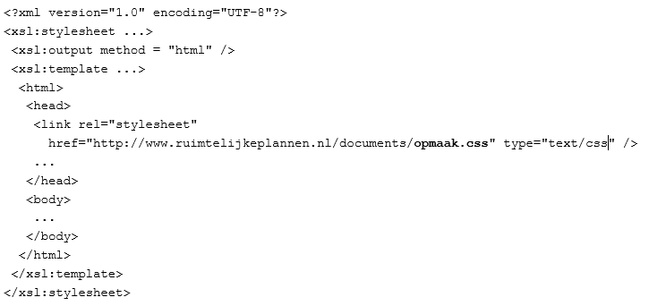

# Beschikbaar stellen

**De bronbestanden van ieder ruimtelijk instrument moeten beschikbaar worden
gesteld door de bronhouder. In dit hoofdstuk worden de eisen voor deze
beschikbaarstelling toegelicht, inclusief inhoud en opbouw van het manifest en
geleideformulier, dat hier een belangrijk onderdeel van is.**

<figure id='doo201'></img>
<figcaption>De planvoorraad van de bronhouder</figcaption></figure>
 

## Eisen aan de beschikbaarstelling

Ruimtelijke instrumenten worden op grond van de Wro door gemeente, provincie of Rijk beschikbaar gesteld op internet. Omdat ieder ruimtelijk instrument bestaat uit een
samenhangende set van bronbestanden die samen het instrument vormen, bestaat het
feitelijke proces van beschikbaar stellen er uit dat deze bestanden op een
webserver worden geplaatst die via een vast webadres (URL) benaderbaar is via
het internet.  
 

Alle bronbestanden van een enkel instrument worden binnen één virtuele directory
beschikbaar gesteld die door de bronhouder zelf gekozen kan worden. Er wordt
daarbij gewerkt met relatieve URL's (bijvoorbeeld bij de illustraties in HTML of
de verwijzingen naar de onderdelen in het geleideformulier). Hierdoor blijven de
bronbestanden bruikbaar indien deze in zijn geheel in een andere
raadpleegomgeving wordt gebruikt.
Bijvoorbeeld op basis van durperdam.nl (een niet bestaande voorbeeldsite) als een instrument met idn NL.IMRO.1111.visie2012-0012 beschikbaar
gesteld wordt:

https://ro.durperdam.nl/visie2012/0012/</u>

dan worden alle bij dit instrument behorende bestanden direct in deze virtuele
directory geplaatst.
  

Het IMRO GML bestand van dit instrument wordt dus beschikbaar gesteld op:  
https://ro.durperdam.nl/visie2012/0012/NL.IMRO.1111.visie2012-0012.gml  
  

Beschikbaarstellen van elementen binnen een andere virtuele directory of in een
subdirectory binnen de virtuele directory is niet toegestaan. Het is dus niet
toegestaan het GML bestand bijvoorbeeld als volgt beschikbaar te stellen
(foutieve elementen <u>onderstreept</u>
en in rood):

https://ro.durperdam.nl/visie2012/0012/<u>IMRO</u>/NL.IMRO.1111.visie2012-0012.gml of

https://ro.durperdam.nl/visie2012<u>/</u>NL.IMRO.1111.visie2012-0012.gml of

https://<u>www.roservice.nl</u>/visie2012/0012/NL.IMRO.1111.visie2012-0012.gml.
  

Overigens is het wel toegestaan om binnen dezelfde virtuele directory bestanden
toe te voegen, bijvoorbeeld:

https://ro.durperdam.nl/visie2012/0012/index.htm

is dus toegestaan. De index.htm pagina is dus geen onderdeel van het ruimtelijk
instrument zelf, maar wordt in dit voorbeeld gebruikt voor de inrichting van de
informatievoorziening door de bronhouder.

## Opbouw Manifest en Geleideformulier

Het Manifest is een XML bestand dat een overzicht geeft van alle elektronisch
beschikbaar gestelde ruimtelijke instrumenten van één bronhouder. Iedere
bronhouder heeft conform de STRI2012 één actueel Manifest beschikbaar op een via
het internet toegankelijk webadres (bijvoorbeeld een webadres als
https://ro.durperdam.nl/manifest.xml). In het manifest is ordening aangebracht
met behulp van dossiers. Overigens kan een bronhouder naast het STRI2012 manifest ook 
een STRI2006 manifest beschikbaar hebben gesteld ten behoeven van IMRO2006 plannen. 
De opbouw van het 2006 manifest wordt toegelicht in de <a href='https://ro-standaarden.geonovum.nl/2008/facultatief/STRI2006-v1.3.2.pdf' target='_blank'>STRI2006</a>. Opschonen van het 2006 manifest komt aan de orde in <a href='#H08'>hoofdstuk 8 ‘beheer van de planvoorraad’</a>. 
  

**Dossier**  
In een dossier zijn één of meerdere ruimtelijke plannen opgenomen. Het dossier
is daarmee het ordenend element in het manifest waarbinnen alle ruimtelijke
instrumenten met een identiek dossiernummer worden geplaatst. Bij het plaatsen
van plannen in dossiers wordt de volgende stelregel gehanteerd: 

_Ieder ruimtelijk plan dat een zelfstandige Wro, Awb of Wabo procedure kent,
krijgt ook een eigen dossier._
  

Bronhouders hebben de keuze om gerechtelijke uitspraken in een separaat dossier op te nemen of in het dossier van het bestemmingsplan (of andere ruimtelijk plan) waar zij bij horen. Wijzigingen, uitwerkingen en omgevingsvergunningen komen ieder in een eigen dossier en kunnen, indien dit van toepassing is, direct verwijzen naar een plan waar dit
betrekking op heeft. De verwijzing zit in het attribuut
_VerwijzingNaarExternPlanInfo_ dat aan het plangebied van deze wijziging,
uitwerking en omgevingsvergunning is gekoppeld.
  

Voorbereidingsbesluiten en bestemmingsplannen kunnen in hetzelfde dossier
opgenomen worden, omdat de Wro bepaalt dat “de gemeenteraad kan verklaren dat
een bestemmingsplan wordt voorbereid”, als _onderdeel_ van de
bestemmingsplanprocedure. In dat geval heeft het dossier de status “in
voorbereiding” met daarin het (vastgestelde) voorbereidingsbesluit en daarna ook
het plan zelf met zijn verschillende versies en mogelijke gerechtelijke
uitspraken. Overigens is het technisch gezien in alle gevallen mogelijk om
bepaalde instrumenten _niet_ in één dossier te plaatsen. Het dossiernummer is
hierbij sturend: plannen met hetzelfde dossiernummer komen per definitie in
hetzelfde dossier, plannen met een verschillend dossiernummer komen per
definitie in verschillende dossiers terecht, maar de keuze van dossiernummer is
aan de gebruiker.
  

De bronhouder houdt deze status per dossiernummer bij iedere wijziging actueel.
In het Manifest zijn alle beschikbare ruimtelijk instrumenten gerangschikt per
dossier. Dit betekent dat alle plannen met hetzelfde dossiernummer conform de
betekenis in Hoofdstuk 5 van de STRI2012 gerangschikt zijn binnen een
\<Dossier\>
element, conceptueel als volgt:

Naast het Manifest wordt bij ieder ruimtelijk instrument een geleideformulier
meegeleverd voor een gedetailleerd overzicht van het desbetreffende individuele
instrument. Ook het geleideformulier is een XML bestand. Manifest en
  
Geleideformulier zijn beide voorzien van een waarmerk, zie <a href='#H06'>Hoofdstuk 6</a>.

**Status van een ruimtelijk instrument versus status van het Dossier**

In de systematiek van beschikbaar stellen wordt als uitgangspunt gehanteerd dat
de planstatus onveranderlijk is en in het IMRO-GML bestand en
geleideformulier is opgenomen. De status van het dossier is daarentegen
dynamisch en wordt alleen beschikbaar gesteld in het Manifest. De volgende
aandachtspunten zijn hierbij van belang:

- Er is een onderscheid aangebracht tussen status van het ruimtelijk
  instrument en de status van het dossier waar het plan binnen valt;
- Ieder plan kent een (statische) planstatus die niet aan verandering
  onderhevig is, en die dus ook niet gewijzigd wordt door een veranderde
  dossierstatus. Een plan hoeft nooit opnieuw te worden gewaarmerkt en
  beschikbaar gesteld ten gevolge van een wijziging van de dossierstatus. Alle
  dynamische (proces-)informatie wordt alleen opgenomen in het Manifest;
- Een versie “geconsolideerd” van een ruimtelijk instrument wordt in een
  separaat dossier gepubliceerd;
- De status van het instrument is vastgelegd in de IMRO-GML en het XML
  geleideformulier;
- Ieder plan valt binnen een dossier;
- De status van het dossier is dynamisch en wordt vastgelegd en beschikbaar
  gesteld in het Manifest;
- Het Manifest bevat minder informatie over een instrument dan het
  geleideformulier. Alleen de Naam, Datum, Id en de URL naar het
  desbetreffende geleideformulier worden opgenomen;
- Gerechtelijke uitspraken op het plan worden niet verwerkt in het plan,
  waarmee het authentieke plan na uitspraak blijft zoals het is. Het
  vastgestelde plan is daarmee het laatste plan dat beschikbaar wordt gesteld,
  afgezien van een separaat dossier met een versie “geconsolideerd” waar het
  desbetreffende plan in verwerkt kan worden. Hierna wordt alleen nog de
  Status van het dossier aangepast;
- De status die wordt weergegeven bij ieder dossier is altijd de actuele
  status. Dit is dus een dynamische waarde.
    

**BasisURL**  
In het geleideformulier wordt de BasisURL gebruikt bij de Onderdelen en
Supplementen. Dit zorgt er voor dat alle bronbestanden binnen dezelfde virtuele
directory worden geplaatst, omdat het niet mogelijk is om per bestand een
volledige URL te specificeren.

## Werkwijze bij het beschikbaar stellen

Bij het beschikbaarstellen van een ruimtelijk instrument hoort een bepaalde
werkwijze. Allereerst zal het ruimtelijk instrument elektronisch worden
gewaarmerkt. Vervolgens worden alle bronbestanden op internet beschikbaar
gemaakt, en wordt het Manifest aangepast en vervolgens ook gewaarmerkt. Tot slot
moet het al bestaande <a href='https://www.ruimtelijkeplannen.nl/index' target='_blank'>weblocatie</a> beschikbaar gestelde Manifest vervangen worden door het
gewijzigde Manifest. Dit laatste gebeurt overigens veelal in geautomatiseerde systemen, zoals bij de landelijke voorziening <a href='httpss://www.ruimtelijkeplannen.nl/' target='_blank'>Ruimtelijkeplannen.nl</a>. Daarna is het ruimtelijk instrument voor een ieder beschikbaar, raadpleegbaar en via het Manifest ook vindbaar. De werkwijze
is weergegeven in Figuur 1. 

  
**Figuur 1 Primair proces beschikbaar stellen**
  

Een ruimtelijk instrument kan in de totstandkoming diverse statussen doorlopen.
Voor een aantal formele versies is het beschikbaar stellen wettelijk vereist.
Voor alle overige versies is beschikbaar stellen mogelijk, maar niet verplicht.

## Beschikbaar stellen van opmaakbestanden

De opmaak van planteksten wordt voor een belangrijk deel niet in de plantekst
zelf geregeld maar in een apart opmaakbestand. Voor niet-objectgerichte
planteksten in HTML- en/of PDF-formaat geldt dat de bronhouder een eigen CSS
stylesheet (opmaakbestand) kan mee sturen met de plantekstbestanden. De
landelijke voorziening Ruimtelijkeplannen.nl maakt bij de verbeelding gebruik van het opmaakbestand en daarmee de huisstijl van de bronhouder toepassen. Ook derden kunnen van dit opmaakbestand gebruik maken.
  

**_Gebruik van PDF-bestanden_** 
Indien er PDF-bestanden worden gebruikt in een set van bronbestanden, wordt aangeraden om PDF- bestanden te gebruiken die geen flashcomponenten bevatten. Bestanden met flashcomponenten kunnen om veiligheidsredenen niet meer in een webbrowser worden geopend waardoor de PDF-bestanden bij raadpleging van Ruimtelijkeplannen.nl geen inhoud bevatten. Controleer daarom vóór publicatie dat uw PDF-documenten geen Flashcomponenten bevatten. 
  

**_Objectgerichte planteksten in XML_** 
Voor objectgerichte planteksten in XML-formaat volgens de IMROPT2012-standaard
is er (sinds versie 2.2.10 van Ruimtelijkeplannen.nl) landelijk één standaard
lay-out en presentatie. Kenmerk van objectgericht werken is dat vorm en inhoud
gescheiden zijn. Bronhouders kunnen nog wel een opmaakbestand (.CSS) meeleveren
voor gebruik door derden maar Ruimtelijkeplannen.nl maakt hier geen gebruik van.
  

Ten behoeve van het weergeven van objectgerichte XML planteksten wordt gebruik
gemaakt van 2 soorten opmaakbestanden:

- XSL stylesheet ten behoeve van het omzetten van objectgericht XML naar HTML;
- CSS stylesheet ten behoeve van de visuele opmaak van de HTML.
    

Een XSL stylesheet transformeert de objectgerichte plantekst van XML naar
leesbare HTML tekst. Een CSS stylesheet voegt daar een standaard lay-out en
presentatie aan toe.  
De objectgerichte planteksten worden bij Ruimtelijkeplannen.nl opgeslagen in hun
oorspronkelijke XML formaat. Pas op het moment dat de tekst geraadpleegd wordt
via de website, wordt de tekst in XML-formaat getransformeerd in HTML. Hiervoor
wordt een centraal transformatieschema gebruikt: het IMROPT2012.xsl. Dit
transformatieschema bepaalt de functionaliteit van de uiteindelijke webpagina.
Daaraan gekoppeld is er een opmaakbestand (CSS) dat de uiteindelijke opmaak van
de webpagina bepaalt en daarmee van de tekst tijdens het raadplegen. Sinds juli
2015 wordt bij objectgerichte planteksten in Ruimtelijkeplannen.nl alleen nog
maar gewerkt met een standaard CSS bestand. Bronhouders kunnen eenmalig een
organisatielogo aanleveren dat door Ruimtelijkplannen.nl getoond wordt in
de opmaak van de uiteindelijke webpagina. Voor bronhouders is een handleiding beschikbaar via de besloten omgeving voor bronhouders van Ruimtelijkeplannen.nl en via de helpdesk van Ruimtelijkeplannen.nl.
 

Bij het werken met objectgerichte XML planteksten wordt gebruik gemaakt van
standaard XSL en CSS stylesheets die onderdeel zijn van de RO Standaarden. Deze standaard XSL en CSS zijn tezamen met de rest van de andere onderdelen van de RO Standaarden 2012 beschikbaar via de <a href='https://www.geonovum.nl/geo-standaarden/ro-standaarden-ruimtelijke-ordening' target='_blank'>Geonovum website, pagina RO Standaarden</a>.
De landelijke voorziening Ruimtelijkeplannen.nl maakt van de standaard opmaak
gebruik, maar ook andere applicaties / implementaties kunnen van de standaard
opmaak gebruik maken.
  

Het is nog steeds mogelijk dat een bronhouder gebruik maakt van een eigen opmaak
voor objectgerichte planteksten voor een eigen viewer. In het geval de
bronhouder gebruik gemaakt van een eigen opmaak voor objectgerichte planteksten,
kan deze meegeleverd worden maar Ruimtelijkeplannen.nl zal hier niets mee doen.

Voor het weergeven van planteksten zijn er vier mogelijkheden:

1. HTML planregels zonder eigen CSS opmaakbestand;
2. HTML planregels met eigen CSS opmaakbestand;
3. XML planteksten zonder eigen CSS opmaakbestand;
4. XML planteksten met eigen CSS opmaakbestand.
     

**Ad. 1. HTML planregels zonder eigen CSS opmaakbestand**  
De niet-objectgerichte planregels zijn vastgelegd in een HTML of XHTML bestand
dat wordt opgevoerd in het geleideformulier bij het element \<Onderdelen\>. In
het HTML bestand wordt niet verwezen naar een eigen CSS bestand en conform de
Webrichtlijnen bevat de HTML geen eigen lay-out en presentatie.
  

**Ad. 2. HTML planregels met eigen CSS opmaakbestand**  
De niet-objectgerichte planregels zijn vastgelegd in een HTML of XHTML bestand
dat wordt opgevoerd in het geleideformulier bij het element \<Onderdelen\>.
Daarbij heeft de bronhouder een eigen CSS opmaakbestand beschikbaar gesteld voor
de lay-out en presentatie van deze planregels. Dit CSS bestand wordt in het
geleideformulier opgenomen bij het element \<Supplementen\>. In het HTML bestand
wordt naar dit CSS bestand verwezen met behulp van een relatieve URL, als volgt:

\<link href="**eigenopmaak.css**" rel="stylesheet" type="text/css" /\>
  

In de praktijk komt het voor dat vanuit het CSS bestand wordt verwezen naar
externe bronnen, bijvoorbeeld een logo of andere externe afbeeldingen, die op
een externe URL te vinden zijn. Dit betekent dat de bronhouder er voor moet
zorgen deze externe bronnen minstens gedurende de gehele looptijd van het
ruimtelijke plan blijven bestaan. Een randvoorwaarde blijft dat de gehele inhoud
van het plan raadpleegbaar moet zijn op het moment dat deze externe bronnen niet
beschikbaar zijn. Het gaat hierbij om lay-out en presentatie, nooit om inhoud.
  

**Ad. 3. XML planteksten zonder eigen CSS opmaakbestand**
De bronhouder maakt gebruik van objectgerichte XML planteksten. De toelichting
en regels zijn in één XML bestand opgenomen. Dit bestand wordt in het
geleideformulier opgenomen bij het element \<Onderdelen\>.

Wanneer de bronhouder geen eigen opmaak gebruikt, kan gebruik worden gemaakt van
de standaard opmaak XSL en CSS bestanden uit het pakket RO Standaarden 2012. De
interactieve raadpleegomgeving transformeert de XML planteksten met behulp van
de standaard XSL naar HTML teksten. In de standaard XSL wordt verwezen naar de
standaard CSS lay-out en presentatie. De gebruiker van de interactieve
raadpleegomgeving merkt niets van het feit dat de XML planteksten worden
getransformeerd.

De landelijke voorzienig Ruimtelijkeplannen.nl maakt ook gebruik van de
standaard opmaak. Conceptueel ziet de XSL van Ruimtelijkeplannen.nl er als volgt
uit:

 

**Ad. 4. XML planteksten met eigen CSS opmaakbestand**
De bronhouder maakt gebruik van objectgerichte XML planteksten. De toelichting
en regels zijn in één XML bestand opgenomen. Dit bestand wordt in het
geleideformulier opgenomen bij het element \<Onderdelen\>. Daarbij heeft de
bronhouder een eigen CSS opmaakbestand beschikbaar gesteld voor de lay-out en
presentatie van deze planteksten. Dit CSS bestand wordt in het geleideformulier
opgenomen bij het element \<Supplementen\>.

Ruimtelijkeplannen.nl zal niets met dit CSS-bestand doen omdat deze gebruik
maakt van de standaard opmaak. De bronhouder kan het CSS-bestand bijvoorbeeld
gebruiken in een eigen viewer.

De XML planteksten worden eerst getransformeerd naar leesbare HTML met behulp
van de standaard XSL stylesheet. Op deze HTML wordt vervolgens het eigen CSS
bestand toegepast voor de lay-out en presentatie.

Bronhouder stelt dus bijvoorbeeld beschikbaar:

  
Deze twee bestanden worden als volgt in het geleidformulier opgenomen:

  

Bij de transformatie van de XML planteksten naar HTML wordt in de resulterende
HTML verwezen naar het eigen CSS bestand, conceptueel als volgt:

## Periode van beschikbaarheid

De bronbestanden van iedere beschikbaar gestelde versie van een ruimtelijk instrument blijven toegankelijk totdat een instrument onherroepelijk in werking is getreden of is vervallen. Dit is vastgelegd in het Besluit ruimtelijke ordening (Bro). Voor instrumenten waar beroep tegen mogelijk is blijven de bronbestanden toegankelijk tot ofwel nadat de beroepstermijn is afgelopen en er geen beroep is ingesteld, ofwel nadat de beroepsprocedure is afgerond. Voor instrumenten waar geen beroep tegen mogelijk is blijven de bronbestanden toegankelijk tot nadat het besluit is vastgesteld. Op dat moment blijven in elk geval de actuele versie van het instrument en alle eventuele reactieve aanwijzingen en gerechtelijke uitspraken beschikbaar. 
  

Om verwarring bij de bezoeker van het Omgevingsloket te voorkomen is het raadzaam dat de bronhouder eerdere versies van het plan verwijderd uit het Manifest en van het weblocatie. Pas als een instrument vervallen is, mag het in zijn geheel worden verwijderd uit het Manifest en van de weblocatie. Los van het feit of de stukken wel of niet beschikbaar blijven via het Manifest, is in vrijwel alle gevallen de Archiefwet van toepassing op deze stukken. Zie hiervoor de handreiking <a href='https://docs.geostandaarden.nl/ro/arp/' target='_blank'>Archiveren ruimtelijke plannen</a>. 
  

In <a href='#H08'>hoofdstuk 8 ‘beheer van de planvoorraad’</a> wordt verder ingegaan op het opschonen van de planvoorraad en het wijzigen van reeds eerder gepubliceerde plannen. 

## Beschrijving planstatussen

Het is van groot belang dat duidelijk is wat er met iedere status wordt bedoeld.
Hier onder wordt daartoe een toelichting gegeven.  

**Tabel 2 Planstatus**

| **Planstatus** | **Betekenis**                                                                                                                                                                                                                                                                                                                                                                                                                                                                                                                                 |
| -------------- | --------------------------------------------------------------------------------------------------------------------------------------------------------------------------------------------------------------------------------------------------------------------------------------------------------------------------------------------------------------------------------------------------------------------------------------------------------------------------------------------------------------------------------------------- |
| concept        | Concept is een informele status. Deze status kan worden toegekend aan alle versies van een plan zonder wettelijke status. Vaak zal de allereerste versie van een plan een concept zijn, maar het is ook mogelijk dat er bij het verwerken van de zienswijzen op het ontwerp weer nieuwe concepten ontstaan, ter voorbereiding op een vastgesteld plan.                                                                                                                                                                                            |
| voorontwerp    | Voorontwerp is een niet-wettelijk verplichte status. Deze status wordt desgewenst toegekend aan plannen die tijdens het vooroverleg worden gebruikt en/of in het kader van de inspraak ter inzage worden gelegd. Na de voorbereidingsfase worden er geen nieuwe voorontwerpen meer gemaakt                                                                                                                                                                                                                                                            |
| ontwerp        | Ontwerp is een formele status. Deze status wordt toegekend aan de versie van een plan die formeel ter inzage wordt gelegd. Voor bestemmingsplannen gebeurt dit in het kader van artikel 3.8 Wro en artikel 3.11 Awb.                                                                                                                                                                                                                                                                                                                              |
| vastgesteld    | Vastgesteld is een formele status. Deze status wordt toegekend aan de vastgestelde versie van het plan. Indien er een reactieve aanwijzing is gegeven, dan wordt deze aanwijzing niet verwerkt in het plan. De afnemer interpreteert zelf het plan en de reactieve aanwijzing.                                                                                                                                                                                                                                                                        |
| geconsolideerd | Het staat de bronhouder vrij om, naast de afzonderlijke plannen, planinformatie in geïntegreerde vorm beschikbaar te stellen, op een manier dat steeds de op een bepaald moment geldende situatie wordt weergegeven voor een bepaald stuk grondgebied: de versie geconsolideerd. Deze status wordt toegekend aan dit soort plannen. De status geconsolideerd is dus geen volgtijdelijke status na vastgesteld, maar is een op zichzelf staande planstatus die in een separaat dossier met de status geconsolideerd beschikbaar wordt gesteld. |

Hierboven wordt vooral ingegaan op de planstatus van een bestemmingsplan. Ook
bij de andere instrumenten kunnen vergelijkbare statussen worden toegekend. De
keuze is gelijk aan bovenstaande lijst, maar de logische toekenning en betekenis
verschilt per instrument.

## Beschrijving dossierstatussen met overgangen

Onder meer op basis van de dossierstatus, wordt bepaald of het plan wel of niet op de juiste wijze zichtbaar is in de viewer van het Omgevingsloket. Bijvoorbeeld: wanneer een plan met de planstatus ‘vastgesteld’ in werkelijkheid ‘geheel onherroepelijk in werking’ is, maar de dossierstatus van dit plan staat nog op ‘in voorbereiding’, dan zal dit plan niet als ‘geldende regelgeving’ in het Omgevingsloket worden getoond. Het is dus van groot belang voor de bezoeker van het Omgevingsloket dat de dossierstatus door de bronhouder goed is aangegeven. 

 
<b>De meest voorkomende fouten met de dossierstatus zijn</b>:
<ul><li>Vastgestelde plannen (en/of onherroepelijk plannen IMRO2008) staan in een dossier dat op ‘in voorbereiding’ staat;</li>
<li>Vastgestelde plannen waarbij het dossier na de beroepstermijn op ‘vastgesteld’ blijft staan;</li>
<li>Plannen die geen beroep/bezwaartermijn kennen die dossierstatus 'vastgesteld' krijgen, waar dat 'geheel onherroepelijk in werking' moet zijn.</li>
</ul> 

Deze fouten kunnen worden voorkomen door de dossierstatus in het manifest aan te passen. Let daarop dat de juiste dossierstatus gekozen wordt. Het aanpassen van de dossierstatus is voor de bronhouder relatief eenvoudig. Aan het plan hoeft niets te worden gewijzigd. Uitsluitend het manifest wordt aangepast in de Wro-plansoftware van de bronhouder waarmee ook het plan beschikbaar wordt gesteld op Ruimtelijkeplannen.nl. 
  

<i>Let op: Bij de planstatus ‘vastgesteld’ wijzigt de plantstatus niet meer, maar alleen nog maar de dossierstatus.</i>
  

In onderstaande Tabel 3 is een toelichting gegeven op de dossierstatus met overgangen bij de bestemmingsplanprocedure. Bij andere ruimtelijke instrumenten gelden soortgelijke procedures, die echter op detailniveau zullen verschillen.  

**Tabel 3 Dossierstatus bij de bestemmingsplanprocedure**

| **Dossierstatus**                | **Betekenis**                                                                                                                                                                                                                                                                                                                                                                                                                                                                                                                                                                                                                                                                                                                                                                                                                                                                                                                                                                                                                                      | **beschikbaar stellen/ verwijderen indien van toepassing**                                                                                                                                                                               |
| -------------------------------- | -------------------------------------------------------------------------------------------------------------------------------------------------------------------------------------------------------------------------------------------------------------------------------------------------------------------------------------------------------------------------------------------------------------------------------------------------------------------------------------------------------------------------------------------------------------------------------------------------------------------------------------------------------------------------------------------------------------------------------------------------------------------------------------------------------------------------------------------------------------------------------------------------------------------------------------------------------------------------------------------------------------------------------------------------- | ---------------------------------------------------------------------------------------------------------------------------------------------------------------------------------------------------------------------------------------- |
| in voorbereiding                 | De dossierstatus ‘in voorbereiding’ wordt toegekend vanaf de eerste beschikbaarstelling, wat bij de bestemmingsplanprocedure mogelijk een voorbereidingsbesluit kan zijn. Mogelijke instrumenten daar op volgend zijn informele concepten en/of een voorontwerp. Daarna wordt het ontwerp bestemmingsplan beschikbaar gesteld en ter inzage gelegd. Na afloop van de terinzagelegging beantwoordt en verwerkt de bronhouder de zienswijzen. Vervolgens wordt het plan vastgesteld en het vastgestelde plan beschikbaar gesteld. Als er een reactieve aanwijzing is gegeven waardoor een onderdeel van het plan geen deel meer uitmaakt van het plan, dan wordt deze aanwijzing niet verwerkt in het vastgestelde plan. Het bevoegd gezag dat de aanwijzing heeft gegeven stelt de reactieve aanwijzing via het eigen manifest in een eigen dossier beschikbaar, met in de aanwijzing een verwijzing naar het plan waar het zich toe richt. De dossierstatus in voorbereiding eindigt gelijktijdig met het beschikbaar stellen van het vastgestelde bestemmingsplan. | Beschikbaar stellen:<ul><li>voorbereidingsbesluit</li><li>concept plan</li><li>voorontwerp plan</li><li>ontwerp plan</li></ul>                                                                                                           |
| vastgesteld                      | De dossierstatus ‘vastgesteld’ wordt toegekend op het moment dat het vastgestelde plan beschikbaar wordt gesteld. Na de beschikbaarstelling van het vastgestelde plan is er beroep tegen het plan mogelijk. De dossierstatus vastgesteld eindigt op het moment dat er bij het bevoegde gezag duidelijkheid is of er beroep is ingesteld en/of er verzoeken voor een voorlopige voorziening zijn ingediend. De dossierstatus moet nu in het manifest worden gewijzigd naar de actuele waarde en het gewijzigde manifest moet weer beschikbaar worden gesteld.                                                                                                                                                                                                                                                                                                                                                                                                                                                                                                                    | Beschikbaar stellen:<ul><li>vastgesteld plan</li></ul>                                                                                                                                                                                  |
| geheel in werking                | De dossierstatus ‘geheel in werking’ wordt toegekend indien er beroep is ingesteld tegen het vastgestelde plan zonder dat er een verzoek om voorlopige voorziening (vovo) is ingediend of indien dit verzoek is afgewezen. De uitspraak over het eventuele verzoek om voorlopige voorziening wordt door de bronhouder beschikbaar gesteld. De dossierstatus geheel in werking eindigt met de uitspraak in de beroepsprocedure. De dossierstatus moet nu in het manifest worden gewijzigd naar de actuele waarde en het gewijzigde manifest moet weer beschikbaar worden gesteld.                                                                                                                                                                                                                                                                                                                                                                                                                                                                                     | Beschikbaar stellen:<ul><li>uitspraak vovo met contour</li></ul>                                                                                                                                                                        |
| deels in werking                 | De dossierstatus ´deels in werking´ wordt toegekend als ten gevolge van het toewijzen van het verzoek om voorlopige voorziening het plan slechts gedeeltelijk in werking treedt. De uitspraak over het eventuele verzoek om voorlopige voorziening wordt door de bronhouder beschikbaar gesteld. De dossierstatus deels in werking eindigt met de uitspraak in de beroepsprocedure. De dossierstatus moet nu in het manifest worden gewijzigd naar de actuele waarde en het gewijzigde manifest moet weer beschikbaar worden gesteld.                                                                                                                                                                                                                                                                                                                                                                                                                                                                                                                               | Beschikbaar stellen:<ul><li>uitspraak vovo met contour</li></ul>                                                                                                                                                                        |
| niet in werking                  | De dossierstatus ´niet in werking´ wordt toegekend als ten gevolge van het toewijzen van een voorlopige voorziening het plan in het geheel niet in werking treedt. De uitspraak over het verzoek om voorlopige voorziening wordt door de bronhouder beschikbaar gesteld. De dossierstatus niet in werking eindigt met de uitspraak in de beroepsprocedure. De dossierstatus moet nu in het manifest worden gewijzigd naar de actuele waarde en het gewijzigde manifest moet weer beschikbaar worden gesteld.                                                                                                                                                                                                                                                                                                                                                                                                                                                                                                                                                       | Beschikbaar stellen:<ul><li>uitspraak vovo met contour</li></ul>                                                                                                                                                                        |
| geheel onherroepelijk in werking | De dossierstatus ´geheel onherroepelijk in werking´ wordt toegekend indien er na vaststelling geen beroep is ingesteld, of indien er wel beroep is ingesteld maar de uitspraak op het beroep niet tot gevolg heeft dat het plan deels of geheel niet in werking treedt. De dossierstatus geheel onherroepelijk in werking eindigt als het plan vervalt.                                                                                                                                                                                                                                                                                                                                                                                                                                                                                                                                                                                                                                                                                                                             | Beschikbaar stellen:<ul><li>uitspraak beroep met contour/</li></ul>Verwijderen mogelijk:<ul><li>voorbereidingsbesluit</li><li>concept plan</li><li>voorontwerp plan</li><li>ontwerp plan</li><li>uitspraak beroep met contour</li></ul> |
| deels onherroepelijk in werking  | De dossierstatus ´deels onherroepelijk in werking´ wordt toegekend indien de uitspraak op het beroep tot gevolg heeft dat het plan deels niet in werking treedt. De dossierstatus deels onherroepelijk in werking eindigt als het plan vervalt.                                                                                                                                                                                                                                                                                                                                                                                                                                                                                                                                                                                                                                                                                                                                                                                                                                    | Beschikbaar stellen:<ul><li>uitspraak beroep met contour/</li></ul>Verwijderen mogelijk:<ul><li>voorbereidingsbesluit</li><li>concept plan</li><li>voorontwerp plan</li><li>ontwerp plan</li><li>uitspraak vovo met contour</li></ul>   |
| vervallen                        | De dossierstatus ´vervallen´ wordt toegekend indien het plan door de uitspraak op het beroep of door een nieuw plan is vervallen of indien het plan is ingetrokken. N.B. In dit geval mogen alle stukken door de bronhouder van internet worden verwijderd. Echter, sommige bevoegde gezagen willen deze historische plannen graag elektronisch beschikbaar stellen, daarom is deze status toegevoegd.                                                                                                                                                                                                                                                                                                                                                                                                                                                                                                                                                                                                                                                       | Verwijderen mogelijk:<ul><li>vastgesteld plan/</li><li>uitspraak beroep met contour</li></ul>                                                                                                                                           |
| geconsolideerd                   | De dossierstatus ´geconsolideerd´ wordt toegekend indien er geconsolideerde plannen beschikbaar worden gesteld door de bronhouder. Dossiers met de status geconsolideerd kunnen alleen geconsolideerde plannen bevatten. De status geconsolideerd is dus geen volgtijdelijke status na de inwerkingtreding.                                                                                                                                                                                                                                                                                                                                                                                                                                                                                                                                                                                                                                                                                                                                                       | Beschikbaar stellen:<ul><li>geconsolideerd plan</li></ul>                                                                                                                                                                               |

 
De dossierstatus overgangen voor de bestemmingsplanprocedure zijn samengevat in Tabel 4. In [Bijlage 2](#B02) is voor het bestemmingsplan de beroepsprocedure verder uitgewerkt. Per stap is aangeven of het bestemmingsplan, dan wel de dossierstatus moet worden aangepast.

<table id="d4e21" style="width: 100%;">
  <caption>Tabel 4 Mogelijke dossierstatus overgangen in bestemmingsplanprocedure</caption>
  <colgroup>
    <col id="col1" style="width: 4.284362751723206%;">
      <col id="col2" style="width: 44.073523449114745%;">
        <col id="col3" style="width: 5.744019462089471%;">
          <col id="col4" style="width: 5.744019462089471%;">
            <col id="col5" style="width: 5.744019462089471%;">
              <col id="col6" style="width: 5.75753480200027%;">
                <col id="col7" style="width: 5.744019462089471%;">
                  <col id="col8" style="width: 5.744019462089471%;">
                    <col id="col9" style="width: 5.744019462089471%;">
                      <col id="col10" style="width: 5.75753480200027%;">
                        <col id="col11" style="width: 5.662927422624679%;">
  </colgroup>
  <tbody>
    <tr>
      <td style="border-top: 0pt none #000000; border-left: 0pt none #000000; border-bottom: 0pt none #000000; border-right: 0pt none #000000;"></td>
      <td style="border-top: 0pt none #000000; border-left: 0pt none #000000; border-bottom: 0pt none #000000; border-right: 0.5pt solid #000000;"></td>
      <td style="border-top: 0.5pt solid #000000; border-left: 0.5pt solid #000000; border-bottom: 0.5pt solid #000000; border-right: 0.5pt solid #000000;" colspan="9">
        

          <i>Naar</i>
        

      </td>
    </tr>
    <tr>
      <td style="height: 8em; border-top: 0pt none #000000; border-left: 0pt none #000000; border-bottom: 0.5pt solid #000000; border-right: 0pt none #000000;"></td>
      <td style="height: 8em; border-top: 0pt none #000000; border-left: 0pt none #000000; border-bottom: 0.5pt solid #000000; border-right: 0.5pt solid #000000;"></td>
      <td style="height: 8em; padding-top: 0.5em; border-top: 0.5pt solid #000000; border-left: 0.5pt solid #000000; border-bottom: 0.5pt solid #000000; border-right: 0.5pt solid #000000;">
        
in voorbereiding

      </td>
      <td style="height: 8em; padding-top: 0.5em; border-top: 0.5pt solid #000000; border-left: 0.5pt solid #000000; border-bottom: 0.5pt solid #000000; border-right: 0.5pt solid #000000;">
        
vastgesteld

      </td>
      <td style="height: 8em; padding-top: 0.5em; border-top: 0.5pt solid #000000; border-left: 0.5pt solid #000000; border-bottom: 0.5pt solid #000000; border-right: 0.5pt solid #000000;">
        
geheel in werking

      </td>
      <td style="height: 8em; padding-top: 0.5em; border-top: 0.5pt solid #000000; border-left: 0.5pt solid #000000; border-bottom: 0.5pt solid #000000; border-right: 0.5pt solid #000000;">
        
deels in werking

      </td>
      <td style="height: 8em; padding-top: 0.5em; border-top: 0.5pt solid #000000; border-left: 0.5pt solid #000000; border-bottom: 0.5pt solid #000000; border-right: 0.5pt solid #000000;">
        
niet in werking

      </td>
      <td style="height: 8em; padding-top: 0.5em; border-top: 0.5pt solid #000000; border-left: 0.5pt solid #000000; border-bottom: 0.5pt solid #000000; border-right: 0.5pt solid #000000;">
        
geheel onherroepelijk in werking

      </td>
      <td style="height: 8em; padding-top: 0.5em; border-top: 0.5pt solid #000000; border-left: 0.5pt solid #000000; border-bottom: 0.5pt solid #000000; border-right: 0.5pt solid #000000;">
        
deels onherroepelijk in werking

      </td>
      <td style="height: 8em; padding-top: 0.5em; border-top: 0.5pt solid #000000; border-left: 0.5pt solid #000000; border-bottom: 0.5pt solid #000000; border-right: 1.5pt solid #000000;">
        
vervallen

      </td>
      <td style="height: 8em; padding-top: 0.5em; border-top: 0.5pt solid #000000; border-left: 1.5pt solid #000000; border-bottom: 0.5pt solid #000000; border-right: 0.5pt solid #000000;">
        
geconsolideerd

      </td>
    </tr>
    <tr>
      <td style="padding-top: 0.5em; border-top: 0.5pt solid #000000; border-left: 0.5pt solid #000000; border-bottom: 0.5pt solid #000000; border-right: 0.5pt solid #000000;" rowspan="9">
        

          <i>Van</i>
        

      </td>
      <td style="border-top: 0.5pt solid #000000; border-left: 0.5pt solid #000000; border-bottom: 0.5pt solid #000000; border-right: 0.5pt solid #000000;">
        
in voorbereiding

      </td>
      <td style="border-top: 0.5pt solid #000000; border-left: 0.5pt solid #000000; border-bottom: 0.5pt solid #000000; border-right: 0.5pt solid #000000;"></td>
      <td style="border-top: 0.5pt solid #000000; border-left: 0.5pt solid #000000; border-bottom: 0.5pt solid #000000; border-right: 0.5pt solid #000000;">
        

          <b>x</b>
        

      </td>
      <td style="border-top: 0.5pt solid #000000; border-left: 0.5pt solid #000000; border-bottom: 0.5pt solid #000000; border-right: 0.5pt solid #000000;"></td>
      <td style="border-top: 0.5pt solid #000000; border-left: 0.5pt solid #000000; border-bottom: 0.5pt solid #000000; border-right: 0.5pt solid #000000;"></td>
      <td style="border-top: 0.5pt solid #000000; border-left: 0.5pt solid #000000; border-bottom: 0.5pt solid #000000; border-right: 0.5pt solid #000000;"></td>
      <td style="border-top: 0.5pt solid #000000; border-left: 0.5pt solid #000000; border-bottom: 0.5pt solid #000000; border-right: 0.5pt solid #000000;"></td>
      <td style="border-top: 0.5pt solid #000000; border-left: 0.5pt solid #000000; border-bottom: 0.5pt solid #000000; border-right: 0.5pt solid #000000;"></td>
      <td style="border-top: 0.5pt solid #000000; border-left: 0.5pt solid #000000; border-bottom: 0.5pt solid #000000; border-right: 1.5pt solid #000000;">
        

          <b>x</b>
        

      </td>
      <td style="border-top: 0.5pt solid #000000; border-left: 1.5pt solid #000000; border-bottom: 0.5pt solid #000000; border-right: 0.5pt solid #000000;"></td>
    </tr>
    <tr>
      <td style="border-top: 0.5pt solid #000000; border-left: 0.5pt solid #000000; border-bottom: 0.5pt solid #000000; border-right: 0.5pt solid #000000;">
        
Vastgesteld

      </td>
      <td style="border-top: 0.5pt solid #000000; border-left: 0.5pt solid #000000; border-bottom: 0.5pt solid #000000; border-right: 0.5pt solid #000000;"></td>
      <td style="border-top: 0.5pt solid #000000; border-left: 0.5pt solid #000000; border-bottom: 0.5pt solid #000000; border-right: 0.5pt solid #000000;"></td>
      <td style="border-top: 0.5pt solid #000000; border-left: 0.5pt solid #000000; border-bottom: 0.5pt solid #000000; border-right: 0.5pt solid #000000;">
        

          <b>x</b>
        

      </td>
      <td style="border-top: 0.5pt solid #000000; border-left: 0.5pt solid #000000; border-bottom: 0.5pt solid #000000; border-right: 0.5pt solid #000000;">
        

          <b>x</b>
        

      </td>
      <td style="border-top: 0.5pt solid #000000; border-left: 0.5pt solid #000000; border-bottom: 0.5pt solid #000000; border-right: 0.5pt solid #000000;">
        

          <b>x</b>
        

      </td>
      <td style="border-top: 0.5pt solid #000000; border-left: 0.5pt solid #000000; border-bottom: 0.5pt solid #000000; border-right: 0.5pt solid #000000;">
        

          <b>x</b>
        

      </td>
      <td style="border-top: 0.5pt solid #000000; border-left: 0.5pt solid #000000; border-bottom: 0.5pt solid #000000; border-right: 0.5pt solid #000000;"></td>
      <td style="border-top: 0.5pt solid #000000; border-left: 0.5pt solid #000000; border-bottom: 0.5pt solid #000000; border-right: 1.5pt solid #000000;"></td>
      <td style="border-top: 0.5pt solid #000000; border-left: 1.5pt solid #000000; border-bottom: 0.5pt solid #000000; border-right: 0.5pt solid #000000;"></td>
    </tr>
    <tr>
      <td style="border-top: 0.5pt solid #000000; border-left: 0.5pt solid #000000; border-bottom: 0.5pt solid #000000; border-right: 0.5pt solid #000000;">
        
geheel in werking

      </td>
      <td style="border-top: 0.5pt solid #000000; border-left: 0.5pt solid #000000; border-bottom: 0.5pt solid #000000; border-right: 0.5pt solid #000000;"></td>
      <td style="border-top: 0.5pt solid #000000; border-left: 0.5pt solid #000000; border-bottom: 0.5pt solid #000000; border-right: 0.5pt solid #000000;"></td>
      <td style="border-top: 0.5pt solid #000000; border-left: 0.5pt solid #000000; border-bottom: 0.5pt solid #000000; border-right: 0.5pt solid #000000;"></td>
      <td style="border-top: 0.5pt solid #000000; border-left: 0.5pt solid #000000; border-bottom: 0.5pt solid #000000; border-right: 0.5pt solid #000000;"></td>
      <td style="border-top: 0.5pt solid #000000; border-left: 0.5pt solid #000000; border-bottom: 0.5pt solid #000000; border-right: 0.5pt solid #000000;"></td>
      <td style="border-top: 0.5pt solid #000000; border-left: 0.5pt solid #000000; border-bottom: 0.5pt solid #000000; border-right: 0.5pt solid #000000;">
        

          <b>x</b>
        

      </td>
      <td style="border-top: 0.5pt solid #000000; border-left: 0.5pt solid #000000; border-bottom: 0.5pt solid #000000; border-right: 0.5pt solid #000000;">
        

          <b>x</b>
        

      </td>
      <td style="border-top: 0.5pt solid #000000; border-left: 0.5pt solid #000000; border-bottom: 0.5pt solid #000000; border-right: 1.5pt solid #000000;">
        

          <b>x</b>
        

      </td>
      <td style="border-top: 0.5pt solid #000000; border-left: 1.5pt solid #000000; border-bottom: 0.5pt solid #000000; border-right: 0.5pt solid #000000;"></td>
    </tr>
    <tr>
      <td style="border-top: 0.5pt solid #000000; border-left: 0.5pt solid #000000; border-bottom: 0.5pt solid #000000; border-right: 0.5pt solid #000000;">
        
deels in werking

      </td>
      <td style="border-top: 0.5pt solid #000000; border-left: 0.5pt solid #000000; border-bottom: 0.5pt solid #000000; border-right: 0.5pt solid #000000;"></td>
      <td style="border-top: 0.5pt solid #000000; border-left: 0.5pt solid #000000; border-bottom: 0.5pt solid #000000; border-right: 0.5pt solid #000000;"></td>
      <td style="border-top: 0.5pt solid #000000; border-left: 0.5pt solid #000000; border-bottom: 0.5pt solid #000000; border-right: 0.5pt solid #000000;"></td>
      <td style="border-top: 0.5pt solid #000000; border-left: 0.5pt solid #000000; border-bottom: 0.5pt solid #000000; border-right: 0.5pt solid #000000;"></td>
      <td style="border-top: 0.5pt solid #000000; border-left: 0.5pt solid #000000; border-bottom: 0.5pt solid #000000; border-right: 0.5pt solid #000000;"></td>
      <td style="border-top: 0.5pt solid #000000; border-left: 0.5pt solid #000000; border-bottom: 0.5pt solid #000000; border-right: 0.5pt solid #000000;">
        

          <b>x</b>
        

      </td>
      <td style="border-top: 0.5pt solid #000000; border-left: 0.5pt solid #000000; border-bottom: 0.5pt solid #000000; border-right: 0.5pt solid #000000;">
        

          <b>x</b>
        

      </td>
      <td style="border-top: 0.5pt solid #000000; border-left: 0.5pt solid #000000; border-bottom: 0.5pt solid #000000; border-right: 1.5pt solid #000000;">
        

          <b>x</b>
        

      </td>
      <td style="border-top: 0.5pt solid #000000; border-left: 1.5pt solid #000000; border-bottom: 0.5pt solid #000000; border-right: 0.5pt solid #000000;"></td>
    </tr>
    <tr>
      <td style="border-top: 0.5pt solid #000000; border-left: 0.5pt solid #000000; border-bottom: 0.5pt solid #000000; border-right: 0.5pt solid #000000;">
        
niet in werking

      </td>
      <td style="border-top: 0.5pt solid #000000; border-left: 0.5pt solid #000000; border-bottom: 0.5pt solid #000000; border-right: 0.5pt solid #000000;"></td>
      <td style="border-top: 0.5pt solid #000000; border-left: 0.5pt solid #000000; border-bottom: 0.5pt solid #000000; border-right: 0.5pt solid #000000;"></td>
      <td style="border-top: 0.5pt solid #000000; border-left: 0.5pt solid #000000; border-bottom: 0.5pt solid #000000; border-right: 0.5pt solid #000000;"></td>
      <td style="border-top: 0.5pt solid #000000; border-left: 0.5pt solid #000000; border-bottom: 0.5pt solid #000000; border-right: 0.5pt solid #000000;"></td>
      <td style="border-top: 0.5pt solid #000000; border-left: 0.5pt solid #000000; border-bottom: 0.5pt solid #000000; border-right: 0.5pt solid #000000;"></td>
      <td style="border-top: 0.5pt solid #000000; border-left: 0.5pt solid #000000; border-bottom: 0.5pt solid #000000; border-right: 0.5pt solid #000000;">
        

          <b>x</b>
        

      </td>
      <td style="border-top: 0.5pt solid #000000; border-left: 0.5pt solid #000000; border-bottom: 0.5pt solid #000000; border-right: 0.5pt solid #000000;">
        

          <b>x</b>
        

      </td>
      <td style="border-top: 0.5pt solid #000000; border-left: 0.5pt solid #000000; border-bottom: 0.5pt solid #000000; border-right: 1.5pt solid #000000;">
        

          <b>x</b>
        

      </td>
      <td style="border-top: 0.5pt solid #000000; border-left: 1.5pt solid #000000; border-bottom: 0.5pt solid #000000; border-right: 0.5pt solid #000000;"></td>
    </tr>
    <tr>
      <td style="border-top: 0.5pt solid #000000; border-left: 0.5pt solid #000000; border-bottom: 0.5pt solid #000000; border-right: 0.5pt solid #000000;">
        
geheel onherroepelijk in werking

      </td>
      <td style="border-top: 0.5pt solid #000000; border-left: 0.5pt solid #000000; border-bottom: 0.5pt solid #000000; border-right: 0.5pt solid #000000;"></td>
      <td style="border-top: 0.5pt solid #000000; border-left: 0.5pt solid #000000; border-bottom: 0.5pt solid #000000; border-right: 0.5pt solid #000000;"></td>
      <td style="border-top: 0.5pt solid #000000; border-left: 0.5pt solid #000000; border-bottom: 0.5pt solid #000000; border-right: 0.5pt solid #000000;"></td>
      <td style="border-top: 0.5pt solid #000000; border-left: 0.5pt solid #000000; border-bottom: 0.5pt solid #000000; border-right: 0.5pt solid #000000;"></td>
      <td style="border-top: 0.5pt solid #000000; border-left: 0.5pt solid #000000; border-bottom: 0.5pt solid #000000; border-right: 0.5pt solid #000000;"></td>
      <td style="border-top: 0.5pt solid #000000; border-left: 0.5pt solid #000000; border-bottom: 0.5pt solid #000000; border-right: 0.5pt solid #000000;"></td>
      <td style="border-top: 0.5pt solid #000000; border-left: 0.5pt solid #000000; border-bottom: 0.5pt solid #000000; border-right: 0.5pt solid #000000;"></td>
      <td style="border-top: 0.5pt solid #000000; border-left: 0.5pt solid #000000; border-bottom: 0.5pt solid #000000; border-right: 1.5pt solid #000000;">
        

          <b>x</b>
        

      </td>
      <td style="border-top: 0.5pt solid #000000; border-left: 1.5pt solid #000000; border-bottom: 0.5pt solid #000000; border-right: 0.5pt solid #000000;"></td>
    </tr>
    <tr>
      <td style="border-top: 0.5pt solid #000000; border-left: 0.5pt solid #000000; border-bottom: 0.5pt solid #000000; border-right: 0.5pt solid #000000;">
        
deels onherroepelijk in werking

      </td>
      <td style="border-top: 0.5pt solid #000000; border-left: 0.5pt solid #000000; border-bottom: 0.5pt solid #000000; border-right: 0.5pt solid #000000;"></td>
      <td style="border-top: 0.5pt solid #000000; border-left: 0.5pt solid #000000; border-bottom: 0.5pt solid #000000; border-right: 0.5pt solid #000000;"></td>
      <td style="border-top: 0.5pt solid #000000; border-left: 0.5pt solid #000000; border-bottom: 0.5pt solid #000000; border-right: 0.5pt solid #000000;"></td>
      <td style="border-top: 0.5pt solid #000000; border-left: 0.5pt solid #000000; border-bottom: 0.5pt solid #000000; border-right: 0.5pt solid #000000;"></td>
      <td style="border-top: 0.5pt solid #000000; border-left: 0.5pt solid #000000; border-bottom: 0.5pt solid #000000; border-right: 0.5pt solid #000000;"></td>
      <td style="border-top: 0.5pt solid #000000; border-left: 0.5pt solid #000000; border-bottom: 0.5pt solid #000000; border-right: 0.5pt solid #000000;">
        

          <b>x</b>
        

      </td>
      <td style="border-top: 0.5pt solid #000000; border-left: 0.5pt solid #000000; border-bottom: 0.5pt solid #000000; border-right: 0.5pt solid #000000;"></td>
      <td style="border-top: 0.5pt solid #000000; border-left: 0.5pt solid #000000; border-bottom: 0.5pt solid #000000; border-right: 1.5pt solid #000000;">
        

          <b>x</b>
        

      </td>
      <td style="border-top: 0.5pt solid #000000; border-left: 1.5pt solid #000000; border-bottom: 0.5pt solid #000000; border-right: 0.5pt solid #000000;"></td>
    </tr>
    <tr>
      <td style="border-top: 0.5pt solid #000000; border-left: 0.5pt solid #000000; border-bottom: 1.5pt solid #000000; border-right: 0.5pt solid #000000;">
        
Vervallen

      </td>
      <td style="border-top: 0.5pt solid #000000; border-left: 0.5pt solid #000000; border-bottom: 1.5pt solid #000000; border-right: 0.5pt solid #000000;"></td>
      <td style="border-top: 0.5pt solid #000000; border-left: 0.5pt solid #000000; border-bottom: 1.5pt solid #000000; border-right: 0.5pt solid #000000;"></td>
      <td style="border-top: 0.5pt solid #000000; border-left: 0.5pt solid #000000; border-bottom: 1.5pt solid #000000; border-right: 0.5pt solid #000000;"></td>
      <td style="border-top: 0.5pt solid #000000; border-left: 0.5pt solid #000000; border-bottom: 1.5pt solid #000000; border-right: 0.5pt solid #000000;"></td>
      <td style="border-top: 0.5pt solid #000000; border-left: 0.5pt solid #000000; border-bottom: 1.5pt solid #000000; border-right: 0.5pt solid #000000;"></td>
      <td style="border-top: 0.5pt solid #000000; border-left: 0.5pt solid #000000; border-bottom: 1.5pt solid #000000; border-right: 0.5pt solid #000000;"></td>
      <td style="border-top: 0.5pt solid #000000; border-left: 0.5pt solid #000000; border-bottom: 1.5pt solid #000000; border-right: 0.5pt solid #000000;"></td>
      <td style="border-top: 0.5pt solid #000000; border-left: 0.5pt solid #000000; border-bottom: 1.5pt solid #000000; border-right: 1.5pt solid #000000;"></td>
      <td style="border-top: 0.5pt solid #000000; border-left: 1.5pt solid #000000; border-bottom: 1.5pt solid #000000; border-right: 0.5pt solid #000000;"></td>
    </tr>
    <tr>
      <td style="border-top: 1.5pt solid #000000; border-left: 0.5pt solid #000000; border-bottom: 0.5pt solid #000000; border-right: 0.5pt solid #000000;">
        
Geconsolideerd

      </td>
      <td style="border-top: 1.5pt solid #000000; border-left: 0.5pt solid #000000; border-bottom: 0.5pt solid #000000; border-right: 0.5pt solid #000000;"></td>
      <td style="border-top: 1.5pt solid #000000; border-left: 0.5pt solid #000000; border-bottom: 0.5pt solid #000000; border-right: 0.5pt solid #000000;"></td>
      <td style="border-top: 1.5pt solid #000000; border-left: 0.5pt solid #000000; border-bottom: 0.5pt solid #000000; border-right: 0.5pt solid #000000;"></td>
      <td style="border-top: 1.5pt solid #000000; border-left: 0.5pt solid #000000; border-bottom: 0.5pt solid #000000; border-right: 0.5pt solid #000000;"></td>
      <td style="border-top: 1.5pt solid #000000; border-left: 0.5pt solid #000000; border-bottom: 0.5pt solid #000000; border-right: 0.5pt solid #000000;"></td>
      <td style="border-top: 1.5pt solid #000000; border-left: 0.5pt solid #000000; border-bottom: 0.5pt solid #000000; border-right: 0.5pt solid #000000;"></td>
      <td style="border-top: 1.5pt solid #000000; border-left: 0.5pt solid #000000; border-bottom: 0.5pt solid #000000; border-right: 0.5pt solid #000000;"></td>
      <td style="border-top: 1.5pt solid #000000; border-left: 0.5pt solid #000000; border-bottom: 0.5pt solid #000000; border-right: 1.5pt solid #000000;"></td>
      <td style="border-top: 1.5pt solid #000000; border-left: 1.5pt solid #000000; border-bottom: 0.5pt solid #000000; border-right: 0.5pt solid #000000;">
        

          <b>x</b>
        

      </td>
    </tr>
  </tbody>
</table>

Ook bij de andere instrumenten worden statussen toegekend en vinden overgangen
plaats. De keuze is gelijk aan Tabel 4, maar de logische toekenning en
betekenis verschilt per instrument.

In de basis kan er een onderscheid worden gemaakt tussen besluiten waartegen
beroep mogelijk is en besluiten waartegen dit niet mogelijk is. Voor de volgende
instrumenten geldt dat hiertegen geen rechtstreeks beroep mogelijk is:

- voorbereidingsbesluit;
- beheersverordening;
- provinciale verordening;
- AMvB met onderliggende ministeriële regelingen;
- structuurvisie.
    

Voor deze besluiten zonder beroepsmogelijkheid zijn in algemene zin alleen de
dossierstatussen van toepassing: in voorbereiding, geheel onherroepelijk in
werking, vervallen en geconsolideerd. Dit is mede afhankelijk van de procedure;
kent het instrument de mogelijkheid of verplichting een ontwerp ter inzage te
leggen of wordt het besluit zonder voorbereidingsprocedure genomen zoals bij het
voorbereidingsbesluit. In Tabel 5 is van de ruimtelijke instrumenten anders dan
het bestemmingsplan, een overzicht opgenomen. Dit is een inhoudelijke richtlijn;
er zijn geen technische beperkingen aangebracht. In <a href='#B01'>Bijlage 1</a> is hierop een
beknopte toelichting gegeven.  
  

Voor besluiten waar wel beroep tegen mogelijk is zijn alle dossierstatussen en
beschreven overgangen in <a href='#beschrijving-dossierstatussen-met-overgangen'>Tabel 3</a> van toepassing; of de dossierstatus 'in
voorbereiding' aan de orde is hangt af of er een voorbereidingsprocedure wordt
toegepast.

<table id="d4e1125" style="width: 100%;">
  <caption>Tabel 5 Ruimtelijke instrumenten met mogelijke en dossierstatussen</caption>
  <colgroup>
    <col id="col1" style="width: 46.04631460039536%;">
    <col id="col2" style="width: 6.001129624399887%;">
    <col id="col3" style="width: 6.001129624399887%;">
    <col id="col4" style="width: 6.001129624399887%;">
    <col id="col5" style="width: 6.015249929398475%;">
    <col id="col6" style="width: 6.001129624399887%;">
    <col id="col7" style="width: 6.001129624399887%;">
    <col id="col8" style="width: 6.001129624399887%;">
    <col id="col9" style="width: 6.015249929398475%;">
    <col id="col10" style="width: 5.916407794408359%;">
  </colgroup>
  <tbody>
    <tr>
      <td style="height: 8em; border-top: 0pt none #000000; border-left: 0pt none #000000; border-bottom: 0.5pt solid #000000; border-right: 0.5pt solid #000000;"></td>
      <td style="height: 8em; padding-top: 0.5em; border-top: 0.5pt solid #000000; border-left: 0.5pt solid #000000; border-bottom: 0.5pt solid #000000; border-right: 0.5pt solid #000000;">
        
in voorbereiding

      </td>
      <td style="height: 8em; padding-top: 0.5em; border-top: 0.5pt solid #000000; border-left: 0.5pt solid #000000; border-bottom: 0.5pt solid #000000; border-right: 0.5pt solid #000000;">
        
Vastgesteld

      </td>
      <td style="height: 8em; padding-top: 0.5em; border-top: 0.5pt solid #000000; border-left: 0.5pt solid #000000; border-bottom: 0.5pt solid #000000; border-right: 0.5pt solid #000000;">
        
geheel in werking

      </td>
      <td style="height: 8em; padding-top: 0.5em; border-top: 0.5pt solid #000000; border-left: 0.5pt solid #000000; border-bottom: 0.5pt solid #000000; border-right: 0.5pt solid #000000;">
        
deels in werking

      </td>
      <td style="height: 8em; padding-top: 0.5em; border-top: 0.5pt solid #000000; border-left: 0.5pt solid #000000; border-bottom: 0.5pt solid #000000; border-right: 0.5pt solid #000000;">
        
niet in werking

      </td>
      <td style="height: 8em; padding-top: 0.5em; border-top: 0.5pt solid #000000; border-left: 0.5pt solid #000000; border-bottom: 0.5pt solid #000000; border-right: 0.5pt solid #000000;">
        
geheel onherroepelijk in werking

      </td>
      <td style="height: 8em; padding-top: 0.5em; border-top: 0.5pt solid #000000; border-left: 0.5pt solid #000000; border-bottom: 0.5pt solid #000000; border-right: 0.5pt solid #000000;">
        
deels onherroepelijk in werking

      </td>
      <td style="height: 8em; padding-top: 0.5em; border-top: 0.5pt solid #000000; border-left: 0.5pt solid #000000; border-bottom: 0.5pt solid #000000; border-right: 0.5pt solid #000000;">
        
vervallen

      </td>
      <td style="height: 8em; padding-top: 0.5em; border-top: 0.5pt solid #000000; border-left: 0.5pt solid #000000; border-bottom: 0.5pt solid #000000; border-right: 0.5pt solid #000000;">
        
geconsolideerd

      </td>
    </tr>
    <tr>
      <td style="border-top: 0.5pt solid #000000; border-left: 0.5pt solid #000000; border-bottom: 0.5pt solid #000000; border-right: 0.5pt solid #000000;">
        
AMvB

      </td>
      <td style="border-top: 0.5pt solid #000000; border-left: 0.5pt solid #000000; border-bottom: 0.5pt solid #000000; border-right: 0.5pt solid #000000;">
        

          <b>X</b>
        

      </td>
      <td style="border-top: 0.5pt solid #000000; border-left: 0.5pt solid #000000; border-bottom: 0.5pt solid #000000; border-right: 0.5pt solid #000000;"></td>
      <td style="border-top: 0.5pt solid #000000; border-left: 0.5pt solid #000000; border-bottom: 0.5pt solid #000000; border-right: 0.5pt solid #000000;"></td>
      <td style="border-top: 0.5pt solid #000000; border-left: 0.5pt solid #000000; border-bottom: 0.5pt solid #000000; border-right: 0.5pt solid #000000;"></td>
      <td style="border-top: 0.5pt solid #000000; border-left: 0.5pt solid #000000; border-bottom: 0.5pt solid #000000; border-right: 0.5pt solid #000000;"></td>
      <td style="border-top: 0.5pt solid #000000; border-left: 0.5pt solid #000000; border-bottom: 0.5pt solid #000000; border-right: 0.5pt solid #000000;">
        

          <b>X</b>
        

      </td>
      <td style="border-top: 0.5pt solid #000000; border-left: 0.5pt solid #000000; border-bottom: 0.5pt solid #000000; border-right: 0.5pt solid #000000;"></td>
      <td style="border-top: 0.5pt solid #000000; border-left: 0.5pt solid #000000; border-bottom: 0.5pt solid #000000; border-right: 0.5pt solid #000000;">
        

          <b>X</b>
        

      </td>
      <td style="border-top: 0.5pt solid #000000; border-left: 0.5pt solid #000000; border-bottom: 0.5pt solid #000000; border-right: 0.5pt solid #000000;">
        

          <b>X</b>
        

      </td>
    </tr>
    <tr>
      <td style="border-top: 0.5pt solid #000000; border-left: 0.5pt solid #000000; border-bottom: 0.5pt solid #000000; border-right: 0.5pt solid #000000;">
        
Beheersverordening

      </td>
      <td style="border-top: 0.5pt solid #000000; border-left: 0.5pt solid #000000; border-bottom: 0.5pt solid #000000; border-right: 0.5pt solid #000000;">
        

          <b>X</b>
        

      </td>
      <td style="border-top: 0.5pt solid #000000; border-left: 0.5pt solid #000000; border-bottom: 0.5pt solid #000000; border-right: 0.5pt solid #000000;"></td>
      <td style="border-top: 0.5pt solid #000000; border-left: 0.5pt solid #000000; border-bottom: 0.5pt solid #000000; border-right: 0.5pt solid #000000;"></td>
      <td style="border-top: 0.5pt solid #000000; border-left: 0.5pt solid #000000; border-bottom: 0.5pt solid #000000; border-right: 0.5pt solid #000000;"></td>
      <td style="border-top: 0.5pt solid #000000; border-left: 0.5pt solid #000000; border-bottom: 0.5pt solid #000000; border-right: 0.5pt solid #000000;"></td>
      <td style="border-top: 0.5pt solid #000000; border-left: 0.5pt solid #000000; border-bottom: 0.5pt solid #000000; border-right: 0.5pt solid #000000;">
        

          <b>X</b>
        

      </td>
      <td style="border-top: 0.5pt solid #000000; border-left: 0.5pt solid #000000; border-bottom: 0.5pt solid #000000; border-right: 0.5pt solid #000000;"></td>
      <td style="border-top: 0.5pt solid #000000; border-left: 0.5pt solid #000000; border-bottom: 0.5pt solid #000000; border-right: 0.5pt solid #000000;">
        

          <b>X</b>
        

      </td>
      <td style="border-top: 0.5pt solid #000000; border-left: 0.5pt solid #000000; border-bottom: 0.5pt solid #000000; border-right: 0.5pt solid #000000;">
        

          <b>X</b>
        

      </td>
    </tr>
    <tr>
      <td style="border-top: 0.5pt solid #000000; border-left: 0.5pt solid #000000; border-bottom: 0.5pt solid #000000; border-right: 0.5pt solid #000000;">
        
Exploitatieplan

      </td>
      <td style="border-top: 0.5pt solid #000000; border-left: 0.5pt solid #000000; border-bottom: 0.5pt solid #000000; border-right: 0.5pt solid #000000;">
        

          <b>X</b>
        

      </td>
      <td style="border-top: 0.5pt solid #000000; border-left: 0.5pt solid #000000; border-bottom: 0.5pt solid #000000; border-right: 0.5pt solid #000000;">
        

          <b>X</b>
        

      </td>
      <td style="border-top: 0.5pt solid #000000; border-left: 0.5pt solid #000000; border-bottom: 0.5pt solid #000000; border-right: 0.5pt solid #000000;">
        

          <b>X</b>
        

      </td>
      <td style="border-top: 0.5pt solid #000000; border-left: 0.5pt solid #000000; border-bottom: 0.5pt solid #000000; border-right: 0.5pt solid #000000;">
        

          <b>X</b>
        

      </td>
      <td style="border-top: 0.5pt solid #000000; border-left: 0.5pt solid #000000; border-bottom: 0.5pt solid #000000; border-right: 0.5pt solid #000000;">
        

          <b>X</b>
        

      </td>
      <td style="border-top: 0.5pt solid #000000; border-left: 0.5pt solid #000000; border-bottom: 0.5pt solid #000000; border-right: 0.5pt solid #000000;">
        

          <b>X</b>
        

      </td>
      <td style="border-top: 0.5pt solid #000000; border-left: 0.5pt solid #000000; border-bottom: 0.5pt solid #000000; border-right: 0.5pt solid #000000;">
        

          <b>X</b>
        

      </td>
      <td style="border-top: 0.5pt solid #000000; border-left: 0.5pt solid #000000; border-bottom: 0.5pt solid #000000; border-right: 0.5pt solid #000000;">
        

          <b>X</b>
        

      </td>
      <td style="border-top: 0.5pt solid #000000; border-left: 0.5pt solid #000000; border-bottom: 0.5pt solid #000000; border-right: 0.5pt solid #000000;">
        

          <b>X</b>
        

      </td>
    </tr>
    <tr>
      <td style="border-top: 0.5pt solid #000000; border-left: 0.5pt solid #000000; border-bottom: 0.5pt solid #000000; border-right: 0.5pt solid #000000;">
        
Omgevingsvergunning

      </td>
      <td style="border-top: 0.5pt solid #000000; border-left: 0.5pt solid #000000; border-bottom: 0.5pt solid #000000; border-right: 0.5pt solid #000000;"></td>
      <td style="border-top: 0.5pt solid #000000; border-left: 0.5pt solid #000000; border-bottom: 0.5pt solid #000000; border-right: 0.5pt solid #000000;">
        

          <b>X</b>
        

      </td>
      <td style="border-top: 0.5pt solid #000000; border-left: 0.5pt solid #000000; border-bottom: 0.5pt solid #000000; border-right: 0.5pt solid #000000;">
        

          <b>X</b>
        

      </td>
      <td style="border-top: 0.5pt solid #000000; border-left: 0.5pt solid #000000; border-bottom: 0.5pt solid #000000; border-right: 0.5pt solid #000000;">
        

          <b>X</b>
        

      </td>
      <td style="border-top: 0.5pt solid #000000; border-left: 0.5pt solid #000000; border-bottom: 0.5pt solid #000000; border-right: 0.5pt solid #000000;">
        

          <b>X</b>
        

      </td>
      <td style="border-top: 0.5pt solid #000000; border-left: 0.5pt solid #000000; border-bottom: 0.5pt solid #000000; border-right: 0.5pt solid #000000;">
        

          <b>X</b>
        

      </td>
      <td style="border-top: 0.5pt solid #000000; border-left: 0.5pt solid #000000; border-bottom: 0.5pt solid #000000; border-right: 0.5pt solid #000000;">
        

          <b>X</b>
        

      </td>
      <td style="border-top: 0.5pt solid #000000; border-left: 0.5pt solid #000000; border-bottom: 0.5pt solid #000000; border-right: 0.5pt solid #000000;">
        

          <b>X</b>
        

      </td>
      <td style="border-top: 0.5pt solid #000000; border-left: 0.5pt solid #000000; border-bottom: 0.5pt solid #000000; border-right: 0.5pt solid #000000;">
        

          <b>X</b>
        

      </td>
    </tr>
    <tr>
      <td style="border-top: 0.5pt solid #000000; border-left: 0.5pt solid #000000; border-bottom: 0.5pt solid #000000; border-right: 0.5pt solid #000000;">
        
Proactieve aanwijzing 

      </td>
      <td style="border-top: 0.5pt solid #000000; border-left: 0.5pt solid #000000; border-bottom: 0.5pt solid #000000; border-right: 0.5pt solid #000000;">
        

          <b>X</b>
        

      </td>
      <td style="border-top: 0.5pt solid #000000; border-left: 0.5pt solid #000000; border-bottom: 0.5pt solid #000000; border-right: 0.5pt solid #000000;">
        

          <b>X</b>
        

      </td>
      <td style="border-top: 0.5pt solid #000000; border-left: 0.5pt solid #000000; border-bottom: 0.5pt solid #000000; border-right: 0.5pt solid #000000;">
        

          <b>X</b>
        

      </td>
      <td style="border-top: 0.5pt solid #000000; border-left: 0.5pt solid #000000; border-bottom: 0.5pt solid #000000; border-right: 0.5pt solid #000000;">
        

          <b>X</b>
        

      </td>
      <td style="border-top: 0.5pt solid #000000; border-left: 0.5pt solid #000000; border-bottom: 0.5pt solid #000000; border-right: 0.5pt solid #000000;">
        

          <b>X</b>
        

      </td>
      <td style="border-top: 0.5pt solid #000000; border-left: 0.5pt solid #000000; border-bottom: 0.5pt solid #000000; border-right: 0.5pt solid #000000;">
        

          <b>X</b>
        

      </td>
      <td style="border-top: 0.5pt solid #000000; border-left: 0.5pt solid #000000; border-bottom: 0.5pt solid #000000; border-right: 0.5pt solid #000000;">
        

          <b>X</b>
        

      </td>
      <td style="border-top: 0.5pt solid #000000; border-left: 0.5pt solid #000000; border-bottom: 0.5pt solid #000000; border-right: 0.5pt solid #000000;">
        

          <b>X</b>
        

      </td>
      <td style="border-top: 0.5pt solid #000000; border-left: 0.5pt solid #000000; border-bottom: 0.5pt solid #000000; border-right: 0.5pt solid #000000;">
        

          <b>X</b>
        

      </td>
    </tr>
    <tr>
      <td style="border-top: 0.5pt solid #000000; border-left: 0.5pt solid #000000; border-bottom: 0.5pt solid #000000; border-right: 0.5pt solid #000000;">
        
Provinciale verordening

      </td>
      <td style="border-top: 0.5pt solid #000000; border-left: 0.5pt solid #000000; border-bottom: 0.5pt solid #000000; border-right: 0.5pt solid #000000;">
        

          <b>X</b>
        

      </td>
      <td style="border-top: 0.5pt solid #000000; border-left: 0.5pt solid #000000; border-bottom: 0.5pt solid #000000; border-right: 0.5pt solid #000000;"></td>
      <td style="border-top: 0.5pt solid #000000; border-left: 0.5pt solid #000000; border-bottom: 0.5pt solid #000000; border-right: 0.5pt solid #000000;"></td>
      <td style="border-top: 0.5pt solid #000000; border-left: 0.5pt solid #000000; border-bottom: 0.5pt solid #000000; border-right: 0.5pt solid #000000;"></td>
      <td style="border-top: 0.5pt solid #000000; border-left: 0.5pt solid #000000; border-bottom: 0.5pt solid #000000; border-right: 0.5pt solid #000000;"></td>
      <td style="border-top: 0.5pt solid #000000; border-left: 0.5pt solid #000000; border-bottom: 0.5pt solid #000000; border-right: 0.5pt solid #000000;">
        

          <b>X</b>
        

      </td>
      <td style="border-top: 0.5pt solid #000000; border-left: 0.5pt solid #000000; border-bottom: 0.5pt solid #000000; border-right: 0.5pt solid #000000;"></td>
      <td style="border-top: 0.5pt solid #000000; border-left: 0.5pt solid #000000; border-bottom: 0.5pt solid #000000; border-right: 0.5pt solid #000000;">
        

          <b>X</b>
        

      </td>
      <td style="border-top: 0.5pt solid #000000; border-left: 0.5pt solid #000000; border-bottom: 0.5pt solid #000000; border-right: 0.5pt solid #000000;">
        

          <b>X</b>
        

      </td>
    </tr>
    <tr>
      <td style="border-top: 0.5pt solid #000000; border-left: 0.5pt solid #000000; border-bottom: 0.5pt solid #000000; border-right: 0.5pt solid #000000;">
        
Reactieve aanwijzing 

      </td>
      <td style="border-top: 0.5pt solid #000000; border-left: 0.5pt solid #000000; border-bottom: 0.5pt solid #000000; border-right: 0.5pt solid #000000;"></td>
      <td style="border-top: 0.5pt solid #000000; border-left: 0.5pt solid #000000; border-bottom: 0.5pt solid #000000; border-right: 0.5pt solid #000000;">
        

          <b>X</b>
        

      </td>
      <td style="border-top: 0.5pt solid #000000; border-left: 0.5pt solid #000000; border-bottom: 0.5pt solid #000000; border-right: 0.5pt solid #000000;">
        

          <b>X</b>
        

      </td>
      <td style="border-top: 0.5pt solid #000000; border-left: 0.5pt solid #000000; border-bottom: 0.5pt solid #000000; border-right: 0.5pt solid #000000;">
        

          <b>X</b>
        

      </td>
      <td style="border-top: 0.5pt solid #000000; border-left: 0.5pt solid #000000; border-bottom: 0.5pt solid #000000; border-right: 0.5pt solid #000000;">
        

          <b>X</b>
        

      </td>
      <td style="border-top: 0.5pt solid #000000; border-left: 0.5pt solid #000000; border-bottom: 0.5pt solid #000000; border-right: 0.5pt solid #000000;">
        

          <b>X</b>
        

      </td>
      <td style="border-top: 0.5pt solid #000000; border-left: 0.5pt solid #000000; border-bottom: 0.5pt solid #000000; border-right: 0.5pt solid #000000;">
        

          <b>X</b>
        

      </td>
      <td style="border-top: 0.5pt solid #000000; border-left: 0.5pt solid #000000; border-bottom: 0.5pt solid #000000; border-right: 0.5pt solid #000000;">
        

          <b>X</b>
        

      </td>
      <td style="border-top: 0.5pt solid #000000; border-left: 0.5pt solid #000000; border-bottom: 0.5pt solid #000000; border-right: 0.5pt solid #000000;">
        

          <b>X</b>
        

      </td>
    </tr>
    <tr>
      <td style="border-top: 0.5pt solid #000000; border-left: 0.5pt solid #000000; border-bottom: 0.5pt solid #000000; border-right: 0.5pt solid #000000;">
        
Structuurvisie 

      </td>
      <td style="border-top: 0.5pt solid #000000; border-left: 0.5pt solid #000000; border-bottom: 0.5pt solid #000000; border-right: 0.5pt solid #000000;">
        

          <b>X</b>
        

      </td>
      <td style="border-top: 0.5pt solid #000000; border-left: 0.5pt solid #000000; border-bottom: 0.5pt solid #000000; border-right: 0.5pt solid #000000;"></td>
      <td style="border-top: 0.5pt solid #000000; border-left: 0.5pt solid #000000; border-bottom: 0.5pt solid #000000; border-right: 0.5pt solid #000000;"></td>
      <td style="border-top: 0.5pt solid #000000; border-left: 0.5pt solid #000000; border-bottom: 0.5pt solid #000000; border-right: 0.5pt solid #000000;"></td>
      <td style="border-top: 0.5pt solid #000000; border-left: 0.5pt solid #000000; border-bottom: 0.5pt solid #000000; border-right: 0.5pt solid #000000;"></td>
      <td style="border-top: 0.5pt solid #000000; border-left: 0.5pt solid #000000; border-bottom: 0.5pt solid #000000; border-right: 0.5pt solid #000000;">
        

          <b>X</b>
        

      </td>
      <td style="border-top: 0.5pt solid #000000; border-left: 0.5pt solid #000000; border-bottom: 0.5pt solid #000000; border-right: 0.5pt solid #000000;"></td>
      <td style="border-top: 0.5pt solid #000000; border-left: 0.5pt solid #000000; border-bottom: 0.5pt solid #000000; border-right: 0.5pt solid #000000;">
        

          <b>X</b>
        

      </td>
      <td style="border-top: 0.5pt solid #000000; border-left: 0.5pt solid #000000; border-bottom: 0.5pt solid #000000; border-right: 0.5pt solid #000000;">
        

          <b>X</b>
        

      </td>
    </tr>
    <tr>
      <td style="border-top: 0.5pt solid #000000; border-left: 0.5pt solid #000000; border-bottom: 0.5pt solid #000000; border-right: 0.5pt solid #000000;">
        
Voorbereidingsbesluit

      </td>
      <td style="border-top: 0.5pt solid #000000; border-left: 0.5pt solid #000000; border-bottom: 0.5pt solid #000000; border-right: 0.5pt solid #000000;"></td>
      <td style="border-top: 0.5pt solid #000000; border-left: 0.5pt solid #000000; border-bottom: 0.5pt solid #000000; border-right: 0.5pt solid #000000;"></td>
      <td style="border-top: 0.5pt solid #000000; border-left: 0.5pt solid #000000; border-bottom: 0.5pt solid #000000; border-right: 0.5pt solid #000000;"></td>
      <td style="border-top: 0.5pt solid #000000; border-left: 0.5pt solid #000000; border-bottom: 0.5pt solid #000000; border-right: 0.5pt solid #000000;"></td>
      <td style="border-top: 0.5pt solid #000000; border-left: 0.5pt solid #000000; border-bottom: 0.5pt solid #000000; border-right: 0.5pt solid #000000;"></td>
      <td style="border-top: 0.5pt solid #000000; border-left: 0.5pt solid #000000; border-bottom: 0.5pt solid #000000; border-right: 0.5pt solid #000000;">
        

          <b>X</b>
        

      </td>
      <td style="border-top: 0.5pt solid #000000; border-left: 0.5pt solid #000000; border-bottom: 0.5pt solid #000000; border-right: 0.5pt solid #000000;"></td>
      <td style="border-top: 0.5pt solid #000000; border-left: 0.5pt solid #000000; border-bottom: 0.5pt solid #000000; border-right: 0.5pt solid #000000;">
        

          <b>X</b>
        

      </td>
      <td style="border-top: 0.5pt solid #000000; border-left: 0.5pt solid #000000; border-bottom: 0.5pt solid #000000; border-right: 0.5pt solid #000000;">
        

          <b>X</b>
        

      </td>
    </tr>
    <tr>
      <td style="border-top: 0.5pt solid #000000; border-left: 0.5pt solid #000000; border-bottom: 0.5pt solid #000000; border-right: 0.5pt solid #000000;">
        
Welstandsnota

      </td>
      <td style="border-top: 0.5pt solid #000000; border-left: 0.5pt solid #000000; border-bottom: 0.5pt solid #000000; border-right: 0.5pt solid #000000;">
        

          <b>X</b>
        

      </td>
      <td style="border-top: 0.5pt solid #000000; border-left: 0.5pt solid #000000; border-bottom: 0.5pt solid #000000; border-right: 0.5pt solid #000000;"></td>
      <td style="border-top: 0.5pt solid #000000; border-left: 0.5pt solid #000000; border-bottom: 0.5pt solid #000000; border-right: 0.5pt solid #000000;"></td>
      <td style="border-top: 0.5pt solid #000000; border-left: 0.5pt solid #000000; border-bottom: 0.5pt solid #000000; border-right: 0.5pt solid #000000;"></td>
      <td style="border-top: 0.5pt solid #000000; border-left: 0.5pt solid #000000; border-bottom: 0.5pt solid #000000; border-right: 0.5pt solid #000000;"></td>
      <td style="border-top: 0.5pt solid #000000; border-left: 0.5pt solid #000000; border-bottom: 0.5pt solid #000000; border-right: 0.5pt solid #000000;">
        

          <b>X</b>
        

      </td>
      <td style="border-top: 0.5pt solid #000000; border-left: 0.5pt solid #000000; border-bottom: 0.5pt solid #000000; border-right: 0.5pt solid #000000;"></td>
      <td style="border-top: 0.5pt solid #000000; border-left: 0.5pt solid #000000; border-bottom: 0.5pt solid #000000; border-right: 0.5pt solid #000000;">
        

          <b>X</b>
        

      </td>
      <td style="border-top: 0.5pt solid #000000; border-left: 0.5pt solid #000000; border-bottom: 0.5pt solid #000000; border-right: 0.5pt solid #000000;">
        

          <b>X</b>
        

      </td>
    </tr>
  </tbody>
</table>
