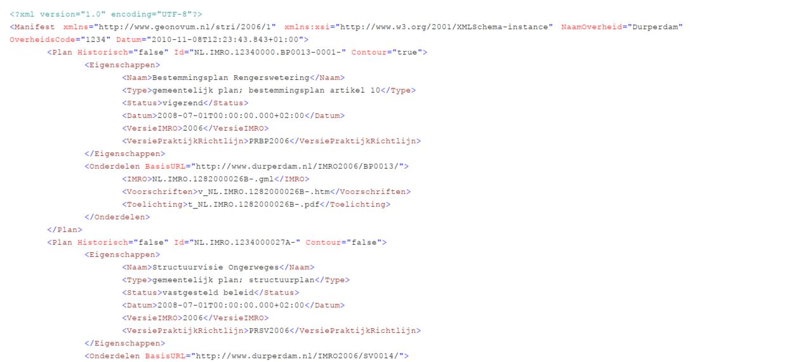
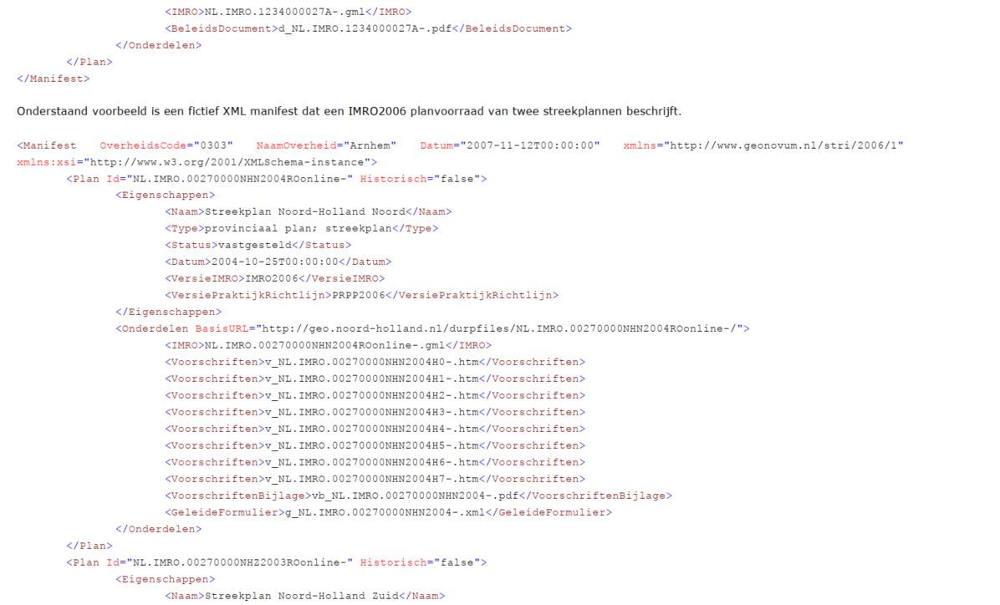
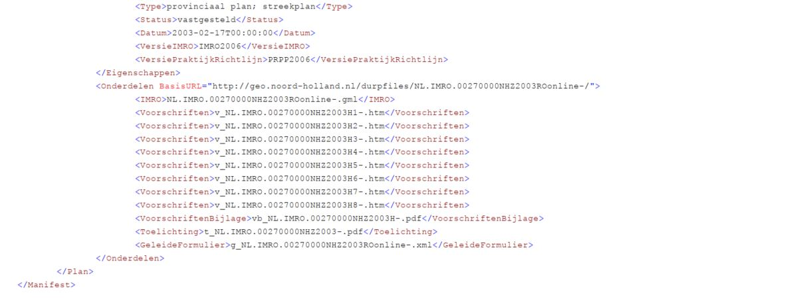

## Bijlage 2
### Voorbeeld Manifest 

Onderstaand voorbeeld is fictief: Een XML-manifest dat een IMRO2006 planvoorraad met 2 plannen beschrijft: 1 bestemmingsplan contourplan en 1 structuurplan.

