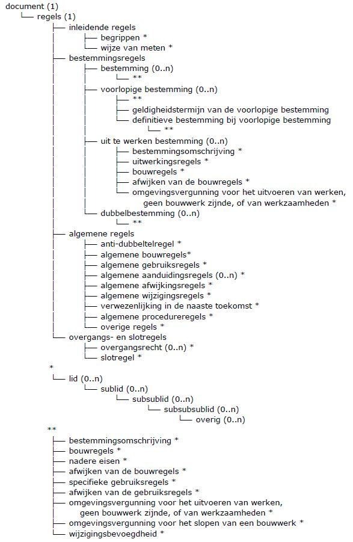

## Werkafspraak tot inwerkingtreding wijziging RO Standaarden

Vanaf publicatie van deze werkafspraak tot het tijdstip van inwerkingtreden van vernieuwde RO Standaarden of omgevingstandaarden dan wel nader bericht van de beheerder van de RO Standaarden geldt de volgende werkafspraak.

Bij objectgerichte planteksten conform IMROPT2012 worden er bij de planregels van bestemmingsplannen bij objecttypen leden en (sub)leden toegestaan conform Figuur 1 van deze werkafspraak.

De tabellen 2 en 3 van IMROPT worden vervangen door Figuur 1, waardoor de structuur van een plantekst voor plantekstschrijvers vrijer wordt.

Figuur 1 Hiërarchie objecttypen bij planteksten

</img>

